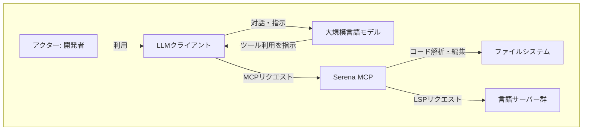
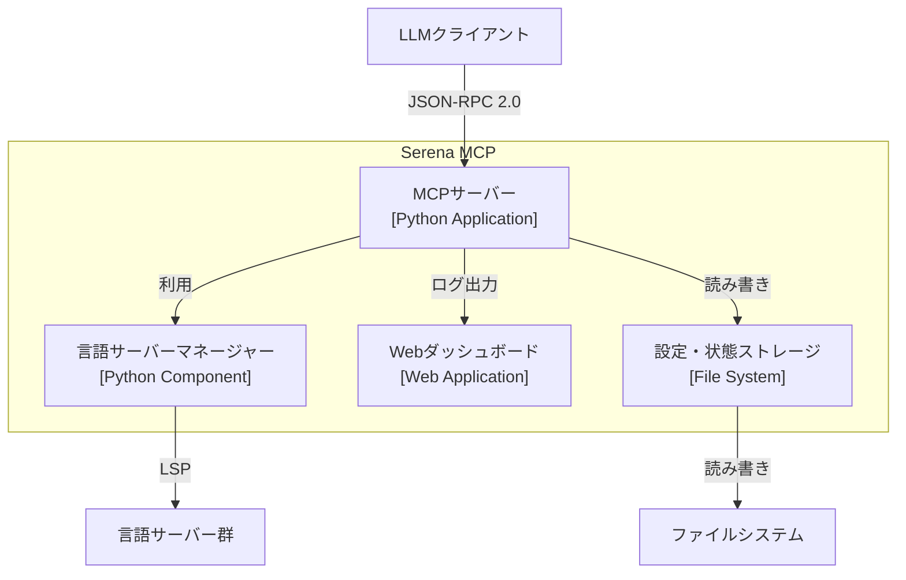
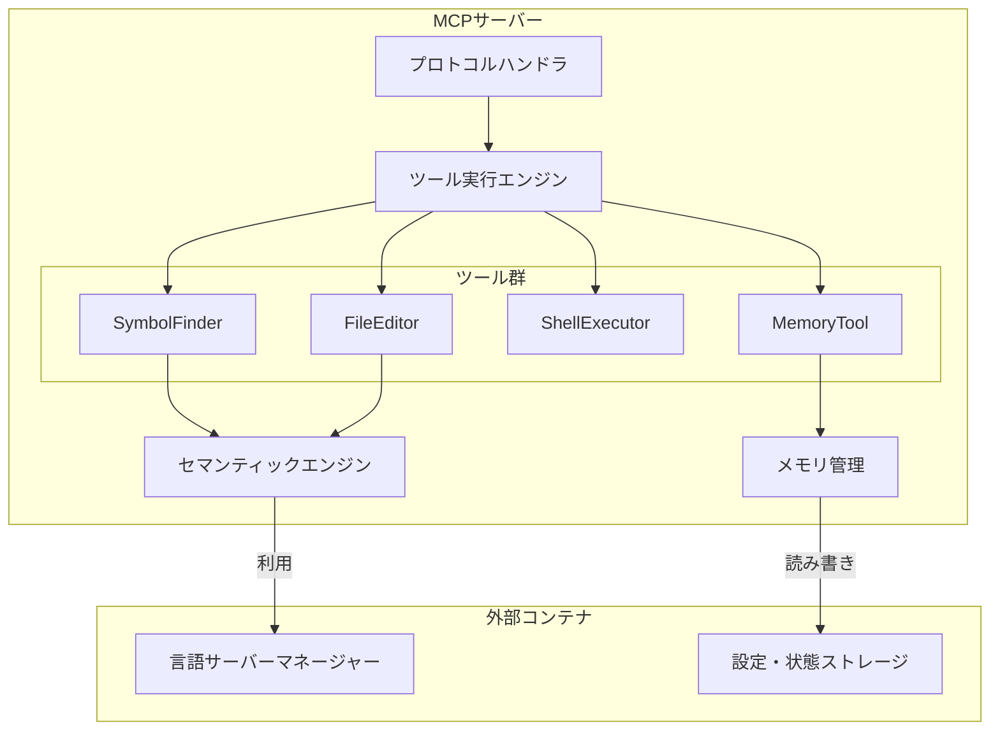
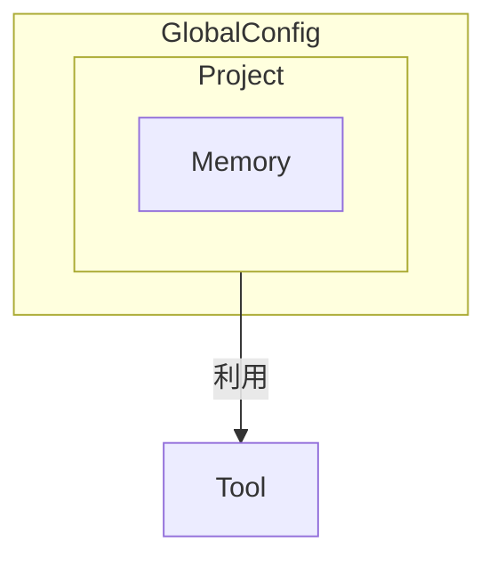
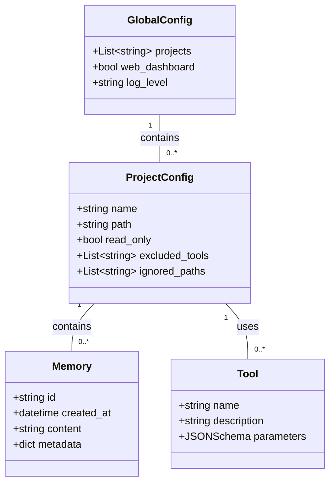

## ■概要

Serena MCPは、大規模言語モデル（LLM）を高性能なAIコーディングエージェントへ進化させる、オープンソースのツールキットです。このシステムは、開発者のローカル環境で動作するサーバーとして、コードベースとLLMとの対話を仲介します。

Serena MCPの目的は、LLMに統合開発環境（IDE）のような高度な機能を提供することにあります。具体的には、意味的なコード検索（セマンティック検索）や記号的なコード編集（シンボリック編集）の能力をLLMに付与します。これにより、AIエージェントの応答精度とトークン効率が大幅に向上し、特に大規模で複雑なコードベースを扱う際に真価を発揮します。

この高精度なコード解析の鍵となるのが、Language Server Protocol（LSP）です。LSPは、現代のIDEがコード補完や定義ジャンプなどの機能で利用する基盤技術です。Serena MCPはLSPを通じてソースコードの構造と意味を深く理解した上で操作するため、一般的なテキスト検索やベクトル検索とは一線を画す、正確で信頼性の高いコード編集を可能にします。

## ■特徴

Serena MCPは、他のAIコーディングツールと異なる、高精度かつ効率的な開発支援を実現するための独自の特徴を備えています。

  * **セマンティックコード解析**
    Language Server Protocol（LSP）を活用した高度なセマンティックコード解析が最大の特徴です。LSPを通じてソースコードを解析し、抽象構文木（AST）を生成します。これにより、コード内の関数や変数などを「シンボル」として構造的に認識し、シンボルテーブルや参照グラフを構築します。この手法は、テキストの類似性に基づくベクトル検索とは本質的に異なります。例えば、「`getUser`関数をリファクタリングする」という指示に対し、`getUser`という文字列を含むコード片を探すのではなく、シンボルそのものと、それが参照されている全箇所を正確に特定できます。

  * **LLMとクライアントの非依存性**
    特定のLLMやクライアントに依存しない、高い柔軟性を持ちます。MCPサーバー、Agnoフレームワーク、ツール直接組み込みの3つの統合方法を提供し、Claude CodeやCursorなど多様なクライアントと連携できます。また、主要なAPIベースのモデルからローカルモデルまで、幅広いLLMをエージェントの頭脳として活用可能です。

  * **ローカル実行とセキュリティ**
    開発者のローカルマシン上で動作し、コード解析もローカル環境内で完結します。ソースコードを外部サーバーに送信しないため、機密性の高いプロジェクトでも安心して利用できます。この「ローカルファースト」の設計思想は、セキュリティを重視する開発現場で大きな利点となります。

  * **状態保持とメモリ機能**
    対話の文脈をセッションを越えて維持する状態保持能力を備えています。プロジェクトでの初回利用時には「オンボーディング」プロセスが実行され、プロジェクト全体の構造をスキャンしてインデックスを生成します。スキャン結果や対話で得た知見は「メモリ」として保存され、文脈に即した応答を可能にします。

  * **動的な挙動制御**
    挙動は「コンテキスト（Contexts）」と「モード（Modes）」によって動的に制御できます。コンテキストは利用シナリオに応じてツールセットを静的に定義します。一方、モードはタスクに合わせてセッション中に動的に切り替え可能で、Serenaの振る舞いを柔軟に調整します。

## ■構造

Serena MCPのアーキテクチャを、C4モデルを用いて抽象度を下げながら段階的に解説します。

### ●システムコンテキスト図

システムが連携する外部システムと、利用するアクターを示します。



| 要素名 | 説明 |
| :--- | :--- |
| **アクター: 開発者** | Serena MCPを介してコーディング支援を受けるエンドユーザー |
| **LLMクライアント** | 開発者が対話を行うインターフェース（IDE、Claude Desktopなど） |
| **大規模言語モデル** | 開発者の指示を解釈し、Serena MCPのツール利用を計画・実行するAIモデル |
| **Serena MCP** | LLMクライアントの要求を受け、コード解析や編集を実行する本システムの対象 |
| **ファイルシステム** | 分析対象のコードやSerena自身の状態が格納されるローカルストレージ |
| **言語サーバー群** | 各言語に特化した解析機能を提供する外部プロセス群（pylsp, goplsなど） |

### ●コンテナ図

Serena MCPシステムを構成する主要な実行可能単位（コンテナ）とその関係性を示します。



| 要素名 | 説明 |
| :--- | :--- |
| **MCPサーバー** | LLMクライアントからのリクエストを受け付ける中心的なPythonアプリケーション |
| **言語サーバーマネージャー** | 各言語のLSPサーバーの起動、管理、通信を担うコンポーネント |
| **Webダッシュボード** | セッションログのリアルタイム表示やサーバーの安全なシャットダウン機能を提供するWebアプリケーション |
| **設定・状態ストレージ** | グローバル設定やプロジェクト固有の状態（キャッシュ、メモリ）を保持するファイル群 |

### ●コンポーネント図

「MCPサーバー」コンテナを構成する内部の主要コンポーネントと、その役割を示します。



| 要素名 | 説明 |
| :--- | :--- |
| **プロトコルハンドラ** | LLMクライアントとの通信を管理し、JSON-RPC 2.0メッセージを解釈 |
| **ツール実行エンジン** | ツール実行要求を受け取り、適切なツールを特定して実行するオーケストレーター |
| **セマンティックエンジン** | 言語サーバーマネージャーを抽象化し、高レベルな意味解析機能をツールに提供 |
| **メモリ管理** | Memoryオブジェクトの読み書きを管理 |
| **SymbolFinder** | `find_symbol`などのツールを実装し、コードシンボルを検索 |
| **FileEditor** | `write_file`などのツールを実装し、ファイルを直接操作 |
| **ShellExecutor** | `execute_shell_command`ツールを実装し、任意のシェルコマンドを実行 |
| **MemoryTool** | メモリの作成、読み取り、削除を行うツールを実装 |

## ■情報

Serena MCPが内部で扱うデータ構造を、概念モデルと情報モデルで解説します。

### ●概念モデル

システムが扱う主要な情報エンティティ間の関係性を示します。



| 要素名 | 説明 |
| :--- | :--- |
| **GlobalConfig** | Serena全体のグローバルな設定 |
| **Project** | 個別コードベースの設定と状態 |
| **Memory** | プロジェクトの知見や対話履歴を保存する単位 |
| **Tool** | LLMがコード操作のために呼び出す機能 |

### ●情報モデル

主要エンティティが持つ属性をクラス図形式で示します。



| クラス名 | 説明 |
| :--- | :--- |
| **GlobalConfig** | `~/.serena/serena_config.yml` に対応するグローバル設定 |
| **ProjectConfig** | `.serena/project.yml` に対応するプロジェクト固有の設定 |
| **Memory** | `.serena/memories/` 内に保存される個々のメモリファイル |
| **Tool** | LLMに提供される、名前、説明、引数スキーマで構成されるツール |

## ■構築方法

Serena MCPをローカル環境にセットアップする方法を3通り紹介します。

### ●uvxを利用した推奨インストール

最も簡単で推奨される方法です。ローカルのPython環境を汚さずにSerenaを仮想環境で実行します。

1.  **コマンド実行**
    ターミナルで以下のコマンドを実行すると、Serena MCPサーバーが起動します。

    ```bash
    uvx --from git+https://github.com/oraios/serena serena start-mcp-server
    ```

2.  **概要**
    `uvx`は、指定されたパッケージを一時的な環境にインストールして実行するツールです。これにより、Serenaの依存関係がグローバル環境などにインストールされる事態を防ぎます。

### ●ローカルへのクローンとインストール

ソースコードの編集や開発への貢献をしたい場合に適した方法です。

1.  **リポジトリのクローン**

    ```bash
    git clone https://github.com/oraios/serena
    ```

2.  **ディレクトリの移動**

    ```bash
    cd serena
    ```

3.  **依存関係のインストール**
    編集可能モードでセットアップします。

    ```bash
    uv pip install -e .
    ```

4.  **サーバーの起動**

    ```bash
    uv run serena start-mcp-server
    ```

### ●Dockerを利用したインストール

セキュリティを強化したい場合や、実行環境の一貫性を確保したい場合に有効です。

1.  **コマンド実行**
    `/path/to/your/projects`は、ホストマシン上のプロジェクトディレクトリの絶対パスに置き換えてください。

    ```bash
    docker run --rm -i --network host -v /path/to/your/projects:/workspaces/projects ghcr.io/oraios/serena:latest serena start-mcp-server --transport stdio
    ```

2.  **概要**
    このコマンドはSerenaのDockerイメージを取得してコンテナを起動します。`-v`オプションでホストのディレクトリをマウントし、Serenaがローカルのコードにアクセスできるようにします。

## ■利用方法

Serena MCPをインストールした後、LLMクライアントと連携させる手順を解説します。

### ●クライアント設定

使用するLLMクライアントにSerena MCPサーバーを登録します。

  * **Claude Codeの場合**
    プロジェクトのルートで以下のコマンドを実行し、`serena`という名前のMCPサーバーを追加します。

    ```bash
    claude mcp add serena -- uvx --from git+https://github.com/oraios/serena serena start-mcp-server --context ide-assistant --project $(pwd)
    ```

      * `--context ide-assistant`: IDE利用に最適化されたツールセットを有効化
      * `--project $(pwd)`: 現在のディレクトリを操作対象として指定

  * **Cursor / VSCodeの場合**
    `mcp.json`ファイルに以下の設定を追記します。

    ```json
    {
      "mcpServers": {
        "serena": {
          "command": "uvx",
          "args": [
            "--from",
            "git+https://github.com/oraios/serena",
            "serena",
            "start-mcp-server",
            "--context",
            "ide-assistant"
          ]
        }
      }
    }
    ```

### ●プロジェクトの有効化と初期化

新しいプロジェクトでSerenaを初めて使用する際には、有効化と初期化が必要です。

1.  **プロジェクトの有効化**
    LLMとのチャットで、プロジェクトの絶対パスを指定して有効化を指示します。

    > "Activate the project /path/to/my\_project"

2.  **オンボーディング（初期化）**
    次に、チャットで以下のコマンドを実行します。Serenaがプロジェクトをスキャンし、初期インデックスとメモリを作成します。

    > /mcp\_\_serena\_\_initial\_instructions

### ●インデックス作成によるパフォーマンス向上

大規模プロジェクトでは、事前のインデックス作成がツールの応答速度向上のために推奨されます。プロジェクトのルートで以下のコマンドを実行します。

```bash
uvx --from git+https://github.com/oraios/serena serena project index
```

### ●主要なツールと利用シナリオ

Serenaの能力を引き出すには、ツール、コンテキスト、モードの理解が重要です。

**表1. Serena MCP 主要ツール一覧**
| ツール名 | 説明 | 利用シナリオ例 |
| :--- | :--- | :--- |
| `find_symbol` | 指定シンボル（関数、クラス等）をプロジェクトから検索 | 「`calculate_price`関数の定義を検索」 |
| `find_referencing_symbols` | 特定シンボルを参照している全箇所を検索 | 「この`User`クラスの使用箇所の検索」 |
| `replace_symbol_body` | シンボル名を指定し、その本体を置換 | 「`process_data`関数の実装を効率的なアルゴリズムに変更」 |
| `read_file` | 指定ファイルの全内容を読み取り | 「`config.py`の内容を確認」 |
| `write_file` | 新規ファイル作成、または既存ファイルを上書き | 「テストファイル`test_api.py`を新規作成」 |
| `execute_shell_command` | 任意シェルコマンドを実行し、出力を取得 | 「`npm install`を実行して依存関係を更新」 |
| `create_memory` | 現在の対話に関する情報を永続メモリとして保存 | 「このリファクタリング計画を『API改善』として記憶」 |

**表2. Serena MCP コンテキストとモード**
| 種別 | 名前 | 説明 |
| :--- | :--- | :--- |
| **Context** | `ide-assistant` | IDEでの利用に最適化されたデフォルトのコンテキスト |
| **Context** | `agent` | Serenaを自律エージェントとして使用するシナリオ向けのコンテキスト |
| **Mode** | `planning` | 詳細な実装計画を立てさせるモード。コード変更は実行しない |
| **Mode** | `editing` | 実際にコードの読み書きや編集を行うモード |
| **Mode** | `interactive` | ユーザーとの対話を重視し、LLMがより多くの質問をするモード |

## ■運用

システムの継続利用における監視、セキュリティ、バックアップ、アップグレード方法を解説します。

### ●監視

  * **Webダッシュボードの活用**
    SerenaはデフォルトでWebダッシュボード（`http://localhost:24282/dashboard/index.html`）を起動します。リアルタイムログの確認や、サーバーの安全なシャットダウンが可能です。一部クライアントがプロセスを正常に終了できない場合に有用です。

  * **リソース使用率の確認**
    実行中にCPU使用率が高くなるという報告があります。パフォーマンスに影響が出る場合は、タスクマネージャーなどでリソース使用状況を監視してください。

### ●セキュリティ

`execute_shell_command`ツールは、LLMにローカルマシンで任意コマンドの実行権限を与えるため、潜在的なセキュリティリスクがあります。

  * **リスク**
    悪意のあるプロンプトや予期せぬLLMの振る舞いにより、意図しないコマンドが実行される可能性があります。

  * **緩和策**

    1.  **Dockerコンテナの利用**
        SerenaをDocker内で実行し、ファイルシステムやプロセスをホストマシンから隔離します。
    2.  **読み取り専用モード**
        プロジェクト設定ファイルで`read_only: true`を設定し、ファイル編集やシェル実行などの書き込み系ツールを全て無効化します。
    3.  **ツールの個別無効化**
        特定のツールのみを無効にするには、プロジェクト設定ファイルの`excluded_tools`リストにツール名を追加します。

### ●バックアップとリストア

設定と生成された状態（メモリなど）をバックアップすることで、環境の移行や復元が容易になります。

  * **バックアップ対象**

      * **グローバル設定**: `serena_config.yml`（例: Linuxでは`~/.config/serena/serena_config.yml`）
      * **プロジェクト固有の状態**: プロジェクトルートに生成される`.serena`ディレクトリ全体

  * **バックアップ方法**
    グローバル設定ファイルはdotfilesリポジトリなどでバージョン管理することを推奨します。プロジェクトの`.serena`ディレクトリは、プロジェクトのバックアップに含めるか、Git管理下では`.serena/cache`などを`.gitignore`に追加します。

### ●アップグレード

  * **uvxを利用している場合**
    `uvx`は実行のたびに最新ソースを取得するため、特別なアップグレード作業は不要です。

  * **ローカルにクローンしている場合**
    Serenaのディレクトリで以下のコマンドを実行し、最新のソースコードを取得します。

    ```bash
    git pull origin main
    ```

  * **アップグレード時の注意**
    アップグレード前には、公式リポジトリのリリースノートを確認し、破壊的変更がないかを確認してください。

## ■おわりに
本記事では、AIコーディングエージェントツールキット「Serena MCP」について、その核心的な価値からアーキテクチャ、具体的な利用方法、そして実用的な運用TIPSまでを網羅的に解説しました。

LSPを活用した高精度なセマンティック（意味的）なコード解析・編集能力は、これまでのテキストベースのAIコーディングが抱えていた限界を超える大きな可能性を秘めています。セットアップも非常に簡単なので、ぜひあなたの開発環境に導入し、"覚醒"したAIとのコーディングを体験してみてください。

この記事が少しでも参考になった、あるいは改善点などがあれば、ぜひリアクションやコメント、SNSでのシェアをいただけると励みになります！

## ■参考リンク

### ●公式情報

  - **GitHub**
      - [oraios/serena: A powerful coding agent toolkit providing semantic retrieval and editing capabilities (MCP server & Agno integration)](https://github.com/oraios/serena)
      - [Discussions · oraios/serena](https://github.com/oraios/serena/discussions)
      - [Issues · oraios/serena](https://github.com/oraios/serena/issues)

### ●解説記事・ブログ

  - **a16z.com**
      - [A Deep Dive into MCP and the Future of AI Tooling](https://a16z.com/a-deep-dive-into-mcp-and-the-future-of-ai-tooling/)
  - **DevelopersIO**
      - [Claudeでmcpにserenaを追加しようとしてハマった話 - DevelopersIO](https://dev.classmethod.jp/articles/20250804-story-about-how-i-got-stuck-trying-to-add-serena-to-mcp-with-claude/)
  - **note**
      - [AIコーディングの常識が変わる！Claudeを"覚醒"させる知性 ... - note](https://note.com/kyutaro15/n/n61a8825fe303)
      - [【衝撃】Claude Codeの隠し機能「Serena MCP」がヤバすぎるｗｗｗプロジェクト自動解析で爆速開発できるって知ってた？？お前ら絶対使ってないだろこれｗｗｗ - note](https://note.com/unikoukokun/n/ne1be07f1d25a)
  - **Peerlist**
      - [Understanding MCP: A Deep-Dive into the Model-Context Protoco](https://peerlist.io/yashkavaiya/articles/understanding-mcp-a-deep-dive-into-the-model-context-protoco)
  - **Python in Plain English**
      - [Serena MCP: The Game-Changing Free Alternative to Premium AI Coding Tools](https://python.plainenglish.io/serena-mcp-the-game-changing-free-alternative-to-premium-ai-coding-tools-4b44d9533932)
  - **Qiita**
      - [このMCPはプロジェクト全体を把握 VSCode GitHub Copilotで ...](https://qiita.com/masakinihirota/items/a2c0ef5e6f9a0aa868d1)
  - **Zenn**
      - [ClaudeCode、CursorのMCPサーバー設定 - Zenn](https://zenn.dev/keitakn/scraps/8c6743518a637d)

### ●関連ツール・コミュニティ

  - **LobeHub**
      - [Serena | MCP Servers - LobeHub](https://lobehub.com/mcp/oraios-serena)
  - **Playbooks**
      - [Serena MCP server for AI agents - Playbooks](https://playbooks.com/mcp/oraios-serena)
  - **SERP**
      - [oraios/serena · MCP Server Details | SERP](https://serp.co/mcp/servers/oraios-serena/)
  - **Reddit**
      - [Am I the only who is not finding any value in Serena MCP or MCPs in general? (using Claude Code) - Reddit](https://www.reddit.com/r/ClaudeAI/comments/1lrfasa/am_i_the_only_who_is_not_finding_any_value_in/)
      - [Claude and Serena MCP - a dream team for coding : r/ClaudeAI](https://www.reddit.com/r/ClaudeAI/comments/1l42cn6/claude_and_serena_mcp_a_dream_team_for_coding/)
      - [MCP servers are scary unsafe, always check who's behind them... : r/ClaudeAI](https://www.reddit.com/r/ClaudeAI/comments/1mbavej/mcp_servers_are_scary_unsafe_always_check_whos/)
      - [Supercharge Claude Code with Symbolic Tools : r/ClaudeAI](https://www.reddit.com/r/ClaudeAI/comments/1ldod3c/supercharge_claude_code_with_symbolic_tools/)
      - [Try out Serena MCP. Thank me later. : r/ClaudeAI - Reddit](https://www.reddit.com/r/ClaudeAI/comments/1lfsdll/try_out_serena_mcp_thank_me_later/)

