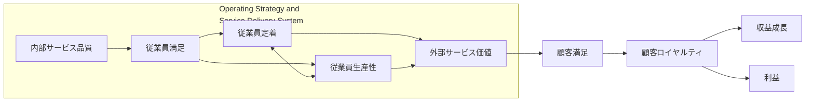

「従業員満足を上げれば顧客満足が上がり、利益が増える」。サービス業の経営でよく語られるこの連鎖には、サービスプロフィットチェーン（Service Profit Chain、SPC）という 1994 年発表の枠組みが背後にあります。この記事では、原典が何を主張したのか、その後の実証研究がどこまでリンクを支持し、どこで壊れたのか、そして自分の現場でどう使うかを整理します。

対象読者は、サービス事業や組織開発の実務者、および「ES から利益へ」という説明を根拠つきで使いたい人です。読み終えると、社内スライドに載っている数字をどこまで信じてよいか、チェーン図を設計原理にしてよいかを判断できるようになります。原典の事例数字の多くは企業内部データであり、再現用の生データは公開されていません。

*この記事の全体像。以下、順に解説します。*

## サービスプロフィットチェーンとは

サービスプロフィットチェーンは、サービス事業の利益と成長を、内部サービス品質、従業員の態度と行動、外部サービス価値、顧客の態度と行動の一連のリンクとして記述する経営フレームワークです。

1994 年 3〜4 月号の *Harvard Business Review* に掲載された論文「Putting the Service-Profit Chain to Work」で提示されました。著者はハーバード・ビジネス・スクールを中心とする James L. Heskett、Thomas O. Jones、Gary W. Loveman、W. Earl Sasser Jr.、Leonard A. Schlesinger の 5 名です。2008 年 7〜8 月号には HBR Classic として再録されています。日本語では 1994 年 7 月号のダイヤモンド・ハーバード・ビジネス・レビューが「サービス・プロフィット・チェーンの実践法」として訳出しました。

### 何を主張しているか

原典は、利益側から順に 5 つのリンクを、成功企業の観察から導いた命題（propositions）として置いています。

1. 利益と成長は、主として顧客ロイヤルティが刺激する
2. ロイヤルティは、顧客満足の直接の結果である
3. 満足は、顧客に提供されたサービスの価値に大きく左右される
4. 価値は、満足しロイヤルで生産的な従業員が創る
5. 従業員満足は、顧客へ成果を出せる高品質の支援サービスと方針から主に生じる

特徴を要約すると次のとおりです。

- 利益・成長の主因を、市場シェアではなく顧客ロイヤルティに置く
- 顧客満足を「顧客が受け取る価値」（成果 ÷ 総コスト）に結びつける
- 価値の源泉を、満足しロイヤルで生産的な従業員に置く
- 従業員満足の源泉を、成果を出せる内部支援（職場設計、職務設計、採用と育成、報酬と認知、顧客対応ツール）に置く
- ソフト指標（満足、ロイヤルティ）にハードな数値を載せ、投資先を選ぶための監査質問（Service-Profit Chain Audit）を添える
- リーダーシップをチェーン全体の下敷きにする（現場に出る CEO、態度を基準にした採用）

### 構造

原典の図「The Links in the Service-Profit Chain」に沿った構造です。左半分の「Operating Strategy and Service Delivery System」が企業の内側、右半分が顧客側です。

内部サービス品質は、原典の図では次の 5 要素で構成されています。

- 職場設計（workplace design）
- 職務設計（job design）
- 従業員の選抜と育成（employee selection and development）
- 報酬と認知（employee rewards and recognition）
- 顧客対応のためのツール（tools for serving customers）

顧客ロイヤルティは、維持（retention）、リピート（repeat business）、紹介（referral）の 3 つで観測します。

### 監査質問という道具

原典が図とともに渡しているのが、Service-Profit Chain Audit です。利益と成長、顧客満足、外部サービス価値、生産性、従業員ロイヤルティ、従業員満足、内部サービス品質、リーダーシップ、そして指標間の関係、というカテゴリごとに「何を測っているか」を問う質問群です。原典はこの質問群を、現場の内部品質から財務までを一枚でたどる計測の出発点として経営者に渡しています。

### 後続の拡張

著者らは 1997 年に書籍 *The Service Profit Chain*（邦訳『カスタマー・ロイヤルティの経営』、1998 年）を出し、2003 年の *The Value Profit Chain*（邦訳『バリュー・プロフィット・チェーン』、2004 年）、2008 年の Ownership Quotient へと拡張しています。

## 注意点

原典と二次解説には印象的な数字が多く登場します。それぞれの出どころと、読んでよい範囲を先に固定しておきます。

### よく流通する数字の読み方

| よく流通する数字 | 出どころ | 読んでよい範囲 |
|---|---|---|
| 顧客ロイヤルティ 5% 増で利益 25〜85% 増 | 原典が Reichheld & Sasser（HBR 1990 年 9〜10 月号）の推定として引用 | SPC 著者の独自計測ではない。1990 年論文では業種別に銀行支店 +85%、保険ブローカー +50%、自動車サービス +30% など。「25〜85%」はチャート名の幅 |
| Taco Bell の離職率下位 20% 店舗は、上位 20% より売上 2 倍・利益 55% 高い | 原典の店舗間比較 | 社内分析であり因果識別ではない。「離職率が 20% の店舗」という意味でもない |
| Xerox で満足度 5 の顧客は 4 の顧客より再購入が 6 倍 | 原典。1991 年、年 48 万人調査 | 「very satisfied」と「satisfied」の間の非線形を示す。4 を目標にするな、という話 |
| Sears で従業員態度 5 単位改善 → 顧客印象 1.3 単位 → 売上成長率 +0.5 ポイント | Rucci, Kirn, Quinn（HBR 1998 年） | 社内モデルの自己申告。Sears Holdings は 2018 年に Chapter 11 を申請しており、1998 年時点の予測力を持続の証明には使えない |
| ピザ店の顧客生涯収益 8,000 ドル、キャデラックは 332,000 ドル | 原典の例示 | 計算根拠は本文にない。生涯価値の大きさを示すレトリック |

### 包括メタ分析が示すこと

Hogreve, Iseke, Derfuss, Eller（2017 年、*Journal of Marketing*）は、SPC のリンクを包括的にテストしたメタ分析です。公式抄録は、提案されたリンクがすべて統計的に有意で substantial だと述べています。本文では 518 研究、576 独立データセット、1,591 の相関を扱ったとされます（この 3 つの数は公式抄録には載っていません）。

同時に、抄録は次の 3 点も述べています。

- 効果量はサービス類型によってかなりばらつく
- 内部サービス品質は、従業員満足以外のメカニズムでも業績に翻訳される
- 「従業員満足と外部サービス品質を常に最大化すれば企業業績が最適になる」という SPC の暗黙の論理に挑戦する

つまり「平均としてリンクは立つ」と「最大化すればよいわけではない」が同じ論文に併記されています。リンク別の相関係数はこの記事では扱いません。

### 実証研究の方法の偏り

Hogreve, Iseke, Derfuss（2022 年、*Journal of Service Research*）は 1995〜2020 年の実証研究 153 本をレビューし、方法の分布を集計しました。サーベイが 85.6%、横断研究が 75.8%、実験はわずか 2 本です。従業員満足が顧客満足に映るという「satisfaction mirror」には、weak empirical evidence というラベルが付いています。原典モデルそのものの適合は poor と言い直されています。

### 日本語圏での短縮

日本での普及経路は「CS 戦略」です。実務ブログでは ES → CS → 利益の 3 点循環に短縮され、外部サービス**価値**がサービス**品質**に置き換わることが多く見られます。原典の図にある service concept と内部サービス品質の 5 要素は落ちやすい部分です。コンサルティング会社が CS/ES を CIS/EIS（感動満足）に言い換える例もありますが、これは独自拡張であり原典にはありません。

## 実証はリンクを支持しているか

平均ではつながります。ただし単相関と媒介、業種、接触強度によって符号と大きさが変わります。

### 支持する研究

Yee, Yeung, Cheng（2008 年、*Journal of Operations Management*）は香港の高接触サービス 206 店舗で SPC を検証しました。仮説モデルの標準化パス係数は次のとおりです。

| パス | 係数 |
|---|---|
| 従業員満足 → サービス品質 | 0.423 |
| サービス品質 → 顧客満足 | 0.287 |
| 従業員満足 → 顧客満足 | 0.234 |
| 顧客満足 → 利益 | 0.270 |

同じ研究の競合モデルでは、利益 → 従業員満足という戻りのパス（0.181）が見つかっています。2011 年の続報（210 店舗）では、従業員満足 → 従業員ロイヤルティ 0.770、顧客満足 → 顧客ロイヤルティ 0.863、利益 → 従業員満足 0.164 と報告されています。利益から従業員満足への戻りは、原典が書いた「業績が悪いと内部投資を削る」というフィードバックと整合します。

鈴木研一・松岡孝介（2014 年、『管理会計学』）は日本のホテルチェーン 1 社（162 ホテル年）で、従業員満足 → 接客品質 → 顧客満足 → GOPAR（客室あたり営業総利益）のパスが有意だと示しました。係数は順に .242、.547、.191 です。注目すべきは、従業員満足と GOPAR の**単相関は −.159（p<.05）で負**だった点です。媒介変数を入れると間接効果は正になります。従業員満足から顧客満足への直接パス（情動伝染）は .079 で非有意でした。

### 支持しない研究

- **英国の食品スーパー**: Silvestro & Cross（2000 年）は、従業員満足・ロイヤルティが利益を駆動するという主張を支持せず、従業員の不満足と店舗収益性に強い相関を報告しています。Silvestro（2002 年）では、最も収益性の高い店舗の従業員が最も不満足で、勤続年数も生産性・収益性と逆相関に見えました。
- **英国の DIY 小売 75 店舗**: Pritchard & Silvestro（2005 年）は、チェーン図の無批判な適用を「managerial strait-jacket（経営の拘束衣）」と呼んでいます。
- **日本の宿泊施設 552 件**: 犬塚篤（2023 年、『JSMD レビュー』）は、従業員満足が 6 つのサービス機能すべてで顧客満足に非有意だったと報告しています。顧客満足に正で有意だったのは顧客向け組織市民行動（OCB-C）で、しかもサービス・食事・立地の 3 機能に限られました。鏡に映るのは従業員の満足ではなく行動、という結果です。
- **品質投資の過剰**: Rust, Zahorik, Keiningham（1995 年、*Journal of Marketing*）は Return on Quality（ROQ）を提案し、「品質に使いすぎることはあり得る」と述べています。
- **忠誠の対象のずれ**: sweethearting とは、フロントライン従業員が共謀する顧客に無許可の無料提供や値引きを行うことです。Brady, Voorhees, Brusco（2012 年、*Journal of Marketing*）は、この行為が企業の顧客満足・ロイヤルティ・口コミ指標を最大 9% 水増しし、その効果は企業ではなく当該従業員個人への満足に帰属すると示しています。従業員ロイヤルティから顧客ロイヤルティへのリンクが、企業への忠誠ではなく従業員個人への忠誠になり得るという反例です。

### どう読むか

対人サービスであることだけでは、チェーンを設計原理にする十分条件になりません。マス小売の効率圧力、宿泊業での「態度ではなく行動」、品質の費用、忠誠の対象の食い違いが、同じ対人領域でチェーンを折っています。一方で、高接触の小型店や、媒介を丁寧に置いたホテルの分析ではチェーンが立ちます。平均の正リンクと、条件付きの負・非有意・逆因果は両立します。

## 自分の現場でどう使うか

結論から言うと、SPC は診断と計測の地図として使い、単線の設計原理（満足を最大化すれば利益が最大化する）としては採用しない、という扱いが妥当です。

### 選択肢の比較

| 基準 | 原典 SPC を最大化する | 修正 SPC を計測フレームにする | NPS / CS 単独 | ROQ で投資判断する |
|---|---|---|---|---|
| 一次資料との整合 | レトリックには合うが、命題宣言とはずれる | 2017 年メタ分析・2022 年改訂と整合 | 別指標。1990 年論文と祖先は共通 | Rust 1995 と整合 |
| 因果の頑健性 | 低い（横断・社内事例） | 平均効果は支持。原典モデルの適合は poor で、改訂図自体の検証は別途必要 | 顧客側だけ | 費用を明示できる |
| 計測可能性 | Audit の質問は使える | リンクが増え運用が重い | 1 問で軽い | 施策単位の ROI |
| 業種適合 | 高接触・労働集約で立ちやすい | コンティンジェンシーを認める | チャネルを問わない | 品質投資の過剰を止められる |
| 実務コスト | サーベイ負荷が大きい | さらに大きい | 小さい | 中程度（財務と品質の結合） |
| リスク | 拘束衣。ES を上げても利益が動かない、または逆 | 複雑化して使われない | 内部品質の盲点 | 従業員側の診断が薄い |

条件ごとの向き不向きは次のとおりです。

- **修正 SPC が向く**: 対人接点があり、内部品質と顧客成果を同じ単位（店舗・チーム）で測れる場合。最大化ではなく監査とコンティンジェンシーとして使う
- **ROQ が向く**: 品質投資の費用が利益を食う業種。銀行オペレーションやセルフサービスの追加など
- **NPS / CS 単独が向く**: まず顧客維持だけを短いサイクルで見たい場合。内部は別途測る
- **原典どおりの最大化が向く条件は狭い**: 原典の成功企業の物語を再現したい場合に限られ、推奨しない

### 最初に取るアクション

1. Audit のカテゴリに沿って、「今測っている指標」と「測っていないリンク」を 1 枚にする
2. 店舗・チーム単位で、従業員満足と利益の**単相関の符号**を先に見る。正だから採用、負だから廃棄、と即断しない（ホテルの研究では単相関が負でも媒介を入れると正だった）
3. 顧客向けの役割外行動（OCB-C）と内部向けの役割外行動（OCB-I）を、従業員満足とは分けて取る
4. 「5% → 25〜85%」を社内スライドに使わない。使うなら Reichheld & Sasser 1990 の業種別の幅として出典を付ける

### 適用を止める条件

- 自組織のデータで、媒介変数と時間差を入れて検証しても従業員満足と貢献利益が安定して負（英国スーパー型）なら、チェーン図の適用を止める。単相関が負というだけでは止めない
- 顧客接触がほぼ自動化され、内部品質の実体がツールとアルゴリズムであるなら、1994 年の図をそのまま使わず、2022 年改訂が示す AI 込みの再想像側で測る
- 品質コストが利益を直接削っているなら、ROQ を主、SPC を従にする

### 運用上のリスク

- サーベイを増やすと現場負荷が上がり、内部サービス品質そのものを毀損しうる
- 忠誠の対象を企業に固定すると、sweethearting や顧客個人への忠誠を見落とす
- セルフサービスでは満足と維持が分離しうる。Buell, Campbell, Frei（2010 年）は米国リテール銀行のマルチチャネル顧客で、セルフサービス比率が高い顧客は満足度が同等かより低いのに、スイッチングコストのために離反しにくいと示している
- 「ES を上げれば利益」は原典の短縮であり、原典の 5 命題と内部 5 要素を落としている

## 未解決の問い

- Hogreve 2017 年のリンク別効果量は、本文の表を確認する必要がある
- ナレッジワーク、B2B ソフトウェア、エージェント運用での直接テストは乏しい。Yee 2008 年は会計・法律を対象から自己除外しており、Hogreve 2022 年のレビューでも B2B は標本の 11.8% にとどまる
- 2022 年改訂図（well-being、AI、ロイヤルティの対象分化）のフィールド検証はこれから
- 生涯価値の例示額や、日本語二次資料に混ざるコンサルティング会社の数値は根拠が弱い

知識労働への適用は、確信度を下げて試す段階です。その場合は「フロントラインの満足」より「成果を出せる内部ツールと負荷」を独立変数に置くパイロットが候補になります。

## まとめ

- サービスプロフィットチェーンは、内部サービス品質から利益までを 5 つの命題でつないだ 1994 年の枠組みで、計測地図としての Audit を伴う
- よく流通する「5% → 25〜85%」は 1990 年の別論文の業種別推定であり、SPC 著者の計測ではない
- メタ分析では平均のリンクは有意だが、効果量は業種でばらつき、「常に最大化せよ」という論理は支持されない
- 英国スーパーや日本の宿泊業では、従業員満足が利益や顧客満足につながらない、または逆の結果が出ている
- 診断と計測の地図として使い、設計原理としては修正版の読み（補完パス、非線形、コンティンジェンシー、最大化しない）に切り替える

この記事が少しでも参考になった、あるいは改善点などがあれば、ぜひリアクションやコメント、SNSでのシェアをいただけると励みになります！

## 参考リンク

- Heskett, J. L., Jones, T. O., Loveman, G. W., Sasser, W. E., Jr., & Schlesinger, L. A. (1994). Putting the service-profit chain to work. *Harvard Business Review, 72*(2), 164–174. https://hbr.org/1994/03/putting-the-service-profit-chain-to-work-2
- ヘスケットほか (1994). サービス・プロフィット・チェーンの実践法. *ダイヤモンド・ハーバード・ビジネス・レビュー* 1994 年 7 月号. https://dhbr.diamond.jp/articles/-/13369
- HBS Faculty & Research: Putting the Service-Profit Chain to Work. https://www.hbs.edu/faculty/Pages/item.aspx?num=9149
- Reichheld, F. F., & Sasser, W. E., Jr. (1990). Zero defections: Quality comes to services. *Harvard Business Review, 68*(5), 105–111.
- Rucci, A. J., Kirn, S. P., & Quinn, R. T. (1998). The employee-customer-profit chain at Sears. *Harvard Business Review, 76*(1), 82–97.
- Hogreve, J., Iseke, A., Derfuss, K., & Eller, T. (2017). The service–profit chain: A meta-analytic test of a comprehensive theoretical framework. *Journal of Marketing, 81*(3), 41–61. https://doi.org/10.1509/jm.15.0395
- Hogreve, J., Iseke, A., & Derfuss, K. (2022). The service-profit chain: Reflections, revisions, and reimaginations. *Journal of Service Research, 25*(3), 460–477. https://doi.org/10.1177/10946705211052410
- Yee, R. W. Y., Yeung, A. C. L., & Cheng, T. C. E. (2008). The impact of employee satisfaction on quality and profitability in high-contact service industries. *Journal of Operations Management, 26*(6), 651–668. https://doi.org/10.1016/j.jom.2008.01.001
- Yee, R. W. Y., Yeung, A. C. L., & Cheng, T. C. E. (2011). The service-profit chain: An empirical analysis in high-contact service industries. *International Journal of Production Economics, 130*(2), 236–245.
- 鈴木研一・松岡孝介 (2014). 従業員満足度，顧客満足度，財務業績の関係―ホスピタリティ産業における検証―. *管理会計学, 22*(1), 3–25. https://doi.org/10.24747/jma.22.1_3
- 犬塚篤 (2023). 満足ミラー効果の再検証―鏡に映し出されたものは，従業員の満足かそれとも行動か―. *JSMDレビュー, 7*(2), 9–16. https://doi.org/10.32299/jsmdreview.7.2_9
- Silvestro, R., & Cross, S. (2000). Applying the service profit chain in a retail environment. *International Journal of Service Industry Management, 11*(3), 244–268. https://doi.org/10.1108/09564230010340760
- Silvestro, R. (2002). Dispelling the modern myth: Employee satisfaction and loyalty drive service profitability. *International Journal of Operations & Production Management, 22*(1), 30–49. https://doi.org/10.1108/01443570210412060
- Pritchard, M., & Silvestro, R. (2005). Applying the service profit chain to analyse retail performance: The case of the managerial strait-jacket? *International Journal of Service Industry Management, 16*(4), 337–356.
- Rust, R. T., Zahorik, A. J., & Keiningham, T. L. (1995). Return on quality (ROQ): Making service quality financially accountable. *Journal of Marketing, 59*(2), 58–70.
- Brady, M. K., Voorhees, C. M., & Brusco, M. J. (2012). Service sweethearting: Its antecedents and customer consequences. *Journal of Marketing, 76*(2), 81–98. https://doi.org/10.1509/jm.09.0420
- Buell, R. W., Campbell, D., & Frei, F. X. (2010). Are self-service customers satisfied or stuck? *Production and Operations Management, 19*(6), 679–697. https://doi.org/10.1111/j.1937-5956.2010.01151.x
- Heskett, J. L., Sasser, W. E., Jr., & Schlesinger, L. A. (1997). *The Service Profit Chain*. Free Press. 邦訳『カスタマー・ロイヤルティの経営』(日本経済新聞社, 1998)
- Heskett, J. L., Sasser, W. E., Jr., & Schlesinger, L. A. (2003). *The Value Profit Chain*. Free Press. 邦訳『バリュー・プロフィット・チェーン』(日本経済新聞社, 2004)
- Heskett, J. L., Sasser, W. E., Jr., & Wheeler, J. (2008). *Ownership Quotient: Putting the Service Profit Chain to Work for Unbeatable Competitive Advantage*. Harvard Business Press. https://www.hbs.edu/faculty/Pages/item.aspx?num=34971
