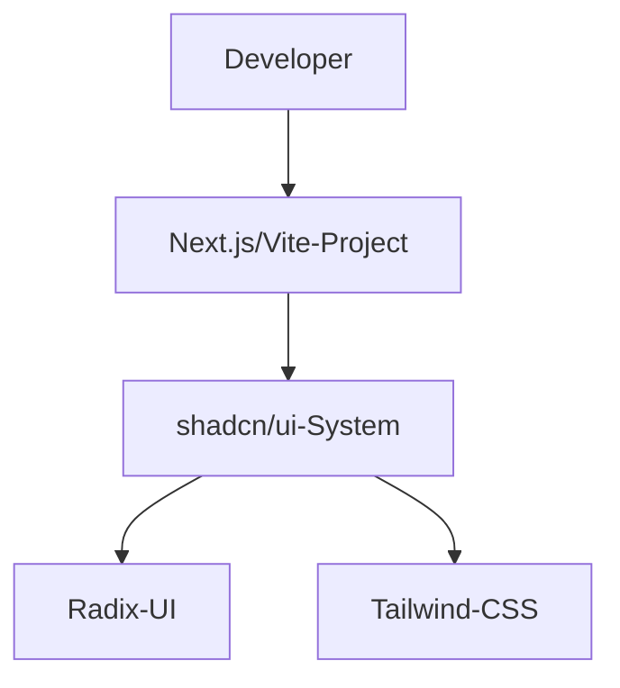
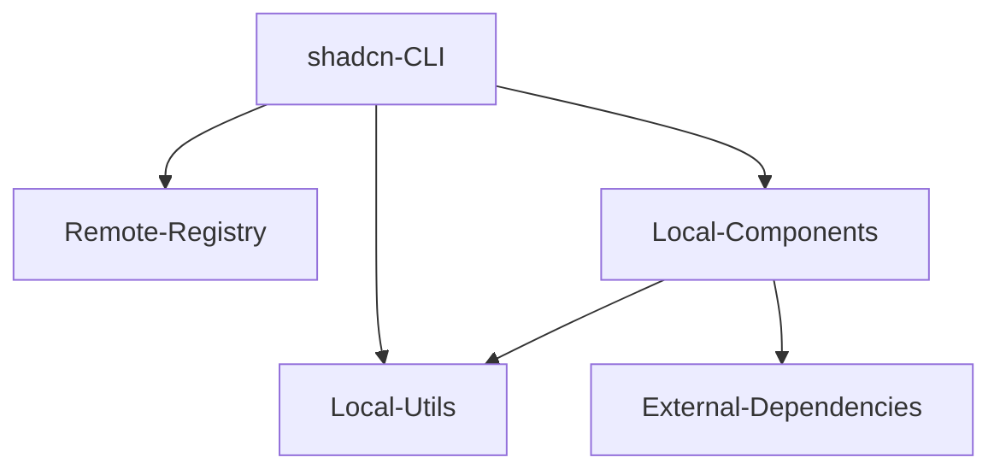
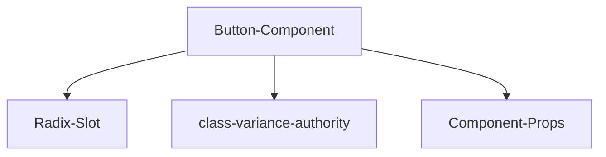
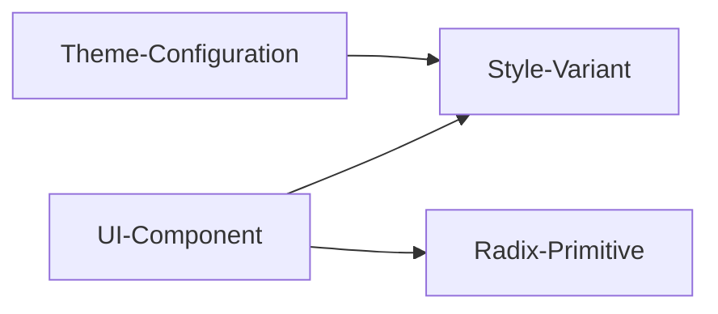

## ■概要

Shadcn UIは、再利用可能なコンポーネントのコレクションです。
従来のコンポーネントライブラリとは異なり、npmパッケージとして依存関係に追加しません。
開発者がコンポーネントのソースコードをプロジェクトにコピーアンドペーストし、自身のコードとして所有する「所有型」モデルを採用しています。
これにより、デザインや挙動の完全な制御が可能になります。

## ■特徴

- **コードの所有権**
  開発者はコンポーネントのソースコードを直接管理します。
  ブラックボックス化されたライブラリAPIに縛られません。
  プロジェクト固有の要件に合わせて、自由にコードを改変できます。

- **モダンでミニマルなデザイン**
  「Less is more」を体現した、シンプルで美しいデザインを採用しています。
  機能的な余白とタイポグラフィを重視し、プロフェッショナルな印象を与えます。
  ビジネス向けアプリケーションやSaaSに適しています。

- **最高レベルのアクセシビリティ**
  Radix UIを基盤とし、WAI-ARIA標準に準拠しています。
  キーボード操作やスクリーンリーダーへの対応が組み込まれています。
  開発者はアクセシビリティの実装コストを大幅に削減できます。

- **カスタマイズ性**
  Tailwind CSSをスタイリングエンジンとして採用しています。
  ユーティリティクラスにより、スタイルを迅速かつ柔軟に変更できます。
  CSS変数を利用したテーマ設定にも対応しています。

## ■構造

C4モデルを用いて、shadcn/uiのアーキテクチャを可視化します。

### ●システムコンテキスト図

システム全体の依存関係と境界を定義します。



| 要素名               | 説明                                                              |
| :------------------- | :---------------------------------------------------------------- |
| Developer            | shadcn/uiを利用してアプリケーションを構築する開発者               |
| shadcn/ui-System     | コンポーネントのコレクションとCLIツール                           |
| Radix-UI             | ヘッドレスUIコンポーネントを提供する基盤ライブラリ                |
| Tailwind-CSS         | スタイリングを行うためのユーティリティファーストCSSフレームワーク |
| Next.js/Vite-Project | shadcn/uiを統合する開発者のプロジェクト                           |

### ●コンテナ図

shadcn/uiを構成する主要なコンテナと、その相互作用を示します。



| 要素名                | 説明                                                                                                                |
| :-------------------- | :------------------------------------------------------------------------------------------------------------------ |
| shadcn-CLI            | コンポーネントの追加や初期化を行うコマンドラインツール                                                              |
| Remote-Registry       | コンポーネントの定義ファイルやコードをホストするリモートサーバー                                                    |
| Local-Components      | プロジェクト内に生成されるUIコンポーネント群（src/components/ui）                                                   |
| Local-Utils           | `clsx` と `tailwind-merge` を組み合わせ、クラス名の競合を解決し、条件付きスタイル適用を安全に行うユーティリティ関数 |
| External-Dependencies | Radix UIやLucide Iconsなどの外部npmパッケージ                                                                       |

### ●コンポーネント図

個々のUIコンポーネント（例：Button）の内部構成を示します。
コンポーネントは、スロット（Slot）機能やバリアント管理（cva）によって構成されます。



| 要素名                   | 説明                                                                   |
| :----------------------- | :--------------------------------------------------------------------- |
| Button-Component         | Reactコンポーネントとしてのボタン実装                                  |
| Radix-Slot               | プロパティに応じてレンダリング要素を差し替える機能（asChild）          |
| class-variance-authority | バリアント（primary, secondary等）に基づきクラス名を生成するライブラリ |
| Component-Props          | 開発者が指定する属性（variant, size, className等）                     |

## ■データ

shadcn/uiが扱うデータの構造と定義について解説します。

### ●概念モデル

主要な概念エンティティの関係を示します。



| 要素名              | 説明                                                                                  |
| :------------------ | :------------------------------------------------------------------------------------ |
| Theme-Configuration | `globals.css` 内のCSS変数（`--primary`, `--radius` 等）で定義される、動的なテーマ設定 |
| UI-Component        | 再利用可能な構成単位（ボタン、カード、ダイアログ等）                                  |
| Style-Variant       | `cva` で定義される、コンポーネントの状態や種別に応じたスタイル                        |
| Radix-Primitive     | スタイルを持たない機能的なUIの基礎ブロック                                            |

### ●情報モデル

設定ファイル `components.json` の構造を定義します。
このファイルは、CLIがプロジェクトのディレクトリ構造を理解し、コンポーネントを正しい場所に配置するための「地図」の役割を果たします。

| プロパティ | 型      | 説明                                                              |
| :--------- | :------ | :---------------------------------------------------------------- |
| style      | string  | デザインスタイルの識別子（default / new-york）                    |
| rsc        | boolean | React Server Componentsへの対応有無                               |
| tailwind   | object  | Tailwind CSSの設定（configファイルパス、CSSパス、ベースカラー等） |
| aliases    | object  | コンポーネントやユーティリティのインポートパスエイリアス          |

## ■構築方法

プロジェクトへの導入は、CLIによる自動セットアップが主流です。

1.  **プロジェクト作成**
    Next.jsまたはVite等でReactプロジェクトを作成します。

2.  **初期化コマンド実行**
    以下のコマンドでshadcn/uiを初期化します。
    対話形式でTypeScriptの使用やディレクトリ構成を設定します。

    ```bash
    pnpm dlx shadcn@latest init
    ```

3.  **設定ファイルの生成**
    `components.json`、`lib/utils.ts`、`globals.css`などが自動生成されます。
    `tailwind.config.js`にプラグイン設定が追加されます。

## ■利用方法

コンポーネントの追加から実装までの流れを解説します。

1.  **コンポーネントの追加**
    必要なコンポーネントのみを個別に追加します。
    これにより、バンドルサイズを最小限に抑えられます。

    ```bash
    npx shadcn@latest add button card
    ```

2.  **インポートと利用**
    通常のReactコンポーネントとしてインポートします。
    スロット機能を利用して、柔軟な構成が可能です。

    ```tsx
    import { Button } from "@/components/ui/button"

    export default function Page() {
      return <Button>Click me</Button>
    }
    ```

3.  **フォームの実装**
    `react-hook-form` と `zod` を統合したFormコンポーネントによる実装例です。
    型安全なバリデーションと、アクセシブルなエラーハンドリングが自動化されます。

    ```tsx
    import { useForm } from "react-hook-form"
    import { zodResolver } from "@hookform/resolvers/zod"
    import * as z from "zod"
    import { Button } from "@/components/ui/button"
    import { Form, FormControl, FormField, FormItem, FormLabel, FormMessage } from "@/components/ui/form"
    import { Input } from "@/components/ui/input"

    const formSchema = z.object({
      username: z.string().min(2, "2文字以上で入力してください"),
    })

    export function ProfileForm() {
      const form = useForm<z.infer<typeof formSchema>>({
        resolver: zodResolver(formSchema),
        defaultValues: { username: "" },
      })

      function onSubmit(values: z.infer<typeof formSchema>) {
        console.log(values)
      }

      return (
        <Form {...form}>
          <form onSubmit={form.handleSubmit(onSubmit)} className="space-y-8">
            <FormField
              control={form.control}
              name="username"
              render={({ field }) => (
                <FormItem>
                  <FormLabel>Username</FormLabel>
                  <FormControl>
                    <Input placeholder="shadcn" {...field} />
                  </FormControl>
                  <FormMessage />
                </FormItem>
              )}
            />
            <Button type="submit">Submit</Button>
          </form>
        </Form>
      )
    }
    ```

## ■運用

長期的なプロジェクト運用におけるポイントです。

- **コードの所有と責任**
  導入したコンポーネントはプロジェクトの一部となります。
  バグ修正や機能拡張は開発者自身の責任で行います。
  ライブラリのバージョンアップ互換性を気にする必要がありません。

- **差分管理**
  CLIの `diff` コマンドを利用して、アップストリームの変更を確認できます。
  カスタマイズしたコードと本家の更新を慎重にマージします。

- **デザインシステムの拡張**
  `shadcn` はベースに過ぎません。
  プロジェクト固有のドメインコンポーネントを、基本コンポーネントの上に構築します。

## ■ベストプラクティス

持続可能な開発のための指針です。

- **ディレクトリ構造の分離**
  UIコンポーネント（`components/ui`）と機能コンポーネント（`features/*`）を明確に分けます。
  `components/ui` はロジックを持たせないように保ちます。

- **コンポジションの優先**
  継承を避け、`children` プロパティを利用したコンポジション（組み合わせ）を基本とします。
  受け取った `className` は、必ず `cn()` ユーティリティを通して結合し、オーバーライドを可能にします。

- **cvaによるバリアント拡張**
  新しいスタイルが必要な場合は、`cva` 定義にバリアントを追加します。
  コンポーネントのコードを直接編集することが推奨されます。

## ■トラブルシューティング

よくある問題とその解決策です。

- **Hydration Mismatchエラー**
  - **原因**: サーバーとクライアントのレンダリング結果の不一致。
  - **解決**: `useEffect` でマウント後に表示するか、動的インポート（`ssr: false`）を利用します。

- **Tailwindスタイルが適用されない**
  - **原因**: `tailwind.config.js` の `content` パス設定漏れ。
  - **解決**: 新しいディレクトリを作成した場合は、必ずconfigに追加します。

- **CLIのエラー**
  - **原因**: パスエイリアスの未設定やネットワークの問題。
  - **解決**: `tsconfig.json` のパス設定を確認するか、手動インストールを検討します。

## ■まとめ

shadcn/uiは、必要なコードだけをプロジェクトに取り込み、完全にコントロールできる新しいパラダイムのコンポーネントシステムです。Tailwind CSSとRadix UIの堅牢な基盤の上に、美しくカスタマイズ可能なUIを高速に構築できます。

この記事が少しでも参考になった、あるいは改善点などがあれば、ぜひリアクションやコメント、SNSでのシェアをいただけると励みになります！

## ■参考リンク

- 公式ドキュメント
  - [Introduction - Shadcn UI](https://ui.shadcn.com/docs)
  - [components.json - shadcn/ui](https://ui.shadcn.com/docs/components-json)
  - [Theming - shadcn/ui](https://ui.shadcn.com/docs/theming)
  - [Installation - shadcn/ui](https://ui.shadcn.com/docs/installation)
  - [init - Shadcn UI](https://ui.shadcn.com/docs/cli)
  - [React Hook Form - Shadcn UI](https://ui.shadcn.com/docs/forms/react-hook-form)
  - [Chart - Shadcn UI](https://ui.shadcn.com/docs/components/chart)
  - [Tailwind v4 - Shadcn UI](https://ui.shadcn.com/docs/tailwind-v4)
  - [registry-item.json - Shadcn UI](https://ui.shadcn.com/docs/registry/registry-item-json)
  - [Getting Started - Shadcn UI](https://ui.shadcn.com/docs/registry/getting-started)
  - [December 2025 - npx shadcn create](https://ui.shadcn.com/docs/changelog/2025-12-shadcn-create)

- 記事
  - [Shadcn UI: A Deep Dive into Tailwind-Styled Radix Components](https://medium.com/frontendweb/shadcn-ui-a-deep-dive-into-tailwind-styled-radix-components-55fc2dd9d23f)
  - [What Is Shadcn UI A Guide for Modern Developers](https://magicui.design/blog/shadcn-ui)
  - [The Anatomy of shadcn/ui Components](https://vercel.com/academy/shadcn-ui/extending-shadcn-ui-with-custom-components)
  - [React UI with shadcn/ui + Radix + Tailwind](https://vercel.com/academy/shadcn-ui)
  - [Radix UI vs Shadcn UI: A Clear Comparison](https://shadcnstudio.com/blog/radix-ui-vs-shadcn-ui)
  - [Understanding components.json](https://vercel.com/academy/shadcn-ui/components-json)
  - [Best Practices for Using shadcn/ui in Next.js](https://akarinti.tech/id/insight/bestpracticesforusingshadcnuiinnextjs-id)
  - [Building React Forms with Ease Using React Hook Form, Zod and Shadcn](https://wasp.sh/blog/2024/11/20/building-react-forms-with-ease-using-react-hook-form-and-zod)
  - [shadcn-ui Best Practices](https://rupeshpoudel.com.np/blog/shadcn-best-practices)
  - [Shadcn UI Best Practices](https://cursorrules.org/article/shadcn-cursor-mdc-file)
  - [I18N | Shadcn Admin Kit](https://marmelab.com/shadcn-admin-kit/docs/translation/)
  - [5 Critical shadcn/ui Pitfalls That Break Production Apps](https://www.paulserban.eu/blog/post/5-critical-shadcnui-pitfalls-that-break-production-apps-and-how-to-avoid-them/)
  - [Updating shadcn/ui to Tailwind 4 at Shadcnblocks](https://www.shadcnblocks.com/blog/tailwind4-shadcn-themeing/)
  - [Shadcn UI Ecosystem 2025: Complete Guide](https://www.devkit.best/blog/mdx/shadcn-ui-ecosystem-complete-guide-2025)
  - [What I DON'T like about shadcn/ui](https://leonardomontini.dev/shadcn-ui-use-with-caution/)

- GitHub
  - [Design Principles of Shadcn UI Aesthetics](https://gist.github.com/eonist/fc3ae41d70d38af42db462015fece5a2)
  - [I can't get npx shadcn@latest init to work with my already-existing next.js app #4685](https://github.com/shadcn-ui/ui/discussions/4685)
  - [ShadCN UI styles not working in Nx Monorepo with Tailwind v4 and Next.js 15 #7828](https://github.com/shadcn-ui/ui/issues/7828)
  - [[bug]: shadcn CLI and create-ui fail due to false Tailwind config validation #7234](https://github.com/shadcn-ui/ui/issues/7234)
  - [[bug]: Using npx shadcn@latest init #5513](https://github.com/shadcn-ui/ui/issues/5513)

- その他
  - [npx shadcnui@latest init button input is not working](https://stackoverflow.com/questions/78988083/npx-shadcnuilatest-init-button-input-is-not-working)
  - [Can't use Shadcn components](https://stackoverflow.com/questions/76714567/cant-use-shadcn-components)
  - [Tailwind styles not applied to components inside Shadcn Sheet](https://stackoverflow.com/questions/78877102/tailwind-styles-not-applied-to-components-inside-shadcn-sheet)
  - [Shadcn UI - So many unresolved issues == Bad sign?](https://www.reddit.com/r/reactjs/comments/19741vr/shadcn_ui_so_many_unresolved_issues_bad_sign/)
