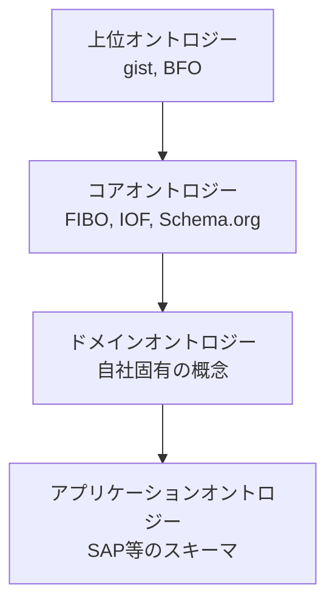
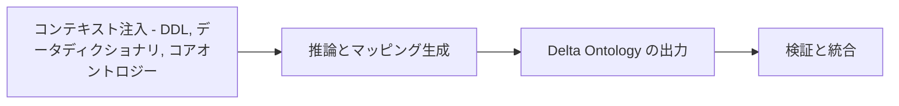
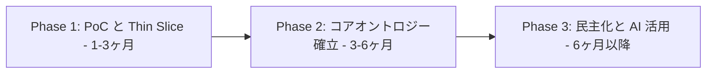

## よくある課題：「データはあるのに使えない」

ERP、CRM、SFA などの基幹システムは、それぞれ特定の業務プロセスに最適化されたデータ構造を持っています。DWH やデータレイクでデータを集約しても、SAP の KNA1 テーブルにある「顧客」と Salesforce の Account オブジェクトの「顧客」が同一の実体であることをシステムは自動的に判断できません。

この「意味の分断」が、データサイエンティストやアナリストのデータ準備に膨大な時間を費やさせる「データスワンプ（データの沼）」を生み出しています。

**オントロジー**は、この課題を根本から解決します。データの実体（Entity）とその関係性（Relationship）、ビジネスルールを機械可読な形式で定義した「意味の設計図」です。生成 AI がデータを正確に理解し推論する基盤としても、オントロジーの重要性が高まっています。

本記事では、社内システムのデータ利活用に向けたオントロジー整理方法を、以下の5つの視点から解説します。

1. **戦略的枠組み**: データファブリックとセマンティックレイヤーにおけるオントロジーの位置付け
2. **構築方法論**: アジャイルに小さく始めるアプローチ
3. **構造化と標準化**: 既存の標準オントロジーを活用した再利用戦略
4. **モデリングとマッピング**: SAP/Salesforce など具体的なシステムへの適用
5. **ガバナンスと運用**: 継続的に価値を生むための運用設計

## この記事の対象読者

- データ分析基盤の構築・運用に携わるデータエンジニア
- 社内システム間のデータ統合に課題を感じているアーキテクト
- AI/LLM を活用した社内データ分析を検討している技術リーダー

## 戦略的枠組み：データファブリックとセマンティックレイヤー

まず、現代のデータアーキテクチャにおけるオントロジーの位置付けを整理します。オントロジーは、物理的なデータ統合（ETL）を補完する「論理的な意味統合」の中核技術です。

### セマンティック・データファブリック

データファブリックは、メタデータを活用してデータ統合を自動化するアーキテクチャです。オントロジーは「アクティブ・メタデータ」のバックボーンとして機能します。

Timbr などのセマンティック・データファブリックは、物理的にデータを移動させず、SQL ベースのオントロジーで仮想的にデータを統合します。これにより、ビジネス用語（「顧客」「製品」「純利益」など）を用いたクエリが可能になります。

Microsoft Fabric でも、レイクハウス上のテーブルからセマンティックモデルを作成し、オントロジーを生成する機能が登場しています。

### データメッシュと連合オントロジー

データメッシュは、ドメインごとにデータの所有権と責任を分散させるアプローチです。ただし、各ドメインが独立してデータモデルを構築すると、全社的な分析が困難になります。

この課題を解決するのが**連合オントロジー**です。

| レイヤー                             | 役割                                               | 例                                         |
| :----------------------------------- | :------------------------------------------------- | :----------------------------------------- |
| グローバル・オントロジー（共有層）   | 全社共通の概念定義                                 | 顧客、契約、従業員                         |
| ローカル・オントロジー（ドメイン層） | ドメイン特有の概念定義とグローバル概念への関連付け | 製造の「歩留まり」、営業の「商談フェーズ」 |

この階層構造により、ドメインの自律性と相互運用性を両立できます。

### セマンティックレイヤーの2つの側面

現代のデータスタックでは、以下の2つの側面を統合的に管理する必要があります。

| 特性         | アナリティクス・セマンティクス - Metrics Layer  | ナレッジ・セマンティクス - Ontology                  |
| :----------- | :---------------------------------------------- | :--------------------------------------------------- |
| 主な目的     | 数値の集計ロジックと一貫性の担保                | 実体の意味と関係性の定義、推論                       |
| 代表的な要素 | 指標（売上、MRR）、ディメンション（時間、地域） | クラス（人、組織）、プロパティ（雇用する、購入する） |
| 技術スタック | Cube, AtScale, dbt Semantic Layer, LookML       | RDF, OWL, Property Graph, SHACL                      |
| 主な利用者   | BI アナリスト、ダッシュボード利用者             | AI エージェント、データサイエンティスト              |
| 活用例       | 「今年の地域別売上は?」への回答                 | 「この顧客とリスクの高い供給業者の関係は?」への回答  |

これらを対立させず、**オントロジーがエンティティ間のグラフ構造を定義し、その上でメトリクスレイヤーが集計ルールを定義する**という階層的な統合を目指します。

## オントロジー構築の方法論

戦略的な位置付けを理解したところで、実際にオントロジーを構築する方法論を見ていきます。

### Thin Slice アプローチ

全社のデータを網羅する巨大なオントロジーを最初から設計する「ビッグバン・アプローチ」は、複雑な IT 環境では成功しにくいです。代わりに、特定のビジネス課題を解決するために必要な最小限のデータと概念のみを切り出して実装する**Thin Slice アプローチ**を推奨します。

**実践ステップ:**

1. **コンピテンシー・クエスチョンの設定**: 解決すべき具体的な問いを定義する
   - 悪い例: 「全社の顧客データを統合する」
   - 良い例: 「過去1年間にサポートへの問い合わせが3回以上あり、直近の NPS スコアが低い重要顧客（LTV上位10%）は誰か?」
2. **データソースの特定**: 問いに答えるために必要なデータソースを洗い出す
   - Salesforce（顧客ランク、契約情報）
   - Zendesk / ServiceNow（問い合わせ履歴）
   - Qualtrics（NPS スコア）
3. **最小限のモデリング**: 必要な概念（Customer, Ticket, SurveyResult）と関係性のみをオントロジー化する
4. **実装と検証**: データをマッピングし、クエリを実行して問いに回答できるか確認する
5. **拡張**: 次の問い（例：「その顧客が購入している製品の不具合情報は?」）に向けてオントロジーを拡張する

数週間から数ヶ月単位で具体的なビジネス価値を提供しながら、オントロジーを段階的に成長させます。

:::message
**Thin Slice 成功のポイント**: コンピテンシー・クエスチョンは、ビジネスサイドの「今すぐ答えが欲しい問い」から選びます。技術的に興味深い課題ではなく、回答が業績に直結する問いを優先することで、経営層の支持を得やすくなります。
:::

### SAMOD：アジャイルなオントロジー開発手法

**SAMOD（Simplified Agile Methodology for Ontology Development）** は、ソフトウェア開発のアジャイル手法をオントロジーエンジニアリングに適用した体系的な手法です。以下の3ステップを反復的に実行します。

| ステップ | アクション         | 内容                                                                                                                |
| :------- | :----------------- | :------------------------------------------------------------------------------------------------------------------ |
| Step 1   | テストケースの定義 | ドメインエキスパートと共に「動機付けシナリオ」を作成し、コンピテンシー・クエスチョンと小規模モデル（Modelet）を定義 |
| Step 2   | マージと統合       | Modelet をマスター・オントロジーに統合し、既存テストケースの通過を確認してリグレッションを防止                      |
| Step 3   | リファクタリング   | 命名規則・構造的な整合性を保ち、推論エンジンで論理的矛盾を検証                                                      |

SAMOD の特徴は、**実例データ**の使用を重視する点です。抽象的な議論ではなく、実際の ERP データ（例：特定の注文伝票 #10023 の処理フロー）をモデル化することで、ドメインエキスパートとエンジニアの認識のズレを防ぎます。

### Thin Slice と SAMOD の使い分け

| 観点             | Thin Slice                                    | SAMOD                                    |
| :--------------- | :-------------------------------------------- | :--------------------------------------- |
| フォーカス       | ビジネスユースケースの選定と優先順位付け      | オントロジーの設計・テスト・統合プロセス |
| 粒度             | プロジェクト計画レベル（何を作るか）          | 開発プロセスレベル（どう作るか）         |
| 推奨する併用方法 | Thin Slice でスコープを決め、SAMOD で実装する | -                                        |

実務では、Thin Slice でユースケースを絞り込み、SAMOD の反復プロセスで実装する組み合わせが効果的です。

## オントロジーの構造化と標準化

方法論を理解したら、次はオントロジーの設計指針です。ゼロから作成するのではなく、既存の標準オントロジーを基盤とし、その上に独自概念を拡張する階層的アプローチが有効です。

### 4層構造モデル

オントロジーは抽象度に応じて4層に整理して管理します。

| 層                           | 役割                                                             | 推奨・例                                                                                           |
| :--------------------------- | :--------------------------------------------------------------- | :------------------------------------------------------------------------------------------------- |
| 上位オントロジー             | 全ドメイン共通の最上位概念の定義（モノ、コト、役割、時間、空間） | **gist**：ビジネスに直結するミニマリストな概念を提供。BFO は学術寄りのため企業向けには gist を推奨 |
| コアオントロジー             | 業界・機能領域の標準概念定義                                     | **FIBO**（金融）、**IOF**（製造）、**Schema.org**（Web 標準）                                      |
| ドメインオントロジー         | 自社特有のビジネス領域の概念定義                                 | 独自の物流ネットワーク、特殊な会員制度                                                             |
| アプリケーションオントロジー | 特定システムの物理スキーマ表現                                   | SAP ERP のテーブル、Salesforce のカスタムオブジェクト                                              |

アプリケーション層は R2RML などのマッピング言語を使って、上位のドメインオントロジーにリンクさせます。

https://zenn.dev/suwash/articles/semantic_arts_gist_ontorojii_taikeika_20260216

### 表現言語の選択と使い分け

目的に応じて適切な W3C 標準言語を選択します。これらは相互排他的ではなく、補完的に使用します。

| 言語                                             | 用途                                             | 社内システムでの適用例                                                                     |
| :----------------------------------------------- | :----------------------------------------------- | :----------------------------------------------------------------------------------------- |
| **SKOS**（Simple Knowledge Organization System） | 分類と整理。緩やかな階層構造、同義語、多言語対応 | 商品カテゴリ、組織図、勘定科目表。ERP のマスタデータは SKOS の broader/narrower 関係で管理 |
| **OWL**（Web Ontology Language）                 | 意味と論理。クラス間の厳密な関係、制約、推論     | ビジネスルールとエンティティ定義。「法人顧客とは、組織であり、かつ有効な契約を持つもの」   |
| **SHACL**（Shapes Constraint Language）          | 検証と品質。データが満たすべき形状の定義         | データ品質チェック。「従業員エンティティには社員番号が必須」「年齢は0以上」                |

**実践的な構成パターン:**

- マスタデータ（コード値）の管理 → **SKOS**
- データモデルの骨格（クラス定義） → **OWL**（Lite または QL）
- データのバリデーション → **SHACL**
- メタデータ（バージョン、作成者） → **Dublin Core** や **PROV-O**

## 社内システムのモデリングとマッピング技術

ここからは、SAP や Salesforce といった具体的なシステムのデータをオントロジーにマッピングする実践的な手法を解説します。

### SAP ERP データのマッピング

SAP のデータモデルは、ドイツ語略称に基づくテーブル名と数万のテーブル群で構成されています。オントロジーへのマッピングにより、ビジネスユーザーが「解読可能」な状態にします。

| SAP テーブル | 物理的な意味   | オントロジー上のクラス | URI 設計例                                   |
| :----------- | :------------- | :--------------------- | :------------------------------------------- |
| KNA1         | 一般顧客マスタ | gist:LegalEntity       | `https://id.corp/customer/KUNNR値`           |
| VBAK         | 受注伝票ヘッダ | gist:Agreement         | `https://id.corp/order/VBELN値`              |
| VBAP         | 受注伝票明細   | schema:OrderItem       | `https://id.corp/order/VBELN値/item/POSNR値` |
| T001         | 会社コード     | gist:Organization      | SKOS の ConceptScheme として定義             |

:::message alert
**SAP マッピングの注意点**: PARVW（取引先機能）のような「役割」の概念が重要です。同じ顧客（KNA1）が文脈に応じて「受注先」「出荷先」「請求先」に変わります。単純なプロパティではなく、`gist:hasRole` を用いて役割オブジェクトとしてモデル化してください。これにより、「この顧客が出荷先として関与している全ての注文」のような柔軟なクエリが可能になります。
:::

### Salesforce CRM データとの統合

Salesforce は比較的モダンなオブジェクト構造を持ちますが、ERP データとの統合では「同一性の担保」が課題です。

**Account（取引先）の統合方法:**

| アプローチ    | 方法                                                                          |
| :------------ | :---------------------------------------------------------------------------- |
| Linking       | `owl:sameAs` で「Salesforce の Account A」と「SAP の Customer B」が同一と宣言 |
| Golden Record | MDM プロセスで統合された URI を作成し、各システム ID を属性として保持         |

**Opportunity（商談）のモデリング:**

オントロジー上で「商談プロセス」を定義し、Opportunity → Quote → Order という時間的・因果的な繋がりを `gist:precedes` や `prov:wasDerivedFrom` で表現します。リードから入金までのエンドツーエンド分析が可能になります。

### RDB からの変換技術

RDB スキーマをグラフ構造に変換する主な手法は以下のとおりです。

| 手法           | 概要                                                                                  |
| :------------- | :------------------------------------------------------------------------------------ |
| R2RML          | W3C 標準のマッピング言語。テーブルをクラス、カラムをプロパティにマッピング            |
| Direct Mapping | テーブル名をクラス、カラム名をプロパティとして機械的に変換。初期ドラフト作成に有用    |
| 仮想化（OBDA） | SPARQL クエリをランタイムで SQL に変換して RDB に発行。リアルタイム性の高い分析に最適 |

## 生成 AI によるオントロジー構築の自動化

人手によるマッピング定義は、専門知識と多大な労力を要します。LLM を活用してこのプロセスを加速する手法が確立されつつあります。

### LLM 駆動型マッピング（RIGOR アプローチ）

**RIGOR（Retrieval-augmented Iterative Generation of RDB Ontologies）** は、LLM を用いて RDB スキーマからリッチな OWL オントロジーを段階的に生成する手法です。

| ステップ              | 内容                                                                                      |
| :-------------------- | :---------------------------------------------------------------------------------------- |
| コンテキスト注入      | DDL、データディクショナリ、ターゲットのコアオントロジー定義を RAG で LLM に入力           |
| 推論とマッピング生成  | 「テーブル KNA1 はコアオントロジーのどのクラスに該当するか?」を LLM に推論させる          |
| Delta Ontology の出力 | マッピング結果を小さなオントロジー断片として出力                                          |
| 検証と統合            | 別の LLM（Judge-LLM）または人間の専門家が論理的整合性を検証し、マスターオントロジーに統合 |

ポイントは、LLM が生成した結果を鵜呑みにせず、検証ステップを設ける点です。Judge-LLM による自動検証と人間レビューを組み合わせることで、品質を担保します。

### GraphRAG によるデータ利活用

オントロジーを構築した後は、**GraphRAG（Graph Retrieval-Augmented Generation）** を活用してデータ利活用を加速できます。

| 活用パターン           | 概要                                                                                      | 効果                                                               |
| :--------------------- | :---------------------------------------------------------------------------------------- | :----------------------------------------------------------------- |
| 構造化された知識の検索 | 「A社の子会社 B社が供給している部品 C」のような複雑な関係性をグラフから抽出し、LLM に提供 | ベクトル検索だけでは捉えにくい関係性の発見。ハルシネーションの抑制 |
| Text-to-SQL/Cypher     | オントロジーが「意味辞書」として機能し、自然言語の質問を正確な SQL やグラフクエリに変換   | ビジネスユーザーによるセルフサービス分析の実現                     |
| エージェント連携       | AI エージェントがオントロジーを参照し、適切なデータソースを自律的に選択・結合             | 複雑な分析タスクの自動化                                           |

## ガバナンスと運用ライフサイクル

オントロジーはビジネスの変化と共に進化し続けます。適切なガバナンス体制を構築し、継続的に価値を生む仕組みを整えます。

### バージョン管理と変更管理

**セマンティック・バージョニング（SemVer）** を採用します。

| バージョン | 変更内容                                                   |
| :--------- | :--------------------------------------------------------- |
| Major      | 互換性のない変更（クラスの削除、意味の変更）               |
| Minor      | 後方互換性のある機能追加（新しいクラスやプロパティの追加） |
| Patch      | バグ修正や注釈の修正                                       |

**運用上のポイント:**

- **非推奨ポリシー**: `owl:deprecated` プロパティを付与し、一定期間（例：6ヶ月）並行稼働後に削除
- **Git 管理**: オントロジー定義ファイル（Turtle, RDF/XML）を Git リポジトリで管理し、Pull Request ベースでレビュー
- **CI/CD 連携**: SHACL バリデーションを CI パイプラインに組み込み、マージ前にデータ品質を自動検証する

### URI 戦略

| 方針               | 例                                                               |
| :----------------- | :--------------------------------------------------------------- |
| 永続的な URI       | `https://data.company.com/ontology/core/Person`                  |
| バージョン付き URI | `.../v1.0/Person`（特定バージョン）、`.../latest/Person`（最新） |

実装詳細やサーバー名を含めず、永続的な URI を設計します。

### ガバナンス体制

| 役割                                | 責任          | タスク                                                 |
| :---------------------------------- | :------------ | :----------------------------------------------------- |
| オントロジスト / ナレッジエンジニア | 実行（R）     | オントロジーの設計、論理整合性チェック、標準準拠確認   |
| ドメインエキスパート                | 相談（C）     | 業務知識の提供、Modelet のレビュー                     |
| データスチュワード                  | 説明責任（A） | データ品質の監視、SHACL バリデーション結果の確認と是正 |
| システムオーナー                    | 報告（I）     | ソースシステムの変更（カラム追加、廃止）の通知         |

## 導入ロードマップ

3つのフェーズで段階的に推進します。

| フェーズ                      | 期間      | 内容                                                                                                                                             |
| :---------------------------- | :-------- | :----------------------------------------------------------------------------------------------------------------------------------------------- |
| Phase 1: PoC と Thin Slice    | 1-3ヶ月   | 特定の課題を解決する小さなユースケースを選定。gist などの上位オントロジーを採用し、SAMOD 手法で最小限のドメインモデルを構築                      |
| Phase 2: コアオントロジー確立 | 3-6ヶ月   | 全社共通の「顧客」「製品」「契約」のコアオントロジーを整備。主要 ERP/CRM とのマッピングパターンを確立。バージョン管理と CI/CD パイプラインを導入 |
| Phase 3: 民主化と AI 活用     | 6ヶ月以降 | セマンティックレイヤーをヘッドレス BI として開放。LLM/GraphRAG エージェントを接続して自然言語での高度なデータ探索を実現。データメッシュへ移行    |

## まとめ

社内データの利活用には、データを物理的に集めるだけでは足りません。「意味」をオントロジーとして体系化することで、システム横断的な分析と AI 活用が初めて可能になります。

成功の鍵は以下の3点です。

- **小さく始める**: Thin Slice で特定課題の解決から着手し、早期にビジネス価値を示す
- **アジャイルに育てる**: SAMOD で反復的に拡張し、実データに基づいて検証する
- **標準技術で守る**: OWL/SKOS/SHACL などの Semantic Web 標準とガバナンス体制で、持続的に価値を生む基盤を維持する

最初の一歩として推奨するのは、「全社で最も頻繁に問い合わせが発生するデータ統合の課題」を1つ選び、そのユースケースに対する Thin Slice を実装することです。小さな成功体験が、オントロジー整備の推進力になります。

:::message
**実践チェックリスト**:
1. 解決すべきビジネス上の問い（コンピテンシー・クエスチョン）を1つ定義したか
2. その問いに回答するために必要なデータソースを特定したか
3. 上位オントロジー（gist 推奨）を選定したか
4. 最小限のクラスと関係性でモデルを設計したか
5. 実データでクエリを実行し、問いに回答できることを確認したか
:::

## 引用リンク

- 公式ドキュメント
  - [Generating an ontology from a semantic model - Microsoft Fabric](https://learn.microsoft.com/en-us/fabric/iq/ontology/concepts-generate)
  - [What is Microsoft Fabric - Microsoft Learn](https://learn.microsoft.com/en-us/fabric/fundamentals/microsoft-fabric-overview)
  - [Map Data From CRM Standard Object Sources - Salesforce Help](https://help.salesforce.com/s/articleView?id=sales.sales_agent_sdr_analytics_setup_so_data_mapping.htm&language=en_US&type=5)
  - [Industrial Ontologies - OAGi](https://industrialontologies.org/)
  - [gist Upper Ontology - Semantic Arts](https://www.semanticarts.com/gist/)
  - [The Role of Semantic Layers - Databricks](https://www.databricks.com/glossary/semantic-layer)
- GitHub / 学術
  - [A Simplified Agile Methodology for Ontology Development - W3C](https://www.w3.org/community/owled/files/2016/11/OWLED-ORE-2016_paper_6.pdf)
  - [Retrieval-Augmented Generation of Ontologies from Relational Databases - arXiv](https://arxiv.org/html/2506.01232v1)
  - [A Multi-Agent System for Semantic Mapping of Relational Data to Knowledge Graphs - arXiv](https://arxiv.org/html/2511.06455v1)
  - [Mapping between Relational Databases and OWL Ontologies](https://www.lu.lv/materiali/apgads/raksti/756_pp_99-117.pdf)
  - [METHONTOLOGY: from ontological art towards ontological engineering - ResearchGate](https://www.researchgate.net/publication/50236211_METHONTOLOGY_from_ontological_art_towards_ontological_engineering)
- 記事・ブログ
  - [Lakehouse Semantic Model - Timbr.ai](https://timbr.ai/solutions/lakehouse-semantic-model/)
  - [Timbr Powers the Ontology-based Semantic Data Fabric](https://timbr.ai/blog/timbr-powers-the-ontology-based-semantic-data-fabric/)
  - [Why Ontologies Are the Key to Enterprise AI Value - Object Edge](https://www.objectedge.com/blog/ai-adoption-soars-why-ontologies-are-the-key-to-enterprise-ai-value)
  - [Why Your Data Fabric Needs an Enterprise Ontology - Enterprise Knowledge](https://enterprise-knowledge.com/why-your-data-fabric-needs-an-enterprise-ontology/)
  - [Unlocking the Power of Generative AI: Why OWL Leads - data.world](https://data.world/blog/owl-semantic-layers/)
  - [What Is a Semantic Layer? - Airbyte](https://airbyte.com/blog/the-rise-of-the-semantic-layer-metrics-on-the-fly)
  - [What is an ontology and its role in agentic experience design? - Salesforce](https://www.salesforce.com/blog/design-what-is-ontology/)
  - [Top 5 Tips for Managing and Versioning an Ontology - Enterprise Knowledge](https://enterprise-knowledge.com/top-5-tips-for-managing-and-versioning-an-ontology/)
  - [Ontology vs Semantic Layer - Atlan](https://atlan.com/know/ontology-vs-semantic-layer/)
  - [A Brief Introduction to the Gist Semantic Model - Semantic Arts](https://www.semanticarts.com/a-brief-introduction-to-the-gist-semantic-model/)
