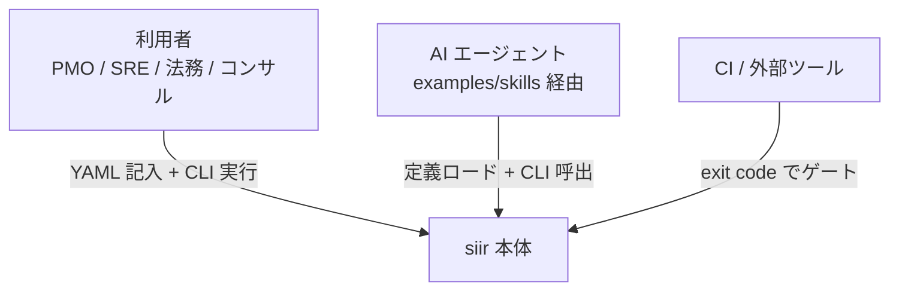
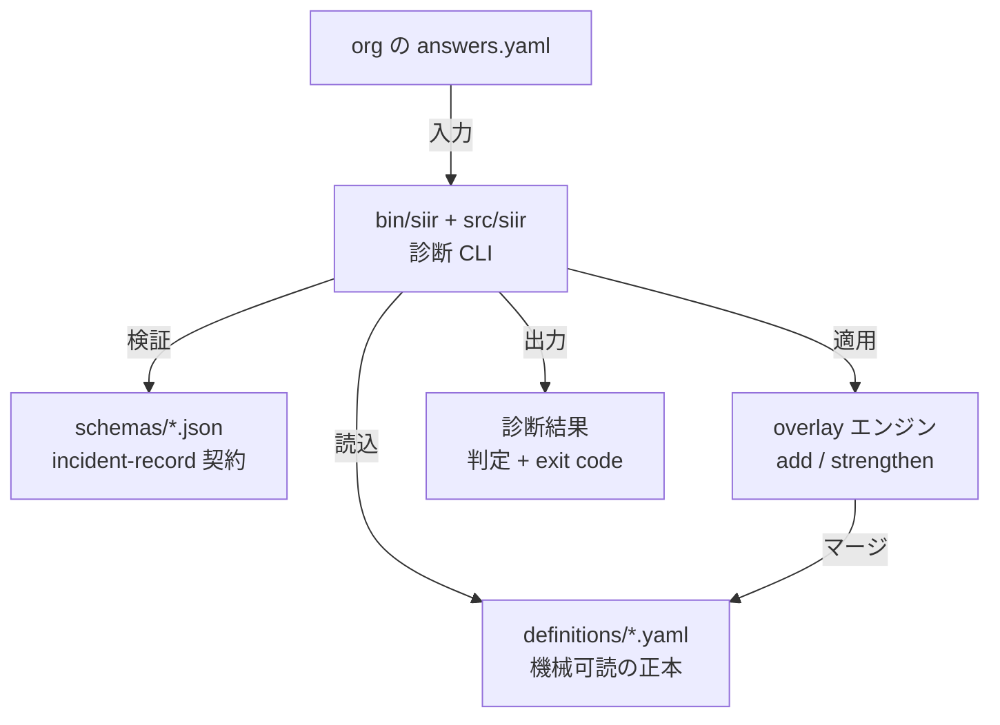
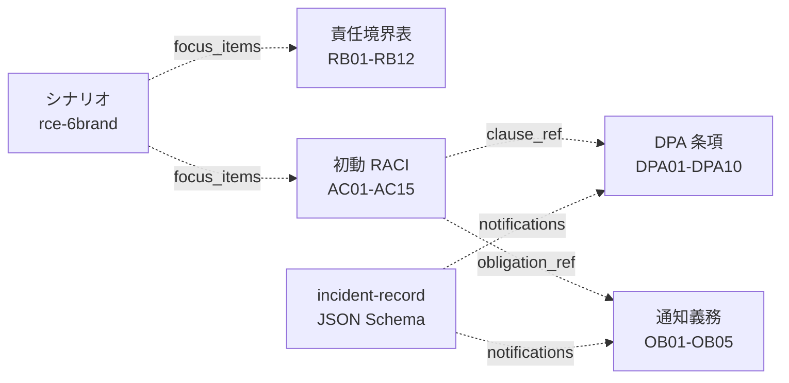
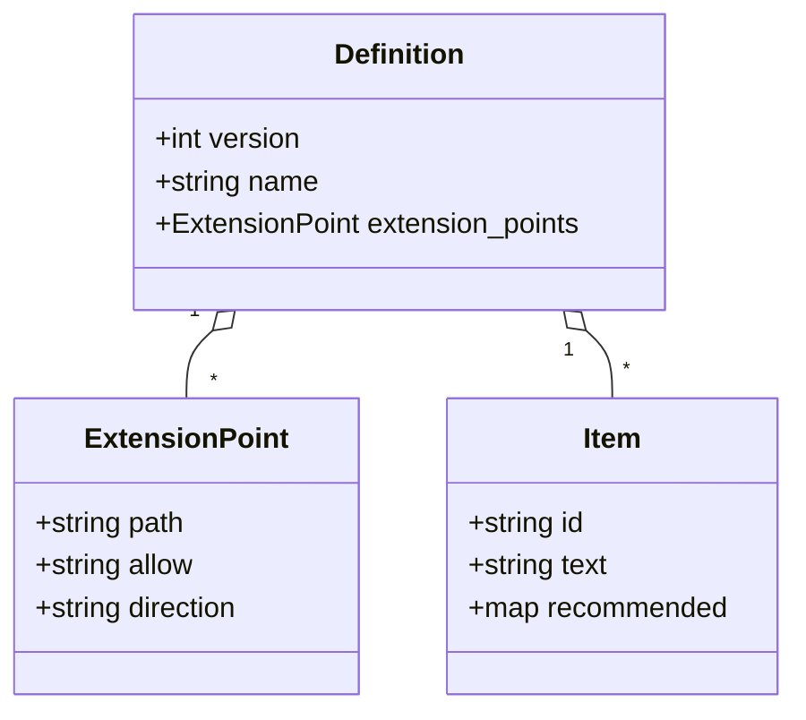
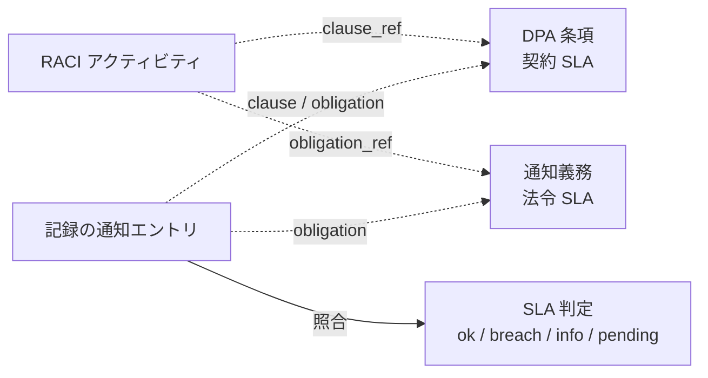
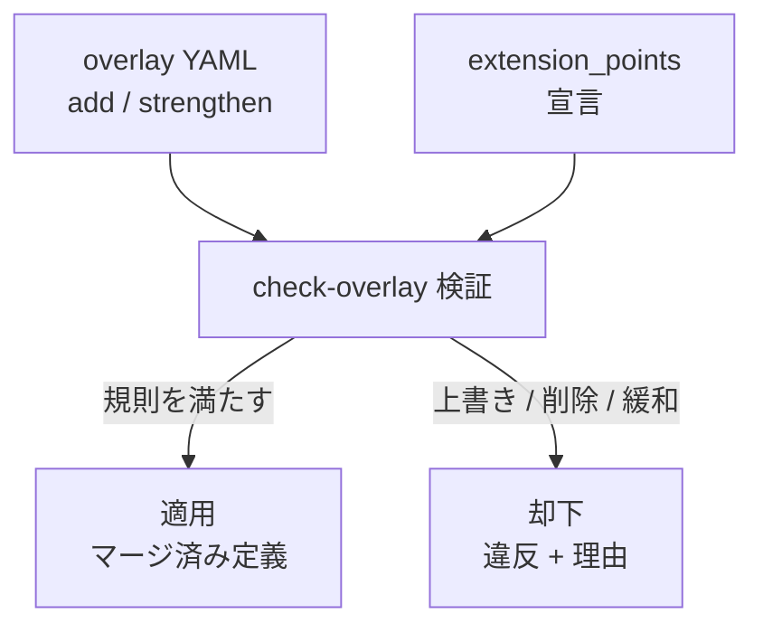
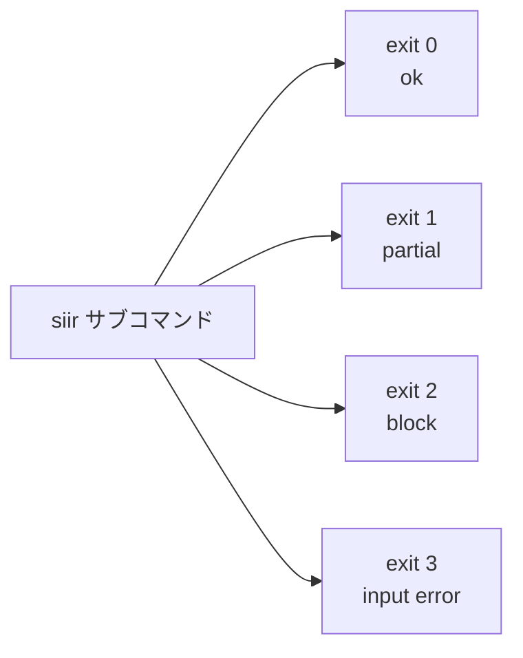

## はじめに — あなたの組織で「最初の30分」に誰が何を決めるか

2026 年 6 月、KDDI が ISP 向けに提供する共用メール基盤で不正アクセスが起き、メールアドレスとパスワード最大 1,422 万件に影響した可能性が公表されました。利用者から見れば BIGLOBE / @nifty / J:COM NET / コミュファ光 / ピカラ / CPI はそれぞれ別の ISP ですが、メール基盤としては KDDI が運用する単一プラットフォームを共有していました。普段は OEM の裏側に隠れている「ブランド数 ≠ 基盤数」という構造が、事故 1 件で **説明主体・通知順・鍵保管・監査ログ** の責任境界を一気に表へ引きずり出した事案です。

この記事は、その事案分析から抽出したフレームワーク + 診断 CLI **`siir`**(shared-infra-incident-readiness)を題材に、**なぜこういう構造にしたのか / どこで設計判断を迫られたのか** を作り手目線で書いたものです。OSS を clone して中身を読む・使うエンジニア・SRE・セキュリティ・法務担当を読者に想定しています。

まず、自分の組織に当ててみてください。共有 SaaS / OEM 基盤を提供あるいは受託しているなら、事故が起きた **最初の 30 分** に次を即決できるでしょうか。

- 個情委・総務省へ「誰が」報告するのか。委託元か、基盤運用者か
- プレスリリースは「共同」か「個別」か。それを誰が決めるのか
- 委託先から委託元への第一報は何時間以内なのか
- 監査ログ・鍵・パスワードハッシュの管理責任は契約に書いてあるか

これらが曖昧なまま走ると、6 社の発表が食い違ったり、利用者通知のタイミングがずれたりします。`siir` は、この「最初の 30 分」の備えを **機械的に診断する** ための小さな道具です。

リポジトリ構成は以下のとおりです。CLI 本体は Python、定義は YAML、記録契約は JSON Schema です。

```
shared-infra-incident-readiness/
├── definitions/                 # 機械可読の正本 (YAML 5 本)
│   ├── responsibility-matrix.yaml      # 責任境界表 12 項目 x 4 ロール
│   ├── incident-raci.yaml              # 初動 RACI 15 アクティビティ x 5 ロール
│   ├── dpa-clauses.yaml                # DPA 必須 10 条項 (契約 SLA の正本)
│   ├── notification-obligations.yaml   # 法令・規制の通知期限
│   └── scenarios.yaml                  # Tabletop シナリオ
├── schemas/incident-record.schema.json # インシデント記録 + 通知タイムライン
├── bin/siir + src/siir/                # 診断 CLI
├── examples/                           # 入力サンプル / overlay / agent skills
├── docs/                               # 設計ドキュメント (C4 / 概念モデル / 採点)
└── tests/                              # 境界条件・exit code (46 tests)
```

## なぜ「テンプレ集」ではなく「機械可読の正本 + 診断CLI」にしたのか

事故初動の責任分界を扱う成果物は、普通は **Markdown のテンプレ集や Excel の RACI 表** になりがちです。「責任境界表のひな型」「DPA チェックリスト」を配って終わり、という形です。しかしテンプレ集には致命的な弱点があります。

- **採点できない**。記入済みの表が「埋まっているか」を人が目視するしかなく、未割当や説明責任の分裂を機械的に検出できません。
- **CI に載らない**。平時に整えた備えが時間とともに腐っても、それを検知する仕組みがありません。
- **AI エージェントから扱いにくい**。散文の中に表が埋まっていると、エージェントが構造として読み取りにくい。

そこで `siir` は、責任境界表・RACI・DPA 条項・通知義務・シナリオを **機械可読の正本(`definitions/*.yaml`)** として持ち、CLI で診断する形にしました。診断結果は **決定的な exit code** で返るので、CI のゲートにも、AI エージェントの判定材料にもなります。

```bash
git clone https://github.com/suwa-sh/shared-infra-incident-readiness.git
cd shared-infra-incident-readiness
pip install -r requirements.txt

bin/siir check-responsibility examples/responsibility/sample-oem-mail.yaml
bin/siir check-dpa examples/dpa/sample-dpa-answers.yaml
bin/siir validate-record examples/records/sample-incident.json --level extended
bin/siir render-runbook examples/responsibility/sample-oem-mail.yaml --scenario rce-6brand
bin/siir tabletop --scenario rce-6brand examples/responsibility/sample-oem-mail.yaml
```

サブコマンドは 7 つです。

| サブコマンド | 役割 |
|---|---|
| `check-responsibility` | 記入済みの責任境界表を採点する |
| `check-dpa` | DPA 条項のカバレッジを採点する |
| `validate-record` | インシデント記録 + 通知 SLA を検証する |
| `render-runbook` | 初動ランブック(三段)を決定的に生成する |
| `tabletop` | Tabletop 演習プログラムを生成する |
| `check-overlay` | overlay の add / strengthen 規則を検証する |
| `list-definitions` | ロード済みの定義(+ overlay)を確認する |

重要なのは、コマンドが「自分のデータに対して走る」点です。`examples/` をひな型としてコピーし、自社の値に書き換えてから実行します。平時の備え(責任境界・契約点検・演習)から事故時の検証(通知 SLA)まで、ひとつの正本で扱えます。

## システム構造(C4: コンテキスト → コンテナ)

まず外から見た構造です。`siir` の利用者は 3 種類います。人間(YAML 記入 + CLI 実行)、AI エージェント(`examples/skills/` 経由で定義をロードし CLI を呼ぶ)、CI / 外部ツール(exit code でゲートする)です。



次にコンテナ(リポ内部)の構造です。CLI が定義をロードし、記録をスキーマで検証し、overlay を適用します。overlay は base 定義へマージされてから採点に使われます。



ポイントは、**正本(YAML / JSON Schema)と診断ロジック(Python)を分離** していることです。定義を読めば仕様がわかり、CLI を読めば採点規則がわかる。両者が混ざらないので、定義の改訂(条項を増やす・SLA を縮める)はコードを触らずに済み、採点規則の変更は定義を触らずに済みます。

## データモデル — 5つの正本が参照で繋がる

定義 5 本と JSON Schema は、それぞれが独立した正本でありつつ、**ID 参照** で疎結合に繋がっています。値を二重に持たないための設計です。



各正本の役割を整理します。

| 正本 | 内容 | 主キー |
|---|---|---|
| `responsibility-matrix.yaml` | 責任境界表。12 項目 × 4 ロール、各セルに R/A/C/I | `RB*` |
| `incident-raci.yaml` | 初動 RACI。15 アクティビティ × 5 ロール、Day 0-3 の順序 | `AC*` |
| `dpa-clauses.yaml` | DPA 必須 10 条項。**契約 SLA の正本** | `DPA*` |
| `notification-obligations.yaml` | 法令・規制の通知期限。**法令 SLA の正本** | `OB*` |
| `scenarios.yaml` | Tabletop シナリオ(注入イベント・focus 項目) | scenario id |
| `incident-record.schema.json` | インシデント記録 + 通知タイムラインの契約 | — |

`incident-raci.yaml` の各アクティビティは SLA 値を **持ちません**。代わりに `obligation_ref`(OB*)か `clause_ref`(DPA*)で参照するだけです。たとえば「委託元への速報」アクティビティはこうなっています。

```yaml
- id: AC03
  text: 委託元への速報
  clause_ref: DPA03            # SLA 値は持たず DPA03 を参照
  cells: { end_user: "-", principal_isp: R, oem_operator: R, ops_bpo: I, sw_vendor: I }
```

責任境界表の各項目は推奨割当 `recommended` を持ちます。組織はこれを answers に写し取り、自社用に調整します。

```yaml
- id: RB01
  text: 利用者向け窓口・本人通知
  recommended: { principal_isp: R, oem_operator: C, ops_bpo: I, sw_vendor: I }
```

定義の構造そのものも、後述する overlay が拡張する「契約」になっています。各定義は冒頭で `extension_points` を宣言し、overlay で何を `add` / `strengthen` できるかを self-documenting に表明します。



## 設計判断の肝

ここからが本題です。`siir` を作る過程で迷い、明示的に判断を下した 4 点を記録します。いずれも「素朴に作るとこうなるが、それだと原典や運用と矛盾する」という形のトレードオフでした。

### 判断① 契約SLAと法令SLAを別の正本に分離した

通知期限には、性質の違う 2 系統があります。

| 系統 | 正本 | 例 |
|---|---|---|
| 契約上の SLA | `dpa-clauses.yaml` | 委託先 → 委託元 24h 第一報 / 72h 確報、Critical CVE 後 72h 暫定対応 |
| 法令・規制の期限 | `notification-obligations.yaml` | 個情委 速報「速やか」/ 確報 30 日、総務省「遅滞なく」、本人通知 |

素朴に作るなら、通知期限を 1 ファイルにまとめたくなります。しかし 24h / 72h という契約 SLA と、「速やか」「遅滞なく」「原則 30 日」という法令の期限は、**改訂のタイミングも、数値化できるかどうかも違います**。同じ値を 2 箇所に書くと、改訂時に片方が腐ります。そこで正本を分け、`incident-raci.yaml` 側は ID 参照だけを持つ構造にしました。

さらに、法令の期限には「数値化できないもの」が混ざります。`notification-obligations.yaml` は各義務に機械照合用のフィールドを持たせ、これを吸収します。

```yaml
- id: OB01
  name: 個人情報保護委員会への速報
  deadline_anchor: awareness
  duration_hours: null             # 「速やか」の運用日数は個情委公式の明示なし
  duration_text: 速やか (運用3-5日説は二次情報・未確認)
  confidence: unconfirmed          # 数値締切を断定しない
  recipient: ppc
  clock_type: practice
  legal_basis: 個人情報保護法 第26条 / 施行規則 第8条
  joint_report_allowed: true
```

ここで効いているのが **過剰な断定を避ける** 設計です。個情委速報の「速やか」の運用日数には公式の明示がありません。そこで OB01 は `duration_hours: null` + `confidence: unconfirmed` とし、`validate-record` は機械照合せず info に落とします。数値締切(24h / 72h / 30 日 / 不正目的 60 日)だけを hard に breach 判定し、非数値(「遅滞なく」)は手動レビュー対象にします。誤った合否判定を出さないための割り切りです。

`validate_record.py` の判定ロジックは次のように、`duration_hours` が `None` なら info、数値なら elapsed と比較します。

```python
if entry.get("status") != "sent" or sent is None:
    return SlaFinding(ref=ref, status="pending", message=f"{label}: not sent yet ...")
if sla_hours is None:
    return SlaFinding(ref=ref, status="info", message=f"{label}: non-numeric deadline; review manually")
...
if elapsed > float(sla_hours):
    return SlaFinding(ref=ref, status="breach", message=f"{label}: sent {elapsed:.1f}h after {anchor}, SLA is {sla_hours}h", ...)
```

もう一段の細かさとして、確報の段階管理があります。DPA03 のように第一報(24h)と確報(72h)で SLA が違う条項では、記録の通知エントリに `stage: first|confirmed` を付け、照合先を切り替えます。確報を 24h で誤判定しないための仕組みです。

```python
def _sla_for_ref(ref, stage, obligations, clauses):
    ...
    if ref.startswith("DPA") and ref in clauses:
        cl = clauses[ref]
        if stage == "confirmed" and cl.get("sla_confirmed_hours") is not None:
            return cl.get("sla_confirmed_hours"), "awareness", f"{cl.get('title', ref)} (確報)"
        return cl.get("sla_hours"), "awareness", cl.get("title", ref)
```

下図が、この参照と照合の流れです。



### 判断② ownership-clarity 採点 — 単一オーナーを合格、tbd を罰しない

責任境界表の採点で最初に迷うのは、「各行に必ず Accountable(A)を 1 つ要求すべきか」です。素朴に作ると「A が無い行は不合格」にしたくなります。しかし原典のテンプレには、本人通知・監査ログなど **主担当を単一の R で表す行** があり、必ず別の A を要求すると原典と矛盾します。

そこで合格条件を「**明確な単一オーナーがいること**」に置きました。判定ロジックは次のとおりです。

| 状態 | 判定 | exit |
|---|---|---|
| A が 1 つ、または A 無しで R が 1 つ | ok | — |
| `tbd`(都度協議)を含む | revise(グレーゾーン) | 1 |
| A 無し・R 無し・割当ゼロ | block(未割当) | 2 |
| A が 2 つ以上(説明責任の分裂) | block | 2 |
| A 無しで R が 2 つ以上(オーナー曖昧) | revise | 1 |

実装は `check_responsibility.py` の `_verdict_for` に集約されています。

```python
if not assigned and not has_gray:
    return "block", "unassigned", ...
if count_a > 1:
    return "block", "split_accountability", ...
if count_a == 1:
    verdict = "revise" if has_gray else "ok"
    return verdict, ("gray_zone" if has_gray else "ok"), ...
# count_a == 0: rely on a single clear Responsible owner
if r_count == 1:
    verdict = "revise" if has_gray else "ok"
    return verdict, ...
if r_count > 1:
    return "revise", "ambiguous_ownership", ...
```

特徴的なのは **`tbd` を罰しない** ことです。RACI の最大の弱点は「グレーゾーン処理が苦手」な点で、原典は「不明 / 都度協議の箱を残す勇気」を明示的に推奨しています。組織が意図的に `tbd` と書いた箱を、本物の未割当と同じく block にすると、原典の推奨と衝突します。そこで `tbd` は revise(警告)に留め、hard failure にはしません。

もうひとつ、セルの表記ゆれに対応するため `R/A`(Responsible かつ Accountable)のような複合セルを `/` で分割して正規化しています。これは初動 RACI 表が `R/A` を使うため、`render-runbook` でも同じ正規化を共有しています。

```python
def _cell_letters(value):
    out = []
    for tok in str(value).split("/"):
        n = _normalize(tok)
        if n:
            out.append(n)
    return out
```

### 判断③ overlay を add / strengthen の2操作だけに絞った

各社固有のロール・条項・シナリオを取り込めないと、フレームワークは「自分ごと」になりません。かといって自由な上書きを許すと、フォークと変わらなくなり、base の正本が骨抜きになります。

そこで overlay に許す操作を **2 つだけ** に絞りました。

- **`add`** — 新しいロール / 項目 / 条項 / 通知義務 / シナリオを、新しい `id` で追加する。既存の上書き・削除は却下する。
- **`strengthen`** — 宣言された数値フィールドを **厳格方向にのみ** 動かす。たとえば SLA を 24h → 12h に短縮する。緩和は却下する。

何が `add` / `strengthen` できるかは、各定義の `extension_points` が宣言します。overlay エンジンはこの宣言を読んで分岐するので、操作の意味がハードコードではなく定義側に self-documenting になっています。

```yaml
extension_points:
  - path: clauses
    allow: add                       # 自社固有の追加条項。既存条項の上書き・削除は不可
  - path: clauses[].sla_hours
    allow: strengthen
    direction: lower                 # stricter = より短い通知時間。緩和は不可
```

実際の overlay は、追加と厳格化を両方使ってもこれだけです。

```yaml
extends: shared-infra-dpa-clauses
add:
  clauses:
    - id: DPA11
      title: 暗号鍵の地理的分離
      requirement: 鍵管理を本番データと別リージョン / 別管理主体に分離する
      required: true
strengthen:
  clauses:
    DPA03:
      sla_hours: 12
```

「厳格方向」を定義側が `direction` で宣言している点が肝です。SLA 時間は `direction: lower`(短いほど厳しい)、閾値なら `direction: higher` というように、厳しさの向きをフィールドごとに宣言します。overlay エンジンは緩和を機械的に却下します。

```python
weakened = new_f > old_f if direction == "lower" else new_f < old_f
if weakened:
    return MergeViolation(
        path=path,
        kind="weakening_rejected",
        message=f"strengthen would weaken '{fld}' from {old} to {new_val} (stricter direction is '{direction}')",
    )
```

適用前に `check-overlay` で検証できるので、半分だけ適用された状態で採点する事故も防げます。



この「フォークせずに拡張する」モデルにより、コンサルや提案者は base を clone し、顧客ごとに overlay を private に当てて、顧客別の採点を提示できます。base の正本は共有のまま保たれます。

### 判断④ 決定的な exit code で CI ゲートにできる

最後の判断は、出力を **決定的な exit code** に固定したことです。すべてのサブコマンドが同じ規約で終了コードを返します。

| exit | 意味 | 例 |
|---|---|---|
| `0` | ok(緑) | 全項目に明確な単一オーナー、SLA 内 |
| `1` | partial(黄) | tbd のグレーゾーン、未送信の通知、手動レビュー対象 |
| `2` | block(赤) | 未割当・必須条項欠落・SLA 違反・overlay 却下 |
| `3` | input error | ファイル不在・パースエラー・overlay 構造エラー |

この規約があるおかげで、平時に整えた備えが腐ったら CI が落ちます。「責任境界表に未割当が増えた」「DPA に必須条項が欠けた」「演習記録の通知タイムラインが SLA を割った」を、人の目視ではなくパイプラインが検知します。

実装上の細かい工夫として、argparse のデフォルトの使用法エラー(本来 exit 2)を **exit 3 に付け替えて** います。exit 2 は「block 判定」に予約されているため、引数ミスと診断結果が混同されないようにする配慮です。

```python
class _Parser(argparse.ArgumentParser):
    """ArgumentParser whose usage errors exit 3 (input error), not argparse's
    default 2 — exit 2 is reserved for a 'block' verdict in our contract."""

    def error(self, message: str):
        self.print_usage(sys.stderr)
        sys.stderr.write(f"{self.prog}: error: {message}\n")
        raise SystemExit(3)
```

この exit code 規約は `tests/` の 46 テストでロックされており、境界条件(A の分裂・tbd・複合セル・SLA の breach / pending / info・overlay の緩和却下・引数エラー)を一通り固定しています。出力が決定的だからこそ、レビューや差分管理が成り立ちます。`render-runbook` / `tabletop` も自由生成(LLM)ではなく、同じ入力からは常に同じ Markdown を出すので、生成物をそのまま社内 wiki やランブックに貼って差分管理できます。



## AIエージェントの取り込み口 — examples/skills/

`siir` は人間が叩くだけでなく、**AI エージェントが定義をロードして CLI を呼ぶ** 使い方を最初から想定しています。その取り込み口が `examples/skills/` です。Claude Code の skill 形式で、責任境界の対話的ヒアリング → CLI 実行 → 判定の翻訳までを記述してあります。

```
examples/skills/
├── incident-readiness-check/SKILL.md    # 対話で責任境界 + DPA を採点
└── incident-runbook-render/SKILL.md     # ランブック生成
```

skill の中身は CLI の薄いラッパーで、原則が明文化されています。

- 定義をハードコードせず、必ず `definitions/responsibility-matrix.yaml` を読む(overlay やバージョン更新と同期を保つため)
- 組織が決めていない箱は `tbd` で記録する(フレームワークが healthy なグレーゾーンとして扱う)
- CLI を JSON モードで走らせ、`conclusion`(PASS / REVISE / BLOCK)を先頭に、block 項目から直すよう翻訳する
- overlay が `check-overlay` で落ちたら、半適用で採点せず違反を表面化して止める

`--format json` を全サブコマンドが備えているのは、この **機械可読の出力** をエージェントや外部ツールに渡すためです。「機械可読の正本 + 決定的 CLI」という設計が、人間・CI・AI エージェントの 3 者で同じ判定を共有できる土台になっています。

## まとめ

`siir` は、共有インフラ事故の「最初の 30 分」の備えを診断する小さな CLI です。テンプレ集にせず、機械可読の正本 + 診断 CLI にしたことで、採点・CI ゲート・AI エージェント連携が同じ正本の上で成り立ちます。設計判断の肝は次の 4 点でした。

1. **契約 SLA と法令 SLA を別の正本に分離** — 二重保持を避け、数値化できない期限は info に落として断定しない
2. **ownership-clarity 採点** — 単一オーナーを合格とし、意図的な `tbd` を罰しない
3. **overlay を add / strengthen の 2 操作に限定** — フォークせず拡張し、緩和は却下する
4. **決定的な exit code** — CI ゲートとレビュー可能性を両立させる

ただし、これは「最初の 30 分を救う最小装備」であって銀の弾丸ではありません。責任境界表が形骸化した実例は複数あり、ベネッセ判決が示すとおり契約に分界を書いても委託元の監督責任は消えません。多層防御・初動ランブック連携・グレーゾーンの明記とセットで運用してこそ機能します。clone して `examples/` を自社の値に書き換え、まず `check-responsibility` で自分の表を採点してみてください。

リポジトリはこちらです。

https://github.com/suwa-sh/shared-infra-incident-readiness
