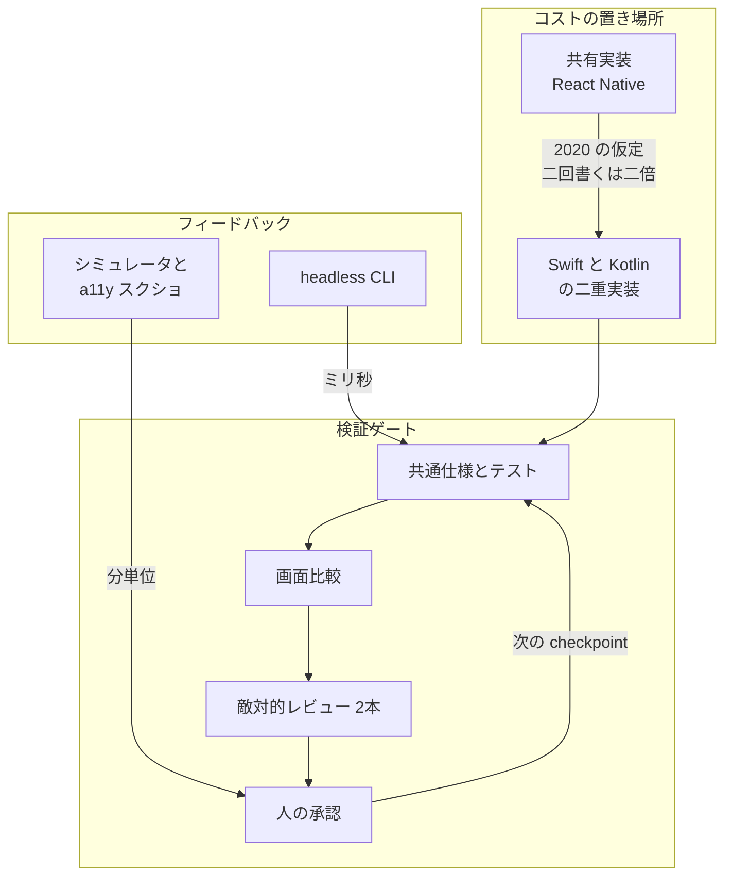
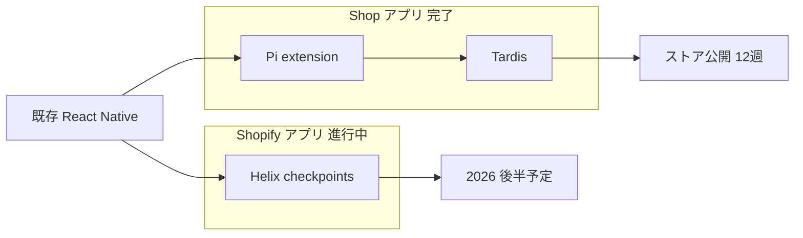

Shopify は 2026-09-10、[Native is now the future of mobile at Shopify](https://shopify.engineering/back-to-native) で、モバイルアプリ群を React Native から Swift と Kotlin の native 実装へ移すと発表しました。
著者は Head of Mobile の Mustafa Ali です。
対象は Shopify、Shop、Point of Sale、Inbox です。

この記事では、2020 年の React Native 方針、2025 年の成功宣言、2026 年の native 回帰、Shop の 12 週移行、Shopify アプリ向け Helix、公開ライブラリの扱いを一次資料に沿って整理します。
読み終えると、共有実装の保守費用と、仕様・テスト・レビューの二重費用のどちらが支配的かを、自チームの前提として点検できます。

数値と到達宣言は Shopify の自己申告です。
第三者ベンチマークは公開されていません。

*この記事の全体像。以下、順に解説します。*

## Shopifyのnative回帰とは

2020-01-29 の公式方針 [React Native is the Future of Mobile at Shopify](https://shopify.engineering/react-native-future-mobile-shopify) は「新規モバイルは React Native」でした。
Arrive（後の Shop）は、約 95% のコード共有で Android 版を出した、と当時の本文は書きます。
理由は 3 つです。二重実装の回避、人材の横断、機能差の解消です。

2025-01-13 の回顧 [Five years of React Native at Shopify](https://shopify.engineering/five-years-of-react-native-at-shopify) は、全アプリの React Native 移行完了を宣言しました。
画面ロード P75 は 500ms 未満、crash-free sessions は 99.9% 超、New Architecture 採用の約束が並びます。
著者は 2026 年と同じ Mustafa Ali です。

2026-09-10 の方針記事は、React Native アプリは速いと明言したうえで、共有実装の経済性が下がったので native に戻ると書きます。
late 2025 以降のコーディングエージェントが、実装、翻訳、テスト、レビューの一部を担えるようになり、「二回書くと二倍の仕事」という 2020 年の仮定を再評価した、と本文は述べます。
出典は社内スナップショットです。

消費者向け Shop は、[Migrating Shop app from React Native to native](https://shopify.engineering/shop-app-migration) が書くとおり、既存 React Native 実装を参照した greenfield 再構築です。
コアは 6 エンジニアで、途中から feature teams が参加しました。
サインイン、プッシュ、下流が依存する analytics イベントは維持し、一部画面は意図的に廃止または簡素化しました。
公式は、PoC からストア公開まで 12 週で出荷したと書きます。
Shop 側のエージェント手順は、Pi coding agent の extension と、実行中アプリのイベント、ログ、状態に触れる Tardis です。

Shopify アプリは進行中です。
画面は 300 を超え、ウィジェット、Apple Watch、Siri Shortcuts があります。
公式は 2026 年後半出荷予定と書きます。
画面単位の内部システム Helix を使います。
Helix は React Native を読んで小さな checkpoint 列を提案します。
各 checkpoint はテスト、画面比較、敵対的レビュー 2 本、人の承認を通るまで次へ進めません。
業務ロジックを UI から切り離し、desktop 上の headless CLI で状態検査と操作を行う方針も書きます。
シミュレータは remote mode のコマンド駆動に寄せます。

公開ライブラリの扱いは分かれます。
React Native Skia は 2026 末までスポンサーし、William Candillon が fork して改名継続します。
FlashList は互換を壊す critical を直しつつ steward を協議中です。
Restyle は 2026 末で保守停止です。

コストの置き場所は、共有実装の保守、二重実装のゲート、検証の待ち時間、公開ライブラリの外部性に分かれます。

Shop 完了と Helix は別物です。
Shop は Pi と Tardis です。
Helix の図示対象は Shopify アプリです。

## 注意点

数値と到達宣言は、すべて Shopify 自己申告です。
第三者ベンチマークは公開されていません。

| 主張 | 一次の定義 | 信じてよい範囲 |
|---|---|---|
| Shop 12 週で native 公開 | PoC からストア公開。コア 6 人に途中参加の feature teams | 期間の自己申告。機能凍結の有無は本文に無い |
| iOS 起動 23%、Android 50% 短縮 | アイコンタップからホームフィード初期表示。iOS 2466 ms 対 3200 ms、Android 2233 ms 対 4433 ms | 端末、反復、ネットワークは未記載。Android 120 FPS だけ Pixel |
| crash 10x 減 | session stability 99.5%+ から 99.95%+。「crash したセッションの 10 倍減」 | 分母のセッション数、期間、OS 内訳は無い。セッション単位なら 90% 減と同じ言い換えになる。2025-01 全社 RN の 99.9% 超とは下限表現と集計条件が違い、直接比較できない |
| Android 109 MB 減 | release 184 MB 対 293 MB（−37.2%） | iOS は 68 MB 対 67 MB で +1.5%。サイズ勝ちは Android のみ |
| Android ビルド約 75% 短縮 | release build | iOS ビルド時間はほぼ同じ |
| FlashList 約 2M DL/週 | 方針記事の会社概数 | npm last-week（2026-09-04 から 10）は 1,451,803。概数として方向は合う |
| Helix で従来より短い時間に rebuild | 方針記事の定性 | 確認した一次に公開実装のリンクは無い。同一条件の追試に必要な詳細は不足。Shop の 12 週を Helix 効果へ帰属する一次も無い |
| 全アプリを移す | 方針記事の方針 | 完了は Shop。本丸 Shopify アプリは未出荷 |

二次記事が「クラッシュ率 90% 減」と書く場合、セッション単位の 10 倍減と同じ言い換えなら一次と矛盾しません。
ユーザー数やクラッシュ件数への置き換え、測定母数なしの整数化は一次を超えます。
Helix が Shop の 12 週を運んだ、という帰属は一次にありません。

2025-01 の同一著者が「React Native の未来は明るい」と書いた数値（sub-500ms、99.9% crash-free）を、2026-09 は反証していません。
壊したのは「二回書くコスト」の仮定です。
性能敗北譚として読むと、公式本文とずれます。

完了事例は Shop のみです。
Helix 対象の Shopify アプリは未出荷です。
「Shopify 規模」は未検証です。

Shop 数値は、画面削減つきの新規 native 対 成熟 RN です。
rebuild 効果と言語効果は分離されていません。

Helix、Tardis、headless CLI について、確認した一次記事に公開実装へのリンクはありません。
同一条件での追試に必要な詳細は不足しており、社外での再現性は未検証です。

[React Native Showcase](https://reactnative.dev/showcase) は 2026-09-12 時点で Meta、Microsoft、Amazon、Wix を掲載し続けます。
同ページは Shopify も RN 製と書いており、更新遅延があります。
掲載継続は、各社の最新方針や離脱発表の不存在を保証しません。

## どの選択肢が残りやすいか

公開一次が並べる軸は、共有実装を維持するか、native へ戻してプロセスで parity を取るかです。
Kotlin Multiplatform のようなロジック共有は、方針記事と Shop 移行記事の本文では比較していません。

| 基準 | A. 共有実装を維持（RN と New Architecture） | B. native 回帰、エージェント翻訳、プロセス parity | C. ロジック共有、UI native（KMP 等） |
|---|---|---|---|
| ユースケース | web 人材の投入、OTA、機能差をコードで強制 | プラットフォーム API 当日利用、first-party ツール、依存レイヤ削減 | 業務ロジックは一度、UI は各 OS |
| 実装の複雑さ | フレームワーク更新と 3rd party | Swift と Kotlin の二本。ゲートとハーネスが本体 | 共有モジュールと二重 UI |
| 運用負荷 | RN バージョン追従、供給連鎖 | 二ストア、二言語、シミュレータ待ち | 共有ロジックの API 境界 |
| 監査可能性 | 単一 JS 実装 | 仕様、テスト、レビュー checkpoint | 共有モジュールの契約 |
| スケール | Showcase では Meta、Microsoft、Amazon、Wix の掲載が継続。各社の最新方針は別途確認が必要 | Shop 1 本が完了。300 画面超は未検証 | Google 公式が business logic 共有を production-ready と記載 |
| リスク | New Architecture 投資の継続 | greenfield 期間の機能停止、OSS 外部性、内部ツール依存 | 方針記事が比較していない |

A が残りやすい条件は次です。

- ウェブとモバイルで TypeScript 人材を共有している
- [EAS Update](https://docs.expo.dev/eas-update/introduction/) のような JS OTA が hotfix 経路である
- プラットフォーム固有面が薄く、小チームで二ストアを出したい
- Helix 型ゲートも headless CLI も持たない

B が残りやすい条件は次です。

- 既存の完成した実装が参照として残っている
- 画面単位のテスト、視覚比較、敵対的レビュー、人の承認を自動化できる
- 業務ロジックを UI なしで CLI 実行できる
- ウィジェット、Watch、Siri、長時間バックグラウンドなど、2025 時点でも native 領域だった面が多い
- 週次ストア更新とサーバーフラグで OTA 相当を代替できるリリース機構がある

C が検討対象になる条件は次です。

- 捨てたいのが UI 共有であり、ドメインロジック共有ではない
- 全面 greenfield を避け、既存アプリに共有モジュールを足したい

Google は [Kotlin Multiplatform](https://developer.android.com/kotlin/multiplatform) を business logic 共有の公式手段として、2026-08-27 更新のドキュメントで production-ready と書きます。
方針記事の二項対立は、選択肢を狭くしています。

[Supercharging Discord Mobile](https://discord.com/blog/supercharging-discord-mobile-our-journey-to-a-faster-app) は 2025-03 時点で RN を維持し、hotspot だけ native 化しました。
ChannelList では FlashList を低価格 Android で自社リストへ戻しました。
動的高さのリストでは FlashList を使い続ける、と公式は書きます。

## 一次資料が支持する範囲

Shopify の発表は、共有実装で節約していたコストが、エージェントと検証ゲートの組み合わせで相対的に小さくなった、という再評価です。
発注側が持ち帰る核はスタック名ではなく、前提の再評価単位です。
一般解としての native 回帰は、公開一次だけでは支持されません。

支持できる一次は次です。

- 2020 の 3 理由と 2025 の成功宣言を、2026 が自ら前提として残している。失敗の隠蔽という読みは、公式本文と合いません
- one-shot 移植は出荷不能コードになると方針記事が書きます。Helix の「最初の出力は誤り」前提は、エージェント移行の失敗モードに対する一次の自己観察です
- Shop は参照実装付き greenfield で 12 週公開まで到達した、と公式が書きます
- parity をコード共有から「開発・リリースプロセス」へ移すと、Shop 移行記事が明示します
- シミュレータ待ちがモデル品質よりボトルネックだと方針記事が書きます。headless CLI は検証時間の問題設定として一次です

支持できない一般化は次です。

- 完了事例は Shop のみ。Helix 対象の Shopify アプリは未出荷です
- Shop の 12 週を Helix の効果として帰属する一次根拠はありません。Pi extension と Helix の関係は未確認です
- iOS サイズは +1.5%、iOS ビルド時間はほぼ同じです。native が常に運用コストを下げる一次ではありません
- Helix、Tardis、headless CLI の社外再現性は未検証です
- [METR の 2025-07 RCT](https://metr.org/blog/2025-07-10-early-2025-ai-experienced-os-dev-study/) は、経験豊富な OSS 開発者で AI 利用時 19% 遅いと報告します。2026-02 追試は効果量を確定しません。方針記事の「二重実装が決定要因でなくなった」は社内プロトタイプであり、独立 RCT と接続しません
- FlashList は steward 未定のまま critical 以外を約束しません。npm 約 145 万 DL/週（2026-09-10 週）です。「驚きのない移行」はここが弱いです
- 2000 年の [Spolsky](https://www.joelonsoftware.com/2000/04/06/things-you-should-never-do-part-i/) が指摘した from-scratch rewrite のリスク（知識喪失、出荷空白）を、エージェントが消した一次データは Shop 以外にありません

結論の頑健な部分は、「前提が壊れたらスタックを再評価する」「one-shot を禁ずる」「検証をシミュレータから外す」です。
脆弱な部分は、「エージェントがあるから大規模本番は native が合理」への一般化です。
公開一次は後者を支持しません。

未確認のまま残るのは次です。

- Shopify アプリ 300 画面超の実際の期間と、機能出荷が止まったか
- Helix と Pi extension の関係、checkpoint の粒度、敵対的レビューのモデル
- Shop 起動時間の端末、反復、ネットワーク
- 99.5% / 99.95% の分母
- FlashList の後継組織名と、critical 以外の保守範囲
- William Candillon の Skia fork の新リポジトリ名
- Meta 公式の反応

## ADRをどう更新するか

更新対象は「モバイルは React Native」という結論そのものではありません。
「二回書くコスト」と「フレームワーク保守コスト」のどちらが支配的か、という仮定です。
Shopify の native 回帰を、自社のデフォルトにコピーしないでください。

読者テーマは、AI 前提の ADR、レガシー刷新の移行単位、UI と業務ロジックの分離です。
方針記事と Shop 移行記事は、3 つとも一次で触れます。

移行単位は「アプリ丸ごと one-shot」ではありません。
Shop では計画ハッシュ付きの画面または機能、Shopify アプリでは Helix の checkpoint です。
検証の本体はモデルではなく、テスト、画面比較、敵対的レビュー、人の承認、headless CLI です。
公開ライブラリの出口は移行計画の一部です。
FlashList は継続保守の引受先を協議中です。
Restyle は 2026 末で保守終了予定で、引受先は未発表です。
Skia は William Candillon による継続予定です。

画面を減らした greenfield の数字を、既存機能の完全移植速度と読まないでください。
Shop の 12 週を Helix 必須の証明に使わないでください。
一次は Pi と Tardis を書きます。
小チームの OTA と TypeScript 人材を、Shopify の週次ストア更新で置き換えられると思わないでください。

発注側が先に書いてよい条項は次です。

1. ADR に「この決定が無効になる仮定」を 1 節で書く。例: エージェントが他プラットフォームへの翻訳とレビューを、人のゲート無しでは出荷不能であること
2. 刷新は画面またはジャーニー単位の checkpoint にする。最初の出力を正としない
3. 業務ロジックを UI から切り離し、CLI またはヘッドレステストで回せる境界を先に作る。シミュレータを内ループに残したままエージェント人数を増やさない
4. 共有ライブラリを出しているなら、steward、archive 日、critical のみか否かを移行発表と同時に書く
5. KMP、選択的 native、RN 維持を、Shopify が本文で捨てたという理由だけで捨てない

逆転条件は次です。

- Shopify アプリが大幅に遅れ、greenfield が再び「年単位」になったとき
- FlashList が無 steward のまま互換が割れ、自チームの RN 資産が先に壊れたとき（その場合の論点は native 回帰ではなく依存リスク）
- 自チームで one-shot 移植がレビューを通る品質になったとき（方針記事の失敗観察が自チームで再現しない）
- ウェブ共有と OTA が、自プロダクトの主経路であるとき

直近の次のアクションは次です。

1. 現行モバイル ADR に、2020 型の 3 仮定（二重実装、人材、機能差）が今も支配的かを表で記入する
2. 1 画面だけ、テスト、画面比較、人の承認の最小ゲートで他プラットフォームへ移植する実験をする
3. 業務ロジックの headless 実行可否を、シミュレータ無しで測る
4. FlashList、Skia、Restyle を使っているなら、2026 末までの依存チケットを切る

ADR の更新は止める必要はありません。
スタックの即時切り替えは止めてください。
完了条件は Shop 1 本の自己測定ではなく、自チームの前提チェックです。

## まとめ

Shopify は 2026-09-10、React Native アプリは速いと書いたうえで、共有実装の経済性が下がったので Swift と Kotlin へ戻すと発表しました。
完了しているのは Shop です。コア 6 人の greenfield を 12 週でストア公開した、と公式は書きます。
本丸の Shopify アプリは Helix の checkpoint で進行中であり、2026 年後半出荷予定です。

持ち帰る核はスタック名ではありません。
「二回書くコスト」がまだ支配的か、仕様とテストとレビューのゲートと headless 実行が先に作れるか、公開ライブラリの出口があるか、です。
12 週や 10x 減を自社目標へ転記せず、1 画面の最小ゲートと、ADR の無効条件から始めてください。

この記事が少しでも参考になった、あるいは改善点などがあれば、ぜひリアクションやコメント、SNSでのシェアをいただけると励みになります！

## 参考リンク

1. Mustafa Ali, “Native is now the future of mobile at Shopify,” Shopify Engineering, 2026-09-10. https://shopify.engineering/back-to-native
2. Max Da Silva, Jason Kim, Quique Fagoaga, “Migrating Shop app from React Native to native,” Shopify Engineering, 2026-09-10. https://shopify.engineering/shop-app-migration
3. Mustafa Ali, “Five years of React Native at Shopify,” Shopify Engineering, 2025-01-13. https://shopify.engineering/five-years-of-react-native-at-shopify
4. Farhan Thawar, “React Native is the Future of Mobile at Shopify,” Shopify Engineering, 2020-01-29. https://shopify.engineering/react-native-future-mobile-shopify
5. Talha Naqvi, “Improving Shopify App’s Performance,” Shopify Engineering, 2024-03-05. https://shopify.engineering/improving-shopify-app-s-performance
6. React Native Showcase（取得 2026-09-12）. https://reactnative.dev/showcase
7. Google, “Kotlin Multiplatform,” ページ更新 2026-08-27. https://developer.android.com/kotlin/multiplatform
8. JetBrains, “Compose Multiplatform”（取得 2026-09-12）. https://kotlinlang.org/compose-multiplatform/
9. Discord, “Supercharging Discord Mobile,” 2025-03-05. https://discord.com/blog/supercharging-discord-mobile-our-journey-to-a-faster-app
10. Expo, “EAS Update,” docs 更新 2026-07-22. https://docs.expo.dev/eas-update/introduction/
11. Joel Spolsky, “Things You Should Never Do, Part I,” 2000-04-06. https://www.joelonsoftware.com/2000/04/06/things-you-should-never-do-part-i/
12. METR, “Measuring the Impact of Early-2025 AI on Experienced Open-Source Developer Productivity,” 2025-07-10. https://metr.org/blog/2025-07-10-early-2025-ai-experienced-os-dev-study/
13. Shopify/flash-list issue #2307（OPEN）. https://github.com/Shopify/flash-list/issues/2307
14. Simon Willison, “Native is now the future of mobile at Shopify,” 2026-09-10. https://simonwillison.net/2026/Sep/10/shopify-react-native/
