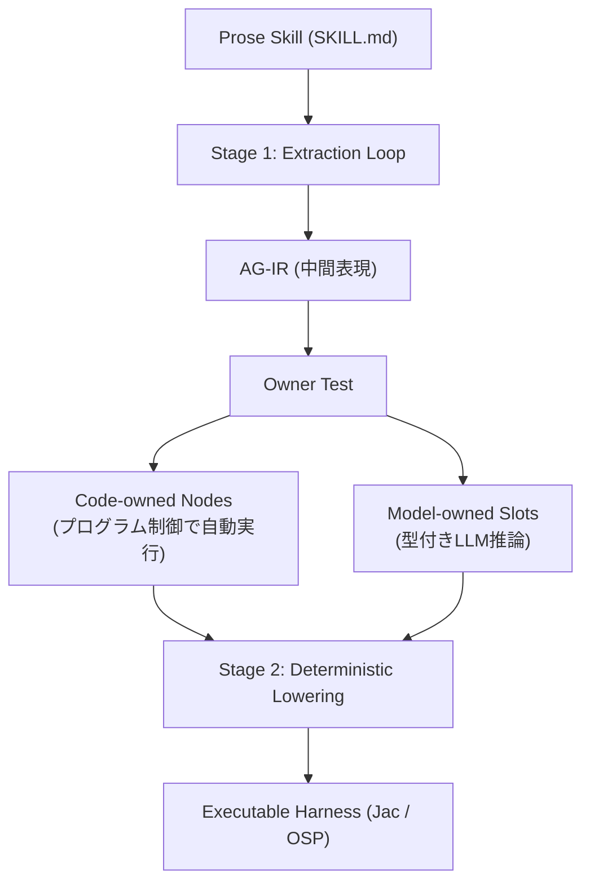

自然言語で書いた手順書（`SKILL.md` のような Skill）をエージェントに読ませ、その通りに動いてもらう。この構成はいま広く使われています。しかし「必ずテストを実行してから完了報告すること」と書いたのに、テストを実行せずに「全件合格しました」と報告されたことはないでしょうか。

2026年7月に公開された論文 **SIGIL: Compiling Agent Skills into Typed Harnesses**（[arXiv:2607.27309](https://arxiv.org/abs/2607.27309)）は、この現象を30種類の Skill にわたって測定し、原因が「モデルの言語理解不足」ではなく「実行機構の欠如」にあることを示しました。

この記事では次の3点を扱います。

- 文章で書かれた Skill が守られない度合いと、その失敗の型
- SIGIL が採用した「Skill をコードへコンパイルする」構造と判断基準
- SIGIL を導入しない場合でも自分のエージェント基盤に持ち帰れる設計原則

## 文章で書いたSkillはどれだけ守られないのか

論文は、Skill をコンテキストに読み込んで ReAct ループで解釈・実行するエージェントを **Prose Agent** と呼び、30種類の Skill × 各9回の実行を GPT-4o と GPT-5 の2世代で測定しました。指標は **AMC（Applicable-Mandate Compliance）**、つまり「その状況で適用されるべき必須手順のうち、実際に実行された割合」です。

結果は次の通りです。

| 指標 | Prose Agent (GPT-4o) | Prose Agent (GPT-5) |
| --- | --- | --- |
| 手続遵守率 (AMC) | 56% | 68% |
| 全工程完遂率 | 28% | - |

必須と書いた手順の半分弱が飛ばされ、最初から最後まで手順を崩さず完遂できたのは3割弱でした。

厄介なのは、**成果物だけを見ても異常に気づけない**点です。テスト報告書や要約文書はもっともらしい形で出力されており、省略されているのは内部の検証ステップだからです。

### 省略のされ方には型がある

論文は Prose Agent の失敗を3つのパターンに整理しています。いずれも「出力は正常、過程が欠落」という共通構造を持ちます。

**1. 実行されなかった検証**

`verification-before-completion` Skill で、モデルは「テスト全件合格、ビルド成功」と報告書に書きながら、テストコマンドを一度も実行していませんでした。Prose の遵守率は 30%、SIGIL のハーネスでは 84% でした。

**2. 語られたが実行されなかった呼び出し**

`gh-issues` Skill で、GitHub REST API から最新状態を取得するよう指示されているのに、モデルは「取得リクエストを行います」と文章で述べただけで、実際にはコンテキスト内の古い情報から記述を組み立てていました。Prose 20%、SIGIL 100%。

**3. 単一成果物への工程崩壊**

`brainstorming` Skill の「提案 → 議論 → フィードバック → 承認 → コミット」という多段階手順に対し、モデルは途中の承認や対話を飛ばして設計ドキュメントを一発で出力し終了しました。Prose 40%、SIGIL 99%。

3つに共通するのは、**「実行の証跡を持たない手順ほど省略される」**という点です。文章として書かれた制御フローは、モデルが実行のたびに再構築する対象であり、再構築のたびに落ちる可能性があります。

## SIGILの解き方: 制御フローをコードへ降ろす

SIGIL の発想は「Skill の書きやすさは自然言語のまま残し、実行時の強制力だけをコードへ移す」というものです。中核は中間表現 **AG-IR（Agentic Intermediate Representation）** と二段階コンパイルです。

### Owner Test: コードに任せるかモデルに任せるかの単一基準

SIGIL は Skill の各ステップに対し、たった一つの問いを投げます。

> このステップの出力は、入力の決定論的関数か？

- **Yes → Code-owned**: テストスクリプトの実行、API レスポンスの取得、集計計算、ログ記録。モデルの可否判断を挟まず無条件に実行されるプログラム構造へ固定されます。
- **No → Model-owned**: デザインの合否判断、定性的な要約、自由形式の試行。型定義された制約付きスロットとしてモデルへ委譲されます。

この問いが実務上有用なのは、**「重要かどうか」ではなく「決定論的かどうか」で線を引いている**ためです。重要度で線を引くと、重要な判断ほどモデルに任せたくなり、結果として検証がプロンプトに残ります。決定論性で線を引けば、検証は自動的にコード側へ落ちます。

### 命令の強さを構造へ変換する

自然言語の命令の強さ（Deontic Modality）は、次のようにプログラム構造へ置き換えられます。

| 自然言語での表現 | 変換先の構造 | 効果 |
| --- | --- | --- |
| Mandatory（必須） | ノード進入時に自動トリガーされる Ability | 実行をスキップする選択肢が存在しない |
| Forbidden（禁止） | グラフ構造から該当ノードを削除 | 遷移先が存在しないため誘導されても到達不能 |
| Discretionary（選択的） | 型付き判決値（Enum等）として取得 | 制御側の `if` / `switch` 分岐へ供給 |

「必ず実行せよ」をプロンプトに書き続ける限り、それは確率的な要請にとどまります。ノード進入時のフックに変換すれば、実行しないという状態が表現できなくなります。禁止事項も同様で、「やってはいけない」と書くより、遷移先を消すほうが強い保証になります。

### 抽出フェーズだけにLLMを使う

コンパイルは2段階に分かれています。

- **Extraction（抽出）**: LLM が自然言語から AG-IR を抽出します。虚偽の抽出を防ぐため、原文からの完全引用を求める **Grounding Filter** や、必須ステップがコード側に固定されているかを検証する **STRUCT-COV** を含む6つの Compile Gates が検査し、不合格なら拒否・再修復します。
- **Lowering（低級化）**: AG-IR から Jac 言語（Object-Spatial Programming）の実行コードへ変換します。ここに LLM の推論は一切含まれず、完全に決定論的です。

LLM を使う範囲を抽出だけに閉じ込め、そこにゲートを設ける構造です。実行時のふるまいは生成済みコードで決まるため、実行のたびに揺れません。

## 効果と代償

30 Skill での測定結果は次の通りです。

| 指標 | Prose (GPT-4o) | Prose (GPT-5) | SIGIL (GPT-4o) | SIGIL (GPT-5) |
| --- | --- | --- | --- | --- |
| 手続遵守率 (AMC) | 56% | 68% | 86% | 86% |
| 全工程完遂率 | 28% | - | 65% | 65% |
| トークン消費量（中央値） | 1.00x | - | 0.58x | - |

読み取れる点は3つあります。

**モデル世代に依存しない**。Prose は GPT-4o の 56% から GPT-5 の 68% へ揺れますが、SIGIL のハーネスは両世代とも 86% で一定です。品質がモデルの推論能力ではなく制御構造に依存しているためで、モデルを載せ替えても遵守率が変わらないことを意味します。

**完遂率は2.3倍**。28% から 65% へ改善しています。手順の途中で検証や確認を端折らずに最後まで通る割合です。

**トークンは中央値で42%削減**。長大な Prose Skill を毎回コンテキスト全体に読み込ませず、型付きスロットごとに必要な最小コンテキストだけを注入するためです。機構重視の Skill では 0.02x（98%削減）まで下がるケースもありました。

ただし、これは全 Skill 一様ではありません。

## 万能ではない: 3つの限界

### 1. 86%は100%ではない

残る 14% の不履行は、美意識の判断や高度な要約など Model-owned として委譲せざるを得ないノードで発生します。モデル自身が指示を無視・誤解するためで、構造化しても消えません。**「重要な判断をモデルに委ねている限り、その部分の保証はモデル依存のまま」**という前提は変わりません。

### 2. 探索的Skillではトークンが増える

`using-superpowers` や `systematic-debugging` のような、探索的なツール使用ループを含む Skill では、SIGIL のトークン消費が Prose の **3.09倍〜7.64倍** へ増加しました。

この反転の解釈が重要です。論文の分析によれば、**Prose Agent はデバッグや探索のループを途中でサボって省略していたために安価に見えていた**だけでした。ハーネスは完遂するまでループを回すため、本来必要だった作業コストが正しく計上された結果です。

つまり、コスト削減を目的に導入すると探索系 Skill で期待を裏切られます。買っているのは安さではなく、**費用の正確さと完遂**です。

### 3. 過度な固定化のリスク

柔軟な試行錯誤が必要なタスクを過剰に Code-owned へ固定すると、動的な適応力が失われ、未知のエラーに対応できなくなります。どこをコードに任せ、どこをモデルに委譲するかの境界設定が、導入の成否を分けます。

## SIGILを導入しなくても持ち帰れる設計原則

SIGIL は Jac 言語と OSP を前提とした実装であり、既存基盤へそのまま載せられるとは限りません。しかし論文の主張の核は実装非依存です。

### 検証・記録・終了条件をプロンプトに残さない

「必ずテストを実行せよ」「完了前に出力を確認せよ」とプロンプトに書いても、確率的に無視されます。次のように制御フロー側へ昇格させます。

- **検証のコード化**: スクリプト実行と終了コードの判定は、LLM の判断を経ずにシェルやハーネス側で直接実行する。
- **状態記録の強制**: 実行結果の DB 記録や完了マーカーの書き込みは、LLM のツール呼び出しに頼らず、フレームワークの Hooks や EXIT trap で駆動する。
- **完了条件の自動評価**: 成果物の存在や更新日時のチェックは、決定的なスクリプトに判定させる。

いずれも「モデルが忘れても成立する」構造にする、という一点に集約されます。

### 新しいSkillを書く前にOwner Testを通す

Skill を書き始める前に、各ステップへ「出力は入力の決定論的関数か」と問い、Yes のステップは最初からプロンプトに書かずコード側へ置きます。プロンプトに残すのは、モデルの認知的判断が必要なステップだけです。

この習慣だけでも、「書いたのに守られない指示」を構造的に減らせます。Skill を「モデルに読ませるテキスト」ではなく、**型・制御フロー・観測可能性を備えたソフトウェア資産**として扱う、という再定義がこの論文の実務的な骨子です。

## まとめ

- 文章で書かれた Skill の必須手順は 56%（GPT-4o）しか実行されず、全工程完遂率は 28% にとどまる。成果物は正常に見えるため、省略に気づきにくい。
- SIGIL は Owner Test（出力は入力の決定論的関数か）で各ステップをコード所有とモデル所有へ分離し、必須・禁止・選択という命令の強さを制御構造へ変換する。
- 結果として遵守率 86%、完遂率 65% をモデル世代非依存で達成し、トークンは中央値 0.58 倍になる。
- ただし探索的な Skill ではトークンが 3〜7 倍へ増える。これは Prose 側がループを省略していた分が正しく計上された結果であり、買っているのは安さではなく完遂である。
- SIGIL を導入しなくても、「検証・記録・完了判定をプロンプトから外してコードへ置く」「Skill 作成前に Owner Test を通す」という2点は今日から適用できる。

エージェントに手順を守らせたいとき、まず疑うべきは指示文の書き方ではなく、その手順が実行機構に固定されているかどうかです。

この記事が少しでも参考になった、あるいは改善点などがあれば、ぜひリアクションやコメント、SNSでのシェアをいただけると励みになります！

## 参考リンク

- J. A. Dantanarayana, S. K. Niyangoda, L. Tang, J. Mars (2026). *SIGIL: Compiling Agent Skills into Typed Harnesses*. arXiv:2607.27309. https://arxiv.org/abs/2607.27309
- Anthropic (2025). *Equipping agents for the real world with Agent Skills*. https://www.anthropic.com/engineering/equipping-agents-for-the-real-world-with-agent-skills
- S. Yao, et al. (2023). *ReAct: Synergizing Reasoning and Acting in Language Models*. ICLR 2023.
- J. L. Dantanarayana, et al. (2025). *MTP: a meaning-typed language abstraction for AI-integrated programming*. OOPSLA 2025.
