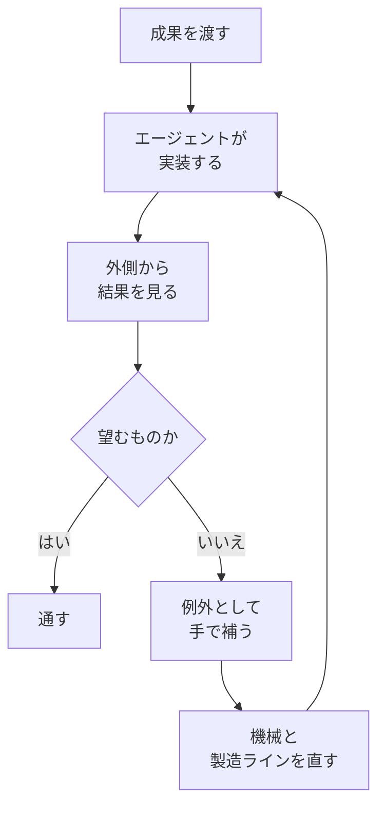

2026年9月23日、Rails World 2026（オースティン）の開会基調で、37signals の共同オーナー兼 CTO である DHH（David Heinemeier Hansson）は、同社が手でコードを書くことを、ものを作る通常業務から外したと述べました。公式動画の字幕ファイルは未取得のため、ステージ上の英語は、公式動画を見た二次情報の範囲で読みます。

この記事では、本人の投稿とステージの文を分けます。そのうえで、宣言が翻訳できる範囲と、自社の完了定義に別に書く4欄を整理します。

*この記事の全体像。以下、順に解説します。*

## 37signalsの手書き停止とは

宣言の主体は 37signals です。場所は Rails World 2026 の開会基調です。登壇ページの時刻は9月23日 9:45 です。公式動画は、Ruby on Rails チャンネルが2026年9月24日に公開した “Rails World 2026 Opening Keynote - DHH” です。長さは1時間3分7秒です。説明文は、AI エージェントの時代、手書きについての pencils down、設定より規約、徹底した楽観、を並べています。

同日 01:40 UTC の本人投稿は、次の文です。

> It's pencils down, people. Writing code by hand is no longer an economically viable skill for most programmers at most companies. But the future of making software has never been brighter. Don't you dare black pill this beautiful moment!

運用として置かれた流れは、公式動画を見た ITmedia（2026年10月1日、一色政彦）と Business Insider（2026年9月27日）が揃える範囲では、次のとおりです。数週間前に決めました。通常業務として手で書くのはやめました。手書きは例外的な状態です。Sentry の不具合と同じ信号として扱います。なぜエージェントは望むものを作れなかったのか、と問います。しばらくは鉛筆で補います。そのあと機械を直し、製造ラインを直し、再稼働します。すでに起きていることの認識だ、と二次情報は転記しています。

人が渡すものは、実装手順ではなく、望む成果です。ITmedia の紹介は、人は事業の所有者のように外側から結果を見る、と要約しています。

公式アカウント @rails は2026年9月24日に、オースティンの開会、pencils down、設定より規約がこの局面に向くこと、を紹介しています。

同じ会議の翌日、閉会基調の Aaron Patterson は、公式説明に次の文を残しています。コンパイラが約束する as-if は、外から見た振る舞いが、書いたコードと一致するという約束です。AI はその約束をしていないので、コードを読み続ける、という結論です。公式説明の文は次のとおりです。

> your compiler promised you the as-if rule, but your AI hasn't, so keep reading your code.

同じ説明は、Aaron も AI に積極的であり、争点はどれだけ速く進むかと、いつコードから目を離すかだ、と書いています。RubyGems.org のキャッシュ不具合と rubydoc.info を、エージェントが鎖のようにつないだ、とも書いています。

基調が口頭で置いたループは、次の形です。図の箱は、二次情報が公式動画から転記した動詞だけです。

「機械」と「製造ライン」の中身を、モデル、指示ファイル、ハーネス、テスト、Lint に割り当てた表は、ITmedia が筆者の解釈だと書いています。

## 講演が人に残した作業

基調が「人が残す作業」をどう置いたかは、次の表です。字幕ファイルは未取得です。中核の動詞は、公式動画を見た二次情報が揃える範囲です。

| 作業 | 講演側の置き方 | 出典の届き方 |
|---|---|---|
| 望む成果を渡す | 実装手順ではなく、成果を渡す | 字幕の中核は「望むものを作れなかった理由」を問うこと。手順から成果への移行の日付の比喩は二次 |
| 外側から結果を見る | 事業主が見るように、中を読まず結果で判断する | ITmedia の要約。Rust を読まない例も二次 |
| 例外の手書き | しばらく鉛筆で補う | 二次。公式字幕ファイルは未取得 |
| 機械と製造ラインを直す | 動詞としては置かれている | 中身の割り当ては ITmedia の筆者解釈 |
| レビューを誰がするか | 春はプログラマーのレビューに戻した。9月はそれを誤った結論と言い直した | 9月の言い直しは二次。4月の文字起こしは「本番に残す PR はプログラマー」 |
| リリースしてよい人 | 手順、チェックリスト、名義は、参照した講演記録には出てこない | 確認した記録の範囲 |
| セキュリティ | 本人が残した留保として要約されている | Kyle Harrison のノート（2026-09-30）。二次 |
| 見習いのレビュー眼 | 講演内に直接の言及はない、と ITmedia が書く | 公開記録上の未回答 |

閉会基調は、外側から見て同じなら中を読まなくてよい、という保証を AI には置いていません。

## 注意点

どこまでを、どの種類の出典で読めるかは、次のとおりです。

| 読めるもの | 読めないもの | 出典の種類 |
|---|---|---|
| 投稿の “viable skill” と “most” | ステージの英語原文そのもの | 投稿は本人の一次。ステージ英語は二次 |
| 例外状態、Sentry、機械と工場 | 社内ハンドブックの条項 | 公式字幕は未取得。動詞は二次。現行 handbook に該当文はない |
| 本人が挙げた桁の変化 | 監査された生産性 | 自己申告。測定手順は示されていない |
| 4月時点の工程 | 9月の言い直しの公式字幕 | 4月は文字起こし。9月の言い直しは二次 |

投稿と、ITmedia が引くステージの文は、別の文面です。投稿は “economically viable skill” と “most programmers at most companies” です。年末までの予測は入っていません。ITmedia のリードは「経済的に生産的」「ほとんどの会社のほとんどのプログラマー」「年末までには、ほぼ全ての領域、ほぼ全てのプログラマー、ほぼ全ての会社」です。ステージ側の英語は、タイムスタンプ付きの二次が動画と照合した範囲で、“economically productive enterprise” と “vast majority” です。この2つを1つの引用にまとめません。

ITmedia は、Pencils Down を全面禁止として読んでいません。手書きが例外的な状態になった、と書いています。日本の X で広がった「Rails is dead」は、同記事が主題の取り違えとして扱っています。本人のパロディ返信（2026年9月27日）は “This wasn't what I said, but it's still funny” です。引用先の文面は “coding is dead” です。pencils down の投稿は残っています。パロディが否定したのは “coding is dead” の枠です。例外状態まで撤回した文ではありません。

数字は本人の自己申告です。ITmedia も、測定方法がないと書いています。講演時点の HEY Next は、着手から約1週間のデモ、という紹介です。

- 2026年8月の本番投入は15万行です。それまでの年平均は約3万行です。本人は行数を奇妙で曖昧な指標だと断っている、と ITmedia は書いています。
- 過去21年は Ruby が半分超です。今年は約3%です。好きな言語は英語です。職業プログラマーの引退は、おそらく3月です。
- HEY Next の Rust 化で、CPU は99%減、メモリは95%減です。ピークは概算で Raspberry Pi 1台です。ホスト台数を10とする二次もあります。
- 会場の挙手は「5人くらい」です。生産性を測る標本にはなりません。
- 100倍か1000倍かは、基調では規模の問いかけだと ITmedia が書いています。

別の100倍と1000倍が、2026年4月1日の REWORK 文字起こしにあります。対象は、0% から75%までの費用が100倍、場合によっては1000倍落ちた、という本人の言い方です。同じ回で、75%から先の費用はむしろ上がる、とも言っています。エージェントは美しいソフトウェアを仕上げない、とも言っています。最後の仕上げは人が不可欠だ、とも言っています。基調の問いかけと、この4月の費用の話は、同じ倍率でも中身が違います。

現行の公開ハンドブック `basecamp/handbook` の `how-we-work.md`（2026年10月1日に取得）は、6週サイクル、非同期、managers of one を書いています。手書き停止の条項はありません。2026年4月1日の REWORK では、Jason Fried が社内の pencils down を、Brian の言葉で「新機能開発を止めて磨く」と説明しています。9月の基調は同じ言葉を、手書きの通常業務からの撤退に使っています。言葉の履歴が2つあります。

登壇ページの要旨は “what's new in Rails” のままです。pencils down は要旨に出てきません。動画と投稿が、当日の主題の一次です。

次は、公開記録の範囲では閉じていません。

- 公式字幕の全文です。ステージの英語原文と、9月の言い直しの一語一句は、二次のままです。
- 非公開の社内文書に、9月の決定が条項としてあるかは、公開記録からは分かりません。
- HEY Next の99%と95%を、第三者が同じ条件で測り直した記録は、参照した範囲にはありません。
- 見習いがレビュー眼をどこで得るかは、講演は未回答です。4月の本人は、量産をシニアが見きれない、と既に言っています。
- 別件の「AI-DLC を3周した」は、37signals の近傍の実証としては使えません。三上氏の2026年9月16日の記事は、一巡していない、と本人が書いています。紛らわしい別物は、Inception / Construction / Operations の3相、3日のワークショップ、易しいサイクルのあとのもう一周、です。

## 宣言が翻訳できる範囲

9月23日の基調は、エージェントが書くことを通常にし、手書きを工場の不具合信号にする、という口頭の宣言です。完了の定義としてそのまま使うには、受入、例外、修理、リリースの4欄が空いています。

支持として読めるものは、次です。

- 本人投稿が、pencils down と、ほとんどの会社のほとんどのプログラマーと、未来は明るい、を1つの投稿に置いています。
- 公式動画の説明が、37signals の pencils down と徹底した楽観を、公式チャンネルの言葉で置いています。
- 運用の中核（例外、Sentry、機械、工場）は、ITmedia と Business Insider（2026年9月27日）が、公式動画を見て同じ方向に転記しています。公式字幕ファイルは未取得です。
- 2025年11月24日に Anthropic が Claude Opus 4.5 を発表しています。基調が Kodak Brownie の日付としてこの日を挙げた、という紹介と、発表日は一致します。比喩の中身は本人の枠組みです。

並べて限定するものは、次です。

- 2026年4月1日の文字起こしでは、探索はエージェント、残す PR はプログラマー、と本人が言っています。全部マージしてから直す方式はきしむ、とも言っています。シニアがデザイナーとジュニアの量産を見きれない、とも言っています。Fizzy はエージェント以前で、本人が “95% hand coded” と言っています。Jason Fried は、速くても耐久性は増えない、と言っています。巨大な既存製品には人の注意が要る、とも言っています。留保は “currently at least” です。
- 2026年8月26日公開の Lex Fridman #501 では、個々には正当化できる変更が束になると設計を壊し、人の手で拭いた、と本人が話しています。9月の基調は、その春に手のレビューへ戻した判断を、誤った結論と言い直しています。9月の言い直しは二次です。「5分待てば Fable が来て、おそらく元の意図どおり動いた」は、起きなかったことの想像です。再実行の記録は公開されていません。
- 個々の差分がもっともらしくても、20本から30本を束ねると穴が開く、という失敗の形があります。モデルの強さだけでは、所有者の不在が残る、と ITmedia が批判として紹介しています。これも二次です。
- 参照した公開記録には、基調後に従業員が「まだ通常業務として手で書いている」、または「方針は DHH 個人だ」と否定した一次は含まれていません。

確信度は中程度です。発言者は創業者です。方針は講演時点で数週間前です。旗艦の例は約1週間のデモ、という紹介が二次に残っています。4月の文字起こしと9月の宣言が、同じ会社の中で並んでいることが、確信度の上限です。

読みを更新する条件は2つです。37signals が、受入者とリリース者と例外の引き金を、公開の手順として出した場合です。その文書が4欄を埋めていれば、口頭宣言の読みは更新します。Fable 相当の再実行で、束ねた差分の穴が塞がった記録が出た場合は、束ねた差分についての読みを弱めます。

## 自社の完了定義に書く4欄

手書き停止の一文が翻訳できるのは、既定の作り手をエージェントに寄せ、手書きを不具合信号にする、という方向までです。運用にするときは、次の4欄を自社の完了定義へ別に書きます。行数、CPU、メモリ、挙手、1000倍、楽観の締めは、この4欄を埋めません。

経営会議で「37signals が手書きをやめたのだから、うちもレビューを外す」と出たとき、先に埋めるのはレビュー廃止の可否ではありません。受入者と、例外の引き金です。

1. 誰がエージェントの差分を受け入れるか。4月の本人は、本番に残す PR はプログラマー、と言っています。9月の言い直しは、その復帰を誤った結論と呼んでいます。どちらを採るかを、楽観の文で埋めません。
2. 何が例外経路の引き金か。Sentry のバグ、は比喩です。自社では、テストの失敗、レビューの差し戻し、本番の不具合、のどれかを名指します。
3. 「機械と製造ラインを直す」を、リポジトリの何に落とすか。指示、評価、テスト、のどれを変えると次の実行が変わるのかを書きます。ITmedia の対応表は筆者の解釈なので、そのまま社内用語にしません。
4. 誰がリリースしてよいか。講演記録には名義がありません。外側から見て望むものだ、のあとに、出す人を別に置きます。

AI-DLC との対比は、実証済みの近傍事例としてではなく、選択のレンズとしてだけ使います。AWS 型の説明は、起案を AI がやり、検証と意思決定を人の関門に残します。9月の DHH は、書くことをエージェントの既定にし、手書きを工場の不具合信号にします。4月の同じ人物は、まだ本番 PR をプログラマーに残していました。自社が採るのは、関門を残す側か、手書きを信号にする側か、です。37signals の宣言は、その選択の具体例になります。

## まとめ

Rails World 2026 の開会基調で、37signals は手書きを通常業務から外し、例外の信号にすると口頭で置きました。本人投稿の “viable skill” と、ステージ側の「年末まで」は、別の文面です。数字は自己申告です。公開ハンドブックに、手書き停止の条項はありません。

宣言を完了の定義にするには、受入、例外の引き金、修理の対象、リリースの名義、の4欄が空いています。4月の文字起こしは、本番に残す PR をプログラマーに置いたままです。9月の言い直しは、その復帰を誤った結論と呼んでいます。どちらを採るかは、自社が書きます。

この記事が少しでも参考になった、あるいは改善点などがあれば、ぜひリアクションやコメント、SNSでのシェアをいただけると励みになります！

## 参考リンク

- [DHH の投稿（2026-09-24）](https://x.com/dhh/status/2102936073642869121)
- [公式動画 Rails World 2026 Opening Keynote - DHH（公開 2026-09-24）](https://www.youtube.com/watch?v=vDjW_dRyKXY)
- [@rails の紹介（2026-09-24）](https://x.com/rails/status/2102934006094508482)
- [Rails World 2026](https://rubyonrails.org/world/2026/)
- [開会登壇ページ](https://rubyonrails.org/world/2026/speakers/dhh)
- [ITmedia（2026-10-01、一色政彦）](https://atmarkit.itmedia.co.jp/ait/articles/2610/01/news010.html)
- [REWORK S2E190（表示 2026-04-01）](https://37signals.com/podcast/pencils-down/)
- [handbook how-we-work.md](https://github.com/basecamp/handbook/blob/master/how-we-work.md)
- [Claude Opus 4.5 発表（2025-11-24）](https://www.anthropic.com/news/claude-opus-4-5)
- [パロディ返信（2026-09-27）](https://x.com/dhh/status/2104192102313930797)
- [Aaron Patterson 閉会基調（公開 2026-09-27）](https://www.youtube.com/watch?v=t0knYnEYBRo)
- [Kyle Harrison ノート（2026-09-30）](https://www.kwharrison13.com/notes/rails-world-2026-opening-keynote-dhh/)
- [Lex Fridman #501（公開 2026-08-26）](https://www.youtube.com/watch?v=NYFGCESmikA)
- [カンリー三上（2026-09-16）](https://zenn.dev/canly/articles/2a9002ac195232)
