Claude Code の Skill を「入れるべきか」を、体感ではなく実測で決める方法論を整理します。同一タスクを baseline 腕と skill 腕で並走させ、隔離した git worktree と独立 judge モデルで採否を自動判定する仕組みです。この記事では、その概要と特徴から、構造・データモデル・構築方法・利用方法、そして運用と限界までを扱います。

> 検証時点: 2026-07-20

## 概要

### 何を解決する方法論か

Claude Code の Skill を導入するかどうかは、多くの現場で「試してみて良さそうだったら使う」という体感で決まっています。

この方法論は、その判定を次の 4 条件による比較に置き換えます。

- 同一タスク
- 隔離された worktree
- 機械計測
- 独立した judge モデルによる採点

判定対象は個々の Skill です。判定結果は「採用」「棄却」のいずれかで、事前に登録した基準に従って自動的に決まります。

### Skill を実行ポリシーとして扱うという発想転換

この方法論の核心は、Skill の位置づけを変える点にあります。Skill を「あると便利な補助機能」ではなく、「変更管理の対象になる実行ポリシー」として扱います。

| 観点 | 便利機能として扱う場合 | 実行ポリシーとして扱う場合 |
|---|---|---|
| 導入判断 | 試して良さそうなら使う | 事前登録した基準を満たすかどうかで判定 |
| 比較対象 | 記憶の中にある前回の印象 | 隔離環境で同一タスクを並走させた実測値 |
| 悪化の検知 | 気づかれず放置されやすい | コスト増加や合格率低下が数値として顕在化 |
| 廃止の判断 | 属人的な感覚 | 事前登録した棄却条件に基づく判断。削除せず退避 |

「削除せず退避する」という扱いも、この発想転換の帰結です。実行ポリシーは環境が変われば再評価対象になります。今回棄却された Skill も、モデル更新時に同じハーネスで再評価できる状態を保ちます。

この方法論の固有性は、次の 3 点に集約されます。

1. **Skill 採用判定というゲート** — 汎用的な「評価系を先に作ろう」という一般論ではありません
2. **隔離 worktree での A/B 並走** — baseline 腕と skill 腕を同一タスクで実行し、対象リポジトリを汚しません
3. **事前登録された棄却条件** — 結果を見た後の解釈ではなく、実行前に固定した基準で判定します

### なぜ体感評価が破綻するか

Skill 導入の可否を体感で判断すると、次の 3 つの理由で判定が信頼できなくなります。

| 破綻要因 | 何が起きるか |
|---|---|
| 確証バイアス | 都合の良い解釈だけが記憶に残り、反例の忘却 |
| 単発試行のノイズ | LLM 出力の実行ごとのばらつきと Skill の効果の混同 |
| コストの不可視性 | トークン数・実行時間・料金の未記録によるコスト増加の見落とし |

3 つの要因はいずれも、判定基準を事前に固定せず、結果を見てから解釈することに起因します。基準を先に決めておけば、後付けの解釈を構造的に排除できます。

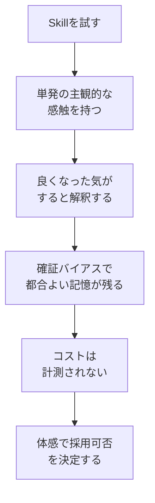

| 要素名 | 説明 |
|---|---|
| Skillを試す | Skill を有効にした状態での通常業務 |
| 単発の主観的な感触を持つ | 1 回の実行結果だけを見た印象形成 |
| 良くなった気がすると解釈する | 明確な基準のない好意的解釈 |
| 確証バイアスで都合よい記憶が残る | 期待に合う結果だけの記憶と反例の忘却 |
| コストは計測されない | トークン数・実行時間・料金の未記録 |
| 体感で採用可否を決定する | 機械計測・第三者判定を経ない採否決定 |

## 特徴

### 特徴一覧

- baseline 腕(素の状態)と skill 腕(Skill 適用版)を、同一タスクで並走
- 各腕は使い捨ての git worktree 上で実行し、対象リポジトリのファイルシステムを完全分離。実行後は worktree ごと自動削除
- worktree 作成時点の SHA を基準にし、エージェント自身がそのセッション中に作った差分だけを比較対象化。誤判定の防止
- 合否判定を担う judge は実行モデルとは別モデル。既定は実行が sonnet、judge が haiku
- judge に渡すのはタスク内容・合格基準・verify コマンドの実行結果・git diff のみ。実行ログ(思考過程やツール呼び出しの経緯)は意図的に非開示。情緒的な加点の排除が目的
- 機械計測の対象は、実行コスト・ターン数・実行時間・verify コマンドの終了コード・diff の内容
- 採用基準は実行前に固定。「skill 腕の合格率が baseline 腕を上回り、かつコスト増加が +50% 以内」で採用、満たさなければ棄却
- 棄却された Skill は削除せず退避。モデル更新やタスクの変化に応じた同基準での再評価が可能
- 実行結果は 1 実行 1 行の追記形式で記録。再現性の検証や再評価への活用が可能
- baseline 腕でも、実行者個人の環境設定(既存の Skill・hook・CLAUDE.md など)を持ち込まない実行モードを使用。「素の状態」を名乗る baseline 腕の汚染を防ぎ、評価の内的妥当性を確保。起点記事(末尾の参考リンクに挙げた nayu_ai 氏の Zenn 記事)には無い着眼点
- 実装は 1 本のスクリプトに閉じており、外部の評価基盤への依存なし

### 類似アプローチとの比較

Skill の効果測定に使える手段は、この方法論だけではありません。既存の選択肢と比較すると、位置づけの違いが明確になります。

| 手法 | 隔離の強さ | 判定の独立性 | コスト計測 | 再現性 | 導入コスト |
|---|---|---|---|---|---|
| 体感評価(何もしない) | なし | なし。試した本人の主観 | なし | なし。単発の印象に依存 | ゼロ |
| 静的なプロンプト回帰テスト(ゴールデンセット) | なし。固定入出力の比較のみで実行環境は非分離 | 機械的な一致判定が中心。LLM 判定を伴わないことが多い | なし | 高い。同一入力の再実行が可能 | 中。ゴールデンセットの作成と維持が必要 |
| LLM-as-judge のみ(隔離なし) | なし。同一環境で連続実行 | あり。採点者は別モデル。ただし実行環境の状態に判定が引きずられる | judge 分のコストのみ計測されがち | 低い。実行環境の残留状態に依存 | 低い |
| Claude Code 公式 skill-creator の eval 機能 | subagent によるコンテキスト隔離のみ。作業ツリーの隔離は未文書化 | assertion と LLM 採点の組合せ。skill 版同士の blind A/B にも対応 | トークン数・実行時間を記録。USD ベースの計測は不明示 | 中。バージョン比較目的の設計 | 低い。プラグインの install だけで利用可 |
| promptfoo | プロンプト単位のテストケース比較。リポジトリ状態は対象外 | assertion と LLM-grader を CI に組込可 | トークン使用量の追跡機能あり | 高い。宣言的 config で再実行可 | 中。config の設計と維持が必要 |
| DeepEval | なし。pytest 形式のユニットテストとして実行 | 50 種類以上の LLM-as-judge メトリクスを内蔵 | フレームワーク単体では限定的。コスト追跡は外部連携前提 | 高い。ローカルファーストで実行可 | 中 |
| LangSmith | なし。データセットとトレース単位の評価が中心 | LLM-as-judge・pairwise 比較・人手フィードバックに対応 | プラットフォーム側でトレースコストを可視化 | 高い。データセットの固定が可能 | 中〜高。SaaS 契約と UI 設定が必要 |
| 本ハーネス(worktree A/B + 独立 judge) | git worktree でファイルシステムを完全分離 | 実行モデルと別モデルの judge が、実行ログ非開示で diff と機械計測だけで採点 | コスト・ターン数・実行時間を腕ごとに記録し、事前登録した閾値で自動判定 | 同一 base SHA と同一タスク定義で再実行可。結果は追記形式で蓄積 | 低い。単一スクリプトで実装可 |

> 参考として、OpenAI が公開していた汎用評価フレームワーク「OpenAI Evals」も実在を確認しましたが、2026 年 10 月末に read-only 化、同年 11 月末にサービス終了が予定されています。新規導入の比較対象としては現時点で推奨しません。

promptfoo・DeepEval・LangSmith は、いずれも「LLM の出力品質」を評価する仕組みとして優れています。一方でこれらはプロンプト単位の評価が中心です。コーディングエージェントが実際にリポジトリへ加えた変更を、隔離されたファイルシステム上で baseline と比較する設計ではありません。

公式 `skill-creator` は事情が異なります。**Skill の A/B 評価に必要な要素をすでに実装しているため、自作を検討する前に必ず比較してください。** 詳細は次節に分けます。

### ユースケース別の推奨

| 状況 | このハーネスが必要か | 理由 |
|---|---|---|
| 複数人・複数エージェントが共有する Skill を本番投入前にゲートしたい | 必要 | 事前登録した基準での機械的な採用可否判定 |
| モデル更新のたびに既存 Skill の有効性を再確認したい | 必要 | 棄却 Skill も退避済みのため同一基準で再評価可能 |
| Skill がファイルシステムを変更するコーディング作業を伴う | 必要 | worktree 隔離なしでは Skill の効果と環境の副作用が不可分 |
| Skill が 1 回きりの個人的な補助で、他者に配布しない | 不要 | 単発の体感確認で十分。構築コストに不相応 |
| タスクがファイルシステムを変更しない応答生成のみ | 不要 | 公式 skill-creator の eval や promptfoo のプロンプト単位テストで充足 |
| 複数チームに Skill を配布し、SaaS 的なダッシュボードで継続監視したい | 部分的に必要 | 継続監視は LangSmith 等が適する。本ハーネスは投入判定の一次ゲートとして併用 |
| Skill の変更頻度が高く、CI に組み込んだ継続的な回帰検知が欲しい | 部分的に必要 | promptfoo 等の CI 統合と組合せ、本ハーネスは採用可否のゲート判定に使用 |

### 公式 skill-creator との使い分け (最初に読むべき節)

Anthropic 公式 marketplace `anthropic-agent-skills` の `skill-creator` skill は、**本稿が説明する A/B 評価の中核をすでに実装しています。** ローカル導入済みの実体 (`~/.claude/plugins/marketplaces/anthropic-agent-skills/skills/skill-creator/`) を直接確認した内容を挙げます。

| 要素 | skill-creator の実装 (SKILL.md 該当箇所) |
|---|---|
| 2 腕同時実行 | 「Spawn all runs (with-skill AND baseline) in the same turn」。with-skill を先に流して後から baseline を取る手順を**明示的に禁止**し、実行順による交絡を排除 |
| baseline の凍結 | 既存 Skill を改善する場合、編集前に `cp -r <skill-path> <workspace>/skill-snapshot/` で旧版を退避し baseline 化 |
| 機械判定の優先 | 「For assertions that can be checked programmatically, write and run a script rather than eyeballing it」 |
| 分散の明示 | `aggregate_benchmark.py` が `benchmark.json` / `benchmark.md` を生成し、pass_rate・time・tokens を **mean ± stddev と delta** 付きで出力 |
| 非識別 assertion の検出 | analyst pass が「Skill の有無にかかわらず常に pass する assertion (non-discriminating)」「分散が大きい eval (フレーク疑い)」「time/token のトレードオフ」を検出 |
| ブラインド比較 | `agents/comparator.md` が、2 つの出力を**どちらがどちらか伏せたまま**独立エージェントに判定させる (position bias / self-preference bias 対策) |
| 回帰評価 | `iteration-<N+1>/` に baseline 込みで再実行 |
| トリガー精度の評価 | should-trigger / should-not-trigger のクエリ群で `description` を評価する別ループ |

つまり「分散を見る」「ブラインド判定する」「baseline を凍結する」といった、本稿が重視する配慮の多くは公式側に実装済みです。**したがって、まず `skill-creator` を試してください。** 自作ハーネスが正当化されるのは、次の差分が自分の意思決定に効く場合に限られます。

| 観点 | skill-creator | 自作の採用判定ハーネス |
|---|---|---|
| 評価の目的 | Skill を**作る / 改善する** (authoring 時の品質ループ) | Skill を**採用してよいか**の判定 (変更管理のゲート) |
| 評価対象のタスク | Skill 作者が書くテストケース | **自分の実リポジトリの実タスク** (`repo` / `ref` / `verify_cmd` を指定) |
| 合否の根拠 | assertion + grader | **自分の verify_cmd の exit code** (既存テストスイート等) |
| コスト基準 | pass_rate と並べて tokens を提示 | **自分の予算に紐づく棄却条件** (例: コスト増 +50% 超で棄却) |
| 判定の残り方 | workspace 配下の benchmark | **事前登録と決定を台帳として保存** (監査・再評価の対象) |
| 過去バグでの検証 | 想定なし | fix を revert した ref から worktree を切る「過去バグ再注入」が可能 |

> **公式ツール自身が「評価しない選択」を認めています。** skill-creator の SKILL.md には「if the user is like "I don't need to run a bunch of evaluations, just vibe with me", you can do that instead」という一節があります。**すべての Skill を評価に載せる必要はありません。** 本稿の方法論は、配布・共有され、外れたときのコストが大きい Skill に限って適用してください。

## 構造

Skill 採用判定 A/B 評価ハーネスの論理構造を、C4 モデルの 3 段階で整理します。ハーネスは実装ではなく方法論なので、C4 は「提案フレームワークの論理構造」として読み替えます。あわせて、1 タスク × 2 腕 × N 試行の実行シーケンスを図解します。

### ●システムコンテキスト図

評価ハーネス本体を中心に、周辺のアクターと外部システムとの関係を示します。具体的なタスク名やコマンド例は含みません。

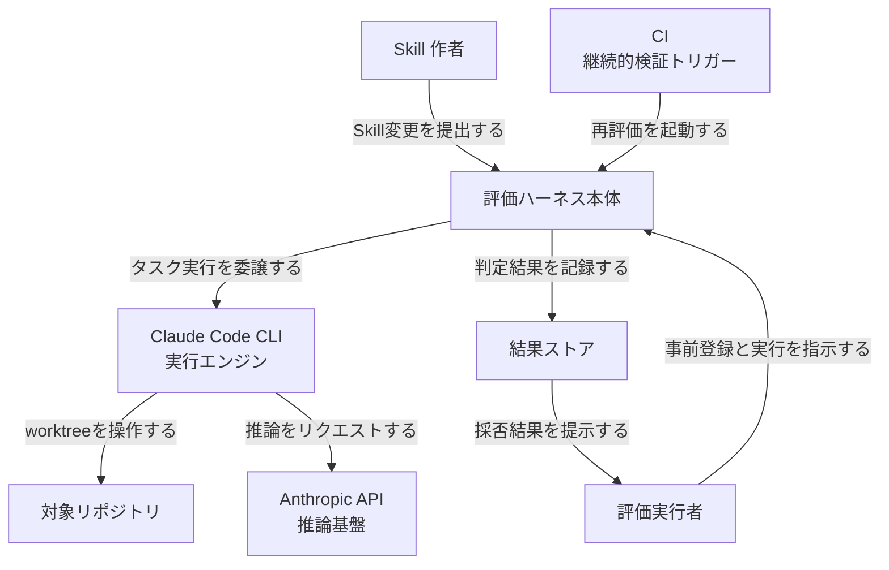

#### 要素表

| 要素名 | 説明 |
|---|---|
| Skill 作者 | 評価対象の Skill を作成または変更するアクター |
| 評価実行者 | 事前登録を作成し、評価ハーネスの実行を指示するアクター |
| CI | モデル更新や定期スケジュールに応じて再評価を起動するアクター |
| 評価ハーネス本体 | 採用可否をゲートする評価システムそのもの |
| Claude Code CLI | 非対話モードでタスクを実行する実行エンジン |
| 対象リポジトリ | 評価対象タスクが実行される git リポジトリ |
| Anthropic API | Claude Code CLI と独立ジャッジの双方が利用する推論基盤 |
| 結果ストア | 1 実行 1 行の判定結果を蓄積する記録先 |

### ●コンテナ図

評価ハーネス本体の内部を、主要な構成要素にドリルダウンします。具体的なタスク名やコマンド例は含みません。

#### コンテナ図 1: 主要構成要素

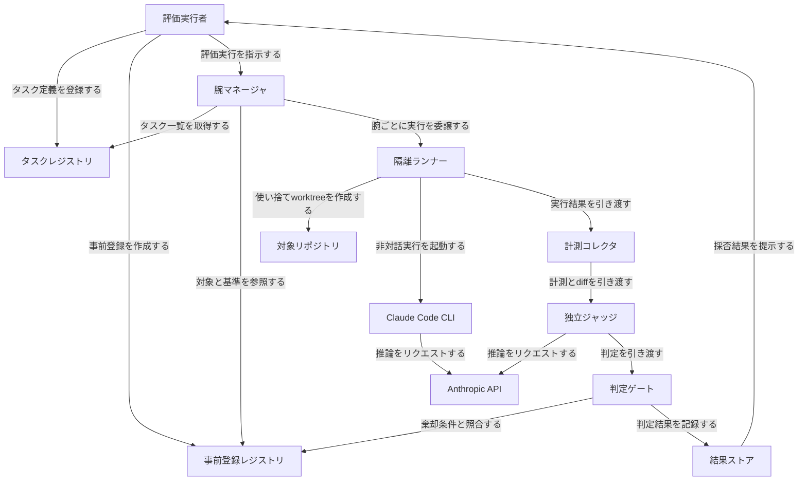

#### 要素表

| 要素名 | 説明 |
|---|---|
| タスクレジストリ | 評価対象タスクの定義を保持するコンテナ |
| 事前登録レジストリ | 対象タスク、期待効果、副作用、棄却条件を保持するコンテナ |
| 腕マネージャ | baseline 腕と skill 腕の 2 本を展開し、試行を反復するコンテナ |
| 隔離ランナー | 使い捨て worktree の作成、実行起動、破棄を担うコンテナ |
| 計測コレクタ | コスト、ターン数、所要時間、終了コード、差分を機械計測するコンテナ |
| 独立ジャッジ | 実行ログを見ずにタスクと基準と計測結果だけから合否を判定するコンテナ |
| 判定ゲート | 事前登録された基準と判定結果を照合し、採否を確定するコンテナ |
| 結果ストア | 1 実行 1 行で判定結果を蓄積する記録先 |

#### コンテナ図 2: 隔離境界とコンテキスト汚染経路

同じ隔離ランナーの内部でも、境界の種類が異なります。プロセス境界、ファイルシステム境界、コンテキスト境界の 3 種類を分けて示します。あわせて、境界を設けなければ両腕に混入する汚染源を示します。

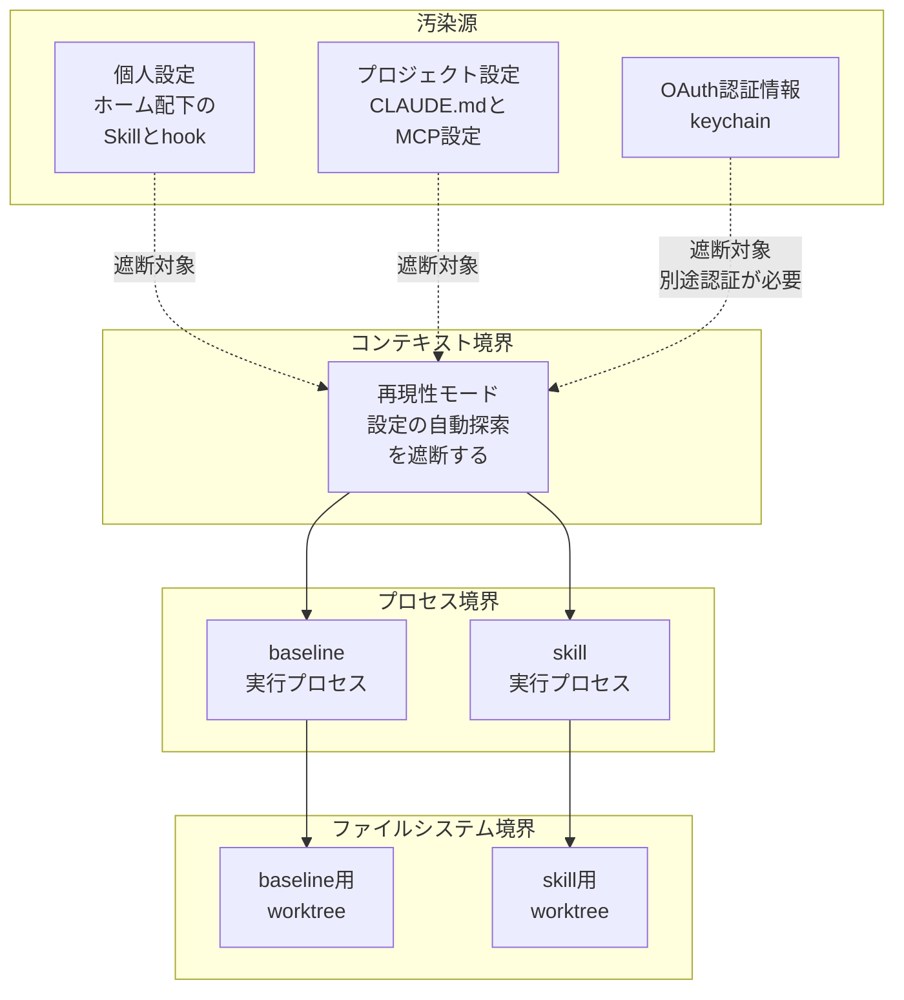

#### 汚染源

| 要素名 | 説明 |
|---|---|
| 個人設定 | 評価実行者のホームディレクトリ配下に置かれた Skill や hook |
| プロジェクト設定 | 対象リポジトリの CLAUDE.md や MCP サーバー設定 |
| OAuth 認証情報 | keychain に保存された対話ログイン用の認証情報 |

#### コンテキスト境界

| 要素名 | 説明 |
|---|---|
| 再現性モード | 設定の自動探索を遮断し、明示的に渡したフラグだけを有効にする境界 |

#### プロセス境界

| 要素名 | 説明 |
|---|---|
| baseline 実行プロセス | baseline 腕を実行する、独立した OS プロセス |
| skill 実行プロセス | skill 腕を実行する、独立した OS プロセス |

#### ファイルシステム境界

| 要素名 | 説明 |
|---|---|
| baseline 用 worktree | baseline 腕専用の使い捨て作業ディレクトリ |
| skill 用 worktree | skill 腕専用の使い捨て作業ディレクトリ |

汚染源はいずれも、評価対象 Skill の効果とは無関係な情報源です。これらが両腕に等しく混入すると、A/B の差分が「評価対象 Skill の効果」ではなく「実行環境の個人設定」を測ってしまいます。コンテキスト境界はこの混入を遮断する一次的な手段です。プロセス境界とファイルシステム境界は、腕同士および試行同士が互いの変更を踏まないための境界であり、コンテキスト境界とは独立に機能します。

### ●コンポーネント図

各コンテナをさらにドリルダウンします。ここでは実際のフラグ名やファイル名を用います。

#### コンポーネント図 A: レジストリ系

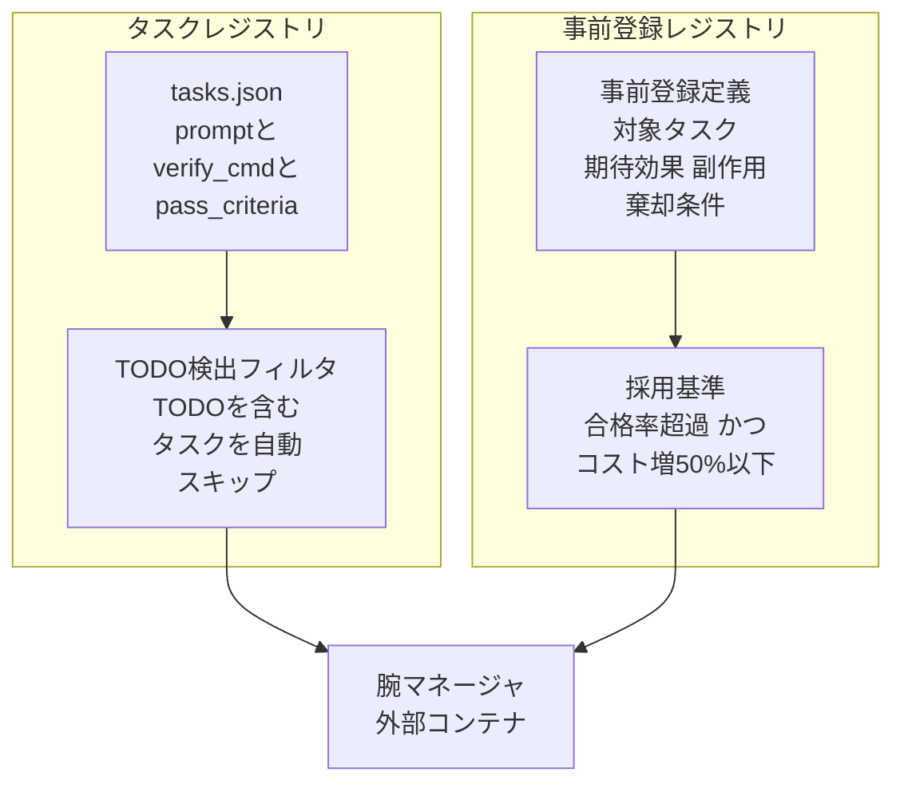

#### タスクレジストリ

| 要素名 | 説明 |
|---|---|
| tasks.json | 各タスクの prompt、verify_cmd、pass_criteria を保持するファイル |
| TODO 検出フィルタ | 本文に TODO を含むタスクを実行前に自動スキップする処理 |

#### 事前登録レジストリ

| 要素名 | 説明 |
|---|---|
| 事前登録定義 | 対象タスク、期待効果、副作用、棄却条件を記入するスキーマ |
| 採用基準 | skill 腕の合格率が baseline 腕を上回り、かつコスト増が 50 パーセント以下であることを有効の条件とする規則 |

#### コンポーネント図 B: 実行系

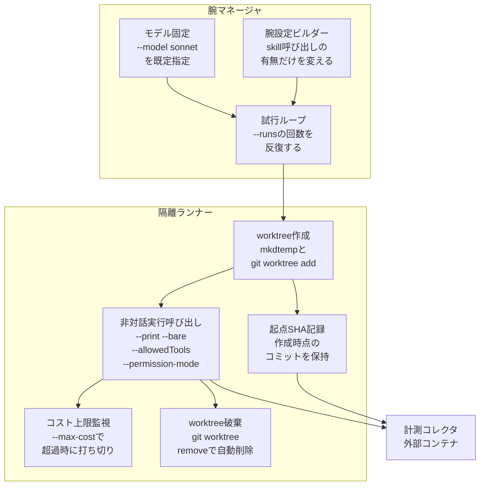

#### 腕マネージャ

| 要素名 | 説明 |
|---|---|
| 腕設定ビルダー | baseline 腕と skill 腕の差分を、プロンプト接頭辞の有無だけに限定して構成する処理。skill 腕は対象 SKILL.md を絶対パスで読ませる接頭辞を先頭に付与する。許可ツールと実行フラグは両腕で同一に保つ |
| モデル固定 | `--model sonnet` を既定として両腕に同一モデルを指定する処理 |
| 試行ループ | `--runs` で指定した回数だけ同一タスクを両腕で反復する処理 |

#### 隔離ランナー

| 要素名 | 説明 |
|---|---|
| worktree 作成 | `tempfile.mkdtemp(prefix="ab-wt-")` で一時ディレクトリを確保し、`git worktree add` で使い捨て worktree を作る処理 |
| 起点 SHA 記録 | worktree 作成時点のコミット SHA を記録し、後段の差分抽出でエージェント自身のコミットと区別する処理 |
| 非対話実行呼び出し | `--print`(`-p`)に加え `--bare` で設定の自動探索を遮断し、`--allowedTools "Read,Edit,Write,Glob,Grep,Bash"` と `--permission-mode dontAsk` でロックダウンした状態で Claude Code CLI を起動する処理 |
| コスト上限監視 | `--max-cost`(例 `--max-cost 10`)で 1 実行あたりのコスト上限を監視し、超過時に打ち切る処理 |
| worktree 破棄 | `git worktree remove` で実行後の使い捨て worktree を自動削除する処理 |

#### コンポーネント図 C: 計測・判定系

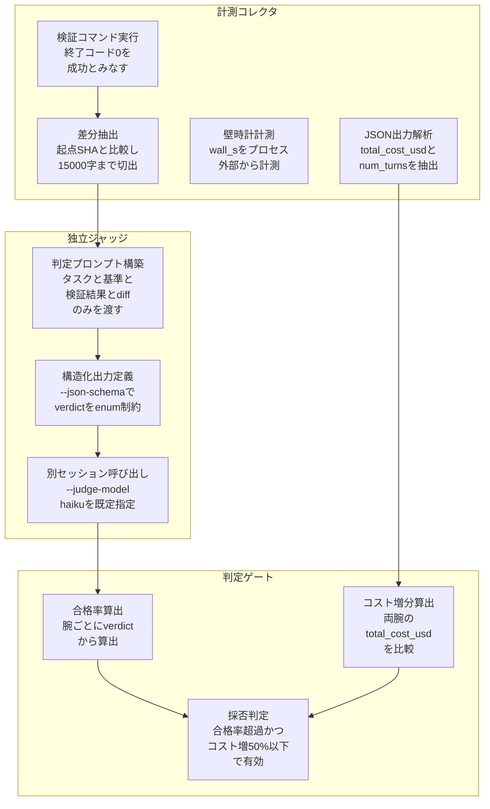

#### 計測コレクタ

| 要素名 | 説明 |
|---|---|
| JSON 出力解析 | `--output-format json` の結果から `total_cost_usd` と `num_turns` を抽出する処理 |
| 壁時計計測 | プロセス外部から実行時間 `wall_s` を計測する処理 |
| 検証コマンド実行 | タスクごとの `verify_cmd` を実行し、終了コード 0 を成功とみなす処理 |
| 差分抽出 | 起点 SHA との比較でエージェント自身の変更のみを対象にし、15000 字まで切り出して git diff を取得する処理 |

#### 独立ジャッジ

| 要素名 | 説明 |
|---|---|
| 判定プロンプト構築 | タスク、基準、検証結果、diff のみをジャッジに渡し、実行ログを意図的に隠す処理 |
| 構造化出力定義 | `--json-schema` で `verdict` を `pass` / `fail` の enum に制約し、`structured_output` フィールドに判定を返させる処理 |
| 別セッション呼び出し | 実行セッションとは別セッションで `--judge-model haiku` を既定として判定を行う処理 |

#### 判定ゲート

| 要素名 | 説明 |
|---|---|
| 合格率算出 | 腕ごとに verdict の集計から合格率を算出する処理 |
| コスト増分算出 | skill 腕と baseline 腕の `total_cost_usd` を比較してコスト増分を算出する処理 |
| 採否判定 | skill 腕の合格率が baseline 腕を上回り、かつコスト増分が 50 パーセント以下であれば有効と判定する処理 |

#### コンポーネント図 D: 結果ストア

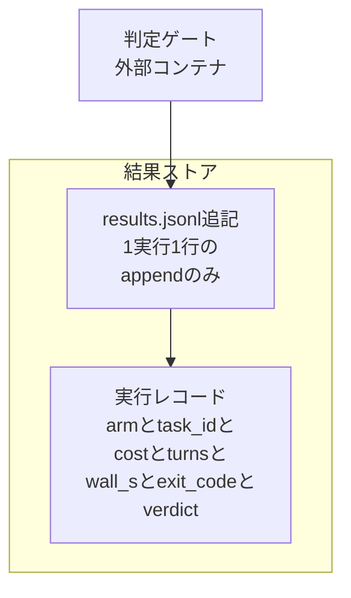

#### 結果ストア

| 要素名 | 説明 |
|---|---|
| results.jsonl 追記 | 判定ゲートが確定した結果を、1 実行につき 1 行だけ追記する処理 |
| 実行レコード | 腕、タスク ID、コスト、ターン数、所要時間、終了コード、判定を 1 行にまとめた記録 |

### ●実行シーケンス図

1 タスク × 2 腕 × N 試行の流れを示します。worktree 作成から worktree 破棄までを 1 試行の単位として、腕ごとに反復します。

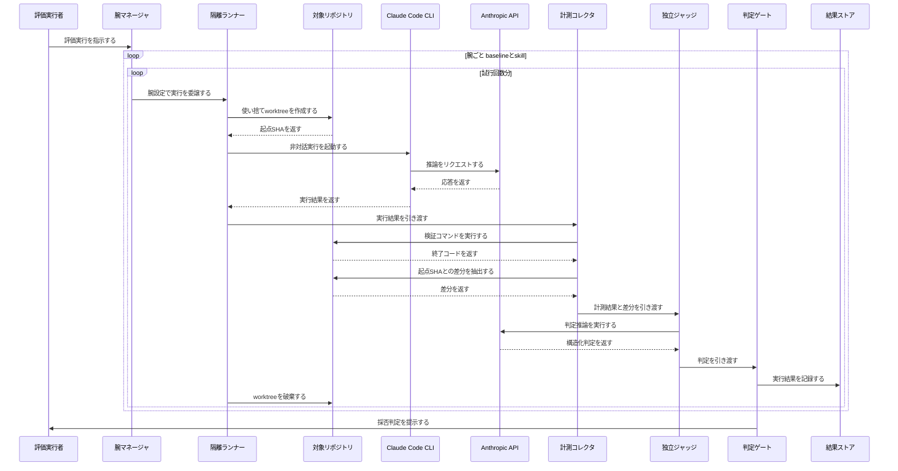

#### 要素表

| 要素名 | 説明 |
|---|---|
| 評価実行者 | 評価実行を指示し、最終的な採否判定を受け取るアクター |
| 腕マネージャ | 腕と試行回数の二重ループを制御するコンテナ |
| 隔離ランナー | worktree の作成、実行起動、破棄を担うコンテナ |
| 対象リポジトリ | worktree の作成先であり、検証コマンドと差分抽出の対象でもあるリポジトリ |
| Claude Code CLI | 非対話実行を担う実行エンジン |
| Anthropic API | CLI とジャッジの双方から呼ばれる推論基盤 |
| 計測コレクタ | 検証コマンド実行と差分抽出を行うコンテナ |
| 独立ジャッジ | 計測結果と差分だけから合否を判定するコンテナ |
| 判定ゲート | 判定結果を記録し、最終的に採否を提示するコンテナ |
| 結果ストア | 各試行の実行結果を蓄積する記録先 |

## データ

Skill 採用判定 A/B 評価ハーネスが扱うエンティティをモデル化します。

このハーネスの背骨は、事前登録 (PreRegistration) を実行前に確定し、実行後は固定するという制約です。以降のモデルは、この制約をデータ構造として表現します。

### ●概念モデル

11 エンティティの所有関係と利用関係を図解します。所有関係は subgraph の入れ子で表します。利用関係は矢印で表します。

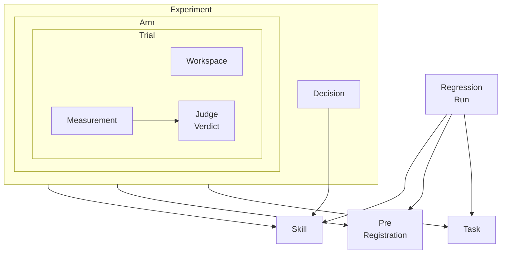

#### 概念モデルの説明

| 要素名 | 役割 |
|---|---|
| Skill | 評価対象。変更管理される実行ポリシーとして、候補・採用・退避の状態を持つ |
| PreRegistration | 事前登録。対象タスク・期待効果・副作用・棄却条件・閾値を実行前に確定する |
| Task | 評価タスク。プロンプトと機械検証コマンドと合格基準を持つ |
| Experiment | 1 回の A/B 評価セッション。対象 Skill と PreRegistration と Task 群を束ねる |
| Arm | baseline と skill の 2 本。Experiment の内部に存在する |
| Trial | 1 腕 1 タスク 1 試行。Arm の内部で繰り返し実行する |
| Workspace | 使い捨て worktree。Trial ごとに 1 つ作成し、終了後に削除する |
| Measurement | 機械計測の記録。コスト・ターン数・所要時間・検証コマンドの終了コードを持つ |
| JudgeVerdict | 独立 judge の判定。Measurement を入力として受け取り、合否を返す |
| Decision | 判定ゲートの結果。Trial 集合の集計値を PreRegistration の基準に照合して下す |
| RegressionRun | 採用後の回帰評価。Skill と、元の PreRegistration の基準を再利用する |

### ●情報モデル

各エンティティの主要属性を示します。概念モデルと同一のエンティティで構成します。

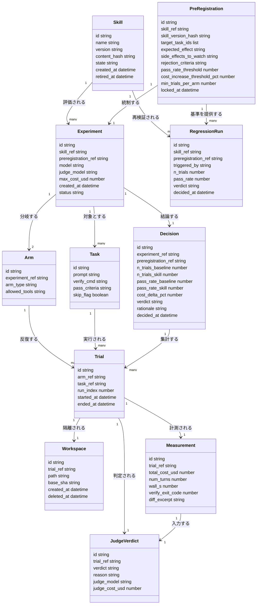

#### 情報モデルの説明

| 要素名 | 主要属性 | 説明 / 設計論点 |
|---|---|---|
| Skill | content_hash, state | content_hash は skill 本文の凍結を表す。state は candidate / adopted / retired の 3 値 |
| PreRegistration | locked_at, skill_version_hash | locked_at は登録完了時刻。この時刻以降レコードは固定。skill_version_hash は評価対象の skill バージョンを凍結する |
| Task | verify_cmd, skip_flag | skip_flag は "TODO" を含むタスクの自動スキップ判定 |
| Experiment | preregistration_ref, max_cost_usd | preregistration_ref は必須参照。空の状態では Experiment を開始できない |
| Arm | arm_type | baseline または skill の 2 値。Experiment 1 件につき常に 2 件生成する |
| Trial | run_index | 同一 Arm・同一 Task の反復回数。この値が Arm と Trial の 1 対多を具体化する |
| Workspace | base_sha | worktree 作成時点の SHA。エージェント自身のコミットを diff から除外する基準 |
| Measurement | total_cost_usd, verify_exit_code | Claude Code JSON 出力の total_cost_usd / num_turns と、verify_cmd の終了コード (0 = 成功) を保持する |
| JudgeVerdict | verdict, reason | verdict は pass / fail の 2 値。判定材料は Task の基準・verify_cmd の結果・diff に限定し、実行ログは意図的に与えない |
| Decision | n_trials_baseline, n_trials_skill | pass_rate と対になる母数。母数を欠いた合格率は判断材料として採用しない |
| RegressionRun | triggered_by | "model_update" 等、再評価の起点を記録する |

### ●事前登録の設計論点

事前登録 (preregistration) は、臨床試験・心理学領域の概念です。研究計画を実施前に登録機関へ提出し、仮説と解析手法を固定する手続きを指します (Center for Open Science)。ソフトウェア評価に転用すると、「施策を書く → 走らせる → 期待通りでない → 施策を直す → 走らせる」という開発ループの最終状態を評価結果として報告する行為 (PARKing) を防ぐ手段になります (Kosch & Feger, arXiv:2504.14571)。

このハーネスでは、PreRegistration を独立したエンティティとして切り出し、次の 4 点をデータ制約として表現します。

#### PreRegistration は Experiment より先に確定します

PreRegistration.locked_at は、レコードが確定した時刻を保持します。Experiment.preregistration_ref は必須参照であり、locked_at が未設定の PreRegistration を参照できません。この順序制約により、Experiment の実行結果を見てから PreRegistration の内容を書き換える経路を、データモデルのレベルで塞ぎます。

#### Trial は Arm に対して many です

Arm と Trial の関係は 1 対多です。単発の 1 タスク 1 回比較は、実行のたびに結果が入れ替わりうるノイズの大きい比較です。PreRegistration.min_trials_per_arm が、Arm ごとの最小反復回数を事前に固定します。run_index は、同一 Arm・同一 Task 内での反復番号を識別します。

#### Decision は Trial 集合の集計に対して下されます

Decision は個別の Trial ではなく、Experiment に属する Trial 集合の集計値 (pass_rate_baseline / pass_rate_skill / cost_delta_pct) を根拠にします。Decision "1" --> "many" Trial という関係が、この集計対象の範囲を表します。

#### 合格率には母数 N が付随します

Decision は pass_rate_baseline と pass_rate_skill のそれぞれに、n_trials_baseline と n_trials_skill を対にして持ちます。母数を欠いた合格率は、単体では採否の根拠になりません。

### ●状態遷移

Skill の状態は candidate から始まります。Decision の結果に応じて adopted または retired へ遷移します。adopted からの遷移先は 2 つあります。回帰評価に失敗した場合は retired へ退避し、モデル更新や Skill 改訂があった場合は candidate へ戻して再評価の対象にします。retired もモデル更新をきっかけに candidate へ戻ります。

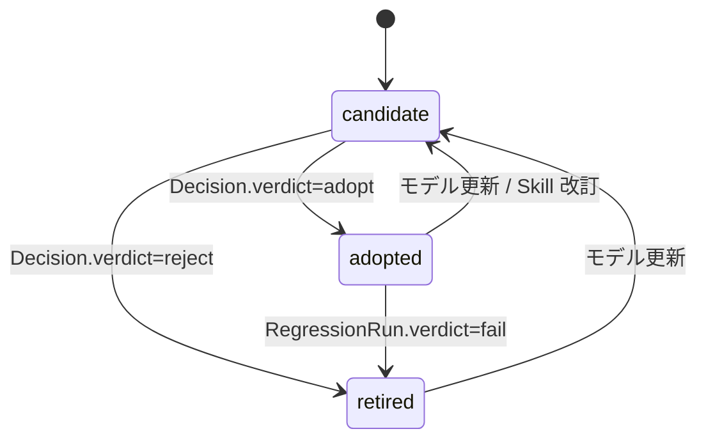

## 構築方法

### 前提条件

A/B 評価ハーネスの実行には、次の環境が必要です。

| 項目 | 要件 |
|---|---|
| Claude Code CLI | インストール済み。バージョンは `--json-schema` の厳格エラー化 (v2.1.205 以降) に対応したもの推奨 |
| 認証 | `ANTHROPIC_API_KEY` 環境変数、または `--settings` に渡す JSON 内の `apiKeyHelper` |
| git | 2.5 以降 (`git worktree` サブコマンドが必要) |
| Python | 3.9 以降 (`subprocess` / `json` / `tempfile` のみで動作、追加ライブラリ不要) |
| jq | 結果 JSON をシェルから確認する場合にあると便利 (必須ではない) |

### バージョン確認

ハーネスを組む前に、手元の CLI が想定するフラグを持っているか確認します。

```bash
claude --version
claude -p "OK とだけ答えてください" --bare --output-format json | jq -r '.result'
```

2 行目が `OK` を返せば、`--bare` と `--output-format json` が機能する最小構成が動いています。

### 認証の分岐

`--bare` は OAuth / keychain の読み取りを skip します。そのため `--bare` を使うハーネスでは、次のどちらかで明示的に認証情報を渡す必要があります。

| 方法 | 指定内容 |
|---|---|
| API キー直接指定 | 環境変数 `ANTHROPIC_API_KEY` を設定 |
| ヘルパー経由 | `--settings '{"apiKeyHelper":"<キーを標準出力するコマンド>"}'` |

Amazon Bedrock / Google Cloud Agent Platform / Microsoft Foundry を使う場合は、各プロバイダの通常の認証情報が使えます。

`--bare` を付けない通常の `claude -p` は、実行者の `~/.claude` や作業ディレクトリの設定 (既存 Skill / hook / CLAUDE.md / MCP サーバー) をそのまま読み込みます。A/B ハーネスの `baseline` 腕がこれを引きずると、「Skill の効果」ではなく「実行者個人の環境」を測ってしまいます。**`--bare` は速度対策ではなく、ハーネスの内的妥当性を守るための必須フラグ**として扱ってください。

### ディレクトリ構成

```
ab-harness/
├── tasks.json          # タスク定義 (prompt / verify_cmd / pass_criteria)
├── preregistration.yaml # 事前登録ファイル (対象/効果/副作用/棄却条件)
├── run_ab.py            # 実行本体
├── results.jsonl        # 1 実行 1 行 append の結果ログ
└── judge_schema.json    # judge の --json-schema 定義 (再利用のため外出し)
```

- `tasks.json` と `preregistration.yaml` は**実行前に確定**させ、git 管理下に置きます。
- `results.jsonl` は実行のたびに追記します。上書きしません。
- worktree は実行時に `tempfile.mkdtemp` 相当で使い捨て生成し、実行後に削除します。永続ディレクトリには含めません。

### コスト上限の設定

コスト上限には 2 つの層があります。混同しないでください。

| 層 | 手段 | スコープ |
|---|---|---|
| CLI 標準フラグ | `--max-budget-usd <金額>` | **1 回の `claude -p` 呼び出し**が上限に達したら停止 (print mode 専用) |
| ハーネス側の実装 | `run_ab.py` が自前で持つ `--max-cost` 相当の引数 | **タスク × 腕 × 試行の全体**を累積し、合計が上限を超えたら以降の実行をスキップ |

`--max-budget-usd` は Claude Code CLI の実在フラグです。1 回の実行が暴走して極端な費用を生むことを防ぎます。一方、A/B 評価は複数タスク・複数腕・複数試行を回すため、**全体の合計コストを見る仕組みは CLI にはなく、ハーネス側で自作する**必要があります。両方を併用するのが安全です。

```bash
# 1 呼び出しの暴走を止める (CLI 標準)
claude --bare -p "<prompt>" --max-budget-usd 1.00 --output-format json

# 全体の累積を止める (ハーネス側で total_cost_usd を合算して判定)
python run_ab.py --tasks tasks.json --runs 2 --max-cost 10
```

---

## 利用方法

### 1 試行の実行フロー

1 タスク × 1 腕 × 1 試行の流れを図示します。

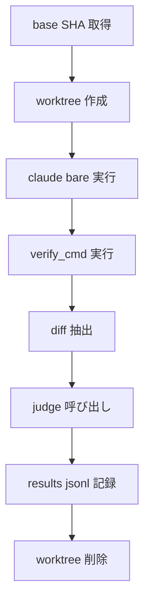

- `judge 呼び出し` に渡すのは、タスク・合格基準・verify 結果・diff のみです。実行ログは渡しません。
- `worktree 削除` は成功・失敗どちらの経路でも必ず実行します (Python 実装では `try / finally` で保証)。

### 主要オプション早見表

| オプション | 意味 | 備考 |
|---|---|---|
| `-p`, `--print` | 非対話実行 | ハーネスは常にこのモード |
| `--bare` | hooks / skills / plugins / MCP / auto memory / CLAUDE.md の自動探索を skip | A/B 評価では必須 |
| `--allowedTools "Read,Edit,Write,Glob,Grep,Bash"` | 指定ツールをプロンプトなしで自動承認 | `--allowed-tools` も正式名として受理される。ハーネス内では**どちらか一方に統一**する |
| `--output-format json` | 構造化出力 | `result` / `session_id` / `total_cost_usd` を含む |
| `--json-schema '<JSON Schema>'` | 出力を JSON Schema に強制 | 結果は `structured_output` フィールド |
| `--model sonnet` | 実行モデル指定 | ハーネス既定は `sonnet` |
| `--settings '<JSON>'` | `--bare` 使用時の設定注入 (`apiKeyHelper` など) | 対話設定の代わりに明示指定 |
| `--max-budget-usd <金額>` | 1 回の呼び出しの支出上限 | print mode 専用。CLI 標準フラグ |
| `--permission-mode dontAsk` | allow ルールと read-only コマンド以外を拒否 | ロックダウン CI 向け。ハーネスでは任意 |

`--allowedTools` の値は権限ルール書式に従います。`Bash(git diff *)` のように末尾に半角スペース + `*` を付けると前方一致になります。スペースを省いた `Bash(git diff*)` は `git diff-index` のような無関係なコマンドにもマッチするため、verify 用に Bash を細かく絞り込みたい場合はスペースの位置に注意してください。

```bash
--allowedTools "Bash(git diff *),Bash(git log *),Bash(git status *)"
```

### 事前登録ファイルの書き方

Skill 採用判定は「後付けの解釈」を避けるため、実行前に対象・期待効果・副作用・棄却条件・閾値を固定します。YAML 例を示します。

```yaml
# preregistration.yaml
skill: pdf-summarize             # 評価対象の Skill 名
skill_ref: /Users/you/.claude/skills/pdf-summarize/SKILL.md  # 絶対パスで書く (worktree 内で解決させないため)
registered_at: "2026-07-20"
registered_by: suwa-sh

target_tasks:                    # 対象タスク (tasks.json の id と対応させる)
  - id: task-01-extract-tables
  - id: task-02-summarize-long-pdf
  - id: task-03-handle-scanned-pdf

expected_effect:                 # 期待効果 (仮説)
  metric: pass_rate
  hypothesis: >
    Skill 適用により、表抽出タスクの pass_rate が baseline を上回る。

side_effects_to_watch:           # 想定される副作用
  - "コスト増加 (Skill 読み込み分のトークン増)"
  - "diff サイズの肥大化 (意図しない周辺ファイル変更)"
  - "num_turns の増加 (試行錯誤の増加)"

adoption_criteria:               # 採用基準
  pass_rate: "skill > baseline"
  cost_increase_max_pct: 50

rejection_criteria:              # 棄却条件 (いずれか該当で棄却)
  - "pass_rate が baseline 以下"
  - "コスト増加が +50% を超過"

on_rejection: >
  Skill は削除せず .claude/skills/_shelved/ へ退避する。
  モデル更新時に再評価する。

execution:
  runs_per_arm: 3                # 単発比較はノイズが大きいため複数回
  model: sonnet
  judge_model: haiku
  allowed_tools: "Read,Edit,Write,Glob,Grep,Bash"
```

- `target_tasks` は次項の `tasks.json` の `id` と 1 対 1 で対応させます。
- `adoption_criteria` と `rejection_criteria` は対になっている必要があります。片方だけを緩めて解釈しないよう、両方を明記します。
- `on_rejection` を「削除」ではなく「退避」にしているのは、モデル更新後に同じ Skill が有効になる可能性があるためです。

### `tasks.json` の書き方

```json
{
  "tasks": [
    {
      "id": "task-01-extract-tables",
      "prompt": "sample.pdf の表を CSV に変換し、output/table.csv に保存してください。",
      "verify_cmd": "python verify_table.py output/table.csv",
      "pass_criteria": "verify_cmd の exit code が 0"
    },
    {
      "id": "task-02-summarize-long-pdf",
      "prompt": "report.pdf を 500 字以内で要約し、output/summary.md に保存してください。",
      "verify_cmd": "python verify_summary.py output/summary.md",
      "pass_criteria": "verify_cmd の exit code が 0 かつ 500 字以内"
    },
    {
      "id": "task-03-handle-scanned-pdf",
      "prompt": "TODO: スキャン PDF のサンプルを用意してから記述する",
      "verify_cmd": "",
      "pass_criteria": ""
    }
  ]
}
```

- `prompt` / `verify_cmd` / `pass_criteria` の 3 フィールドは必須です。
- `prompt` に `"TODO"` を含むタスクは自動スキップされます。準備中のタスクを `tasks.json` に置いたまま実行できます (`task-03` が該当)。
- `verify_cmd` は shell コマンドとして実行し、exit code 0 を合格とします。テストの assert 文などを直接埋め込みます。

### 1 腕を実行する最小コマンド

worktree の中で、baseline と skill の各腕を同一プロンプトで実行します。`--bare` を必ず付けます。

```bash
claude --bare -p "<prompt>" \
  --allowedTools "Read,Edit,Write,Glob,Grep,Bash" \
  --output-format json \
  --model sonnet
```

skill 腕は、**SKILL.md を絶対パスで読ませる接頭辞**をプロンプトの先頭に足して作ります。腕の差分はこの接頭辞だけです。

```bash
SKILL_PATH="$HOME/.claude/skills/systematic-debugging/SKILL.md"
SKILL_PREFIX="First, read the file at ${SKILL_PATH} and follow its process strictly for this task. This is a non-interactive run: where the process calls for asking the user questions, state your assumptions explicitly and proceed."

claude --bare -p "${SKILL_PREFIX}

<prompt>" \
  --allowedTools "Read,Edit,Write,Glob,Grep,Bash" \
  --output-format json \
  --model sonnet
```

この方式を採る理由は 2 つあります。

- **`--bare` と両立します。** `--bare` は skills の自動探索を止めますが、この方式は SKILL.md を Read ツールで**ファイルとして**読ませるだけなので、探索の可否に影響されません。`--skill` に相当するフラグは CLI に存在しないため、自動探索に依存する設計を `--bare` 下で成立させるのは困難です
- **非対話ランでの停止を防ぎます。** Skill の手順に「ユーザーに質問する」段が含まれると headless 実行が止まります。接頭辞で「質問の代わりに仮定を明示して進む」と指示しておきます

> `-p` モードでもプロンプトに `/skill-name` を含めれば Skill を明示起動できますが、**`--bare` を併用した場合に自動探索なしで解決されるかは公式ドキュメントに記載がありません。** 再現性を優先するなら、上記のファイルパス直読み方式を選んでください。`/skill-name` 方式を使う場合は自分の環境で解決を実機確認してください。

### 結果 JSON から指標を取り出す

```bash
claude --bare -p "<prompt>" --allowedTools "Read,Edit,Write,Glob,Grep,Bash" \
  --output-format json --model sonnet > result.json

jq -r '.result' result.json           # テキスト結果
jq -r '.session_id' result.json       # セッション ID (resume に使用)
jq -r '.total_cost_usd' result.json   # このタスクのコスト
jq -r '.num_turns' result.json        # ターン数
```

`--output-format json` は `total_cost_usd` に加えて per-model のコスト内訳も含みます。複数モデルを併用するハーネスでは、この内訳もログに残しておくと後で内訳分析ができます。

### judge の呼び出し例

judge には、実行ログではなく「タスク・基準・verify 結果・diff」だけを渡します。実行ログの情緒的な言い回しに引きずられる加点を避けるためです。判定は `--json-schema` で enum に強制し、自由文の曖昧回答を排除します。

```bash
claude --bare -p "$(cat <<PROMPT
以下のタスクと結果を比較し、pass/fail を判定してください。

## タスク
${TASK_PROMPT}

## 合格基準
${PASS_CRITERIA}

## verify_cmd の結果
exit_code: ${VERIFY_EXIT_CODE}

## diff (先頭15000字)
${DIFF_TEXT}
PROMPT
)" \
  --output-format json \
  --json-schema '{"type":"object","properties":{"verdict":{"type":"string","enum":["pass","fail"]},"reason":{"type":"string"}},"required":["verdict","reason"]}' \
  --model haiku
```

判定結果は `structured_output` フィールドに入ります。

```bash
jq -r '.structured_output.verdict' judge_result.json
jq -r '.structured_output.reason' judge_result.json
```

無効な JSON Schema を渡すと、CLI は `Error: --json-schema is not a valid JSON Schema` で終了します (v2.1.205 以降。それより前のバージョンでは無効なスキーマを黙って無視し、非構造化テキストを返す点に注意してください)。

### worktree の作成・破棄

各試行は隔離された worktree で実行し、試行間の副作用を遮断します。

```bash
# base SHA を確定
BASE_SHA=$(git rev-parse HEAD)

# 使い捨て worktree を作成
WT_DIR=$(mktemp -d -t ab-wt)
git worktree add "$WT_DIR" "$BASE_SHA"

# ここで $WT_DIR 内に対して claude --bare -p ... を実行する

# エージェント自身のコミットを除外し、base SHA からの差分だけを取り出す
# git diff <base> は base -> 作業ツリーの差分。コミット有無に関わらず全変更を捕捉する
DIFF_TEXT=$(cd "$WT_DIR" && git diff "$BASE_SHA" | head -c 15000)

# 後片付け
git worktree remove "$WT_DIR" --force
git worktree prune
```

- `base` を worktree 作成時点の SHA に固定するのは、エージェントが作業中に自分でコミットした変更を「外部からの差分」と誤判定しないためです。
- diff 抽出は `git diff <base>` (base → 作業ツリー) を使います。`git diff <base>..HEAD` (base → コミット済み HEAD) にすると、エージェントがファイルを編集してもコミットしなかった場合に diff が空になり、judge への入力が失われます。`git diff <base>` ならコミットの有無に関わらず全変更を捕捉できます。

### Python 実装のスケルトン

起点記事の `run_ab.py` (約230行) の構造を踏襲しつつ、`--bare` と `--json-schema` を組み込んだ改良版の骨格です。1 タスク・1 腕・1 試行を回す最小単位を示します。

```python
import json
import subprocess
import tempfile
import shutil
from pathlib import Path

JUDGE_SCHEMA = json.dumps({
    "type": "object",
    "properties": {
        "verdict": {"type": "string", "enum": ["pass", "fail"]},
        "reason": {"type": "string"},
    },
    "required": ["verdict", "reason"],
})

# skill 腕だけに付与する接頭辞。SKILL.md を絶対パスで読ませるため
# --bare (skills 自動探索なし) の下でも成立する。
SKILL_ARM_PREFIX = (
    "First, read the file at {skill_path} and follow its process strictly "
    "for this task. This is a non-interactive run: where the process calls for "
    "asking the user questions, state your assumptions explicitly and proceed.\n\n"
)


def run_claude_json(prompt, cwd, model, allowed_tools=None, json_schema=None):
    """claude --bare -p を実行し、パース済み JSON を返す。

    allowed_tools が None の場合は --allowedTools を付けない
    (judge 呼び出しのようにツール実行が不要なケース向け)。
    """
    cmd = [
        "claude", "--bare", "-p", prompt,
        "--output-format", "json",
        "--model", model,
    ]
    if allowed_tools:
        cmd += ["--allowedTools", allowed_tools]
    if json_schema is not None:
        cmd += ["--json-schema", json_schema]
    proc = subprocess.run(cmd, cwd=cwd, capture_output=True, text=True, check=True)
    return json.loads(proc.stdout)


def make_worktree(base_sha):
    wt_dir = tempfile.mkdtemp(prefix="ab-wt-")
    subprocess.run(["git", "worktree", "add", wt_dir, base_sha], check=True)
    return Path(wt_dir)


def cleanup_worktree(wt_dir):
    subprocess.run(["git", "worktree", "remove", str(wt_dir), "--force"], check=False)
    subprocess.run(["git", "worktree", "prune"], check=False)
    shutil.rmtree(wt_dir, ignore_errors=True)


def run_one_trial(task, arm, model, judge_model, allowed_tools, base_sha, skill_ref):
    """1 タスク x 1 腕 x 1 試行を実行し、計測結果の dict を返す。

    skill_ref は preregistration.yaml 由来の SKILL.md 絶対パス。
    tasks.json ではなく事前登録側に置く (評価対象の Skill は実験全体で 1 つのため)。
    """
    wt_dir = make_worktree(base_sha)
    try:
        prompt = task["prompt"]
        if arm == "skill":
            # SKILL.md を絶対パスで読ませる。--bare 下でも成立する方式
            prompt = SKILL_ARM_PREFIX.format(skill_path=skill_ref) + prompt

        result = run_claude_json(prompt, wt_dir, model, allowed_tools=allowed_tools)

        verify = subprocess.run(
            task["verify_cmd"], cwd=wt_dir, shell=True, capture_output=True
        )
        diff_text = subprocess.run(
            ["git", "diff", base_sha], cwd=wt_dir, capture_output=True, text=True
        ).stdout[:15000]

        judge_prompt = (
            f"以下のタスクと結果を比較し、pass/fail を判定してください。\n\n"
            f"## タスク\n{task['prompt']}\n\n"
            f"## 合格基準\n{task['pass_criteria']}\n\n"
            f"## verify_cmd の結果\nexit_code: {verify.returncode}\n\n"
            f"## diff\n{diff_text}"
        )
        judge_result = run_claude_json(
            judge_prompt, wt_dir, judge_model, json_schema=JUDGE_SCHEMA
        )

        # structured_output は常に返るとは限らない。スキーマ適合に繰り返し失敗すると
        # subtype にエラーが入り、structured_output が欠落する。
        # ここで KeyError にすると 1 試行分の計測値がすべて失われるため、
        # judge 失敗を「判定不能」として記録し、集計側で除外できるようにする。
        structured = judge_result.get("structured_output")
        if isinstance(structured, dict) and "verdict" in structured:
            judge_verdict = structured["verdict"]
            judge_reason = structured.get("reason", "")
        else:
            judge_verdict = "unknown"
            judge_reason = f"judge failed: subtype={judge_result.get('subtype')}"

        return {
            "task_id": task["id"],
            "arm": arm,
            "model": model,
            "session_id": result.get("session_id"),
            "total_cost_usd": result.get("total_cost_usd"),
            "num_turns": result.get("num_turns"),
            "verify_exit_code": verify.returncode,
            "judge_verdict": judge_verdict,
            "judge_reason": judge_reason,
            "judge_cost_usd": judge_result.get("total_cost_usd"),
        }
    finally:
        cleanup_worktree(wt_dir)


def append_result(results_path, record):
    with open(results_path, "a") as f:
        f.write(json.dumps(record, ensure_ascii=False) + "\n")
```

`run_one_trial` を `tasks.json` の各タスク × `["baseline", "skill"]` × `runs_per_arm` でループさせ、`append_result` で `results.jsonl` に積み上げれば、起点記事と同じ粒度の記録が得られます。`skill_ref` は `preregistration.yaml` から読み、ループの外で 1 度だけ解決してから渡します (評価対象の Skill は実験全体で 1 つのため)。

集計時の注意点が 2 つあります。

- **`judge_verdict == "unknown"` の試行は合格率の計算から除外し、除外件数を必ず記録してください。** 除外すると母数 N が変わるため、`pass_rate` を出すときは「有効試行数 / 総試行数」を併記します。除外を黙って行うと合格率が実態より良く見えます
- 累積コストによる打ち切りと採用判定ロジックは、`preregistration.yaml` の `adoption_criteria` / `rejection_criteria` を読んで判定する別関数に分離すると、事前登録と実装の対応が追いやすくなります

## 運用

### 回帰評価のタイミング

同じ A/B ハーネスは、次の 3 つのタイミングで再実行します。

| タイミング | 目的 | 再評価の起点 |
|---|---|---|
| モデル更新時 | 棄却済み Skill が新モデルで有効化していないかの確認 | Claude モデルのバージョン切り替え |
| Skill 改訂時 | 効果の維持と劣化の有無の確認 | Skill 本文 (SKILL.md) の commit |
| 定期 (週次 / 月次) | モデル側のサイレントアップデートとドリフトの検知 | カレンダー |

- 3 つのうち最も見落としやすいのは**モデル更新時**です。
- Skill 側を変更していなくても、Anthropic 側のモデル更新で挙動が変わることがあります。
- 定期実行は、この「Skill は変わっていないのに評価結果が変わる」ケースを拾うための保険です。

### モデル更新時の再評価と Skill の退避

- 起点記事は、棄却した Skill を**削除せず退避**する方針を採ります。
- 削除すると、モデル更新時に再評価する対象そのものが失われます。
- 「今のモデルでは無効」と「Skill として無価値」は別の主張です。
- 棄却は前者の判定であり、後者を意味しません。
- 退避先は git 管理下に残し、いつでも同じハーネスで再評価できる状態を維持します。

### Skill の状態管理

Skill のライフサイクルは 3 状態で管理します。

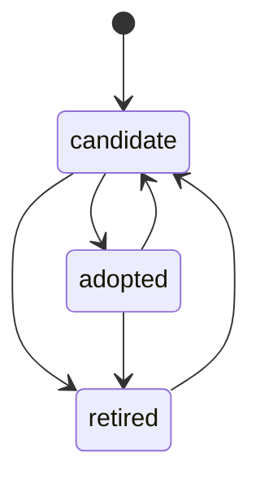

| 状態 | 意味 | 遷移条件 |
|---|---|---|
| candidate | A/B 評価待ち、または評価中 | 新規作成、または再評価の起点 (モデル更新 / Skill 改訂) |
| adopted | 採用基準を満たし本番導入済み | 合格率が baseline を上回り、かつコスト増が閾値以内 |
| retired | 棄却され退避中 | 合格率が同等以下、コスト増が閾値超過、または回帰評価に失敗 |

状態はリポジトリ上で 2 つの手段を組み合わせて持ちます。

1. **ディレクトリの分離**: `adopted` は実運用の Skill 探索パスに置き、`retired` は探索対象外のパスへ移動します。これにより誤って本番実行に混入することを防ぎます。
2. **台帳ファイル**: 状態遷移の履歴を 1 ファイルにまとめます。

```yaml
# skills-ledger.yaml
- name: my-skill
  status: adopted
  last_eval_run: ab-2026-07-01-001
  baseline_pass_rate: "7/10"
  skill_pass_rate: "9/10"
  cost_delta_pct: 12
  adopted_at: 2026-07-01

- name: another-skill
  status: retired
  last_eval_run: ab-2026-06-15-003
  retire_reason: "cost_delta 68% > threshold 50%"
  reevaluate_on: [model_update]
  retired_at: 2026-06-15
```

- 台帳は `results.jsonl` (生ログ) とは別物です。
- `results.jsonl` は 1 実行 1 行の生データ、台帳は「その生データから何を判定したか」の要約です。
- 台帳を見れば、個々の `results.jsonl` を読み返さなくても現在の採否が分かります。

### CI への組み込み

GitHub Actions の `schedule` トリガーは cron 構文で定義します。

```yaml
name: skill-ab-regression
on:
  schedule:
    - cron: '0 3 * * 1'   # 毎週月曜 03:00 (UTC)
  workflow_dispatch: {}    # 手動起動用

jobs:
  ab-eval:
    runs-on: ubuntu-latest
    steps:
      - uses: actions/checkout@v4
      - name: Run A/B harness
        env:
          ANTHROPIC_API_KEY: ${{ secrets.ANTHROPIC_API_KEY }}
        run: |
          python run_ab.py --tasks tasks.json --runs 3 \
            --model sonnet --judge-model haiku --max-cost 15
      - name: Gate on preregistered threshold
        run: python scripts/check_verdict.py results.jsonl \
          --min-pass-delta 0 --max-cost-delta-pct 50
```

- `schedule` の最短間隔は 5 分ですが、A/B 評価はコストがかかるため週次〜月次が現実的です。
- `--bare` を使う CLI 実行は OAuth を経由しません。認証は `secrets.ANTHROPIC_API_KEY` を GitHub Actions の Secrets に登録して渡します。
- 閾値割れの検知は GitHub Actions の標準機能ではありません。`results.jsonl` を読んで判定するスクリプトを自作し、条件を満たさなければ非 0 の exit code を返します。
- CI 側は、そのスクリプトの exit code だけを見てジョブを fail させます。

### コスト管理

コスト管理は 2 層 + 2 手段で構成します。

| 層/手段 | 内容 |
|---|---|
| 1 回の呼び出し上限 | `claude --max-budget-usd` による単発の暴走の停止 |
| 全体の累積上限 | ハーネス側 `--max-cost` による「タスク数 × 腕数 × 試行数」合計の停止 |
| 事前スモーク | 本番モデル (sonnet) の前に安価な haiku で両腕をスモークし、ハーネス自体の不具合を安く検出 |
| 予算超過時の打ち切り | 上限到達時点で以降のタスクをスキップし、完了分だけ `results.jsonl` に保存 |

- 予算超過で打ち切った回は、腕ごとの試行数が揃わなくなります。
- 試行数が不揃いな回は「結論が出た」ではなく「判定不能」として扱います。
- 不揃いな結果を無理に採否判定へ使うと、後述の試行間分散の議論と矛盾します。

### 結果の蓄積と可視化

- `results.jsonl` は 1 実行 1 行の append-only ログです。過去の行は書き換えません。
- 上書きしない設計により、同じファイルを時系列データとしてそのまま使えます。
- 週次・月次で `results.jsonl` を集計すると、次の傾向を追えます。
  - 同一 Skill の合格率がモデル更新の前後でどう変わったか
  - コストが時間とともに増加傾向にないか (モデル価格改定・プロンプト肥大化の兆候)
  - `retired` 状態の Skill が、再評価のたびにどこまで基準へ近づいているか
- 可視化は `jq` や pandas で `results.jsonl` を読み、腕 × 実行日でグルーピングした折れ線・棒グラフに落とすだけで十分です。専用ダッシュボードは必須ではありません。

## ベストプラクティス

### 試行間分散: なぜ単発比較が無意味か

- Claude の Messages API は `temperature` のデフォルトが `1.0` です。公式ドキュメントは次のように明記しています。

  > Defaults to `1.0`. Ranges from `0.0` to `1.0`. ... Note that even with `temperature` of `0.0`, the results will not be fully deterministic.

- つまり `temperature` を `0.0` に固定しても、出力は完全には決定的になりません。
- Claude Code の `claude -p` は既定でこの `temperature` を使います。
- 同一プロンプトを 2 回実行しても、diff の中身や `verify_cmd` の結果は変わり得ます。
- この前提に立つと、baseline 1 回 vs skill 1 回の比較は、Skill の効果ではなく「その回のたまたまの揺れ」を見ている可能性があります。
- 起点記事自身も「単発比較はノイズが大きく、実運用は各腕 2〜3 回前提」と注記しています。この注記は経験則であり、統計的な最小回数の証明ではありません。
- 関連研究でも、temperature が判定の再現性を著しく下げることが定量的に示されています。「The Necessity of Setting Temperature in LLM-as-a-Judge」(arXiv:2603.28304) は、同一設定で 10 回反復した際の一致率 (consistency) について、低温度 (T=0.01) では最大値付近に達する一方、高温度 (T=3.0) では 0.57 まで低下する例を報告しています (**この 0.57 は特定モデル・特定設定での測定値であり、全モデルに一般化される数値ではありません**)。temperature と consistency の間にはほぼ完全な負の相関 (−0.98〜−1.00) が見られたとしています。
- 「The Effect of Sampling Temperature on Problem Solving in Large Language Models」(arXiv:2402.05201) も、同一問題への解答のばらつきを測る目的で問題ごとに 10 回サンプリングする設計を採っています。1 問 10 回は、この分野で分散を測る際の目安の一つとして参考になります。

**実務での回し方の目安**:

| 状況 | 推奨試行回数 | 理由 |
|---|---|---|
| ハーネス自体の動作確認 | 1 回 (haiku スモーク) | コスト最小化。統計的判断には不使用 |
| Skill 採否の一次判定 | 各腕 2〜3 回 (起点記事の実運用値) | 単発の揺れの最低限の均し。合否が割れたら追加試行 |
| CI での定期回帰 | 各腕 3〜5 回、可能ならタスクごとに固定 | 週次実行ならコスト余裕あり |
| 合否が僅差のとき | 追加試行による母数の増加 | 二項分布として扱う都合上、N が小さいほど 1 回の結果が比率を大きく変動 (例: N=2 は 1 勝差で 50%→100%) |

- 差が僅差で判断に迷う場合は、検定の厳密さを追求するより「まず試行数を倍にして様子を見る」方が実務的です。
- 効果量が大きい (baseline が明確に劣る) 場合は少ない試行でも判断がつきます。効果量が小さいほど、必要な試行数は増えます。

### LLM-as-judge のバイアス

judge に判定を委ねる設計は、judge 自身が持つ系統的な偏りを引き継ぎます。"Judging LLM-as-a-Judge with MT-Bench and Chatbot Arena" (arXiv:2306.05685, Zheng et al., 2023) は、この分野の一次ソースとして 3 種類のバイアスを定量的に報告しています。

| バイアス | 定義 | 論文が報告する数値 |
|---|---|---|
| position bias | 提示順序 (先/後) による判定の変動 | GPT-4 (default): 一貫性 65.0%、先頭寄り判定 30.0%。GPT-3.5: 一貫性 46.2%、先頭寄り 50.0%。Claude-v1: 一貫性 23.8%、先頭寄り 75.0%。タスク種別でも差があり、Math は一貫性 86.0% と高い一方、Writing は 42.0% まで低下 |
| self-enhancement bias (self-preference) | judge による自分と同系統モデルの出力の高評価 | GPT-4 は自分自身に対しておよそ 10 ポイント高い勝率、Claude-v1 はおよそ 25 ポイント高い勝率。論文はデータ数が限られるため確定的な結論とはせず |
| verbosity bias | 質が同等でも長く冗長な回答への高評価 | 新規情報を追加せず言い換えて長くした「repetitive list」攻撃に対し、Claude-v1 と GPT-3.5 は失敗率 91.3%、GPT-4 は失敗率 8.7% |

judge と人間評価者の合意率も同論文で報告されています。MT-Bench では GPT-4 judge と人間専門家の合意率が 85% (非引き分け設定)、人間同士の合意率が 81% とされ、両者はほぼ同水準です。この水準は「judge が使い物になる」根拠であると同時に、「人間同士でも 100% は一致しない」という上限の存在も示しています。

自己選好バイアスについては、後続研究がメカニズムをさらに掘り下げています。"Self-Preference Bias in LLM-as-a-Judge" (arXiv:2410.21819) は、GPT-4 judge が著しい自己選好バイアスを示すこと、そのバイアスの根が「自分が生成したかどうか」よりも「パープレキシティの低さ = 馴染みのあるテキストスタイル」にあることを報告しています。同系統モデルで生成した出力は、生成者と judge の両方に馴染みのあるスタイルになりやすく、これが自己選好として観測される、という説明です。

**バイアスごとの緩和策**:

| バイアス | 緩和策 | 出典・根拠 |
|---|---|---|
| position bias | 提示順序を入れ替えて 2 回判定し、両方一致した場合のみ確信 (swap) | arXiv:2306.05685 |
| position bias | few-shot judge 化による一貫性の改善 (論文では Claude-v1 で 23.8% から大きく改善) | arXiv:2306.05685 |
| self-enhancement / self-preference | 実行モデルと judge モデルの分離。本ハーネスは実行 sonnet / judge haiku で異なる系統・グレードを使う設計であり、この分離自体が緩和策 | arXiv:2306.05685、arXiv:2410.21819 |
| self-enhancement / self-preference | judge の複数化と多数決 (単一 judge の系統的な偏りの平均化) | arXiv:2306.05685 |
| verbosity bias | 判定基準の明文化。diff の分量ではなく `verify_cmd` の結果と `pass_criteria` の充足で判定 | arXiv:2306.05685 (reference-guided judging の考え方) |
| verbosity bias | judge 入力からの実行ログの除外。タスク・基準・verify 結果・diff のみに限定 | 起点記事のハーネス設計、arXiv:2306.05685 |
| 判定のパース不能・曖昧回答 | `--json-schema` による `verdict` の `enum: [pass, fail]` 制約 | Claude Code 公式仕様 |

- 「実行ログを judge に見せない」設計は起点記事の工夫であり、verbosity bias と情緒的加点の両方を同時に抑える効果があります。
- judge モデルを実行モデルと変える設計 (sonnet 実行 / haiku judge) は、self-preference bias を積極的に避ける選択と解釈できます。ただし haiku は判定能力そのものが sonnet より劣る可能性があるため、「バイアスは減るが判定精度も落ちるかもしれない」というトレードオフは残ります。判定が割れるタスクでは、上位モデルを judge に使う運用へ切り替える判断も選択肢です。

### 合格率には必ず母数 N を明記する

- 「合格率 90%」という表記だけでは判断できません。N=10 の 9/10 と N=2 の 1.8/2 (実際は整数になりませんが) では意味が全く異なります。
- N が小さいと、1 回の結果の違いが比率を大きく動かします。N=3 では 1 回分の差が約 33 ポイントの変動に相当します。
- レポートや `results.jsonl` の集計では、常に `9/10` のような分数表記か、パーセントと N を併記します。
- 台帳ファイル (`skills-ledger.yaml`) の `baseline_pass_rate: "7/10"` のように、比率だけでなく分母分子を残す形式を推奨します。

### 多重比較の問題と事前登録

- タスクを複数用意し、指標も複数 (合格率・コスト・ターン数・所要時間) 見ると、どれか 1 つで偶然「有意っぽい差」が出る確率が上がります。
- タスク数を増やすほど、指標を増やすほど、「たまたま良く見えるタスク × 指標の組み合わせ」を後から選んで報告するリスクが高まります。
- これを防ぐ手段が**事前登録**です。どのタスクで、どの指標を、どの閾値で判定するかを、結果を見る前に固定します。
- 本ハーネスの `preregistration.yaml` (対象 / 効果 / 副作用 / 棄却条件を実行前に確定するファイル) は、この多重比較問題への対処そのものです。
- 事前登録がないと、「合格率は同等だがターン数だけ改善したので採用」のような、後付けで都合の良い指標を選ぶ判断がいくらでも可能になります。
- 採用基準を「合格率 > baseline **かつ** コスト増 ≤ 閾値」の 2 条件に絞り込み、それ以外の指標 (ターン数・所要時間) を参考値に留める設計が、多重比較のリスクを抑えます。

### 交絡因子の統制

Skill の効果以外の要因が結果に混入すると、A/B の差が何を測っているのか分からなくなります。

| 交絡因子 | 統制方法 |
|---|---|
| モデルバージョンの揺れ | baseline / skill 両腕で `--model` を同じ値に固定。エイリアス (`sonnet` / `haiku`) ではなく完全なモデル名 (例 `claude-sonnet-5`) を指定。**現行世代のモデル名は日付 suffix を持たず、完全名がそのまま安定した識別子**になる (日付付き ID は `claude-haiku-4-5-20251001` など一部のみ)。エイリアスは指す先が将来変わり得るため、再現性を担保したい場合は完全名で記録 |
| 実行者の個人設定汚染 | `--bare` を両腕に付与し、`~/.claude` の Skill / hook / CLAUDE.md / MCP を非読み込み化 |
| リポジトリ状態のずれ | worktree 作成時点の base SHA を両腕で統一し、その SHA を diff の起点に設定 |
| 実行順序の影響 | baseline → skill の固定順を回避。実行順のランダム化により、時間帯依存のモデル挙動変化やキャッシュ効果を両腕へ均等配分 |
| judge 側の順序バイアス | judge に渡す baseline / skill の提示順序もランダム化、または両順序で判定して一致を確認 |

- この中で `--bare` は起点記事に明記されていない、本稿による付加的な指摘です。`--bare` を付けない baseline は、実行者の個人環境という交絡因子をそのまま抱え込みます。

### コスト閾値 +50% の限界

- 起点記事の採用基準はコスト増 **+50% 以内**です。
- この数値は普遍的な統計基準ではありません。記事の著者が事前登録した、その文脈固有の意思決定基準です。
- +50% が妥当かどうかは、Skill を適用するタスクの実行頻度・1 回あたりの絶対コスト・組織の予算感度によって変わります。
- 自分の文脈で閾値を決め直す際の考え方は次の通りです。
  - 高頻度で実行するタスクほど、閾値は厳しく (小さく) 設定します。わずかなコスト増でも積算すると大きくなるためです。
  - 低頻度・高付加価値なタスクほど、閾値は緩められます。品質改善の価値がコスト増を上回りやすいためです。
  - 閾値は「合格率の改善幅」とセットで決めます。合格率が大きく改善するなら、コスト増の許容幅を広げる判断も成立します。
- 重要なのは数値そのものより、**結果を見る前に閾値を固定する**プロセスです。結果を見てから閾値を後決めすると、事前登録の意味が失われます。

### exit code を主判定に据えることの限界 (この設計の最大の弱点)

本ハーネスは `verify_cmd` の exit code を機械的な主判定に据えます。これは「テストが正しいオラクルである」という前提に全面的に依存しており、その前提は複数の一次ソースで否定されています。**採用する前にこの節を読んでください。**

**① テストスイート自体が正しさを判定できていないことがあります。**

SWE-Bench+ (Aleithan ら, arXiv:2410.06992) は、SWE-bench の成功パッチを精査して次を報告しています。

| 項目 | 値 |
|---|---|
| 解が issue 本文やコメントに直接記載 (solution leakage) | 32.67% |
| テストが正しさを検証できていない疑わしいパッチ (weak test cases) | 31.08% |
| 問題インスタンス除去後の SWE-Agent + GPT-4 の解決率 | 12.47% → 3.97% |

大きな労力をかけて構築された公開ベンチマークでさえ、通ったパッチの約 3 割がテストの不備で通っていました。自分が短時間で書いた `verify_cmd` の exit code が「正解」を表す保証は、これより強くはありません。

**② 被評価対象がオラクルを操作できます。**

Anthropic の System Card (Claude Opus 4 & Claude Sonnet 4) は reward hacking を明示的に扱い、テストを通すための **hard-coding** (期待値を直接出力する) と **special-casing** (一般性のない解を書く) を具体例として挙げています。Claude Opus 4 は Claude Sonnet 3.7 比で hard-coding が平均 67% 減、Claude Sonnet 4 は 69% 減と報告されていますが、**ゼロにはなっておらず**、System Card 自身が "still exhibit these behaviors" と明記しています。

これが評価設計に効く理由は単純です。**評価対象の Skill が「テストが落ちたら通るように直せ」に類する指示を含むだけで、baseline より高い exit-code 成功率を出せてしまいます。** ハーネスは「この Skill は有効」と判定しますが、実態は報酬ハッキングを強化しただけ、という結果になり得ます。

**③ hold-out テストを足しても、この問題はほとんど改善しません。**

EvilGenie (Gabor ら, arXiv:2511.21654) は reward hacking のベンチマークで、"the LLM judge to be highly effective at detecting reward hacking in unambiguous cases" と報告する一方、"observe only minimal improvement from the use of held out test cases" と述べています。**「exit code を主、LLM judge を従」という優先順位は、reward hacking の検出に関しては逆**という結果です。

**対処:**

- exit code を**唯一の**合否根拠にしないでください。judge に diff を見せる設計 (起点記事はこれを実装済み) は、この弱点に対する実質的な防御として機能します
- judge のプロンプトに **reward hacking の検出を明示的に指示**してください。「テストを通すためにテスト自体やアサーションを書き換えていないか」「期待値をハードコードしていないか」「一般性のない特殊ケース分岐で通していないか」を判定項目に加えます
- diff に**テストファイルへの変更が含まれていたら自動でフラグを立てる**運用を推奨します。テスト変更を伴う pass は人間がレビューします
- 過去バグ再注入方式 (fix を revert した ref から worktree を切る) は、テスト側が既に存在し変更されにくいため、この観点で比較的堅牢です

### 本ハーネスが測っていないもの (評価スコープの限界)

採用判定に使う前に、**何を測っていないか**を明確にしておきます。ここを混同すると、通ったはずの Skill が本番で効かない事態になります。

| 測っているもの | 測っていないもの |
|---|---|
| Skill を**強制的に読ませた場合**の効果 (接頭辞で必ず発火) | 本番での**意図通りの自動発火** (トリガー精度) |
| 事前登録したタスク集合での合格率 | そのタスク集合の**代表性** (実務分布との一致) |
| 単独 Skill と baseline の差 | 他の Skill と**同時に存在する**ときの干渉 |

**① トリガー精度は評価対象外です。** 本ハーネスは skill 腕で SKILL.md を絶対パスで強制的に読ませます。一方、採用後の本番運用では Skill を探索パス (`~/.claude/skills/` 等) に置き、モデルが `description` を見て自律的に発火させます。**「呼ばれれば効く」ことと「適切な場面で呼ばれる」ことは別問題**であり、本ハーネスは前者しか測りません。

トリガー精度を評価したい場合は、公式 `skill-creator` が should-trigger / should-not-trigger のクエリ群で `description` を評価するループを持っています。**採用判定 (本ハーネス) とトリガー精度評価 (skill-creator) は補完関係にあり、両方回すのが妥当です。**

**② タスク集合は Goodhart 化します。** 事前登録したタスク集合は固定されるため、Skill を改善するほどそのタスク集合に最適化されます。測っているのは「このタスク集合で勝つ能力」であって「実務で効く能力」ではありません。一方、タスク集合を更新すると iteration 間の比較可能性が失われ、回帰評価の前提が壊れます。**固定すれば Goodhart 化し、更新すれば回帰評価が壊れる**というトレードオフがあります。実務的には、回帰用の固定セットと、定期的に入れ替える探索用セットを分けて持つのが妥協点になります。

**③ 単独評価の結果は Skill ライブラリ全体には転移しません。** 本ハーネスは 1 つの Skill を単独で評価します。実運用では複数の Skill が同居し、description が近い Skill 同士で発火が競合します (shadowing)。単独で有効と判定された Skill が、ライブラリに追加した途端に別の Skill の発火を奪う可能性は、この設計では検出できません。

## トラブルシューティング

| 症状 | 原因 | 対処 |
|---|---|---|
| baseline 腕なのに結果が良すぎる、または skill 腕との差が出ない | `--bare` 未指定により、実行者の `~/.claude` にある既存 Skill・hook・CLAUDE.md を baseline 腕が読み込み | 両腕に `--bare` を付与して再実行。差が出れば汚染が原因と確認可能 |
| `--bare` を付けたら認証エラー | `--bare` は OAuth / keychain の読み取りを skip するため、ログイン済みセッションの認証が使用不可 | `ANTHROPIC_API_KEY` 環境変数を設定、または `--settings` の `apiKeyHelper` でキー取得コマンドを指定 |
| worktree が残留する | 異常終了により後始末の削除処理まで未到達 | `git worktree prune` で不要な worktree エントリを掃除。ハーネス側は try/finally で削除処理を保証 |
| diff にエージェント自身のコミットが混ざる | worktree 作成時点の base SHA でなく HEAD 相手に diff を取得 | worktree 作成時の SHA を `base` として記録し、diff は必ず `base` との比較に統一 |
| judge の判定がぶれる | 自由文回答によるパース失敗や曖昧な判定の混入。または単一 judge のバイアス | `--json-schema` で `verdict` を enum 制約。判定基準を明文化。複数 judge の多数決を導入 |
| exit code 143 で落ちる | SIGTERM による実行中 turn の中断 (タイムアウトや外部からの停止) | タイムアウト設定を見直し。中断した回は結果に含めず再実行 |
| コストが想定を超える | タスク数 × 腕数 × 試行数の掛け算の過小評価 | ハーネス側の累積上限 (`--max-cost`) と CLI 側の単発上限 (`--max-budget-usd`) を併用。本番モデルの前に haiku でスモーク |
| 試行 1 回で結論を出してしまう | temperature > 0 による出力の揺れを、その回だけの結果として確定 | 各腕 2〜3 回以上を必須化。僅差の場合は追加試行で母数を増加 |
| 合否が僅差なのに「改善した」と報告してしまう | N を明記せず比率だけで判断 | 合格率は必ず分数 (`9/10` など) で明記し、N が小さい場合は追加試行を検討 |

## まとめ

Claude Code の Skill を導入すべきかどうかは、体感ではなく、同一タスク・隔離 worktree・機械計測・独立 judge を組み合わせた A/B ハーネスで判定できます。ただし exit code は万能なオラクルではなく、トリガー精度も Skill 同士の干渉も測れないため、事前登録した基準と judge による diff レビューをセットで運用することが前提になります。

この記事が少しでも参考になった、あるいは改善点などがあれば、ぜひリアクションやコメント、SNSでのシェアをいただけると励みになります！

## 参考リンク

### 起点記事

- [Claude Code スキルの効果をA/Bで実測する自作ハーネスの作り方](https://zenn.dev/nayu_ai/articles/0ec406a8299b1f)

### Claude Code / Anthropic 公式

- [Extend Claude with skills — Claude Code Docs](https://code.claude.com/docs/en/skills)
- [Run Claude Code programmatically — Claude Docs](https://code.claude.com/docs/en/headless)
- [CLI reference — Claude Code Docs](https://code.claude.com/docs/en/cli-reference)
- [Messages API リファレンス (temperature パラメータ)](https://platform.claude.com/docs/en/api/messages)
- [System Card: Claude Opus 4 & Claude Sonnet 4 (§6 Reward hacking)](https://www-cdn.anthropic.com/4263b940cabb546aa0e3283f35b686f4f3b2ff47.pdf)

### GitHub

- [anthropics/skills — 公式 Agent Skills marketplace (skill-creator を含む)](https://github.com/anthropics/skills)
- [promptfoo/promptfoo](https://github.com/promptfoo/promptfoo)
- [confident-ai/deepeval](https://github.com/confident-ai/deepeval)
- [openai/evals](https://github.com/openai/evals)

### 論文

- [Judging LLM-as-a-Judge with MT-Bench and Chatbot Arena (arXiv:2306.05685)](https://arxiv.org/abs/2306.05685)
- [Self-Preference Bias in LLM-as-a-Judge (arXiv:2410.21819)](https://arxiv.org/abs/2410.21819)
- [The Necessity of Setting Temperature in LLM-as-a-Judge (arXiv:2603.28304)](https://arxiv.org/html/2603.28304v1)
- [The Effect of Sampling Temperature on Problem Solving in Large Language Models (arXiv:2402.05201)](https://arxiv.org/html/2402.05201v3)
- [SWE-Bench+: Enhanced Coding Benchmark for LLMs (arXiv:2410.06992)](https://arxiv.org/abs/2410.06992)
- [EvilGenie: A Reward Hacking Benchmark (arXiv:2511.21654)](https://arxiv.org/abs/2511.21654)
- [Adding Error Bars to Evals: A Statistical Approach to Language Model Evaluations (arXiv:2411.00640)](https://arxiv.org/abs/2411.00640)
- [AI Agents That Matter (arXiv:2407.01502)](https://arxiv.org/abs/2407.01502)
- [Prompt-Hacking: The New p-Hacking? (arXiv:2504.14571)](https://arxiv.org/html/2504.14571v1)

### ツール・その他ドキュメント

- [Git - git-worktree Documentation](https://git-scm.com/docs/git-worktree)
- [GitHub Actions: Events that trigger workflows](https://docs.github.com/en/actions/using-workflows/events-that-trigger-workflows)
- [CI/CD Integration for LLM Eval and Security — Promptfoo](https://www.promptfoo.dev/docs/integrations/ci-cd/)
- [Introduction to DeepEval — DeepEval Docs](https://deepeval.com/docs/introduction)
- [How to define an LLM-as-a-judge evaluator — LangSmith Docs](https://docs.langchain.com/langsmith/llm-as-judge)
- [LangSmith: AI Agent & LLM Model Evaluation Platform](https://www.langchain.com/langsmith/evaluation)
- [Working with evals — OpenAI API Docs](https://developers.openai.com/api/docs/guides/evals)
- [Preregistration — Center for Open Science](https://www.cos.io/initiatives/prereg)
