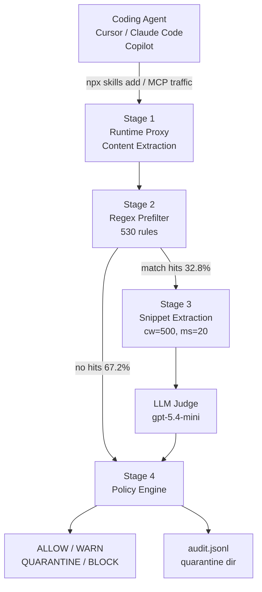

## この記事の対象と得られるもの

コーディングエージェント（Cursor / Claude Code / GitHub Copilot / Gemini CLI 等）に、サードパーティ製の Skill ファイル（`SKILL.md` など）を `npx skills add` や MCP 経由で入れている開発者・チームが対象です。

読み終えると、次の3点が手に入ります。

- Skill ファイルがサプライチェーン攻撃面になる仕組み
- 論文 [SkillGate](https://arxiv.org/abs/2607.25619)（arXiv:2607.25619）が採る「正規表現プリフィルタ + LLM Judge」の設計と、その定量成果
- 自分のチームで今日から適用できる導入ゲートの組み方と、SkillGate でも守れない範囲

結論を先に置きます。**Skill の検査は「全文を LLM に読ませる」より「怪しい箇所だけ切り出して LLM に読ませる」ほうが、精度も速度もコストも良い**。SkillGate はこの設計で LLM 入力トークンを全文判定比 76.9%（約 77%）削減し、F1 = 0.817、偽陽性率 1.13%、平均レイテンシ約 818ms を同時に達成しています。

## なぜ Skill ファイルが攻撃面になるのか

Skill ファイルは、プロジェクト固有の API 規約や開発コンテキストをエージェントへ注入するための仕組みです。導入経路は主に2つあります。

| 経路 | 具体例 |
| --- | --- |
| パッケージ導入 | `npx skills add <package>` |
| MCP 経由 | `tools/call` / `resources/read` / `prompts/get` |

問題は、**この導入がスクリーニングなしで行われる運用が普及している**ことです。Skill ファイルは実行バイナリではなく「エージェントへの指示文」なので、レビューの対象になりにくい。しかし指示文であるがゆえに、エージェントの行動をそのまま書き換えられます。

報告されている攻撃パターンは次の通りです。

- エージェントの行動の不正な書き換え（Reprogramming）
- 認証情報の窃取（`~/.ssh/id_rsa` や `.env` の外部送信）
- 生成コードへのバックドア挿入
- 攻撃者エンドポイントへのリダイレクト

これは仮想的なリスクではありません。2026年2月には ClawHub レジストリで **1,184 件（掲載スキルの約 20%）の悪性スキル**が発見された「ClawHavoc」キャンペーンが報告され、生産性向上ツールを偽装したインフォスティーラーの配布が確認されています。掲載物の5件に1件が悪性という比率は、レジストリを信頼の根拠にできないことを意味します。

## 既存の検査手段が実用に足りない理由

Skill ファイルを検査する方法は、大きく2つに割れます。SkillGate 論文はそのどちらも実用圏に届かないことを、同一ベンチマーク上で示しています。

**静的ルール判定**（ClawVet: 54 パターンの静的 Regex、SkillScanner: YARA/CFG ベース）は、LLM を使わないのでトークンコストがゼロで速い。ただし偽陽性率が 17.4% 〜 50.4% に達します。ClawVet の 50.4% は、良性 1,500 件のうち 756 件を誤って警告する水準です。開発者は数回で警告を無視するようになり、ゲートとして機能しません。

**全文 LLM 判定**（SkillScanner + LLM）は文脈を読めますが、Skill ファイル 1 件が平均 7k〜12k 文字あるため、全件を丸ごと LLM に投げることになります。結果は F1 = 0.287、Recall = 0.180、平均レイテンシ 6,281ms。偽陽性率 0.73% は低いものの、**保守的に振れすぎて悪性の8割以上を見逃しています**。コストと待ち時間を払って見逃す、という最も割の悪い状態です。

つまり判断のポイントは「ルールか LLM か」ではなく、**LLM に何を読ませるか**です。

## SkillGate の4ステージ設計

SkillGate は AWSM Research が提案したオープンソースのセキュリティゲートウェイです。エージェントと外部レジストリ / MCP サーバーの間に、透過的な Unix Socket プロキシ（`~/.skillgate/skillgate.sock`）および CLI Shim（`skillgate install-skills-shim`）として入ります。



### Stage 1: 導入経路の透過的な捕獲

エージェントと MCP サーバー間のトラフィック、または `npx skills add` によるパッケージ導入を透過的に割り込み捕獲します。判定結果は構造化 JSONL の監査ログ（`~/.skillgate/logs/audit.jsonl`）に記録されます。

ここで重要なのは「透過的」であることです。開発者側のコマンドを変えずにゲートを挟めるので、運用ルールの遵守を人の善意に依存しません。

### Stage 2: 530 パターンの正規表現プリフィルタ

全件を正規表現で走査します。ルールの内訳は次の構成です。

| 出典 | パターン数 | 主な内訳 |
| --- | --- | --- |
| MITRE ATT&CK 由来 | 428 | Defense Evasion 62 / Execution 56 / Risky commands 56 / Credential Access 44 / Persistence 38 / Impact 33 等 |
| Sigma コミュニティルール | 102 | — |

このステージの狙いは検知そのものではなく、**LLM を呼ばなくて済むファイルを確定させること**です。ヒットがゼロのファイルは LLM 判定を完全にスキップし、ベンチマーク `SkillsBench` 全体の 67.2% がここを通過します（Skip Savings）。

### Stage 3: スニペット抽出と LLM Judge

パターンにマッチしたファイルだけが LLM に回ります。ここで全文を送らないのが SkillGate の中核です。

- マッチ箇所の前後 500 文字（$cw=500$）を切り出す
- 重なり合うウィンドウを統合する
- 最大 20 ウィンドウ（$ms=20$）、上限 8,000 文字に収める
- 抽出領域のみを LLM Judge（`gpt-5.4-mini`）へ送信する（Snippet Savings）

LLM は判定ラベル（`SAFE` / `SUSPICIOUS` / `MALICIOUS`）と確信度スコア（$0.0 \sim 1.0$）を返します。ラベルと確信度を分けて返させることで、次の Stage 4 で「止める」と「警告する」を段階的に切り替えられます。

### Stage 4: ポリシーエンジンと監査ログ

判定を実際の挙動に落とす層です。確信度の閾値で4段階に分岐します。

| 判定 | 確信度 | アクション |
| --- | --- | --- |
| `MALICIOUS` | $\ge 0.7$ | **BLOCK**（インストール拒否） |
| `SUSPICIOUS` | $\ge 0.5$ | **QUARANTINE**（`~/.skillgate/quarantine/` へ隔離） |
| `SUSPICIOUS` | $< 0.5$ | **WARN**（警告表示） |
| `SAFE` | — | **ALLOW**（通過） |

隔離（QUARANTINE）が独立した段として用意されている点は、実運用で効きます。グレーな判定を「拒否」か「素通り」の二択に押し込まず、人間のレビュー待ちキューに落とせるからです。

## 定量成果をどう読むか

評価は `SkillsBench`（良性 1,500 件、悪性 150 件、$n=1{,}650$、悪性率 9.1%）で行われています。

### 検出性能（RQ1）

| 手法 | F1 | Recall | Precision | FPR | MCC | AUPRC |
| --- | --- | --- | --- | --- | --- | --- |
| **SkillGate** | **0.817** | 0.769 | 0.871 | **1.13%** | **0.803** | **0.830** |
| ClawVet（静的 54 パターン） | 0.258 | — | — | 50.4% | 0.225 | 0.144 |
| SkillScanner（YARA/CFG） | 0.295 | — | — | 17.4% | 0.215 | 0.162 |
| SkillScanner + LLM（全文） | 0.287 | 0.180 | — | — | 0.331 | 0.246 |

注目すべきは F1 より **MCC と AUPRC** です。悪性率 9.1% の不均衡データでは、Accuracy や F1 は多数派クラスに引っ張られて実力を見誤らせます。MCC（Matthews Correlation Coefficient）は不均衡下でも解釈できる総合指標で、SkillGate は最強の既存手法比 2.4 倍（0.803 vs 0.331）。AUPRC でも 5〜6 倍です。ベンチマークを自分で組むときも、この2指標を主指標に置くのが妥当です。

### トークンコスト（RQ2）

全文 LLM 判定比で **LLM 入力トークン数を 76.9%（約 77%）削減**、コスト効率 4.3 倍。削減は2段の掛け算で生まれています。

- 67.2% のファイルが LLM に到達しない（Stage 2 の Skip Savings）
- 残る 32.8% も全文でなく最大 8,000 文字のスニペットだけを送る（Stage 3 の Snippet Savings）

### レイテンシ（RQ3）

| 経路 | 処理時間 |
| --- | --- |
| Regex スキップ時 | 約 139ms |
| LLM 判定時 | 約 2,208ms |
| 加重平均 | **約 818ms** |
| SkillScanner + LLM（全件 LLM） | 約 6,281ms |

加重平均で 7.7 倍高速です。ここも「大半が 139ms で抜ける」構造が効いています。導入コマンドの体感を壊さない水準に収まるかどうかは、ゲートが運用に残るかどうかを直接左右します。

### 偽陽性（RQ4）

良性 1,500 件に対する誤検知は平均 17 件（FPR = 1.13%）。ClawVet（50.4% / 756 件）や SkillScanner（17.4% / 261 件）と比べて 15〜44 倍の削減です。

さらに実務上重要なのは内訳です。誤検知の主因は **API ドキュメント等に含まれる Base64 エンコード例**が `encoded-payload` ルールに反応したもので、Hard Block まで達した深刻な誤検知は 17 件中 3 件（0.20%）にとどまります。つまり大半は WARN で止まり、開発者の作業を実際に阻害する頻度は 1,000 件に 2 件です。

## 3つの方式の比較

| 比較軸 | 静的ルール判定 | 全文 LLM 判定 | SkillGate |
| --- | --- | --- | --- |
| スクリーニング方式 | 54 パターン程度の静的 Regex / YARA | Skill ファイル全文を LLM へ入力 | Regex プリフィルタ + マッチ部スニペットを LLM 判定 |
| F1 スコア | 0.258 〜 0.295 | 0.287 | **0.817** |
| 偽陽性率 | 17.4% 〜 50.4%（誤検知多発） | 0.73%（保守的すぎて見落とし多発） | **1.13%** |
| LLM トークン消費 | 0% | 100% | **23.1%**（76.9% 削減） |
| 平均レイテンシ | $< 100\text{ms}$ | 6,281ms | **818ms** |

静的判定は「安い・速い・使えない」、全文 LLM 判定は「高い・遅い・見逃す」。SkillGate の位置は、両者の中間ではなく**両方の弱点を回避した別の点**にあります。

## 自分のチームで何をするか

論文の知見を運用ルールに落とすと、次の3点になります。SkillGate を導入しない場合でも、考え方は流用できます。

### 1. スクリーニングなしの直接導入を禁止する

開発者の端末で `npx skills add <untrusted-package>` を直接実行させる運用をやめ、プロキシまたは Shim 経由での導入を強制します。ClawHub の悪性率 20% を踏まえると、「レジストリに載っている」は信頼の根拠になりません。

### 2. 二段構えのハイブリッドゲートにする

全件を LLM 判定に回すとコストと応答速度がボトルネックになり、開発体験を損ないます。ATT&CK 由来のシグネチャで1次選別して6割以上の安全ファイルをパスさせ、懸念領域だけスニペット化して LLM に回す。この順序が、ゲートを運用に残すための条件です。

判断基準として、自前でゲートを組むなら次の数値を目標に置くと現実的です。

- 加重平均レイテンシ 1 秒以内（導入コマンドの体感を壊さない）
- 偽陽性率 2% 未満（警告が無視されない）
- Hard Block に至る誤検知 0.5% 未満（作業停止を招かない）

### 3. 承認済みの社内ミラーを置く

スクリーニングを通過し、セキュリティチームの監査を終えた Skill ファイルのみを社内プライベートミラーに配置し、エージェントはそこからのみ Skill を読み込む構成にします。ゲートの判定結果を「都度」ではなく「資産」として残せるので、同じファイルを何度も検査せずに済みます。

### Skill 定義に信頼属性を持たせる

社内ミラーを置くなら、Skill 定義そのものに検査履歴を持たせておくと、CI/CD やエージェントループ側でポリシー判定できます。従来の `SKILL.md` は「名前」「説明」「手順」だけですが、次のような信頼属性（Trust Metadata Attributes）を足す拡張が考えられます。

```yaml
# Skill オントロジー拡張案
metadata:
  name: example-skill
  version: 1.2.0
  trust_attributes:
    provenance: "https://github.com/approved-org/skills/example" # 配布元
    inspection_result:                                          # 検査結果
      passed: true
      scanner: "SkillGate-v1.0"
      prefilter_hits: 0
      llm_verdict: "SAFE"
      confidence: 0.98
      inspected_at: "2026-07-30T08:44:00Z"
    approver: "security-gatekeeper-agent"                       # 承認者
    revocation_status: "active"                                 # 失効状態 (active / revoked)
```

この属性があれば、「信頼属性が欠落している Skill や失効した Skill の読み込みを自動拒否する」ポリシーを機械的に適用できます。

## SkillGate でも守れない範囲

SkillGate は**導入時検査（Install-time screening）**の技術です。ここを取り違えると、入れた安心感だけが残ります。論文自身が挙げる限界は次の4点です。

**1. 実行時ドリフトと動的リソース**

導入時に検査を通過した Skill でも、実行時に MCP の `resources/read` や外部スクリプトの動的フェッチ（`curl | bash` 等）で攻撃指示を取り込むケースは検出範囲外です。導入後のバージョン更新でバックドアが追加された場合の差分チェックも対象外です。

対策の方向は、実行時のツール呼び出し・ネットワークアクセス側にも別の層を持つこと、そして更新時に必ず再検査を走らせることです。

**2. スニペット切り出しによる文脈の分断**

前後 500 文字・最大 20 ウィンドウという方針はトークン削減に効く一方、ファイル全体に薄く分散された難読化ステガノグラフィーや、複数箇所に分割されたプロンプトインジェクションでは、文脈が切れて偽陰性になるリスクが残ります。Recall 0.769 という数値は、悪性の約 23% を取りこぼすことを意味します。

**3. 適応的攻撃者**

実験の脅威モデルは「SkillGate のルールセットを知らない非適応的攻撃者」を前提としています。530 パターンの Regex シグネチャが公開・特定された場合、シグネチャ回避の難読化や構文の言い換え、LLM Judge 自体を誤導するプロンプト脱獄への頑健性は未検証です。オープンソースであること自体が、この前提を弱める方向に働きます。

**4. ドキュメント由来の偽陽性**

前述の通り、誤検知の大半はドキュメント内の Base64 コード例です。安全な開発ドキュメントと悪性難読化を文脈で判別する能力には、まだ改善余地があります。

## まとめ

- Skill ファイルはスクリーニングなしで導入される運用が普及しており、ClawHub では掲載スキルの約 20%（1,184 件）が悪性という報告がある
- 静的ルール判定は偽陽性率 17.4〜50.4% で運用に耐えず、全文 LLM 判定は 6,281ms かけて Recall 0.180 しか出ない
- SkillGate は「530 パターンの Regex プリフィルタ + マッチ部スニペットのみ LLM Judge」で、F1 = 0.817 / FPR = 1.13% / 平均 818ms / LLM 入力トークン 76.9% 削減を同時に達成した
- 削減は「67.2% が LLM に到達しない」と「残りも最大 8,000 文字だけ送る」の掛け算で生まれている
- 不均衡データの評価では F1 より MCC と AUPRC を主指標に置く
- 運用に落とすなら、直接導入の禁止・二段ゲート・承認済み社内ミラー + 信頼属性の3点
- ただし守れるのは導入時のみ。実行時ドリフト、分散型の難読化、適応的攻撃者は別の層で対処する

この記事が少しでも参考になった、あるいは改善点などがあれば、ぜひリアクションやコメント、SNSでのシェアをいただけると励みになります！

## 参考リンク

- [SkillGate: Cost Efficient Runtime Malicious Skill File Detection in Coding Agents (arXiv:2607.25619)](https://arxiv.org/abs/2607.25619) / [HTML 版](https://arxiv.org/html/2607.25619)
- [awsm-research/skillgate (GitHub)](https://github.com/awsm-research/skillgate)
- ClawHavoc Campaign (2026-02): ClawHub レジストリにおける 1,184 件の悪性 Skill ファイルおよび Infostealer 配布事例
- ClawVet: 54 パターンの静的判定ツール（SkillGate 論文の比較対象）
- SkillScanner: Cisco AI Defense 多重エンジン・YARA/CFG スキャナ v2.0.11（SkillGate 論文の比較対象）
- SkillsBench Benchmark: $n=1{,}650$（悪性 150 / 良性 1,500）の評価データセット
