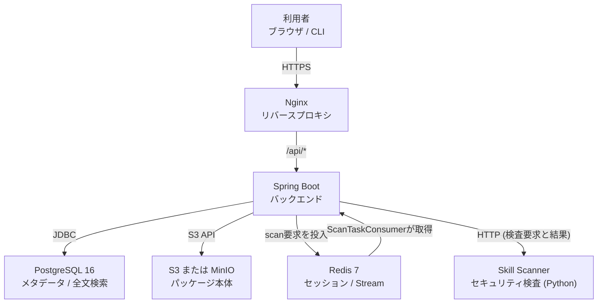
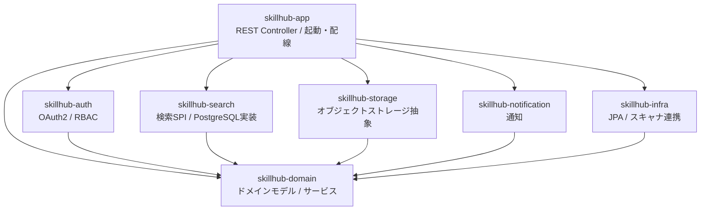
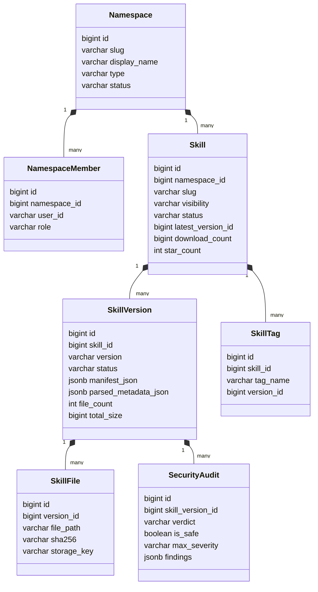
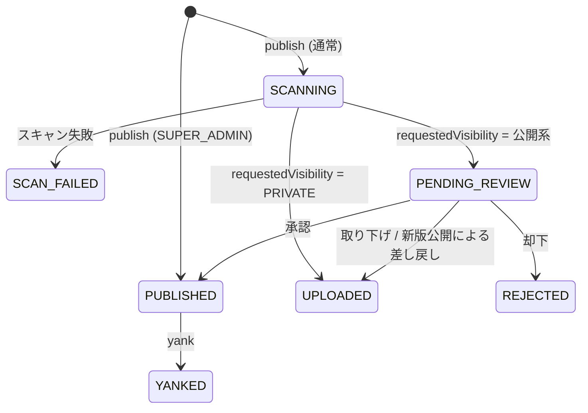
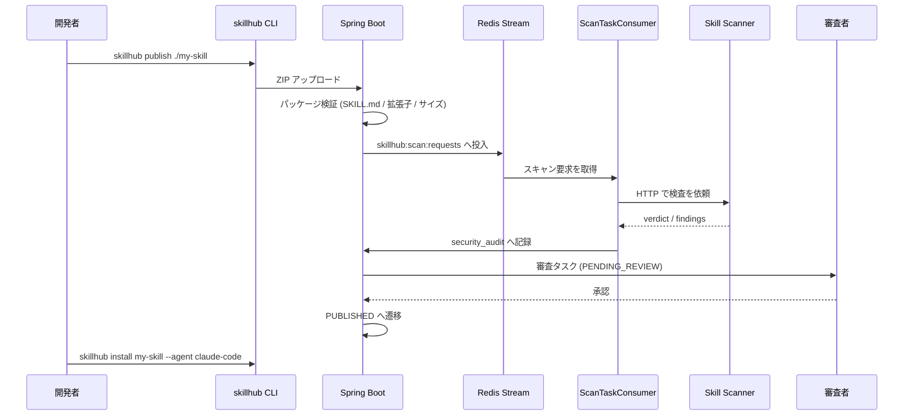

AIエージェントに手順書を持たせる「スキル」が増えてくると、配布が急に面倒になります。Gitリポジトリに置いて各自がcloneする運用は、バージョンの取り違えと、誰が何を入れているのか分からない状態を生みます。かといって公開レジストリに置けば、社内の業務手順がそのまま外に出ます。

[SkillHub](https://github.com/iflytek/skillhub)は、この間を埋めるセルフホスト型のスキルレジストリです。iFLYTEKがApache-2.0で公開しており、ファイアウォール内に立てたまま、npmに近い公開・検索・インストール体験を提供します。

この記事では、SkillHubの構造とデータモデル、そして中核である「公開フロー」を、実装コードで確認しながら整理します。読み終えると、自社にスキルレジストリを置くべきか、置くなら何を運用として決める必要があるかを判断できます。

:::message
本文中の状態遷移・制約値・CLIフラグは、コミット[`fac1110`](https://github.com/iflytek/skillhub/tree/fac1110d15954352fb6f2fd70a39a536d9a58dca)（2026-07-31）の実装（`server/`・`cli/`・`scanner/`）で確認した値です。READMEに載っていない挙動も含みます。Helmチャートの`appVersion`は`0.2.14`で、まだ初期段階のプロダクトです。
:::


*この記事の全体像。以下、順に解説します。*

## SkillHubが引き受ける課題

スキル配布を自前で回すと、だいたい次の3つで詰まります。

| 課題 | 素朴な運用で起きること | SkillHubの答え |
|---|---|---|
| 配布 | 各自がcloneし、バージョンがばらける | セマンティックバージョニング + タグでの配布 |
| 統制 | 誰でも共有ディレクトリに置けてしまう | 名前空間ごとのロールと審査タスク |
| 安全性 | 中身を読まずにエージェントへ渡してしまう | 公開前の自動セキュリティスキャン |

特徴的なのは、3番目です。スキルは実質的に「エージェントに実行させる指示とスクリプト」なので、レジストリはパッケージマネージャであると同時に、サプライチェーンの検査点になります。SkillHubはこれをデータモデルの中心に据えています。

## 構造

### コンテナ構成

デプロイ単位は、アプリケーション3つとデータサービス3つの計6つです。



注目すべきは検索基盤です。SkillHubは全文検索にElasticsearchを使わず、PostgreSQLの`tsvector`で完結させています。`skill_search_document`テーブルに生成列として`search_vector`を持ち、GINインデックスを張る構成です。

```sql
-- V2__phase2_skill_tables.sql より
ALTER TABLE skill_search_document
ADD COLUMN search_vector tsvector
GENERATED ALWAYS AS (
    setweight(to_tsvector('simple', coalesce(title, '')), 'A') ||
    setweight(to_tsvector('simple', coalesce(summary, '')), 'B') ||
    setweight(to_tsvector('simple', coalesce(keywords, '')), 'B') ||
    setweight(to_tsvector('simple', coalesce(search_text, '')), 'C')
) STORED;
```

運用するミドルウェアが1つ減るのは、社内ツールとしては素直な設計判断です。

### バックエンドのモジュール

Mavenマルチモジュールで、依存が一方向に流れる構成です。



`skillhub-storage`と`skillhub-search`が抽象として切られているのが要点です。ストレージは`ObjectStorageService`インターフェースに対して`LocalFileStorageService`と`S3StorageService`の2実装があり、開発時はローカルファイル、本番はS3互換を設定だけで切り替えられます。

## データモデル

### 主要エンティティ



| エンティティ | 役割 |
|---|---|
| `namespace` | スコープの単位。`type`は`GLOBAL`または`TEAM` |
| `namespace_member` | 所属ユーザーとロール。`OWNER` / `ADMIN` / `MEMBER` |
| `skill` | スキル本体。`visibility`は`PUBLIC` / `NAMESPACE_ONLY` / `PRIVATE` |
| `skill_version` | バージョン単位。審査状態と`manifest_json`を保持 |
| `skill_tag` | `beta`や`stable`など、特定バージョンを指す別名 |
| `skill_file` | パッケージ内の1ファイル。`sha256`と`storage_key`で実体を追跡 |
| `security_audit` | スキャン結果。論理削除で履歴を残す |

`skill_tag`が指す先は`version_id`カラムです。タグは「スキルに付ける分類ラベル」ではなく、「特定バージョンへのポインタ」である点に注意してください。npmのdist-tagと同じ発想です。

`security_audit`は論理削除（`deleted_at`）を採用しており、`skill_version`が消えても検査履歴が残ります。監査目的のテーブルとして筋が通っています。

### バージョンの状態機械

SkillHubの中核はこの状態遷移です。`SkillVersionStatus`は8つの値を持ちますが、現行のpublish処理が実際に通るのは次の7つです（`DRAFT`は列挙値として定義されているものの、publish経路では設定されません）。



遷移の主導権は`SkillPublishService`と`SecurityScanService`が分け合います。publishはまず可視性と権限で状態を決め、その直後にスキャンが起動して状態を`SCANNING`へ移します。

| 条件 | publish直後 | スキャン | 最終的な落ち着き先 |
|---|---|---|---|
| `SUPER_ADMIN`による公開、または自動公開指定 | `PUBLISHED` | 実行され記録されるが状態は変えない | `PUBLISHED` |
| `visibility = PRIVATE` | `UPLOADED` | `SCANNING`へ移す | `UPLOADED` |
| `visibility = PUBLIC` / `NAMESPACE_ONLY` | `PENDING_REVIEW` | `SCANNING`へ移す | `PENDING_REVIEW` |

つまり人手の審査に乗るのは公開系のスキルだけで、`PRIVATE`は`UPLOADED`のまま使えます。摩擦のかけ方が可視性に連動しているのが、この設計の効きどころです。管理者による自動公開だけはスキャン結果を待たずに`PUBLISHED`になりますが、`security_audit`への記録は同じように行われます。

ここで`PRIVATE`を「自分専用」と読まないでください。`VisibilityChecker.canAccess()`は、`PRIVATE`スキルへのアクセスを所有者に加えて、そのnamespaceの`ADMIN` / `OWNER`と`SUPER_ADMIN`にも許可します。スキップされるのは人手の審査だけで、スキャナが有効なら`PRIVATE`も検査対象です（`triggerScan()`は自動公開分も含む全バージョンで呼ばれます）。「レビューを通したくない機密スキルの置き場」ではない、という理解が必要です。

スキャン結果を反映する`processScanResult()`は、状態が`SCANNING`のときだけ遷移させます。すでに`PUBLISHED`や`YANKED`になったバージョンを、遅れて届いたスキャン結果が巻き戻すことはありません。スキャンがタイムアウトした場合は`ScanTaskConsumer`が`SCAN_FAILED`へ落とします。

もう1つ、運用で効く挙動があります。同じスキルの新バージョンを公開すると、既存の`PENDING_REVIEW`バージョンは`UPLOADED`へ差し戻されます。審査待ちが積み上がらないよう、最新版だけがレビュー対象になる仕組みです。審査者を待たせずに引っ込めたいときは、`withdrawPendingVersion()`でも同じ`UPLOADED`へ戻せます。なお、既存バージョンと同じバージョン番号での再公開は、そのバージョンが`PUBLISHED`のときだけ拒否されます。`SCAN_FAILED`や`REJECTED`で終わったバージョンは、同じ番号のまま公開しなおせます。

公開済みバージョンの取り下げは`yankVersion()`で、`PUBLISHED`のときだけ`YANKED`へ遷移します。

### 公開からインストールまで



スキャンはRedis Stream（`skillhub:scan:requests`）経由の非同期処理です。ただしRedisをconsumeするのはスキャナではなく、バックエンド内の`ScanTaskConsumer`です。`SecurityScanService.triggerScan()`が要求を積み、`ScanTaskConsumer`が拾って`SkillScannerAdapter`からスキャナのHTTP APIを呼び、結果をHTTPレスポンスとして受け取ります。スキャナ側はSkillHubのDBにもRedisにも触りません。

重要なのは、このスキャナが**公開系の可視性では必須**である点です。`SkillPublishService.requiresSecurityScanner()`は`PUBLIC`と`NAMESPACE_ONLY`でスキャナの有効化を要求し、無効なら`error.security.scanner.required`で公開そのものを拒否します。「スキャナは後回しにして審査ワークフローだけ先に回す」という導入はできません（`PRIVATE`のみに限れば可能です）。

一方、スキャナ内部の分析エンジンは選択式です。既定で有効なのは`meta`だけで、LLM分析は既定で無効です。

| アナライザ | 環境変数 | 既定 |
|---|---|---|
| meta | `SKILLHUB_SCANNER_USE_META` | `true` |
| behavioral | `SKILLHUB_SCANNER_USE_BEHAVIORAL` | `false` |
| llm | `SKILLHUB_SCANNER_USE_LLM` | `false` |
| ai-defense | `SKILLHUB_SCANNER_USE_AI_DEFENSE` | `false` |
| virus-total | `SKILLHUB_SCANNER_USE_VIRUS_TOTAL` | `false` |
| trigger | `SKILLHUB_SCANNER_USE_TRIGGER` | `false` |

つまり、外部LLMを一切使わない構成でもスキャナは動きます。LLM分析を有効にするときだけ、`SKILLHUB_SCANNER_LLM_PROVIDER`（既定`anthropic`）と対応するAPIキーが必要になります。合議で精度を上げる`SKILLHUB_SCANNER_LLM_CONSENSUS_RUNS`は既定`3`なので、有効化するとコストと所要時間がその分かかります。

判定の厳しさは`SKILLHUB_SCANNER_POLICY_PRESET`（既定`balanced`）と`SKILLHUB_SCANNER_FAIL_ON_SEVERITY`（既定`high`）で決まります。後者は「どの深刻度以上をunsafeと判定するか」の閾値です。

:::message alert
`fail-on-severity`は公開を自動で止めるスイッチではありません。`SecurityScanService.processScanResult()`は`verdict`を`security_audit`へ保存するだけで、遷移先は可視性からのみ決まります。unsafe判定はあくまで審査者への判断材料であり、`SUPER_ADMIN`の自動公開で既に`PUBLISHED`になったバージョンを非公開へ巻き戻すこともありません。「危険なスキルは自動で止まる」という前提で運用設計しないでください。
:::

## パッケージの制約

公開できるZIPには上限がありますが、固定値ではなく`skillhub.publish.*`の設定項目です。同梱の`application.yml`が出荷時の既定を与えています。

| 項目 | 出荷時の既定 | 設定キー |
|---|---|---|
| 最大ファイル数 | 100 | `skillhub.publish.max-file-count` |
| 単一ファイル最大サイズ | 10 MB | `skillhub.publish.max-single-file-size` |
| パッケージ合計最大サイズ | 100 MB | `skillhub.publish.max-package-size` |

`SkillPublishProperties`クラスのフィールド初期値（`SkillPackagePolicy`の定数と同じ500ファイル）と、`application.yml`が与える値（100ファイル）は異なります。実際に効くのは後者なので、上限を確認するときはクラス定数ではなく設定ファイルを見てください。

これらの上限超過と`SKILL.md`の欠落は、検証時に**エラー**として公開を止めます。

一方、拡張子リストの扱いは違います。`.md` `.txt` `.json` `.yaml` `.toml`などのドキュメント・設定、`.js` `.ts` `.py` `.sh` `.go` `.rs` `.java`などのスクリプト、画像、Office文書が既定で並びますが、リスト外の拡張子は`SkillPackageValidator`が`Disallowed file extension`という**警告**として返すだけです。公開前確認のフローで警告を了承すれば、そのまま公開できます。リスト自体は`SKILLHUB_PUBLISH_ALLOWED_FILE_EXTENSIONS`で上書きできます。

つまり拡張子リストは「弾く壁」ではなく「気づかせる仕組み」です。バイナリの持ち込みを本気で止めたいなら、警告を無視できない運用ルールを別途決める必要があります。

パス正規化だけは厳格で、絶対パス、`..`によるルート脱出、ドライブレター混入は、いずれもエラーとして弾かれます。ZIP展開時のパストラバーサル対策として妥当な作りです。

## 導入

### Docker Composeで試す

READMEのクイックスタートは、リモートスクリプトを取得して実行する形です。

```bash
rm -rf /tmp/skillhub-runtime
curl -fsSL https://imageless.oss-cn-beijing.aliyuncs.com/runtime.sh | sh -s -- up

# 公開URLを指定する場合
curl -fsSL https://imageless.oss-cn-beijing.aliyuncs.com/runtime.sh | sh -s -- up \
  --public-url https://skillhub.your-company.com
```

配布元がAliyun OSSの外部ホストである点は、社内導入時にレビュー対象になります。取得したスクリプトを一度保存して読んでから実行する運用を勧めます。

初期設定では、デフォルト管理者（ユーザー名`admin` / パスワード`ChangeMe!2026`）でログインします。**このパスワードはREADMEに公開されている既知の値なので、公開URLを割り当てる前に変更してください。**

### Kubernetesへ載せる

Helmチャートが`charts/skillhub`に同梱されています。PostgreSQLとRedisはBitnamiのサブチャートを依存として持ち、`postgresql.enabled` / `redis.enabled`で外部マネージドサービスへ差し替えられます。

```bash
helm dependency update charts/skillhub
helm install skillhub charts/skillhub -f my-values.yaml
```

`values.schema.json`が用意されているので、値の誤りはインストール前に検出されます。

## 利用

### CLI

CLIはnpmパッケージ`@astron-team/skillhub`として配布されています。

```bash
npm install -g @astron-team/skillhub

skillhub login --token sk_xxx --registry https://skillhub.your-company.com
skillhub search pdf
skillhub install pdf-parser --agent claude-code
skillhub publish ./my-skill --namespace team-myteam
```

サブコマンドは`login` `logout` `whoami` `search` `install` `list` `update` `remove` `publish` `doctor` `version` `help`が実装されています。

### エージェントプロファイル

`install`の`--agent`は、スキルの配置先をエージェントごとに解決するためのオプションです。リポジトリには15のプロファイルが同梱されています。

| 系統 | 対応エージェント |
|---|---|
| CLI系 | `claude-code` / `codex` / `gemini-cli` / `kiro-cli` / `opencode` / `openclaw` / `openhands` |
| エディタ系 | `cursor` / `windsurf` / `trae` / `trae-cn` / `kilo` / `roo` |
| その他 | `github-copilot` / `generic-fallback` |

`--agent`は複数指定でき、1つのスキルを複数エージェントへ同時に配置できます。配置先は次の3つのオプションで決めます。

| オプション | 役割 |
|---|---|
| `--agent <name>` | エージェントのプロファイルに従って配置先を解決 |
| `--scope user\|project` | ユーザー単位かプロジェクト単位かを選択 |
| `--dir <path>` | 明示したディレクトリへ配置 |

`--agent`と`--scope`は併用できます。`skillhub install pdf-parser --scope project --agent codex`のように、対象エージェントの配置先をプロジェクト単位に寄せる指定が可能です。

排他なのは`--dir`だけです。`--dir`を`--scope`または`--agent`と同時に指定するとusage errorになるので、CI用スクリプトを書くときは`--dir`単独か、`--agent` / `--scope`の組み合わせかに寄せてください。

## 運用

### 起動と停止

```bash
make validate-release-config
docker compose --env-file .env.release -f compose.release.yml up -d

docker compose --env-file .env.release -f compose.release.yml down
```

`make validate-release-config`を先に通すことで、`.env.release`の不備を起動前に検出できます。

### 監視

Prometheus・Grafanaのスタックが`monitoring/`に同梱されています。

```bash
cd monitoring
docker compose -f docker-compose.monitoring.yml up -d
# Prometheus: http://localhost:9090
# Grafana:    http://localhost:3001
```

加えて`audit_log`テーブルに、実行者・アクション・対象・リクエストIDが記録されます。公開や審査といったガバナンス操作は、管理画面またはAdmin API経由でここから照会できます。

ダウンロードは別扱いです。`SkillDownloadedEvent`が持つのは`skillId`と`versionId`だけで、実行者もリクエストIDも含みません。`skill.download_count`を集計するためのイベントであり、「誰がいつこのスキルを取得したか」を追える監査証跡ではありません。利用者単位の追跡が要件なら、Nginxのアクセスログ側で確保してください。

### ストレージ

本番ではローカルファイルシステムではなく、S3互換ストレージを使ってください。バックエンドを複数レプリカにした時点で、ローカルファイル実装は成立しません。設定は`SKILLHUB_STORAGE_S3_*`系の環境変数で行います。

## 導入前に確認したい点

実装を読んだうえで、判断材料になりそうな点を挙げます。

**「セマンティック検索」の中身**
`skill_search_document.semantic_vector`という列があり、セマンティック検索を掲げています。ただし実装の`HashingSearchEmbeddingService`は、語をハッシュして64次元ベクトルに落とし、それをカンマ区切りの`TEXT`として保存する方式です。pgvectorも外部の埋め込みモデルも使っていません。表記ゆれには効きますが、意味的に離れた語をつなぐ挙動は期待しないほうが安全です。

**成熟度**
Helmチャートの`appVersion`は`0.2.14`です。マイグレーションは35本を超えており、`timestamptz`への型移行が繰り返し入っています。スキーマはまだ動いている段階と見るべきで、アップグレード時はマイグレーションの差分を確認する前提で計画してください。

**スキャナは省略できない**
`PUBLIC`と`NAMESPACE_ONLY`のスキルを公開するには、スキャナコンテナが有効である必要があります。無効なら公開が拒否されるため、「まずレジストリだけ立てて、検査は後から足す」という段階導入は`PRIVATE`スキルに限られます。最小構成でもスキャナを含める前提で計画してください。逆に、LLM分析は既定で無効なので、外部LLMへの依存を避けたまま導入することは可能です。

## まとめ

- SkillHubは、AIエージェントのスキルをファイアウォール内で配布するためのセルフホスト型レジストリです。
- 中核は`SkillVersionStatus`の状態機械で、可視性に応じて審査の要否が変わります。`PRIVATE`は人手審査を経ずに`UPLOADED`となり、`PUBLIC`と`NAMESPACE_ONLY`は`PENDING_REVIEW`を経由します。
- 検索はPostgreSQLの`tsvector`で完結し、運用するミドルウェアが少なく済みます。ただしセマンティック検索は軽量なハッシュ方式です。
- スキャナはRedis Stream経由の非同期処理で、公開系スキルでは必須です。ただしLLM分析は既定で無効なので、外部LLMなしでも導入できます。
- 検査結果は記録されるだけで、公開を自動で止めません。拡張子リスト外のファイルも警告止まりです。強制力を期待する箇所は、運用ルールで補ってください。
- 導入時は、既知のデフォルトパスワード、外部ホストからのインストールスクリプト、`appVersion 0.2.x`という成熟度の3点を先に確認してください。

この記事が少しでも参考になった、あるいは改善点などがあれば、ぜひリアクションやコメント、SNSでのシェアをいただけると励みになります！

## 参考リンク

- [GitHub - iflytek/skillhub](https://github.com/iflytek/skillhub)
- [`SkillVersionStatus.java`（本文で参照した状態列挙）](https://github.com/iflytek/skillhub/blob/fac1110d15954352fb6f2fd70a39a536d9a58dca/server/skillhub-domain/src/main/java/com/iflytek/skillhub/domain/skill/SkillVersionStatus.java)
- [`SkillPublishService.java`（公開時の状態分岐とスキャナ必須判定）](https://github.com/iflytek/skillhub/blob/fac1110d15954352fb6f2fd70a39a536d9a58dca/server/skillhub-domain/src/main/java/com/iflytek/skillhub/domain/skill/service/SkillPublishService.java)
- [`SecurityScanService.java`（スキャン結果の反映ロジック）](https://github.com/iflytek/skillhub/blob/fac1110d15954352fb6f2fd70a39a536d9a58dca/server/skillhub-domain/src/main/java/com/iflytek/skillhub/domain/security/SecurityScanService.java)
- [`SkillPackageValidator.java`（エラーと警告の切り分け）](https://github.com/iflytek/skillhub/blob/fac1110d15954352fb6f2fd70a39a536d9a58dca/server/skillhub-domain/src/main/java/com/iflytek/skillhub/domain/skill/validation/SkillPackageValidator.java)
- [`application.yml`（出荷時のパッケージ上限）](https://github.com/iflytek/skillhub/blob/fac1110d15954352fb6f2fd70a39a536d9a58dca/server/skillhub-app/src/main/resources/application.yml)
- [`VisibilityChecker.java`（PRIVATEの可視範囲）](https://github.com/iflytek/skillhub/blob/fac1110d15954352fb6f2fd70a39a536d9a58dca/server/skillhub-domain/src/main/java/com/iflytek/skillhub/domain/skill/VisibilityChecker.java)
- [`cli/src/commands/install.ts`（CLIフラグの排他条件）](https://github.com/iflytek/skillhub/blob/fac1110d15954352fb6f2fd70a39a536d9a58dca/cli/src/commands/install.ts)
- [`scanner/docs/configuration.md`（アナライザとポリシーの既定値）](https://github.com/iflytek/skillhub/blob/fac1110d15954352fb6f2fd70a39a536d9a58dca/scanner/docs/configuration.md)
- [SkillHub Docs (Zread)](https://zread.ai/iflytek/skillhub)
- [DeepWiki - iflytek/skillhub](https://deepwiki.com/iflytek/skillhub)
