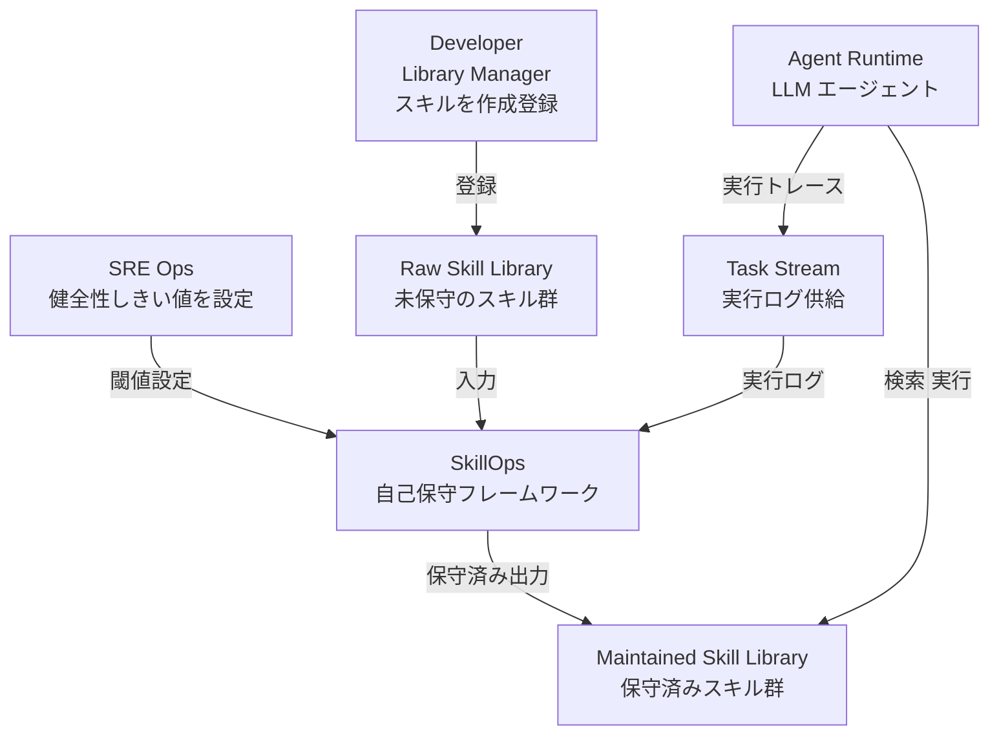
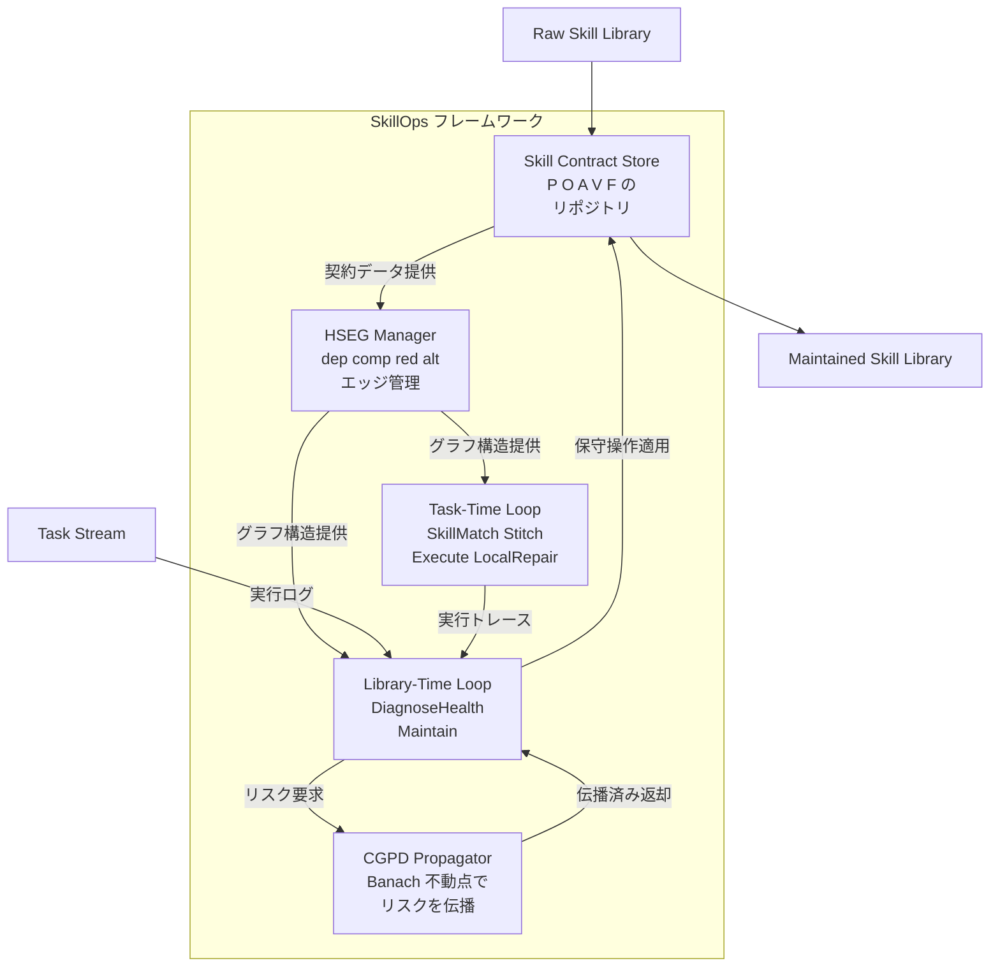
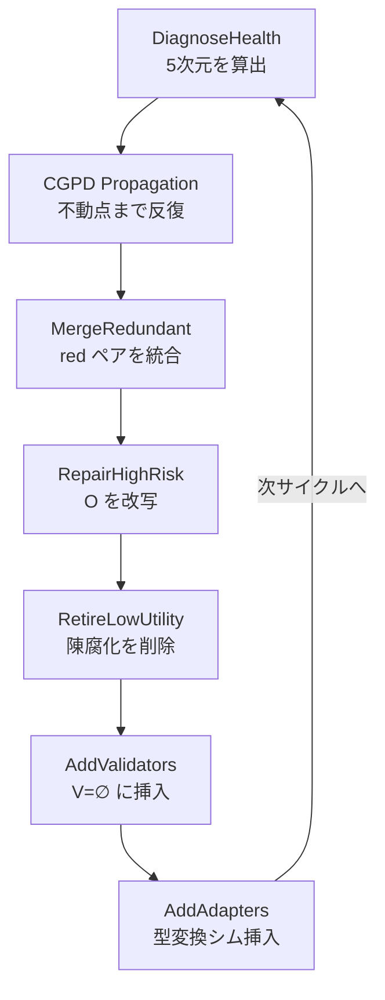
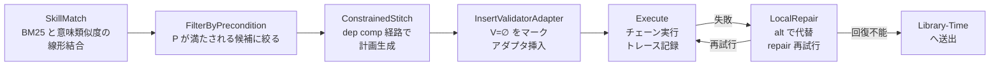
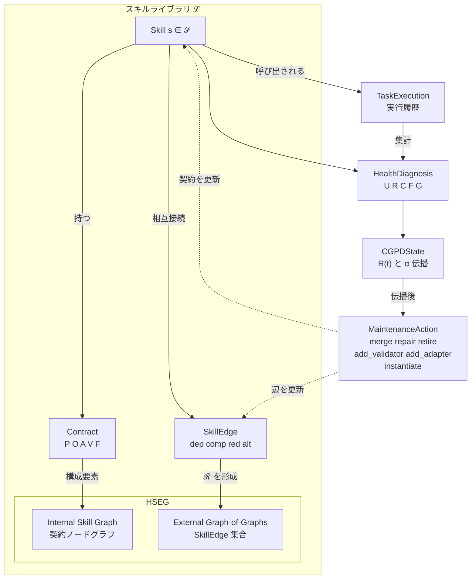
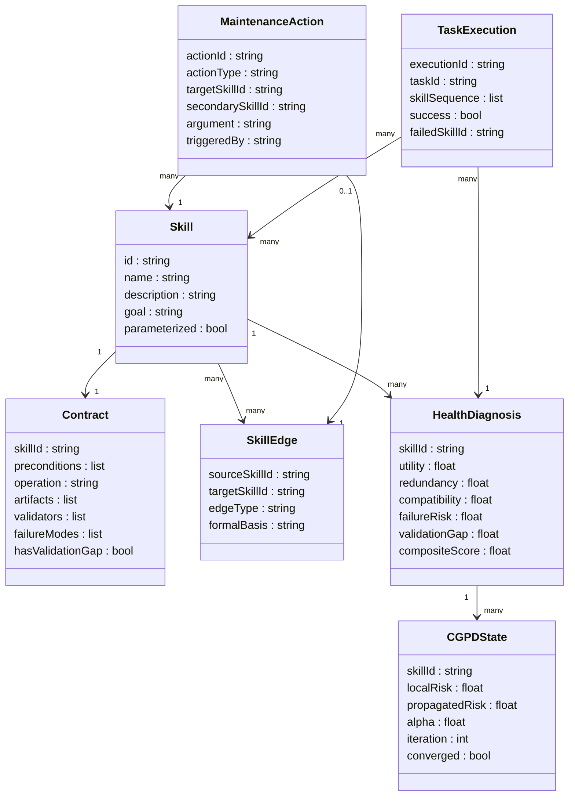
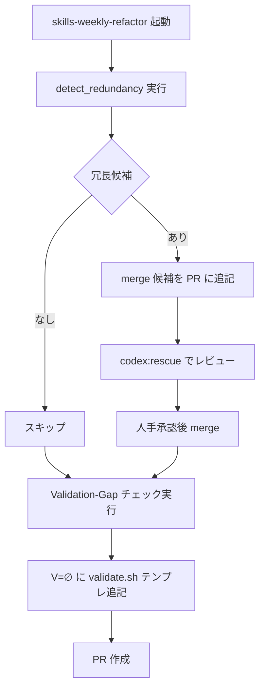
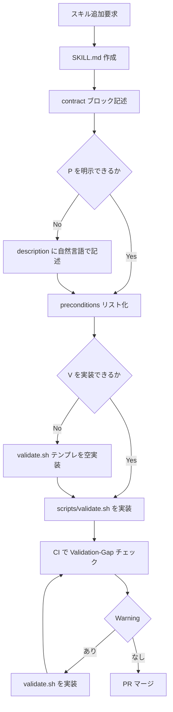
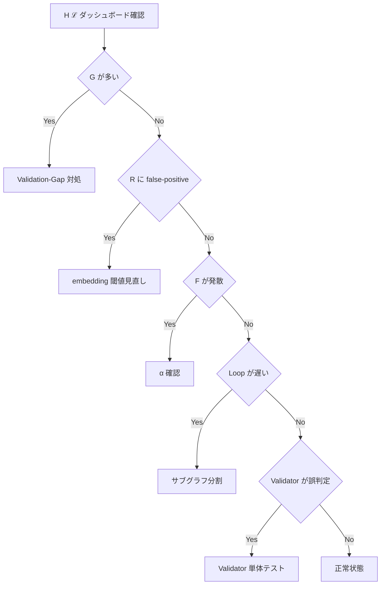

> 対象論文: SkillOps: Managing LLM Agent Skill Libraries as Self-Maintaining Software Ecosystems (arXiv:2605.13716v1, 2026-05-13)
> 著者: Xinyuan Song (Emory University), Hongji Pu (UIUC), Liang Zhao (Emory, corresponding)
> 調査日: 2026-05-15

## 概要

SkillOps は、LLM エージェントのスキルライブラリを「自己保守ソフトウェアエコシステム」として管理するフレームワークです。スキルライブラリは、エージェントがタスクを繰り返すたびにスキルを追加・再利用・パッチ適用することで成長します。この成長過程で、ライブラリには次のようなライブラリレベルの欠陥が蓄積します。

| 欠陥の種類 | 説明 |
|---|---|
| 冗長 (Redundancy) | 同一機能のスキルが複数共存 |
| 検証欠落 (Validation gap) | 成果物を検証するロジックが存在しない |
| インターフェースドリフト | 上流スキルの出力型と下流の入力型が不整合になる |
| 陳腐化 (Staleness) | 呼び出し頻度が低下し、実態を反映しなくなる |

論文はこれらを総称して **skill technical debt** と命名し、タスク実行ループとは独立した「ライブラリ時の保守ループ」を定常的に回す方法論を提案します。

### 位置づけ — MLOps / PromptOps / SkillOps の階層

| 層 | 代表的手法 | 管理対象 | 健全性の焦点 |
|---|---|---|---|
| MLOps | Sculley et al. 2015, MLflow | 数値モデル・特徴量パイプライン | データドリフト・統計的劣化 |
| PromptOps | LangSmith, Helicone | 単一プロンプト文字列 | バージョン管理・レイテンシ・コスト |
| **SkillOps** | SkillOps (本論文) | **スキルライブラリ全体** | **5 次元健全性 + 契約違反 + 依存伝播** |

MLOps が「学習」と「サービング」を独立したループに分けたように、SkillOps は「タスク実行 (Task-Time)」と「ライブラリ保守 (Library-Time)」を独立した 2 ループに分離します。PromptOps が個別プロンプトを孤立した資産として扱うのに対し、SkillOps はスキル間の意味的依存・互換性・冗長性をグラフとして扱う点が差別化点です。Sculley らの ML technical debt が「hidden feedback loop」を中核問題に置いたのと同様、SkillOps の CGPD 伝播はスキル間の隠れた失敗依存を可視化する装置として位置づけられます。

論文の中心命題は次の 3 点です。

1. スキルは自然言語の部品ではなく、前提条件・操作・成果物・検証・既知失敗の 5 タプル契約 (P, O, A, V, F) として表現します。
2. ライブラリ全体は階層的スキルエコシステムグラフ (HSEG) で関係を明示し、依存・互換性・冗長・代替の 4 種類の辺で管理します。
3. タスク選択ループとは独立に、ライブラリ時の保守ループ (健全性診断 → マージ・修復・退役・バリデータ追加・アダプタ挿入) を定常的に回します。

ALFWorld ベンチマークでは、SkillOps_Full が Success Rate 79.5% を達成し、最強のベースライン LLM_Skill_Planner (70.6%) を +8.9pp 上回りました。

## 特徴

### Skill Contract — 5 タプル (P, O, A, V, F)

| 記号 | 名称 | 意味 |
|---|---|---|
| P | Preconditions | スキル呼び出し前に満たすべき条件 |
| O | Operation | 実行可能な処理 |
| A | Artifacts | 型付き生成物 |
| V | Validators | 成果物の正当性を検証する機構 |
| F | Failure modes | 既知の失敗パターン |

V が空 (V = ∅) のスキルは "validation gap" と呼ばれ、ライブラリ健全性の指標として使われます。Bertrand Meyer の Design by Contract (Eiffel) の直系拡張ですが、対象が「LLM が生成・呼び出すスキル」である点が異なります。既存の Anthropic SKILL.md frontmatter は (P, O, A, V, F) に直接対応するフィールドを持たず、すべてが自然言語 description に集約されています。

### HSEG — 階層的スキルエコシステムグラフ

スキルライブラリを 2 階層のグラフで表現します。

- Internal Skill Graph: 個々のスキル内部で (P, O, A, V, F) を node とする契約グラフ
- External Graph-of-Graphs: スキル同士を結ぶ 4 種類の有向関係

| 関係 | 記号 | 定義 |
|---|---|---|
| Dependency | →dep | A_si ⊆ P_sj (上流の成果物が下流の前提条件を満たす) |
| Compatibility | →comp | 出力型と入力型の適合 |
| Redundancy | →red | P_si ≡ P_sj かつ A_si ≡ A_sj (機能的等価) |
| Alternative | →alt | goal(s_i) = goal(s_j) かつ O_si ≠ O_sj (実装違い) |

### 5 次元健全性診断

| 次元 | 記号 | 範囲 | 内容 |
|---|---|---|---|
| Utility | U(s) | [0,1] | 最近のタスク呼び出しでの成功割合 |
| Redundancy | R(s) | [0,1] | →red クラスタの正規化サイズ |
| Compatibility | C(s) | [0,1] | dependency 辺に対する compatibility 辺の割合 |
| Failure-Risk | F(s) | [0,1] | 経験的失敗率 |
| Validation-Gap | G(s) | [0,1] | 𝟏[V_s = ∅] の指示関数 |

総合健全性 H(ℒ) は各次元の重み付き平均として定義されます。

### CGPD — ContractGraph-Propagated Diagnosis

上流スキルの失敗リスクは下流スキルに伝播します。

```text
R^(t+1)(s) = (1 - α) · R_loc(s) + α · max(R^(t)(s'))
```

ここでの `R(s)` は伝播済みの **Failure-Risk** を指し、5 次元健全性の Redundancy `R(s)` とは別物です (論文の表記をそのまま採用)。α ∈ (0, 1) は伝播率で、Banach 縮小写像定理により一意な不動点へ収束します。

### Maintenance Actions — 6 種類の保守操作

| 操作 | 内容 |
|---|---|
| merge(s_i, s_j) | →red 関係のスキルを統合 |
| repair(s) | 実行フィードバックで Operation を改写 |
| retire(s) | 陳腐化・持続的失敗スキルを削除 |
| add_validator(s) | V = ∅ にバリデータを挿入 |
| add_adapter(s_i, s_j) | 型変換シムを挿入 |
| instantiate(s, arg) | パラメータ化スキルに引数を bind |

### 関連手法との比較

| 手法 | ライブラリ時保守 | 契約形式 | 自己修復タイミング |
|---|---|---|---|
| Voyager | なし (蓄積のみ) | コード + 自然言語説明 | タスク時 (コード再生成) |
| SkillWeaver | なし (単一スキル単位の改善) | Python API + テストケース | タスク時 (Skill Honing) |
| GoS (Group of Skills) | なし (retrieval 組織化のみ) | typed skill group | 推論時 (グループ再構成) |
| Reflexion | なし | 自由文 reflection (episodic memory) | タスク時 (verbal RL) |
| **SkillOps** | **あり (5 次元診断 + 6 操作ループ)** | **Contract (P, O, A, V, F) + HSEG** | **Library-Time (タスクと独立した定常保守)** |

Voyager / SkillWeaver / GoS / Reflexion はいずれもタスクを解くたびにスキルや記憶を更新する Online 系の手法です。SkillOps はタスク実行とは独立にライブラリ全体を定期的に診断・修復する Offline Governance 系であり、カテゴリが異なります。

同月 (2026-05) には SkillOS (arXiv:2605.06614) / SkillRAE (arXiv:2605.10114) / Dynamic Skill Lifecycle (arXiv:2605.10923) など並走研究も投稿されています。SkillOS はスキル間スケジューリング、SkillRAE は retrieval-augmented スキル選択に重点を置く一方、SkillOps は「形式契約 + Library-Time Governance」を体系化した点で差別化されます。

## 構造

C4 model 3 段階 (System Context / Container / Component) を SkillOps の論理構造に読み替えて表現します。下位の Code レベルは「データ」セクションの classDiagram が代替します。

### システムコンテキスト図



| 要素名 | 説明 |
|---|---|
| Developer / Library Manager | スキルを作成・登録する人間。Contract (P,O,A,V,F) を記述してライブラリに追加 |
| SRE / Ops | ライブラリの健全性しきい値を設定し、保守ループを監視する運用担当 |
| Task Stream | タスク入力を提供し、エージェントの実行ログを SkillOps に返す流れ |
| Agent Runtime | 保守済みライブラリからスキルを検索・実行する LLM エージェント |
| SkillOps | 本論文が提案するフレームワーク本体 |
| Raw Skill Library | 未保守のスキル群。冗長・バリデータ欠如・互換性破損などの技術的負債を含む |
| Maintained Skill Library | SkillOps が保守操作を適用した後のスキル群 |

### コンテナ図



| コンテナ名 | 説明 |
|---|---|
| Skill Contract Store | スキルを (P, O, A, V, F) の 5 タプルとして保存するリポジトリ |
| HSEG Manager | スキル間の 4 種類のエッジを管理するグラフ構造 |
| Task-Time Loop | タスク入力に対してスキルを選択・縫合・実行し、失敗時にローカル修復するリアルタイムループ |
| Library-Time Loop | 実行ログをもとに健全性を診断し、6 種保守操作を定常実行するバッチループ |
| CGPD Propagator | 上流スキルの失敗リスクを依存エッジ上で伝播させ、一意な不動点へ収束 |

### コンポーネント図 — Library-Time Loop



| 要素名 | 説明 |
|---|---|
| DiagnoseHealth | 実行ログから 5 次元を算出し H(ℒ) を集計 |
| CGPD Propagation | 上流リスクを下流に伝播させ収束まで反復 |
| MergeRedundant | Redundancy しきい値超の →red ペアを統合 |
| RepairHighRisk | Failure-Risk または CGPD リスク超のスキルを書き換え |
| RetireLowUtility | Utility 低かつ代替ありのスキルを削除 |
| AddValidators | V=∅ または高リスクなスキルに検証述語を挿入 |
| AddAdapters | dep ありで comp なしの箇所に型変換シムを挿入 |

### コンポーネント図 — Task-Time Loop



| 要素名 | 説明 |
|---|---|
| SkillMatch | BM25 と密埋め込みの線形結合スコアで候補スキルをランキング |
| FilterByPrecondition | 現在状態で Preconditions が満たされるスキルのみに絞る |
| ConstrainedStitch | dep と comp の両条件を満たす経路でスキルチェーンを構築 |
| InsertValidatorAdapter | V=∅ を検証不能としてマーク。comp なしの箇所にアダプタを挿入 |
| Execute | 実行計画を順次実行しトレースを記録 |
| LocalRepair | 失敗時に代替スキル探索または repair で再試行 |

## データ

### 概念モデル



### 情報モデル



### 主要属性の注記

- `Skill.parameterized` / `Skill.goal` は論文記述から推測
- `Contract.hasValidationGap` は `G(s) = 𝟙[V_s = ∅]` に対応する導出属性
- `SkillEdge.edgeType` は dep / comp / red / alt の 4 値。formalBasis に論文の形式定義を保持
- `HealthDiagnosis` の重み: `H(ℒ) = (1/|𝒮|) Σ [wU·U(s) + wR·(1-R(s)) + wC·C(s) + wF·(1-F(s)) + wG·(1-G(s))]`
- `CGPDState.alpha` は α ∈ (0, 1)。具体値は実験設定に依存
- `MaintenanceAction.actionType` は 6 値 enum。merge / add_adapter は 2 引数のため secondarySkillId 必須

## 構築方法

論文は参照実装を GitHub で公開しています ([Hik289/SkillOps](https://github.com/Hik289/SkillOps.git))。本セクションでは論文の記述を一次ソースとしつつ、Anthropic Claude Code SKILL.md 仕様と本ブログの agent-loop 運用知見を**補完実装案**として統合します。補完箇所はすべて「実装案」と明示します。

### SKILL.md frontmatter の Contract 拡張 (実装案)

現行の Anthropic Claude Code frontmatter には P/O/A/V/F の構造化フィールドが存在しません。`description` と `when_to_use` の自然言語に全要素が集約されており、機械照合が不可能な状態です。`contract:` ブロックを追加する拡張 frontmatter の実装案を示します。

```yaml
---
name: deep-research
description: >
  指定トピックを深く調査し report.md を生成する。
when_to_use: |
  - 「〜を調査して」「〜についてレポートを書いて」
contract:
  preconditions:
    - "トピック文字列が $ARGUMENTS に存在すること"
    - "ネットワーク接続が利用可能であること"
  artifacts:
    - name: report.md
      type: markdown
      path_pattern: "notes/deep_research/**/*.md"
  validators:
    - script: "${CLAUDE_SKILL_DIR}/scripts/validate.sh"
      description: "report.md の H1 見出し・参考リンクセクション・最低 500 文字を確認"
  failure_modes:
    - id: rate_limit
      description: "外部 API レート制限"
      recovery: retry
    - id: empty_result
      description: "検索結果が 0 件"
      recovery: fallback_to_local_cache
---
```

`contract:` は Claude Code 公式 frontmatter reference の正式フィールドではありません。YAML パーサは未知キーを無視するため既存挙動に影響しません。

### Validator の最小実装パターン (実装案)

`hooks` フィールドを使って post-tool-use 検証を挿入します。

```yaml
hooks:
  PostToolUse:
    - matcher: "Bash"
      hooks:
        - type: command
          command: "${CLAUDE_SKILL_DIR}/scripts/validate.sh"
```

```bash
#!/usr/bin/env bash
set -euo pipefail
REPORT_FILE=$(ls -t notes/deep_research/.wip/*/report.md 2>/dev/null | head -1)
if [[ -z "${REPORT_FILE}" ]]; then
  echo "VALIDATION_FAIL: report.md が見つからない" >&2; exit 1
fi
grep -q "^# " "${REPORT_FILE}" || { echo "VALIDATION_FAIL: H1 なし" >&2; exit 1; }
grep -q "^## 参考リンク" "${REPORT_FILE}" || { echo "VALIDATION_FAIL: 参考リンクなし" >&2; exit 1; }
CHAR_COUNT=$(wc -m < "${REPORT_FILE}")
[[ ${CHAR_COUNT} -ge 500 ]] || { echo "VALIDATION_FAIL: 文字数不足" >&2; exit 1; }
echo "VALIDATION_PASS"
```

論文の `add_validator(s)` アクションは V=∅ のスキルにバリデータを挿入する操作ですが、現行 Claude Code では `hooks` + bash スクリプトで近似実装できます。

### HSEG の構築 (実装案)

| 辺の種類 | 検出方法 |
|---|---|
| dep | A_si の path_pattern が P_sj の preconditions に包含されるか確認 |
| comp | A_si の type が P_sj の type と一致するか確認 |
| red | description の embedding コサイン類似度 ≥ 0.90 を閾値に候補抽出 |
| alt | goal タグが一致し O 本体のハッシュが異なる場合 |

```python
#!/usr/bin/env python3
import os, json, pathlib
from itertools import combinations

skills_dir = pathlib.Path(os.environ.get("SKILLS_DIR", "~/.claude/skills")).expanduser()
skills = []
for skill_md in skills_dir.glob("*/SKILL.md"):
    name = skill_md.parent.name
    content = skill_md.read_text()
    desc = ""
    in_fm = False
    for line in content.split("\n"):
        if line == "---":
            in_fm = not in_fm
            continue
        if in_fm and line.startswith("description:"):
            desc = line.replace("description:", "").strip()
    if desc:
        skills.append({"name": name, "description": desc})

def jaccard(a, b):
    sa, sb = set(a.split()), set(b.split())
    return len(sa & sb) / max(len(sa | sb), 1)

candidates = []
for a, b in combinations(skills, 2):
    sim = jaccard(a["description"], b["description"])
    if sim >= 0.90:
        candidates.append({"a": a["name"], "b": b["name"], "sim": round(sim, 3)})
print(json.dumps(candidates, ensure_ascii=False, indent=2))
```

本番では `text-embedding-3-small` 等の embedding API を使用し、cos 類似度 ≥ 0.90 を閾値として運用します。

### CI 統合: Validation-Gap を Warning 化 (実装案)

```yaml
name: SkillOps Validation-Gap Check
on:
  pull_request:
    paths:
      - ".claude/skills/**/SKILL.md"
jobs:
  check-validation-gap:
    runs-on: ubuntu-latest
    steps:
      - uses: actions/checkout@v4
      - name: Check for Validation-Gap skills
        run: |
          python3 - <<'EOF'
          import pathlib
          gaps = []
          for skill_md in pathlib.Path(".").glob("**/.claude/skills/*/SKILL.md"):
              content = skill_md.read_text()
              fm_block = content.split("---")[1] if content.startswith("---") else ""
              if "validators:" not in fm_block:
                  gaps.append(str(skill_md))
          for g in gaps:
              print(f"::warning file={g}::V=∅")
          EOF
```

### agent-loop の skills-weekly-refactor との連携 (実装案)

本ブログで運用する `skills-weekly-refactor` (毎週日曜 04:00) は論文の merge + repair に相当する人手版 Library-Time Loop です。以下の連携フローで論文の Redundancy 検出を半自動化できます。



## 利用方法

### スキル追加・更新フロー



必須チェック項目を整理します。

- `contract.preconditions` に状態前提を最低 1 件記述
- `contract.artifacts` に出力ファイルの型と path_pattern を記述
- `contract.validators` に `scripts/validate.sh` のパスを記述
- `contract.failure_modes` に既知の失敗パターンを最低 1 件記述
- `scripts/validate.sh` が exit 0 (PASS) / exit 1 (FAIL) を返すことを確認

### Maintenance Action の手動実行

| 操作 | トリガー条件 | 現行の対応手順 |
|---|---|---|
| merge | →red 検出 (cos 類似度 ≥ 0.90) | detect_redundancy の出力を skills-weekly-refactor で統合 PR 化 |
| repair | Failure-Risk > θf | agent-loop-self-heal のログから対象を特定し codex:rescue でリペア |
| retire | Utility < θu かつ代替あり | SKILL.md に `disable-model-invocation: true` を追加し、その後 PR で削除 |
| add_validator | V=∅ が CI で検出された | validate.sh テンプレをコピーして最小実装を追加 |
| add_adapter | dep あり comp なし | dispatcher / pipeline スキルに変換ロジックを追加 |
| instantiate | パラメータ化スキルに引数 bind | SKILL.md の `arguments` フィールドと `$name` 置換を使用 |

### 既存実装との差分サマリ

| SkillOps の概念 | 現行 Claude Code SKILL.md | 本記事の実装案 |
|---|---|---|
| P (Preconditions) | `paths` glob + description 自然言語 | `contract.preconditions` リスト (独自拡張) |
| O (Operation) | SKILL.md 本体マークダウン | 変更なし |
| A (Artifacts) | description 内自然言語のみ | `contract.artifacts` 型付きリスト (独自拡張) |
| V (Validators) | 存在しない (V=∅ が既定) | `contract.validators` + `scripts/validate.sh` |
| F (Failure modes) | 構造化なし | `contract.failure_modes` リスト (独自拡張) |
| HSEG dep/comp 辺 | 宣言機構なし | スクリプトで近似推定 |
| HSEG red 辺 | 人手のみ | embedding 類似度で半自動化 |
| Library-Time Loop | `skills-weekly-refactor` (人手版) | merge/retire PR フローと連携 |

## 運用

### H(ℒ) 健全性ダッシュボード


| 次元 | 起点データ |
|---|---|
| U(s) | タスク実行ログの pick_success / total_pick |
| R(s) | →red クラスタサイズの正規化値 |
| C(s) | dep 辺のうち comp 辺が対応する割合 |
| F(s) | 経験的失敗率 (CGPD 伝播は別軸の propagated risk として計算) |
| G(s) | V = ∅ なら 1、それ以外 0 |

### 週次 vs イベント駆動の起動タイミング

週次スケジュール (推奨: ライブラリ 30〜100 スキル) は毎週低トラフィック帯に固定実行し、H(ℒ) 全次元を一括再計算します。本ブログの `skills-weekly-refactor` (毎週日曜 04:00) がこのパターンの実装例です。

イベント駆動 (推奨: ライブラリ 100+ スキル) では次のトリガーを使います。

- 新スキル追加 → Redundancy クラスタを即時再計算
- スキル失敗率が閾値 (例: F(s) > 0.3) を 3 回連続超過 → repair / retire 候補に即時エスカレーション
- SKILL.md の description 変更 → description embedding を再計算し →red 候補を更新
- CI の Validation-Gap チェックが Warning を返す → add_validator フローをトリガー

### agent-loop との対応マップ

| 論文の構成要素 | agent-loop 対応物 | 差分・未実装 |
|---|---|---|
| DiagnoseHealth | `agent-loop-self-heal` (24h failed/partial の粗分類) | スキル単位の U / F 正規化は未実装 |
| MergeRedundant | `skills-weekly-refactor` の冗長候補抽出 | embedding 閾値未整備 |
| Repair | `skills-weekly-refactor` + `codex:rescue` レビュー | Operation 書き換えは LLM 任せ |
| Retire | description 削除 (手動) | 陳腐化スコアを自動算出していない |
| AddValidator | `references/recovery.md` への lazy 追記 | V フィールドが SKILL.md 仕様に存在しないため hooks に代替 |
| AddAdapter | dispatcher / pipeline スキル内にハードコード | 型宣言がなく artifact 型変換は暗黙 |
| Task-Time LocalRepair | `agent-loop-self-heal` の probe-retry | 個別タスク単位の修復のみ |

### Validator の鮮度管理

Validator を追加しても V 自体が陳腐化するリスクがあります。論文が扱わない盲点です。

- `hooks` の post-execution に Validator を置く場合、その Validator スクリプト自体を `scripts/test-validator.sh` として別管理し、weekly refactor の対象に含める
- Validator が依存する外部サービス (API エンドポイント、CLI ツールのバージョン) を `metadata.validator_deps` に自然言語で記録
- 90 日以上 Validator が実行されていないスキルは G(s) を 0.5 に格下げするなど、鮮度ペナルティの導入を検討

## ベストプラクティス

5 つの典型的な誤解に対し、反証と推奨対応を整理します。

### 誤解 1: SkillOps を導入すれば自動的にスキル腐敗が解消する

**反証**: rule-based dedup は意味的冗長性を見逃します。論文自身が Limitations で「semantic equivalence の検出は自然言語 description の差異に依存し、同一機能を別表現したスキルを見落とす可能性がある」と認めています。外部の実運用記事 ([Managing 150+ AI Agent Skills](https://dev.to/vystartasv/managing-150-ai-agent-skills-at-scale-what-broke-what-i-built-1e73) など二次情報) でも frontmatter の不整合が高頻度で発生したと報告されており、structural check だけでは world-state drift を検出できません。

**推奨**: H(ℒ) の自動計算に加え、月次の人手レビューを Library-Time Loop に組み込みます。特に F(s) が閾値以下でも 90 日以上呼ばれていないスキルは人手で用途確認します。

### 誤解 2: ALFWorld での +8.9pp は本番 skill library にも同じ効果をもたらす

**反証**: ALFWorld はすでに飽和ベンチマークで、Reflexion 派生手法で 98% が達成されています。SkillOps の比較対象は retrieval / skill-planner 系で、Reflexion 系 SOTA とはカテゴリが違います。論文の大規模 (500+ スキル) スケール実験では synthetic variants が 50% を占め、200 スキル規模の主結果でも合成スキルが含まれます。実 production 環境の heterogeneity を完全には反映していません。

**推奨**: SkillOps の性能主張は「ALFWorld 上の retrieval/planner 系ベースラインとの比較」に限定して解釈します。本番適用前に自組織の実ログで H(ℒ) ダッシュボードの挙動を検証します。

### 誤解 3: Skill Contract の (P, O, A, V, F) を全フィールド埋めれば運用コストは下がる

**反証**: Eiffel の Design by Contract は 30 年にわたって普及しませんでした。採用失敗の主因は「形式契約の維持コスト」「boilerplate の増大」「callback や相互依存での invariant 破綻」で、LLM が生成・呼び出すスキルはこれらが苦手とする領域です。Anthropic / OpenAI のどちらも形式契約フィールドを標準仕様に採用していません。

**推奨**: 段階導入で V フィールドのみ先行して埋めます。P / A / F は description に自然言語で残しつつ、CI で V = ∅ を Warning 化することから始めます。形式化は高 Failure-Risk スキルに限定します。

### 誤解 4: Validator を追加すれば Validation-Gap が解消する

**反証**: Validator 自体が誤る場合、その誤りが HSEG を通じて下流スキルに伝播します。論文はこの再帰問題を扱っていません。LLM-as-judge を Validator に使うケースでは systematic bias が上流に固定化されます。

**推奨**: Validator を追加したらそれ自体を単体テスト対象にします。known-good / known-bad のサンプルセットで Validator の正誤を CI で確認する仕組みを先に用意します。

### 誤解 5: CGPD で依存チェーンのリスクが全て可視化される

**反証**: CGPD の Banach 縮小写像は α ∈ (0,1) という前提のもとで一意収束を保証します。α をモデル仮定外 (例: α ≥ 1) に設定すると、論文が保証する収束対象外となり、伝播スコアが安定しない挙動を取りえます。

**推奨**: α ∈ (0, 1) を設定してから試行し、収束を経験的に確認します。初期値は α = 0.3 程度の保守的な値から始めます。CGPD の結果は「方向性の参考指標」として扱い、機械的な自動 retire の根拠には使いません。

### 段階導入ガイド

| 規模 | フェーズ | 重点項目 |
|---|---|---|
| 〜30 スキル | 観察フェーズ | description ベースの自然言語管理で十分。実行ログに skill 名と success/fail を記録 |
| 30〜100 スキル | 部分導入フェーズ | Validation-Gap のみ frontmatter 拡張。CI で G(s) = 1 を Warning 化。embedding で →red 週次抽出 |
| 100+ スキル | フル運用フェーズ | H(ℒ) ダッシュボード本格運用。イベント駆動 Library-Time Loop。CGPD 伝播有効化。HSEG サブグラフ分割 |

## トラブルシューティング

| 症状 | 想定原因 | 対処 |
|---|---|---|
| Validation-Gap G(s) = 1 が大量に出る | SKILL.md への V フィールド追加が未実施 | 高 Failure-Risk スキル上位 10% に絞って hooks / scripts に Validator を追加。CI で Warning 化 |
| Redundancy クラスタが false-positive 多発 | description の自然言語類似度で判定しているため、目的が異なるが説明が似るスキルが同一クラスタに入る | embedding 閾値を上げる (cos 類似度 0.95 以上)。P + A の組み合わせで等価判定。false-positive は Alternative 辺として再分類 |
| HSEG エッジ管理がスケールしない | エッジが worst case O(N^2) となり Library-Time Loop の実行時間が急増 | HSEG をサブグラフに分割 (機能ドメイン / チーム単位)。サブグラフ内のみで評価し、サブグラフ間は代表スキルで接続 |
| Validator が誤判定 | Validator スクリプト自体のバグ、または外部 API / CLI の仕様変更で判定ロジックが outdated | Validator に対する単体テスト追加。known-good / known-bad サンプルを `scripts/test-cases/` に置き CI で検証 |
| CGPD R(s) が収束せず発散する | α 設定が 0 または 1 に近い、あるいは 1 以上 | α ∈ (0, 1) を確認。推奨初期値 α = 0.3。dep 辺密度が極端に高い場合もサブグラフ分割と組み合わせる |
| skills-weekly-refactor が merge 提案を出しすぎる | Redundancy 閾値が低く、Alternative スキルが Redundancy として誤分類されている | →red と →alt の分類基準を見直し、P の差異も判定基準に追加。merge は自動実行せず PR で人手承認 |
| agent-loop-self-heal が同じスキルを繰り返し repair 対象に上げる | 根本原因が Operation でなく、外部依存 (API quota、認証状態、Chrome 起動順序) にある | F に外部依存の状態前提を記録。P に runtime 条件を明示。repair より retire → 外部依存チェック付き新スキル作成も検討 |



## まとめ

SkillOps は LLM エージェントのスキルライブラリを「自己保守ソフトウェアエコシステム」として扱う最初の体系的フレームワークで、契約 (P,O,A,V,F)・HSEG・5 次元健全性・CGPD 伝播・6 種保守操作を組み合わせて skill technical debt を定常的に削減します。一方で ALFWorld 評価の制約や Eiffel DbC の歴史的教訓を踏まえると、現場では「Validation-Gap の CI 検出」から段階的に取り込み、既存の agent-loop 運用と接続させる形が現実的です。

この記事が少しでも参考になった、あるいは改善点などがあれば、ぜひリアクションやコメント、SNSでのシェアをいただけると励みになります！

## 引用文献

- 一次論文
  - [SkillOps: Managing LLM Agent Skill Libraries as Self-Maintaining Software Ecosystems (arXiv:2605.13716)](https://arxiv.org/abs/2605.13716)
  - [SkillOps HTML 全文 (v1)](https://arxiv.org/html/2605.13716v1)
- 学術系譜
  - [Hidden Technical Debt in Machine Learning Systems (Sculley et al., NeurIPS 2015)](https://papers.neurips.cc/paper/5656-hidden-technical-debt-in-machine-learning-systems.pdf)
  - [The WyCash Portfolio Management System (Cunningham 1992)](https://dl.acm.org/doi/10.1145/157709.157715)
  - [Technical Debt: From Metaphor to Theory and Practice (Kruchten et al.)](https://philippe.kruchten.com/wp-content/uploads/2011/10/kruchten-111027-techdebt.pdf)
  - [Design by Contract (Meyer)](https://se.inf.ethz.ch/~meyer/publications/old/dbc_chapter.pdf)
- 関連エージェントスキル研究
  - [Voyager (Wang et al., 2023)](https://arxiv.org/abs/2305.16291)
  - [SkillWeaver (Zheng et al., 2025)](https://arxiv.org/abs/2504.07079)
  - [Group of Skills (GoS, 2026)](https://arxiv.org/abs/2605.06978)
  - [Reflexion (Shinn et al., NeurIPS 2023)](https://arxiv.org/abs/2303.11366)
- 反証エビデンス
  - [Meta-Policy Reflexion (ALFWorld 飽和)](https://arxiv.org/html/2509.03990v2)
  - [Beyond Synthetic Benchmarks](https://arxiv.org/html/2510.26130v1)
  - [CrossHair Discussion: DbC criticism](https://github.com/pschanely/CrossHair/discussions/126)
- 並走研究 (2026-05 同月クラスタ)
  - [SkillOS (arXiv:2605.06614)](https://arxiv.org/abs/2605.06614)
  - [SkillRAE (arXiv:2605.10114)](https://arxiv.org/abs/2605.10114)
  - [Dynamic Skill Lifecycle Management (arXiv:2605.10923)](https://arxiv.org/html/2605.10923v1)
- 公式ドキュメント
  - [Anthropic Claude Code Skills frontmatter reference](https://code.claude.com/docs/en/skills)
  - [Anthropic Claude Code Hooks](https://code.claude.com/docs/en/hooks)
  - [Anthropic Platform Agent Skills overview](https://platform.claude.com/docs/en/agents-and-tools/agent-skills/overview)
  - [Model Context Protocol 仕様](https://modelcontextprotocol.io/specification/2025-11-25)
- GitHub
  - [vercel-labs/skills](https://github.com/vercel-labs/skills)
  - [agentskills.io](https://agentskills.io/)
  - [agent-ecosystem/skill-validator](https://github.com/agent-ecosystem/skill-validator)
- 記事
  - [LangSmith Docs](https://docs.smith.langchain.com/)
  - [Helicone Docs](https://docs.helicone.ai/)
  - [Rule-Based vs ML Deduplication](https://datagroomr.com/choosing-the-right-salesforce-deduplication-tool-rule-based-vs-machine-learning/)
