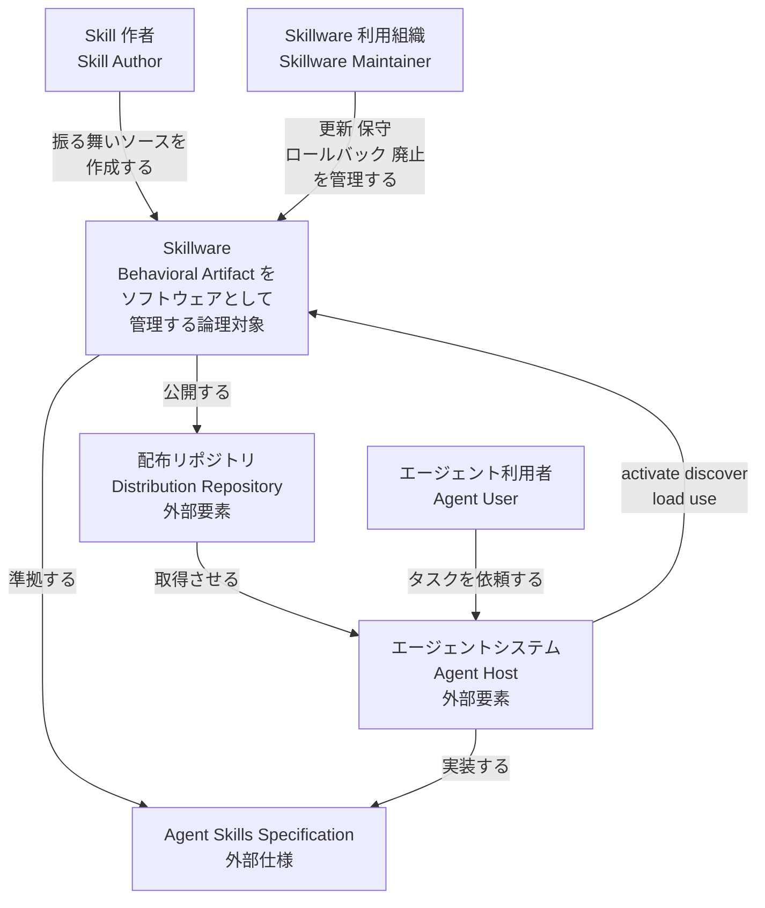
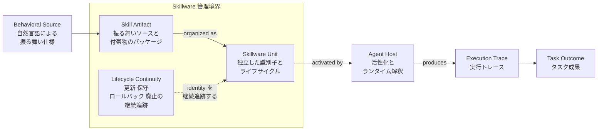
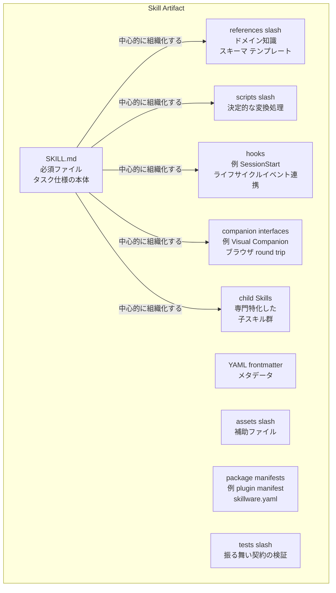
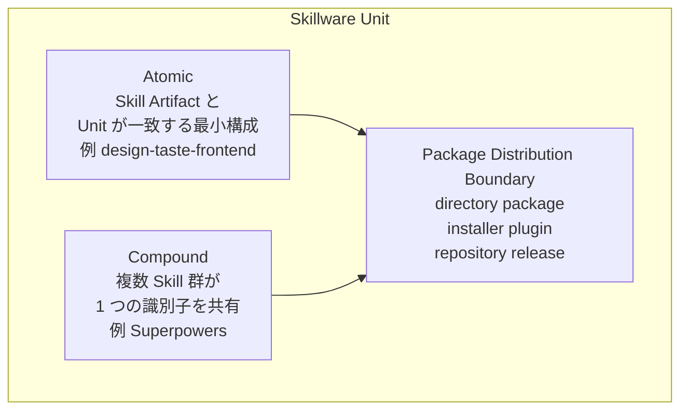
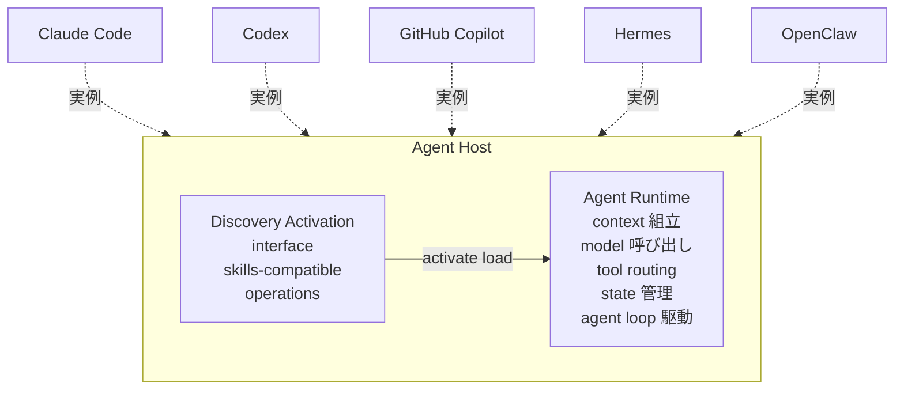
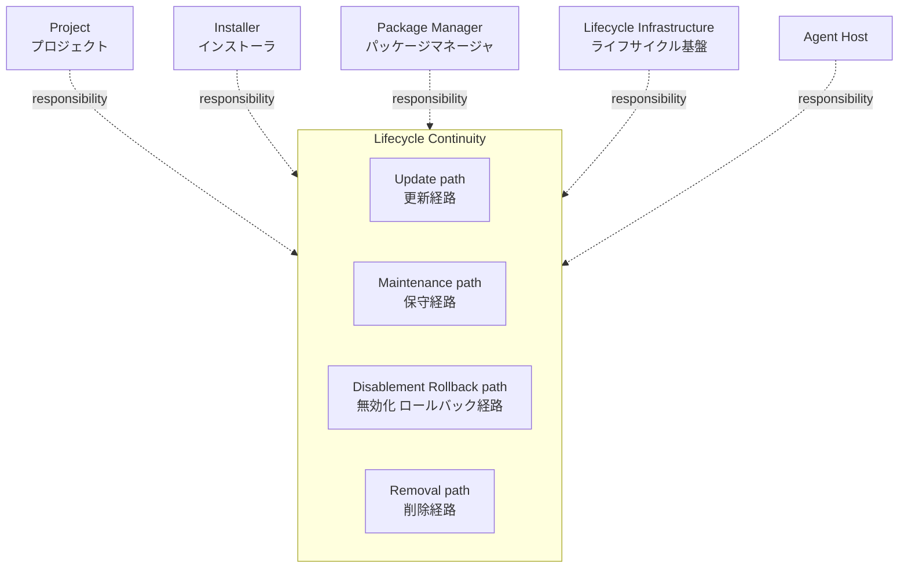
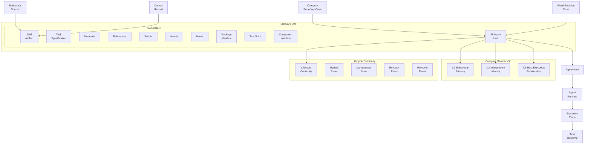
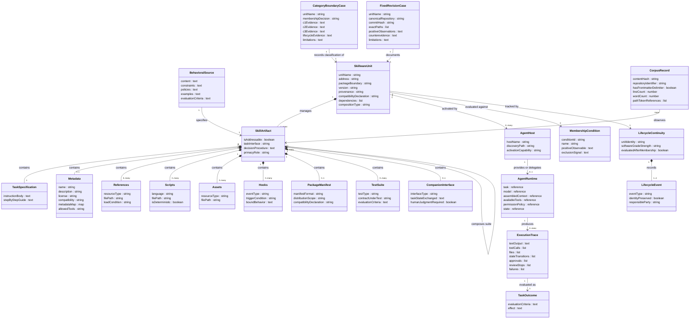
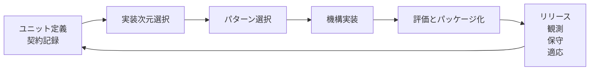

arXiv 論文「Skillware: A Software Ontology and Engineering Lifecycle for Persistent Behavioral Artifacts」(arXiv:2607.18970、2026-07-21 投稿) を調査しました。この論文は、AI エージェントの Agent Skills を独立したソフトウェア資産 (Skillware) として扱うオントロジーと、エンジニアリングライフサイクルを提案します。本記事では、論文が定義する構造・データモデルと、companion リポジトリに基づく導入・利用・運用の要点を整理します。

> 注記: 論文が引用する研究成果物リポジトリ `github.com/MetaInFLow/skillware` は調査時点 (2026-07-23) で 404 (非公開) です。公開されているのは companion repo `MetaInFLow/skillware-patterns` (デザインパターン転移の実行可能サプリメント、Apache-2.0) のみで、本レポートのリポジトリ由来の記述はすべて後者の実ファイルに基づきます。


## 概要

### 論文の目的

Agent Skills は、`SKILL.md` を中心とするディレクトリ形式の再利用可能なタスク定義です。Claude Code、Codex、GitHub Copilot、Hermes、OpenClaw など、複数の独立したエージェントシステムが対応します。Agent Skills は、すでにシステム横断で永続する振る舞いの成果物になっています。


この論文は、その現状に対して次のギャップを指摘します。

- Skill の仕様策定・実行・保守・進化を説明する研究は既に存在する
- 既存研究が扱う単位は Skill の個別側面にとどまり、独立したソフトウェアオブジェクトとして定義するオントロジーは本論文が新たに提示する

論文はこのギャップを埋めるため、Skillware というソフトウェア抽象 (オントロジー) とエンジニアリングライフサイクルを提案します。著者は Skillware という語自体の造語性や命名の先取権は主張せず、複数プロジェクト横断で運用可能な定義と評価プロトコルを提供することを貢献としています。

### リサーチクエスチョン

| # | 内容 |
|---|---|
| RQ1 | Skillware とは何か。隣接する AI ネイティブな成果物・システムと区別する運用可能な条件は何か |
| RQ2 | 提案した定義は、Agent Skills エコシステムにおける肯定例・否定例・境界例を分類できるか |

### 3 つの貢献

| 貢献 | 内容 |
|---|---|
| Skillware Ontology | Behavioral Source・Skill Artifact・Skillware Unit・Agent Host・Agent Runtime・situated performance・task outcome を結ぶソフトウェア抽象 |
| Skillware Engineering Lifecycle | 振る舞い成果物が管理されたソフトウェア単位のまま工学的構造を獲得していく初期ワークフロー |
| Identity-Preserving Evolution | 人間の変更・エージェントによる変更提案・デプロイ実績エビデンスが、ソフトウェア識別子 (identity) を失わずに新バージョンを生む変更の捉え方 |

### 主要概念

論文は Skill を中心にした責務の連鎖として、次の 4 つの分析対象を分離します。

| 概念 | 定義 | 備考 |
|---|---|---|
| Skill Artifact | 再利用可能なタスク行動を specify する成果物。自然言語による振る舞いソースを主とし、コードやリソースで補強される | 「何を行うか」を specify する層 |
| Skillware Unit | Skill Artifact (または一貫した Skill スイート) をソフトウェアとして管理する、独立したソフトウェア識別子 (identity)。名前・アドレス・パッケージ境界・互換性・依存関係・バージョン・provenance が付随する | 「どのようにソフトウェアオブジェクトになるか」を扱う層。Atomic 実装では Skill Artifact と一致し、Superpowers のような複合実装では複数 Skill・hooks・adapter・tests・companion が 1 つの identity を共有する |
| Agent Host | Skillware Unit を discover/受け取り、activate し、管理するユーザー向けエージェントアプリケーションの分析的役割。Codex・Claude Code・GitHub Copilot・Hermes・OpenClaw が例。MCP の Host や Microsoft AHP の Agent Host とは別概念と明記 | 「どのアプリケーションが activate するか」を扱う層 |
| Agent Runtime | Host が提供または委譲する実行機構。context 組立・モデル呼び出し・tool routing・状態管理・agent loop を担う | 「どの実行機構が解釈するか」を扱う層。Skillware Unit の identity とは別に扱われる |

責務の連鎖は次の通りです。

```text
Behavioral Source → Skill Artifact → Skillware Unit
  → (activated by) Agent Host → (interpreted by) Agent Runtime
  → Execution Trace → Task Outcome
```

#### Lifecycle Continuity (ソフトウェア級の属性)

Lifecycle Continuity は、同一の Skillware Unit の identity が「更新・保守・無効化またはロールバック・削除」を通じて維持されるかどうかを記録する、カテゴリ所属とは別のソフトウェア級の属性です。責任はプロジェクト・インストーラ・パッケージマネージャ・ライフサイクル基盤・Agent Host の間で分散しうるとされます。

#### カテゴリ所属を判定する 3 必要条件

論文はカテゴリ所属 (Skillware かどうか) を監査可能にするため、3 つの必要条件 (すべてが同一の Skillware Unit を指す必要がある) を定めます。

| 条件 | 名称 | 内容 | 肯定的な観測 | 除外シグナルの例 |
|---|---|---|---|---|
| C1 | Skill-centered behavioral primacy (振る舞いの主位性) | 1 つの Skill または一貫した Skill スイートが、再利用可能なタスク行動を担い組織化している | Skill ソースがタスクの契約・支援成果物を組織化している | Skill の内容がツール・索引・アプリケーションに付随するだけ |
| C2 | Independent software identity (独立したソフトウェア識別子) | 候補ユニットが Agent Host から独立して取得・インストール・追跡可能なソフトウェア識別子を持つ | ディレクトリ・パッケージ・インストーラ・プラグイン・リポジトリリリースとして名前・アドレス・バージョン・互換性・provenance が観測できる | 指示がセッション限定、または内包するシステムと不可分 |
| C3 | Agent Host execution relationship (Agent Host との実行関係) | 少なくとも 1 つの識別済み互換 Agent Host が、skills-compatible な操作でユニットを discover/受け取り・activate・load・使用できる | Codex・Claude Code・GitHub Copilot・Hermes・OpenClaw 等での文書化または再現済みの経路 | 成果物がドキュメントやカタログ内容にとどまる |

C1〜C3 を満たしたうえで、Lifecycle Continuity (LC) がソフトウェア級管理の強度として別枠で評価されます。カテゴリ所属自体の判定基準は C1〜C3 のみです。品質・セキュリティ・有用性・人気・実装の複雑さ・ライフサイクル成熟度は、判定基準の対象外です。

### 従来の見方との比較

論文は Skillware を、Skill を単なる「プロンプト文書」「設定ファイル」として扱う従来の見方から区別します。関連概念との境界は次の表の通りです (論文 Table 1 を基に整理)。

| 概念 | 従来の主な捉え方 | Skillware との関係 | 境界の含意 |
|---|---|---|---|
| Prompt (プロンプト文書としての Skill) | モデル入力・条件付けのためのコンテンツ | Skill や実行コンテキストの内部に含まれうる | 永続性のみでは behavioral primacy・unit identity・Host execution の要件充足に不十分 |
| Agent Skill | アドレス可能なタスク行動モジュール | Skillware の現在の主要な Behavioral Artifact | 1 Skill が unit を構成することも、一貫した suite が 1 unit を共有することもある |
| Tool / MCP server | 呼び出し可能な操作・プロトコル機能 | Skill 実行時に利用される操作を供給 | Tool が主位性を持つ場合、そのユニットは capability 層に分類される |
| Workflow | 作業の順序付け・調整 | 1 Skill で符号化されることも、複数 Skill にまたがって構成されることもある | Workflow は制御フローを記述し、Skillware は管理されたソフトウェア単位を記述する |
| Plugin (設定・配布パッケージとしての Skill) | パッケージング・統合の外殻 | Skill・hooks・MCP 設定・アセット・manifest を内包しうる | Skill が再利用可能なタスク行動を組織化している場合に限り、Plugin にパッケージされた Skillware として該当する |
| Agent Host | Skillware を activate し実行を提供/委譲するユーザー向けアプリケーションの役割 | Codex・Claude Code・GitHub Copilot・Hermes・OpenClaw がこの役割を担いうる | Host の identity は取得された Skillware Unit と別に保たれる |
| Agent Runtime | context 組立・モデル呼び出し・tool routing・状態・agent loop 実行 | Host 環境内で activate された Skillware を解釈する | Runtime の設定が situated performance を左右する |

要点は次の通りです。

- Skill を「プロンプト文書」として見る従来の扱いは、独立したソフトウェア識別子と Agent Host 実行関係の充足があって初めてカテゴリに含まれます
- Skill を「設定」として見る従来の扱い (Plugin 内の付随的な設定など) は、Skill が主位の振る舞いを組織化して初めてカテゴリに含まれます
- カテゴリ境界は関係的 (relational) です。分類の根拠は C1〜C3 の収束であり、ディレクトリ名やファイル数は参考情報にとどまります

### 学術系譜

#### 依拠する仕様

論文は Agent Skills specification (必須の `SKILL.md`、YAML メタデータ、Markdown 命令、任意の `scripts/`・`references/`・`assets/` を持つディレクトリを定義) を出発点として使い、"skills-compatible agent" という既存用語をそのまま引き継いでいます。

#### 収斂する既存研究との関係

論文は既存研究を「分析単位 (unit of analysis)」ごとに整理し、Skillware がそれらを横断する共有ソフトウェア抽象を提供すると位置づけます。

| 研究領域 | 代表研究 | 規模・知見 | Skillware との関係 |
|---|---|---|---|
| 仕様・サーベイ | Agent Skills specification 等 | Skill ディレクトリ・`SKILL.md`・progressive disclosure・取得・セキュリティを主対象 | Skillware の artifact envelope の出発点 |
| ランタイム研究 | Chen et al. (Skill OS 提案) | 97,755 件の Skill を分析し、キャッシュ・環境構築・グローバル管理・失敗処理・セキュリティを実行時要件として特定 | アプリケーション層・ランタイム層の直近の先行研究と位置づけ |
| キュレーション研究 | Ouyang et al. (SkillOS、curator/executor 分離) | 経験駆動で外部 SkillRepo を更新する学習済みキュレーションポリシー | Skill が経験駆動の変更を受ける永続的な外部成果物であることの証拠として採用 |
| リポジトリ研究 | Gao et al. | registry Skill 18,463 件・personal-use Skill 23,199 件 (GitHub リポジトリ 5,876 件由来)、reuse リンク 3,709 件 | コピーされた成果物・ローカルバインディング・追加的な保守・比較的安定した振る舞い契約を、ソフトウェアエンジニアリング上の圧力の直接的証拠として採用 |
| 品質研究 | Hong et al. | 238 件の Skill を分析し、検出された smell の広範な存在を報告 | Skill 作成が既に測定可能な品質問題を示すことの証拠 |
| 検証・ガバナンス研究 | Metere (検証可能な成果物としての Skill)、FederatedSkill (意味論的差分の集約)、SkillFab (要求〜Git 証跡〜レビュー〜公開〜復旧の一気通貫) | 定性的知見のみ (件数指標なし) | バージョン管理・レビュー可能な Skill 生産の具体的先例として吸収 |
| ソフトウェア工学の基礎 | モジュール境界、コンポーネント理論、ISO/IEC/IEEE 12207 ライフサイクル標準、ソフトウェア進化論、デザインパターン (GoF、POSA、DDD) | 定性的な理論的基盤 (件数指標なし) | Skillware が接続する既存の工学的基盤 |

論文の位置づけは、これら既存研究が「Skill をアプリケーション」「エンジニアリングされた成果物」「検証可能な成果物」「進化するリポジトリオブジェクト」として個別に記述しているのに対し、それらを 1 つの宣言された分析単位 (Skillware Unit) のもとに統合する点にあるとしています。方法論上の違いも明確です。既存研究は測定 (コーパス統計・smell 検出・reuse リンク解析) を主とするのに対し、本論文はカテゴリ判定基準 (C1〜C3 の必要条件 + 反証・限界の記録を伴うレビュープロトコル) の定義を主とし、測定研究の成果を「条件ごとのエビデンス」として吸収する構図です (Table 3)。

### エビデンスの規模

論文は 4 層のエビデンス設計 (仕様・凍結メタデータコーパス・固定リビジョンケースレビュー・独立実証研究) を用います。数値は以下の通りです。


| エビデンス | 規模・内訳 |
|---|---|
| SkillMD-138K コーパス (コンテンツ重複除去後) | **138,133 件**の `SKILL.md` レコード、**20,556 件**のリポジトリ識別子に紐づく |
| フロントマター区切りの出現率 | 136,380 ファイル (コーパスの **98.73%**) |
| 支援パス (`references/`・`scripts/`・`assets/`) への明示参照 | 32,069 ファイル (約 **23.2%**)、パストークンはコーパス全体で延べ **236,421 件** |
| ドキュメント長 (中央値 / 90 パーセンタイル) | 169 行・687 語 / 517 行・1,971 語 |
| カテゴリ境界レビュー | **15 件**の宣言ユニット (**12 件**の包含例 + **3 件**の意図的な否定例)、C1〜C3 + Lifecycle Continuity を個別報告 |
| 技術レビュー (固定リビジョン実装ケース) | **13 件**: Superpowers, gstack, ECC, last30days, scientific-schematics, financial-analysis, dot-skill, ui-ux-pro-max, Caveman, design-taste-frontend, darwin-skill, SkillOpt-Sleep, OpenMontage |

- SkillMD-138K のスナップショットはリビジョン `0d73048abf2fb6ee91f6f9f5ac598d5be8d6bdd7` に固定され、Parquet オブジェクトの SHA-256 も論文中に記載されています
- 技術レビューの各ケースは、canonical なリポジトリ・40 文字コミットハッシュ・厳密なパス・肯定的観測・反証・限界を記録しています
- コーパス評価が支持するのは「構造化メタデータの慣行が支配的である」という一点に限られます。frontmatter フィールドの妥当性や、システム横断で同一の activation semantics を持つことの検証は範囲外である、と論文自身が明記しています

## 特徴

- Skill を「独立したソフトウェア資産」として扱うオントロジーを、既存の「プロンプト」「設定」という捉え方から明確に切り離す
- カテゴリ所属を C1〜C3 の 3 必要条件のみで判定し、品質・人気・実装の複雑さは判定基準の対象外とする
- Lifecycle Continuity を、カテゴリ所属とは独立したソフトウェア級の属性として個別に評価する
- Behavioral Source → Skill Artifact → Skillware Unit → Agent Host → Agent Runtime → Execution Trace → Task Outcome という責務の連鎖で、成果物の identity・activation・実行・観測結果を明確に分離する
- Skillware という語自体の造語性・命名の先取権を主張せず、既存パッケージ名としての先行使用も認めたうえで、横断的な運用定義を貢献として位置づける
- Agent Skills specification、138,133 件規模の凍結コーパス、独立した実証研究、15 件の境界ケース、13 件の固定リビジョン実装という 4 層のエビデンスで論証を構成する
- 「Skillware は新興 (emerging) である」という限定を明示する。エビデンスが支持する範囲は成果物の存在・構造的反復・工学的圧力に限られ、高品質 Skillware の母集団推定や普遍的採用の主張はスコープ外と位置づける
- 論文が引用する artifact repo (`github.com/MetaInFLow/skillware`) は調査時点で **404 (非公開)** 。実在し参照可能なのは companion repo である `github.com/MetaInFLow/skillware-patterns` のみで、これはデザインパターン転移の実行可能な補足リポジトリ。オントロジーそのものの検証や生態系での普及度の裏付けは範囲外である、と README 自身が明記している

## 構造

Skillware は実装標準ではなく、Agent Skills を独立したソフトウェア資産として扱うための**オントロジー (論理構造)** です。このセクションでは、C4 model の 3 段階 (システムコンテキスト / コンテナ / コンポーネント) を、論文が提示する論理構造の読み替えとして使います。

- システムコンテキスト図: 誰が Skillware を作り、誰が管理し、誰が使うか
- コンテナ図: Skillware オントロジーを構成する 4 つの主要概念
- コンポーネント図: 各概念の内部構造 (実在ファイル名・実在 Host 例を含む)


### システムコンテキスト図

論文 §2.1・§3.2 が定義するアクターと外部要素を示します。中心の「Skillware」は、論文が対象とする論理的分類対象 (Behavioral Artifact を管理するソフトウェア資産としての Skillware Unit) です。



#### 要素の説明

| 要素名 | 説明 |
|---|---|
| Skill Author (Skill 作者) | 自然言語による振る舞い仕様 (Behavioral Source) を作成し、Skill Artifact として公開する役割 |
| Skillware Maintainer (Skillware 利用組織) | 発行済み Skillware Unit の更新・保守・ロールバック・廃止を管理する役割。論文の直接の用語ではなく、Lifecycle Continuity の responsible party 群 (project / installer / package manager / lifecycle infrastructure / Agent Host、§3.3) を本レポートが 1 アクターに合成した表現 |
| Agent User (エージェント利用者) | Agent Host にタスクを依頼し、活性化された Skillware の振る舞いを利用する役割 |
| Skillware | 本論文が定義する論理的分類対象。Behavioral Artifact を独立したソフトウェア資産として扱うオントロジー全体を指す |
| Agent Host (外部要素) | Skillware Unit を discover / receive し、activate / load / use する、ユーザー向けエージェントアプリケーションの役割。論文は Codex・Claude Code・GitHub Copilot・Hermes・OpenClaw を実例として挙げる |
| Distribution Repository (配布リポジトリ、外部要素) | Skillware Unit を保管・配布する外部の場。ディレクトリ、パッケージ、インストーラ、プラグイン、リポジトリリリースなど。論文は具体的な製品名を規定しない |
| Agent Skills Specification (外部仕様) | SKILL.md のディレクトリ構造・フロントマター・progressive disclosure を定義する外部標準仕様 |

補足:

- 論文は Agent Host を「Skillware Unit を活性化し、実行を提供または委譲する役割」と定義します。MCP の Host や Microsoft AHP の Agent Host とは別概念だと明記しています (§2.1)
- Distribution Repository は論文中で名指しされる単一システムではなく、「a directory, package, installer, plugin, or repository release」の総称です (C2 の記述、§3.3)

### コンテナ図

論文 §3.2〜§3.3 の主要構成要素をドリルダウンします。Skillware の論理構造は次の 4 要素からなります。

- Skill Artifact
- Skillware Unit
- Agent Host (activation + runtime interpretation)
- Lifecycle Continuity

これらは論文 §3.2 のオントロジー連鎖 (Behavioral Source → Skill Artifact → Skillware Unit → activated by Agent Host → interpreted by Agent Runtime → Execution Trace → Task Outcome) の中に位置づきます。連鎖の起点と終点 (Behavioral Source、Execution Trace、Task Outcome) も併記し、4 要素がこの連鎖のどこを担うかを示します。



#### 要素の説明

| 要素名 | 説明 |
|---|---|
| Behavioral Source (振る舞いソース) | 永続的な自然言語による指示・制約・方針・例・評価基準。Skill Artifact の再利用可能なタスク契約を運ぶ (§3.1) |
| Skill Artifact | 再利用可能なタスク振る舞いを specify するアドレス可能な artifact。natural-language task specification に加え、metadata と任意の references / scripts / assets / hooks / package manifests / tests / companion interfaces を含む envelope (Abstract, §3.2) |
| Skillware Unit | Skill Artifact を「ソフトウェアとして」管理する、独立して管理されたソフトウェア識別子。name、address、package boundary、compatibility、dependencies、version、provenance が付随する (§3.2) |
| Agent Host (activation + runtime interpretation) | Skillware Unit を discover/receive し activate する役割 (Agent Host) と、model・context・tools・permissions・state を用いて実際に解釈・実行する役割 (Agent Runtime) を合わせたコンテナ。論文は Host と Runtime を別役割と定義しつつ、Runtime は Host が provide または delegate するとする (§2.1, §3.4) |
| Lifecycle Continuity | update・maintenance・disablement/rollback・removal を通じて同一 Unit identity が保たれるかを記録する、software-grade な追加特性。C1〜C3 とは別枠で評価される (§3.3) |
| Execution Trace (実行トレース) | 特定のタスク・モデル・コンテキスト・ツール集合・権限方針・状態のもとで生じた situated performance の記録 (§3.2, Equation 1) |
| Task Outcome (タスク成果) | 実行トレースをタスク評価基準に照らして評価した効果・結果 (§3.2) |

#### 3 必要条件のコンテナへの位置づけ

論文 §3.3 の C1〜C3 は、いずれか単独ではなく「同じ Skillware Unit」に同時に成立している必要があります (must all point to the same Skillware Unit)。

| 条件 | 内容 | 位置づくコンテナ |
|---|---|---|
| C1: Skill-centered behavioral primacy (振る舞いの主位性) | 1 つの Skill または一貫した Skill suite が再利用可能なタスク振る舞いを運び組織化している | Skill Artifact |
| C2: Independent software identity (独立したソフトウェア識別子) | 候補ユニットが Agent Host から独立して取得・インストール・追跡可能なアドレス可能な識別子を持つ | Skillware Unit |
| C3: Agent Host execution relationship (Agent Host 実行関係) | 少なくとも 1 つの互換 Agent Host が discover/receive・activate・load・use できる | Agent Host |
| Lifecycle Continuity (参考、必要条件ではない) | C1〜C3 成立後に評価される software-grade な追加特性 | Lifecycle Continuity |

### コンポーネント図

4 つのコンテナを、論文 §3.2・§3.3・§3.4 の記述と companion repo (skillware-patterns) の実在ファイルに基づいてドリルダウンします。

#### Skill Artifact のコンポーネント

論文 Abstract の記述 (natural-language task specification + metadata + optional references/scripts/assets/hooks/package manifests/tests/companion interfaces) をそのまま構成要素として展開します。実在ファイル名は Agent Skills specification と companion repo の sample 群の例です。



##### 要素の説明

| 要素名 | 説明 |
|---|---|
| SKILL.md | 必須ファイル。YAML frontmatter と Markdown 本文からなり、natural-language behavioral source を運ぶ中心コンポーネント (Agent Skills specification) |
| YAML frontmatter | 発見・互換性のためのメタデータ。論文の corpus 分析では 138,133 件中 136,380 件 (98.73%) に出現 (§4.2) |
| references/ | ドメイン知識・スキーマ・テンプレート・例を供給する参照資料 |
| scripts/ | 正確な変換を担う決定的な実行コード (Deterministic Kernel の実装先、§5.4) |
| assets/ | その他の補助ファイル |
| hooks | ライフサイクルイベントに振る舞いを結びつける機構。例: Superpowers の SessionStart hook (§5.3.4) |
| package manifests | 配布境界を定義するマニフェスト。companion repo では sample ごとに skillware.yaml という命名例がある |
| tests/ | 振る舞い契約を保護する検証コード |
| companion interfaces | 実行中タスクと状態をやり取りする外部インターフェース。例: Superpowers の Visual Companion (ブラウザ round trip、§4.4) |
| child Skills | 親 Skill が選択・呼び出す専門特化した子スキル。coherent suite を成す (§3.2) |

補足: 論文は「natural-language behavioral source remains primary because it organizes how these elements participate in the task」と明記します (§3.2)。図の矢印は SKILL.md が他コンポーネントを組織化する関係 (C1 の判定基準) を表します。

#### Skillware Unit のコンポーネント

Skillware Unit は Skill Artifact を「ソフトウェアとして」管理する識別子です。論文 §3.2・§3.3・§5.2 の記述から、実装の粒度は Atomic (最小構成) と Compound (複合構成) の 2 通りに分かれます。



##### 要素の説明

| 要素名 | 説明 |
|---|---|
| Atomic | Skill Artifact と Skillware Unit が一致する最小構成プロファイル。論文の実装次元の唯一の排他的ベースライン。例: design-taste-frontend (§5.2, Table 4) |
| Compound | 複数の specialist Skill、hooks、adapters、tests、companion が 1 つの package-level identity を共有する構成。例: Superpowers (§3.2, §4.4) |
| Package / Distribution Boundary | name、address、version、compatibility、provenance を観測可能にする directory・package・installer・plugin・repository release のいずれか (C2 の positive observable、Table 2) |

#### Agent Host のコンポーネント

Agent Host は「activation」の役割を、Agent Runtime は「runtime interpretation」の役割を担います。論文はこの 2 役割を明確に区別しつつ、Runtime は Host が provide または delegate すると位置づけます (§2.1, §3.4)。



##### 要素の説明

| 要素名 | 説明 |
|---|---|
| Discovery / Activation interface | Skillware Unit を discover/receive し、activate/load/use する skills-compatible な操作。progressive disclosure (catalog metadata → 完全な instruction file → 補助資源) に従う (§2.1) |
| Agent Runtime | Host が提供または委譲する実行機構。model、assembled context、tools、permission policy、state を用いて agent loop を駆動し Execution Trace を生成する (Equation 1、§3.4) |
| Claude Code / Codex / GitHub Copilot / Hermes / OpenClaw | 論文が C3 の実例として挙げる互換 Agent Host。いずれか 1 つで確認された経路があれば C3 は成立する (§3.3) |

補足: 論文はこの Agent Host の用法が MCP の protocol-specific Host や Microsoft AHP の Agent Host process とは別概念であると明記しています (§2.1)。

#### Lifecycle Continuity のコンポーネント

C1〜C3 が成立した後に評価される、software-grade な追加特性です (§3.3)。責任は単一の主体に閉じず、複数の主体に分散し得ます。



##### 要素の説明

| 要素名 | 説明 |
|---|---|
| Update path | 同一 Unit identity を保ったままの更新経路 |
| Maintenance path | 同一 Unit identity を保ったままの保守経路 |
| Disablement / Rollback path | 同一 Unit identity を保ったままの無効化・ロールバック経路 |
| Removal path | 同一 Unit identity を保ったままの削除経路 |
| Project / Installer / Package Manager / Lifecycle Infrastructure / Agent Host | Lifecycle Continuity の責任が分散し得る主体群 (§3.3 の定義文言そのまま) |

補足 (論文の評価結果、§4.4): 13 件の fixed-revision 実装レビューでは Lifecycle Continuity のカバレッジは不均一 (uneven) であり、「Adaptation-Enabled」を完全に満たす事例は 1 件も無かったと明記されています。この特性は構造として存在しても、実装の成熟度は個別に評価が必要です。

## データ

Skillware ontology が定義するエンティティを、概念モデルと情報モデルの 2 段階で整理します。概念モデルはエンティティ間の所有関係と利用関係だけを示します。情報モデルは各エンティティの主要な属性を示します。

### 概念モデル

Skillware Unit は Skill Artifact (または一貫した Skill suite) を所有します。Skill Artifact は 9 種類の artifact envelope 構成要素を所有します。Skillware Unit は Agent Host によって活性化され、Agent Runtime が解釈し、Execution Trace を経て Task Outcome に至ります。Skillware Unit は category membership の 3 条件 (C1-C3) で判定され、Lifecycle Continuity で追跡されます。Corpus Record・Category Boundary Case・Fixed Revision Case はいずれも論文のエビデンス層に属し、Skill Artifact や Skillware Unit を対象に観測・分類・実装記録を行います。



#### 要素の説明

| 要素名 | 説明 |
|---|---|
| Behavioral Source | 永続的な自然言語による指示・制約・方針・例・評価基準です。Skill Artifact が持つ再利用可能なタスク契約の源泉です |
| Skillware Unit | Skill Artifact または一貫した Skill suite を、独立した名前・アドレス・バージョン・来歴を持つソフトウェアとして管理する識別単位です |
| Skill Artifact | 再利用可能なタスク行動を specify するアドレス可能な artifact です。Behavioral Artifact の現行の主要形態です |
| Task Specification | Skill Artifact の主要構成要素です。タスクインターフェース・意思決定手順・制約を自然言語で記述します |
| Metadata | discoverability と compatibility を支える frontmatter 相当の構成要素です |
| References | ドメイン知識・スキーマ・テンプレート・例を供給する構成要素です |
| Scripts | 決定論的な変換処理を実装する構成要素です |
| Assets | テンプレートや画像などの静的リソースです |
| Hooks | ライフサイクルイベントに振る舞いを結び付ける構成要素です |
| Package Manifest | 配布境界を定義する plugin manifest 相当の構成要素です |
| Test Suite | 振る舞い契約を保護するテストや評価です |
| Companion Interface | 実行中タスクとの間で状態や人間の判断を外部化するインターフェースです |
| Agent Host | Skillware Unit を発見または受領し、活性化し、Agent Runtime を提供または委譲するユーザー向けアプリケーションの役割です |
| Agent Runtime | タスク・モデル・コンテキスト・ツール・権限方針・状態を用いて活性化済みの behavioral source を解釈する実行機構です |
| Execution Trace | 1 回の situated な実行を記録した観測結果です |
| Task Outcome | 実行トレースをタスク評価基準に照らして評価した効果です |
| C1 Behavioral Primacy | 1 つの Skill または一貫した Skill suite が再利用可能なタスク行動を organize しているかを判定する条件です |
| C2 Independent Identity | 候補ユニットが Agent Host から独立してアドレス可能なソフトウェア識別を持つかを判定する条件です |
| C3 Host Execution Relationship | 少なくとも 1 つの互換 Agent Host がユニットを発見・活性化・読み込み・使用できるかを判定する条件です |
| Lifecycle Continuity | C1-C3 判定後に評価される、update・maintenance・rollback・removal を通じて同一ユニット識別が維持されるかを示す software-grade な性質です |
| Update Event | 同一ユニット識別を保ったまま実施される更新イベントです |
| Maintenance Event | 同一ユニット識別を保ったまま実施される保守イベントです |
| Rollback Event | 無効化またはロールバックのイベントです |
| Removal Event | 同一ユニット識別に対する削除イベントです |
| Corpus Record | SkillMD-138K に含まれる SKILL.md 1 件分のメタデータ観測記録です |
| Category Boundary Case | 15 件の宣言済みユニットを C1-C3 に照らして審査した、12 件の inclusion と 3 件の deliberate negative からなる境界事例です |
| Fixed Revision Case | 13 件の固定リビジョン実装ユニットについて、正典リポジトリ・commit・positive observation・counterevidence を記録した技術事例です |

### 情報モデル

論文本文 (§3.1〜§3.4、§4.1〜§4.2、Table 2) に明示された属性を中心に構成しました。出典の粒度は次の通りです。

- SkillwareUnit の属性 (name / address / package boundary / compatibility / dependencies / version / provenance) は §3.2 の定義文、AgentRuntime の属性は Equation 1 の変数 (τ, M, C, T, P, σ)、ExecutionTrace の属性は §3.4 のトレース内容列挙、CorpusRecord は §4.2 の測定項目、CategoryBoundaryCase / FixedRevisionCase は §4.1 のレビュー記録項目に、それぞれ基づきます
- Metadata クラスの frontmatter 項目 (name / description / license / compatibility / metadataMap / allowedTools) のみ、論文に明示がないため Agent Skills 仕様 (agentskills.io) から補完しています
- References / Scripts / Hooks / Package Manifest / Test Suite / Companion Interface の各属性は、論文 §3.2 の説明文からの推測です



#### 要素の説明

| 要素名 | 説明 |
|---|---|
| BehavioralSource | Skill Artifact に先立つ自然言語ソースです。持続的な指示・制約・方針・例・評価基準を保持します |
| SkillArtifact | 再利用可能なタスク行動を specify する主体です。isAddressable は Behavioral Artifact の operational な定義 (アドレス可能性) を表します |
| TaskSpecification | SKILL.md 本文にあたる必須構成要素です。タスクインターフェースと意思決定手順を記述します |
| Metadata | frontmatter に相当します。属性は Agent Skills 仕様 (agentskills.io) から補完しました |
| References | 参照ドキュメントです。loadCondition は progressive disclosure による遅延ロード条件を表します |
| Scripts | 決定論的カーネルを実装する実行可能コードです |
| Assets | テンプレートや画像などの静的リソースです |
| Hooks | ライフサイクルイベントに振る舞いを結合します。ECC の hooks や Superpowers の SessionStart が該当します |
| PackageManifest | プラグイン配布境界を定義する manifest です |
| TestSuite | 振る舞い契約を保護するテストと評価基準です |
| CompanionInterface | ブラウザ companion など、タスク状態と人間の判断を externalize するインターフェースです |
| SkillwareUnit | 独立管理されるソフトウェア識別単位です。compositionType は Atomic (Skill Artifact 1 件) か Compound (suite として複数件) かを表します |
| AgentHost | Skillware Unit を発見・活性化するユーザー向けアプリケーションの役割です。Codex・Claude Code・GitHub Copilot・Hermes・OpenClaw が例です |
| AgentRuntime | 実行意味論 π = R_H(S, τ, M, C, T, P, σ) の各変数 (タスク・モデル・コンテキスト・ツール・権限方針・状態) を保持します |
| ExecutionTrace | 1 回の situated な実行の観測記録です。テキスト・ツール呼び出し・ファイル・状態遷移・承認・レビュー停止・失敗を含みます |
| TaskOutcome | 実行トレースをタスク評価基準に照らして評価した効果です |
| MembershipCondition | C1-C3 の各条件です。conditionId で C1/C2/C3 を区別します。positiveObservable と exclusionSignal は Table 2 に基づきます |
| LifecycleContinuity | C1-C3 判定後に評価される software-grade な性質です。softwareGradeStrength はレビュー対象ユニット間で強さが異なることを表します |
| LifecycleEvent | update・maintenance・disablement or rollback・removal の 4 種類です。responsibleParty はプロジェクト・installer・パッケージマネージャ・lifecycle infrastructure・Agent Host に分散し得ます |
| CorpusRecord | SkillMD-138K の 1 レコードです。138,133 件が content-hash で重複排除され、20,556 件のリポジトリ識別子に紐づきます |
| CategoryBoundaryCase | 15 件 (inclusion 12 件、deliberate negative 3 件) の境界事例です |
| FixedRevisionCase | 13 件の固定リビジョン技術事例です。Superpowers・gstack・ECC・last30days・scientific-schematics・financial-analysis・dot-skill・ui-ux-pro-max・Caveman・design-taste-frontend・darwin-skill・SkillOpt-Sleep・OpenMontage が該当します |

## 構築方法

このセクションは Pattern B (論文・方法論の調査) の読み替えです。「構築方法」は companion repo `skillware-patterns` の導入手順と、自組織 Skill を Skillware Unit として登録する最小構成 (実装案) を扱います。Execution Trace 以降の実行・評価は「■運用」の範囲です。

### companion repo (skillware-patterns) の入手と検証

`skillware-patterns` は論文 §5.3 の design pattern transfer 主張を検証可能にする実行可能サプリメントです。Python 3.10 以上が前提です。

1. リポジトリを取得します。

```bash
git clone https://github.com/MetaInFLow/skillware-patterns.git
cd skillware-patterns
```

- 論文本文と紐づくリリース候補には `v0.1-paper-v1` タグが打たれています (実在確認済み)。論文と同じ版を見たい場合はチェックアウトします。

```bash
git checkout v0.1-paper-v1
```

2. 隔離環境を作り、依存 (PyYAML) を含めて editable install します。

```bash
python3 -m venv .venv
source .venv/bin/activate
python -m pip install -e .
```

3. サンプル実行・フォーカステスト・全体テスト・整合性バリデータを順に走らせます。

```bash
python3 patterns/facade/sample/scripts/run_demo.py
python3 -m unittest discover -s patterns/facade/sample/tests -v
python3 -m unittest tests/test_docs.py -v
python3 -m unittest discover -s tests -v
python3 scripts/validate_repository.py
```

`.github/workflows/validate.yml` は push / pull_request のたびにこれと同じ検証を CI で回します。実ファイルを確認した内容は次のとおりです。

| ジョブ | 内容 |
| --- | --- |
| `test` (Python 3.10 / 3.12 マトリクス) | `pip install -e .` → `python -m unittest discover -v` → `python scripts/validate_repository.py` |
| `cff` | `cffconvert-github-action` で `CITATION.cff` を CFF 1.2.0 スキーマに対して検証 |

`scripts/validate_repository.py` (803 行) が実際にチェックしている項目は次のとおりです (コード確認済み)。

- `catalog/gof-23-screening.yaml` が 23 行、`catalog/pattern-index.yaml` が 12 行であること。各行の `id` が小文字スラグで重複しないこと
- `pattern-index.yaml` の各行が `id / name / name_zh / source_tradition / source_category / paper_role / implementation_status / scenario / scenario_zh` の 9 フィールドちょうどを持つこと。`source_tradition` は `gang-of-four` / `pattern-oriented-software-architecture` / `domain-driven-design` のいずれかであること
- 各 `patterns/<name>/` ディレクトリに `README.md, pattern.yaml, definition.md, definition.zh-CN.md, participant-map.yaml, correspondence.md, sample/SKILL.md, sample/README.md, sample/README.zh-CN.md, sample/skillware.yaml, sample/scripts/run_demo.py, sample/tests/test_demo.py, misuse/SKILL.md, misuse/explanation.md` が揃っていること (`REQUIRED_RECORD_FILES` 定数で列挙)
- `definition.md` / `definition.zh-CN.md` が Intent, Forces, Participants, Collaboration, Consequences, Skillware Mapping, Applicability, Non-Applicability, Positive Evidence, Counter-Evidence, False Positives, Open-Source Correspondence, Verification, Limitations の 14 見出し (中国語は対応語) を英中両方で持つこと
- オントロジー連鎖の文字列 `Behavioral Source -> Skill Artifact -> Skillware Unit -> Agent Host -> Agent Runtime -> Execution Trace -> Task Outcome` が旧称 (`Agent Execution Core`) に置き換わっていないこと
- サンプルの `run_demo.py` が `ctypes / http / importlib / multiprocessing / socket / subprocess / urllib` や `eval / exec / __import__` を使っていないこと (オフライン・標準ライブラリのみの制約を機械チェック)

### 自組織 Skill を Skillware Unit として登録する最小構成 (実装案)

論文は Skillware Unit のファイル形式やパッケージマネージャを規定しません。ここでは Agent Skills specification (agentskills.io) が定めるフォーマットに、companion repo の 1 パターン分レコード構成を「Skillware Unit の識別・提供根拠の型」として重ね合わせた実装案を示します。

補完元:

- SKILL.md のフォーマットそのものは Agent Skills specification ([agentskills.io/specification](https://agentskills.io/specification)) が正本です
- 識別・出所 (バージョン・所有者) の記録方法は仕様が規定しないため、companion repo の `pattern.yaml` / `correspondence.md` の役割 (名前・カテゴリ・出所を分離した記録) を参考にした実装案です

最小ディレクトリ構成の例です。

```text
my-skillware-unit/
├── SKILL.md              # 必須: name + description のフロントマター + 手順本文
├── unit.yaml             # 実装案: Skillware Unit としての識別情報
├── CODEOWNERS            # 実装案: 所有者管理 (GitHub 慣行)
├── CHANGELOG.md          # 実装案: バージョン変更履歴
├── scripts/              # 任意: 決定的な処理
├── references/           # 任意: ドメイン知識・スキーマ
└── assets/               # 任意: テンプレート・データ
```

SKILL.md フロントマターは agentskills.io/specification の定義そのものです。

| フィールド | 必須 | 制約 |
| --- | --- | --- |
| `name` | 必須 | 64 文字以内。小文字英数字とハイフンのみ。先頭・末尾ハイフン不可。親ディレクトリ名と一致 |
| `description` | 必須 | 1024 文字以内。何をするか・いつ使うかを記述 |
| `license` | 任意 | ライセンス名、または同梱ライセンスファイルへの参照 |
| `compatibility` | 任意 | 500 文字以内。想定 Agent Host・必要パッケージ・ネットワーク要否等 |
| `metadata` | 任意 | 文字列キー→文字列値の任意マップ。version 等はここに格納する |
| `allowed-tools` | 任意 (実験的) | 事前承認するツールのスペース区切り文字列 |

```markdown
---
name: my-skillware-unit
description: 何をする Skill か、いつ使うかを1文で書く例。Use when ... の形式。
license: Apache-2.0
compatibility: Requires Claude Code (or similar Agent Host)
metadata:
  version: "1.0.0"
  owner: team-x
  provenance: internal
---
```

- **バージョン管理 (実装案の一例)**: 仕様は `metadata` を「クライアントが自由に使える追加プロパティ」と定義するのみで、バージョニング方式は規定しません。上記の例は `metadata.version` に SemVer を記録し、Git タグ (companion repo が `v0.1-paper-v1` のようなタグでリリース候補を固定するのと同じ発想) でユニット単位のリリースを固定する 1 つの実装例です
- **所有者管理 (実装案)**: 論文の C2 (独立ソフトウェア identity) は「取得・追跡できる識別子」を要求するのみで、所有者記録の方法は規定しません。GitHub の `CODEOWNERS` ファイル、または `metadata.owner` フィールドで代替できます
- companion repo の `pattern.yaml` (`id / name / name_zh / source_tradition / source_category / paper_role / implementation_status / scenario / scenario_zh`) は「1 レコード = 1 メタデータファイルで出所を宣言する」設計の実例です。自組織で `unit.yaml` を作る場合、この分離 (SKILL.md は手順、`unit.yaml` は識別情報) を参考にできます

## 利用方法

### companion repo のパターンカタログの読み方

`catalog/pattern-index.yaml` は 12 件の詳細実装パターンのインデックスです。1 行が 1 パターンで、`validate_repository.py` が次の 9 フィールドちょうどを要求します (実ファイルで確認)。

| フィールド | 内容 |
| --- | --- |
| `id` | パターンのスラグ (例: `adapter`) |
| `name` / `name_zh` | 英語名 / 中国語名 |
| `source_tradition` | `gang-of-four` / `pattern-oriented-software-architecture` / `domain-driven-design` のいずれか |
| `source_category` | `creational` / `structural` / `behavioral` / `architectural` / `domain` |
| `paper_role` | `main-text` (論文本文 Table 5 の 6 件) / `repository-supplement` (補遺 6 件) |
| `implementation_status` | 実装の有無 (現状すべて `detailed`) |
| `scenario` / `scenario_zh` | サンプルの業務シナリオ名 (英語 / 中国語) |

各 `patterns/<name>/` は次の構成です (`adapter` で実ファイル確認済み)。

```text
patterns/adapter/
├── README.md                 # パターンの概要
├── pattern.yaml              # id, name, source_tradition, paper_role 等のメタデータ
├── definition.md             # Intent/Forces/Participants 等 14 見出しの英語定義
├── definition.zh-CN.md       # 同上、中国語
├── participant-map.yaml      # 出典パターンの参加者 → Skillware 上の具体アーティファクト対応
├── correspondence.md         # 実在 OSS での対応関係と claim status
├── evidence/
│   └── <project>-frozen-case.md  # 固定コミットでの一次証跡 (該当パスへのリンク)
├── sample/
│   ├── SKILL.md              # 実行可能サンプルの Skill 本体
│   ├── skillware.yaml        # サンプル固有の契約設定 (id/フィールド定義/デモコマンド)
│   ├── scripts/run_demo.py   # 決定的デモ実行
│   ├── fixtures/ , expected/ # 入力と期待出力
│   └── tests/test_demo.py    # フォーカステスト
└── misuse/
    ├── SKILL.md              # パターンに「似ているが該当しない」誤用例
    └── explanation.md        # なぜ該当しないかの決定的差異
```

読み方の要点です。

- `participant-map.yaml` は「GoF パターンの参加者名 → 具体的なファイルパス」の対応表です。`adapter` の例では `Client / Target / Adaptee / Adapter` の各役割に `sample/README.md` や `sample/scripts/run_demo.py` 内の関数 (`adapt_github` 等) が紐づきます
- `correspondence.md` は claim status (後述) を明記し、`evidence/` 配下の frozen case ファイルへリンクします。`evidence/*-frozen-case.md` が保持するのは固定コミットのファイルへの外部リンクのみで、サードパーティコード自体はここに複製されません
- `misuse/` は「名前は似ているが必要な参加者関係を満たさない」反例です。`adapter` の誤用例はフィールド名を変えただけで `id` と `severity` の意味変換 (Adaptee の契約保持) を行わないケースでした

`docs/pattern-transfer-protocol.md` が定める 7 要素の admission protocol は、1 パターンレコードのどのファイルを読めば何が分かるかの対応表としても使えます。

| 7 要素 | 記載ファイル |
| --- | --- |
| Source intent / Design forces / Consequences | `definition.md` (Intent, Forces, Consequences の各見出し) |
| Participant correspondence | `participant-map.yaml` |
| Implementation evidence | `correspondence.md` + `evidence/*-frozen-case.md` |
| Focused verification | `sample/tests/test_demo.py` |
| Misuse discriminator | `misuse/SKILL.md` + `misuse/explanation.md` |

claim status (`docs/evidence-and-claim-status.md` 実ファイル確認) は次の統制語彙です。

| status | 意味 |
| --- | --- |
| `constructive` | リポジトリのサンプルが構築可能であることを示す |
| `confirmed correspondence` | 固定リビジョンの一次証跡が参加者関係を裏付ける |
| `candidate correspondence` | 部分的な証跡はあるが、参加者または挙動が未検証 |
| `unsupported` | 入手できる証跡が出典パターンの契約に反する、または満たさない |
| `not observable` | 入手できるアーティファクトからは評価できない |

### 3 必要条件による「これは Skillware か」の判定手順

論文の C1〜C3 は「同一の Skillware Unit に収束するか」を問う必要条件です (`docs/skillware-definition.md` 実ファイル確認、論文 Table 2 と同一内容)。Lifecycle Continuity (LC) は member 判定の後に評価する別軸のソフトウェア等級プロパティです。

| 条件 | 判定質問 | 陽性の観測例 | 除外シグナルの例 |
| --- | --- | --- | --- |
| C1 (Behavioral primacy) | 1 つの Skill または一貫した Skill suite が再利用可能なタスク行動を組織しているか | Skill ソースがタスク契約・支援コンポーネントを組織している | Skill の内容がツール・索引・アプリに対して付随的 |
| C2 (Independent software identity) | Agent Host と独立に取得・インストール・追跡できる識別子があるか | ディレクトリ/パッケージ/インストーラ/リポジトリリリースに名前・アドレス・バージョン・出所がある | 指示がセッション限定、または収容システムと分離不能 |
| C3 (Agent Host execution relationship) | 少なくとも 1 つの互換 Agent Host が discover/activate/load/use できるか | 特定 Host での発見・起動・読み込み・使用経路が文書化または再現されている | アーティファクトがドキュメントやカタログ内容に留まる |
| LC (Lifecycle Continuity、判定外の別軸) | 更新・保守・ロールバック・削除を通じて同一ユニット識別が保たれるか | 更新・保守・ロールバック・削除が同一識別で保存 | 変更が収容システムごと置換される、またはユニット識別を失う |

判定手順 (実装案。論文は判定の実行プロセスは規定しないため、C1〜C3 の定義から手順として組み立てたものです):

1. 候補ユニットを宣言する。「どの Skill / どの suite / どのリビジョン」かを 1 つに固定します (論文 §4.1 の "declare the candidate unit and freeze its revision" に対応)
2. C1 を検査する。SKILL.md の指示がタスクの入出力契約・判断手順・制約を定義し、付随コード (scripts 等) がその手続きに従属しているかを確認します
3. C2 を検査する。名前・バージョン・出所を独立に記録した識別子 (ディレクトリ、パッケージ、リポジトリリリース等) が Agent Host の設定から分離して存在するかを確認します
4. C3 を検査する。最低 1 つの Agent Host で discover → activate → load → use の経路を文書または実行で確認します
5. C1〜C3 が同一ユニットに収束することを確認する。いずれか 1 つでも証跡が欠落・矛盾する場合は、該当条件を「未解決」のまま扱います (論文 §4.1)
6. LC を別途評価する。更新・保守・無効化/ロールバック・削除のいずれかを追跡し、同一識別が保たれるかを記録します。LC は member 判定が確定した後に評価する、独立した軸です

補足: companion repo の claim status (`constructive` / `confirmed correspondence` 等) は、この C1〜C3 判定そのものではなく「パターン転移の証跡の強さ」を表す別の統制語彙です。ただし「固定リビジョン + 具体パス + 反証の記録」という手続き自体は、C1〜C3 判定にもそのまま転用できます。

### Skill Artifact の envelope 構成要素チェックリスト

論文 §3.2 が列挙する Behavioral Artifact の構成要素 (metadata, references, scripts, hooks, plugin manifests, child Skills, tests, companion interfaces) を、Agent Skills specification の物理ディレクトリ規約に対応づけたチェックリストです。

| 構成要素 | 出典 | 必須/任意 | 実体の例 |
| --- | --- | --- | --- |
| SKILL.md (`name` + `description` フロントマター) | Agent Skills spec | 必須 | `SKILL.md` |
| 手順本文 (Markdown body) | Agent Skills spec | 必須 | `SKILL.md` 本文。500 行以内推奨 |
| references/ (ドメイン知識・スキーマ・テンプレート) | Agent Skills spec / 論文 §3.2 | 任意 | `references/*.md` |
| scripts/ (決定的な変換の実行) | Agent Skills spec / 論文 §3.2 Tool-Backed | 任意 | `scripts/*.py` |
| assets/ (静的リソース) | Agent Skills spec | 任意 | `assets/` |
| hooks (ライフサイクルイベントへの結合) | 論文 §3.2, §5.2 Event-Driven | 任意 | 例: `SessionStart` フック (Superpowers の事例) |
| plugin manifest (配布境界の定義) | 論文 §3.2, §5.2 Plugin-Packaged | 任意 | エージェントシステム固有のプラグイン設定ファイル |
| child Skills (専門 Skill の呼び出し) | 論文 §3.2, §5.2 | 任意 | 親 Skill から選択・起動される子 Skill 群 |
| tests / evaluations (契約の保護) | 論文 §3.2 | 任意 | `tests/` (companion repo の `sample/tests/test_demo.py` が実例) |
| companion interface (実行中タスクとの状態やりとり) | 論文 §3.2, §5.2 Companion-Coupled | 任意 | 例: ブラウザ経由で人間判断を仲介する Visual Companion |
| `license` / `compatibility` / `metadata` / `allowed-tools` フロントマター | Agent Skills spec | 任意 | SKILL.md フロントマター |

チェックの使い方:

- 論文の C1 (behavioral primacy) を満たすには、上表の必須 2 項目 (SKILL.md フロントマターと手順本文) がタスク契約・判断手順・支援コンポーネントとの関係を組織していることを確認します
- 論文の implementation dimensions (Resource-Backed / Tool-Backed / Event-Driven / Plugin-Packaged / Companion-Coupled / Adaptation-Enabled) は、上表の任意項目のうちどれを採用したかに対応します。採用項目数と品質は独立の軸です (論文 §5.2)
- companion repo の各パターンサンプル (例 `patterns/facade/sample/`) は、この envelope のうち SKILL.md + child Skills + tests + fixtures を組み合わせた具体例として参照できます

## 運用

対象論文の「運用」は、Skill を独立ソフトウェア資産 (Skillware Unit) として扱うライフサイクル運用 (update / maintenance / rollback / removal) に読み替えます。

### Lifecycle Continuity という運用の軸

論文は、C1〜C3 (カテゴリ所属の 3 必要条件) とは独立に、Lifecycle Continuity (LC) を「ソフトウェア級の属性」として定義します。LC は 4 操作を通じて同一ユニット識別子が維持されるかを測定します。

次の表は本レポートによる整理です。論文 Table 2 は LC を 1 行 (陽性の観測 = 「update, maintenance, rollback, removal が同一 unit identity を保存する」/ 除外シグナル = 「変更が containing system を置換するか unit identity を失う」) で定義しており、4 操作別の観測・除外シグナルは §4.3 (Gao et al.)・§4.4 (SkillOpt)・§5.3.5 (State パターン)・§7.2 の記述から本レポートが合成したものです。

| 操作 | 定義の要旨 | 陽性の観測 (合成) | 頻出する除外シグナル (合成) |
|---|---|---|---|
| update | 同一ユニット識別子のまま新バージョンを出す | version/provenance を保った release | 変更が containing system を丸ごと置換し unit identity を失う |
| maintenance | 責務・運用ゲート・依存関係を保守する | additive な仕様変更・ローカルバインディング・ドメイン知識の蓄積 (Gao et al.) | ambiguity 放置・stale dependency・破壊的変更の無記録 |
| rollback | 障害時に前状態へ戻す | 永続化された checkpoint / backup からの復元 | 復元操作自体が存在しない、または非決定的 |
| removal | ユニットを撤去する | installer/registry を通じた追跡可能な削除 | 削除後も別リポジトリ・フォークに識別不能な形で残存 |

責任は「project / installer / package manager / lifecycle infrastructure / Agent Host」の間で分担されうる、と論文は明記しています (§3.3)。単一の主体が LC を保証するわけではありません。

構造の軸 (implementation dimensions) とライフサイクルの軸 (LC) は独立です。小さな Atomic ユニットが何年も保守されることも、高度にパッケージされたユニットが新規作成されたばかりのこともあります (§5.2)。


### update: Engineering Consolidation としての更新

- 論文が定義する Engineering Consolidation は「証拠駆動で、自然言語中心のユニットが resources / scripts / bindings / packages / companions / tests / provenance / lifecycle controls を獲得していく過程」(§6.1)
- これは成熟度のはしごではありません。コンパクトな Atomic ユニットのまま維持されることも正当な選択です (§6.1)
- 13 件の固定リビジョンケースは、あるコミットに固定した**スナップショット**であり、リリース間の更新履歴そのものではありません。論文自身が「初期の Skill 作成から成熟した Skillware への縦断的な遷移は、リリース単位・コミット単位の調査を要する未解決の実証課題」と明記しています (§6.1)
  - Superpowers: 固定リビジョンの時点で SessionStart フック、システム固有パッケージマニフェスト、テスト、ブラウザ Companion を伴う複合ユニットとして観測される (§4.4, §5.2)
  - gstack: 固定リビジョンの時点で生成された Host バインディング、実行サービス、状態、フック、ブラウザラウンドトリップを伴う (§4.4)
  - これらは「更新を経て複合化した結果がどう見えるか」の構造例であり、更新プロセスそのものの実証ではありません
- 実際に観測された更新パターンは Gao et al. の独立研究 (18,463 registry Skills + 23,199 personal-use Skills、3,709 reuse links) が根拠です。「operational specification の変更・ローカルバインディング・追加的なドメイン知識」を主要な変更面として報告しています (§4.3, §6.1)。この母数は Gao et al. 固有のサンプルであり、論文本体の 13 件・138,133 件とは別の denominator です
- 更新のガバナンス入力は「安定性・安全性・再利用頻度・コスト・失敗影響・コンテキスト圧・可観測性」であり、リリースごとに dimension プロファイルが変わりえます (Resource-Backed → Tool-Backed への遷移など、§6.1)

**実装案 (companion repo `skillware-patterns` の Adapter サンプルを補完元とする)**: Host 間の互換性を壊さずに更新するには、canonical な振る舞いと Host 固有バインディングを分離します。

```text
# gstack canonical-decision-brief フィクスチャの契約 (補完・要約)
Accept canonical fields "topic" and "decision"; produce "brief_path".
Host bindings may translate discovery paths, command names, and field names,
but must not change this procedure.
```

- 更新時にこの canonical contract を変えない限り、Host バインディング側だけを差し替えられます
- Cross-Host parity (複数 Host での挙動一致) は論文が明示的に「別問題」と切り離しており、更新のたびに Host ごとの実行テストが必要です (§3.3 C3, §5.3.2)

### maintenance: 保守圧力の実証

- Hong et al. は 238 件の SKILL.md を分析し、「広範に検出される smell」を報告しています (§2.3, §4.3)。Skill の著作は既に測定可能な品質問題を抱えている、と論文は明記します
- Metere の trust schema は「明示的な trust state と capability gate」を要求します (§2.3, §4.3)。保守対象には権限・信頼状態も含まれます
- 保守が負う責務 (§5.1 のリスト、そのまま整理)
  - 自然言語源の曖昧さ・文脈依存性
  - モデル/ランタイム変更による実行結果のブレ
  - ツール呼び出しの副作用
  - フックによるイベント結合
  - プラグインの互換性・サプライチェーン面
  - Companion のタスク状態・認可問題
  - 適応機構が不完全な証拠に対して最適化するリスク
- Engineering Mechanisms のうち保守に直結するもの (§5.4)
  - **Deterministic Kernel**: 厳密な変換をバージョン付き実行契約の背後に隠す
  - **Verification Gate**: 重要な遷移を新鮮な証拠に紐づける
  - **Progressive Disclosure**: リソースの読み込み条件を明示する (コンテキスト膨張の抑制)

### rollback: 永続化された状態と復元

- State パターン (persisted checkpoints) が rollback の設計対応として論文本文の主要マッピングに含まれます (§5.3.5, Table 5)。Memento パターン (caretaker が originator の状態を捕捉・復元) は論文本文の Table 5 には含まれず、companion repo `skillware-patterns` の**リポジトリ補足 (supplement) 側**で扱われる別マッピングです
- ただし論文は明確に限界を述べます: **「13 件の固定リビジョンケースのうち Adaptation-Enabled を完全に満たす例はゼロ。SkillOpt と darwin-skill が部分的な機構の先例として残る」** (§6.2.1。Table 4 のセルは SkillOpt の部分的 Self-Evolution 証拠のみに言及)
- SkillOpt (Microsoft) が示す機構: 実行証拠の収集 → 候補変更の staging → validation → backup → adoption (§4.4, §6.2.1)。これは自己進化の候補生成経路の先例であり、採用・レビュー・提供元記録・却下処理・復旧までを完全に満たすものではありません

**実装案 (companion repo `skillware-patterns` の State サンプルを補完元とする、パターンの契約部分のみ要約引用)**:

```text
# stateful-workflow フィクスチャの契約 (補完・要約)
Load the current state before acting. Apply only a transition declared in
"states.yaml", atomically persist the target state, and reject illegal
and stale transitions. On restart, recover the persisted state.
```

- 「状態を読んでから行動する」「宣言済み遷移のみ許可する」「アトミックに永続化する」「再起動時に永続化状態を復元する」の 4 条件が揃わない実装は State パターンとして認められない、と misuse 側でも明記されています (トラブルシューティング表に後述)
- rollback を運用として成立させるには、この 4 条件を Skillware Unit のリリースプロセスに組み込む必要があります。論文の Engineering Mechanisms でいう **Evidence-Gated Self-Evolution** (候補変更を staging・評価し、リリース識別子と rollback を保持する) がこれに対応します (§5.4)

### removal: 廃止判断

- 論文は removal 単独の実証データを厚くは持ちません。LC の除外シグナルとして「変更が containing system を置換し unit identity を失う」ことが挙げられます (Table 2)
- 廃止判断の材料になる境界事例 (§3.5, §4.4)
  - 外部 Skill のインデックス: 独自の主要な振る舞いを持たない → そもそも Skillware Unit ではなく、廃止判断の対象にすらならない
  - MCP filesystem リファレンスサーバー: ツールが主要成果物 → Skill primacy を欠くため対象外
  - Agent-system 内蔵の設定: 独立取得された Skill 境界を欠く → 「編集・削除できる」ことと「Skillware としての removal」は別物
- 実務上の推奨 (§5.4 Step 6 を運用手順として翻訳)
  - provenance・実行証拠・バージョン履歴・レビュー決定・**deprecation policy**・rollback パスを保持したまま廃止する
  - 廃止は「削除」ではなく「同一識別子に対する最終ライフサイクルイベントの記録」として扱う

### Identity-Preserving Evolution: 統治された変更プロセス

論文の第 3 の貢献です。Skillware Unit が分散した貢献 (人間の変更・エージェント生成の変更提案・デプロイ実績エビデンス) を受け取りながら、ソフトウェア identity・provenance・互換性・ライフサイクル履歴を保持する変更プロセスを指します (§6.2)。

- **変更の連鎖**: execution evidence → behavior-change proposal → evaluation → governed release。提案の生成者は人間・エージェント・実行証拠を処理するシステムのいずれでもよく、評価・決定権限・provenance・復旧の義務が明示されて初めてソフトウェアライフサイクルが release として始まります
- **Skillware evolution event の定義**: 採用された変更が同一の管理対象 Behavioral Artifact の新バージョンを生むこと。実行中の within-run 適応・モデル更新・プロンプトコンテキスト変動・不採用の候補パッチは evolution event に含まれません (§6.2)
- **Self-Evolution と Collaborative Evolution の役割分担**: Self-Evolution は実行証拠からの候補生成経路 (SkillOS・SkillOpt が部分先例)。Collaborative Evolution は複数の人間・エージェント・フィールドチーム・デプロイが証拠や変更提案を持ち寄る統治トポロジで、Identity-Preserving Evolution の実現形の 1 つです。論文はこれを **future work** と明示し、end-to-end の統治されたリリース研究は未実施としています (§6.2.1)
- 本レポートでは、この貢献の運用への翻訳を「rollback」節の Evidence-Gated Self-Evolution と「■ベストプラクティス」誤解5 で扱います

### 運用ライフサイクルの全体像 (論文 §5.4 の 6 ステップを運用チェックリスト化)



- ステップ 1: ユニット識別子・トリガー条件・入出力・不変条件・権限・副作用・失敗時挙動・ライフサイクル責任者を記録
- ステップ 5: 振る舞い契約・厳密操作・否定ケース・システム互換性・失敗復旧・アップグレード・**removal** を候補リリースに対してテスト
- ステップ 6: provenance・実行証拠・バージョン履歴・レビュー決定・deprecation policy・rollback パスを保持

論文はこのライフサイクルを「創出・採用・証拠駆動の統合・保守・統治された進化」を 1 つの継続する Skillware Unit の周りに組織する道筋として図示します。成熟度のはしごでも必須の順序でもありません (§6.1 Figure 6)。


## ベストプラクティス

論文の open questions / limitations と、companion repo `docs/limitations.md` / `docs/evidence-and-claim-status.md` を「誤解 → 反証・限界 → 推奨」の形に翻訳します。**Skillware はオントロジー (分類レンズ) であり、実装標準でも配布形式の標準でもありません。**

### 誤解1: Skillware は準拠すべき実装標準・配布フォーマットである

- 反証・限界: 論文自身が「Skillware」という語の造語性・命名の先取権を主張しない、と明記しています (§1)。モジュラー AI Skill フレームワークとしての同名の先行利用もあります (論文引用 [4])。論文が定義するのは横断的なオントロジーと C1〜C3 の分類条件であって、SKILL.md のフォーマット仕様 (それは Agent Skills specification の役割) でも配布規格でもありません
- 推奨: 自組織で Skill 資産を棚卸しするときは、Skillware を「準拠先」ではなく「C1〜C3 + LC で分類判定するための評価レンズ」として使います。実装フォーマットの規範は引き続き Agent Skills specification を参照します

### 誤解2: 実装次元 (dimension) のラベルが多いほど成熟した実装である

- 反証・限界: 「A profile with more labels receives no automatic quality advantage」(§5.2)。Structural profile はスナップショットであり、lifecycle stage (成熟度) とは独立した軸です (companion repo `docs/limitations.md` の analytical boundaries 表も同旨)
- 推奨: Resource-Backed / Tool-Backed / Event-Driven / Plugin-Packaged / Companion-Coupled / Adaptation-Enabled を追加する判断は、常に「その操作面が実際に必要か」で行います。ラベル数を KPI にしません


### 誤解3: パターン名やディレクトリ名が付いていれば設計パターンとして正しい

- 反証・限界: companion repo の pattern-transfer-protocol は「Pattern names alone do not establish a transfer. File names, directory labels, comments, and architectural vocabulary are navigational evidence until the required participant relations and consequences are demonstrated」と明記しています。misuse 例 (例: `adapter.yaml` という名前でも canonical な `id`/`severity` を保持せず意味変換していなければ Adapter ではない) が repository 全体に用意されています
- 推奨: パターン適用を主張する前に 7 要素 (source intent / design forces / participant correspondence / consequences / implementation evidence / focused verification / misuse discriminator) が揃っているかを確認します。命名だけで判定しません

### 誤解4: コーパス統計 (138,133 件、frontmatter 98.73%) は Skill の品質・実運用実態を証明している

- 反証・限界: 論文は繰り返し「この測定は 1 つの狭い結論のみを支持する: 構造化メタデータの慣行が支配的であるということ。frontmatter フィールドの妥当性や、システム横断で同一の activation semantics であることは検証していない」と明記しています (§4.2)。パス参照検出器 (23.2%) も「暗黙の依存・コマンド名・リモートサービス・フック・生成アダプタを見逃す」「例示的/陳腐化したパスも数える」限界があります (§4.2)
- 推奨: 自社の Skill 資産管理では、frontmatter の有無チェックだけで「管理されている」と判断しません。参照先ファイルの実在確認・実行パスのトレースまで行います

### 誤解5: 自己進化機構 (SkillOpt 等) は実運用でロールバック込みに機能している

- 反証・限界: 「No complete Adaptation-Enabled Skillware case was established among the thirteen frozen technical units」「Collaborative Evolution and FDE suitability remain prospective claims」(§7.2)。Self-Evolution は候補生成の系譜 (Goedel Machine, Darwin Goedel Machine, SkillOS, SkillOpt) を持ち、SkillOpt と darwin-skill が部分的な機構の先例として残りますが、採用・レビュー権限・バージョン付与・provenance・却下処理・復旧は「同じ Skillware Unit identity のもとで」明示的に必要、と述べるのみで実証はされていません (§6.2.1)
- 推奨: 自己進化・自動最適化機構を運用に組み込む場合は、候補生成 (Self-Evolution) と採用・レビュー (Collaborative Evolution / Evidence-Gated Self-Evolution) を別プロセスとして分離し、人間ゲートを rollback 経路に必ず残します

### 誤解6: マルチ Host 対応は 1 度実装すれば互換性が保証される

- 反証・限界: 「A documented or reproduced path in Codex, Claude Code, GitHub Copilot, Hermes, OpenClaw, or another compatible system is sufficient for category membership. **Cross-Host parity remains a separate compatibility question**」(§3.3 C3)。Adapter マッピングの評価コメントも「Strong correspondence. Parity requires runtime tests」(Table 5) と明記しています
- 推奨: 新しい Host への対応を canonical contract の変更なしにバインディング層だけで追加し、Host ごとの実行テストを更新のたびに回します

### 誤解7: このオントロジーの適用範囲・事例は Skill エコシステム全体を代表する

- 反証・限界: 「The category-boundary and engineering cases are purposively selected. They clarify variation and counterexamples without estimating ecosystem prevalence」「Registry-heavy collection, aliases, forks, generated artifacts, missing source revisions, and unequal repository contribution constrain external validity」(§7.2)。母数推定・普及率主張は論文が明示的に対象外としています (§1 末尾)
- 推奨: 15 件の境界ケースや 13 件の固定リビジョンケースを「業界標準の実例集」として引用しません。自組織固有の証拠 (実際の Skill 資産の update/maintenance/rollback/removal 履歴) で追加検証してから判断します

### 誤解8: 自組織の Skill 資産についてパターン対応・Host 互換を「対応済み」と一括りで記録する

- 反証・限界: companion repo `docs/evidence-and-claim-status.md` は「constructive (構築できることの実証)」「confirmed correspondence (固定リビジョン証拠で参加者関係を満たす)」「candidate correspondence (部分証拠のみ)」「unsupported (契約に反する)」「not observable (評価不能)」の 5 段階を区別し、「Status must be assigned at the narrowest claim supported by the cited paths. Evidence for one participant relation does not automatically confirm the complete transfer, and evidence from one Agent Host does not establish behavior in another」と明記しています
- 推奨: 自組織の Skill 資産台帳でも、パターン適用や Host 対応の記録を単一の真偽値にせず、上記 5 段階に相当する粒度で「どの参加者関係・どの Host まで検証済みか」を残します。1 つの Host での動作確認を他 Host への保証として流用しません

## トラブルシューティング

Skill 資産管理で起きる典型的な問題を「症状 → 原因 → 対処」で整理します。1〜8 行目は論文本体および companion repo の misuse ディレクトリを根拠とし、最終行は外部調査による**補完** (論文外) であることを明示します。

| 症状 | 原因 | 対処 |
|---|---|---|
| 同じ Skill のはずなのに Host によって挙動が変わる | C3 は「少なくとも 1 つの互換 Host での実行経路」を要求するのみで、Cross-Host parity は別問題として切り離されている (§3.3) | Adapter パターンで canonical contract と Host バインディングを分離し、Host ごとに conformance test を回す (gstack の canonical-decision-brief 例、§5.3.2) |
| update 後に同一ユニットとして追跡できなくなる (identity 喪失) | LC の頻出除外シグナル「Change replaces the containing system or loses unit identity」(Table 2)。ディレクトリ名変更・version/provenance メタデータの欠落が典型 | C2 (address / version / compatibility / provenance) を維持したまま update する。独立した installer / registry で追跡する |
| 別々に管理されているはずの Skill が同じ名前・namespace を名乗り、どちらが正の Skillware Unit か判別できない (identity 衝突) | C2 は「独立して追跡可能な安定したソフトウェア identity」を要求する (Table 2)。Gao et al. は registry Skills と personal-use Skills の間に 3,709 件の reuse link を報告しており、コピー・ローカルカスタマイズが進むと同名の派生ユニットが並存しうる (§4.3) | address / provenance を一意に持つ registry・installer で名前解決する。コピー由来のユニットには派生元との系譜 (fork/derived-from) を明示し、正本ユニットと衝突させない |
| lifecycle フック (hook) が二重発火する、または一部イベントが未着火になる | Event-Driven dimension の主要リスク「Duplicate, missing, reordered, or non-idempotent events」(Table 4)。ポーリングや全 endpoint broadcast は Observer の登録・購読関係を満たさない (misuse: 「consumers never register or unregister through the Subject」) | idempotent な Lifecycle Bootstrap を使う。Observer は per-observer の配信記録・失敗分離・再入防止を持つ typed event として設計する (ECC hooks, OpenMontage lifecycle events、§5.3.4) |
| Skill 群を「フォルダにまとめただけ」で Facade/Composite として扱い、呼び出し側が結局各 Skill を選択・調整している | 名前やディレクトリ構造だけでは pattern transfer と認められない。misuse 例: 「names three specialists but defines no unified access operation, no request/result contract, no routing or coordination behavior」(Facade misuse) | 統一された request/result 契約とルーティング・フォールバック方針を明文化する (Facade: using-superpowers の "if 1% chance, invoke" ルール、§5.3.1) |
| Companion (ブラウザ等の外部インターフェース) がタスク状態とずれる、または未承認の操作が通る | Companion-Coupled dimension の主要リスク「Session binding, stale decisions, authorization, and recovery」(Table 4) | Human-Gated Companion 機構を使い、状態往復を承認ステップ込みで設計する (Superpowers Visual Companion, gstack ブラウザラウンドトリップ) |
| 自動最適化/自己進化機構が採用した変更が壊れており、元に戻せない | Adaptation-Enabled を完全に満たす実装は 13 件中ゼロ。rollback・provenance・却下処理が未整備なまま採用フローだけ稼働しているケース (§5.2 Table 4, §6.2.1) | Evidence-Gated Self-Evolution として staging・backup・審査・provenance・rollback をリリース前提にする。人間レビューを経ない自動採用を禁止する |
| 廃止したはずの Skill が別リポジトリやフォークに識別不能な形で残り、資産棚卸しから漏れる | Registry-heavy collection・alias・fork・生成物が外的妥当性を制約する (§7.2 Threats to Validity) | repository identifier / provenance の台帳を維持する。removal は「削除」ではなく LC 台帳上のライフサイクルイベントとして記録する |
| (補完・論文外) 第三者配布の Skill に隠しプロンプト注入・悪意ペイロードが混入する | 公開レジストリでの publish 要件はコード署名・セキュリティレビュー・サンドボックスなしの場合が多い。Snyk の調査 (ToxicSkills) は分析対象 4,000 件弱のうち 36.82% (1,467 件) に少なくとも 1 件のセキュリティ欠陥、76 件の悪意ペイロードを確認したと報告。CSA の調査は、テキストエディタ・Markdown ビューアでは空白として表示される Unicode タグ文字 (U+E0000〜U+E007F) に隠した指示を LLM だけが処理する攻撃 (GitHub 連携を装いリポジトリ内容を外部送信) を実証した (Snyk, CSA。論文本体の実証範囲外) | 導入前に provenance を検証し、capability gate / trust schema (論文が言及する Metere の trust-state 要求) を運用に組み込む。Unicode タグ文字などの不可視文字を弾く入力サニタイズを SKILL.md の取り込み経路に置く。定期的な依存・参照パスの監査を行う |

補足として、論文が挙げる 15 件の境界ケース (12 件の包含例 + 3 件の意図的な否定例、C1〜C3 で個別評価) は、上記トラブルシューティングの一般化元です。ただし論文が引用する研究成果物リポジトリ `github.com/MetaInFLow/skillware` は調査時点で 404 (非公開) のため、15 件の個別名称・判定根拠そのものは本調査では検証できません。本表は §3.5・§4.4 に記載された代表例 (外部インデックス、MCP filesystem サーバー、agent-system 内蔵設定、Superpowers/gstack/ECC/OpenMontage の各実装) から一般化したものです。

## まとめ

Skillware は、Agent Skills を「プロンプト文書」や「設定」ではなく、識別子・バージョン・来歴・ライフサイクルを持つ独立したソフトウェア資産として扱うためのオントロジーです。C1〜C3 の 3 必要条件と Lifecycle Continuity という判定レンズは、自組織の Skill 資産の棚卸し、保守責任の設計、廃止・ロールバック経路の整備にそのまま転用できます。

この記事が少しでも参考になった、あるいは改善点などがあれば、ぜひリアクションやコメント、SNSでのシェアをいただけると励みになります！

## 参考リンク

### 一次論文

- [Skillware: A Software Ontology and Engineering Lifecycle for Persistent Behavioral Artifacts (arXiv:2607.18970 abstract)](https://arxiv.org/abs/2607.18970)
- [同論文 arXiv HTML 全文](https://arxiv.org/html/2607.18970v1)

### companion repo (skillware-patterns)

- [MetaInFLow/skillware-patterns (companion repo)](https://github.com/MetaInFLow/skillware-patterns)
- [README.md](https://raw.githubusercontent.com/MetaInFLow/skillware-patterns/main/README.md)
- [CONTRIBUTING.md](https://raw.githubusercontent.com/MetaInFLow/skillware-patterns/main/CONTRIBUTING.md)
- [.github/workflows/validate.yml](https://raw.githubusercontent.com/MetaInFLow/skillware-patterns/main/.github/workflows/validate.yml)
- [scripts/validate_repository.py](https://raw.githubusercontent.com/MetaInFLow/skillware-patterns/main/scripts/validate_repository.py)
- [docs/skillware-definition.md](https://raw.githubusercontent.com/MetaInFLow/skillware-patterns/main/docs/skillware-definition.md)
- [docs/pattern-transfer-protocol.md](https://raw.githubusercontent.com/MetaInFLow/skillware-patterns/main/docs/pattern-transfer-protocol.md)
- [docs/paper-map.md](https://raw.githubusercontent.com/MetaInFLow/skillware-patterns/main/docs/paper-map.md)
- [docs/evidence-and-claim-status.md](https://raw.githubusercontent.com/MetaInFLow/skillware-patterns/main/docs/evidence-and-claim-status.md)
- [docs/limitations.md](https://raw.githubusercontent.com/MetaInFLow/skillware-patterns/main/docs/limitations.md)
- [catalog/pattern-index.yaml](https://raw.githubusercontent.com/MetaInFLow/skillware-patterns/main/catalog/pattern-index.yaml)
- [patterns/adapter/pattern.yaml](https://raw.githubusercontent.com/MetaInFLow/skillware-patterns/main/patterns/adapter/pattern.yaml)
- [patterns/adapter/participant-map.yaml](https://raw.githubusercontent.com/MetaInFLow/skillware-patterns/main/patterns/adapter/participant-map.yaml)
- [patterns/adapter/sample/SKILL.md](https://raw.githubusercontent.com/MetaInFLow/skillware-patterns/main/patterns/adapter/sample/SKILL.md)
- [patterns/adapter/sample/skillware.yaml](https://raw.githubusercontent.com/MetaInFLow/skillware-patterns/main/patterns/adapter/sample/skillware.yaml)
- [patterns/adapter/correspondence.md](https://raw.githubusercontent.com/MetaInFLow/skillware-patterns/main/patterns/adapter/correspondence.md)
- [patterns/adapter/evidence/gstack-frozen-case.md](https://raw.githubusercontent.com/MetaInFLow/skillware-patterns/main/patterns/adapter/evidence/gstack-frozen-case.md)
- [patterns/adapter/misuse/explanation.md](https://raw.githubusercontent.com/MetaInFLow/skillware-patterns/main/patterns/adapter/misuse/explanation.md)
- [patterns/facade/misuse/explanation.md](https://raw.githubusercontent.com/MetaInFLow/skillware-patterns/main/patterns/facade/misuse/explanation.md)
- [patterns/state/misuse/explanation.md](https://raw.githubusercontent.com/MetaInFLow/skillware-patterns/main/patterns/state/misuse/explanation.md)
- [patterns/observer/misuse/explanation.md](https://raw.githubusercontent.com/MetaInFLow/skillware-patterns/main/patterns/observer/misuse/explanation.md)
- [patterns/composite/misuse/explanation.md](https://raw.githubusercontent.com/MetaInFLow/skillware-patterns/main/patterns/composite/misuse/explanation.md)
- [patterns/strategy/misuse/explanation.md](https://raw.githubusercontent.com/MetaInFLow/skillware-patterns/main/patterns/strategy/misuse/explanation.md)
- [patterns/memento/misuse/explanation.md](https://raw.githubusercontent.com/MetaInFLow/skillware-patterns/main/patterns/memento/misuse/explanation.md)
- [patterns/decorator/misuse/explanation.md](https://raw.githubusercontent.com/MetaInFLow/skillware-patterns/main/patterns/decorator/misuse/explanation.md)
- [v0.1-paper-v1 タグ](https://github.com/MetaInFLow/skillware-patterns/tree/v0.1-paper-v1)

### 仕様

- [Agent Skills overview (agentskills.io)](https://agentskills.io)
- [Agent Skills specification (agentskills.io/specification)](https://agentskills.io/specification)

### 固定リビジョン実装ケースのリポジトリ (論文がリンクを記載する分のみ、いずれも実在確認済み)

- [obra/superpowers (Superpowers)](https://github.com/obra/superpowers)
- [garrytan/gstack (gstack)](https://github.com/garrytan/gstack)
- [affaan-m/ECC (ECC)](https://github.com/affaan-m/ECC)
- [calesthio/OpenMontage (OpenMontage)](https://github.com/calesthio/OpenMontage)
- [microsoft/SkillOpt (SkillOpt)](https://github.com/microsoft/SkillOpt)

### Agent Host 実例のリポジトリ

- [NousResearch/hermes-agent (Hermes)](https://github.com/NousResearch/hermes-agent)

残る 8 件 (last30days, scientific-schematics, financial-analysis, dot-skill, ui-ux-pro-max, Caveman, design-taste-frontend, darwin-skill) の canonical repository URL は、論文本文ではなく非公開の artifact repo (`MetaInFLow/skillware`) 側に記録されているため、本調査では取得できません。SkillOpt-Sleep ケースは microsoft/SkillOpt リポジトリに対応します。

### 関連研究・外部調査

- [Agent Context Poisoning: SKILL.md and the New AI Supply Chain Attack Surface (Cloud Security Alliance)](https://labs.cloudsecurityalliance.org/research/csa-research-note-skill-md-agent-context-poisoning-20260506/)
- [ToxicSkills: Malicious AI Agent Skills (Snyk)](https://snyk.io/blog/toxicskills-malicious-ai-agent-skills-clawhub/)
