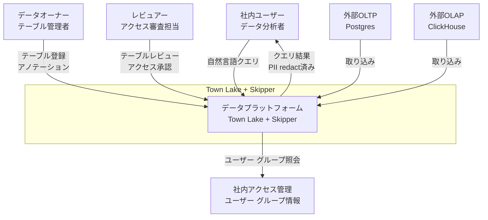
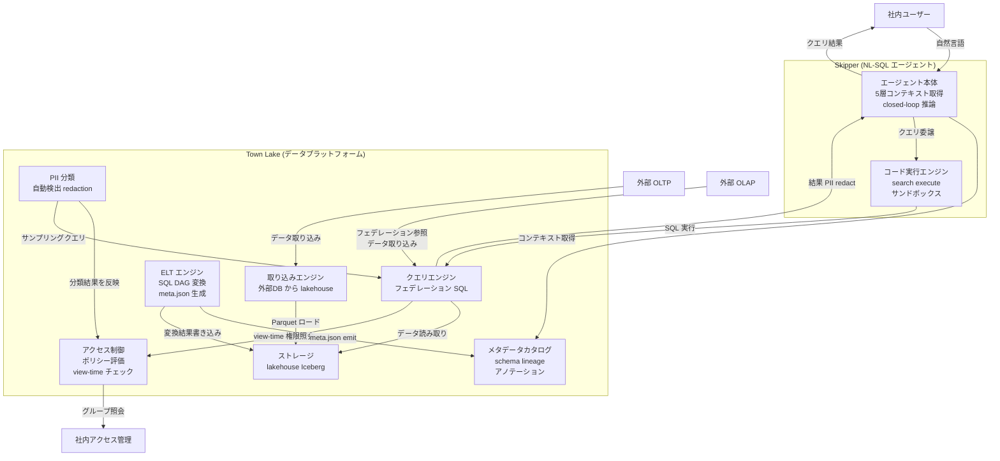
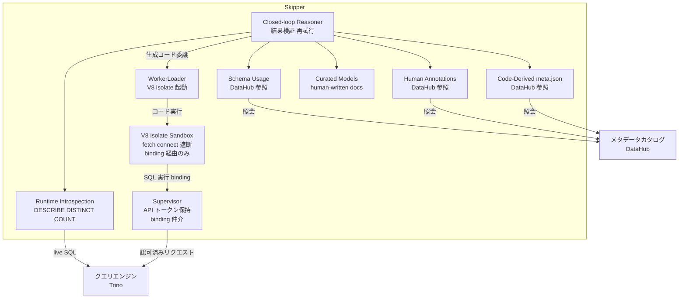
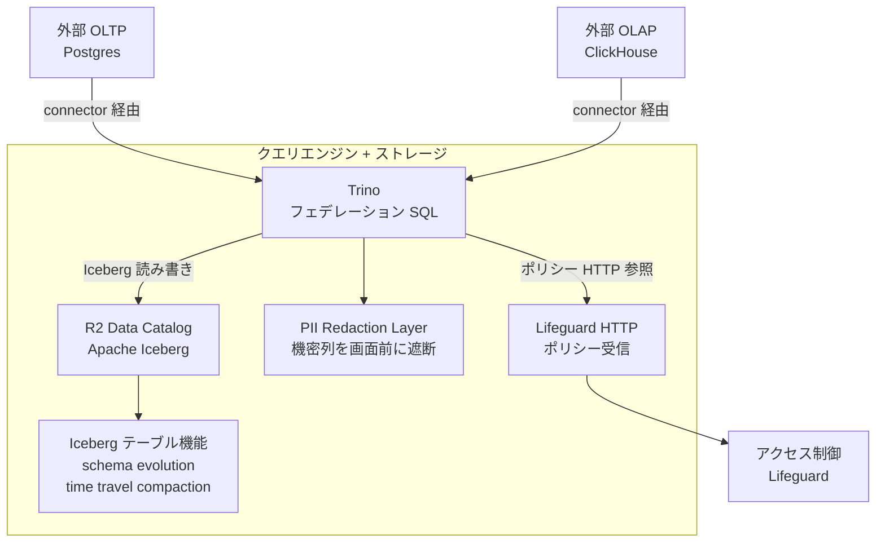
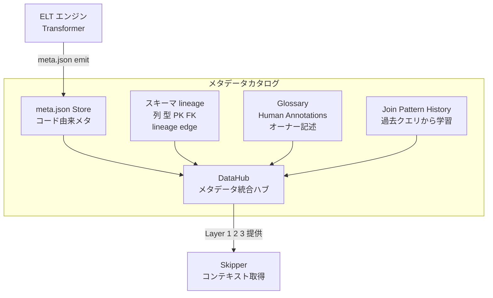
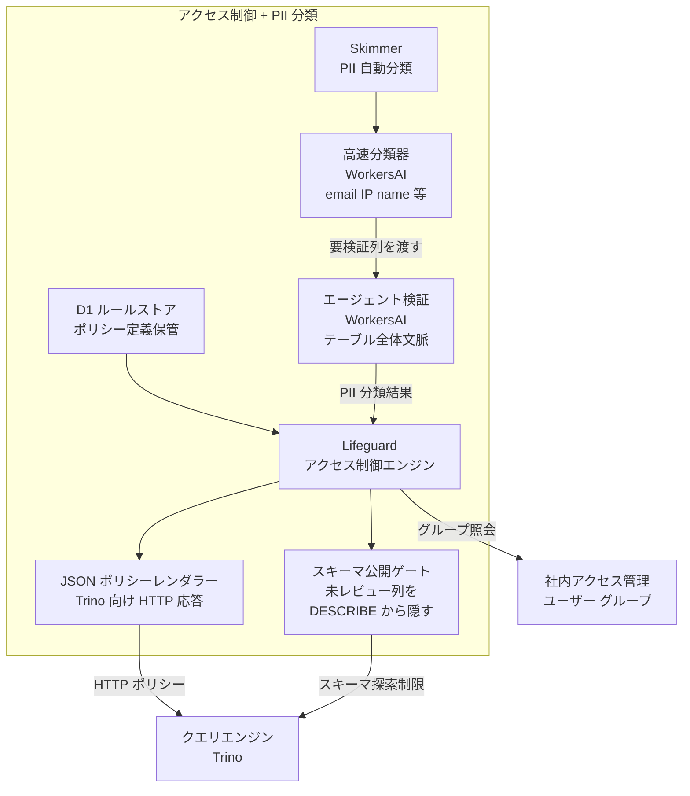
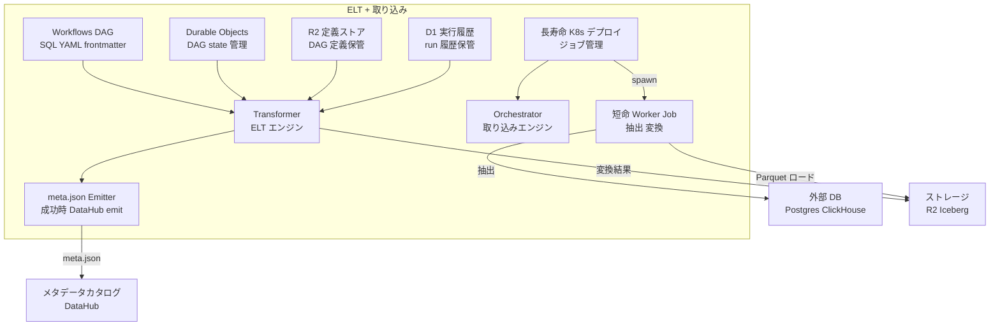
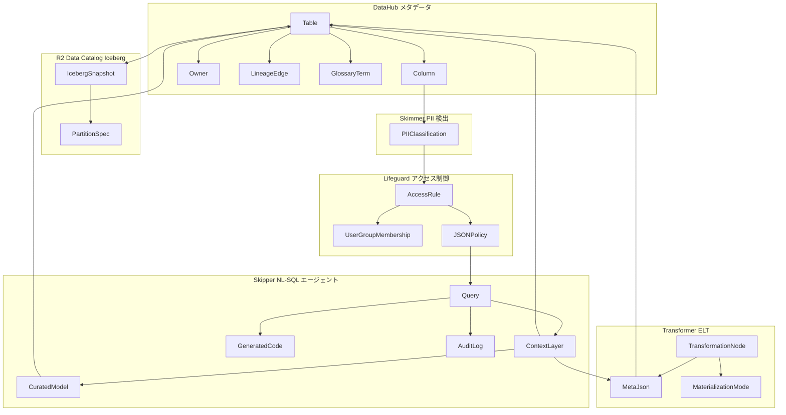
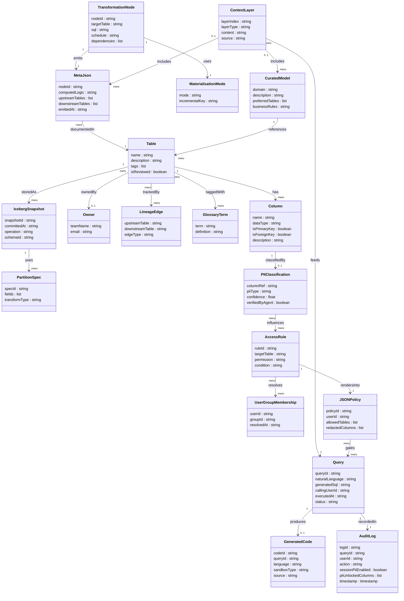

Cloudflare が社内の統一データプラットフォーム「Town Lake」と、その上で動く自然言語 SQL エージェント「Skipper」の設計を公開しました。要点は 1 つに集約されます。**NL-SQL エージェントの「正しさ・安全・監査可能性」を、プロンプトチューニングではなくデータ基盤の構造で作る**という発想です。

本記事は、その設計を実装エンジニアが自分の環境に持ち帰れる「設計の型」として整理します。あわせて、Cloudflare 固有実装への依存という限界も明示します。

> 調査日: 2026-05-29 / 中核一次ソース: [Our Unified Data Platform](https://blog.cloudflare.com/our-unified-data-platform/) / [Code Mode](https://blog.cloudflare.com/code-mode/)
>
> Skipper / Town Lake は Cloudflare 社内システムであり一般公開製品ではありません。後半の「構築方法」「利用方法」は、公開情報から導出した**他社実装エンジニア向けの実装案 (再現パターン)** です。Cloudflare の実装を直接再現するものではありません。

## 概要

### Town Lake とは

Town Lake は Cloudflare が社内向けに構築した統一データプラットフォームです。

導入前の問題はデータの断片化でした。アナリストは Postgres・ClickHouse・R2・Kafka など数十の異なるシステムに、それぞれ異なる認証・異なるクエリ言語で問い合わせる必要がありました。Town Lake はこれらを Trino によるフェデレーションで 1 つのエンドポイントに統一し、中間マテリアライズなしに横断クエリを実行できるようにしています。

### Skipper とは

Skipper は Town Lake の上で動く自然言語 SQL エージェントです。ユーザーが SQL を知らなくても自然言語で問い合わせを行えます。

Skipper の核心的な設計思想は 1 文に集約されます。モデルへの巧妙な指示でハルシネーションを抑えるのではなく、メタデータ・コード由来の意味・キュレーション済みデータモデル・実行時検証という多層のコンテキストで正しさを担保します。

### 解決する問題

| 問題 | Town Lake / Skipper の解法 |
|---|---|
| データソースの断片化 | Trino フェデレーションで単一エンドポイントに統一 |
| NL-SQL のハルシネーション | プロンプトでなく 5 層コンテキスト + closed-loop 検証で抑制 |
| アクセス制御の形骸化 | default-closed + 閲覧時権限再評価 + 自動 PII 分類 |
| エージェント操作の不透明性 | search/execute + コード生成でログに残る監査可能な実行 |

### 「正しさをプロンプトでなくデータ基盤の構造で作る」という思想

Skipper 開発で Cloudflare が得た最も重要な教訓は **"Less prompting is more"** です。詳細で規範的な system prompt を書くほど品質が下がりました。精度が最も向上したのは、モデルへの指示を減らし、データ基盤側のコンテキストを充実させたときでした。

特に効果が高かったのは **"Code, not metadata, captures meaning."** という発見です。テーブルを生成する実際の変換 SQL を Skipper に渡し始めたとき、精度が顕著に改善しました。ビジネスロジック (例: `alloc_amount` は年払いでは `billed_amount / 12`、月払いでは `billed_amount`) はカラム説明ではなくコードに埋め込まれており、そのコードをコンテキストとして渡すことで初めてモデルが正しく解釈できました。

### 類似アプローチとの比較

| アプローチ | 正しさの担保方法 | ガバナンス | 監査可能性 | 前提インフラ |
|---|---|---|---|---|
| 素の text-to-SQL | プロンプト + モデル能力のみ | 専用設計なし / DB 側権限に依存 | クエリログのみ | 任意 DB |
| BI ツール | 固定の視覚化・集計定義 | ツール側の権限設定 | BI ツール内ログ | BI ツール + DWH |
| dbt semantic layer + LLM | metrics YAML + git レビュー | data contract + CI | git 履歴 + dbt テスト | dbt + クエリエンジン |
| Town Lake + Skipper | 5 層コンテキスト + closed-loop + runtime 検証 | default-closed + 閲覧時権限再評価 + 自動 PII 分類 | コード生成ログ + 全クエリ記録 + DataHub lineage | Trino + Iceberg + DataHub + Lifeguard + Skimmer |

dbt semantic layer + LLM は "code-as-governance" の思想で Town Lake と方向が近いです。Town Lake はそれをクエリフェデレーション・アクセス制御・PII 自動分類まで含む統合基盤として社内実装した位置づけです。

## 特徴

### 1. フェデレーション型統一クエリ

- Trino が Postgres・ClickHouse・R2 上の Iceberg を単一 SQL で横断クエリ
- 中間マテリアライズ不要、フィルタプッシュダウンによる最適化
- ストレージは Apache Iceberg (schema evolution / time travel / partition evolution / compaction)

### 2. 5 層コンテキストによる NL-SQL 精度保証

1. **Schema / Usage (DataHub)** — 全列・型・PK・FK と、履歴クエリパターンから得た「よく join されるテーブル」の知識
2. **Human Annotations** — テーブル・カラムオーナーが書く自然言語説明
3. **Code-Derived (.meta.json)** — Transformer が成功実行ごとに変換ロジックを DataHub に emit。ビジネスロジックをコードから取得
4. **Curated Models** — billing / customers / accounts / zones の考え方を書いた人手の短いドキュメント
5. **Runtime Introspection** — `DESCRIBE` / `SELECT DISTINCT col LIMIT 20` / `SELECT COUNT(*)` を live 実行して前提を検証

### 3. Closed-loop 自己検証

- join が 0 行、フィルタが期待外れ、などの異常を Skipper が自律的に検出
- 原因調査・クエリ修正・再実行を自律的に実施

### 4. Code Mode — search/execute の 2 プリミティブ

- MCP ツールを大量列挙する代わりに `search` と `execute` の 2 プリミティブを公開
- モデルが JavaScript を書き、WorkerLoader (V8 isolate サンドボックス) 内で実行
- `fetch()` / `connect()` は throw され外部通信不可。トークンは supervisor が保持しコードに漏れない
- 何をしたかがコードとログに残るため、監査・再現・レビューが可能

### 5. Default-closed ガバナンス

- テーブルはレビューされるまでクエリ不可。スキーマ探索とデータアクセスを別機能として分離
- エラーメッセージは "permission denied" でなく "this table needs review, click here to request one" で self-service 誘導
- Skimmer (Workers AI) が全テーブル・全カラムを 2 段階でサンプリング分類し、多くのレビューを数秒で処理

### 6. 閲覧時権限再評価 (view-time access check)

- 権限の評価は保存時でなく閲覧時に毎回実行
- グループメンバーシップの変更が即座に反映され stale permission を回避
- 共有ダッシュボードも閲覧のたびに現在の権限で再評価

### 7. PII の自動分類と既定 redaction

- Skimmer が emails・IPs・names・phone・API tokens・opaque IDs を高速分類し、エージェント検証で確認
- Trino が機密列を画面到達前に redact。権限がある場合のみビットを倒して解除でき、解除操作と全クエリが記録される

### 8. 監査可能性の設計的担保

- Skipper の全操作は「呼び出したユーザーとして」実行され、エージェントが独立した権限を持たない
- PII 解除・全クエリを記録し、Code Mode では生成コード自体が監査可能な実行単位になる
- DataHub が lineage edge を保持し、データの来歴を追跡可能

### 運用実績

| 指標 | 値 |
|---|---|
| 直近測定期間のクエリ数 | 91,760 クエリ (324 名の社員) |
| billing クエリの割合 | Town Lake トラフィックの 53% |
| revenue rollup クエリの短縮 | 200〜300 行 → 約 5 行 |

> 上記の数値はすべて Cloudflare 自己申告で、測定期間の定義・クエリ正答率・誤答率・インシデント率は非開示です。

## 構造

### システムコンテキスト図



| 要素名 | 説明 |
|---|---|
| 社内ユーザー | 自然言語でデータを問い合わせるデータ分析者。Skipper 経由で SQL を書かずにクエリを実行 |
| データオーナー | テーブルの登録・説明アノテーションを管理する担当者。DataHub への記述がコンテキスト品質を決める |
| レビュアー | テーブルの公開可否を審査し、PII 分類に対してアクセス承認を行う担当者 |
| Town Lake + Skipper | 統一データプラットフォームと自然言語 SQL エージェントの複合システム |
| 外部 OLTP | 運用系データベース。取り込みパイプラインでプラットフォームに流入 |
| 外部 OLAP | 分析系データベース。フェデレーションクエリでリアルタイムに join 対象にもなる |
| 社内アクセス管理 | ユーザーとグループのメンバーシップを保持する既存システム。Lifeguard が動的参照 |

### コンテナ図



| 要素名 | 説明 |
|---|---|
| エージェント本体 | 自然言語を受け取り 5 層コンテキストを収集して SQL を生成。結果を closed-loop で検証・再試行 |
| コード実行エンジン | search / execute の 2 プリミティブを公開し、モデルが書いたコードをサンドボックスで実行 |
| クエリエンジン | 複数ソースを中間マテリアライズなしに join するフェデレーション SQL エンジン |
| ストレージ | オブジェクトストレージ上の lakehouse。schema evolution・time travel・compaction を備えた Iceberg テーブルを管理 |
| メタデータカタログ | 全テーブル・列・型・PK/FK・lineage・アノテーション・コード由来メタを一元管理 |
| アクセス制御 | ルールを格納し社内アクセス管理からグループ情報を動的取得して JSON ポリシーをクエリエンジンに渡す。閲覧時に再評価 |
| PII 分類 | 全列をサンプリングして機密データを自動分類し、アクセス制御ポリシーに反映 |
| ELT エンジン | SQL + YAML フロントマターの DAG で変換を定義し、成功実行ごとにメタデータを emit |
| 取り込みエンジン | 外部データベースから Parquet 変換して lakehouse に継続的にロード |

### コンポーネント図: Skipper



| 要素名 | 説明 |
|---|---|
| Schema / Usage | DataHub から全列・型・PK/FK・歴史的 join パターンを取得する第 1 層 |
| Human Annotations | テーブル・列に付与された人手アノテーションを DataHub から取得する第 2 層 |
| Code-Derived .meta.json | Transformer が emit した変換ロジック由来のメタデータを取得する第 3 層 |
| Curated Models | ビジネスドメインの考え方を記述した人手ドキュメント (第 4 層) |
| Runtime Introspection | 他の層が不足したとき DESCRIBE / SELECT DISTINCT / SELECT COUNT を live 実行する第 5 層 (safety net) |
| Closed-loop Reasoner | クエリ結果を検証し、0 行 join 等の異常を検出して調査・修正・再試行するループ制御 |
| WorkerLoader | 生成コードを受け取り V8 isolate を起動するローダー |
| V8 Isolate Sandbox | 生成コードを隔離実行。外部通信は binding 経由に限定 |
| Supervisor | API トークンを保持し binding 経由のリクエストを認可してクエリエンジンへ中継 |

### コンポーネント図: クエリエンジン + ストレージ



| 要素名 | 説明 |
|---|---|
| Trino | Postgres / ClickHouse / R2 Iceberg を中間マテリアライズなしに 1 クエリで join するフェデレーションエンジン |
| Lifeguard HTTP ポリシー受信 | Trino が HTTP でポリシーを取得するインターフェース。view-time に毎回評価 |
| PII Redaction Layer | 機密列を結果が画面に届く前に redact するレイヤー。セッションで解除可能だが全ログを記録 |
| R2 Data Catalog | オブジェクトストレージ上の Iceberg テーブル群を管理するカタログ |
| Iceberg テーブル機能 | スキーマ変更・time travel・パーティション変更・compaction を提供する Iceberg の機能群 |

### コンポーネント図: メタデータカタログ



| 要素名 | 説明 |
|---|---|
| DataHub | 全メタデータの統合ハブ。Skipper のコンテキスト取得の主要ソース |
| スキーマ / lineage | 全テーブル・列・型・PK/FK・lineage edge を保持 |
| Glossary / Human Annotations | データオーナーが記述するテーブル・列の説明 |
| .meta.json Store | Transformer が成功実行ごとに emit する変換ロジック由来のメタデータ |
| Join Pattern History | 過去クエリから抽出された「よく join されるテーブル」の知識 |

### コンポーネント図: アクセス制御 + PII 分類



| 要素名 | 説明 |
|---|---|
| Lifeguard | アクセスルールを管理し view-time に JSON ポリシーを生成してクエリエンジンに渡す |
| D1 ルールストア | Lifeguard のアクセスルール定義を格納する D1 データベース |
| JSON ポリシーレンダラー | D1 ルール + 動的グループ情報を合成して Trino が読む JSON ポリシーを HTTP で提供 |
| Skimmer | Workers AI で全テーブル・全列を自動 PII 分類するエンジン。2 段階パスで構成 |
| 高速分類器 | email / IP / 電話番号 / API トークン等の既知 PII 型を高速に列単位でスキャンする第 1 パス |
| エージェント検証 | テーブル全体文脈を持ち Trino に直接クエリして分類を検証する第 2 パス |
| スキーマ公開ゲート | レビュー未完了の列・テーブルを DESCRIBE / SHOW COLUMNS / SELECT * から隠す default-closed 機能 |

### コンポーネント図: ELT + 取り込み



| 要素名 | 説明 |
|---|---|
| Transformer | ELT の変換エンジン本体。SQL + YAML フロントマターで定義された DAG を実行 |
| Workflows DAG | materialization モード・依存関係・スケジュールを YAML で定義する変換グラフ |
| Durable Objects | 変換 DAG の実行状態を永続化 |
| R2 定義ストア | DAG 定義ファイルを保管するオブジェクトストレージ領域 |
| D1 実行履歴 | 変換実行の履歴・ステータスを記録する D1 データベース |
| .meta.json Emitter | 変換成功ごとにコード由来メタデータを生成して DataHub に emit |
| Orchestrator | 外部データベースからの継続的取り込みを管理 |
| 長寿命 K8s デプロイ | 短命 worker job を spawn・監視する Kubernetes 上の常駐プロセス |
| 短命 Worker Job | 外部 DB から抽出し Parquet に変換して R2 にロードする使い捨て処理単位 |

## データ

### 概念モデル



| 要素名 | 説明 |
|---|---|
| Table / Column / Owner / LineageEdge / GlossaryTerm | DataHub が管理するメタデータ。テーブル・列・所有者・来歴・用語集 |
| IcebergSnapshot / PartitionSpec | R2 Data Catalog の Iceberg スナップショットとパーティション定義 |
| AccessRule / UserGroupMembership / JSONPolicy | Lifeguard のアクセスルール・グループ所属・生成ポリシー |
| PIIClassification | Skimmer が列に付与する PII 分類結果 |
| TransformationNode / MetaJson / MaterializationMode | Transformer の変換ノード・コード由来メタ・物理化モード |
| ContextLayer / CuratedModel / GeneratedCode / Query / AuditLog | Skipper の 5 層コンテキスト・キュレーションモデル・生成コード・クエリ・監査ログ |

### 情報モデル



## 構築方法

以下は他社実装エンジニア向けの**実装案**です。Cloudflare 固有コンポーネントを OSS で近似します。

### 前提コンポーネントと OSS 代替

| Cloudflare の実装 | 役割 | OSS 代替候補 |
|---|---|---|
| Trino + R2 Iceberg | クエリフェデレーション + lakehouse | Trino / Starburst + S3・GCS・R2 上の Apache Iceberg |
| DataHub | メタデータカタログ / lineage / glossary | DataHub / OpenMetadata |
| Transformer (.meta.json) | ELT + コード由来メタの自動 emit | dbt (models + semantic layer) |
| Lifeguard (D1 + HTTP) | view-time アクセス評価 | OPA (Open Policy Agent) + ABAC |
| Skimmer (Workers AI) | PII 自動分類 | spaCy NER + LLM 再分類パイプライン |
| WorkerLoader (V8 isolate) | search/execute サンドボックス | Code execution with MCP / Firecracker microVM |

### Trino + Apache Iceberg のセットアップ

複数データソース (Postgres / ClickHouse / S3 上の Iceberg) を単一クエリで結合します。中間マテリアライズを不要にすることが目標です。

```yaml
# docker-compose.yml (実装案) 参考: https://trino.io/docs/current/installation/deployment.html
version: "3.9"
services:
  trino:
    image: trinodb/trino:latest
    ports:
      - "8080:8080"
    volumes:
      - ./trino/etc:/etc/trino
      - ./trino/catalog:/etc/trino/catalog
  iceberg-rest:
    image: tabulario/iceberg-rest:latest
    ports:
      - "8181:8181"
    environment:
      CATALOG_WAREHOUSE: s3://your-bucket/warehouse
      CATALOG_IO__IMPL: org.apache.iceberg.aws.s3.S3FileIO
  datahub-gms:
    image: linkedin/datahub-gms:head
    ports:
      - "8081:8080"
```

```properties
# etc/catalog/iceberg.properties (実装案) 参考: https://trino.io/docs/current/connector/iceberg.html
connector.name=iceberg
iceberg.catalog.type=rest
iceberg.rest-catalog.uri=http://iceberg-rest:8181
iceberg.rest-catalog.warehouse=s3://your-bucket/warehouse
iceberg.file-format=PARQUET
fs.native-s3.enabled=true
```

```properties
# etc/catalog/postgres.properties (実装案) 参考: https://trino.io/docs/current/connector/postgresql.html
connector.name=postgresql
connection-url=jdbc:postgresql://postgres-host:5432/mydb
connection-user=${ENV:POSTGRES_USER}
connection-password=${ENV:POSTGRES_PASSWORD}
```

```sql
-- クロスソース結合の例: Postgres の orders と Iceberg の enriched_customers を join
SELECT o.order_id, o.amount, c.segment, c.region
FROM postgres.mydb.orders o
JOIN iceberg.warehouse.enriched_customers c ON o.customer_id = c.customer_id
WHERE o.created_at >= DATE '2026-01-01'
```

### DataHub によるメタデータ集約

全テーブル・列の schema・owner・lineage・join パターンを DataHub に集約します。これが Skipper の 5 層コンテキストの土台になります。

```yaml
# datahub_recipe.yml (実装案) 参考: https://datahubproject.io/docs/metadata-ingestion/
source:
  type: trino
  config:
    host_port: "trino-host:8080"
    database: "iceberg"
    include_tables: true
    profiling:
      enabled: true
sink:
  type: datahub-rest
  config:
    server: "http://datahub-gms:8080"
```

```python
# 実装案: .meta.json emit に相当する処理 (コード由来メタを DataHub へ)
import datahub.emitter.mce_builder as builder
from datahub.emitter.rest_emitter import DatahubRestEmitter
from datahub.metadata.schema_classes import EditableDatasetPropertiesClass

emitter = DatahubRestEmitter(gms_server="http://datahub-gms:8080")
dataset_urn = builder.make_dataset_urn(platform="trino", name="iceberg.warehouse.billing_events")
mce = builder.make_mce_builder(
    entityUrn=dataset_urn,
    aspect=EditableDatasetPropertiesClass(
        description=(
            "billing イベントテーブル。alloc_amount は年払いなら billed_amount / 12、"
            "月払いなら billed_amount。Source: transformer/billing_events.sql (commit abc1234)"
        )
    ),
)
emitter.emit_mce(mce)
```

### dbt semantic layer でビジネスロジックをコード化

変換ロジックを YAML に書き、DataHub への emit を CI で自動化します。

```yaml
# models/billing/schema.yml (実装案) 参考: https://docs.getdbt.com/docs/build/semantic-models
version: 2
models:
  - name: billing_events
    description: >
      billing イベントテーブル。年払いプランの alloc_amount は billed_amount を 12 で除算。
    columns:
      - name: customer_id
        description: "顧客の一意識別子 (accounts テーブルの FK)"
        data_tests: [not_null]
      - name: alloc_amount
        description: "plan_type=annual なら billed_amount/12、monthly なら billed_amount"
semantic_models:
  - name: billing_semantic
    model: ref('billing_events')
    entities:
      - {name: billing_event, type: primary, expr: event_id}
      - {name: customer, type: foreign, expr: customer_id}
    measures:
      - {name: total_alloc_amount, agg: sum, expr: alloc_amount}
```

### OPA で view-time アクセス制御 (default-closed)

Lifeguard の「閲覧時に権限再評価」を OPA で実現します。

```rego
# policy/data_access.rego (実装案) 参考: https://www.openpolicyagent.org/docs/latest/
package data.access
import rego.v1

default allow := false

allow if {
    input.table.status == "reviewed"
    user_has_permission
    not column_is_restricted
}
user_has_permission if {
    some group in data.groups[input.user.id]
    group in input.table.allowed_groups
}
column_is_restricted if {
    input.column.pii == true
    not "pii_viewer" in data.groups[input.user.id]
}
```

```properties
# etc/access-control.properties (実装案) 参考: https://trino.io/docs/current/security/opa-access-control.html
access-control.name=opa
opa.policy.uri=http://opa-server:8181/v1/data/data/access/allow
opa.policy.row-filters-enabled=true
opa.policy.column-masking-enabled=true
```

Rego が評価された結果として Trino OPA plugin に渡る応答 (実装案) は次の形です。`allow` の真偽に加え、行フィルタと列マスキングを返します。

```json
{
  "result": {
    "allow": true,
    "rowFilters": [
      {"expression": "region = 'apac'"}
    ],
    "columnMasks": [
      {"column": "email", "expression": "'***REDACTED***'"}
    ]
  }
}
```

### テーブル候補の embedding 検索 (実装案)

5 層コンテキストの前段で、自然言語クエリに関連するテーブルを上位 N 件に絞ります。全テーブルのメタデータを詰め込むとコンテキストが肥大化するため、retrieval で絞ることが実装上のボトルネックになります。

```python
# 実装案: DataHub の table description を embedding 化して検索する
from qdrant_client import QdrantClient

qdrant = QdrantClient(url="http://qdrant:6333")

def search_tables_by_embedding(nlq: str, top_k: int = 5) -> list:
    # クエリを埋め込み、テーブル説明の事前インデックスと近傍検索する
    vector = embed(nlq)  # 任意の embedding モデル
    hits = qdrant.search(collection_name="table_descriptions", query_vector=vector, limit=top_k)
    return [h.payload["table_name"] for h in hits]
```

インデックスは DataHub のメタデータ変更 (新テーブル登録・description 更新) をフックに再構築します。Layer 1 の「よく join されるテーブル」の知識は、Trino の query history を定期 ETL で DataHub の usage 統計に投入して蓄積します。

## 利用方法

### 必須パラメータ

| パラメータ | 型 | 説明 | 例 |
|---|---|---|---|
| `user_id` | string | クエリ発行者の ID (view-time 権限評価に使用) | `"uid-123"` |
| `user_groups` | list | 所属グループ一覧 (OPA に渡す) | `["data-analysts", "billing-team"]` |
| `natural_language_query` | string | ユーザーの自然言語の質問 | `"先月の課金総額をプラン別に"` |
| `catalog_name` | string | 検索対象の Trino カタログ名 | `"iceberg"` |

### NL-SQL エージェントへの 5 層コンテキスト供給 (実装案)

Skipper の「メタデータと検証で正しさを作る」パターンを Claude API + DataHub + Trino で再実装します。

```python
# 実装案: 5 層コンテキスト供給 + closed-loop 検証エージェント
# 参考: https://blog.cloudflare.com/our-unified-data-platform/
import anthropic, requests, trino

client = anthropic.Anthropic()
trino_conn = trino.dbapi.connect(host="trino-host", port=8080, user="skipper-agent")

def get_metadata_context(table_name: str) -> str:
    """DataHub から 1-4 層コンテキストを取得する"""
    resp = requests.get(
        f"http://datahub-gms:8080/entities/{table_name}",
        headers={"Authorization": f"Bearer {DATAHUB_TOKEN}"},
    )
    info = resp.json().get("aspects", {})
    schema = info.get("schemaMetadata", {})              # 層1: Schema/Usage
    annotations = info.get("editableSchemaMetadata", {}) # 層2: Human Annotations
    code_derived = info.get("datasetProperties", {})     # 層3: Code-Derived
    curated = load_curated_model(table_name)             # 層4: Curated Model
    return f"Schema:{schema}\nAnnotations:{annotations}\nCode:{code_derived}\nCurated:{curated}"

def runtime_introspection(table: str, col: str) -> str:
    """層5: DESCRIBE / SELECT DISTINCT でリアルタイム検証"""
    cur = trino_conn.cursor()
    cur.execute(f"DESCRIBE {table}")
    describe = cur.fetchall()
    cur.execute(f"SELECT DISTINCT {col} FROM {table} LIMIT 20")
    distinct = [r[0] for r in cur.fetchall()]
    return f"DESCRIBE:{describe}\nDISTINCT {col}:{distinct}"

def nl_to_sql_agent(nlq: str, user_id: str, user_groups: list) -> dict:
    """closed-loop で最大 3 回まで検証・修正する"""
    candidates = search_tables_by_embedding(nlq)[:5]
    context = "\n".join(get_metadata_context(t) for t in candidates)
    system = (
        "あなたは社内データ分析の SQL 生成エージェントです。\n"
        "- 生成 SQL は Trino 構文に従う\n"
        "- 権限のないテーブル・列にアクセスしない\n"
        "- 結果が 0 件なら join 条件や絞り込みを見直して再試行する\n"
        "- PII 列 (is_pii=true) は SELECT に含めない\n"
        f"## テーブル情報\n{context}\n## 権限\nuser_id:{user_id} groups:{user_groups}"
    )
    messages = [{"role": "user", "content": nlq}]
    for attempt in range(3):
        resp = client.messages.create(
            model="claude-sonnet-4-5", max_tokens=2048, system=system, messages=messages
        )
        sql = extract_sql(resp.content[0].text)
        try:
            cur = trino_conn.cursor()
            cur.execute(sql)
            rows = cur.fetchall()
            if len(rows) == 0 and attempt < 2:
                messages += [
                    {"role": "assistant", "content": resp.content[0].text},
                    {"role": "user", "content": f"結果0件。join/フィルタを見直して再生成。{runtime_introspection(candidates[0], 'created_at')}"},
                ]
                continue
            return {"sql": sql, "rows": rows, "attempts": attempt + 1}
        except Exception as e:
            messages += [
                {"role": "assistant", "content": resp.content[0].text},
                {"role": "user", "content": f"SQL エラー:{e}。修正して再生成。"},
            ]
    return {"error": "max attempts reached"}
```

### Code Mode 風 search/execute ツール設計 (実装案)

ツールを大量列挙せず `search_tools` と `execute_code` の 2 プリミティブに寄せます。

> "LLMs have seen a lot of code. They have not seen a lot of 'tool calls.'" — Cloudflare Code Mode

```python
# 実装案: search/execute 2 プリミティブ
# 参考: https://blog.cloudflare.com/code-mode/ , https://www.anthropic.com/engineering/code-execution-with-mcp
TOOLS = [
    {
        "name": "search_tools",
        "description": "利用可能な MCP ツールを検索。定義を全件ロードせず必要なものだけ取得する",
        "input_schema": {
            "type": "object",
            "properties": {
                "query": {"type": "string"},
                "detail_level": {"type": "string", "enum": ["name_only", "summary", "full_schema"]},
            },
            "required": ["query"],
        },
    },
    {
        "name": "execute_code",
        "description": "コードをサンドボックス実行。外部アクセスは MCP binding 経由のみ。コードはログに残り監査証跡になる",
        "input_schema": {
            "type": "object",
            "properties": {"code": {"type": "string"}, "timeout_seconds": {"type": "integer"}},
            "required": ["code"],
        },
    },
]
```

`search_tools` は軽量インデックスのみを常時保持し、必要なツール定義だけをオンデマンドで返します。`execute_code` は Cloudflare の V8 isolate とは異なる OSS / 汎用環境で近似するなら Firecracker microVM や gVisor 等の隔離環境で実行し、実行したコードを監査証跡として保存します。

## 運用

### default-closed ガバナンスの運用

- 新テーブルは Skimmer が列をサンプリング分類し、中央 allowlist に `pending` 状態で登録
- `pending` テーブルは `DESCRIBE` / `SHOW COLUMNS` / `SELECT *` から隠れる。スキーマ探索とデータアクセス権限は意図的に分離
- レビュー済みテーブルに新列が追加された場合も、その列だけが `pending` となり既存ダッシュボードを壊さない
- 権限がないテーブルへの問い合わせは "permission denied" でなく「このテーブルはレビューが必要です」という self-service 誘導

### view-time access check の運用

```
クエリ保存 → 権限は未評価 (save-time check なし)
      ↓
閲覧 → 閲覧者の現在のグループ情報で権限再評価
      ↓
権限なし → アクセス権申請へ誘導 / 権限あり → 結果表示
```

- iframe 埋め込みダッシュボードも Cloudflare Access が iframe コンテンツをゲート
- CSP `frame-ancestors` で社外ドメインからの埋め込みを遮断
- 自環境では OPA や ABAC エンジンで query 実行時に都度評価し、キャッシュによる stale permission を回避

### PII redaction とセッション解除 + 監査ログ

1. ユーザーがセッションで PII 表示の権限ビットを倒す
2. Lifeguard が現在の権限を確認 (view-time check と同じ仕組み)
3. 権限が確認されると redaction が解除
4. 解除操作と解除後の全クエリを記録 (クエリ内容・実行者・時刻)

### Code Mode サンドボックスの運用

```
生成コード → 直接トークン参照 → 不可 (throw)
生成コード → binding を呼ぶ → supervisor がトークンを代理注入 → MCP サーバー
```

- `fetch()` / `connect()` はサンドボックス内で例外となり、外部通信は binding 経由のみ
- トークン・シークレットはコードに埋め込まれない
- エージェントが実行した操作はコードとクエリログとして残り、コードレビューと同じ手法で事後確認できる

### 監視・コスト

- Trino は resource group 設定で同時実行制御し、大規模クエリが BI クエリを圧迫しないようクラスを分ける
- Iceberg の partition evolution でデータ粒度を段階的に削減

| 経過時間 | データ粒度 |
|---|---|
| 直近 | per-minute |
| 一定期間後 | hourly |
| さらに古い | daily |

- compaction (小ファイル統合) を定期実行し、スキャンコストと R2 の PUT リクエスト数を抑制

## ベストプラクティス

### 「正しさをメタデータで作る」運用

- **code-derived メタデータの自動 emit**: 最も効果が高かった施策は、変換ロジックを `.meta.json` として DataHub に自動 emit すること。自環境では dbt の `meta:` ブロックや docs を CI で DataHub/OpenMetadata に同期

```yaml
# .meta.json の例 (Transformer が emit)
alloc_amount:
  computed_as: "billed_amount / 12 for annual; billed_amount for monthly"
  source_table: billing_events
  transform_sql: "CASE WHEN plan_type='annual' THEN billed_amount/12 ELSE billed_amount END"
```

- **curated model の整備**: ビジネス核心ドメインについて「このテーブルの考え方」を短い人手ドキュメントにする。技術仕様でなくビジネス文脈の記述が精度向上に寄与
- **runtime 検証ループ**: コンテキスト不十分時に `DESCRIBE` / `SELECT DISTINCT` / `SELECT COUNT(*)` を自己実行し、0 行 join・型不一致を検知して修正・再試行

### 「誤解 → 反証 → 推奨」で読む運用上の注意

| 誤解 | 反証 (Cloudflare 固有の条件 / 既知の限界) | 推奨 |
|---|---|---|
| メタデータを増やせば SQL 正答率が上がる | 無秩序にメタデータを増やすと retrieval ノイズが増える可能性があり、semantic error の検出は依然困難 | quantity より quality。curated model を定期レビューし誤分類報告フローを設ける |
| closed-loop があれば誤クエリは検出できる | closed-loop が検出できるのは「0 行 join」「型不一致」「実行エラー」など形式的な異常のみ。値は返るが答えが間違っている semantic error (集計粒度の誤認・日付範囲の解釈違い・誤った列での集計) は検出できない | 重要クエリは人手レビュー / ゴールデンクエリとの突合 / 結果の妥当性チェック (前期比など) を別途組み込む |
| Cloudflare のアーキを採用すれば同じシステムが作れる | Workers / WorkerLoader / R2 / D1 / DO に深く依存。TCO は顧客以外で異なる | 概念 (5層 / default-closed / view-time) は移植可能、実装はスタックに合わせて再設計 |
| Cloudflare の DAG 状態管理 (Durable Objects) も OSS で簡単に代替できる | Durable Objects の単一性保証つきステート管理は OSS では非自明。K8s 長寿命プロセス + 外部 KV/DB での状態管理は等価だが運用負荷が上がる | ELT の状態管理は Airflow / Dagster 等の既存ワークフローエンジンに寄せ、自前実装を避ける |
| 正答率は高い (91,760 クエリで稼働) | 正答率・誤答率・インシデント率は非開示。billing は Skipper の初期ユースケースで、特定ドメインに偏った数値である可能性 | 自組織でクエリ精度を測定し、誤クエリの件数・影響を把握する仕組みを構築 |
| PII 自動分類で漏洩リスクはゼロ | Skimmer の精度は非開示。false negative は漏洩、false positive は過剰 redaction | 抜き取り検査・誤り報告 UI を運用に組み込む。業界別 PII 定義は手動補正 |
| プロンプト設計が細かいほど精度が上がる | 詳細な system prompt は品質を下げた ("Less prompting is more") | high-level guidance に留め、細かい指示は curated model に移す |

### セキュリティ

- **prompt injection**: DB に格納された悪意ある文字列がコンテキストに取り込まれる経路に注意します (例: コメント列の `Ignore previous instructions...`)。Cloudflare ブログでは prompt injection 固有の防御策は確認できません。確認できる防御は「呼び出しユーザー権限での実行」「view-time access check」「Code Mode の sandbox / binding / token 非露出」の 3 点です。
- **confused deputy**: エージェントが「呼び出したユーザーの権限で動く」設計は適切ですが、binding 経由でアクセスできるサービスを最小限に絞ります
- PII 解除と通常クエリを別ロールに分離し、PII 解除に追加認証を設けます。全クエリと生成コードを保存します

## トラブルシューティング

| 症状 | 主な原因 | 対処 |
|---|---|---|
| NL-SQL が誤った列を使う | DataHub のメタデータが不足/古い。curated model に計算ロジック未記載 | `.meta.json` emit の成功を確認。curated model に計算式・意味を追記 |
| join が 0 行を返す | 結合キーの型不一致、有効期間フィルタの不整合 | runtime introspection (`DESCRIBE`+`SELECT DISTINCT`) ログを確認。型キャストを curated model に注記 |
| 未レビュー列で権限拒否 | 新列追加だが Skimmer レビューが pending | allowlist で列の状態を確認。Skimmer 自動トリガーを確認し手動レビュー依頼 |
| PII 過剰 redaction | Skimmer の false positive | 誤分類列を `non-PII` として手動アノテーション。再スキャンをトリガー |
| ツール肥大化でコンテキスト圧迫 | MCP ツール定義の列挙が増えすぎ | `search` / `execute` の 2 プリミティブに統合。重複ツールを `mode` パラメータで分岐。system prompt を削減 |
| 共有ダッシュボードが閲覧者に表示されない | 閲覧者のグループ変化で view-time check が権限なしと判定 | Lifeguard で現在のグループを確認。必要グループへの追加を申請案内 |
| PII 解除操作が監査ログに残らない | redaction override が Lifeguard を経由していない | Lifeguard を経ずに解除できるパスを塞ぎ、全解除を Lifeguard 経由に修正 |
| Iceberg スキャンが遅い | 小ファイル蓄積で compaction 未実施 | compaction DAG の定期実行を確認。対象パーティションに手動 compaction |
| Trino 高並行時にクエリが詰まる | resource group 未調整で全クエリが同一キュー | resource group を BI / バッチ / アドホックで分け優先度設定。重いクエリにメモリ上限 |

## まとめ

Cloudflare の Town Lake / Skipper は、NL-SQL エージェントの正しさ・安全・監査可能性を、プロンプトではなくデータ基盤の構造 (5 層コンテキスト・default-closed・view-time 権限評価・search/execute による監査可能なコード実行) で作る設計を示しました。設計の核は Skipper MCP の search/execute と Code Mode による監査可能なコード実行です。概念は他環境にも移植できますが、実装は Cloudflare 固有スタックに依存し、運用数値は自己申告で正答率は非開示であるため、自組織での精度測定と段階的な再設計を前提に取り入れることが現実的です。

この記事が少しでも参考になった、あるいは改善点などがあれば、ぜひリアクションやコメント、SNSでのシェアをいただけると励みになります！

## 参考リンク

- 公式ドキュメント / 一次ソース
  - [Cloudflare — Our Unified Data Platform (Town Lake / Skipper)](https://blog.cloudflare.com/our-unified-data-platform/)
  - [Cloudflare — Code Mode](https://blog.cloudflare.com/code-mode/)
  - [Cloudflare R2 Data Catalog docs](https://developers.cloudflare.com/r2/data-catalog/)
  - [Anthropic — Code execution with MCP](https://www.anthropic.com/engineering/code-execution-with-mcp)
- Trino / Iceberg
  - [Trino — Iceberg Connector](https://trino.io/docs/current/connector/iceberg.html)
  - [Trino — PostgreSQL Connector](https://trino.io/docs/current/connector/postgresql.html)
  - [Trino — OPA Access Control](https://trino.io/docs/current/security/opa-access-control.html)
- メタデータ / semantic layer
  - [DataHub — Metadata Ingestion](https://datahubproject.io/docs/metadata-ingestion/)
  - [OpenMetadata vs DataHub (Atlan)](https://atlan.com/openmetadata-vs-datahub/)
  - [dbt — Semantic Models](https://docs.getdbt.com/docs/build/semantic-models)
  - [dbt — Semantic layer for data governance](https://www.getdbt.com/blog/semantic-layer-data-governance-security)
- アクセス制御 / セキュリティ
  - [OPA — Policy Language (Rego)](https://www.openpolicyagent.org/docs/latest/)
  - [Alation — Data Access Governance Best Practices](https://www.alation.com/blog/data-access-governance-best-practices-implementation/)
- text-to-SQL の限界 (二次情報)
  - [WrenAI — Reducing Hallucinations in Text-to-SQL](https://www.getwren.ai/post/reducing-hallucinations-in-text-to-sql-building-trust-and-accuracy-in-data-access)
  - [Promethium — Enterprise Text-to-SQL Accuracy Benchmarks](https://promethium.ai/guides/enterprise-text-to-sql-accuracy-benchmarks-2/)
