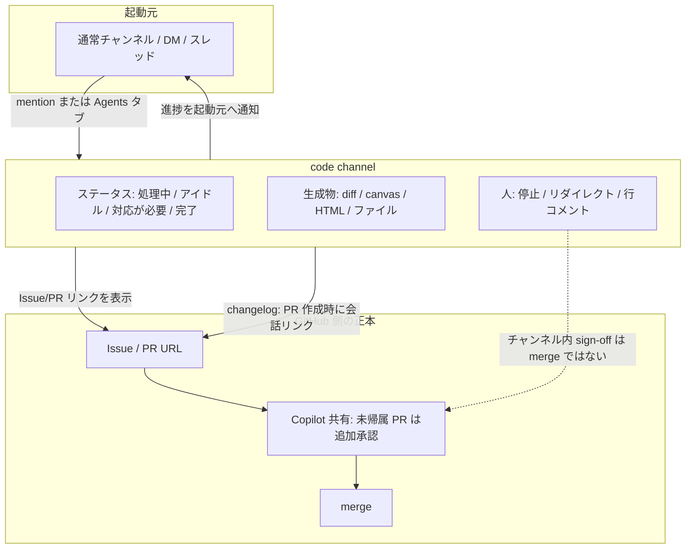
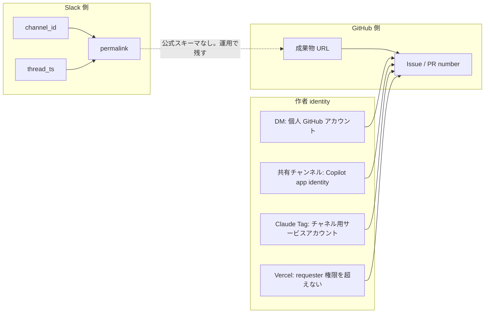

Slack は 2026-08-20 に **Slack Code** を発表しました。チームとコーディングエージェントが一時的な **code channel** で計画・差分・プレビューを共有する、新しいチャネル種別です。

この記事では、Slack Code を導入する側の判断材料を整理します。読み終えると次が分かります。

- Slack Code が出荷しているものと、出荷していないものの境界
- Slack の会話を GitHub の Issue / PR / ADR へ結ぶときに、自分で足す必要があるもの
- パートナー (Claude / Devin / GitHub Copilot / Vercel) ごとに分かれる権限とマージ責任
- 公式ドキュメント間で記述が食い違う箇所と、運用上どちらを正本にするか

結論を先に置きます。**Slack Code はエージェント作業の「共有セッション面」として採用してよく、要件定義の正本・判断来歴のストア・マージゲートとしては採用しない**、が現時点の妥当な線引きです。

*この記事の全体像。以下、順に解説します。*

## Slack Code は何で、何ではないか

Slack Code はコーディングモデルでもエージェント runtime でもありません。サポート対象のエージェントをメンションすると立ち上がる、専用のチャネル種別と操作面です。

公式が挙げる問題意識は 2 つあります。

- 個人の IDE / ターミナルタブでエージェント作業が孤立すること
- 逆に通常スレッドへマルチターンの対話を詰め込み、チャンネルがノイズになること

code channel はこの中間に置かれます。作業ごとに部屋を切り、終わったら閉じる、という発想です。

一方で「何ではないか」がこの製品を評価する上では重要です。

| 期待されがちな役割 | 現時点の実態 |
|---|---|
| 要件・仕様の正本 | 出荷されているのは運用ステータスのみ。採用した要求 / 却下した案 / 最終承認者を識別する状態モデルは無い |
| 判断来歴 (ADR) のストア | ADR を結ぶ製品機能は確認できない。Issue 本文や repo 側の ADR に permalink を書く運用で補う |
| マージゲート | チャンネル内の「完了」ステータスや sign-off は GitHub の merge と配線されていない |

出荷されているステータスは、処理中 / アイドル / 対応が必要 / 完了 / 非アクティブ / アーカイブ済み、という**作業の進行状態**です。意思決定の状態ではありません。

この差は、会話を要件の入力資料にしようとした瞬間に効いてきます。GitHub Copilot はスレッド全体を成果物の意思決定コンテキストとして取り込みますが、そのスレッドの中で何が採用され何が却下されたかの区別は、製品側では持ちません。

## code channel のライフサイクルと生成物

起動から終了までの流れは次のとおりです。

- **起動**: サポート対象エージェントをチャンネルまたは DM でメンションする。Slack Help はデスクトップの「エージェントとツール」タブからの手動作成も案内している
- **生成物タブ**: コード diff、canvas、ライブ HTML ビュー、共有ファイル / リンク。開発者向け changelog は Block Kit ビューも列挙する
- **操作**: 自然言語での指示、クイックアクション (PR 作成など)、停止ボタン、行コメント、バッチでのレビュー送信
- **寿命**: 作業終了で閉じる / アーカイブする。非アクティブが 7 日続くとサイドバーから消える。アーカイブ後も検索・閲覧はできるが、新規メッセージは投稿できない
- **対象**: メンバー全員、Slack の全プラン。サポート対象エージェントのインストールが必要で、**ゲストは Agents 機能を使えない**

構造としては、起動元スレッド・code channel・GitHub 側の正本、という 3 層に分かれます。

注意したいのは、**確立後の操舵面が code channel 側へ移る**ことです。GitHub Docs は、セッション確立後は code channel だけで操舵する前提で書かれています。起動元スレッドの permalink だけを記録に残すと、その後の判断が追えなくなります。

## 会話と Issue / PR / ADR を結ぶには何を自分で足すか

「Slack の会話を要件の入力にしたい」という要望に対して、製品が公式に提供しているものと、提供していないものを整理します。

| 方向 | 公式に提供されているもの | 提供されていないもの |
|---|---|---|
| Slack → GitHub | Copilot がスレッド全体を成果物のコンテキストとして保存する。changelog は PR 作成時に会話リンクを付けると記載 | `channel_id` + `thread_ts` + permalink を Issue / PR / ADR の第一級フィールドとして持つ公開スキーマ。リンク URL の形式も未確認 |
| GitHub → Slack | code channel が repo、branch、Issue または PR リンク、ステータス、モデルを表示する | 起動元スレッドが操舵面であり続ける保証 |
| ADR | なし | 製品機能としては存在しない。Issue 本文または repo の ADR へ permalink を書く運用で代替する |

つまり、双方向の ID スキーマは公開されていません。結べるのは次の 3 経路だけです。

1. code channel に表示される repo / branch / Issue または PR の URL
2. Copilot changelog が書く「PR を開き、レビュー用に会話リンクを付ける」経路
3. 運用で残す Slack permalink (`channel_id` + `thread_ts` から生成)

識別子と作者 identity の対応関係は次のようになります。

実務で最低限そろえておく組は 4 つです。

1. Slack permalink (起動元スレッドと code channel の両方)
2. GitHub Issue / PR の URL
3. 作者が個人か Copilot app か Claude Tag か (PR の author を見て分岐する)
4. 最終 merge の承認者 (GitHub の review / ruleset ログ)

そして運用ルールとして重要なのが、**スレッドをそのままプロンプトにしない**ことです。採用 / 却下 / 承認者を canvas か Issue 本文に構造化してからエージェントへ渡します。製品はこの構造化を自動ではやってくれません。

## 権限とレビュー責任はパートナーごとに分かれる

「Slack で呼んだ人の権限をエージェントが継承する」という単一の物語は成り立ちません。パートナーごとに identity と権限の設計が異なります。

| 主体 | 公式の権限 | merge / 出荷への関与 |
|---|---|---|
| Slack プラットフォーム | code channel は通常チャンネルと同じ可視性。Marketplace からのインストールが必要。機能ページは EKM / DLP / Discovery を継承すると記載 | チャンネル内の sign-off は GitHub merge と配線されていない |
| GitHub Copilot (DM) | リンクした個人アカウント | 個人名義の PR |
| GitHub Copilot (共有チャンネル) | Copilot app identity。write 権限を持つ人だけが変更をトリガーでき、参加者は入力のみ可能 | 承認 1 件以上を要求する repo では、未帰属 PR に追加 1 承認がデフォルト |
| Claude Tag | チャネル用のサービスアカウント。質問した人の権限ではない | Slack ブログは Claude Tag が code channel を起動すると記載 |
| Vercel Agent | requester の権限を超えない。書き込みは承認待ち | GitHub App 署名で、ユーザーは co-author |
| ゲスト | Agents アプリを利用できない。Copilot in Slack の開始・操舵も不可 | 「非技術職も参加できる」はメンバーに限られる |

ここからレビュー責任を再設計すると、次の切り分けになります。

- **非技術職の役割**は、問題の自然言語化とプレビューへのコメントまでとする
- **変更のトリガー**は repo の write 権限を持つ人に限る (Copilot の設計に合わせる)
- **出荷の承認**は GitHub 側のゲートに置く。Slack の絵文字や「完了」ステータスを merge と読まない
- **未帰属 Copilot PR の追加承認**をオフにしない
- **Slack Connect / ゲスト中心の案件**では、この面を共有プロセスの正本にしない

「Slack Code なら非技術職も開発に参加できる」という説明は、ゲストを含まない点で注意が必要です。外部パートナーや業務委託がゲストアカウントの組織では、期待した参加が起きません。

## 提供状況の食い違いと、運用上の正本

発表直後のため、公式資料の間でも記述が一致しない箇所があります。採用判断で踏まないよう、どれを正本とするかを決めておきます。

| 項目 | 採用する一次ソース | 食い違う記述 |
|---|---|---|
| 発表日 | docs.slack.dev の changelog (2026-08-20) | — |
| サポートエージェント | Slack Help のリスト (Claude / Devin / GitHub Copilot / Vercel) | ブログ本文と Salesforce の発表は ChatGPT を founding パートナーに含める |
| ChatGPT | Help に非掲載 + ブログの Availability は「近日」 | 同じブログ本文には「今日メンションすると立ち上がる」とある |
| 作成方法 | Help: メンションによる自動作成 + デスクトップからの手動作成 | The New Stack のインタビューは「人は作れない」と報告 (二次情報) |
| Copilot のプラン | changelog: Copilot Business / Enterprise の public preview | GitHub Docs は paid Copilot plan と広く記載 |
| 独自性 | 専用チャネル種別 + 生成物タブ | 同じ時期に GitHub Copilot in Microsoft Teams が並び、チャット委任そのものは Slack 固有ではない |

運用の正本は **Slack Help のサポート対象リスト**に置くのが安全です。特に **ChatGPT を day-one のワーカーとして手順書に書かない**でください。ブログ本文だけを読むと使える前提になりますが、Help には掲載されていません。

## API とレート制限の前提

自前のエージェントを載せたい場合、まず押さえるべき制約です。

- **code channel を作成する Web API メソッドは未公開**。現時点ではパートナー限定で、Help は将来 Slack プラットフォームの開発者へ開くと未来形で書いている
- **セッション状態とストリーミング**の API サンプル (Bolt / REST) はある
- 認証は Agents 機能で `assistant:write`、sessions は `chat:write`。Marketplace 経由のインストールが必要
- レート制限は Slack Code 専用のものは無く、既存の Web API の Tier に従う

| 対象 | 制限 |
|---|---|
| `chat.postMessage` | 原則 1 通 / 秒 / チャンネル |
| `conversations.create` | Tier 2 (20+ / 分) |
| `agents.sessions.setStatus` | Tier 3 (50+ / 分) |
| `chat.startStream` | Tier 2 |
| `chat.update` | Tier 3。長文の逐次更新は 3 秒間隔が推奨 |

超過時は `ratelimited` / `rate_limited` エラーと `Retry-After` ヘッダが返ります。あわせて、**未クリアの `processing` は 1 時間で timeout** し、Copilot の cloud agent 側には 59 分のハードリミットがあります。長時間ジョブを code channel のセッション状態だけで管理する設計は避けてください。

なお、公開 API が無いということは、**自前の状態機械を公式のチャネル種別に載せられない**ことを意味します。カスタムエージェントを作るなら、API 公開を待つより、通常チャンネル + `agents.sessions` で足りるかを先に判断するほうが早く進みます。

## 採用判断: 何を試し、何を止めるか

ここまでを実行可能な形に落とします。

**試すこと**

1. Slack Code を「見える作業部屋」として試す。要件・ADR・merge の正本にはしない
2. 会話をエージェントへ渡す前に、採用 / 却下 / 承認者 / 対象 repo を Issue か canvas に固定する
3. 永続リンクの組 (Slack permalink + Issue/PR URL + author identity の種類) を運用ルールにする
4. GitHub 側で未帰属 Copilot PR の追加承認を維持する

**止めること**

1. チャンネル内の承認を merge と読むこと
2. ゲスト / Slack Connect 中心の案件で、この面を共有プロセスの正本にすること
3. ChatGPT を起動パートナーとして手順書に書くこと
4. フルスレッドをそのままエージェントのコンテキストにすること

**この判断を見直す条件**は明確です。Help が構造化フィールド (採用 / 却下 / 承認者) と、公開の双方向 ID スキーマを出荷したときです。そのとき初めて「会話が要件の入力資料である」という設計を製品側へ寄せられます。

未解決のまま残っている点も挙げておきます。いずれも採用判断そのものは止めません。

- ChatGPT がいつ Help のサポート対象に入るか
- Agents タブから作成したチャンネルに、エージェントセッションが必ず付くか
- PR に付く conversation link の URL 形式 (permalink か code channel URL か)
- ゲストがエージェント UI 無しで diff を閲覧できるか (現時点では不可と仮定するのが安全)
- 本番障害・顧客離脱の有無 (発表から数日で、観測期間が足りない)

セキュリティ面では、Slack Code に固有の CVE は 2026-08-24 時点で NVD に登録されていません。隣接する CVE-2025-34072 は deprecated な Slack MCP に対するもので、Slack Code に帰属させるべきではありません。

## まとめ

- Slack Code は、チームとコーディングエージェントが計画・差分・プレビューを共有する**専用チャネル種別**であり、モデルでも runtime でもない
- 出荷されているのは**作業の進行ステータス**だけで、採用 / 却下 / 承認者という**意思決定の状態モデルは無い**
- Slack 会話と GitHub Issue / PR を結ぶ**双方向の公開スキーマは無い**。permalink + Issue/PR URL + author identity の組を運用で残す
- 権限モデルはパートナーごとに分裂する。**出荷の承認は GitHub 側のゲートに置き**、チャンネル内の sign-off と混同しない
- 提供状況の記述は公式間で食い違う。**Slack Help を運用の正本**とし、ChatGPT を前提にした手順書を書かない
- code channel の作成 API は未公開。カスタムエージェントは通常チャンネル + `agents.sessions` で足りるかを先に検討する

この記事が少しでも参考になった、あるいは改善点などがあれば、ぜひリアクションやコメント、SNSでのシェアをいただけると励みになります！

## 参考リンク

一次資料:

- [Announcing Slack Code (docs.slack.dev changelog)](https://docs.slack.dev/changelog/2026/08/20/slack-code)
- [Slack コードを使ってチームとして AI で構築する (Slack Help)](https://slack.com/help/articles/54310833022355-Build-with-AI-as-a-team-using-Slack-Code)
- [Slack Code: Where Your Team and Agents Build Together (Slack Blog)](https://slack.com/blog/news/slack-code-channels-for-agents)
- [Slack Code 機能ページ](https://slack.com/features/code-channels)
- [Introducing Slack Code (Salesforce)](https://www.salesforce.com/introducing-slack-code/)
- [Developing an agent (Slack)](https://docs.slack.dev/ai/developing-agents/)
- [Web API rate limits (Slack)](https://docs.slack.dev/apis/web-api/rate-limits)
- [Integrating Copilot cloud agent with Slack (GitHub Docs)](https://docs.github.com/en/copilot/how-tos/copilot-integrations/integrate-cloud-agent-with-slack)
- [The new GitHub Copilot experience in Slack (GitHub Changelog)](https://github.blog/changelog/2026-08-21-the-new-github-copilot-experience-in-slack/)
- [CVE-2025-34072 (NVD)](https://nvd.nist.gov/vuln/detail/CVE-2025-34072)

二次資料 (報道・インタビュー):

- [The New Stack: Slack Code agent channels](https://thenewstack.io/slack-code-agent-channels/)
- [VentureBeat: Slack wants to drag AI coding into the group chat](https://venturebeat.com/orchestration/slack-wants-to-drag-ai-coding-out-of-the-terminal-and-into-the-group-chat)
- [Computerworld: New Slack Code turns AI coding into a team activity](https://www.computerworld.com/article/4212446/new-slack-code-turns-ai-coding-into-a-team-activity.html)
- [Shared agentic work with GitHub Copilot in Microsoft Teams (GitHub Changelog)](https://github.blog/changelog/2026-08-21-shared-agentic-work-with-github-copilot-in-microsoft-teams/)
