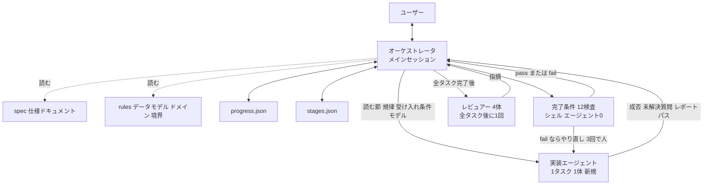

2026-09-16、SmartHR Tech Blog に [Claude Codeで開発期間を2.5か月から1か月に縮めた「ハーネス」の設計手法](https://tech.smarthr.jp/entry/2026/09/16/110205) が公開されました。著者は情シス領域のプロダクトエンジニア ani 氏です。既存プロダクト（モジュラーモノリス）へ、未公開の機能を 1 つ追加したときの開発ハーネスを扱います。出典は当事者の実践報告であり、ハーネス本体のコードは非公開です。

読者が得るものは、手順・進行状態・完了判定の分離、受け入れ条件から最初のテストへの接続、完了判定をモデルの自己申告から外す置き方、既存プロダクトへ移すときの判断材料です。

*この記事の全体像。以下、順に解説します。*

## SmartHRの開発ハーネスとは

ここでいうハーネスは、AI エージェントの周囲環境を先に設計する仕組みです。中身は次の 3 点です。

- 手順を書いたスキルファイル
- 進行状態を持つ JSON
- 完了条件を判定するシェルスクリプト

エージェントへ毎回「次はこれをやって」と口頭で指示するのではなく、どのフェーズで、誰が、何を読んで、何を出力し、何をもって完了とするかを先に定義します。セッションは分解したタスクを 1 つだけ進め、指示内容を会話履歴に依存させません。

登場人物は 4 役です。

- オーケストレータ。実体は Claude Code のメインセッション。フェーズ遷移、ユーザーとの対話、状態ファイルの更新、検査スクリプトの実行を担う。自分では実装しない。仕様の本文とレビューの全文をコンテキストに載せない
- 実装エージェント。分解タスク 1 つにつき 1 体を新規起動し、テスト駆動開発（TDD）でコミットまで行う。ユーザーに質問せず、疑問は未解決質問として戻り値に載せる
- レビュアー 4 体。仕様突合、並行性、認可、機能の完結性。全タスク完了後に 1 回だけ並列起動する。タスク単位では起動しない
- 機械検査。12 項目のシェル。エージェント 0 体。トークンを消費しない

統括役を専任エージェントに挟む形も試した、と著者は書いています。要約ノイズで精度が落ち、トークンも増えたため、進行役はメインセッションが兼ねる形に落ち着いた、と本文は説明します。

仕様の正本、進行状態、実装の隔離、機械検査、人の合意を役割で分けます。

処理は準備フェーズと繰り返しフェーズに分かれます。

準備フェーズでは、依頼と仕様の乖離を 1 件ずつ合意し、仕様ドキュメントと rules へ書き戻します。乖離が残っているあいだはタスク分解に進みません。合意した内容は状態 JSON ではなく仕様側に残します。

繰り返しフェーズでは、1 セッションが分解タスク 1 つに対応します。実装エージェントは指定された仕様の節と規律だけを読み、失敗するテスト、最小実装、整形をコミットします。オーケストレータは検査スクリプトを自分で 1 回実行します。pass なら 3 行報告してセッションを終えます。fail ならやり直し、3 回で人に戻します。区切りのよいところで関係する仕様全体のテストをフル実行し、画面を作ったときは目視確認を依頼します。

受け入れ条件は、そのタスクが終わったと言える条件を数件、文で書いたものです。確定の主体はオーケストレータであり、実装エージェントではありません。例として記事は、設定で無効な対象には作成できない、同じ内容の重複は弾く、ロールバック時は通知しない、を挙げます。起動時に、読む節、守る規律、受け入れ条件、使うモデルを渡します。エージェントが最初に書くテストが、その文の解釈になります。解釈のずれは、実装完了前にテストとして表面化します。

テストは 3 つの役割を同時に持つ、と著者は書きます。曖昧さのないゴールになる。存在しない API の幻覚を実行時に弾く。人が待たずにエージェントが直せる。日本語の指示文よりテストコードの方が精度の高いプロンプトとして働いた、というのが著者の実感です。

渡すものは spec と rules に分けます。矛盾時は rules を正とします。

- spec。何を作るか。唯一の仕様源
- rules。データモデル、ドメイン、境界の 3 ファイルに分けた、常に守ること
- proto。UI プロトタイプ。記事の図では仕様源の 1 つとして並ぶ

rules はパス指定つきファイルに置き、当該機能配下を触ったセッションにだけ読みます。ルートの CLAUDE.md へ書くと、同じリポジトリで別サービスを触るセッションにも常時流れます。やらない実装も rules に書きます。

進行状態は `progress.json` と `stages.json` に外部化し、オーケストレータは毎ターン読み直します。

- `progress.json`。現在のフェーズ、全体進捗、終わったぶんの 1 行サマリ、未確定事項、最終レビュー結果
- `stages.json`。タスク一覧（状態、受け入れ条件、参照する仕様、次タスクへの注意点）。進行中だけを読み、終わったぶんは開かない

確定事項は JSON に残しません。仕様ドキュメント、rules、コードコメントへ書き戻します。JSON に残す判断は、未確定の前提、未回答の質問、次タスクへの注意点 1 行だけです。もともと 1 ファイルだった状態は、10 タスク時点で 118KB まで育ち、分割した、と著者は書きます。

完了判定は 12 項目のシェル検査です。実装エージェントの自己申告は使いません。本文で明示される項目は次です。

- 対象テストが green。件数 0 は fail。RSpec は examples 0 件でも終了コード 0 を返すため
- 機能フラグ OFF で既存挙動と一致。フラグ ON の設定追加も同時に見る
- 変更が許可パス内。許可パス定義ファイルを唯一の実体とする
- パッケージ依存違反の非増加。除外リストへの追記回避も見る
- TDD 痕跡がコミットに残ること

機械判定できない 2 項目、共有テーブル変更と画面側フラグ漏れは、人が目視します。自動で pass にしません。デグレの主な経路だから、と著者は書きます。

最終レビューの 4 観点は次です。

- 仕様突合。仕様書どおりか
- 並行性。同時操作でも壊れないか
- 認可。誰がどの操作をできるか
- 機能の完結性。入口だけで終わっていないか

デッドロックはロックを取る処理が出そろってから判定できます。仕様突合をタスク単位で回すと、未実装を不具合と誤報します。そのため最終段階で 1 回だけ並列起動します。

反証役には次の縛りがあります。

- 単独指摘かつ高修正コストだけを対象にする。複数レビュアーが独立に見つけた指摘へは反証を回さない
- 根拠はコードの該当行かテスト出力だけ。「おそらく問題ない」は認めない
- 白黒不明なら消さず、強度だけ下げて残す。多数決は使わない

モデルはタスクごとに選びます。データモデルや状態遷移のように設計余地が大きいタスクは Opus、決まった型に沿う API・画面追加やテスト追加は Sonnet、が記事の目安です。

## 注意点

「2.5 か月から 1 か月」は、当初見積もり（実質工数おおよそ 2.5 か月）と実績（大きな手戻りなくほぼ 1 か月で実装を一通り終えた）の比較です。対照群はありません。ハーネス構築工数が 1 か月の内外どちらに入るかは本文にありません。機能は未公開で再現実験はできません。入社 3 か月の単一エンジニア、単一機能の事例です。一般的な生産性向上率には換算しません。

著者はまとめ節で、ハーネスは銀の弾丸ではない、プロジェクトによっては不要、インフラ設計のように今回の設計がどのプロジェクトでも使えるとは限らない、と書いています。

「いわゆる二乗のコスト増加」は、会話履歴を毎回送り直すと料金とコンテキストが膨らむ、という著者の説明です。Claude Code 公式の課金式の引用ではありません。状態ファイルが 10 タスク時点で 118KB まで育った、という記述は著者実測です。複数レビュアーが独立に報告した指摘へ反証を回したケースは、結局すべて指摘側が正しかった、と著者は書きます。件数と母数は本文にありません。

fail 時のやり直しについて、記事内の図は一致していません。flowchart は新しい 1 体でやり直すと書き、sequenceDiagram は同じセッション内でやり直すと書きます。3 回で人に戻す点だけが両方に共通します。実装がどちらかは、非公開のハーネスからは確定できません。

完了検査 12 項目の全リストとスクリプトは非公開です。許可パス検査とフラグ OFF 検査は、テストが無い経路では一致判定が空振りしえます。

RSpec が examples 0 件でも終了コード 0 を返す点は、rspec-core の公式 feature と一致します。出典は [fail_if_no_examples](https://rspec.info/features/3-13/rspec-core/configuration/fail-if-no-examples/) と [exit status](https://rspec.info/features/3-12/rspec-core/command-line/exit-status/) です。

path-scoped rules で「必要なセッションにだけ規律が効く」は、公式の意図と一致します。ただし公式は CLAUDE.md と rules を context（案内）であり enforced configuration ではない、と定義します。保証が必要な挙動は PreToolUse hook か permissions へ置きます。出典は [How Claude remembers your project](https://code.claude.com/docs/en/memory.md)（2026-09-17 取得）です。記事自身も、spec や rules の渡し忘れで規律が破れた経験を書いています。path-scoped rules は compaction 後、該当ファイルを再び読むまで消えます。ルート CLAUDE.md は再注入されます。

状態 JSON は `.gitignore` でチーム非共有です。別人が続きをやるときは捨ててゼロから起動します。ハンドオフ前提のチーム設計ではありません。共有すべきものは仕様ドキュメントと rules へ書き戻してある、と著者は説明します。

同じ SmartHR の別チームは、実装が速くなった結果、ボトルネックがコードレビューと QA へ移ったと書いています。[結合テスト工程へのAI導入の現在地](https://tech.smarthr.jp/entry/2026/09/08/093129)（2026-09-08）です。観点作成は Skills で品質が安定するが詳細すぎてレビューしにくい。モブは全体で約 2 時間。人間なら観点のたたき台は 30 分から 1 時間、と書きます。仕様書はたたき台を約 30 分で出せる一方、モブレビューは 3 時間で全体の約 10% だった、とも書きます。実施工程は、ハーネス込みでも人間より速くならずトークンコストで ROI が見込めない、が当該記事の結論です。給与計算チームは、書くコストが下がる一方で読むコストが上がる、個人の短縮とチーム生産性を分けよ、と書きます。[AI活用で生まれた別のコスト](https://tech.smarthr.jp/entry/2026/09/02/120000)（2026-09-02）です。いずれも当該記事の自己申告です。

自己申告の工期短縮を因果効果として扱わない根拠として、METR の early-2025 RCT があります。事前予想が 24% 短縮、事後認識でも 20% 短縮と信じた一方、実測は 19% 遅かった、と報告します。母集団は熟練 OSS 開発者の短時間タスクであり、本事例（入社 3 か月の単一エンジニア、月単位の機能追加、Claude Code ハーネス）とは違います。直結して「このハーネスも過大申告だ」とは言えません。出典は [Measuring the Impact of Early-2025 AI on Experienced Open-Source Developer Productivity](https://metr.org/blog/2025-07-10-early-2025-ai-experienced-os-dev-study/)（2025-07-10）です。同ページは outdated と注記し、[We are Changing our Developer Productivity Experiment Design](https://metr.org/blog/2026-02-24-uplift-update/)（2026-02-24）へ送ります。更新側は選択バイアスで信号が信頼できないとし、復帰開発者の点推定は -18%（短縮側、CI は -38% から +9%）です。

## 受け入れ条件を実装の外で確定する

持ち帰る対象は「2.5 か月が 1 か月になった」という倍率ではありません。手順、状態、完了判定を分け、受け入れ条件を実装エージェントの外で確定し、最初のテストで解釈を固定し、次工程の合否をシェルへ移す、という責務配置です。適用範囲は、既存モノリスへの機能追加で、仕様を人と合意できる場合に限ります。

流れは次です。

1. 準備フェーズで人と乖離を合意し、仕様へ書き戻す
2. タスク分解で、タスク固有の受け入れ条件を文で書く
3. 起動時に、読む節、守る規律、受け入れ条件、使うモデルを渡す
4. エージェントが最初に書くテストが、その文の解釈になる
5. シェルがテスト件数と green、許可パス、フラグ OFF などを機械判定する
6. タスクをまたぐ欠陥は、最後のレビュアー 4 体と人が見る

はてなブックマークのコメントにも、「プロンプトよりテストコードの方が AI には効く」という同意が 1 件あります（2026-09-16、nguyen-oi）。設計の一次証拠ではありません。

3 点セットと 4 役の分担は、本文と図で一貫しています。受け入れ条件をオーケストレータが渡し、TDD の最初のテストで解釈を見る、という接続が明示されています。テスト 0 件を fail にする理由が、RSpec 公式動作と一致します。path-scoped rules の動機が、公式ドキュメントの「必要なときだけ読む」と一致します。最終レビューをタスク単位で回さない理由が、分解の副作用として筋が通ります。

残る穴は次です。ハーネス構築に何人日かかったか。12 項目の残り項目の中身。許可パス検査とフラグ OFF 検査のカバレッジ。オーケストレータ本体のコンテキストが、タスク数が増えたときにどこまで持つか。公式 dynamic workflows を使わなかった技術的理由の一次記述。機能公開後の本番デグレの有無。同一ハーネスを別エンジニアがゼロから起動したときの再現。これらは採用判断を止めるほどではありません。倍率の引用と、検査スクリプト無しの丸コピーを止めます。

## 公式の仕組みとの対応

記事の部品と、近い公式機構は次です。

| 記事の部品 | 近い公式機構 | 強制力 |
|---|---|---|
| スキルファイル | Agent Skills | 案内。invoke 時に読む |
| パス指定つき rules | `.claude/rules/` の `paths` | 案内。マッチファイルを読んだときにロード |
| ルート常時指示を避ける | CLAUDE.md は 200 行未満が目安。長いと adherence が落ちる | 案内 |
| 1 タスク 1 体 | サブエージェント（会話履歴を引き継がない） | 隔離 |
| 完了 12 検査 | hook や自前シェル。公式 dynamic workflows の「計画をコードへ」に近いが、記事は判定だけコード化 | 実行結果で強制 |
| フェーズ遷移と人合意 | メインセッション | 人が介在する |

公式の [dynamic workflows](https://code.claude.com/docs/en/workflows) は、次に何を走らせるかをスクリプトが決めます。制約に「No mid-run user input」があります。記事は準備フェーズでユーザー合意を必須にしています。メインセッションを進行役にしたのは、統括エージェントを挟むと要約ノイズで精度が落ちた、という著者の試行が本文の理由です。workflows 制約との衝突は本文にありません。仮説にとどめます。

案内（skills、rules）と強制（hook、シェル、CI）は別物です。読まれなければ rules は効きません。強制はシェル側の項目に落ちた範囲に限ります。

## 既存プロダクトへ移すときの判断

既存プロダクトへエージェントで機能追加するときに、本事例から移してよいのは次です。

1. 受け入れ条件の確定主体を実装エージェントの外に置く
2. 最初の成果物を実装ではなく、受け入れ条件を解釈したテストにする
3. 次工程へ進む条件のうち機械化できるものを、モデルの自己申告から外す（テスト件数 0 の fail を含む）
4. 案内（skills、rules）と強制（hook、シェル、CI）を分けて書く
5. タスク横断の欠陥（並行性、認可、導線の完結）は、タスク単位レビューに期待しない

移さない方がよいのは次です。

- 見積比を KPI にする
- 状態 JSON をチームの正本にする
- ハーネス全体をインフラ設計や探索的な仕様作業へそのまま載せる
- QA 結合テストまで同じ形で速くなる、と見込む

検収の置き方は、予防（spec と rules と受け入れ条件）、実行可能検査（12 項目シェル）、人間（準備合意と最終レビューと機械不能の 2 項目）の三層です。実証は単一事例にとどまります。

## まとめ

SmartHR の情シス領域プロダクトエンジニアが公開したのは、スキル（手順）、JSON（進行）、シェル（完了判定）を分けた開発ハーネスです。オーケストレータはメインセッションが兼ね、実装エージェントは 1 タスク 1 体、完了は 12 項目のシェル、横断欠陥は最後のレビュアー 4 体、が役割分担です。受け入れ条件は実装の外で確定し、最初のテストがその解釈になります。

「2.5 か月から 1 か月」は単一事例の見積比較であり、対照群もハーネス構築工数もありません。移してよいのは責務配置であり、見積比や状態 JSON のチーム正本化ではありません。案内と強制を分け、機械化できる合否を自己申告から外す、が既存プロダクトへ載せるときの芯です。

この記事が少しでも参考になった、あるいは改善点などがあれば、ぜひリアクションやコメント、SNSでのシェアをいただけると励みになります！

## 参考リンク

1. ani, 「Claude Codeで開発期間を2.5か月から1か月に縮めた「ハーネス」の設計手法」, SmartHR Tech Blog, 2026-09-16. https://tech.smarthr.jp/entry/2026/09/16/110205
2. Anthropic, 「How Claude remembers your project」, Claude Code Docs. https://code.claude.com/docs/en/memory.md （2026-09-17 取得）
3. Anthropic, 「Orchestrate subagents at scale with dynamic workflows」, Claude Code Docs. https://code.claude.com/docs/en/workflows （2026-09-17 取得）
4. RSpec, 「fail_if_no_examples」. https://rspec.info/features/3-13/rspec-core/configuration/fail-if-no-examples/
5. RSpec, 「exit status」. https://rspec.info/features/3-12/rspec-core/command-line/exit-status/
6. delhi09, 「結合テスト工程へのAI導入の現在地」, SmartHR Tech Blog, 2026-09-08. https://tech.smarthr.jp/entry/2026/09/08/093129
7. @r, 「AI活用で生まれた別のコスト」, SmartHR Tech Blog, 2026-09-02. https://tech.smarthr.jp/entry/2026/09/02/120000
8. Becker, Rush, Barnes, Rein, 「Measuring the Impact of Early-2025 AI on Experienced Open-Source Developer Productivity」, METR, 2025-07-10. https://metr.org/blog/2025-07-10-early-2025-ai-experienced-os-dev-study/ （arXiv:2507.09089。ページ上で outdated 注記）
9. Becker ほか, 「We are Changing our Developer Productivity Experiment Design」, METR, 2026-02-24. https://metr.org/blog/2026-02-24-uplift-update/
10. はてなブックマーク当該エントリ（約 130 users、2026-09-17 時点。取得のたびに増減する）。 https://b.hatena.ne.jp/entry/s/tech.smarthr.jp/entry/2026/09/16/110205
