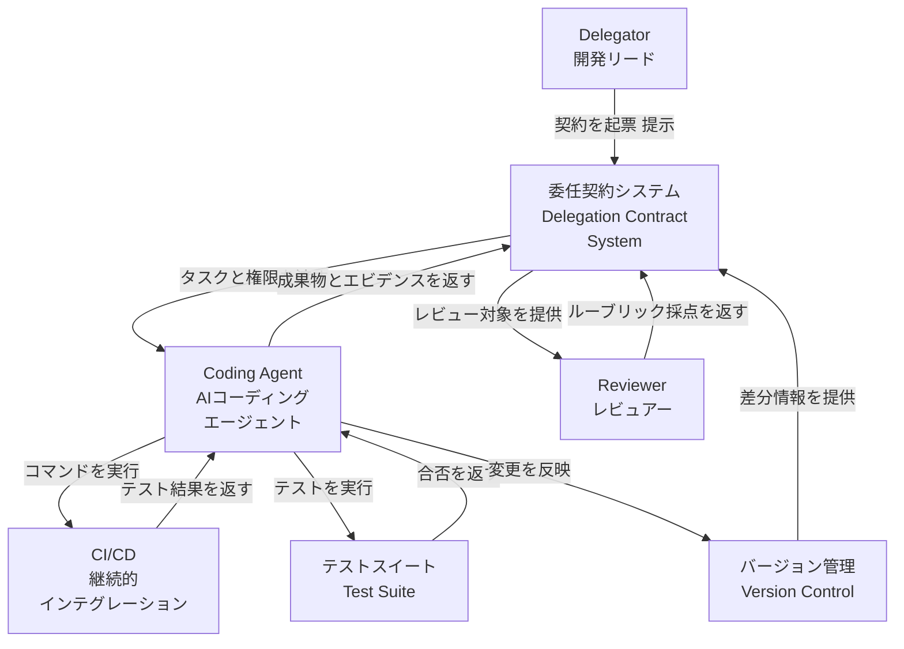
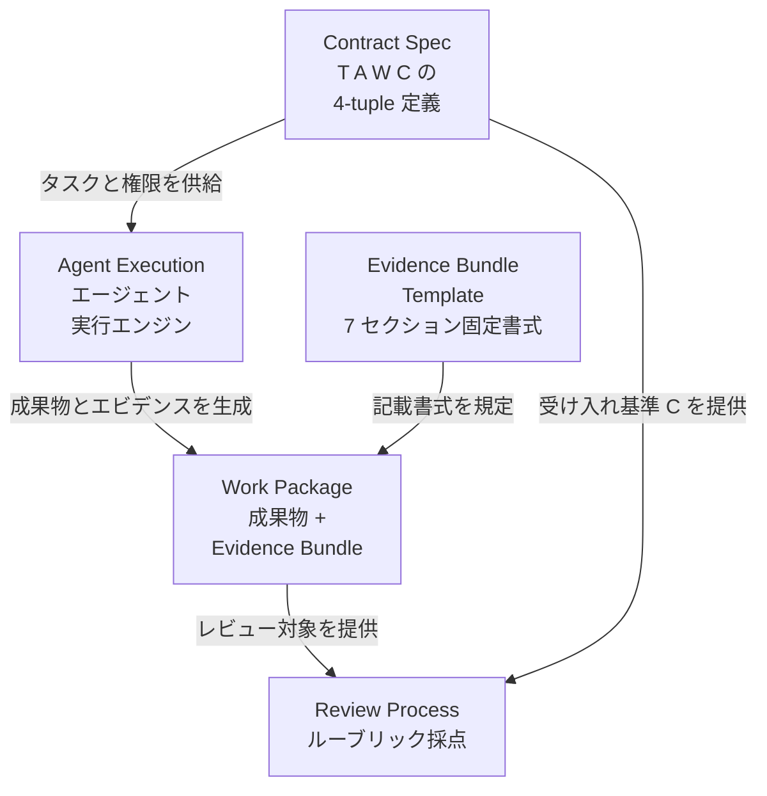
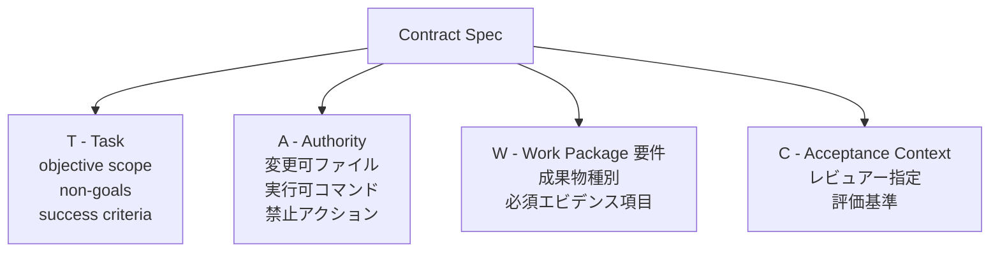
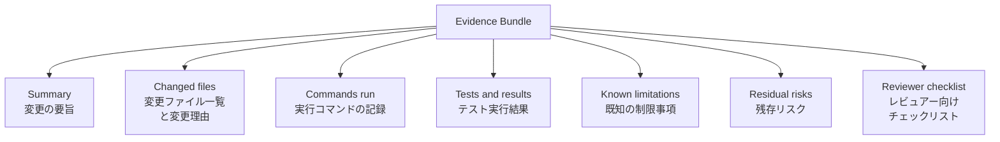
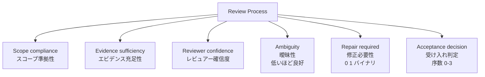
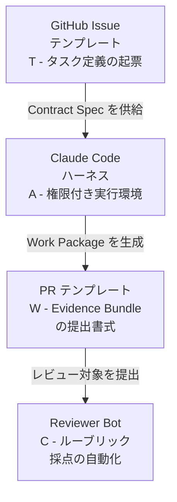
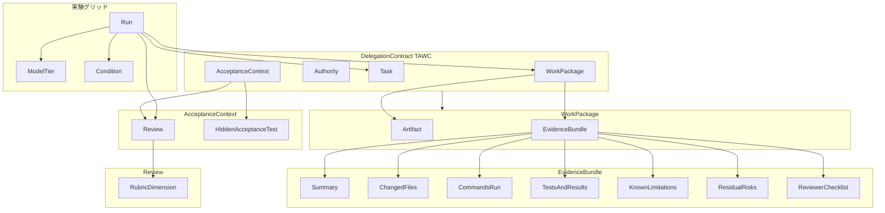
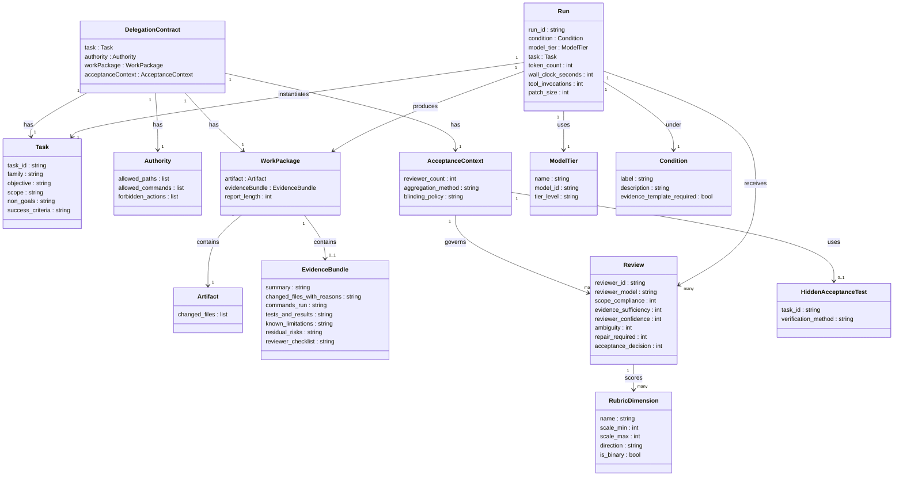

> 調査対象: 論文 **Software Delegation Contracts: Measuring Reviewability in AI Coding-Agent Work** (arXiv [2606.17099](https://arxiv.org/abs/2606.17099), Vincent Schmalbach, 2026-06-14)
> 本記事は論文・方法論の技術調査です。C4 は委任契約フレームワークの論理構造に読み替えています。本文中「実装案」と付記したコードは論文の主張ではなく、公式ドキュメントを参照した実装提案です。

## ■概要

### 論文の目的と位置づけ

AIコーディングエージェントは、タスクを受け取りリポジトリを変更してパッチを返すところまで自走できるようになりました。しかし人間のレビュアーが直面する問題は「動くか」から「レビューできるか」へ移行しつつあります。本論文は、この **レビュー可能性 (reviewability)** を構造的に高める手段として「委任契約 (Delegation Contract)」を定義し、その効果を対照実験で測定しました。

> "Contracts buy reviewability, not correctness, on tasks like these."
> — Schmalbach 2026, 中核的発見

論文の主張を一文で言えば、**委任契約は正しさを買うのではなくレビュー可能性を買う**、です。AIエージェントの客観的な成果品質 (テスト合否・スコープ違反) は契約の有無によらず飽和しますが、エビデンスの充実度と曖昧さ低減は契約によって大きく改善されました。

### 解決しようとする問題

現行の「issue風プロンプト → PR」フローでは、エージェントが何を変更したか・なぜ変更したか・何をテストしたか・残留リスクは何かが返却物に含まれません。レビュアーは成果物を見て自力で文脈を再構成する必要があり、レビュー詰まり (review bottleneck) が生じます。委任契約はこの問題を「最初から何を返却させるかを契約として明示する」ことで解決します。

### 想定読者

- LLMOps / AI開発基盤チーム: エージェント実行の出力仕様設計
- 開発リード / エンジニアリングマネージャー: AIエージェントへの委任ポリシー設計
- レビュー設計者 / DevEx担当: レビュープロセスのスケール設計

### 関連概念との関係

| 関連概念 | 委任契約との関係 |
|---|---|
| issue prompt → PR フロー | issue テキストをそのままプロンプトにする現行方式を拡張し、Authority (許可範囲) と Acceptance Context (受け入れ基準) を明示する |
| Code Review | レビュー対象を「diff のみ」から「diff + Evidence Bundle」に拡大する |
| Agent Evaluation (SWE-bench 等) | タスク解決率 (pass/fail) を最大化する評価軸に対し、解決を一定とした上で「人間がレビューできるか」を測る別軸を導入する |
| Principal-Agent 理論 | principal (依頼主) が agent (代理人) にエビデンス開示を要求する政策手段として「契約」を位置づける |

## ■特徴

- **委任契約の形式定義**: 委任契約を 4-tuple ⟨T, A, W, C⟩ (Task / Authority / Work package / Acceptance context) として定式化し、明示的な契約として実験で操作しました。暗黙的だった委任の要素を構造化した点が本研究の起点です。
- **Evidence Bundle テンプレートの提案**: Summary / Changed files / Commands run / Tests and results / Known limitations / Residual risks / Reviewer checklist の 7 固定セクションからなる返却物テンプレートを定義しました。
- **64 runs / 192 reviews の対照実験**: A/B 条件を 10 タスク × 2 モデルティア (Sonnet 4.6 / Haiku 4.5) で実施し (40 runs)、さらに Sonnet の replicate (10 タスク × A/B = 20 runs) と C 条件の 4-run preview を加えて計 64 runs としました。条件ブラインドな 3 独立モデルレビュアーによる固定ルーブリック評価 (median-of-three) で再現性を担保しました。
- **Reviewability と Correctness の解離発見**: 全 64 runs で客観成果 (hidden test pass / スコープ違反ゼロ) が飽和する一方、エビデンス充実度は条件間で大幅に差異が出ました。本実験条件 (小規模・十分仕様化されたタスク) では、客観成果が天井に達する一方で reviewability 指標だけが改善し、少なくとも小タスクでは両者が乖離しうることを示しました。
- **モデルティア効果の逆説**: より能力の低い Haiku の方が契約による恩恵が大きい結果でした (evidence +1.00 vs Sonnet +0.75, ambiguity −0.50 vs −0.10)。契約はモデル能力の弱さを構造で補う可能性を示しました。
- **コストの定量計測**: tokens / wall-clock time / tool invocations / patch size の 4 指標でコスト増加を計測しました。

### 条件 A / B / C の比較

| 項目 | A: Baseline | B: Contract | C: Contract + Bundle |
|---|---|---|---|
| プロンプト形式 | issue 風の自然文 | 構造化委任契約 ⟨T,A,W,C⟩ | B + 必須返却テンプレート |
| 指定する内容 | タスクの説明のみ | Objective / Non-goals / Authority / Expected tests / Required evidence / Acceptance criteria | B の全要素 + Evidence Bundle 固定セクション |
| 返却物の構造 | エージェント任意 | 契約に沿った成果物 | 7 セクション固定の Evidence Bundle |
| レビュー可能性への効果 | 基準 | Evidence sufficiency +0.83 (5点尺度), Ambiguity −0.23 | preview 4 件は上限スコア (evidence 5.0 / ambiguity 1.0) だが効果推定は不可 |
| 客観成果への効果 | 全 64 runs が pass・違反ゼロ | 同左 (条件間で差なし) | 同左 |
| 変更ファイルに理由付き | 7% | 93% | 100% |
| 残留リスク記載 | 0% | 0% | 100% |
| レビュアーチェックリスト | 0% | 0% | 100% |

> 条件 C は 4-run preview のためサンプル規模が小さく、B との差異は参考値です。
> 残留リスク・レビュアーチェックリストは条件 B (契約) でも自発記載は 0% で、必須テンプレート (条件 C) で初めて 100% になります。

## ■構造

委任契約フレームワークの論理構造を C4 model の 3 段階で示します。論文は具体システムを持たないため、C4 を「委任契約の運用パイプライン」の論理構造に読み替えています。

### ●システムコンテキスト図

委任契約システムと外部アクター・外部システムの関係を示します。



| 要素 | 説明 |
|---|---|
| Delegator | 委任契約を作成し、エージェントに提示する。開発リードや人間の依頼者に相当する |
| Coding Agent | 契約の T・A に従って作業を実行し、W (成果物+エビデンス) を返す |
| Reviewer | C (受け入れコンテキスト) に定められた基準でルーブリック採点を行う。条件ブラインドで評価する |
| 委任契約システム | 4-tuple ⟨T,A,W,C⟩ を中心に契約の起票・実行・レビューを調整する論理的な中核 |
| CI/CD | エージェントがコマンドを発行する外部実行環境。テストの合否を返す |
| テストスイート | 隠蔽された受け入れテスト群。客観成果の判定に使われる |
| バージョン管理 | 変更ファイルの差分を保持する外部リポジトリ。エビデンスの一部を構成する |

### ●コンテナ図

委任契約フローを構成する主要要素を示します。



| コンテナ | 説明 |
|---|---|
| Contract Spec | 委任契約の 4-tuple ⟨T,A,W,C⟩ を定義する仕様書。タスク・権限・成果物要件・受け入れ基準を一括記述する |
| Agent Execution | Coding Agent が契約を解釈し、変更・コマンド実行・テストを実施するエンジン層 |
| Work Package | エージェントが返す成果物とエビデンスのまとまり。Evidence Bundle Template に従って構造化される |
| Evidence Bundle Template | 7 セクションで構成される固定書式。条件 C で必須化され、レビュー可能性を高める |
| Review Process | 3 名の独立レビュアーがルーブリック 6 次元で採点するプロセス。条件ブラインドで実施される |

### ●コンポーネント図

各コンテナの内部構成要素を示します。

#### Contract Spec の内部構成



| コンポーネント | 説明 |
|---|---|
| T - Task | タスクの目的・スコープ・非目的・成功基準を記述する。エージェントが何をすべきかを規定する |
| A - Authority | 変更してよいファイル、実行してよいコマンド、禁止アクションを列挙する。スコープ逸脱を防ぐ |
| W - Work Package 要件 | 返却すべき成果物 (artifact) とエビデンス (changed files / commands / test results / limitations) を定める。条件 C ではさらに 7 セクションの Evidence Bundle Template を必須化する |
| C - Acceptance Context | 誰がどの基準でレビューするかを定める |

#### Evidence Bundle の内部構成



| セクション | 説明 |
|---|---|
| Summary | 変更全体の要旨を簡潔に述べる。レビュアーが最初に読む入口となる |
| Changed files | 変更したファイルと各変更の理由を列挙する。Baseline 7% から Contract 条件で 93% に達した |
| Commands run | エージェントが実行したコマンドを記録する。Baseline 7% から Contract 条件で 70% に改善した |
| Tests and results | テストの実行結果を示す。受け入れテストの合否を客観的に証明する |
| Known limitations | 実装上の既知制約を明示する。出現率は A 0% → B 80% → C 100% |
| Residual risks | 受け入れ後に残るリスクを列挙する。出現率は A 0% → B 0% → C 100%。契約 (B) だけでは自発記載されず、必須テンプレート (C) で初めて出現する |
| Reviewer checklist | レビュアーが確認すべき項目を提示する。出現率は A 0% → B 0% → C 100%。Residual risks と同じく必須テンプレート (C) で初めて出現する |

#### Review Process の内部構成



| 次元 | 説明 |
|---|---|
| Scope compliance | エージェントの作業が契約 T・A で定めたスコープに収まっているかを評価する |
| Evidence sufficiency | エビデンスの充足性を評価する。最も大きく改善した主要指標 (+0.83, Cliff's δ = 0.66) |
| Reviewer confidence | レビュアーが判断に自信を持てるかを評価する |
| Ambiguity | 成果物や説明の曖昧さを評価する。低いほど望ましく、Contract 条件で −0.23 改善した |
| Repair required | 受け入れ前に修正が必要かをバイナリで判定する。両条件で 0.00 を記録し天井効果を示した |
| Acceptance decision | 受け入れ可否を序数 0-3 で判定する。全体平均 0.03 ポイントの改善にとどまった (p = 0.56) |

#### 実装例: Claude Code + GitHub テンプレート



| 実装要素 | 論文対応 | 説明 |
|---|---|---|
| GitHub Issue テンプレート | T (Task) | タスク定義・スコープ・成功基準を構造化して記述する起票フォーム |
| Claude Code ハーネス | A (Authority) + Agent Execution | 実験で使用された実行基盤。権限範囲を設定しエージェントを起動する |
| PR テンプレート | W (Work Package) | Evidence Bundle の 7 セクションを PR 本文書式として実装する |
| Reviewer Bot | C (Acceptance Context) | ルーブリック 6 次元での採点を自動化する。実験では 3 名の独立モデルレビュアーとして実装された |

> 上図は論文の方法論を Claude Code + GitHub で実装する一例です。論文自体は特定のツール構成を規定していません。

## ■データ

論文に登場する主要エンティティの概念モデルと情報モデルを示します。

### ●概念モデル

委任契約 ⟨T,A,W,C⟩ を中心に、実験設計を支えるエンティティ群を示します。



| 要素 | 説明 |
|---|---|
| DelegationContract | 委任契約。Task / Authority / WorkPackage / AcceptanceContext の 4 要素を持つ |
| Task | タスクの目的・スコープ・非目的・成功基準 |
| Authority | 許可パス・許可コマンド・禁止アクション |
| WorkPackage | 成果物 (Artifact) とエビデンス (EvidenceBundle) のまとまり |
| EvidenceBundle | 7 セクションのエビデンス報告 |
| AcceptanceContext | レビューと隠し受け入れテストを束ねる受け入れ文脈 |
| Review | 1 ランあたり 3 名の独立レビュアーによる採点 |
| RubricDimension | レビューの 6 評価次元 |
| Run / ModelTier / Condition | 実験グリッド (実行・モデルティア・条件) |

### ●情報モデル

各エンティティの主要属性を示します。属性が論文に明示されていない場合は「推測」と注記します。



#### 主要エンティティの属性補足

| エンティティ | 主な属性 | 出典 |
|---|---|---|
| Task | task_id (T01〜T10) / family (5 ファミリー) / objective / scope / non_goals / success_criteria | 論文明示 |
| Authority | allowed_paths / allowed_commands / forbidden_actions | 論文明示 |
| WorkPackage | artifact / evidenceBundle / report_length (Contract で増加) | 論文明示 |
| EvidenceBundle | summary / changed_files_with_reasons / commands_run / tests_and_results / known_limitations / residual_risks / reviewer_checklist | 論文明示 |
| Review | scope_compliance / evidence_sufficiency / reviewer_confidence / ambiguity / repair_required / acceptance_decision | 論文明示 |
| Run | condition (A/B/C) / model_tier / task / token_count / wall_clock_seconds / tool_invocations / patch_size | 論文明示 (run_id は推測) |
| ModelTier | Sonnet 4.6 (strong) / Haiku 4.5 (weak) | 論文明示 |
| AcceptanceContext | reviewer_count = 3 / 集計方式 / blinding_policy | 論文明示 |

#### ルーブリック 6 次元

| 次元 | スケール | 方向 |
|---|---|---|
| scope_compliance | 1〜5 | 高い方が良い |
| evidence_sufficiency | 1〜5 | 高い方が良い |
| reviewer_confidence | 1〜5 | 高い方が良い |
| ambiguity | 1〜5 | 低い方が良い |
| repair_required | 0/1 | 0 が良い |
| acceptance_decision | 0〜3 | 高い方が良い |

#### エンティティ多重度まとめ

| 関係 | 多重度 |
|---|---|
| DelegationContract → Task / Authority / WorkPackage / AcceptanceContext | 各 1 対 1 |
| WorkPackage → EvidenceBundle | 1 対 0..1 (条件次第) |
| Run → Review | 1 対 3 (独立レビュアー) |
| Review → RubricDimension | 1 対 6 |
| 実験全体 | 64 runs × 3 reviews = 192 reviews |

## ■構築方法

> 本セクションは論文の方法論を現場で実装する具体例を補完します。「実装案」と付記したものは論文の主張ではなく、公式ドキュメントを参照した実装提案です。

### 委任契約テンプレートの定義

論文は ⟨T, A, W, C⟩ の 4-tuple を構造化プロンプトとして渡す方式を採用しています。Markdown と YAML の両形式で表現できます。

**Markdown 形式 (実装案: `.claude/templates/delegation-contract.md`)**

```markdown
# 委任契約: {タスク名}

## Task (T)
- Objective: {達成目標を1文で}
- Scope: {変更してよいファイル・モジュールの範囲}
- Non-goals: {今回は対象外とすること}
- Success criteria: {完了の判断基準。テスト合格・型チェック通過など}

## Authority (A)
- Allowed paths: {変更可能なパス。例: src/api/**, tests/**}
- Allowed commands: {実行可能なコマンド。例: npm run test, npm run build}
- Forbidden actions: {禁止事項。例: 依存変更, node_modules 書き換え, git commit}

## Expected Work Package (W)
以下の 7 セクションを含む Evidence Bundle を返してください:
1. Summary
2. Changed files (変更理由付き)
3. Commands run
4. Tests and results
5. Known limitations
6. Residual risks
7. Reviewer checklist

## Acceptance Context (C)
- Reviewer: {担当者 / チーム名}
- Review rubric: scope_compliance / evidence_sufficiency / reviewer_confidence / ambiguity / repair_required / acceptance_decision
```

**YAML 形式 (実装案: `.claude/templates/delegation-contract.yaml`)**

```yaml
contract:
  task:
    objective: ""
    scope: []
    non_goals: []
    success_criteria: []
  authority:
    allowed_paths: []
    allowed_commands: []
    forbidden_actions:
      - "modify package.json"
      - "modify node_modules"
      - "git commit"
      - "git push"
  work_package:
    required_sections:
      - summary
      - changed_files_with_reasons
      - commands_run
      - tests_and_results
      - known_limitations
      - residual_risks
      - reviewer_checklist
  acceptance_context:
    reviewers: []
    rubric: scope_compliance,evidence_sufficiency,reviewer_confidence,ambiguity,repair_required,acceptance_decision
```

### Evidence Bundle テンプレートの雛形

論文実験 (Condition C) で用いた Evidence Bundle の 7 セクション構成です。PR 本文またはエージェント出力の定型フォーマットとして使用します。

**実装案: `.github/PULL_REQUEST_TEMPLATE.md`**

```markdown
## Summary
<!-- 何を・なぜ変更したかを2〜3文で -->

## Changed files
| ファイル | 変更内容 | 変更理由 |
|---|---|---|
|  |  |  |

## Commands run
<!-- 実行したコマンドを順番に列挙 -->

## Tests and results
<!-- テスト実行結果を貼り付け -->

## Known limitations
<!-- 今回の実装で対応できなかった既知の制約 -->

## Residual risks
<!-- レビュアーが注意すべき残存リスク -->

## Reviewer checklist
- [ ] scope compliance: 許可されたファイルのみ変更されているか
- [ ] evidence sufficiency: 変更理由・テスト結果が十分か
- [ ] known limitations が正直に記載されているか
- [ ] residual risks を理解して accept するか
```

> **論文知見**: `residual_risks` と `reviewer_checklist` は「要求したときだけ出現する (demand-driven)」セクションです。契約構造を渡すだけの条件 B でも自発出現率は 0% のままで、必須テンプレートを課す条件 C で初めて 100% になりました。テンプレートに必須フィールドとして固定することが出現の条件です。

### Authority を Claude Code と GitHub で実装する

#### Claude Code settings.json (実装案)

`.claude/settings.json` に `permissions` を定義することで、エージェントが触れるツール・コマンド・ファイルを制限できます。

```json
{
  "permissions": {
    "allow": [
      "Read(src/**)",
      "Edit(src/**)",
      "Edit(tests/**)",
      "Bash(npm run test)",
      "Bash(npm run build)",
      "Bash(npm run lint)",
      "Bash(git diff:*)",
      "Bash(git status)"
    ],
    "deny": [
      "Edit(package.json)",
      "Edit(package-lock.json)",
      "Edit(.env)",
      "Bash(git commit:*)",
      "Bash(git push:*)",
      "Bash(npm install:*)"
    ]
  }
}
```

> **実装注**: permissions は `deny` → `ask` → `allow` の順で評価され、最初にマッチしたルールが適用されます。`deny` にマッチした呼び出しは、より広い `allow` があってもブロックされます (allow による例外指定はできません)。禁止アクションは `deny` に列挙して確実に止めます (参考: Claude Code Permissions ドキュメント)。

#### CLAUDE.md による自然言語制約 (実装案)

```markdown
## Authority (このセッションの権限範囲)

### 変更可能なファイル
- src/ 以下のすべての TypeScript ファイル
- tests/ 以下のすべてのテストファイル

### 実行可能なコマンド
- npm run test / npm run build / npm run lint

### 禁止アクション
- package.json / package-lock.json の変更
- node_modules/ への書き込み
- git commit / git push の実行
```

> **実装注**: CLAUDE.md はモデルの行動を指示しますが、権限境界は `settings.json` の `permissions` が Claude Code のツール使用レベルで強制します。双方を組み合わせることで「意図 (CLAUDE.md) + 強制 (settings.json)」の二重防護になります。なお Bash の子プロセスが間接的に行う読み書きまで OS レベルで閉じるには、permissions に加えて sandbox の併用が必要です。

#### GitHub CODEOWNERS (実装案)

委任契約の「Acceptance Context (C)」に対応するレビュアー指定を自動化します。CODEOWNERS のパターン記法は `.gitignore` に似ていますが、**最後にマッチしたルールが優先**されます。ただし `!` による否定や文字範囲など一部の gitignore 構文は使えません。

```
# .github/CODEOWNERS
*                   @org/senior-engineers
src/api/**          @org/senior-engineers @org/security-team
tests/**            @org/qa-team
package.json        @org/team-leads
```

## ■利用方法

### Issue / タスクを委任契約に変換する手順

| ステップ | 内容 |
|---|---|
| 1. T を抽出 | Issue タイトルを objective に、本文の詳細を scope・non-goals に変換する |
| 2. A を定義 | 変更が予想されるファイルを allowed_paths に、テスト実行コマンドを allowed_commands に列挙し、禁止アクションを forbidden_actions に明示する |
| 3. W を固定 | Evidence Bundle の 7 セクションを必須にする。とくに residual_risks と reviewer_checklist はテンプレートに固定しないと出現しない (論文実測: 条件 A・B とも 0%、必須テンプレートの C で 100%) |
| 4. C を設定 | CODEOWNERS でレビュアーを自動アサインし、ルーブリックの評価軸を PR テンプレに埋め込む |

### エージェントへの委任契約の渡し方

委任契約はプロンプトの冒頭に構造化ブロックとして渡します。

**実装案: プロンプト構造例**

```text
以下の委任契約に従ってタスクを実行してください。

## Task (T)
- Objective: バリデーション関数 validateEmail の入力境界バグを修正する
- Scope: src/validators/email.ts, tests/validators/email.test.ts
- Non-goals: メールフォーマット仕様の拡張、他のバリデーション関数への変更
- Success criteria: npm run test が全テストパス、型エラーゼロ

## Authority (A)
- Allowed paths: src/validators/email.ts, tests/validators/email.test.ts
- Allowed commands: npm run test, npm run build, npm run lint
- Forbidden actions: package.json 変更, git commit, git push

## Expected Work Package (W)
以下の 7 セクションを含む Evidence Bundle を返してください:
1. Summary
2. Changed files (変更ファイル名と変更理由)
3. Commands run (実行したコマンドと出力)
4. Tests and results (テスト結果の全文)
5. Known limitations (今回対応できなかった制約)
6. Residual risks (レビュアーが注意すべきリスク)
7. Reviewer checklist (レビュアーが確認すべき項目)

では開始してください。
```

> **論文知見**: Baseline (Issue 風プロンプト) と比較して、Contract 条件では「変更理由付きファイル一覧」が 7% → 93%、「実行コマンド記録」が 7% → 70% に向上しました。明示的な構造が Evidence Bundle の充実に直結します。

### 返却された Work Package のレビュー手順

エージェントが返却した Work Package を、論文実験と同じ 6 次元ルーブリックで採点します。

**実装案: レビュールーブリック**

```markdown
| 次元 | スケール | 評価 | コメント |
|---|---|---|---|
| scope_compliance | 1〜5 (5=完全準拠) | | 許可されたファイルのみ変更したか |
| evidence_sufficiency | 1〜5 (5=十分) | | 変更理由・テスト結果が読んで判断できるか |
| reviewer_confidence | 1〜5 (5=高い) | | accept に自信を持てるか |
| ambiguity | 1〜5 (1=低=良い) | | 不明点・曖昧な記述が少ないか |
| repair_required | 0/1 (0=不要) | | 追加修正が必要か |
| acceptance_decision | 0〜3 (3=即 merge) | | 0=reject / 3=accept |
```

**採点後のアクション判断**:

- `acceptance_decision = 3` かつ `repair_required = 0` → merge
- `ambiguity` が高い → `Known limitations` / `Residual risks` を確認し、判断不能な箇所を差し戻す
- `scope_compliance` が 4 以下 → `Changed files` で許可外パスへの変更がないか確認する
- `evidence_sufficiency` が 3 以下 → `Commands run` / `Tests and results` の詳細を要求して再提出を依頼する

> **論文知見**: Baseline の evidence_sufficiency 平均 3.90 が Contract で 4.73 (+0.83, p<0.0001) に向上しました。accept rate は 0.86 → 0.93 と動きましたが p=0.12 で統計的有意ではなく、acceptance decision も 2.93 → 2.97 (p=0.56) とほぼ変化しません。改善したのはレビュー可能性であって受け入れ判定そのものではありません。

## ■運用

### 委任契約をいつ使うか / 使わないか

論文の中核的警告は「小タスクでは正しさは天井に達する」です。全 64 runs が隠しテストをすべてパスし、スコープ違反はゼロでした。契約が改善したのは **reviewability** であって **correctness** ではありません。

- **使う価値が高いケース**: リスキーな変更 (破壊的 API 変更・認証周りの修正)、大型機能追加、複数ファイルにまたがるリファクタリング。これらは正しさの天井が低く、エビデンスによるレビュー支援の効果が出やすいと推定されます (論文は未検証・著者の open question)。
- **コスト過剰になりやすいケース**: 1〜2 ファイル修正・typo fix など、レビュー証跡がそもそも不要な軽微な作業。正しさは天井に達しており、証跡が要らないなら +38% の wall-clock time が見合いません。なおドキュメント更新は evidence 改善が大きい側なので、レビュー証跡を残したい場合は契約の効果が出ます。

```python
# 判断フロー (実装補完)
if task_risk == "low" and file_count <= 2:
    use_contract = False   # issue 風プロンプトで十分
else:
    use_contract = True    # 委任契約 + Evidence Bundle を使う
```

### タスクファミリ別の傾向 (論文データ)

| タスクタイプ | evidence 改善 | 備考 |
|---|---|---|
| ドキュメント更新 | 大 | ベースラインが casual ask なため改善幅が大きい |
| 単純バグ修正 | 大 | 直接的な修正で効果が出やすい |
| スコープ付きリファクタリング | 小〜マイナス | 「一箇所にまとめる」基準が曖昧な判断を呼び込み、ambiguity が悪化した事例あり |

リファクタリングでは「共有ヘルパーがページネーションオフセットも計算すべきか」といったインターフェース設計の判断がレビュアーに浮かび上がり、契約の基準が逆に精査 (scrutiny) を高める場合があります。

### コスト管理

| メトリクス | 増加率 | 有意性 |
|---|---|---|
| Agent tokens | +13.0% | p=0.0002 |
| Wall-clock time | +38.3% | p<0.0001 |
| Tool invocations | +23.3% | p=0.0012 |
| Patch size | +44.7% | — |

パッチサイズの増加は本番コードの増加ではなく追加テストの増加が主因です。

- **許容できる**: レビュアーの人件費が節約できるなら、+38% の実行時間増は割に合う可能性があります。ただし論文はレビュー時間を実測しておらず、トータルコストは未知です。
- **許容しにくい**: CI/CD の並列ジョブ数が少ない環境や API コストが支配的なバッチ処理では、+13% tokens × タスク数のコスト増が積み上がります。
- **目安**: 1 タスクあたり約 +13% tokens・+38% latency を予算に見込みます。

### レビュー結果の蓄積

```yaml
# Evidence Bundle 評価記録のサンプル (実装補完)
task_id: T07
model: haiku-4.5
condition: contract
rubric:
  scope_compliance: 4
  evidence_sufficiency: 4
  reviewer_confidence: 5
  ambiguity: 1
  repair_required: false
  acceptance_decision: 3
notes: "shared helper の設計判断でレビュアーが迷った"
```

スコアを蓄積することで、タスクファミリ・モデルティア別の「契約の効きやすさ」パターンが見えてきます。evidence_sufficiency が継続して低い場合は、Work package テンプレートの required セクションを見直すシグナルです。

## ■ベストプラクティス

### evidence sufficiency を上げる返却物設計

論文が明示した「即効性の高い必須化」の優先順位です。

1. **最優先**: `changed files with reasons` と `tests run` の必須化。コストが低く、ほぼ普遍的に compliance し、evidence gains が最大です (changed files は 7%→93%、commands run は 7%→70%)。
2. **リスク閾値以上で必須**: `known limitations` と `residual risks`。これらは要求しなければ出現しません (known limitations 0%→80%、residual risks は条件 C で初めて 0%→100%)。trivial risk を超えるタスクで条件必須化する運用が有効と考えられますが、大型・リスキータスクは論文では future work であり、初期導入では A/B 実測を推奨します。
3. **オプション**: `reviewer checklist` はレビュアー誘導に効果的ですが、記入粒度が一定しないため明示的なフォーマット指定が必要です。

### モデルティア別の使い分け

- **Haiku (弱いモデル)**: 契約の効果が最大 (evidence +1.00, ambiguity −0.50)。自発的に良いレポートを書かないため、契約が代替します。コスト削減目的で弱いモデルを使う場合、契約を強く検討する根拠になります。
- **Sonnet (強いモデル)**: 効果は存在しますが相対的に小さい (evidence +0.75, ambiguity −0.10)。強いモデルは契約なしでもある程度のレポートを書きます。

実装上の示唆 (論文の推論から補完): 高リスクタスクは Sonnet + 契約、レビュー証跡が要る低リスク定型作業は Haiku + 軽量契約、証跡不要な試作・探索は Haiku + 契約なし (コスト優先)。**契約の価値はモデルが弱いほど高い**という観点から、安価なモデルへの委任こそ契約コストを正当化しやすいと言えます。

> **注意**: Haiku と Sonnet の差分 (evidence +1.00 vs +0.75 等) は記述統計であり、モデルティア間差異の統計的有意性は論文では明示されていません。サンプルは Haiku・Sonnet 各 10 タスクと小さいため、傾向として扱ってください。

### 「正しさ」は契約では上がらない前提でのテスト設計

論文の核心的な dissociation は **Contracts buy reviewability, not correctness** です。

- **正しさの担保は別途設計が必要**です。hidden acceptance tests・型チェック・linting・CI ゲートを、契約とは独立して整備してください。
- 受け入れ基準 (C) は「レビュアーが何を見るか」を定義しますが、「テストが通っているか」は C の外で機械的に確認する構造が堅牢です。

### LLM レビュアー前提の外挿注意

論文の限界として、全 192 reviews が LLM レビュアーによるものです。人間レビューでの再現は未検証です。

- rubric スコアの改善が人間の工数削減に直結するかは不明です。
- 「LLM レビュアーが confident になった」=「人間レビュアーも楽になった」という等号は成立しません。
- 運用では初期段階で人間レビュアーによる A/B 比較を試み、実際の時間節約を実測することを推奨します。

### 過剰納品 (over-delivery) へのフレーミング

実験中、一部タスクで契約の基準を超えた成果物を agent が提出し、レビュアーが scope compliance を低く評価する事例が見られました。これは correctness の問題ではなく framing の問題です。Work package の `non-goals` で「最小限の要件を超えることを歓迎するか」を明示することで対処できます。

### 妥当性への脅威 (Threats to Validity)

論文が明示する妥当性の脅威を、運用で過信しないための注意点として整理します。本研究の結論はこれらの条件下で成立するもので、外挿には注意が必要です。

| # | 脅威 | 運用上の注意 |
|---|---|---|
| 1 | 全 192 review が LLM レビュアー (人間でない) | 人間レビューでの再現は未検証。初期は人間 A/B 比較で実効果を測る |
| 2 | in-family bias (agent と reviewer が同一モデルファミリの別デプロイ) | 別系統モデルでレビューすると結果が変わる可能性 |
| 3 | partial blinding (構造テンプレートで条件が部分的に見える) | レビュアーが条件を推測できた分のバイアスが残る |
| 4 | task triviality (小タスクのみ、約 600 行の単一 TypeScript API) | risky migration / 大型機能には一般化しない。correctness の天井は難タスクで崩れうる |
| 5 | 単一リポジトリ・言語・モデルファミリ | 他言語・他ドメインへの外挿は未検証 |
| 6 | review-time 未測定 (rubric score で代理、分単位の計測なし) | レビュー工数の実削減量は不明 |
| 7 | 条件 C が 4-run preview の小サンプル | B と C の差は参考値、統計的有意差なし |
| 8 | H3 (authority violations) が天井効果で未検証 | スコープ違反ゼロは小タスク故。権限逸脱の抑止効果は別途検証が必要 |

## ■トラブルシューティング

| 症状 | 原因 | 対処 |
|---|---|---|
| 契約を入れてもレビューが楽にならない | 必須セクション不足。known limitations / residual risks が空欄 | テンプレートに required を明示。リスク閾値以上では必須フィールド化する |
| コストだけ増えて効果が見えない | 小タスクへの適用 (天井効果) | 適用判断フローを設け、小タスクは契約なしに戻す |
| residual risks が毎回空欄 | 要求しなければ 0% 出現 (論文どおり) | テンプレートに required を明記し、「なし」でも理由付きで必須記入させる |
| リファクタリングで ambiguity が悪化 | 契約の基準が曖昧な設計判断を浮かび上がらせる | タスク定義の scope / non-goals を詳細化し、判断が割れる箇所を事前明示する |
| LLM レビュアーのスコアが高いのに人間レビューが終わらない | LLM reviewer と人間の基準の乖離 (論文で未検証) | 初期ロールアウトで人間 A/B 比較を実施し、rubric スコアと人間工数を両方記録する |
| Sonnet で契約の効果が小さい | 強いモデルは自発的にレポートを書く (evidence +0.75) | 差分 (limitations / risks) に絞ってテンプレートを軽量化する。Haiku に切り替えると ROI が上がる |
| 過剰納品で scope compliance が下がった | agent が non-goals を超えた実装を追加した | non-goals に「最小要件を超えることを歓迎するか」を明示する |
| patch size が大きく CI コストが増えた | +44.7% の増加はほぼ追加テストが原因 | テスト増加を想定内として許容するか、テスト追加を別タスクに分離する |

## ■まとめ

委任契約 ⟨T,A,W,C⟩ は、AIコーディングエージェントの成果物に「変更理由・テスト結果・既知の制約・残留リスク」をエビデンスとして添えさせる仕組みです。論文の対照実験では、契約は正しさ (テスト合否・スコープ違反) を改善しませんでしたが、レビュー可能性 (evidence sufficiency +0.83, ambiguity −0.23) を有意に高めました。小タスクでは正しさが天井に達するため、契約の価値はレビュー工数の削減にあり、コスト (+13% tokens / +38% time) と引き換えに「レビューしやすさ」を買う設計だと整理できます。

この記事が少しでも参考になった、あるいは改善点などがあれば、ぜひリアクションやコメント、SNSでのシェアをいただけると励みになります！

## ■参考リンク

### 一次論文 (本フレームワーク)

- [arXiv 2606.17099 (abstract): Software Delegation Contracts](https://arxiv.org/abs/2606.17099)
- [arXiv 2606.17099 (HTML 全文)](https://arxiv.org/html/2606.17099)

### 関連ツール公式 (実装補完の出典)

- [Configure permissions - Claude Code Docs](https://code.claude.com/docs/en/permissions) — settings.json permissions 記法
- [About issue and pull request templates - GitHub Docs](https://docs.github.com/en/communities/using-templates-to-encourage-useful-issues-and-pull-requests/about-issue-and-pull-request-templates) — PR / Issue テンプレの配置と書式
- [About code owners - GitHub Docs](https://docs.github.com/en/repositories/managing-your-repositorys-settings-and-features/customizing-your-repository/about-code-owners) — CODEOWNERS 記法と優先順位ルール

### 関連分野 (系譜)

- [SWE-bench: Can Language Models Resolve Real-World GitHub Issues?](https://www.swebench.com/) — エージェントのタスク解決率 (pass/fail) 評価のベンチマーク。本論文が「解決率を一定にした上で別軸を測る」と位置づける対比対象
- [Judging LLM-as-a-Judge with MT-Bench and Chatbot Arena (Zheng et al., 2023)](https://arxiv.org/abs/2306.05685) — 本論文のレビュアー (モデルによる採点) 方法論の系譜にあたる LLM-as-judge 研究
- Principal-Agent / Agency Theory (Jensen & Meckling, 1976) — 委任における情報非対称とインセンティブ設計の古典。論文が「契約」をエビデンス開示の政策手段と位置づける際の理論的背景
