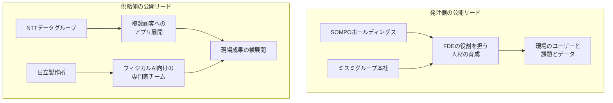
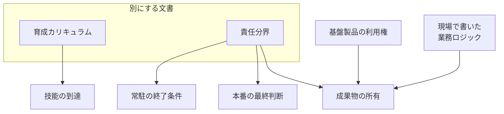

発注側が、現場で課題の発見から実装までを担う FDE（Forward Deployed Engineer）を社内の役割として読むときに、公開リードの構図と、成果物の所有、本番判断、常駐の終了を分ける文書の置き方を追えます。日経クロステックの有料本文は未読で、2026年10月2日の公開リードと公開ポイント、同日の供給側の公開リード、各社の公開資料を材料にしています。

*この記事の全体像。以下、順に解説します。*

## FDEとは

FDE は、顧客の現場に入り、課題の定義から実装、運用、継続改善までを担う役割です。日立の2026年6月10日 Investor Day デジタル資料は、FDE Team を「お客さまの現場に入り込み、AI等を活用して課題定義、実装、運用、継続改善まで一気通貫で担う」チームと定義しています。

2026年10月2日、日経クロステックの連載「解剖・FDE」の公開リードは、SOMPOホールディングスとミスミグループ本社が、この役割を自社の人材育成へ移す、と書いています。公開ポイント1は、両社が FDE の役割を担う人材を育成する、と書きます。公開リードは、「要望を伝えると、数日である程度動くものが出てくる」経験のあと、両社が「FDEを自社で育てる」を選んだ、と書きます。

同日の別記事の公開リードは、NTTデータグループと日立製作所が、FDE でアプリや専門家チームを顧客へ出し、現場の成果を横展開して人月依存からの脱却を狙う、と書きます。供給側の公開ポイントは、NTTデータグループでは FDE がアプリを開発して複数顧客へ展開し、日立は専門家の FDE チームをフィジカルAIへ投入する、と書きます。

### 公開リードの二つの向き

公開リードが置いている構図は、発注側の育成と、供給側の横展開です。どちらも現場に入ることを前提にしています。主語が違います。

発注側の図は、日経の公開リードが書いた育成の方向です。供給側の図は、同日の別記事が書いた提供の方向です。二つの図は、同じ職名を逆の向きに使っています。

### 現場に欠かせない三つの語

公開ポイント2は、FDE モデルに現場の「ユーザー」「課題」「データ」が欠かせない、と書きます。次ページ見出しは「成否を分ける『3つのリアル』」です。公開ポイント3は、普及の課題として、価値ベースの報酬体系の定着と人材育成を挙げます。

### 日立資料の役割欄

日立のデジタル資料の役割欄は、次の三つを置きます。

- 顧客課題を発見し、仮説を立案する
- 高速なプロトタイプ開発で仮説検証を行う
- 実装と運用に責任を持つ

## 注意点

日経の公開部は、「育成に動き出す」までを書いています。職種の定義、カリキュラム、人数目標、契約条項は、公開リードにはありません。有料本文は未読なので、本文がそれらを書いている可能性は残ります。

### 公式文の職名と、SOMPOの人数

SOMPOの統合レポート2025、グループCDOメッセージには、FDE という職名はありません。実装部隊については「当社のデジタル部門は現在約200人規模」と書きます。強みは内製化力です。強化対象は AI 人材です。同じページは、2016年に東京とシリコンバレーに SOMPO Digital Lab を設置したことと、課題ドリブンへの転換を書きます。約200人は、デジタル部門の規模です。FDE の育成人数としては読めません。

ミスミの公式人材育成ページは、再取得時に Access Denied でした。FDE 職を新設したという公式の裏づけは、この記事では置いていません。どのベンダーの FDE と、どの期間、現場実装をしたかも、公式の IR とプレスの範囲では未確認です。

SOMPOは、グループ事業の発注側であると同時に、Palantir Technologies Japan の共同設立者です。2019年11月18日のプレスは、同社の設立を発表しています。株式持分は、SOMPOホールディングス 50%、Palantir 50% です。資本金は US$100M（約108億円）です。事業開始予定日は2019年12月1日です。事業は、ビッグデータ解析ソフトウェアプラットフォームです。

2020年6月19日の英語プレスは、Real Data Platform を Palantir Foundry が動かす、と書きます。同時に、SOMPO が Palantir へ USD $500 million（約540億円）を出資する決定を発表しています。

2025年8月12日の Palantir 発表は、日本の合弁 Palantir Technologies Japan を経由する複数年の拡大です。本文は、複数の子会社で Foundry を使い、日次利用者を thousands of daily users と書きます。Kevin Kawasaki（Global Head of Business Development）の引用は、「Over 8,000 people at SOMPO actively use Palantir in Japan」です。8,000人は actively use です。本文の daily users とは別の言い方です。

奥村幹夫グループCEOの引用の方向は、Foundry が全部門で重要性を増し、将来も主要な役割を果たす、というものです。人数も金額も含まれません。引受の AI エージェントについて、本文は expected annual improvement in financial results of $10 million と書きます。これは財務上の成果の改善見込です。確定した収支差額としては読めません。同じリリースは、将来見通しだと断ります。この拡大は、2023年の $50 million の拡大に次ぐ2度目、とリリースが書きます。2025年のリリースが書くのは、金額と「2度目」までです。期間と対象範囲は、同じリリースにはありません。常駐を終える文言はありません。

8,000人を、社内 FDE の人数にはしません。1,000万ドルを、内製の確定した成果額にはしません。持分が2019年の50%のままかは、未確認です。

### 日立の人数は、目標の種類が違う

人数を置いている一次は、供給側の日立です。2026年7月29日の第1四半期資料は、次の二文を書きます。

- 「国内FDE人財：7月時点約300人を年度末に約1,000人に拡大」
- 「海外FDE人財：7月時点約100人を年度末に約350人に拡大」

2026年6月10日のデジタル資料が置く 5,000人は、在籍数ではなく「めざす水準」です。300人から1,000人は、2026年7月時点から、資料上の年度末への国内目標です。海外の100人から350人も、同じ資料の年度末目標です。CEO Remarks（2026年6月10日）のスライド本文は「国内システムエンジニア 35,000人 × AI」と書きます。FDE の定義は、CEO Remarks では別スライドの脚注です。デジタル資料では、定義文が FDE Team の説明本文にあります。

これらを足して、「FDE が何人いるか」の一つの数にはしません。発注側の内製人数でもありません。

同じデジタル資料の役割欄には「実装と運用に責任を持つ」があります。右列の箇条書きには「お客さま先に常駐」があります。PDF は2カラムです。常駐の箇条書きが役割欄に属するかは、スライドの目視が残ります。人数目標の文言は、FDE 人財の拡大です。常駐は、定義の「現場に入り込み」と、構成側の箇条書きからの読みです。300人から1,000人という目標文そのものではありません。

### 見出しだけの数値と、未読の本文

富士通の2030年度売上約1,500億円は、日経クロステック2026年9月28日記事の公開ポイントとリードにあります。富士通の確定計画としては、この記事では置いていません。

Microsoft の「6000人のFDE」（2026年10月1日）と、米国求人の「年収中央値3000万円超」（2026年9月29日）は、見出しだけです。本文は未読です。この記事の数値にはしていません。

同じ連載の2026年9月30日記事の公開見出しは、「客先常駐SEとの違いは『提案型・少人数』」「エセも出現」です。公開部は、役割が十分に理解されているとは言い難い、という方向を置きます。エセの事例本文は有料で未読です。

価値ベースの報酬は、2026年10月2日の公開ポイント3が「定着」を普及の課題として挙げています。定着済みの契約慣行としては読めません。

### まだ閉じていない確認

次は、公開資料の範囲では閉じていません。

- 有料本文が、職種定義、カリキュラム、人数、契約条項のどれを書いているか
- ミスミが、どのベンダーの FDE と、どの期間、現場実装をしたか
- Palantir Technologies Japan の持分が、2019年の50%から変わったか
- SOMPO とミスミの個別契約に、所有、本番判断、常駐終了の条項があるか
- 2023年の5,000万ドル拡大の期間と対象範囲
- 日立資料の「お客さま先に常駐」が、役割欄と構成欄のどちらに属するか
- 「3つのリアル」を技能、権限、評価へ写した対応が、公開部の明示か

## 同日の公開リードは育成と拡大を並べている

公開リードだけを並べると、FDE はベンダーの出し方から、発注側の育て方へ移るように見えます。一次を並べると、供給側は FDE 人財の人数目標を増やしたままです。日立資料は、その人数を常駐人数の目標とは書いていません。

SOMPO側の一次は、Palantir との合弁、出資、2025年8月の利用拡大です。公式が次に書いている社内の動きは、デジタル部門約200人の内製と、AI 人材の育成です。FDE という職名への切り替えは、公式文からは読めません。

「3つのリアル」は、公開部ではユーザー、課題、データです。技能、権限、評価という言葉は、公開部にありません。近い読みを置くなら、次の表です。左列と中列の対応は、公開部の語からの読みです。右列は、公開部が書いていない契約上の問いです。有料本文が別の写像を持つ可能性は残ります。

| 公開部の語 | 近い決定 | 公開部が明示していないこと |
|---|---|---|
| ユーザー | 誰の現場に入るか | 発注側の誰が入場を許すか |
| 課題 | 何を解くと成功か | 定義をベンダーと発注側のどちらが確定するか |
| データ | 何に触れるか | アクセスと利用許諾を誰が持つか |
| ポイント3の人材育成 | 技能の到達 | カリキュラムの中身と修了条件 |
| ポイント3の価値ベース報酬 | 評価の単位 | 人月をやめたあとの検収単位 |

## 所有と本番判断と常駐終了を分ける

日経の公開部は、成果物の所有、本番判断の最終責任、常駐の終了条件を、契約項目として書いていません。ここから先は、公開資料が置いた役割定義から導く推奨です。

日立資料は、ベンダー側 FDE の役割に「実装と運用に責任を持つ」を置きます。構成側には常駐があります。発注側が同じ役割を社内で担うなら、本番の go と no-go は発注側に残します。残さないと、研修を受けたことと、本番責任が移ったことが、同じ文書の中で同時に起きえます。

終了条件は、常駐人数や滞在月数にしません。社内が、課題の確定、データの許諾、本番判断、運用の一次受けを回せる範囲を、終了条件にします。その範囲に届く前に常駐を切ると、実装と運用の責任の置き場が空きます。

成果物は二つに分けます。一つは、基盤製品の利用権です。SOMPOの公開履歴では、基盤は Foundry のまま拡大しています。もう一つは、現場で書いた業務ロジックです。利用権の契約と、現場ロジックの帰属を同じ条項にすると、常駐が終わったあとも、現場の手順の所有者が曖昧なまま残ります。公開の標準約款が SOMPO の個別契約と同じかは未確認です。条文番号は、この推奨の根拠にしません。個別契約に、この三分界が既にあるかも、公開資料では未確認です。

育成カリキュラムと責任分界は、別文書にします。カリキュラムは、技能の到達を書きます。責任分界は、所有、本番判断、常駐終了を書きます。同じ文書にすると、研修の修了が、本番責任の移転に読まれます。

発注側がこの分け方を採る条件は、現場のユーザー、課題、データに社内が触れ続けることです。供給側がこの分け方を採る条件は、横展開するアプリの利用料と、個別現場の常駐終了を、別の対価にすることです。人月を利用料に変える話と、常駐を終える話は、同じ契約条項では足りません。

## まとめ

2026年10月2日の公開リードは、SOMPO とミスミの自社育成と、NTTデータグループと日立の横展開を、同じ FDE という職名で並べています。人数と金額は、定義と分母を分けて読みます。約200人はデジタル部門の規模です。8,000人は Foundry の利用者です。300人から1,000人は、日立の国内 FDE 人財の年度末目標です。発注側が同じ役割を社内で担うときは、育成カリキュラムと責任分界を別文書にします。責任分界には、成果物の所有、本番の最終判断、常駐の終了条件を置きます。

この記事が少しでも参考になった、あるいは改善点などがあれば、ぜひリアクションやコメント、SNSでのシェアをいただけると励みになります！

## 参考リンク

- [日経クロステック「SOMPOとミスミGはFDE人材を自前育成、プロジェクト成功に『3つのリアル』」（2026-10-02、公開リードと3ポイント。本文は有料）](https://xtech.nikkei.com/atcl/nxt/column/18/03744/091800005/)
- [日経クロステック「NTTデータグループ・日立がFDEで攻勢、AI需要巡る覇権争い 脱・人月へ」（2026-10-02、公開リードと3ポイント。本文は有料）](https://xtech.nikkei.com/atcl/nxt/column/18/03744/092500006/)
- [日経クロステック「富士通FDEが崩すSIの『常識』」（2026-09-28。公開ポイントの約1,500億円は二次扱い）](https://xtech.nikkei.com/atcl/nxt/column/18/03744/091700004/)
- [日経クロステック「FDEに5つの疑問」（2026-09-30。見出しは連載一覧で確認。本文は有料）](https://xtech.nikkei.com/atcl/nxt/column/18/03744/091100002/)
- [SOMPOホールディングス「共同会社設立」（2019-11-18）](https://www.sompo-hd.com/~/media/hd/files/news/2019/20191118_1.pdf)
- [SOMPO Holdings "SOMPO and Palantir Launch Real Data Platform"（2020-06-19）](https://www.sompo-hd.com/~/media/hd/en/files/news/2020/e_20200619_1.pdf)
- [SOMPOホールディングス 統合レポート2025 グループCDOメッセージ](https://www.sompo-hd.com/ir/data/disclosure/hd/online2025/group/digital-data-ai/cdo-message)
- [Palantir "Palantir and SOMPO Expand Partnership in Multi-Year Agreement"（2025-08-12、Nasdaq転載）](https://www.nasdaq.com/press-release/palantir-and-sompo-expand-partnership-multi-year-agreement-2025-08-12)
- [Hitachi Investor Day 2026 デジタル資料（2026-06-10）](https://www.hitachi.com/content/dam/hitachi/global/ja_jp/press/files/2026/06/0610/20260610_04_digital.pdf)
- [Hitachi 2026年度第1四半期決算資料（2026-07-29）](https://www.hitachi.com/content/dam/hitachi/global/ja_jp/press/files/2026/07/0729/2026_1Qpre.pdf)
- Hitachi Investor Day 2026 CEO Remarks（2026-06-10）。FDE の定義は脚注。国内システムエンジニア 35,000人は別スライドの本文。URL は本稿の参照範囲では特定していない
- [ミスミ 人材育成](https://www.misumi.co.jp/esg/social/talent-development)（再取得時は Access Denied）
