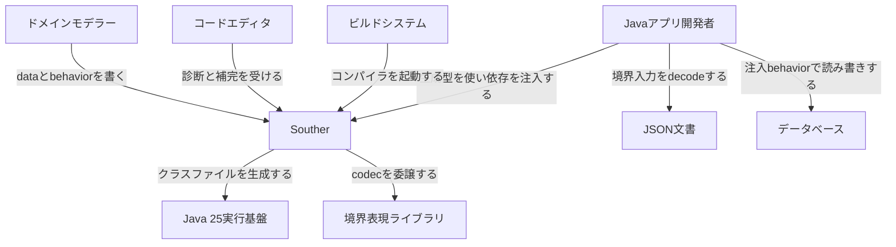
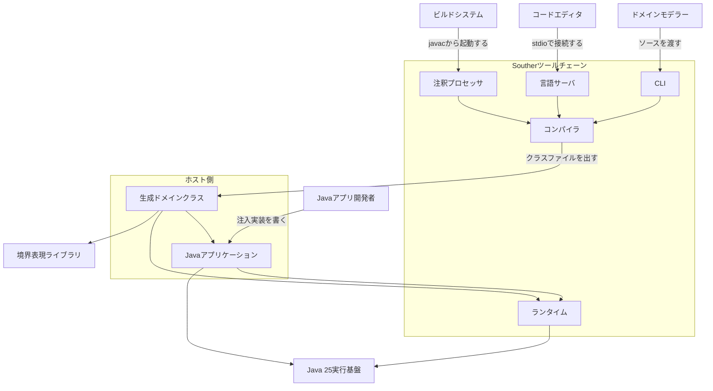
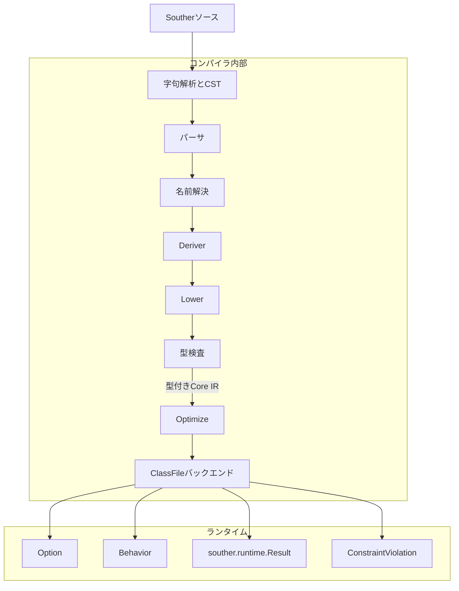
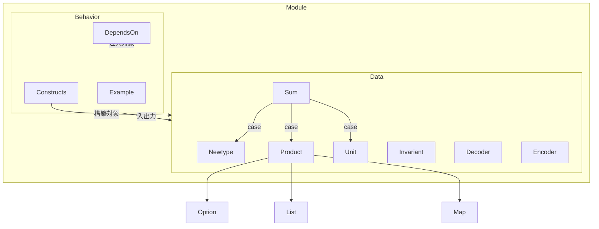
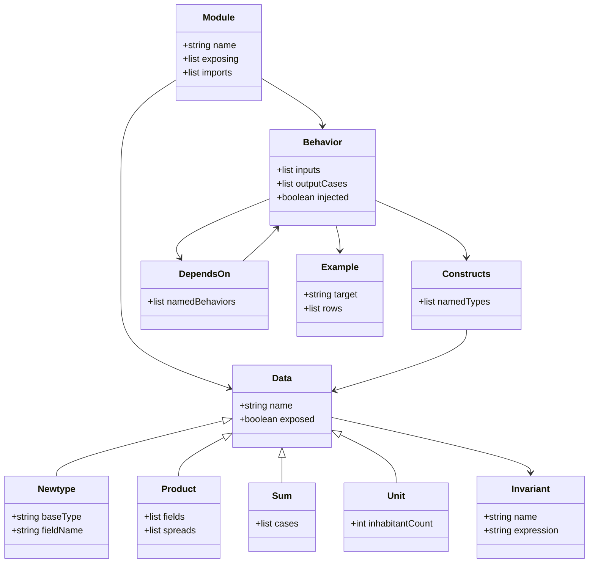

Southerは、業務ルールを`data`と`behavior`で記述し、Java 25のクラスファイルへ変換する小さな言語です。値の制約、型を構築できる操作、外界への依存を宣言し、仕様書だけに残りがちなルールをコンパイラの検査対象にします。

特に興味深いのはUnicode識別子です。日本語の規則名を翻訳せず型名や操作名にできるため、法令・約款・社内規程の語彙と実装を近づけられます。本記事では言語の構造とデータモデルを押さえたうえで、介護報酬の算定構造を日本語で表現した実例まで見ていきます。

:::message
本記事は2026年8月22日時点の`v0.1.0-rc5`を基準にしています。Southerはプレリリース段階であり、Java 25以降が必要です。
:::


*この記事の全体像。以下、順に解説します。*

## 概要

[Souther公式サイト](https://souther-lang.org/)は、この言語を「業務ルールを正しい状態に保つための小さなJVM言語」と位置づけています。狙いは、Specification Model-Driven Development（SMDD）の仕様DSLを、別の実装モデルへ翻訳せず、そのまま実行可能な型と操作へ写すことです。

Southerが宣言として扱う中心要素は次の3つです。

| 仕様に現れるルール | Southerでの表現 |
|---|---|
| 値が満たす条件 | `invariant` |
| Souther内でその型を作ってよい操作 | `constructs` |
| DBや時計など外界への依存 | 実装のない`behavior`と`depends on` |

たとえば「金額は0以上」という条件は、コメントや呼び出し側のバリデーションではなく型の隣に置きます。生成recordの正準コンストラクタはpackage-privateで、公開されたdecoderや`__construct`は必ず`invariant`を検査します。`constructs`が制限するのはSouther内のbehaviorが持つ構築能力です。Javaはexposed dataの公開構築入口を呼べますが、`invariant`を迂回した未検証値は作れません。

SoutherとJavaの相互運用は非対称です。Javaは生成された型を利用し、外部依存の実装を注入できます。一方、Southerから任意のJava APIへ直接到達することはできません。ドメイン層が外界へ触れる経路を`depends on`に限定する設計です。

失敗も一つの例外型にまとめません。

| 失敗の種類 | 表現 |
|---|---|
| 残高不足や却下などの業務結果 | `behavior`の出力case |
| JSON欠落など境界入力の不正 | Raohのdecoder `Result<T>`（`Ok<T>` / `Err<T>`。`Err`が`Issues`を保持） |
| ドメイン内の`invariant`違反 | `ConstraintViolation`による中断 |
| DB切断など基盤障害 | Java統合境界の例外 |

この区別により、利用者へ返す通常の業務結果と、入力不正、モデルのバグ、インフラ障害を別々に扱えます。

## 特徴

Southerの設計は、[12のPrinciples](https://souther-lang.org/principles/)に整理されています。実装時に効くものを抜き出すと、次のようになります。

- モデルを正本にし、規則書の語彙を型名へ写す
- 境界で検証するのではなく、精密な型へparseする
- 状態をフラグではなく別々の型で表す
- 却下や不足を例外ではなく通常のdataとして返す
- 型の構築権限を`constructs`で明示する
- 外界への到達を注入した`behavior`に限定する
- 不在を`?`と`Option`で明示し、`null`を使わない
- 規則と`example`を隣に置き、コンパイル時に評価する

状態遷移では、`Draft`と`Submitted`を一つの型の`status`フィールドで区別しません。操作が`Draft`だけを受け取るなら、`Submitted`を渡した誤りは型検査で止まります。出力の和にcaseを追加すれば、未対応の`match`も非網羅として検出されます。

`>->`演算子はbehaviorを接続します。次段が受け取れるcaseだけが本線へ進み、受け取れないcaseは合成結果へ残ります。「成功型」「失敗型」という印を言語が固定せず、どのcaseを先へ流すかを合成側が決める仕組みです。

一方、Southerは汎用JVM言語ではありません。可変状態、任意のJava API呼び出し、`null`、スレッド、非同期、例外による業務フロー、REPL、パッケージマネージャは意図的に対象外です。業務ドメインのdataとbehaviorへ範囲を絞ることで、言語の複雑さを抑えています。

## 構造

Southerは、構文解析、コンパイラ、ランタイム、フォーマッタ、LSP、CLIをMavenモジュールに分けています。コンパイラの公開入口は`souther.compiler.Compiler`、javac統合の入口は`souther.compiler.apt.SoutherProcessor`です。

### システムコンテキスト図

Southerを中心に、ドメインモデラー、Java開発者、ビルド、エディタ、外部境界の関係を示します。



JVMはSoutherのドメインモデルをホストアプリへ配る基盤です。外部のJSONやDBをSoutherが直接読むのではなく、Java側が境界を担当します。

### コンテナ図

内部の主要な実行単位はCLI、LSP、注釈プロセッサ、コンパイラ、ランタイムです。CLIと注釈プロセッサは、どちらも同じコンパイラへ到達します。



生成された`data`はJava record、和はsealed interface、注入対象のbehaviorはJava側で継承する抽象基底になります。ランタイムは`Option`、`Behavior`、`souther.runtime.Result<T,E>`、`ConstraintViolation`など、生成コードが必要とする小さな実行面を提供します。`souther.runtime.Result<T,E>`は検査付き構築の成功・失敗に使う型で、境界入力のissue群を返すRaoh側のdecoder `Result`とは別物です。

### コンポーネント図

コンパイラは、無損失CSTから型付きCore IR、Java 25クラスファイルへ進みます。



Deriverはdataの形からdecoderとencoderを導出します。型検査では通常の型だけでなく、構築権限、依存集合、`match`の網羅性、`invariant`も確認します。バックエンドは`java.lang.classfile`を使ってバイトコードを直接生成し、生成工程でjavacを通しません。

## データ

Southerのデータはすべて不変です。主な形はnewtype、product、sum、unitであり、`Option`、`List`、`Map`を組み合わせられます。

### 概念モデル

`Module`が`Data`と`Behavior`を所有し、behaviorは入出力や構築権限を通じてdataを参照します。



各形の役割は次のとおりです。

| 形 | 役割 |
|---|---|
| Newtype | `data X = Y`。基底型と表現は近くても名義は別 |
| Product | `data X = { ... }`。複数フィールドのAND |
| Sum | `data X = A \| B`。既存dataをcaseにしたOR |
| Unit | 本体のないdata。値は一つ |
| Invariant | newtypeやproductの値制約 |
| Behavior | 入出力関係。`let`がなければJavaから注入 |
| Constructs | behaviorが新しく作ってよいdataの集合 |
| DependsOn | behaviorが利用する注入behaviorの集合 |
| Example | behaviorの隣でコンパイル時に評価するシナリオ |

### 情報モデル

主要な属性と関係をクラス図にすると、構築権限と外界依存がモデルの一部であることが見えます。



JVM上では、product、unit、newtypeがrecordになります。newtypeのフィールド名は`value`、unitは`INSTANCE`を持ちます。sumはsealed interfaceになり、許可されたcaseがクラスファイルの`PermittedSubclasses`へ記録されます。

生成recordの正準コンストラクタはpackage-privateです。検査付きの構築入口は`__construct`に分かれ、exposed dataではJavaから呼べるpublic APIになります。decoderと`__construct`のどちらも`invariant`を検査します。`.sou`のファイル名と行番号もクラスファイルへ保存されるため、`invariant`違反のスタックトレースをモデルの行へ戻せます。

Unicode識別子はNFC正規化され、UAX #31の`XID_Start XID_Continue*`で検査されます。日本語名はローマ字へ変換されず、そのままJVM名になります。`behavior 提出する`の実装は`提出する$Impl`、フィールド`理由`のrecordアクセサも`理由`です。

## 構築方法

### 前提

コンパイラ、生成クラス、ランタイム、派生codecが利用するRaohは、すべてJava 25のclass-file version 69を前提にします。最初に実行環境を確認します。

```sh
java -version
```

### Homebrewで導入する

macOSまたはLinuxではtapから導入できます。

```sh
brew install souther-lang/souther/souther
souther help
```

Homebrew版はOpenJDKに依存する`souther.jar`のラッパです。GitHub Releasesには、Unix向けself-contained実行ファイル、`souther.jar`、`souther-lsp.jar`、TextMate文法、`SHA256SUMS`があります。

### GitHub Releasesから導入する

`v0.1.0-rc5`のUnix実行ファイルを使う例です。

```sh
mkdir -p ~/.local/bin
curl -L -o ~/.local/bin/souther \
  https://github.com/souther-lang/souther/releases/download/v0.1.0-rc5/souther
chmod +x ~/.local/bin/souther
export PATH="$HOME/.local/bin:$PATH"
souther help
```

プレリリースではタグが変わりやすいため、実行前に[Releases](https://github.com/souther-lang/souther/releases)の最新タグとチェックサムを確認してください。

### Javaプロジェクトへ組み込む

新規プロジェクトはCLIで作れます。

```sh
souther init com.example:hello
cd hello
mvn test
```

既存Mavenプロジェクトでは`souther-compiler`をannotation processorに置き、`.sou`の場所を渡します。

```xml
<annotationProcessorPaths>
  <path>
    <groupId>org.souther-lang</groupId>
    <artifactId>souther-compiler</artifactId>
    <version>0.1.0-rc5</version>
  </path>
</annotationProcessorPaths>
<compilerArgs>
  <arg>-Asouther.source=${project.basedir}/src/main/souther</arg>
</compilerArgs>
```

`.sou`ファイルだけではjavacが起動しないため、Javaソースがないプロジェクトでは空の`package-info.java`を一つ置きます。実行時には同じ版の`org.souther-lang:souther-runtime`も必要です。

VS Codeでは`souther.souther`拡張を利用できます。診断、outline、hover、定義ジャンプ、参照検索、rename、completion、quick-fix、formatting、semantic tokensに対応します。

## 利用方法

### 最小のdataとbehavior

次のモデルは、空でない従業員IDと0以上の金額を定義し、10万円を超える申請を業務結果として却下します。

```text
module example.trip
import String ( length )

data EmployeeId = String
    invariant length(value) > 0

data Amount = Int
    invariant value >= 0

data DraftRequest = { applicant: EmployeeId, plannedCost: Amount }
data Submitted = { ...DraftRequest, submittedAt: String }
data Rejected = { reason: String }

behavior submit : (request: DraftRequest, submittedAt: String)
    -> Submitted | Rejected
    constructs Submitted, Rejected

let submit (request, submittedAt) = {
    guard request.plannedCost.value <= 100000
        else Rejected { reason = "high_cost" }
    Submitted { ...request, submittedAt = submittedAt }
}
```

`guard`は例外ではなく、条件を満たさないときに返す業務caseを指定します。`constructs`と実装で構築する型が過不足なく一致しなければ、コンパイルエラーになります。

単一ファイルのrunnableなbehaviorは`run`で試せます。

```sh
souther run hello.sou --behavior greet --input '"world"'
souther compile model.sou -d out --format json --lang ja
souther examples model.sou --strict
souther fmt model.sou --check
```

`run`が実行できるのは、`let`を持ち依存がないbehavior、またはその条件を満たすbehaviorだけで構成したpipelineです。DBアクセスなど注入behaviorを含むモデルはJava側で配線するか、`example`の`fake` / `with`で検証します。

### 日本語の業務語彙をそのまま使う

Unicode識別子を使えば、規則書の語彙を英語へ翻訳せずモデルへ持ち込めます。

```text
data 金額 = Int
    invariant value >= 0

data 申請準備中 = { 申請者: String, 予定費用: 金額 }
data 提出済み = { ...申請準備中, 提出日時: String }
data 却下 = { 理由: String }

behavior 提出する : (申請: 申請準備中, 提出日時: String)
    -> 提出済み | 却下
    constructs 提出済み, 却下

let 提出する (申請, 提出日時) = {
    guard 申請.予定費用.value <= 100000
        else 却下 { 理由 = "high_cost" }
    提出済み { ...申請, 提出日時 = 提出日時 }
}
```

日本語を使う利点は単なる読みやすさではありません。規則書の「申請準備中」「提出済み」「却下」が別々の型になり、どの操作がどの状態を受け取るかをコンパイラが確認できます。用語集とコードの対応表を別に保守する負担も減らせます。

### 介護報酬の算定構造を表現する

[kawasima氏のgist](https://gist.github.com/kawasima/c22e13f910f986c0dafce47b9d804fad)には、厚生労働省「介護報酬の算定構造」の語彙を使った12個の`.sou`ファイルがあります。対象は令和3年4月施行版であり、2026年時点の現行報酬を実装するサンプルではありません。ここでは制度値の現在性ではなく、日本語の型、適用順、端数処理をSoutherでどう表すかに注目します。`訪問介護`、`訪問看護`、`通所介護`、`支給限度`などをモジュールに分け、共通の単位計算を次のように表します。

```text
data 単位数 = Int
    invariant value >= 0

data 単位加算 = { 単位: 単位数 }
data 単位減算 = { 単位: 単位数 }
data 割合乗算 = { 分子: Int, 分母: Int }
    invariant 分子は0以上 = 分子 >= 0
    invariant 分母は正 = 分母 > 0
data 割合加算 = { 分子: Int, 分母: Int }
    invariant 分子は0以上 = 分子 >= 0
    invariant 分母は正 = 分母 > 0

data 算定記号 = 単位加算 | 単位減算 | 割合乗算 | 割合加算

behavior 記号を適用する
    : (所定単位数: 単位数, 記号: 算定記号) -> 単位数
    constructs 単位数

let 記号を適用する (所定単位数, 記号) =
    match 記号 with
        | 単位加算 as k -> 所定単位数 + k.単位
        | 単位減算 as k -> 所定単位数 - k.単位
        | 割合乗算 as k -> 単位数(
            四捨五入(所定単位数.value * k.分子, k.分母))
        | 割合加算 as k -> 所定単位数 + 単位数(
            四捨五入(所定単位数.value * k.分子, k.分母))
```

ここでは`単位数`の非負制約、割合の分母が正であること、算定記号の種類がすべて型に現れます。新しい算定記号をsumへ加えれば、対応していない`match`が非網羅として止まります。

ただし、掲載コードの`単位減算`は部分関数です。たとえば`単位数(1)`から`単位数(2)`を引くと、再構築した値が非負制約を破り、通常の戻り値ではなく`ConstraintViolation`で中断します。過大減算が業務上あり得るなら、`guard`で専用の業務caseを返す必要があります。制度上起きない前提なら、基本単位数と減算量の関係を入力dataの`invariant`へ持ち上げ、前提を型として明示します。

表の注は左から右へ適用するため、順序を`List<算定記号>`として保持し、`List.fold`で適用します。

```text
behavior 記号を順に適用する
    : (基本部分: 単位数, 記号の並び: List<算定記号>) -> 単位数

let 記号を順に適用する (基本部分, 記号の並び) =
    List.fold(
        (積み上げ, 記号) -> 記号を適用する(積み上げ, 記号),
        基本部分,
        記号の並び)
```

この設計の要点は、法令表の列順もルールの一部として捨てないことです。ただしgistにある基本単位数396に対する「割合乗算200/100」と「割合加算25/100」の順序比較は、中間値に端数が出ないため、どちらも990になります。各段で四捨五入する実装なので、この2操作も一般には可換ではありません。たとえば基本単位数1なら、乗算してから加算すると3、加算してから乗算すると2です。順序依存を検証するexampleには、途中で端数が生じる値を使う必要があります。

端数処理も`example`で規則の隣に置けます。

```text
example 記号を適用する
    | "＋○○単位は所定単位数に足す"
        : (単位数(250), 単位加算 { 単位 = 単位数(100) })
        -> 単位数(350)
    | "×○○／100は所定単位数に率を掛ける"
        : (単位数(250), 割合乗算 { 分子 = 90, 分母 = 100 })
        -> 単位数(225)
    | "端数は四捨五入する（0.5は上へ）"
        : (単位数(167), 割合乗算 { 分子 = 70, 分母 = 100 })
        -> 単位数(117)
```

日本語名はclass fileでも日本語のままです。Java側から生成型`会員`、`会員ID`、`会員なし`などを直接参照し、decoderの結果をswitchできます。[公式examplesのmember](https://github.com/souther-lang/examples/tree/main/member)がコンパイル可能な統合例です。

## 運用

Souther自体は常駐サービスではありません。運用上の入口はコンパイル、単体実行、example評価です。

```sh
souther compile hello.sou -d out
souther run hello.sou --behavior greet --input '"world"'
souther examples businesstrip.sou --strict
```

コンパイル診断と警告は`--format json`で1行1 JSONオブジェクトにでき、`--lang ja`または`SOUTHER_LANG=ja`で日本語化できます。診断コードはロケールに依存しないため、CIでは`E2011`のような安定コードをキーに扱えます。`v0.1.0-rc5`では、`run`の入力不正など実行時・境界エラーはJSON化されず、標準エラーへプレーンテキストで出ます。

```sh
souther compile model.sou -d out --format json --lang ja
```

プレリリース中はlatestリリースへの追従が基本です。[SECURITY.md](https://github.com/souther-lang/souther/blob/main/SECURITY.md)も、pre-1.0ではlatestのみをセキュリティ修正対象としています。生成物とランタイムの版を揃え、JDK 25固定をCIでも明示してください。

性能回帰は`souther-bench`で確認できます。JDK 25の`-XX:+UseCompactObjectHeaders`はデプロイ側のフラグで、Southerの再コンパイルは不要です。

## ベストプラクティス

### exampleからモデルを発見する

Southerの`example`は、完成済みロジックの単体テストだけではありません。具体的な業務シナリオを書き、signature、partition、boundary、branchの不足を`souther examples`で見つけ、型や操作を修正するために使います。

```sh
souther examples model.sou --generate --boundaries
souther examples model.sou --strict
```

`--strict`は`adequacy: not satisfied`をexit 1にするため、CIゲートに利用できます。注入behaviorの実行待ちは通常状態として扱われるため、必要な依存を`fake`または`with`で与えます。

### 状態、構築、依存を宣言する

- 状態はフラグではなく別々のdataにする
- 新しく作る型を`constructs`へ過不足なく書く
- 外界依存を`depends on`へ過不足なく書く
- 業務上あり得る失敗は出力caseにする
- モデルの不変条件違反と基盤障害を業務caseへ混ぜない

`constructs`の不足はE1002、過剰宣言はE1006です。`depends on`の不足はE1602、過剰宣言はE1603です。「念のため多めに宣言する」ことも許されないため、モデルに実際の能力が現れます。

### 日本語モデルでは規則用語を揃える

日本語識別子を採用するなら、規則書、`.sou`、`example`、Java境界で同じ表記を使います。同じ概念に「単位数」「ポイント」「amount」のような別名を混在させると、Unicode識別子の利点が薄れます。

法令表をモデル化する場合は、行や列の順序、端数処理、限度額へ算入する値と実際に算定する値の違いもdataとして残します。介護報酬gistでは、同一建物減算後の単位数と、区分支給限度へ算入する減算前の単位数を別フィールドで保持しています。

## トラブルシューティング

| 症状 | 原因 | 対処 |
|---|---|---|
| JDK 24以下で生成classを読めない | class-file version 69固定 | JDK 25以上でビルド・実行する |
| 単一ファイルでは動くが複数ファイルで失敗 | import対象にはmoduleヘッダが必要 | モジュール名とimportを明示する |
| `souther run`がbehaviorを拒否 | 注入依存を含みrunnableでない | Javaで注入するか`fake` / `with`を使う |
| 業務分岐で`ConstraintViolation`になる | 失敗し得る前提を`invariant`だけに任せている | `guard ... else`で業務caseへ分ける |
| decoder失敗と業務結果が混ざる | 境界とドメインの失敗を同一視している | `Err`、出力case、abort、Java例外を分ける |
| E2011警告が出る | 構築値が`invariant`を満たすと静的に示せない | `guard`するか、関係を入力型の`invariant`へ上げる |
| E1201が出る | `match`が非網羅 | 新しく追加されたcaseを処理する |
| E1602 / E1603が出る | `depends on`の不足 / 過剰 | 実際に到達する注入behaviorと一致させる |

介護報酬gistの`支給限度.sou`では、foldのstep内で`match`して足し分けると、結果が0以上であることを静的に示せずE2011になります。対処は、先に対象だけを`List.filter`し、foldのstepを非負値の加算だけにすることです。

```text
let 限度額管理対象単位数を求める (算定項目の並び) =
    単位数(List.fold(
        (積み上げ, 項目) ->
            積み上げ + 項目.限度額管理に算入する単位数.value,
        0,
        List.filter(
            項目 ->
                match 項目.限度額管理 with
                    | 管理の対象 -> true
                    | 管理の対象外 -> false,
            算定項目の並び)))
```

E2011は警告であり、実行時の`invariant`検査は残ります。単に警告を消すのではなく、コンパイラが追跡できる形へ業務関係を組み替えることが重要です。

なお、公式サイトに見えるE1001、E1302、E1401は現行仕様でretiredです。構築権限の不足はE1002、`null`はE1301、依存宣言はE1602 / E1603など、現行の[specification.adoc](https://github.com/souther-lang/souther/blob/main/specification.adoc)を基準に確認してください。

## まとめ

Southerは、業務ルールを「値制約」「構築権限」「外界依存」に分け、実行可能なドメイン型としてJVMへ載せる言語です。状態を型にし、業務結果をcaseにし、境界不正・モデルバグ・基盤障害を分離することで、仕様と実装のずれをコンパイル時に見つけやすくします。

Unicode識別子は、日本語を表示できるというだけの機能ではありません。介護報酬の`単位数`、`算定記号`、`限度額管理`のような規則語彙を、型・操作・example・Java境界まで一貫させるための仕組みです。法令や社内規程をJVM上の実行可能モデルへ近づけたい場面では、Southerの小ささと制約の強さが有力な選択肢になります。

この記事が少しでも参考になった、あるいは改善点などがあれば、ぜひリアクションやコメント、SNSでのシェアをいただけると励みになります！

## 参考リンク

- [Souther公式サイト](https://souther-lang.org/)
- [Souther Principles](https://souther-lang.org/principles/)
- [Souther Tutorial](https://souther-lang.org/tutorial/)
- [souther-lang/souther](https://github.com/souther-lang/souther)
- [Souther specification](https://github.com/souther-lang/souther/blob/main/specification.adoc)
- [Souther examples](https://github.com/souther-lang/examples)
- [介護報酬の算定構造をSoutherで表現したgist](https://gist.github.com/kawasima/c22e13f910f986c0dafce47b9d804fad)
- [v0.1.0-rc5](https://github.com/souther-lang/souther/releases/tag/v0.1.0-rc5)
- [ADR-0008: Asymmetric Java interoperability](https://github.com/souther-lang/souther/blob/main/docs/adr/0008-asymmetric-java-interop.md)
- [ADR-0062: Target Java 25](https://github.com/souther-lang/souther/blob/main/docs/adr/0062-target-java-25.md)
- [ADR-0065: A data is a Java record](https://github.com/souther-lang/souther/blob/main/docs/adr/0065-a-data-is-a-java-record.md)
