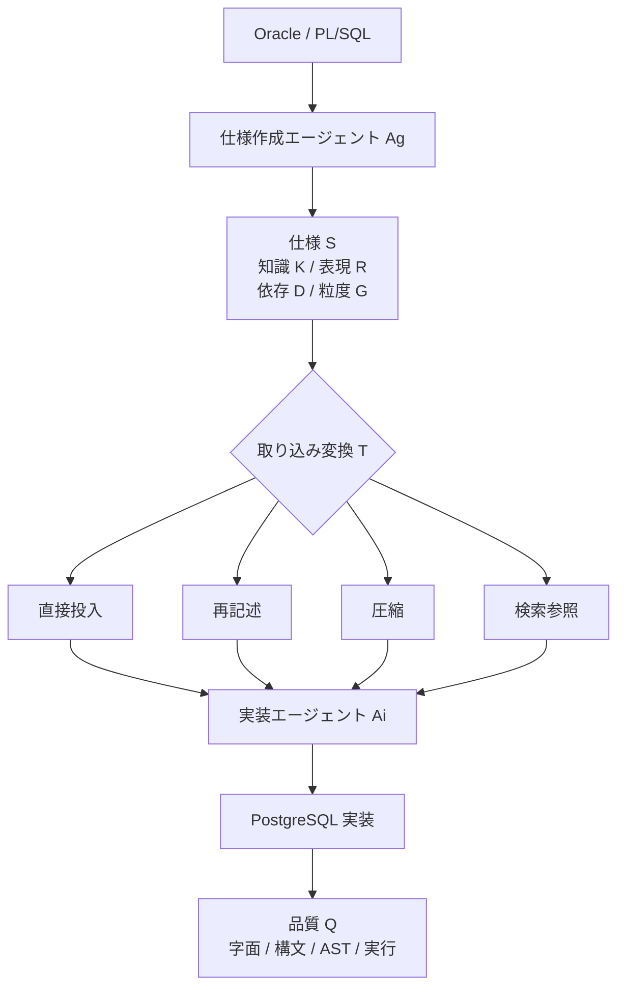
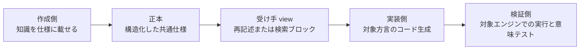

仕様駆動開発（Spec-Driven Development, SDD）のツールは、仕様を Markdown としてリポジトリに置きます。テキストなのだから、書いたエージェントと実装するエージェントが違っても同じように動くはずだ、という期待が自然に生まれます。

この記事では、その期待を Oracle から PostgreSQL への移行タスクで実測したプレプリント [arXiv:2608.21208](https://arxiv.org/abs/2608.21208)（Grynets ら、EPAM Systems、2026-08-21 公開）を材料に、複数のコーディングエージェントをまたいで SDD を回すときの設計判断を整理します。想定する読者は、Kiro / GitHub Spec Kit / Antigravity などを併用しながら仕様を共有資産にしようとしている方です。

扱う論点は3つです。

- 仕様の情報量と、受け手が実装できることは、どういう関係にあるのか
- エージェントをまたいだときの品質劣化は、どの方向に、どの程度出るのか
- 「仕様を書き直す」「圧縮する」「検索させる」のうち、どれが移管の既定になりうるのか

先に結論を述べます。**仕様をツール中立の単一成果物として扱う前提は成立しません。** ただし「別のエージェントに渡すと必ず劣化する」も同じく成り立ちません。論文自身のデータが、外国の仕様を渡したほうが良くなるセルを含んでいます。この記事は、その両側を落とさずに実務へ落とすことを目的とします。

なお本論文は査読前のプレプリントです。数値はそのまま製品判断の根拠にはできません。確度が落ちる箇所は都度明記します。

*この記事の全体像。以下、順に解説します。*

## 何を測った実験なのか

実験は2段構えです。混同すると結論を読み違えるので、先に分けておきます。

| 段階 | 対象 | 何を確かめたか |
|---|---|---|
| Stage 1 | PL/SQL ファイル 1,006 個 | 仕様を経由した移行がそもそも成立するか |
| Stage 2 | Oracle / PostgreSQL スクリプト 1,802 対 | 仕様の作成者と実装者が違うとき品質はどうなるか |

Stage 1 では、1,006 個の PL/SQL ファイルをいったん仕様に落とし、そこから PostgreSQL 実装を再生成しています。623 個（約 61.9%）が再生成に成功し、そのうち 380 個（約 61.0%）が PostgreSQL 16 上で実行できました。オブジェクト種別で差が大きく、テーブルの再生成は約 85% に届く一方、クエリ・プロシージャ・ファンクション・インデックスは苦戦しています。

Stage 2 が本題です。同じ機能要求に対して、仕様を作るエージェント（作成側）と実装するエージェント（実装側）を組み替え、品質を測ります。系統的にクロスさせたのは Kiro / Gemini（Antigravity）/ Copilot（Spec Kit）の3つで、Claude Code と Cursor は費用制約から単独条件のみです。

**この2段は直列の因果ではありません。** Stage 1 の 380/623 を「別エージェントに渡したから落ちた数字」として読むのは誤りです。

### 測っていないものを先に押さえる

指標の定義が、そのまま結論の射程になります。

- **Token F1 / exact match** — 参照 PostgreSQL スクリプトとの字面の一致度。正当な別解も不一致になります。
- **SQL 構文妥当性** — sqlglot によるパース可否。意味の正しさではありません。
- **AST 類似度** — 構文木の一致度。
- **Runnable（即時実行率）** — 空のデータベース + スタブという下限条件での実行成功率。本番スキーマ上の意味等価は測っていません。

つまりこの実験が保証するのは「移行が成功した」ではなく「この下限条件でどれだけ崩れたか」です。後述の反証で効いてきます。

## 仕様の行数は品質を説明しない

もっとも実務的に効く発見がこれです。

Kiro が生成した仕様は約 1,597 行、Gemini が生成した仕様は約 193 行でした。8倍以上の差があります。それでも、長いほうの仕様が強い実装を生んだわけではありません。

まず、それぞれのエージェントが**自分で書いた仕様を自分で実装した**ベースラインを見ます。

| 条件 | Token F1 | Exact % | SQL 妥当性 % | AST 平均類似度 | 実行率 % |
|---|---:|---:|---:|---:|---:|
| Kiro native | 0.3652 | 0.33 | 33.74 | 0.2073 | 0.72 |
| Copilot native | 0.75 | 13.15 | 43.51 | 0.2566 | 0 |
| Gemini native | 0.73 | 13.32 | 45.54 | 0.69 | 2.22 |

1,597 行の仕様を書いた Kiro が、自分の仕様で最も低いスコアになっています。情報量を積んだこと自体は、受け手が実装できることを意味しません。

ここは、同じ著者グループのトークン最適化の報告とも符合します。100 クエリを対象に、穏当な削減では意味一致率が 89.75%（削減なしは 89.80%）とほぼ保たれる一方、積極的なスキーマ蒸留はトークン効率を 132.22% 改善する代わりに意味一致率を 44.50 ポイント落としています（[arXiv:2605.28557](https://arxiv.org/abs/2605.28557)）。長さと品質は単調な関係にありません。**多くても少なくても、品質はそこでは決まらない**という読み方が妥当です。

なお、チューニングを施した条件（同一環境での調整後）では実行率が大きく動きます。

| 条件 | SQL 妥当性 % | 実行率 % |
|---|---:|---:|
| Kiro tuned | 57.8 | 14.76 |
| Copilot tuned | 73.03 | 17.48 |
| Gemini tuned | 60.16 | 28.75 |
| Claude Code tuned | 56.21 | 4.11 |
| Cursor tuned | 65.98 | 7.49 |

実行率は 0〜2.22% の水準から 4〜28% へ跳ねています。**仕様の出所より、エージェント側の調整のほうが実行率を大きく動かした**という事実は、後で一般化を抑えるときに使います。

## 劣化には方向がある

クロス条件の結果です。「実装」が実装エージェント、「仕様起源」が仕様を書いたエージェントを指します。Copilot 起源の仕様は未評価のため、該当セルは空欄です。

| 実装 | 仕様起源 | Token F1 | Exact % | SQL 妥当性 % | AST 平均類似度 | 実行率 % |
|---|---|---:|---:|---:|---:|---:|
| Kiro | Kiro | 0.365 | 0.33 | 33.74 | 0.2073 | 0.72 |
| Kiro | Gemini | 0.71 | 13.15 | 43.51 | 0.31 | 2.22 |
| Gemini | Kiro | 0.68 | 0.56 | **0** | 0.08 | 0.17 |
| Gemini | Gemini | 0.73 | 13.32 | 45.54 | 0.69 | 2.22 |
| Copilot | Kiro | 0.69 | 12.4 | 43.4 | 0.55 | 2.38 |
| Copilot | Gemini | 0.665 | 12.8 | 63 | 0.514 | 未実施 |
| Copilot | Copilot | 0.75 | 13.15 | 43.51 | 0.257 | 0 |

読みどころは3つあります。

**1. 互換性は対称ではありません。** Gemini が Kiro 起源の仕様を直接読んだ条件は、Token F1 が 0.68 と保たれているのに SQL 構文妥当性が 0% です。字面は残っているのに、パースできる SQL になっていません。逆向きの Kiro ← Gemini では、Token F1 が native の 0.365 から 0.71 へ、実行率が 0.72% から 2.22% へ**改善**しています。

論文はこの非対称性を「i から j への互換性と、j から i への互換性は等しくない」として定式化しています。「A と B は互換」という言い方自体が成立しません。

**2. 最悪ケースは再現実験で出ています。** 同じ Gemini ← Kiro を再実行した条件では、Token F1 0.035、Exact 0.39%、SQL 構文妥当性 2.33%、AST 平均類似度 0.015、実行率 1.22% と、字面まで崩れました。論文の要旨はこちらを代表値として引用しています。

ただし、1回目（F1 0.68 / SQL 0%）と2回目（F1 0.035 / SQL 2.33%）は同じ数値ではありません。論文は「定性的には同じ失敗」と説明しますが、F1 の差は再現ではなく分散として読むほうが安全です。この点は後述します。

**3. 外国の仕様が改善するセルがあります。** Copilot ← Kiro の実行率 2.38% は Copilot native の 0% より高く、Copilot ← Gemini の SQL 妥当性 63% は native の 43.51% より高い値です。**「他所の仕様を渡すと劣化する」という一般化は、このデータでは支持されません。**

### 構造として整理する

品質を決めているのは仕様そのものではなく、作成エージェント・仕様の属性・取り込み方・実装エージェントの組み合わせです。論文は仕様を「知識・表現・依存・粒度の4属性の組」として定義し、実装エージェントが取り込んだ後の仕様を、その4属性に取り込み方式と実装エージェントを掛けた変換結果として置いています。

この図で言うと、多くのチームが暗黙に採用しているのは「直接投入」の一本道です。論文が崩したのはそこだけであり、仕様を共有すること自体は否定されていません。

## 3つの取り込み変換のうち、どれが使えるか

論文は直接投入以外に3つの適応策を試しています。いずれも Kiro 起源の仕様を、別のエージェントが消費する条件です。

| 戦略 | 条件 | Token F1 | Exact % | SQL 妥当性 % | AST 平均類似度 | 実行率 % |
|---|---|---:|---:|---:|---:|---:|
| 再記述 | Gemini ← Kiro | 0.68 | 13.15 | 43.62 | 0.22 | 0 |
| 再記述 | Copilot ← Kiro | 0.60 | 0 | 14.09 | 0.034 | 0 |
| 圧縮 | Copilot ← Kiro | 0.72 | 12.71 | 43.90 | 0.24 | 0.22 |
| 検索参照 | Gemini ← Kiro | 0.57 | 13.40 | 13.82 | 0.32 | 1.80 |
| 検索参照 | Copilot ← Kiro | 0.69 | 12.76 | 43.51 | 0.285 | 0.28 |

**再記述（rewrite）はエージェント依存です。** Gemini では SQL 妥当性を 0% から 43.62% まで戻しました。表現が遠い相手に対しては効きます。しかし同じ処理を Copilot に適用すると SQL 妥当性 14.09%、Exact 0 と、直接投入より悪化しています。「受け手の好みの形式に書き直させてから実装させる」を無条件のルールにはできません。

しかも Gemini の再記述は、SQL 妥当性を戻したのに実行率は 0% です。**構文が通ることと動くことは別の話**という、指標定義の効き方がここに出ています。

**圧縮（compression）は既定にできません。** Copilot では native と同程度の字面を保っていますが、論文自身が普遍解ではないと明記しています。Gemini 側の圧縮結果は本文に示されていません。前掲のトークン最適化の報告とあわせると、「短くすれば渡しやすくなる」は成り立たないと考えるのが妥当です。

**検索参照（RAG）が唯一の共通解です。** 全文を読ませず、必要な部分だけを検索ツール経由で取得させる方式です。注意すべきは、**全指標で最強ではない**ことです。Gemini の SQL 妥当性 13.82% は再記述の 43.62% より低い値です。論文が推す理由は最高スコアだからではなく、Gemini と Copilot の双方でパレート最適集合に載った唯一の策だったからです。

つまり RAG の位置づけは「最良」ではなく「**互換性が未知のときに最初に試す既定値**」です。

## この結果はどこまで一般化できるか

そのまま製品判断に使う前に、崩れるところを確認します。

### 一般化を抑える材料

**実行率のベースラインがそもそも低い。** Stage 2 の native 条件の実行率は 0〜2.22% です。ここまで低い水準では、「他所の仕様を渡したから実行できなくなった」と原因を仕様の出所に帰属させられません。前掲のとおり、チューニングのほうが実行率を大きく動かしています。

**再実験の不一致は非決定性で説明できます。** Gemini ← Kiro の2試行は F1 が 0.68 と 0.035 で桁が違います。温度や seed の記載はなく、再実行は1回だけです。LLM のコード生成の非決定性については、829 問を5回ずつ実行してテスト出力が一度も一致しない割合を CodeContests 75.76% / APPS 51.00% / HumanEval 47.56% と報告した実証研究があり、temperature=0 でも決定性は保証されないとされています（[DOI 10.1145/3697010](https://doi.org/10.1145/3697010)）。**単一試行の最悪値を代表値として扱うべきではありません。**

**行列に欠測があります。** Copilot 起源の仕様は未評価で、3×3 が埋まっていません。Claude Code と Cursor はクロス条件から外れています。損失が一方向であることは、この範囲では確認できていません。

**指標が本番の成功と乖離します。** exact match は正当な別解を落とし、空 DB での実行はスキーマ・データ・外部キーのある環境を代表しません。

**査読を経ていません。** 同一グループの連続したプレプリントであり、投稿から数日の時点では独立した批判的レビューも見当たりませんでした。arXiv の分類にも他分野のコードが混入しています。

### それでも残る主張

以上を差し引いても、次の2点は一次データと整合します。

1. **仕様をエージェント中立と仮定してはならない**（互換性が対称でない実測がある）
2. **移管の完了条件は、字面や構文ではなく対象エンジン上の実行に置くべき**（構文が戻っても実行率 0% のセルがある）

逆に、「必ず再記述と RAG を通せ」「渡せば実行可能性が大幅に落ちる」まで踏み込むと、改善セルと低いベースラインに反証されます。

## 実務にどう落とすか

論文の主張のうち、反証を通過した部分だけを設計に落とします。中心にあるのは**責任を4層に切る**ことです。

- **作成側** は知識のカバレッジとトレーサビリティに責任を持ちます。
- **正本** は要件・規則・依存・未解決を構造化した共通仕様です。ここは git に置いて構いません。
- **受け手 view** は、表現と粒度を実装エージェントの解釈に合わせた派生物です。**ここを省くのが直接投入**であり、論文が崩したのはこの一点です。
- **実装側** は方言変換を担います。
- **検証側** は字面ではなく実行で閉じます。

具体的な運用ルールに直すと、次のようになります。

| 判断 | 置き方 | 根拠 |
|---|---|---|
| 直接投入 | 既定にしない。受け手がその表現を書いたエージェント自身のときだけ許可 | Gemini ← Kiro の SQL 妥当性 0% |
| 最初に試す変換 | 検索参照（RAG） | 両エージェントのパレート集合に共通して載った唯一の策 |
| 再記述 | ゲート付き。適用後に構文と実行を測ってから採用 | Copilot では悪化（SQL 14.09%） |
| 圧縮 | 移管の既定にしない | 論文と関連研究の双方で意味劣化 |
| 完了条件 | 対象エンジン上の実行 + 意味テスト。空 DB では閉じない | 構文回復と実行率 0% の乖離 |
| エージェント切替 | パイプライン途中で行わない。境界に view 生成と実行ゲートを置く | 互換性の非対称性 |

各ツールの標準構成に当てはめると、受け手 view はこう作ります。

- **Kiro** — `requirements.md`（EARS 記法）/ `design.md` / `tasks.md` と steering に再構成する（[公式ドキュメント](https://kiro.dev/docs/specs/)）
- **GitHub Spec Kit** — constitution のゲートを通したうえで spec（WHAT/WHY）と plan（HOW）に分ける
- **Antigravity** — 短い Artifact に落とす（[公式ドキュメント](https://antigravity.google/docs/artifacts)）

なお Spec Kit の README は「any AI coding agent」で使えることを打ち出していますが、これは**足場（コマンドやディレクトリ構成）の横断性**の主張です。この論文が測ったのは足場ではなく、できあがった仕様を別のハーネスが実装したときの品質であり、両者は衝突していません。Spec Kit 自身も、複数エージェントを同時に導入すると無関係な agent-specific instructions を参照しうるリスクを FAQ で認めています。完全な意味的中立は公式も主張していません。

### そもそも SDD 経由が必要か

目的が SQL 方言の変換だけであれば、仕様を手渡す構成を必須にする理由はありません。規則ベースと LLM を組み合わせた方言変換システム（CrackSQL、[DOI 10.1145/3725278](https://doi.org/10.1145/3725278)、デモは [arXiv:2504.00882](https://arxiv.org/abs/2504.00882)）のような別レイヤの選択肢を比較対象に残すほうが妥当です。ただし公開されている定量表に Oracle → PostgreSQL の列はなく、PL/SQL のプロシージャやパッケージのようなオブジェクト移行とは粒度が異なります。**クエリ単体は変換器、手続き型オブジェクトは仕様経由**という切り分けが現実的な出発点になります。

## 何が確かめられていないか

判断を保留すべき点を明示しておきます。

- Gemini ← Kiro の分散。再実行は1回のみで、温度や seed の記載がありません。
- 2つの表の数値（F1 0.68 と 0.035）が別試行なのか、表の取り違いなのか、本文からは確定できません。
- 1,802 対の参照 PostgreSQL が単一の正解なのか。正当な別解が exact=0 になった比率は不明です。
- sqlglot が妥当と判定した SQL と、PostgreSQL 16 で実際に動く SQL の乖離率。
- Kiro の 1,597 行に steering が含まれるか。Gemini の 193 行が Artifact の短文化なのか。
- Copilot 起源の仕様を含むフル行列。
- 本番スキーマ・データ・外部キーがある条件での実行成功率。

次のいずれかが確認されれば、この記事の結論は書き換わります。

- 同一条件で5回以上再実行し、外国仕様の効果が分散の外に出る
- Copilot 起源を含むフル行列で、損失が一方向に揃う
- 本番スキーマ上の実行で、native と外国仕様の差が消える
- 査読で Stage 1 と Stage 2 の実験単位の扱いが修正される

## まとめ

- SDD の仕様は、テキストであってもツール中立の単一成果物としては扱えません。互換性は方向を持ち、A から B へ渡せる仕様が B から A へも渡せるとは限りません。
- 仕様の行数は品質を説明しません。1,597 行の仕様を書いたエージェントが、自分の仕様で最も低いスコアでした。
- 直接投入を既定にせず、受け手向けの view（再記述または検索参照）を挟みます。最初に試すのは検索参照です。再記述はエージェント依存で、圧縮は既定にできません。
- 移管の完了条件は対象エンジン上の実行と意味テストに置きます。構文が戻っても実行率が 0% のままだったセルが実在します。
- ただし「渡せば必ず劣化する」は誤りです。外国の仕様のほうが良くなったセルがあり、実行率のベースラインはそもそも 0〜2.22% と低く、査読も経ていません。この1本を確定した事実として引用しないでください。

複数のエージェントを併用しているなら、まず「どのファイルを、誰が、どの形で読んでいるか」を1枚に描いてみるのが手早い出発点です。境界に view と実行ゲートが無い経路が見つかれば、そこが今回の実験で崩れた場所と同じ形をしています。

この記事が少しでも参考になった、あるいは改善点などがあれば、ぜひリアクションやコメント、SNSでのシェアをいただけると励みになります！

## 参考リンク

- O. Grynets, O. Ilchuk, D. Zatulna, V. Lyashkevych, "Specification Portability Across LLM Development Agents," arXiv:2608.21208, 2026-08-21 — https://arxiv.org/abs/2608.21208
- O. Grynets et al., "Specification-Based Code-Text-Code Reengineering," arXiv:2605.25232 — https://arxiv.org/abs/2605.25232
- O. Grynets, D. Babarytskyi, V. Lyashkevych, "Token Optimization Strategies for LLM-Based Oracle-to-PostgreSQL Migration," arXiv:2605.28557 — https://arxiv.org/abs/2605.28557
- S. Ouyang, J. M. Zhang, M. Harman, M. Wang, "An Empirical Study of the Non-determinism of ChatGPT in Code Generation," ACM TOSEM — https://doi.org/10.1145/3697010
- W. Zhou, Y. Gao, X. Zhou, G. Li, "Cracking SQL Barriers: An LLM-based Dialect Translation System," SIGMOD 2025 — https://doi.org/10.1145/3725278 / デモ https://arxiv.org/abs/2504.00882
- S. O. de Macedo, "From Prompt to Process," arXiv:2606.04967 — https://arxiv.org/abs/2606.04967
- D. B. Piskala, "Spec-Driven Development: From Code to Contract," arXiv:2602.00180 — https://arxiv.org/abs/2602.00180
- GitHub Spec Kit — https://github.com/github/spec-kit
- Kiro Specs — https://kiro.dev/docs/specs/
- Google Antigravity Artifacts — https://antigravity.google/docs/artifacts
- Conductor が Antigravity をサポート（Google Developers Blog） — https://developers.googleblog.com/evolving-spec-driven-development-conductor-now-supports-antigravity/
