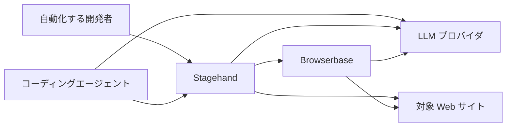
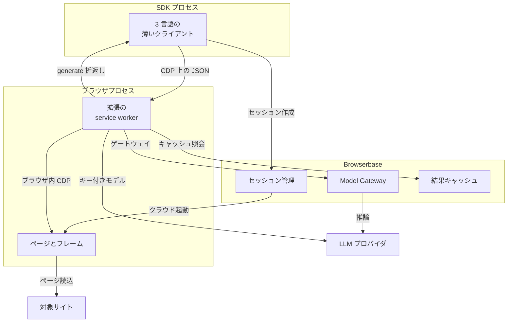
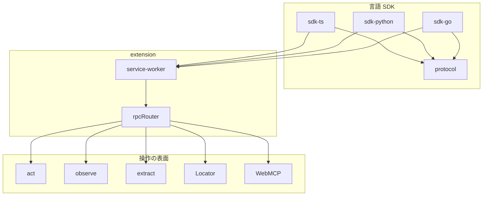
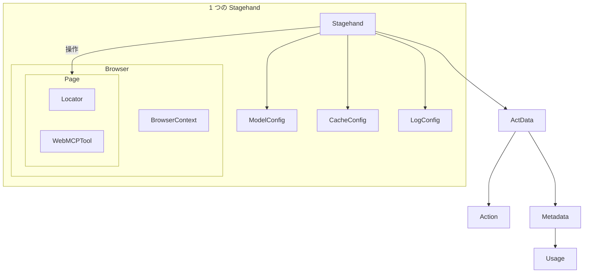
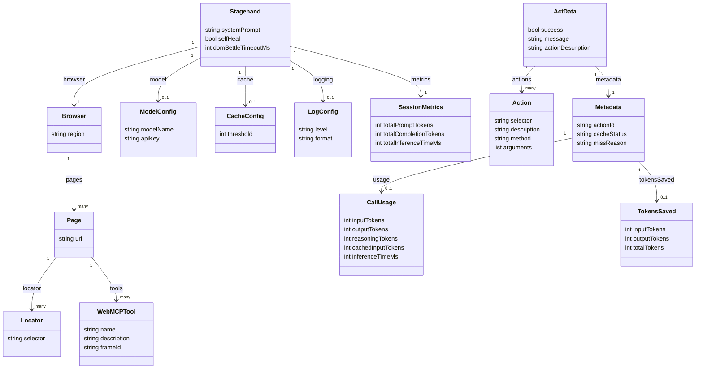

Stagehand v4 は、Browserbase が開発する、AI エージェントがブラウザを操作するための SDK です。
この記事では、v4 の実行時の構造、データの形、TypeScript・Python・Go での導入と使い方、運用の勘所を、2026-09-22 時点の公式ドキュメント・発表記事・公開レジストリをもとに整理します。
v3 からの移行で変わる点と、資料間で記載が食い違う点も後半でまとめます。


*この記事の全体像。以下、順に解説します。*

## Stagehand v4 とは

Stagehand v4 は、ブラウザエージェント向けの SDK です。
Playwright はテスト用途から発展しましたが、Stagehand はエージェントがページを操作するための道具として設計されています。
自然言語で指示する `act`、`extract`、`observe` と、セレクタで動かす Playwright 風の `page` API を、同じスクリプトの中で混ぜて使えます。

| 項目 | 内容 |
| --- | --- |
| v4 の公開 | 2026-08-10。npm の `4.0.0` と同日に [発表記事](https://www.browserbase.com/blog/stagehand-v4/) と changelog が出た |
| 現在の stable | npm `@browserbasehq/stagehand@4.1.0`、PyPI `stagehand` `4.1.0`（ともに 2026-09-09 公開） |
| リポジトリ | [browserbase/stagehand](https://github.com/browserbase/stagehand)。2024-03 作成、MIT ライセンス |
| 規模 | 2026-09-22 時点で GitHub star 約 2.5 万、fork 約 1,700 |

v4 の実行時は、ページの隣で動くブラウザ拡張です。
ターゲット管理、フレーム追跡、CDP の配送は、拡張の service worker が担います。
言語 SDK は、その worker への薄いクライアントです。
この形により、TypeScript、Python、Go が同じ API を持ちます。

使い始めの流れは次のとおりです。

1. ブラウザを先に用意します。手段は `browserbase.launch`、`localBrowser.launch`、`localBrowser.connect`、既存セッション向けの `browserbase.connect` の 4 つです。
2. そのハンドルを `Stagehand.create({ browser })` に渡します。
3. コンストラクタは private で、`init()` はありません。

推論の行き先は 4 通りです。

- `model` を省略すると、Browserbase の Model Gateway が呼び出しごとにモデルを選びます。
- API キーなしでモデル名だけを渡すと、Gateway 上でそのモデルに固定します。
- API キー付きで `model` を渡すと、プロバイダへ直接リクエストします。
- `generate` コールバックを渡すと、呼び出し側プロセスで推論します。
- Gateway とサーバキャッシュは、Browserbase のブラウザでだけ使えます。

v4 には `agent()` がありません。
呼び出し側が、手順をコードとして書くか、実行中のモデルに狭いツールを渡すかを選びます。

| 観点 | Stagehand v4 | Playwright | Puppeteer |
| --- | --- | --- | --- |
| 位置づけ | エージェントが使うブラウザ SDK | テストランナー | セレクタで動かすスクリプト |
| 状態の置き場所 | ブラウザ内の拡張。SDK は問い合わせる | クライアント側に page の写しを持つ（v4 発表の説明） | クライアント側のハンドル |
| 転送 | 既存 CDP ソケット上の JSON。独自 CDP ドメインは足さない | CDP。リモートでは写しと実体の往復が伸びる（v4 発表の説明） | CDP |
| 依存 | Playwright も Puppeteer も依存にしない | Playwright 自身 | Puppeteer 自身 |
| 言語 | TypeScript、Python、Go | 本記事では扱わない | 本記事では扱わない |
| AI の単位 | `act`、`observe`、`extract`。組み方は呼び出し側 | 自然言語プリミティブは標準で持たない | 同左 |

場面ごとの使い分けは次のとおりです。

| 場面 | 向く使い方 |
| --- | --- |
| セレクタが安定している | `page.locator()` と `page.goto()`。推論を使わない |
| ラベルは分かるが DOM が揺れる | `act()` を 1 操作ずつ |
| 次の操作を確認してから実行したい | `observe()` の `Action` を `act()` に渡す |
| 表や一覧を型付きで取りたい | `extract(instruction, schema)` |
| 本番でキャッシュと Gateway を使う | `browserbase.launch` |
| 手元で DevTools を見ながら書く | `localBrowser.launch`。モデルは API キー付きで渡す |
| コーディング支援にスクリプトを書かせる | AI rules を置いた code mode |
| 実行中もモデルにブラウザを渡す | ツール呼び出し。統合は実験的な monorepo 同梱 |


## 特徴

- 実行時がブラウザ内にあります。リモートブラウザでも、ページ状態の問い合わせが短い往復で済みます。
- TypeScript、Python、Go が同じプリミティブを持ちます。コアを言語ごとに書き分けていません。
- `act`、`observe`、`extract` は Stagehand インスタンスのメソッドです。戻り値は `{ data, metadata }` です。
- `page` は `goto`、`locator`、`click`、`screenshot`、`snapshot` を持ちます。CDP で直接駆動し、Playwright の Page オブジェクトは受け取りません。
- iframe と closed shadow root を追加設定なしで扱えます。`page.locator("iframe >> button")` で深い要素に届きます。
- クリップボード、ドメイン方針、WebMCP を標準機能として持ちます。ドメイン方針はブラウザ内で、応答が戻る前に遮断します。
- アクセシビリティ木の剪定は、ネットワーク越しの複製ではなく、拡張内の生の木に対して行います。
- サーバキャッシュは Browserbase 上だけで動きます。クライアント側のキャッシュファイルはありません。
- `metrics()` が操作別のトークン数と推論時間を返します。金額は返しません。
- 変数 `%name%` の実値はモデルに送りません。実行直前に置換します。
- 実験的なエージェント統合は、永続ブラウザ 1 つと `run`、`snapshot`、`screenshot` の 3 ツールです。アダプタは単独の公開パッケージではありません。
- `browserbase.search` と `browserbase.fetch` は、ブラウザを起動せずに URL と本文を取得します。

## 構造

### システムコンテキスト図

Stagehand は、開発者が書く自動化と、コーディングエージェントの両方から対象サイトを操作します。
エージェント自身が考えるためのモデルと、Stagehand がページ操作に使うモデルは別物です。



| 要素名 | 説明 |
| --- | --- |
| 自動化する開発者 | SDK でブラウザを起動し、手順を書く人 |
| コーディングエージェント | 統合のツールで、持続するブラウザを操作する主体 |
| Stagehand | 3 言語の SDK、ブラウザ内拡張、その間の RPC |
| Browserbase | クラウドブラウザ、セッション、Model Gateway、結果キャッシュ |
| LLM プロバイダ | `act`、`observe`、`extract` の推論先。Gateway 経由と直結がある |
| 対象 Web サイト | ブラウザが開く操作対象 |

### コンテナ図

境界は、SDK プロセス、ブラウザプロセス、Browserbase の管理面の 3 つです。
拡張は独立した OS プロセスではなく、ブラウザプロセスの中の service worker です。

SDK が持つ接続は、ブラウザの CDP だけです。
worker とのやり取りの JSON は、その CDP の `Runtime` ドメインに載せます。
独自の CDP ドメインは追加していません。

- セットアップ: `Target.attachToTarget` と、`Runtime.addBinding` による `__stagehandSendToHost` の登録
- SDK から worker へ: `Runtime.evaluate`
- worker から SDK へ: `Runtime.bindingCalled`

worker がページを動かすときは、同じブラウザへ自分の CDP 接続を張ります。
クリックなどに展開される CDP コマンドは、この 2 本目の接続でブラウザ内に閉じます。




#### SDK プロセス

| 要素名 | 説明 |
| --- | --- |
| 3 言語の薄いクライアント | TypeScript、Python、Go。ページ状態の正本は持たない |
| ブラウザ factory | `browserbase.launch`、`browserbase.connect`、`localBrowser.launch`、`localBrowser.connect` |
| generate 折返し | 自前モデルのとき、worker が同じ経路で SDK に推論を依頼する |
| ログとトレース設定 | `logging` と OpenTelemetry の送り先は SDK 側で渡す |

#### ブラウザプロセス

| 要素名 | 説明 |
| --- | --- |
| ページとフレーム | `BrowserContext` と `Page` の実体。iframe と closed shadow root を含む |
| 拡張の service worker | ターゲット管理、フレーム追跡、CDP 配送、アクセシビリティ木の剪定 |
| ドメイン方針 | 遮断はブラウザ内で行う。ポップアップも、開いてから閉じるのではなく遮断ページになる |
| 拡張の読み込み | ローカル起動では SDK が拡張を読み込む。Browserbase 側の扱いは後述の注意点を参照 |

#### Browserbase

| 要素名 | 説明 |
| --- | --- |
| セッション管理 | `baseUrl` が指す API。拡張のアップロード、リージョン、接続 |
| Model Gateway | `apiUrl` が指す API。`model` 省略時と、キーなしの固定モデル |
| 結果キャッシュ | Browserbase セッション上の機能。ローカルブラウザでは効かない |
| リージョン | 既定は `us-west-2`。ほかに `us-east-1`、`eu-central-1`、`ap-southeast-1` |

### コンポーネント図

リポジトリの `packages/` 直下は、`cli`、`docs`、`evals`、`extension`、`integrations`、`protocol`、`sdk-go`、`sdk-python`、`sdk-ts` です（2026-09-22 時点）。
拡張の入口は `service-worker.ts` と `rpcRouter.ts` です。

- `controllers/`: `stagehandController.ts`、`pageController.ts`、`contextController.ts`、`locatorController.ts`、`responseController.ts`
- `services/`: `actService.ts`、`observeService.ts`、`extractService.ts`、`llmService.ts`、`cacheService.ts`

次の図は、SDK から worker へ、worker から操作の表面へ、という RPC の境界だけを示します。
コントローラ間の呼び出し順は含めていません。



| 要素名 | 説明 |
| --- | --- |
| sdk-ts | 公開名 `@browserbasehq/stagehand`。4.1.0 の `engines.node` は `>=22.18.0` |
| sdk-python | 公開名 `stagehand`。stable は `4.1.0`。`requires_python` は `>=3.11` |
| sdk-go | モジュール `github.com/browserbase/stagehand/packages/sdk-go/v4`。module proxy に `v4.1.0` がある |
| protocol | 境界のスキーマ。npm 版の devDependency に `@browserbasehq/stagehand-protocol@2.0.0` がある |
| service-worker | binding、JSON-RPC、実行時を組み立てる入口 |
| rpcRouter | JSON-RPC をコントローラへ振り分ける |
| act | 自然言語の 1 操作、または observe 済み Action の再生 |
| observe | 候補の selector、description、method、arguments を返す。ページは変えない |
| extract | スキーマに沿った抽出。戻り値は `data` と `metadata` |
| Locator | `page.locator`。`>>` と深い XPath を解決する |
| WebMCP | `page.tools()`。ページが登録したツール。SDK 側では定義しない |

エージェント統合は別の表面です。
共有実装のパッケージ名は `@browserbasehq/stagehand-integrations` です。
stdio の MCP で連携する相手として、Claude Code、Codex、CrewAI、Mastra、fx、Vercel AI SDK、ローカルの Deep Agents が文書に載っています。
Eve と Pi はプロセス内バインディングです。
`packages/integrations` には、文書の表より多い `cursor`、各 `*-sdk`、`deepagents` などのディレクトリがあります。
`cli`、`docs`、`evals` は、実行時のリクエスト経路には入りません。

## データ

### 概念モデル

所有関係は入れ子です。
`act`、`observe`、`extract` は Stagehand から呼び、Page を操作します。
Page が Locator と WebMCP ツールを持ちます。



| 要素名 | 説明 |
| --- | --- |
| Stagehand | `create` 済みのクライアント。プリミティブの呼び出し先 |
| ModelConfig | モデル名、プロバイダキー、追加ヘッダ、または `generate` |
| CacheConfig | サーバキャッシュのオンオフと `threshold` |
| LogConfig | `level`、`format`、コールバック |
| Browser | factory が返すハンドル。context を 1 つ持つ |
| BrowserContext | ページ、クッキー、ドメイン方針、クリップボード |
| Page | タブ。URL、locator、snapshot を持つ |
| Locator | セレクタの記述子。作成元の Page に属する |
| WebMCPTool | ページが公開したツール。`name` と入力スキーマを持つ |
| Action | observe が返す 1 操作。method、selector、arguments |
| ActData | `act` の `data`。成否、メッセージ、実行した Action の列 |
| Metadata | action ID、キャッシュ状態、トークン使用量 |
| Usage | 1 回分の input、output、reasoning、cached input、推論時間 |

### 情報モデル

属性名は TypeScript では camelCase、Python では snake_case、Go では公開フィールドの PascalCase です。
たとえば `actionDescription` は、Python で `action_description`、Go で `ActionDescription` になります。
キャッシュの `status` と `missReason` は別フィールドです。
Python では `status` が `"MISS"`、`miss_reason` が `"not_found"` のように返ります。
Go では `Metadata.Cache.Status` です。
1 つの browser ハンドルに対応できる Stagehand は 1 つだけです。



| 属性名 | 型 | 説明 |
| --- | --- | --- |
| systemPrompt | string | `Stagehand.create` に渡す追加指示 |
| selfHeal | bool | 記録済みセレクタが解決できないときの再推論。既定値は reference に記載がない |
| domSettleTimeoutMs | int | 指示ベースの `act` の前に、ネットワークが静まるのを待つ上限。既定 5000 |
| modelName | string | `provider/model` 形式。接頭辞は必須。一次対応のプロバイダは 5 つ |
| apiKey | string | プロバイダ直結のときに渡す。無いと Gateway 扱い |
| threshold | int | 同一結果を何回見たらキャッシュを返し始めるか。`1` なら次の同一呼び出しから |
| level | string | `off`、`error`、`warn`、`info`、`debug`。既定 `info` |
| format | string | `pretty` または `json`。既定 `pretty` |
| region | string | Browserbase の 4 リージョン。既定 `us-west-2` |
| baseUrl | string | Browserbase API の origin。末尾に `/v1` を付けない |
| selector | string | Action 上の xpath など。Locator に渡すセレクタとは別フィールド |
| method | string | `click`、`doubleClick`、`fill`、`type`、`press`、`hover`、`scrollTo`、`nextChunk`、`prevChunk`、`selectOptionFromDropdown`、`dragAndDrop` |
| arguments | list | method に渡す引数 |
| success | bool | `act` の成否 |
| message | string | 実行結果の説明。セレクタを含む |
| actionDescription | string | 操作の短い説明 |
| actionId | string | 例の接頭辞は `act_` |
| cacheStatus | string | 図では平坦化している。公式の位置は `metadata.cache.status`。値は `HIT`、`MISS`、`DISABLED` |
| missReason | string | `MISS` のときの理由。例は `not_found` |
| count | int | `metadata.cache` に載る。同一結果を見た回数 |
| tokensSaved | object | `HIT` のときだけ。避けた input、output、total の 3 値。Python は `tokens_saved` |
| inputTokens | int | 1 回の `metadata.usage`。消費した input。推論が無ければ 0 |
| outputTokens | int | 1 回の `metadata.usage`。消費した output |
| totalPromptTokens | int | `metrics()` の累計。1 回分の `inputTokens` とは名前が違う |
| totalCompletionTokens | int | `metrics()` の累計。1 回分の `outputTokens` とは名前が違う |
| name | string | WebMCP ツール名 |
| frameId | string | ツールがあるフレーム。iframe 内も含む |

`metrics()` と `metadata` の関係は次のとおりです。

- `metrics()` の累計フィールドは、`totalPromptTokens`、`totalCompletionTokens`、`totalReasoningTokens`、`totalCachedInputTokens`、`totalInferenceTimeMs` です。
- 同じ形の操作別フィールドとして、`actPromptTokens`、`extractPromptTokens`、`observePromptTokens` などがあります。
- `totalCachedInputTokens` はプロバイダ側の prompt cache の値です。Stagehand の結果キャッシュとは別物です。
- `metadata.cache` は `status`、`count`、`threshold`、`missReason`、`tokensSaved` を持ちます。`count` は今回を含む回数です。
- 決定的な再生と cache hit の usage は 0 です。例外を投げた呼び出しは累計に加算しません。`metrics()` はリセットしません。

キャッシュのキーは、instruction、ページ内容、渡した options です。
ページ URL はキーに含まれ、モデル設定は含まれません。
`locator` または `ignoreLocators` を付けた呼び出しはキャッシュを読み書きせず、status は `DISABLED` になります。
screenshot 付きの `extract` も、常にサーバキャッシュを迂回します。キャッシュキーが DOM の状態から作られ、モデルが見た画素を表せないためです。

`page.snapshot()` は `formattedTree`、`urlMap`、`xpathMap` を返します。
Python では `formatted_tree`、`url_map`、`xpath_map`、Go では `FormattedTree`、`URLMap`、`XPathMap` です。
統合ツールの `snapshot` とは別の API です。

## 構築方法

### 前提

- ドキュメント上の下限は、Node.js 22.18 以降、Python 3.11 以降、Go 1.26 以降です。
- Bun も対象です。Playwright に依存しないためです。
- ローカル実行には Chrome が必要です。Firefox と WebKit の手順はありません。
- Stagehand は環境変数を読みません。`.env` の自動読込もありません。
- `BROWSERBASE_BASE_URL` と `STAGEHAND_API_URL` も自動では使いません。`baseUrl` と `apiUrl` に origin を渡します。

| 配布物 | 2026-09-22 時点の値 |
| --- | --- |
| npm `@browserbasehq/stagehand` | latest `4.1.0`。依存 `zod` は `4.4.3` 固定、`@browserbasehq/sdk` は `^2.16.0` |
| PyPI `stagehand` | `4.1.0`。`pydantic>=2.12,<3`、`browserbase>=1.15,<2`、`websockets>=16.1.1` |
| Go module proxy | `v4.0.1`、`v4.0.2`、`v4.0.3`、`v4.1.0` |

### TypeScript の導入

パッケージ名は `@browserbasehq/stagehand` です。
Zod は `zod/v4` から import します。
公式の installation は、Zod を 4.4 系に固定します。

```bash
pnpm add @browserbasehq/stagehand 'zod@~4.4.3'
```

npm、yarn、bun でも同じ固定で導入します。
実行例は `pnpm dlx tsx index.ts` です。

### Python の導入

配布名は `stagehand` です。
import は `from stagehand import Stagehand, browserbase, local_browser` です。

- 抽出スキーマは Pydantic で書きます。
- メソッドは async です。
- instruction は位置引数、それ以外は keyword-only です。

```bash
pip install stagehand
```

`uv add stagehand` や `poetry add stagehand` でも導入できます。

### Go の導入

- import パスはバージョンサフィックスを含みます。`stagehand "github.com/browserbase/stagehand/packages/sdk-go/v4"` です。
- `Extract` はパッケージ関数 `stagehand.Extract[T]` です。
- 任意フィールドの多くはポインタです。
- 先頭引数は `context.Context` です。

```bash
go get github.com/browserbase/stagehand/packages/sdk-go/v4@v4.1.0
```

公式ドキュメントの例は `@v4.0.0` ですが、module proxy にこの版はありません（後述の注意点を参照）。
この記事の例は、proxy にある `v4.1.0` に合わせています。

### ブラウザの用意

| Factory | TypeScript | Python | Go | 用途 |
| --- | --- | --- | --- | --- |
| Browserbase 起動 | `browserbase.launch` | `browserbase.launch` | `LaunchBrowserbase` | クラウド。Gateway とサーバキャッシュはここだけ |
| ローカル起動 | `localBrowser.launch` | `local_browser.launch` | `LaunchLocalBrowser` | 手元の Chrome |
| CDP 接続 | `localBrowser.connect` | `local_browser.connect` | `ConnectLocalBrowser` | 起動済み Chromium。SDK とブラウザがファイルシステムを共有するとき |
| 既存セッション | `browserbase.connect` | `browserbase.connect` | `ConnectBrowserbase` | `sessionId` を渡す。拡張はセッション作成前に載せる |

```ts
import { browserbase, localBrowser, Stagehand } from "@browserbasehq/stagehand";

const cloud = await browserbase.launch({
  apiKey: process.env.BROWSERBASE_API_KEY,
  region: "us-west-2",
});
const local = await localBrowser.launch({ headless: true });
const attached = await localBrowser.connect({ cdpUrl: "http://127.0.0.1:9222" });

const stagehand = await Stagehand.create({ browser: cloud });
```

ローカル起動のときの注意は次のとおりです。

- 自動で付く引数に、`--enable-unsafe-extension-debugging`、`--remote-allow-origins=*`、ウィンドウサイズ、`--enable-features=WebMCPTesting,DevToolsWebMCPSupport` があります。
- この機能フラグが無い Chrome へ接続すると、`page.tools()` は空になります。
- 認証付きのローカルプロキシは未対応です。`username` や `password` を付けるとエラーになります。

Browserbase 起動のときの注意は次のとおりです。

- `keepAlive: true` にすると、`close()` の後もセッションが残ります。ローカル Chrome も同様です。
- Browserbase の keep-alive は Startup プラン以上で使えます。
- `extensionId` なしの `browserbase.launch()` では、SDK が拡張をアップロードします。
- `keepAlive` なしで起動したセッションでは、`browser.close()` のときにそのアップロードを削除します。

## 利用方法

### 必須パラメータ

| 項目 | 渡し方 | いつ必須か |
| --- | --- | --- |
| browser | `Stagehand.create` の `browser`。Go は `CreateOptions.Browser` | 常に必須。先に factory で得る |
| Browserbase API キー | `browserbase.launch({ apiKey })`。Python は `api_key`、Go は `APIKey` | Browserbase、search、fetch で必要。ローカル起動では不要 |
| model | TS は `{ modelName, apiKey }` または `{ generate }`。Python は `model="provider/id"` と `model_api_key`。Go は `ModelConfig` か `Generate` | ローカルでは API キー付きの `model` か `generate` コールバックが必要。Browserbase で省略すると Gateway |
| extract の schema | `zod/v4` の object、Pydantic、Go の型パラメータ | 型付き抽出では instruction と組で渡す |

| 渡し方 | 推論の行き先 |
| --- | --- |
| `model` なし | Model Gateway。呼び出しごとに選択。Browserbase だけ |
| 名前のみ | Model Gateway。そのモデルに固定。Browserbase だけ |
| 名前と apiKey | プロバイダへ直接。ローカルでも可 |
| `generate` | 呼び出し側プロセス |

モデル指定の要点は次のとおりです。

- 一次対応のプロバイダは、OpenAI、Anthropic、Google、Groq、Cerebras の 5 つです。
- ドキュメントの例は、`openai/gpt-5.6-sol`、`anthropic/claude-sonnet-5`、`google/gemini-3.8-flash`、`groq/llama-3.3-70b-versatile`、`cerebras/gpt-oss-120b` です。
- SDK が知らないモデル名は、リクエスト前に失敗します。新しいモデルは SDK の更新で取り込みます。
- OpenAI は Responses API を使います。
- モデル設定に base URL の項目はありません。Azure や自前のエンドポイントは `generate` で扱います。
- Gateway は `stopSequences` を受け付けません。
- [Models のページ](https://docs.stagehand.dev/v4/configuration/models) は、Gateway のトークン単価をプロバイダ直販と同じでマークアップなしと説明しています。

### 初期化

閉じる順は、Stagehand が先、ブラウザが後です。

- `stagehand.close()` は Stagehand の実行時のリソースだけを解放します。渡した browser ハンドルは常に開いたままです。
- ブラウザは別途 `browser.close()` で閉じます。
- `browser.close()` の挙動は由来で変わります。launch で起動したブラウザは停止し、connect で接続しただけのブラウザは切断後もプロセスが残ります。
- Go の `defer` は LIFO です。`browser.Close` を先に、`client.Close` を後に登録すると、クライアントが先に閉じます。

```ts
import { browserbase, Stagehand } from "@browserbasehq/stagehand";
import { z } from "zod/v4";

const browser = await browserbase.launch({
  apiKey: process.env.BROWSERBASE_API_KEY,
});
const stagehand = await Stagehand.create({ browser });

try {
  const page = await browser.context.activePage();
  await page.goto("https://example.com");
  await stagehand.act("click the learn more button");
  const { data } = await stagehand.extract(
    "extract the description",
    z.object({ description: z.string() }),
  );
  console.log(data.description);
} finally {
  await stagehand.close();
  await browser.close();
}
```

Python では `await browserbase.launch(api_key=...)` と `await Stagehand.create(browser=browser)` を使います。
Go では `stagehand.LaunchBrowserbase` と `stagehand.Create` を使います。
Go のページ取得は、`browser.Context()` の後に `Pages` または `ActivePage` を呼びます。

### ページ操作

- ページは `browser.context` にあります。`activePage()` と `pages()` は async です。
- Stagehand インスタンスだけを持っているときは、`stagehand.browser.context` から辿ります。
- 既定の操作対象は、Chrome がフォーカスしているタブです。
- クリック前に保持した page は、元のタブを指したままです。新しいタブは `activePage()` を読み直すか、`pages()` の要素を `setActivePage` に渡します。
- locator は作成元の page に属します。別タブの locator は解決できません。
- `page.goto` の既定の待機は `domcontentloaded` です。指定できる状態は `load`、`domcontentloaded`、`networkidle` です。
- `page.click(x, y)` は座標クリックです。セレクタでのクリックは `page.locator(selector).click()` です。
- `page.snapshot()` をループの起点にし、返ったセレクタを locator で決定的に操作します。

別タブを開くときは `browser.context.newPage(url)` を使います。
アクティブでないタブを操作するときは、プリミティブの `page` オプションで指定します。

### act

`act` は 1 回の操作です。

- 文字列を渡すと、推論してから操作します。
- observe が返した `Action` を渡すと、推論、snapshot、DOM settle、サーバキャッシュを使わずに再生します。
- その再生でセレクタが解決できず、`selfHeal` が有効なら、再推論して 1 回だけ再試行します。

戻り値の構造は次のとおりです。

- `data`: `success`、`message`、`actionDescription`、`actions`
- `metadata`: `actionId`、`cache`、`usage`
- `usage`: `inputTokens`、`outputTokens`、`reasoningTokens`、`cachedInputTokens`、`inferenceTimeMs`

オプションには `timeout`、`page`、`model`、`locator`、`ignoreLocators`、`variables`、`cache` があります。
`locator` は、指示ベースの `act` にだけ効きます。

```ts
await stagehand.act("type %password% into the password field", {
  variables: { password: process.env.USER_PASSWORD },
  cache: false,
  timeout: 30000,
});
```

変数の実値はモデルに送りません。
ただし、キャッシュを有効にした呼び出しでは、変数の値がキャッシュサービスへ送られます。
資格情報を扱う呼び出しは `cache: false` にします。

### observe から act

`observe` はページを変更しません。
instruction は省略できます。
戻り値の配列は `data` にあります。
method を確認してから、同じ Action を `act` に渡します。
副作用のある `act` を再試行する代わりに、`observe` をやり直します。

```ts
const { data: actions } = await stagehand.observe("click the login button");
const [action] = actions;

if (action?.method === "click") {
  await stagehand.act(action);
}
```

Python では `(await stagehand.observe("click the login button")).data` です。
Go では `client.Observe` の結果の `stagehand.ObservedAction` を `client.Act` に渡します。

### extract

型付きの呼び出しでは、instruction と schema を位置引数で渡します。

- 単一の値も object で包みます。
- URL フィールドは、TypeScript で `z.url()`、Python で `AnyUrl`、Go で `jsonschema:"format=uri"` を使います。
- スクリーンショットのオプションを付けると、現在の viewport の画像がモデルに渡ります。この抽出は常にサーバキャッシュを迂回します。

```ts
import { z } from "zod/v4";

const { data } = await stagehand.extract(
  "extract the price",
  z.object({ price: z.number() }),
);
console.log(data.price);
```

Python では Pydantic のクラスを第 2 引数に渡し、`result.data.price` で値を読みます。
Go では `stagehand.Extract[price](ctx, client, instruction, nil)` です。
呼び出し単位で強いモデルを使うときは、第 3 引数の `model` で上書きします。
この上書きはキャッシュキーに含まれません。

### Locator

`page.locator` が iframe と shadow root を解決します。
v3 の `page.deepLocator` と `frameLocator` はありません。
`iframe#checkout >> button.submit` や、`/html/body/iframe[2]//div` のような深い XPath をそのまま渡します。
`first()` と `nth()` は、後続の RPC に載る記述子の絞り込みです。

```ts
const page = await stagehand.browser.context.activePage();
await page.locator("iframe#checkout >> button.submit").click();
```

`act`、`observe`、`extract` に locator を渡すと、スナップショットがその要素の範囲に絞られます。

- その呼び出しのキャッシュ状態は `DISABLED` になります。`ignoreLocators` も同じです。
- observe と extract の絞り込みに使えるのは、CSS と XPath です。
- `text=` の locator は、この絞り込みに対応していません。

### WebMCP と add-on

WebMCP は、ページが登録したツールを呼び出す仕組みです。

- `page.tools()` が一覧を返します。一覧取得の待ち時間の既定は 1000 ms です。ライブ購読ではありません。
- 各ツールは `name`、`description`、入力の JSON Schema、`annotations`、`frameId` を持ちます。
- `annotations` には `readOnly`、`untrustedContent`、`autosubmit` があります。
- `invoke()` は受付時点でハンドルを返し、`result()` が終了を待ちます。
- 終了状態は `Completed`、`Canceled`、`Error` です。

```ts
const tools = await page.tools({ timeout: 3000 });
const addToCart = tools.find((tool) => tool.name === "addToCart");

if (addToCart) {
  const invocation = await addToCart.invoke({
    input: { sku: "ABC-123", quantity: 1 },
  });
  const response = await invocation.result({ timeout: 30000 });
  console.log(response.status, response.output);
}
```

`browserbase.search` と `browserbase.fetch` は、ブラウザを起動しない add-on です。
どちらも呼び出しごとに Browserbase API キーが必要です。

| 項目 | search | fetch |
| --- | --- | --- |
| 主な入力 | `query`（1〜200 文字）、`numResults`（1〜25、既定 10） | `url`、`format`（`raw`・`markdown`・`json`、既定 `raw`） |
| 制限 | プロジェクトあたり毎分 120 回。超過は `429` | コンテンツ上限 5 MB、タイムアウト 60 秒 |
| 出力 | `title` と `url` を含む結果 | 本文。`schema` は `format: "json"` のときだけ有効 |
| その他 | なし | `proxies`・`allowRedirects`・`allowInsecureSsl` は既定 false。JavaScript は実行しない。PDF は `markdown`・`json` に変換しない。HTTP 404 でも呼び出しは成功し `statusCode` が 404 |

ログイン後やクリック後にだけ表示される内容は、fetch では取れません。
その場合は `launch` と `extract` を使います。

```ts
const searchResult = await browserbase.search({
  apiKey: process.env.BROWSERBASE_API_KEY,
  query: "browser agent frameworks",
  numResults: 5,
});

const fetchResult = await browserbase.fetch({
  apiKey: process.env.BROWSERBASE_API_KEY,
  url: searchResult.results[0].url,
  format: "markdown",
});
```

Go では `SearchBrowserbase` と `FetchBrowserbase` です。
fetch の markdown は `Format: stagehand.BrowserbaseFetchFormatMarkdown` で指定します。

### v3 からの差分

v3 の Python と Go は、ホスト型の Stagehand API のクライアントでした。
v4 では 3 言語とも、factory で得たブラウザの上で動く SDK です。
セッションオブジェクトは呼び出し面から消えています。

| v3 | v4 |
| --- | --- |
| `new Stagehand({ env })` のあと `init()` | factory のあと `Stagehand.create({ browser })` |
| `stagehand.page` | `await browser.context.activePage()` |
| `stagehand.context` | `browser.context` |
| `page.act(...)` | `stagehand.act(...)`。別タブは `{ page }` |
| `observe` の戻り値が配列 | `{ data, metadata }`。配列は `data` |
| `extract({ instruction, schema })` | `extract(instruction, schema)` |
| `page.deepLocator` | `page.locator`。セレクタはそのまま |
| `stagehand.agent()` | code mode、または自前のツール呼び出し |
| `modelName` と `modelClientOptions` | `model: { modelName, apiKey }` |
| `enableCaching` | `cache`。サーバのみ。Browserbase が必要 |
| `verbose` と `logger` | `logging: { level, format, onLog }` |
| `await stagehand.metrics` | `await stagehand.metrics()` |
| `stagehand.browserbaseSessionID` | `sessions.create()` の ID を保持し、`browserbase.connect` |
| agent の `variables` | `act` と `observe` の `variables`。プレースホルダは `%name%` |
| `agent({ systemPrompt })` | `Stagehand.create` の `systemPrompt` |
| `agent({ tools })` | WebMCP、または自前のツール定義 |
| `agent({ mode: "cua" })` と `highlightCursor` | 相当なし |
| `execute({ maxSteps })` | 自前ループの上限、またはスクリプトの長さ |
| agent の structured output | schema 付きの `extract` |
| agent の streaming、callback、abort | 相当なし。ループの間でログ、取消、保存を行う |

ダッシュボードで使うセッション ID を自分で持ちたいときは、次の手順にします。

1. `@browserbasehq/sdk` の `Browserbase` でセッションを作ります。
2. `session.id` を `browserbase.connect({ apiKey, sessionId })` に渡します。

セッションの status は `RUNNING`、`COMPLETED`、`ERROR`、`TIMED_OUT` です。
ワークフローのラベルは、`browserbase.launch` の `userMetadata` で付けます。

## 運用

### ログ

- 設定は `logging` の 1 オブジェクトにまとめます。
- `level` の既定は `info`、`format` の既定は `pretty` です。
- コンソール出力先は標準エラーです。
- `pretty` の 1 行は `[stagehand] LEVEL message` と JSON です。`json` は 1 行 1 オブジェクトです。
- コールバックは、TypeScript で `onLog`、Python で `on_log`、Go で `OnLog` です。レベルを通過したレコードを、コンソールと並行して受け取ります。
- `level: "off"` は、コンソールとコールバックの両方を止めます。
- コールバック内の例外は捕捉され、自動化自体は止まりません。
- ログの履歴 API はありません。時系列が必要なら `onLog` で蓄積します。
- `debug` レベルは、スナップショットとページ内容を含みます。

```ts
const stagehand = await Stagehand.create({
  browser,
  logging: {
    level: "info",
    format: "json",
    onLog(log) {
      console.error(JSON.stringify(log));
    },
  },
});
```

### メトリクス

- 累計は `await stagehand.metrics()` で取得します。Go は `client.Metrics(ctx)` です。
- 区間の値は、終了時の値から開始時の値を引いて求めます。
- 返すのはトークン数です。料金は計算しません。
- OpenTelemetry は `telemetry.traces` で設定します。`endpoint` は `/v1/traces` で終わる URL です。
- span の種類は `operation` と `log` です。サンプリングは 100% です。
- Browserbase のダッシュボードでは、録画、ネットワーク、コンソール、CPU、メモリ、継続時間を確認できます。

```ts
const before = await stagehand.metrics();
await stagehand.act("click the login button");
const after = await stagehand.metrics();
const tokens =
  after.totalPromptTokens +
  after.totalCompletionTokens -
  (before.totalPromptTokens + before.totalCompletionTokens);
```

cache hit のときは、この差は 0 のままです。
節約量は、`metadata.cache` の status と、hit のときの `tokensSaved` で確認します。

### サーバキャッシュ

- 設定キーは `cache` です。クライアント側のキャッシュファイルはありません。
- `cache: true` はインスタンス全体に効きます。呼び出し単位では `cache: false` か `cache: { threshold: n }` を渡します。
- Python は `cache=True` と `CacheOptions(threshold=...)`、Go は `CacheEnabled` と `CacheWithThreshold` です。
- `threshold` は、同一の結果を何回見たら配信を始めるかの値です。
- 優先順位は、呼び出し単位、インスタンス、Browserbase プロジェクトのしきい値の順です。
- キャッシュに到達できないときは、通常の推論に戻ります。
- ページ構造が変わると `HIT` になりません。
- キャッシュ済みの `act` は、self-healing を切った決定的な再生です。セレクタが解決できなければフル推論に戻ります。
- 紹介トラッカーなど一部のクエリパラメータは、キーから除外されます。すべてではありません。

```ts
const stagehand = await Stagehand.create({
  browser,
  cache: { threshold: 2 },
  selfHeal: true,
});

const result = await stagehand.act("click the Sign in button", {
  cache: { threshold: 1 },
});
console.log(result.metadata.cache.status);
```

キャッシュを安定させるには、次の点を固定します。

- ビューポートは `page.setViewportSize(1280, 720)` で固定します。
- user agent と locale は launch options で固定します。
- 解析や広告のドメインは `context.setDomainPolicy({ blockedDomains })` で遮断します。
- 指示文そのものがキーです。同義語や句読点の違いでも `MISS` になります。

### モデルと Model Gateway

- `model` を省略すると、Gateway が呼び出しごとにモデルを選びます。コード側でモデル名を固定しません。
- `Stagehand.create()` はモデル未設定でも成功します。最初の `act`、`extract`、`observe` でモデルを解決します。
- ローカルブラウザで `model` を省略すると、最初のプリミティブが `An LLM was not configured during Stagehand initialization` で失敗します。
- モデル名だけでキーが無く、ブラウザも Browserbase でないときは、`Model inference requires a provider API key or a Browserbase session` で失敗します。
- 追加ヘッダは、TypeScript で `headers`、Python で `model_headers`、Go で `Headers` です。
- `generate` の結果が要求スキーマと合わないときは、黙って劣化せずに失敗します。
- TypeScript SDK は `LLMGenerateParams` を再エクスポートしていません。コールバック側で型を書きます。
- Models のページは、本番向けに `openai/gpt-5.6-sol`、難しいタスク向けに `openai/gpt-6-astra`、速度とコスト重視に `openai/gpt-5.6-luna` を目安として挙げています。根拠として [Browserbase Benchmark](https://www.stagehand.dev/evals) へリンクしています。

```ts
const stagehand = await Stagehand.create({
  browser: await browserbase.launch({
    apiKey: process.env.BROWSERBASE_API_KEY,
  }),
  model: { modelName: "openai/gpt-5.6-sol" },
  cache: true,
});
```

プロバイダキーを自分で読むときの慣例的な環境変数名は次のとおりです。
いずれも SDK が自動で読むわけではありません。

| プロバイダ | 慣例名 |
| --- | --- |
| Google | `GOOGLE_GENERATIVE_AI_API_KEY` または `GEMINI_API_KEY` |
| Anthropic | `ANTHROPIC_API_KEY` |
| OpenAI | `OPENAI_API_KEY` |
| Groq | `GROQ_API_KEY` |
| Cerebras | `CEREBRAS_API_KEY` |

### 複数タブとユーザデータ

- タブの明示的な切替は、`context.newPage`、`context.pages`、`context.setActivePage` で行います。
- ローカルでプロファイルを永続化するときは `localBrowser.launch({ userDataDir })` を使います。ディレクトリが無ければ作成し、終了後も残します。
- `userDataDir` を渡さないと、一時プロファイルを作り、終了時に削除します。
- `preserveUserDataDir` が残すのは、SDK が生成した一時ディレクトリだけです。自分で渡したディレクトリには影響しません。
- Python は `user_data_dir` と `preserve_user_data_dir`、Go は `UserDataDir` と `PreserveUserDataDir` です。
- Browserbase で永続化するときは、`browserSettings.context.id` と `persist: true` を使います。
- 永続プロファイルにはクッキーとトークンが残ります。ディレクトリと context ID は資格情報として扱います。

```ts
const pages = await browser.context.pages();
await browser.context.setActivePage(pages[0]);
```

### experimentalBatch

`stagehand.experimentalBatch` は、複数の操作を拡張の中でまとめて実行する実験的 API です。
patch リリースで変わる可能性があります。

- コールバックは、ページの中ではなく拡張の service worker で実行されます。
- 呼び出し側のレキシカル変数は捕捉しません。入力と戻り値は JSON です。
- 第 2 引数が worker へ渡す input です。省略すると、コールバックは `undefined` を受け取ります。
- `options.page` には SDK の Page オブジェクトを渡します。省略すると、batch 開始時のアクティブページが使われます。境界を越えるのはページの識別情報で、worker 側では worker 内の Page として扱われます。
- `timeout` の既定は 30000 ms です。
- 期限が来ても、既に走っている操作は完了することがあります。batch は原子的なトランザクションではありません。
- Python は `experimental_batch`、Go は `ExperimentalBatch` で、どちらも JavaScript の関数文字列を渡します。
- worker 内で使える context は、`page`、`context`、`act`、`observe`、`extract`、`metrics` です。`context.close()` と入れ子の batch は使えません。

```ts
const result = await stagehand.experimentalBatch(
  async (batch, input) => {
    await batch.page.goto(input.url);
    return { title: await batch.page.title() };
  },
  { url: "https://example.com" },
);
```

### デプロイ

公式のデプロイ例は、Vercel Function から Browserbase のブラウザを使う構成です。

- ハンドラは、リクエストごとにセッションとトークンを消費します。
- `Authorization: Bearer` の `CRON_SECRET` が無いリクエストは 401 で拒否します。
- 関数内に Chrome バイナリは不要です。
- Model Gateway だけを使うなら、デプロイする秘密は `BROWSERBASE_API_KEY` だけです。
- `vercel.json` の例は、`maxDuration` が 60 秒、cron が `0 * * * *` で `/api/run` を呼びます。
- Deployment Protection があるときは、`x-vercel-protection-bypass` に 32 文字の秘密を付けます。
- Browserbase Functions with Secrets はプレビュー段階で、利用には support@browserbase.com への連絡が必要です。

```ts
const stagehand = await Stagehand.create({
  browser: await browserbase.launch({
    apiKey: process.env.BROWSERBASE_API_KEY,
    region: "us-west-2",
    browserSettings: { blockAds: true },
  }),
  model: { modelName: "google/gemini-3.8-flash" },
  logging: { level: "warn", format: "json" },
  cache: true,
});
```

定期実行の cron で `cache` を有効にすると、記録済みアクションの再生になり、毎時の推論を避けられます。

実験的なエージェント統合のビルド要件は、SDK 本体とは別です。

- Node.js 24 以上と pnpm 11.10.0 が必要です。
- clone 後に `pnpm install --frozen-lockfile` を実行します。
- `pnpm exec turbo run build --filter @browserbasehq/stagehand-integrations` でビルドします。
- CrewAI 連携には、追加で Python 3.11〜3.13 と uv が必要です。

## ベストプラクティス

### プロンプト

- `act` は 1 アクションにします。入力と送信を 1 文にまとめません。
- 要素は、種類と見えているラベルで指します。
- ナビゲーションは指示に含めず、先に `page.goto` します。
- 各ステップの成否を `extract` で確認してから次へ進みます。
- 抽出のフィールド名は具体的にします。価格は number、在庫は boolean にします。
- 実行時の値を指示文に埋め込まず、`%name%` の変数を使います。

### 速度

- 複数ステップは 1 回の `observe` で計画し、返った Action を順番に再生します。並列にすると操作が衝突します。
- スナップショットは locator でコンテナに絞ります。ただし、この絞り込みでキャッシュは `DISABLED` になります。
- 安定したページでは `domSettleTimeoutMs` を 5000 より短くします。重い SPA では長くします。
- `page.goto` の `waitUntil` は `domcontentloaded` にすると、全リソースの読み込み待ちを避けられます。既定値もこれです。
- `page.setDefaultTimeout()` はありません。`timeout` は呼び出しごとに指定します。

発表記事は、実験中の `experimentalBatch` について、Wikipedia を 50 アクション巡回する計測を 1 回分載せています。

| 項目 | experimentalBatch | 比較対象の Playwright |
| --- | --- | --- |
| 全体の所要時間 | 14,221.7 ms | 22,650.3 ms |
| 1 秒あたりのアクション数 | 3.52 | 2.21 |
| `waitForSelector` | 237.6 ms | 493.2 ms |
| `click` | 323.1 ms | 628.1 ms |
| `goBack` | 17.5 ms | 139.5 ms |

- 両方とも 50 件を完了しています。
- 外側の batch のオーバーヘッドは 44.0 ms、クライアントからリモートまでの往復は 42.2 ms でした。
- 発表記事自身が、これを 1 回の計測として示しています。


上の図は、batch が 4.7 秒対 9.0 秒、click が 97 ms 対 364 ms、type が 291 ms 対 1.5 秒を描いています。
表の値とは別の計測です（後述の注意点を参照）。

### コスト

- 高いモデルは、呼び出し単位の `model` だけで使います。
- エスカレーションは `observe` で行います。`act` の再試行は、クリックや購入が既に起きていると副作用を繰り返します。
- 選んだ計画だけを `act` に 1 回渡します。
- ブラウザは再利用します。ドキュメントには、`keepAlive: true` の例と、Browserbase の `timeout` を 1800 秒にする例があります。既定値はコメント上で 1 時間です。
- Go で `Create` が失敗したときは、起動済みのブラウザを自分で `Close` します。放置するとタイムアウトまで課金されます。
- その `Close` には、キャンセル済みの親 context を使いません。
- 金額は、`metrics()` の内訳にプロバイダの料金表の単価を掛けて求めます。

### セキュリティと変数

- API キーや秘密は、呼び出し側が読んで引数に渡します。
- 変数は、モデルに名前と任意の説明だけを見せます。ログのアクションもプレースホルダのままです。
- キャッシュを有効にすると、変数の値がキャッシュサービスへ送られます。資格情報を扱う呼び出しでは `cache` を切ります。
- 秘密を扱う実行では、`logging.level` を `off` にします。
- `userDataDir` と Browserbase の context ID は、リポジトリに置きません。
- 統合の `run` は、エージェントのホストではなく、拡張の service worker で JavaScript を実行します。
- そのコードは、セッションから見えるものすべてに触れられます。信頼できないタスクは Browserbase 側で隔離します。
- エージェントのモデルの資格情報は、フレームワークのプロセスに残します。MCP の子プロセスへ渡すのは、Stagehand と Browserbase の設定だけです。
- 公開した Function は、`CRON_SECRET` で不正なリクエストを拒否します。

### エージェント統合

`agent()` の後継は 2 つです。

| 方式 | 内容 |
| --- | --- |
| code mode | コーディング支援がスクリプトを 1 回書く。実行時はステップごとの推論を使わない |
| ツール呼び出し | 実行中のモデルに狭いツールを渡す。3 つの広いツールにまとめない |

実験的な統合の仕様は次のとおりです。

- 永続ブラウザ 1 つと、`run`、`snapshot`、`screenshot` の 3 ツールで構成されます。
- `snapshot` の ID は、アクティブページの最新スナップショットに対してだけ有効です。
- `run` には `code` と `actions` のどちらか一方だけを渡します。
- `screenshot` は PNG または JPEG を返します。
- ツール呼び出しのたびに MCP プロセスを起動すると、新しいブラウザになり、前の snapshot ID が無効になります。
- `STAGEHAND_BROWSER` は `local` か `browserbase` です。
- `STAGEHAND_MODEL_NAME` と `STAGEHAND_MODEL_API_KEY` は、`run` の JavaScript からプリミティブを呼ぶときだけ必要です。
- Stagehand は汎用の MCP クライアントを持ちません。第三者の MCP は自分のクライアントで呼び、結果を `goto` や `extract` に渡します。
- README は、インストール不要のホスト型 MCP が `navigate`、`act`、`observe`、`extract` を提供すると説明しています。
- 実行には Node.js 24 以上と pnpm 11.10.0 が必要です。

## 注意点

公式資料の間で記載が食い違う点、ドキュメントと配布物が一致しない点をまとめます（2026-09-22 時点）。

| 対象 | 資料の記載 | 実態 | 読者への影響 |
| --- | --- | --- | --- |
| 速度とトークン効率 | changelog（2026-08-10）は「Playwright より 2 倍速く、トークン効率が約 80% 高い」。README は「Browserbase 上で Playwright のクラウド相当より 2 倍速い」 | 発表本文の計測は Wikipedia 50 アクション 1 回で約 1.59 倍（14,221.7 ms 対 22,650.3 ms）で、ベンチマークではないと断っている。同じ記事の速度図（click 97 ms 対 364 ms など）は本文の click（628.1 ms 対 323.1 ms）と一致しない。80% の測定条件は発表本文に無い | 2 倍、80%、図の倍率、本文の 1.59 倍を同じ条件の計測として計画に入れない |
| Go の版 | installation と deployments の例は `sdk-go/v4@v4.0.0` と `go 1.26.0` | module proxy の一覧は `v4.0.1`、`v4.0.2`、`v4.0.3`、`v4.1.0` で、`v4.0.0` は存在しない | ドキュメントの版指定をそのまま使うと取得に失敗し得る。`v4.1.0` を使う |
| 移行の量 | 発表記事の結びは「v3 からの移行は短く、ほとんどのスクリプトはそのまま動く」 | 移行ガイドは、`agent()` に一対一の後継が無く、Python と Go はホスト API クライアントから SDK への書き直しだと説明する | TypeScript の差分表だけを頼りに Python と Go を移行しない |
| キャッシュの旧名 | 発表記事は `serverCache` が `cache` になったと書く | 移行ガイドは `enableCaching` が `cache` になったと書く | どちらから来ても、v4 で書くキーは `cache` |
| extract の schema | `basics/extract` は instruction と schema の両方を渡す例だけを載せる | 移行ガイドと Stagehand reference は、schema なしなら `{ extraction: string }` を返すと書く | 型が必要な呼び出しでは schema を渡す |
| Model Router | changelog（2026-07-28）は `model: "auto"` と `env: "BROWSERBASE"` を紹介し、v3 のページへリンクする | v4 の models、移行ガイド、`create` の reference には Model Router も `auto` も無い。v4 の自動選択は `model` の省略 | v4 のコードに文字列 `"auto"` を書かない |
| Zod のバージョン | installation と quickstart は `zod@~4.4.3`。npm 4.1.0 の依存も `4.4.3` 固定 | deployments の `package.json` 例は `^4.0.0` | 型エラーを避けるなら `~4.4.3` に合わせる |
| Google の環境変数名 | models ページの慣例は `GOOGLE_GENERATIVE_AI_API_KEY` または `GEMINI_API_KEY` | deployments の Python 例は `GOOGLE_API_KEY` を読んで `model_api_key` に渡す | どれも自動では読まれない。デプロイ先に置く名前と、コードが読む名前を一致させる |
| モデル ID の例 | PyPI 4.1.0 の説明文は `openai/gpt-5.4-mini` | quickstart と models の例は `openai/gpt-5.6-sol`。AI rules の例には `openai/gpt-5.6-luna` もある | SDK が知らない ID は拒否される。使っている SDK が認識する ID を指定する |
| selector の廃止 | 発表記事は、`agent()`、`deepLocator()`、`frameLocator()` と selector の概念が消え、Locator に一本化したと書く | act ページには `page.locator(selector)` と Action の `selector` フィールドが残る | 消えたのは旧メソッド名。セレクタ文字列は引き続き使う |
| selfHeal の適用範囲 | caching ページは、キャッシュ済み `act` を self-healing オフで再生すると書く | act ページは、observe 済み Action の再生で `selfHeal` が有効なら 1 回再推論すると書く。既定値は reference に無い | キャッシュ再生と Action 再生を同じスイッチとみなさない。有効化するなら `selfHeal: true` を明示する |
| 拡張の載せ方 | 発表記事は、すべての Browserbase ブラウザに最初から入っていると書く | browser 設定のページは、`extensionId` なしの launch で SDK が拡張をアップロードし、`keepAlive` でなければ close 時に削除すると書く | 両方の記述があることを前提に、拡張のアップロードと削除の挙動を確認する |
| WebSocket の本数 | 発表記事の見出しは「WebSocket 2 本で SDK が service worker へつながる」 | 同じ記事の実装節は、既存 CDP の `Runtime` にメッセージを載せ、2 本目は worker からブラウザへの CDP だと説明する | 独自ソケットが追加される前提でネットワークを設計しない |
| Page の AI メソッド | page リファレンスの導入文は、`Page` が `act`、`observe`、`extract` を持つように読める | メソッド一覧と移行ガイドは、3 つを Stagehand インスタンスに置く | インスタンス側で呼ぶ。`page.act` は使わない |
| `text=` locator | CSS と XPath の locator は snapshot の絞り込みに使える | observe と extract の reference は、`text=` locator を絞り込みに使えないと書く | `page.locator("text=Sign in")` を observe の範囲指定に渡さない |
| PyPI の pre-release | stable は `4.1.0` | `4.2.0a0.dev1527` までの dev リリースが 2026-09-21 に公開されている | `pip install stagehand` で入るのは 4.1.0。dev 版は明示指定しない限り入らない |
| GitHub Releases | npm と PyPI の stable は 4.1.0 | 2026-09-22 時点で Releases の新しい順 100 件に 4.x の SDK リリースは無く、最新名は `@browserbasehq/stagehand@3.7.3`（2026-08-28） | Releases だけを見ると v4 が未公開に見える。版の確認は npm と PyPI で行う |
| star 数 | README のバナーは 24.7k と表示する | GitHub API の値は 2026-09-22 時点で 24,903 | star 数は取得時点の値として扱う |

## トラブルシューティング

### 症状別の対処

切り分けは次の順で進めます。

1. キーの渡し方
2. ブラウザが Browserbase かローカルか
3. `metadata.cache.status`
4. DOM の待機
5. 終了の順序

ローカルでは Gateway もキャッシュも使えない、という前提を持つだけで、多くの失敗を切り分けられます。
コーディングエージェントが生成したコードが v3 の書き方になっているときは、AI rules を導入します。

| 症状 | 原因 | 対処 |
| --- | --- | --- |
| `API key not found` | プロバイダキーを `model.apiKey` に渡していない | 呼び出し側で変数を読み、引数に渡す。Gateway を使うなら `model` を省略し、Browserbase のキーだけを渡す |
| `An LLM was not configured during Stagehand initialization` | ローカルブラウザで `model` を省略した。`create()` は成功し、最初のプリミティブで失敗する | Browserbase で起動する。または API キー付きの `model` か `generate` を渡す |
| `Model inference requires a provider API key or a Browserbase session` | モデル名を固定したがキーが無く、ブラウザも Browserbase ではない | プロバイダキーを足す。Gateway を使うなら Browserbase で起動する |
| `Browserbase Model Gateway does not support stop sequences` | Gateway 経由では `stopSequences` を使えない | プロバイダキー付きの `model` にする。または `extract` の schema で出力を制約する |
| `Constructor of class 'Stagehand' is private` | `new Stagehand()` を呼んでいる | `await Stagehand.create({ browser })` にする |
| `Property 'context' does not exist on type 'Stagehand'` | context をインスタンス直下から読んでいる | `browser.context` または `stagehand.browser.context` を使う |
| `Property 'act' does not exist on type 'Page'` | v3 の `page.act` が残っている | `stagehand.act` を使う。別タブは `{ page }` で指定する |
| `observe` の結果に `length` が無い | 戻り値を配列として読んでいる | `data` を読む |
| `Property 'deepLocator' does not exist` | v3 のメソッドが残っている | `page.locator` を使う。セレクタはそのまま |
| ローカルで `cache: true` なのに毎回推論が走る | キャッシュは Browserbase セッションが必要 | Browserbase で起動する。ローカルならキャッシュを期待しない |
| locator を付けたら status が `DISABLED` になる | 範囲を絞った呼び出しはキャッシュを読み書きしない | キャッシュが必要な段から locator を外す。トークン削減が目的なら `DISABLED` を受け入れる |
| `act` がタイムアウトする | 指示ベースの `act` は、ネットワークが静まるまで最大 `domSettleTimeoutMs`（既定 5000）待つ | `domSettleTimeoutMs` を延ばす。`waitForLoadState("domcontentloaded")` の後に `observe` で要素を確認する。呼び出しの `timeout` を延ばす |
| `method not supported` | モデルが未対応の method を選んだ | 同じ指示で `observe` し、期待する method の Action だけを `act` に渡す |
| `stagehand.close()` の後もブラウザが残る | `close()` はブラウザを閉じない | 続けて `browser.close()` を呼ぶ。Go では `client.Close` が先に走るよう `defer` する |
| iframe 内の要素に届かない | `deepLocator` が残っている。またはスナップショットから iframe を消している | `page.locator("iframe#checkout >> button.submit")` を使う。必要な iframe は DOM から消さない |
| `text=` locator で observe や extract の範囲が絞れない | snapshot の絞り込みは `text=` に対応していない | CSS か XPath の `page.locator` を渡す。`.nth(index)` で 1 件に絞れる |
| 環境変数を export したのに認証されない | SDK は環境変数を読まない | `process.env`、`os.environ`、`os.Getenv` の値を引数に渡す |
| `z.object` が解決しない | `zod` の v3 系の入口を import している | `import { z } from "zod/v4"` にする。URL は `z.url()` |
| 保持している page で新しいタブを操作できない | クリック前の page は元のタブのまま | `activePage()` を読み直す。locator は作成元のタブでだけ使う |
| cache hit なのに `metrics()` が増えない | hit と決定的な再生の usage は 0 | 節約量は `metadata.cache` で確認する。`totalCachedInputTokens` はプロバイダの prompt cache |
| search が `429` を返す | プロジェクトあたり毎分 120 回を超えた | バックオフして再試行する。ループで連打しない |
| fetch の本文がほぼ空になる | fetch は JavaScript を実行しない | `browserbase.launch` と `extract` に切り替える |
| `page.tools()` が空になる | 接続した Chrome に WebMCP の機能フラグが無い | ローカル起動の既定引数を残す。接続先の Chrome にも同じフラグを付ける |
| 再試行で購入や送信が二重になる | 失敗した `act` をそのまま再実行している | `observe` をやり直し、得た Action を 1 回だけ `act` する |

## まとめ

- Stagehand v4 は、実行時をブラウザ内の拡張に移し、TypeScript・Python・Go の SDK を薄いクライアントにした、エージェント向けのブラウザ SDK です。
- 使い方の基本は、factory でブラウザを得て `Stagehand.create({ browser })` に渡し、`act`・`observe`・`extract` と `page.locator` を組み合わせることです。
- Model Gateway とサーバキャッシュは Browserbase のブラウザでだけ使えます。ローカルでは API キー付きのモデル指定か `generate` コールバックが必要です。
- v3 の `agent()` は無くなり、code mode かツール呼び出しで置き換えます。Python と Go は書き直しに近い移行になります。
- 速度の数値、Go の版指定、キャッシュの旧名など、資料間で食い違う点があるため、導入前に注意点の表を確認してください。

この記事が少しでも参考になった、あるいは改善点などがあれば、ぜひリアクションやコメント、SNSでのシェアをいただけると励みになります！

## 参考リンク

### 公式ドキュメント

- [v4 ドキュメント索引](https://docs.stagehand.dev/llms.txt)
- [Introduction](https://docs.stagehand.dev/v4/first-steps/introduction)
- [Quickstart](https://docs.stagehand.dev/v4/first-steps/quickstart)
- [Installation](https://docs.stagehand.dev/v4/first-steps/installation)
- [AI rules](https://docs.stagehand.dev/v4/first-steps/ai-rules)
- [Browser](https://docs.stagehand.dev/v4/configuration/browser)
- [Models](https://docs.stagehand.dev/v4/configuration/models)
- [Logging](https://docs.stagehand.dev/v4/configuration/logging)
- [Observability](https://docs.stagehand.dev/v4/configuration/observability)
- [Act](https://docs.stagehand.dev/v4/basics/act)
- [Extract](https://docs.stagehand.dev/v4/basics/extract)
- [Observe](https://docs.stagehand.dev/v4/basics/observe)
- [WebMCP](https://docs.stagehand.dev/v4/basics/webmcp)
- [Search](https://docs.stagehand.dev/v4/add-ons/search)
- [Fetch](https://docs.stagehand.dev/v4/add-ons/fetch)
- [Caching](https://docs.stagehand.dev/v4/best-practices/caching)
- [Deployments](https://docs.stagehand.dev/v4/best-practices/deployments)
- [Migrate v3 to v4](https://docs.stagehand.dev/v4/migrations/v3)
- [Migrate Playwright](https://docs.stagehand.dev/v4/migrations/playwright)
- [Stagehand reference](https://docs.stagehand.dev/v4/reference/stagehand)
- [Integrations](https://docs.stagehand.dev/v4/integrations/overview)

### 発表とレジストリ

- [Introducing Stagehand v4](https://www.browserbase.com/blog/stagehand-v4/)
- [Browserbase changelog](https://www.browserbase.com/changelog)
- [YouTube: Introducing Stagehand v4](https://www.youtube.com/watch?v=gzyDVF6JuwU)
- [GitHub browserbase/stagehand](https://github.com/browserbase/stagehand)
- [packages 一覧](https://github.com/browserbase/stagehand/tree/main/packages)
- [extension 一覧](https://github.com/browserbase/stagehand/tree/main/packages/extension)
- [npm @browserbasehq/stagehand](https://www.npmjs.com/package/@browserbasehq/stagehand)
- [PyPI stagehand](https://pypi.org/project/stagehand/)
- [Go module list](https://proxy.golang.org/github.com/browserbase/stagehand/packages/sdk-go/v4/@v/list)
- [Browserbase Benchmark](https://www.stagehand.dev/evals)
- [v3 Model Router](https://docs.stagehand.dev/v3/configuration/models#model-router)
