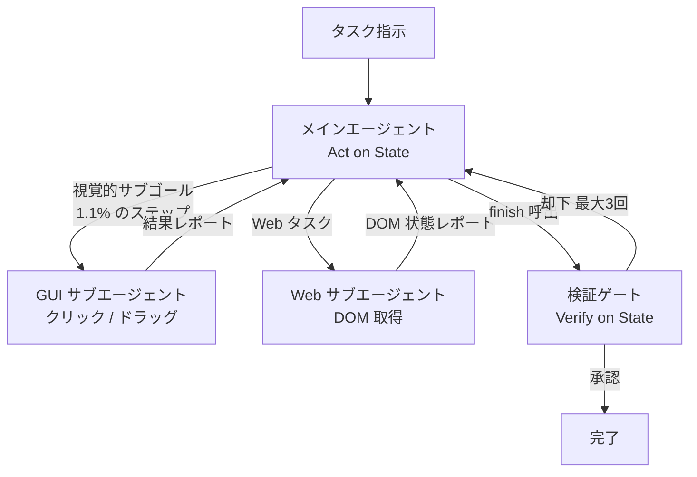

コンピュータ操作エージェント (Computer-Use Agent, 以下 CUA) を実務で使おうとすると、たいてい同じ壁にぶつかります。スクリーンショットを読み、座標をクリックし、また読み直す。この往復でトークンが溶け、長い作業ほど途中で迷子になります。

論文 [StateAct: Program State, before Pixels, for Long-Horizon Computer-Use Agents (arXiv:2607.22798)](https://arxiv.org/abs/2607.22798) は、この構造そのものを疑います。同じモデルのまま、ハーネス (エージェントの外側の仕組み) だけを組み替えて、成功率を上げつつコストを約 9 分の 1 にしました。

この記事では、その設計原則と、自分のエージェント基盤へ持ち帰れる判断材料を整理します。

## なぜ「画面を見る」設計が行き詰まるのか

CUA の主流は、画面ピクセルを視覚モデル (VLM) で読み取り、マウス座標を指定して操作するアーキテクチャです。人間と同じインターフェースを使えるので汎用性が高く、直感的でもあります。

しかし論文は、画面ピクセルを次のように位置づけます。

> 画面ピクセルは、ファイル・データベース・DOM・アプリケーションバックエンドといった**プログラム状態のレンダリング結果**にすぎない。

この変換には 2 つの性質があります。

| 性質 | 意味 | エージェントへの影響 |
|---|---|---|
| 情報損失 (lossy) | 状態の一部しか画面に出ない | スクロール外・非表示の値を取り逃す |
| 非単射 (non-injective) | 異なる状態が同じ画面になり得る | 「見た目が正しい」が「中身は誤り」を検知できない |

つまり画面は、状態の**劣化コピー**です。エージェントは劣化コピーを読み、劣化コピーに向けて操作し、劣化コピーで完了を判定していることになります。

StateAct が提示する原則は単純です。**プログラム状態を主チャネルにし、画面操作は例外に降格する**。これを論文は State-Grounding (状態基盤) と呼びます。

## 何がどれだけ改善したのか

検証は長尺タスクのベンチマーク OSWorld 2.0 (108 タスク) で行われ、バックボーンは Claude Opus 4.8 に固定されています。モデルは変えず、ハーネスだけを差し替えた比較です。

| 構成 | バイナリ成功率 | パーシャル成功率 | コスト/タスク | 出力トークン |
|---|---|---|---|---|
| Reference CUA (画面操作主体) | 20.6% | 54.8% | 約 $72 | 約 224K |
| **StateAct** | **26.9%** | **61.6%** | **約 $7.8** | **約 100K** |
| Code-Only (GUI 委譲を全廃) | — | 45.9% | — | — |

注目したいのは、精度とコストが同時に動いている点です。ふつうエージェントの精度改善は、試行回数や思考長を増やしてコストと引き換えに得ます。ここでは出力トークンが半分以下に減りながら成功率が上がっています。読み取りに費やしていた計算が、そもそも不要だったことを示唆します。

さらに、GUI 操作が占める割合は全ステップの **1.1%** にまで落ちました。ただし 3 行目が重要で、その 1.1% を完全に取り上げると 45.9% まで悪化します。**画面操作は不要ではなく、主役から降ろすべき**というのが実験の結論です。

## StateAct の 3 つの構成要素

### 1. Act on State: 状態を直接触る

メインエージェントは、マウスやキーボードを直接駆動するツールを**持ちません**。持っているのは永続的な Bash / Python セッションとファイルエディタです。

作業の起点になるのが State Discovery です。アプリがデータをどこに置くかという事前知識と、`find` / `grep` / `sqlite3` などによる能動的な探索を組み合わせ、「そのタスクの真の状態がどこにあるか」を先に特定します。表示されている値ではなく、保存されている値を対象にする、ということです。

画面でしか到達できないサブゴール — キャンバスのドラッグ、スクリプト不能なモーダル、画面上にしか存在しない値の読み取り — に当たったときだけ、専用の GUI サブエージェントへ委譲します。実測では 108 タスク中 28 タスク (25.9%) で委譲が発生し、メインステップ比 1.1%、全モデルターン比で約 11% でした。

### 2. Verify on State: 報告文ではなく成果物を見る

エージェントが `finish` を呼ぶと、独立した検証ゲートが起動します。ここに 2 つの仕掛けがあります。

- **Narration-Blind**: 検証者は過去のメッセージ履歴を一切見ません。「保存しました」「対応しました」という自己申告を評価材料から外します。
- **Anti-Capture**: 作業用の一時ファイルではなく、指定された保存先のファイル・DB・DOM を直接クエリし、存在・パス・形式といった構造的な完了性を確認します。

不備があれば差し戻し、最大 3 回まで修正させます。

### 3. Sustain State: 長尺で迷子にならない

長時間タスクの敵はコンテキストの劣化です。対策は 3 つです。

| 仕組み | 内容 |
|---|---|
| Fresh-Context Delegation | サブエージェントごとに独立したコンテキストを与え、主コンテキストの肥大を防ぐ |
| Auto-Compaction | 上限到達時に過去ログを要約し、画像を捨てて状態の事実だけ残す |
| Externalized Plan | チェックリストを会話履歴の外に置き、毎ターン再注入して脱線を防ぐ |

### どれが効いているのか

アブレーション (要素を 1 つずつ外す実験) の結果です。

| 構成 | パーシャル成功率 | ベースライン比 |
|---|---|---|
| StateAct (完全版) | 61.6% | +6.8 pt |
| Act-on-state なし | 51.3% | **-3.5 pt** |
| Verify-on-state なし | 57.5% | +2.7 pt |
| Context sustain なし | 58.7% | +3.9 pt |
| GUI 委譲なし (Code-Only) | 45.9% | -8.9 pt |

Act-on-state を外すと、ベースライン 54.8% すら下回ります。3 要素は対等ではなく、**状態基盤の操作が土台で、検証とコンテキスト維持はその上に乗る補強**という構造です。

## 素直に受け取れない点: 検証者の天井

この論文で実務家がいちばん持ち帰るべきなのは、成功率よりも失敗の分析です。

非パーフェクトなタスク 79 件のうち 76 件が検証ゲートに到達しましたが、**68 件がそのまま通過**しました。誤通過率にして約 89.5%。正しく却下できたのは 8 件で、いずれもファイル不在やパス誤りといった構造的失敗です。

失敗 79 件の根本原因は次の内訳でした。

| 原因 | 件数 | 割合 |
|---|---|---|
| Agent Reasoning Error (推論・計算の誤り) | 38 | 48.1% |
| Modality Bottlenecks / Ambiguity (モダリティ限界・曖昧さ) | 22 | 27.8% |
| Verifier-Weak / Wrong-Path (検証すり抜け) | 14 | 17.7% |
| Undecomposed (未分解) | 5 | 6.3% |

理由は構造的です。独立ゲートといっても、検証者はエージェントと同じ推論モデルで動いています。会話履歴を隠せば「言い訳への追従」は防げますが、**計算値の誤りや指示の誤解を再導出して見破ることはできません**。同じ間違え方をするからです。

ここから読み取れる限界は明確です。

- **プロンプトベースの検証で防げるのは構造的欠陥まで**。ファイルがあるか、パスが正しいか、形式が合っているか。
- **値の正しさは、正解オラクル (期待値・不変条件・独立な再計算) がないと担保できない**。

論文はこれを「ボトルネックの転換」と表現します。State-Grounding によって Perception (認識) の問題は縮小しましたが、代わりに Reasoning (推論) がボトルネックとして前面に出ました。失敗の理由が「何が見えていなかったか」から「何を考え違えたか」へ移ったわけです。

裏を返すと、State-Grounding は**認識の問題を解いただけで、推論の問題は解いていない**ということです。この論文を「CUA が実用段階に入った」と読むのは行きすぎで、「ボトルネックの置き場所が変わった」と読むのが妥当だと考えます。

## 自分のエージェント基盤にどう効かせるか

ここからは論文の主張ではなく、私が自分の agent-loop 基盤へ持ち帰った判断です。

### 1. 操作チャネルの優先順位を設計時に決める

「エージェントに何ができるか」ではなく「何をさせないか」を先に決めます。

| 優先度 | チャネル | 用途 |
|---|---|---|
| 1 | API / DB / ファイルシステム | 正規の操作。ここで完結させる |
| 2 | DOM (構造化テキスト) | Web で API がない場合 |
| 3 | GUI 操作 | 上記で到達不能な視覚サブゴールのみ |

重要なのは、優先度 3 を**別エージェントに隔離する**ことです。メインが GUI ツールを持っていると、難所で安易にそちらへ逃げます。ツールを持たせないことが、そのまま設計の強制力になります。

### 2. 完了条件を「報告」ではなく「アサーション」で書く

自己申告を完了根拠にしない、という原則は、そのまま worker の完了仕様に落とせます。

- 期待する成果物のパスと形式を、実行前に宣言する
- 完了判定は、その成果物を独立に読んで検証する
- 検証者にはエージェントの作業ログを渡さない

私の環境では、worker の完了を決定論的マーカーと独立アサーションで判定しており、これは Verify on State と同じ発想です。今回の論文で補強されたのは「**検証者に会話履歴を渡さない**」という一点でした。

### 3. 値の検証は別手段で用意する

誤通過率 89.5% という数字は、「LLM 検証者を置いたから安心」という運用を否定します。構造検証と値検証を分けて考えるべきです。

- 構造検証 (存在・パス・形式) → LLM 検証ゲートで妥当
- 値検証 (計算結果・件数・整合性) → 期待値の事前宣言、不変条件のアサート、別経路での再計算

後者を LLM に任せる限り、同じ思考の癖で同じ誤りを追認します。

### 4. 視覚モデルにコストをかけすぎない

論文は、GUI サブエージェントに小型モデル (31B 級) を使っても十分機能したと報告しています。視覚担当は登場頻度が低く、タスクも「クリックする」「読む」と限定的だからです。

主軸を状態操作に置けば、視覚性能への投資はコスト効率が悪くなります。予算配分を見直す根拠になります。

### 5. 権限分離を先に引く

Bash や Python で状態へ直接アクセスできるということは、**攻撃対象領域が広がる**ということでもあります。論文の主眼ではありませんが、実運用では避けて通れません。

- 観測用インターフェースは read-only にする
- 変更用インターフェースは対象範囲を明示的に絞る
- 検証ゲートには変更権限を与えない (検証者が自分で辻褄を合わせられてしまう)

## まとめ

- CUA の画面ピクセルは、プログラム状態の**情報損失を伴う劣化コピー**です。そこを主チャネルにする限り、精度もコストも構造的に不利になります。
- StateAct は同一モデルのままハーネスだけを変え、成功率 20.6% → 26.9%、コスト約 $72 → 約 $7.8 を達成しました。GUI 操作は全ステップの 1.1% です。
- ただし GUI を全廃すると 45.9% まで悪化します。画面操作は**主役から降ろすべきで、廃止すべきではありません**。
- 3 要素のうち土台は Act on State です。Verify / Sustain は補強であり、単独では効果が限定されます。
- 最大の警告は検証者の天井です。誤通過率 89.5%、失敗原因の 48.1% が推論エラー。**LLM 検証ゲートは構造的欠陥しか止められません**。
- 実務への落とし方は、①操作チャネルの優先順位を設計で固定する ②完了判定を報告でなくアサーションで書く ③値の検証は LLM 以外の手段で用意する ④視覚モデルへの投資を絞る ⑤観測と変更の権限を分離する、の 5 点です。

エージェント設計の論点は「どのモデルを使うか」から「どのチャネルを主にするか」へ移りつつあります。発注や設計の判断をする立場なら、モデル名より先に**エージェントが何を見て、何を触り、何で完了を判定しているか**を確認するのが実用的だと考えます。

この記事が少しでも参考になった、あるいは改善点などがあれば、ぜひリアクションやコメント、SNSでのシェアをいただけると励みになります！

## 参考リンク

- [StateAct: Program State, before Pixels, for Long-Horizon Computer-Use Agents (arXiv:2607.22798)](https://arxiv.org/abs/2607.22798) — 本記事の一次情報源
- OSWorld 2.0: Evaluating Computer-Use Agents on Long-Horizon Desktop Tasks — Yuan et al. (2026)。本記事の評価基盤
- Executable Code Actions for LLM Agents (CodeAct) — Wang et al. (2024)。コードをアクション空間とする先行研究
- Verifying GUI agent via system state (OpenComputer) — Wei et al. (2026)。状態による検証の関連研究
