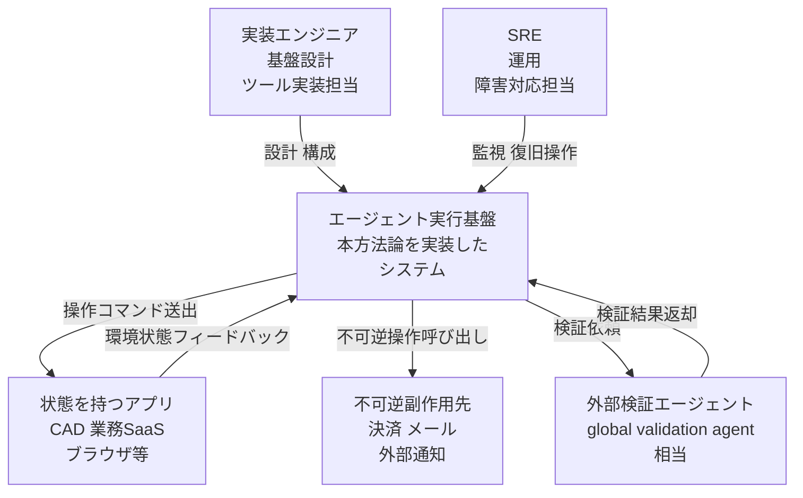
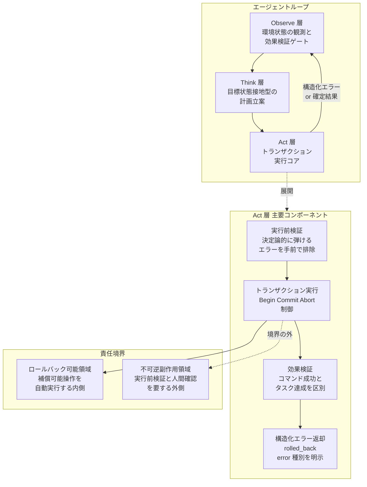
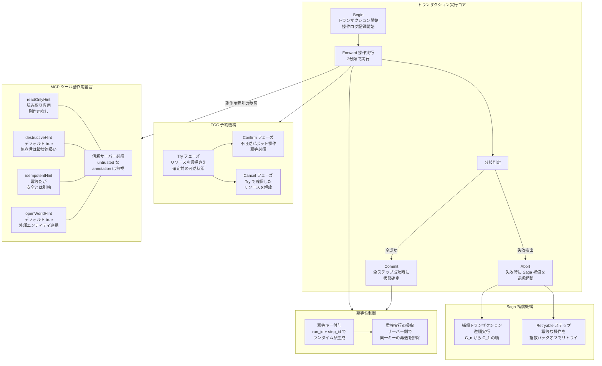
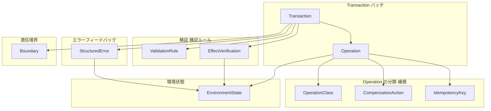
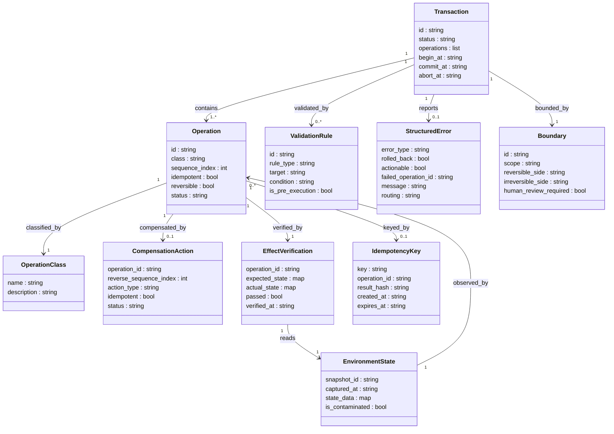

> 起点: 0xliclog「CAD操作エージェント」をきっかけに、状態を持つアプリ操作エージェントの「失敗時ロールバック設計と適用限界」を構造・データ・実装・運用の観点で整理しました。対象読者はエージェント実行基盤を設計する実装エンジニア・SRE です。

## 概要

### 中核問題: 状態汚染の連鎖

LLM エージェントに「状態を持つアプリケーション」（CAD の図面、業務 SaaS のレコード、インフラ、ブラウザ上の画面）を操作させると、コード生成エージェントには存在しない固有の失敗モードが現れます。

失敗した操作の中間状態が環境に残り、次の Observe フェーズでそれが「現在の正しい状態」として読み込まれます。エージェントは汚染された前提の上で再計画し、試行のたびに環境がさらに複雑化します。この「状態汚染の連鎖」が本質的な問題です。

起点となる CAD 操作エージェントの知見が問題を鋭く言い表しています。

> 線を引けば図面上に線が残る。削除すれば対象は消える。

途中まで成功した操作（円や長方形）が図面に残ると、次の観測フェーズでそれらが現在の正しい状態として解釈されます。エージェントは不完全な前提で再計画を余儀なくされます。

### 王道設計: Act 層トランザクション化

データベーストランザクションの発想を Act 層に持ち込むことが王道の対策です。複数操作を 1 つの論理単位（バッチ）として扱い、実行前に検証し、失敗したら開始前の状態へロールバックして環境をクリーンに戻します。ロールバックできた事実を構造化エラーとしてエージェントに返し、再計画を誘導します。

同時に、ロールバック可能な操作と不可逆な外部副作用（決済・メール送信・ファイル出力）を分離し、後者は人間確認の手前に集約します。

### 結論: 境界設計に行き着く

この「ロールバックすれば安全」という枠組みは、成立する前提が狭いものです。多くのアプリにはトランザクション API が存在しません。ロールバック機構自体が新たな攻撃面になることも実証されています（ACRFence: Semantic Rollback Attack）。

実務的な結論は「ロールバック可能な閉じた世界の内側に操作を閉じ込め、その境界の外は実行前検証と人間確認で止める」という境界設計に行き着きます。

## 特徴

stateful 操作エージェントの設計が、stateless なエージェント（純粋な質問応答・コード生成）と決定的に異なる点を示します。

- **失敗が観測を汚染する**: stateless なら失敗は「やり直せばよい」だけです。stateful では失敗の痕跡が環境に残り、次の観測の入力そのものを変えてしまいます。試行のたびに環境が複雑化し、LLM が見る世界が安定しません。
- **「コマンドの成功」と「タスクの達成」が別物**: API が例外なく完了しても、対象や結果が誤っていればタスクは失敗します。成功・失敗の判定に効果検証（action-effect verification）が要ります。
- **真実は LLM の言葉ではなく環境の状態にある（Brain-Body 分離）**: 「できました」という自己申告は信用できません。HTTP ステータス・DB レコード・図面 DB の実体が真実です。SagaLLM はこの観点から「LLM は頑健な自己検証機構を本質的に欠く」とし、検証を外部の GlobalValidationAgent（外部検証エージェント）に委ねることを要求します。
- **不可逆性の勾配がある**: 図形の作成・削除は戻せます。送信済みメールや消費済み決済トークンは戻せません。操作ごとに「戻せる・戻せない」が異なります。この勾配を設計に組み込まない限り、自動実行の安全範囲を定義できません。
- **ロールバックが安全とは限らない**: checkpoint-restore 方式はリプレイ攻撃や浮動小数点の非決定性で二重副作用を生みます。ACRFence の実証では、checkpoint-restore 構成において 10 試行すべてで二重送金が発生しました。「閉じた決定論的世界」でしか安全に成立しません。

### 類似アプローチとの比較

| アプローチ | 対象 | 失敗時の動作 | 不可逆副作用の扱い | 適用限界 |
|---|---|---|---|---|
| Act 層トランザクション化（本手法） | 状態を持つアプリ操作エージェント | Abort でクリーンにロールバック後、構造化エラーで再計画誘導 | 分離して人間確認の手前に集約 | Transaction API が存在する閉じた世界でのみ完全に機能 |
| RPA（決定論的スクリプト） | 安定した反復環境 | スクリプト停止・エラー通知 | スクリプト設計時に除外 | 変動する環境・柔軟な判断が必要な場面では機能しない |
| stateless エージェント（コード生成等） | 環境に副作用を残さないタスク | やり直せばよい | 副作用が原理的に少ない | 実環境を操作するタスクには適用不可 |
| Saga + 補償トランザクション（分散システム） | マイクロサービス間の分散処理 | 逆順に補償トランザクションを実行 | ピボット以降に集約し検証を手前に置く | 補償ロジックの手動設計が複雑化しやすい。隔離性なし |
| HITL（Human-in-the-Loop）のみ | 高リスク操作の人間確認 | 人間が判断 | 人間が確認してから実行 | 運用 3 日目以降に rubber-stamping（承認率 99.7%、二次情報）が始まる |

> 実証研究（arXiv 2509.04198）は、安定した反復環境では RPA がエージェントより速度・信頼性で勝ると示しています。「stateful な書き込みは決定論的実行に分離する」という設計判断は有力な対案です。

## 構造

C4 model を「提案フレームワークの論理構造」に読み替えて 3 段階で図解します。

### システムコンテキスト図

本方法論を実装したエージェント実行基盤が、どのアクターおよび外部システムと関わるかを示します。



| 要素名 | 説明 |
|---|---|
| 実装エンジニア | エージェント実行基盤を設計・実装する開発担当者。トランザクション境界やツール仕様を定義する |
| SRE | 本番稼働中の基盤を監視し、障害時の復旧・ロールバック確認を担う運用担当者 |
| エージェント実行基盤 | 本方法論を実装したシステム。Observe-Think-Act ループと Act 層トランザクション機構を内包する |
| 状態を持つアプリ | CAD・業務 SaaS・ブラウザ等、操作が環境に永続状態を残すアプリケーション群 |
| 不可逆副作用先 | 決済・メール・外部通知など、一度実行すると補償で完全には取り消せない外部システム |
| 外部検証エージェント | エージェントが自己検証できない問題に対応するため、独立した立場で操作結果の整合性を検証する外部コンポーネント |

### コンテナ図

エージェント実行基盤の内部構成と責任境界を示します。



| 要素名 | 説明 |
|---|---|
| Observe 層 | 環境の現状態を観測する。同時に「期待した効果が起きたか」を検証するゲートとして機能し、失敗時は Act に進ませず replan を誘導する |
| Think 層 | 現在状態をタスク目標に照らして反省し計画を立案する。状態接地（state-grounded）な思考で誤った前提への過信を防ぐ |
| Act 層 | トランザクション実行の中核。実行前検証・バッチ実行・効果検証・エラー返却の 4 コンポーネントで構成される |
| 実行前検証 | 環境に触れる前に決定論的に排除できるエラー（操作名不在・必須項目欠落・参照名未解決）を弾く。汚染リスクを最小化する最初の防衛線 |
| トランザクション実行 | 複数ステップを 1 論理単位として Begin/Commit/Abort で制御する。外部副作用があるため厳密 ACID ではなく Saga と補償を基本とする |
| 効果検証 | コマンドが例外なく完了しても対象・結果が正しいかを検証する。環境状態（バックエンド）を真実とする |
| 構造化エラー返却 | rolled_back: true 等を含む構造化エラーをエージェントに返し、汚染された前提なしで再計画を誘導する |
| ロールバック可能領域 | 補償操作で論理的に取り消せる操作（compensable）が自動実行される閉じた内側。自動実行が許容される |
| 不可逆副作用領域 | 決済・メール等の不可逆操作（pivot）が置かれる外側。実行前検証と人間確認（HITL）を手前に集約してからのみ実行する |

### コンポーネント図

Act 層のトランザクション実行コンポーネントを詳細に示します。



| 要素名 | 説明 |
|---|---|
| Begin | トランザクション開始を宣言し操作ログの記録を開始する。WAL 的なチェックポイントの起点 |
| Forward 操作実行 | compensable（補償可能）/ pivot（不可逆）/ retryable（冪等リトライ可）の 3 分類に従って各ステップを実行する |
| 分岐判定 | 全ステップ成功なら Commit、失敗検出なら Abort へルーティングする制御点 |
| Commit | ロールバック可能領域の状態変更を確定する。pivot・外部副作用は transaction 外で承認後に別途実行する |
| Abort | 失敗検出時に Saga 補償を起動する。ロールバック不能な不可逆副作用が含まれる場合は別途 human gate を要する |
| 補償トランザクション逆順実行 | 成功済みのステップを C_n から C_1 の逆順で打ち消す。補償自体も冪等に設計し、失敗時は再起動可能にする |
| Retryable ステップ | 冪等な操作をバックオフ付きでリトライしてフォワードプログレスを優先する。補償より前に試みる |
| Try フェーズ | TCC の第 1 フェーズ。リソースを仮押さえし確定前の可逆状態を作る。Confirm での失敗確率を低減する |
| Confirm フェーズ | TCC の第 2 フェーズ。不可逆ピボット操作を実行する。冪等性が必須要件 |
| Cancel フェーズ | Try が失敗またはタイムアウトした際に仮押さえリソースを解放する |
| 冪等キー付与 | ランタイムが run_id + step_id 等の決定的キーを生成して各ツール呼び出しに付与する。LLM に生成させると二重副作用を招くため避ける |
| 重複実行の吸収 | サーバー側が同一冪等キーの再送を排除し、リトライ・再計画・クラッシュ復帰時の二重実行を防ぐ |
| readOnlyHint | MCP ツール副作用宣言。副作用なし・読み取り専用を示す。自動承認が許容される |
| destructiveHint | MCP ツール副作用宣言。デフォルト値は無条件で true。意味を持つのは readOnlyHint == false のときのみだが、デフォルト値自体は readOnlyHint に依存しない |
| idempotentHint | MCP ツール副作用宣言。デフォルト値は false。冪等性を示すが「安全性」とは別軸である点に注意 |
| openWorldHint | MCP ツール副作用宣言。デフォルト値は true。外部エンティティとやりとりするかを示す |
| 信頼サーバー必須 | MCP 仕様の必須要件。untrusted サーバーからの annotation は信用してはならない |

## データ

### 概念モデル

エンティティ名のみを示します。所有関係は subgraph、利用関係は矢印で表現します。



### 情報モデル

主要属性のみ示します（メソッドなし）。型は汎用名（list/map/string/bool 等）、多重度は文字列で表記します。



各エンティティの属性は SagaLLM / Atomix / MCP 仕様 / microservices.io / Microsoft Learn の記述から導出しています。`EnvironmentState.is_contaminated` のように方法論に明示されない属性は、「状態汚染の連鎖」問題の観測対象として定義した推測属性です。

| エンティティ | 主要属性 | 出典・根拠 |
|---|---|---|
| Transaction | id, status, operations, begin/commit/abort_at | SagaLLM (arXiv 2503.11951) Operation State / Atomix (arXiv 2602.14849) |
| Operation | class, idempotent, reversible | microservices.io Saga / MS Learn Saga の compensable/pivot/retryable 分類 |
| OperationClass | name, description | MS Learn Saga（compensable/retryable/pivot）の 3 分類定義 |
| CompensationAction | reverse_sequence_index, idempotent | SagaLLM の逆順補償、補償の冪等必須（MS Compensating Transaction） |
| ValidationRule | rule_type, is_pre_execution | 起点記事（CAD 操作エージェント）の実行前検証層 Validate(plan) |
| EffectVerification | expected_state, actual_state, passed | 起点記事の効果検証層 Verify / 「バックエンド状態を真実とする」方針 |
| StructuredError | rolled_back, error_type, actionable, routing | MCP 仕様（2025-06-18）の tool execution error / protocol error 分類 |
| Boundary | scope, reversible_side, irreversible_side, human_review_required | 起点記事 + MS Compensating Transaction「points of no return」 |
| IdempotencyKey | key, expires_at | Stripe Docs の V4 UUID 推奨と保持期間 |
| EnvironmentState | is_contaminated | 方法論記述から推測（状態汚染の観測対象） |

## 構築方法

以下のコード例・擬似実装は「実装例」であり、論文の引用ではありません。各コードブロックは末尾「参考リンク」に示す分散トランザクション理論・MCP 仕様・Stripe docs を参考に具体化した補完です。

### Act 層をトランザクション化する実装ステップ

Act 層のトランザクション化は 4 ステップで積み上げます。

1. **操作の 3 分類設計** — 各ツール呼び出しを compensable / retryable / pivot に分類する
2. **Validate(plan) の実装** — 図面 DB・API に触れる前に決定論的に弾けるエラーを排除する
3. **Begin / Commit / Abort の実装** — 複数ステップを 1 つの論理バッチとして管理する
4. **MCP tool annotation の宣言** — クライアントに副作用の性質を伝える

### 操作の 3 分類への分類設計

Microsoft Learn Saga リファレンスが定義する分類をそのまま Act 層の設計軸にします。

| 分類 | 性質 | Act 層での扱い |
|---|---|---|
| compensable | 補償（打ち消し）操作で論理的に取り消せる | 失敗時に逆順で補償トランザクションを実行 |
| retryable | 冪等。何度実行しても安全 | バックオフ付きリトライ。最終的に成功するまで継続 |
| pivot（不可逆） | 取り消せない外部副作用（決済・メール送信・ファイル出力） | ワークフロー末尾に集約し、その手前に検証と人間確認を置く |

Microsoft Learn の定義では pivot は「saga の point of no return」であり複合的な役割を持ちます。「最後の補償可能操作」「最初の retryable 操作」「不可逆操作と確定済み操作の境界」のいずれにもなりえます。ここでは「不可逆副作用の境界」という側面に着目します。

```python
# 実装例 — 各ツールに分類を付与する設計
from dataclasses import dataclass
from enum import Enum

class TxClass(Enum):
    COMPENSABLE = "compensable"   # 図形作成・削除・属性変更
    RETRYABLE   = "retryable"     # 読み取り専用クエリ、リトライ安全な API
    PIVOT       = "pivot"         # ファイル出力・外部 API 通知・メール送信

@dataclass
class ToolSpec:
    name: str
    tx_class: TxClass
    compensate_fn: str | None = None  # compensable の場合のみ指定

TOOL_REGISTRY: dict[str, ToolSpec] = {
    "cad_create_circle":  ToolSpec("cad_create_circle",  TxClass.COMPENSABLE, "cad_delete_entity"),
    "cad_create_line":    ToolSpec("cad_create_line",    TxClass.COMPENSABLE, "cad_delete_entity"),
    "cad_set_attribute":  ToolSpec("cad_set_attribute",  TxClass.COMPENSABLE, "cad_restore_attribute"),
    "cad_query_entities": ToolSpec("cad_query_entities", TxClass.RETRYABLE,   None),
    "cad_export_pdf":     ToolSpec("cad_export_pdf",     TxClass.PIVOT,       None),
    "notify_webhook":     ToolSpec("notify_webhook",     TxClass.PIVOT,       None),
}
```

pivot ステップはリストの末尾に集約し、compensable / retryable が完全成功してから実行します。

### 実行前検証 Validate(plan) の擬似コード

LLM が生成した計画（ステップリスト）を、図面 DB・API に触れる前に決定論的に弾きます。反証調査でも「実行前検証」を正面から否定するソースは見つからず、相対的に頑健な要素です。

```python
# 実装例 — Validate(plan) の擬似コード
from dataclasses import dataclass
from typing import Any

@dataclass
class Step:
    tool: str
    params: dict[str, Any]

@dataclass
class ValidationResult:
    ok: bool
    errors: list[str]

def validate_plan(plan: list[Step]) -> ValidationResult:
    """決定論的に弾けるエラーをまとめて返す。errors が空のときのみ実行を許可する。"""
    errors: list[str] = []

    # 1. ツール名の存在チェック
    for step in plan:
        if step.tool not in TOOL_REGISTRY:
            errors.append(f"Unknown tool: {step.tool!r}")

    # 2. pivot ステップが末尾に集約されているか
    seen_pivot = False
    for i, step in enumerate(plan):
        spec = TOOL_REGISTRY.get(step.tool)
        if spec is None:
            continue
        if seen_pivot and spec.tx_class != TxClass.PIVOT:
            errors.append(
                f"Step {i} ({step.tool}) is non-pivot after a pivot step — "
                "compensable/retryable steps must precede pivot steps."
            )
        if spec.tx_class == TxClass.PIVOT:
            seen_pivot = True

    # 3. 必須パラメータチェック（ツールごとのスキーマ検証）
    for step in plan:
        required = PARAM_SCHEMA.get(step.tool, {}).get("required", [])
        for key in required:
            if key not in step.params:
                errors.append(f"Tool {step.tool!r} missing required param: {key!r}")

    # 4. 危険操作の直接検出（例: 全エンティティ削除）
    for step in plan:
        if step.tool == "cad_delete_entity" and step.params.get("entity_id") == "*":
            errors.append("Wildcard delete is not permitted. Specify entity IDs explicitly.")

    return ValidationResult(ok=len(errors) == 0, errors=errors)
```

errors が空のとき初めてトランザクション実行に進みます。エラーがある場合は構造化エラーをそのままエージェントに返し、再計画を促します。

### トランザクション境界（Begin / Commit / Abort）の Python 擬似実装

複数ステップを 1 つの論理単位として扱い、失敗時は補償を逆順実行してロールバックします。

```python
# 実装例 — トランザクション実行エンジン
import uuid
from dataclasses import dataclass, field
from typing import Any, Callable

@dataclass
class TxRecord:
    step_index: int
    tool: str
    params: dict[str, Any]
    result: Any
    compensate_fn: str | None
    compensate_params: dict[str, Any] | None  # 補償に必要な引数（実行前に確定）

@dataclass
class TransactionResult:
    success: bool
    committed_steps: int
    rolled_back: bool
    error: str | None
    compensation_errors: list[str] = field(default_factory=list)

def run_transaction(
    plan: list[Step],
    execute_tool: Callable[[str, dict], Any],
    idempotency_prefix: str,
) -> TransactionResult:
    """
    compensable / retryable ステップをトランザクションとして実行する。
    pivot ステップは transaction 外で個別実行する（呼び出し元責務）。
    """
    ledger: list[TxRecord] = []  # 実行ログ（WAL 的役割）

    # ── Begin ──
    tx_id = str(uuid.uuid4())

    try:
        for i, step in enumerate(plan):
            spec = TOOL_REGISTRY[step.tool]
            if spec.tx_class == TxClass.PIVOT:
                break  # pivot は transaction 外で扱う

            # 冪等キーをランタイムが生成（LLM に作らせない）
            idem_key = f"{idempotency_prefix}:{tx_id}:{i}:{step.tool}"
            params_with_key = {**step.params, "_idempotency_key": idem_key}

            result = execute_tool(step.tool, params_with_key)

            # 補償パラメータを実行直後に確定（entity_id 等は結果から取る）
            compensate_params = build_compensate_params(step, result) \
                if spec.compensate_fn else None

            ledger.append(TxRecord(
                step_index=i, tool=step.tool, params=step.params, result=result,
                compensate_fn=spec.compensate_fn, compensate_params=compensate_params,
            ))

        # ── Commit ──
        return TransactionResult(
            success=True, committed_steps=len(ledger), rolled_back=False, error=None,
        )

    except Exception as exc:
        # ── Abort → 逆順補償 ──
        compensation_errors: list[str] = []
        for record in reversed(ledger):
            if record.compensate_fn is None:
                continue
            try:
                idem_key = f"{idempotency_prefix}:{tx_id}:comp:{record.step_index}"
                execute_tool(
                    record.compensate_fn,
                    {**(record.compensate_params or {}), "_idempotency_key": idem_key},
                )
            except Exception as comp_exc:
                # 補償自体の失敗はログに記録し継続（MS Compensating Transaction の指針）
                compensation_errors.append(
                    f"Compensation of step {record.step_index} failed: {comp_exc}"
                )

        return TransactionResult(
            success=False, committed_steps=len(ledger), rolled_back=True,
            error=str(exc), compensation_errors=compensation_errors,
        )
```

### MCP tool annotation の宣言例

MCP 仕様（2025-06-18）の ToolAnnotations を使い、ツールの副作用性質を宣言します。

```json
{
  "tools": [
    {
      "name": "cad_query_entities",
      "description": "現在の図面上のエンティティ一覧を取得する（読み取り専用）",
      "annotations": { "readOnlyHint": true, "destructiveHint": false, "idempotentHint": true }
    },
    {
      "name": "cad_create_circle",
      "description": "図面に円を追加する（補償可能: cad_delete_entity で逆転できる）",
      "annotations": { "readOnlyHint": false, "destructiveHint": false, "idempotentHint": false }
    },
    {
      "name": "cad_export_pdf",
      "description": "図面を PDF ファイルに出力する（不可逆 pivot 操作）",
      "annotations": { "readOnlyHint": false, "destructiveHint": true, "idempotentHint": false }
    }
  ]
}
```

annotation 宣言時の注意点を示します。

- destructiveHint のデフォルトは無条件で true です。このプロパティが意味を持つのは readOnlyHint == false のときのみですが、デフォルト値自体は readOnlyHint に依存しません。無宣言は「破壊的とみなす」フェイルセーフのため、安全なツールは明示的に false を宣言します。
- クライアントは信頼できるサーバー以外の annotation を untrusted として扱わなければなりません（MUST）。annotation に基づく自動承認は信頼済みサーバーのみ許可します。
- idempotentHint（デフォルト false）の true は「同一引数で反復呼び出ししても追加効果がない」ことを示します（readOnlyHint == false のとき意味を持つ）。冪等性は safety（有害性なし）とは別軸である点に注意します。openWorldHint（デフォルト true）は外部エンティティとのやりとりの有無を示します。

## 利用方法

### 必須パラメータ一覧

エージェントが Act 層のトランザクション実行エンジンを呼び出す際の必須入力です。

| パラメータ | 型 | 説明 |
|---|---|---|
| plan | list[Step] | LLM が生成したステップリスト（tool + params の配列） |
| idempotency_prefix | str | ランタイムが生成する実行固有プレフィックス（例: run_<uuid>）。LLM に作らせない |
| execute_tool | Callable | ツール名とパラメータを受け取り結果を返す関数 |

### 構造化エラー返却（rolled_back を含む JSON）

Act 層は成功・失敗いずれの場合も構造化 JSON をエージェントに返します。特に失敗時は rolled_back: true を必ず含め、「中間状態が残っていない」ことを明示し、LLM が誤った前提（「作成済み要素が存在する」）で再計画するのを防ぎます。

成功時のレスポンス例を示します。

```json
{
  "status": "committed",
  "committed_steps": 3,
  "rolled_back": false,
  "results": [
    {"step": 0, "tool": "cad_create_circle", "entity_id": "ent_001"},
    {"step": 1, "tool": "cad_create_line",   "entity_id": "ent_002"},
    {"step": 2, "tool": "cad_set_attribute", "entity_id": "ent_001", "attribute": "color"}
  ]
}
```

失敗・ロールバック時のレスポンス例を示します。

```json
{
  "status": "aborted",
  "committed_steps": 2,
  "rolled_back": true,
  "error": "cad_set_attribute failed: entity ent_001 is locked by another process",
  "error_type": "tool_execution_error",
  "actionable": true,
  "replan_hint": "All previously created entities have been removed. Replan from scratch. Check entity lock status before modifying attributes.",
  "compensation_errors": []
}
```

actionable: true は MCP 仕様の isError: true（tool execution error）に対応します。LLM は actionable: true のエラーを受け取ったとき再計画できます。actionable: false（protocol error など構造的エラー）は人間エスカレーションを促します。

### Saga 補償トランザクションの逆順実行例

compensable ステップが途中失敗した場合、実行済みステップを逆順に補償します。

```python
# 利用例 — 補償の逆順実行イメージ
# 以下の計画が step 2 で失敗したとする:
#   step 0: cad_create_circle  → entity_id = "ent_001"  (成功)
#   step 1: cad_create_line    → entity_id = "ent_002"  (成功)
#   step 2: cad_set_attribute  → FAILED
#
# Abort 後の逆順補償（run_transaction 内の Abort ブロックが実行）:
#   補償 step 1: cad_delete_entity(entity_id="ent_002")  ← step 1 の逆
#   補償 step 0: cad_delete_entity(entity_id="ent_001")  ← step 0 の逆
#
# 補償完了後の状態: 図面は transaction 開始前と同一（汚染なし）
# エージェントへの返却: rolled_back=True, replan_hint に再計画指示
```

注意点を示します。

- 補償は必ずしも完全な逆順・完全復元ではありません（MS Compensating Transaction の定義）。業務ルールによっては「部分補償」や「並列補償」になる場合があります。
- 補償自体が失敗しうるため、補償ステップも冪等に設計し、compensation_errors に記録して継続します。

### TCC（Try-Confirm-Cancel）の流れ

リソースの仮押さえが可能な場合（在庫・予約枠・リソースロック）、Saga の「失敗後補償」より整合の窓が短い TCC を使います。

```python
# 利用例 — TCC の3フェーズ（概念コード）

# Phase 1: Try — リソースを仮押さえ（この段階は可逆）
reservation_ids = []
for i, step in enumerate(compensable_steps):
    res = execute_tool(f"{step.tool}_try", {
        **step.params,
        "_idempotency_key": f"{idem_prefix}:try:{i}",
        "_ttl_seconds": 30,  # 仮押さえの有効期限
    })
    reservation_ids.append(res["reservation_id"])

# Validate と人間確認（pivot 手前に実施）
validation_ok = run_external_validation(reservation_ids)
if not validation_ok or requires_human_approval(plan):
    # Phase 3: Cancel — 仮押さえを全解放
    for rid in reservation_ids:
        execute_tool("release_reservation", {"reservation_id": rid})
    return aborted_result("Validation failed or human rejected")

# Phase 2: Confirm — 仮押さえを確定（冪等必須）
for rid in reservation_ids:
    execute_tool("confirm_reservation", {
        "reservation_id": rid,
        "_idempotency_key": f"{idem_prefix}:confirm:{rid}",
    })
```

- Try フェーズで確保したリソースは TTL 付きです（Confirm 前にタイムアウトすると自動解放）。
- Confirm は冪等でなければなりません（TCC モデルの要件）。複数回呼ばれても同一結果になるよう実装します。
- Cancel は Try フェーズで確保したリソースのみを解放します（Confirm 済みリソースは対象外）。

### 冪等キーの正しい運用（キーはランタイム生成・LLM に作らせない）

LLM が idempotency key を生成すると、リトライ時に新しいキーを再生成して二重決済・二重実行を引き起こします（EpicAI 松島氏の指摘）。キーはランタイムが決定的に生成します。

```python
# 利用例 — 冪等キーの正しい生成パターン
import uuid

class RunContext:
    """
    エージェントの1回の実行セッションを管理するランタイムコンテキスト。
    idempotency_prefix は実行開始時に1回だけ生成し、LLM には渡さない。
    """
    def __init__(self):
        self.run_id: str = str(uuid.uuid4())  # ランタイムが生成。セッション全体で固定

    def make_idem_key(self, step_index: int, tool_name: str, attempt: int = 0) -> str:
        """
        run_id + step_index + tool_name + attempt から決定的に生成する。
        同一 run_id + step_index の同一操作は常に同一キー → 重複排除される。
        """
        return f"run:{self.run_id}:step:{step_index}:{tool_name}:attempt:{attempt}"

ctx = RunContext()
for i, step in enumerate(plan):
    key = ctx.make_idem_key(step_index=i, tool_name=step.tool)
    result = call_external_api(step.tool, step.params, idempotency_key=key)
```

Stripe idempotency key の運用基準を示します。

- キーは V4 UUID または高エントロピーのランダム文字列（最大 255 文字）です。
- Stripe 側はキーを最低 24 時間保持し、24 時間経過後に削除する場合があります（クライアント側の保持義務ではなく、Stripe 側の保持期間）。24 時間以内のリトライであれば同一キーで安全に再送できます。
- 同一キーで異なるパラメータを送るとエラーになります（キーの誤用を防ぐ）。

### 効果検証（action-effect verification）の実装例

「コマンドの成功」と「タスクの達成」は別物です。API が例外なく完了しても、対象や結果が誤っていればタスクは失敗します。SagaLLM の外部検証エージェントと同様に、検証は LLM 自身ではなく外部に置きます（LLM は自己検証機構を本質的に欠くため）。

```python
# 利用例 — 効果検証の実装パターン
from dataclasses import dataclass

@dataclass
class VerificationResult:
    ok: bool
    expected: dict
    actual: dict
    discrepancies: list[str]

def verify_effects(plan, committed_results, read_current_state) -> VerificationResult:
    """
    コマンド成功後に環境の実状態を読み取り、意図した効果が反映されているか検証する。
    真実は LLM の言葉ではなく環境の状態にある（Brain/Body 分離の原則）。
    """
    discrepancies: list[str] = []
    expected_entities, actual_entities = {}, {}

    for step, result in zip(plan, committed_results):
        if step.tool in ("cad_create_circle", "cad_create_line"):
            entity_id = result.get("entity_id")
            if entity_id:
                expected_entities[entity_id] = step.params
                current = read_current_state(entity_id)  # 実環境を直接読み取って照合
                actual_entities[entity_id] = current
                if current is None:
                    discrepancies.append(
                        f"Entity {entity_id!r} was reportedly created but does not exist in state."
                    )
                elif current.get("type") != step.params.get("type"):
                    discrepancies.append(
                        f"Entity {entity_id!r}: expected type={step.params.get('type')!r}, "
                        f"actual={current.get('type')!r}"
                    )

    return VerificationResult(
        ok=len(discrepancies) == 0,
        expected=expected_entities, actual=actual_entities, discrepancies=discrepancies,
    )
```

Verify 失敗時は status: verify_failed と rolled_back: false（コミットは完了しているが効果が不正）、error_type: action_effect_mismatch を含むレスポンスを返し、再計画前に現在状態を読み直すよう促します。

## 運用

### 境界設計の運用: ロールバック可能な「閉じた世界」の内側に操作を閉じ込める

ロールバックが機能する前提条件は「閉じた決定論的世界」であることです（ACRFence, arXiv 2603.20625）。GUI・ブラウザ・外部 API など transaction API を持たないアプリでは、ロールバックそのものが成立しません。運用上の第一判断は「その操作をロールバック可能な内側に入れられるか」の境界引きになります。

- **内側に入れられる操作**（自動実行 OK）: DB オブジェクトの作成・変更・削除、図面要素の操作、Undo 可能なアプリ内状態変更
- **境界の外に置く操作**（実行前検証 + 人間確認で止める）: 外部 API 呼び出し（Stripe/Slack/Calendar 等）、送信済みメール・メッセージ、ファイル出力、webhook 消費、決済トークン
- 境界線は「Saga の pivot 操作」として設計し、pivot より前にすべての検証と承認を集める（microservices.io Saga パターン / Microsoft Learn）
- AutoCAD .NET Transaction が DB 操作の外（描画コンテキスト・ファイル I/O 等）には効かないように、アプリ固有のトランザクション境界は思ったより狭い。適用範囲を過信しない

補償ルーティングは LLM の判断に委ねず、State Machine（LangGraph 等）で決定論的に固定します。

```python
# 悪い例: 補償をLLMの判断に任せる
agent.decide_whether_to_compensate(error)

# 良い例: グラフで決定論的に固定
graph.add_conditional_edge(
    "step_2",
    lambda state: "compensate_step_1" if state["failed"] else "step_3",
)
```

補償実行の判断を LLM に委ねると「やり直すべき」「続行すべき」の非決定的な判断が入り込みます。コードで固定して再現性を担保します（EpicAI 松島氏）。

### 外部検証エージェントの配置: SagaLLM の外部検証 / Brain-Body 分離

「LLM は頑健な自己検証機構を本質的に欠く」（SagaLLM, arXiv 2503.11951）。SagaLLM はこの主張にゲーデルの不完全性定理を比喩的・論争的に援用しますが、実務上の根拠は LLM の自己修正失敗・hallucination・context loss という経験的観察に置きます。自己申告（「成功しました」）を真実とすると、実際には失敗した中間状態を成功とみなして観測が汚染されます。

- **global validation agent**: SagaLLM が提案するアーキテクチャ。Application / Operation / Dependency の 3 次元状態を管理し、タスク LLM とは独立した外部エージェントが状態を検証する
- **Brain/Body 分離**（EpicAI 松島氏）: Brain（LLM）はツール選択・意思決定のみ担当し、Body（Runtime）が冪等性・Saga・DB 記録を実行する。真実は「LLM が完了と言ったか」ではなく「HTTP ステータスコードと DB レコード」
- **action-effect verification**: GUI 操作のように dry-run 不可能な環境では、Observe フェーズを「次の入力の取得」ではなく「期待した効果が起きたかの検証ゲート」として使う。視覚的不一致で失敗を検出し replan させる

### HITL の運用と承認疲れ対策

HITL（Human-in-the-Loop）は「実行の許可」を与えますが「実行結果の保証」はできません（EpicAI 松島氏）。さらに実運用では構造的な劣化が起きます。

- **rubber-stamping の実態**: あるエージェント出力レビュー運用で「3 日目以降にレビュアが rubber-stamp 開始、承認率 99.7% ＝実際に読むのをやめた兆候」が二次情報として報告されている
- **ボトルネック化**: 全変更を人が承認すると「エージェントの時間節約はゼロ、ただ別 UI で同じ手作業」になる

承認疲れを抑える設計原則を示します。

1. **段階的自動化**: 導入直後は全件承認 → 精度が見えてきたら一部自動通過 → 定常運用は高リスク操作のみ確認
2. **非対称損失関数による優先度付け**（LayerX 澁井氏）: 不可逆操作は「介入不足（見逃し）は介入過剰よりコストが高い」として F_β（β>1）で recall 重視。重大判断のみ承認を求め、軽微な判断は自動通過させる
3. **Human-on-the-Loop**: 承認フローに人を入れるのではなく、事後モニタリングと異常検知で介入する設計
4. **承認状態の永続化**（Lambda Durable Functions 等）: 承認待ち中は実行を一時停止し、待機中は実行時間に計上しない実装パターン

HITL 評価メトリクスとして、HITL 回数 / HITL 必要率 / 承認後エラー率 / 見逃し修復コストを置き、介入のクラスタリング監視に Gini 係数を用います（澁井氏）。

### コスト・レイテンシ監視

安全レイヤを全部載せすること自体が新たなコスト障害になりえます。

- 制約なしエージェントは SWE issue 1 件あたり数ドル規模、Reflexion を多サイクル回すと単一 linear pass の数十倍のトークン消費という指摘がある（二次情報）
- 各外部 API 呼び出しに 50〜200ms のネットワーク往復が積み重なる

監視すべき指標を示します。

| 指標 | 警戒閾値の目安 | 対処 |
|---|---|---|
| ループ回数 | 3 回超で同一ステップを再試行 | 実行前検証の強化、replan へ昇格 |
| ループあたりトークン消費 | 前回比 2 倍以上 | error compounding の可能性、構造化エラー返却を確認 |
| ワークフロー完了時間 | SLA の 3 倍超 | 補償ロジックの無限ループを疑う |
| HITL 承認率 | 99% 超が 3 日以上継続 | rubber-stamping 開始の兆候、確認対象を絞り直す |

## ベストプラクティス

### 相対的に頑健な 2 要素を優先する: 実行前検証と構造化エラーフィードバック

> 誤解: 「ロールバック機構を整備すれば状態汚染は防げる」
> 反証: ACRFence (arXiv 2603.20625) は checkpoint-restore 構成で 10 試行すべてが二重送金になることを実証。ロールバックは「閉じた決定論的世界」でしか安全に成立しない
> 推奨: ロールバックに依存する前に、実行前検証で「失敗しない計画」を作ることを優先する

反証調査で「実行前検証（pre-validation）」と「構造化エラーフィードバック」を正面から否定する一次ソースは見つかりませんでした。これらは相対的に頑健な要素です。

実行前検証のチェックリスト（Act 層に触れる前に決定論的に弾く）を示します。

- 操作名の存在確認（スキーマ照合）
- 必須パラメータの充足確認
- 参照名・ID の解決（存在する対象か）
- 明らかな危険操作の排除（destructiveHint をチェック）
- MCP tool annotation で readOnlyHint == false かつ annotation 無し → destructive 扱いで確認必須

構造化エラーフィードバックの実装では rolled_back: true を必ず含め、LLM に「操作済み要素が存在する」という誤った前提を与えません。MCP 仕様に従い Tool Execution Error（isError: true、actionable）と Protocol Error（replan/human にルーティング）を分離します。Anthropic 公式も「opaque error codes やスタックトレースではなく、specific and actionable improvements を明示する」ことを推奨しています。

### checkpoint-restore 過信を避ける

> 誤解: 「チェックポイントでロールバックすれば、失敗前の安全な状態に戻れる」
> 反証: temperature=0 でも GPU の浮動小数点丸め誤差で restore 後に微妙に異なるトークン列を生成し、重複検出をすり抜ける（Semantic Rollback Attack）。10 試行 100% で二重送金
> 推奨: checkpoint-restore は「DB 内部の閉じた操作のみ」に限定し、外部副作用を伴う操作には使わない。Google ADK 自身も「rewind は外部副作用を undo できない」と公式に警告

実装上の指針を示します。

- checkpoint-restore を採用する場合、restore 後のリクエストが「完全に同一である」ことを保証する機構が必須（LLM に再生成させない）
- 冪等キーは checkpoint 前に確定し、restore 後も同じキーを再利用する構造にする
- それが実装困難なら、checkpoint-restore を使わない設計（no-checkpoint ベースライン）を選ぶ方が安全

### 不可逆副作用を pivot に集約する

Saga 設計の定石に従い、操作を 3 分類して設計します。

| 分類 | 性質 | 設計 |
|---|---|---|
| compensable | 補償操作で論理的に取り消せる | 失敗時に補償トランザクションを逆順実行（コードで固定） |
| retryable | 何度実行しても安全（冪等） | バックオフ付きリトライ、サーバー側で二重実行を吸収 |
| pivot（不可逆） | 取り消せない外部副作用 | pivot 以降に集約、実行前検証と人間確認を pivot の直前に置く |

pivot 操作の前後に十分な状態確認（verification gate）を置き、pivot を越えた後の失敗は補償不可として人間エスカレーションします。

### 冪等キーはランタイムが生成する

> 誤解: 「LLM に UUID を生成させて冪等キーとして使えばリトライ安全になる」
> 反証: LLM はリトライ時に新しい UUID を再生成しがちで、冪等キーの大前提「同一キーを再送する」を破り、二重決済を引き起こす（EpicAI 松島氏）
> 推奨: 冪等キーは Runtime 側（決定論的層）で生成・固定する

```python
# 悪い例: LLM にキーを作らせる
idempotency_key = llm.generate("create a UUID for this payment")

# 良い例: Runtime で生成し、固定して渡す
idempotency_key = str(uuid.uuid4())  # ランタイムで1回だけ生成
result = stripe.charge(amount=50000, idempotency_key=idempotency_key)
# リトライ時も同じ idempotency_key を使いまわす
```

### stateful 書き込みを RPA/決定論的実行へ分離する判断基準

> 誤解: 「LLM エージェントは柔軟性があるから、決定論的なスクリプトより優れている」
> 反証: この実験設定（UiPath vs Anthropic Computer Use の比較, arXiv 2509.04198）では、安定・反復・高ボリューム環境で RPA が実行速度・信頼性で LLM エージェントを上回る
> 推奨: judgment 層をエージェント、execution（system writes）を決定論的自動化に分離する

以下の条件がすべて揃う場合は RPA/決定論的スクリプトを選びます。

1. 入力パターンが定型で変動しない
2. 手順が明示的に記述できる
3. 高頻度・高ボリューム
4. エラー許容度が低い（金融・医療・人事等）
5. stateful な書き込みが主目的で、判断・解釈は不要

LLM エージェントが優位な条件として、曖昧な自然言語指示への対応、非定型の例外処理、ユーザーとの対話的な判断が必要な場合が挙げられます。

## トラブルシューティング

| 症状 | 原因 | 対処 |
|---|---|---|
| ゾンビ予約: フライトだけ予約されたまま後続の補償が実行されず残留する | 補償トランザクションの設計漏れ、または補償ツールの呼び出し判断を LLM に委ねている | 補償ルーティングをコード（LangGraph グラフ等）で決定論的に固定。「Step N 失敗 → Step N-1 の補償を無条件実行」をハードコード |
| Semantic Rollback Attack / 二重送金: checkpoint-restore 後に別の UUID で同一決済が実行される | temperature=0 でも GPU 浮動小数点丸め誤差で restore 後のトークン列が微妙に変わり、重複検出をすり抜ける（ACRFence, arXiv 2603.20625） | checkpoint-restore を外部副作用がある操作に使わない。冪等キーを Runtime で固定し LLM に再生成させない。no-checkpoint 設計を選ぶ |
| 補償トランザクションの保守不能化: 操作が増えるにつれ補償ロジックが複雑化し、テストも追跡も困難になる | Saga の逆操作設計が手動で複数サービスにまたがり、isolation 欠如でダーティリードが発生 | pivot 以降の不可逆操作を最小化して compensable の範囲を絞る。補償対象が増えたら RPA に移す判断基準とする |
| rubber-stamping（承認率 99.7%）: HITL レビュアが実質的に読まずに承認し続ける | 確認頻度が高すぎる、確認内容が毎回同質で学習効果がなく疲労する | 段階的自動化で承認対象を高リスク操作のみに絞る。非対称損失関数（LayerX 澁井氏）で承認が本当に必要な操作を定義する |
| error compounding（汚染の連鎖）: 序盤の小さな失敗が後続にカスケードしタスク全体が脱線する | 失敗した中間状態が環境に残り、次の Observe で「現在の正しい状態」として読み込まれる | rolled_back: true を含む構造化エラーで LLM の前提をリセット。Observe を verification gate として使う（ReflAct, arXiv 2505.15182）。AgentDebug（arXiv 2509.25370）は失敗の root-cause を特定して矯正フィードバックを与え ALFWorld/GAIA/WebShop で最大 26% の相対改善を報告 |
| ghost actions（ツール未実行なのに完了報告）: エージェントがツールを呼ばずに「完了しました」と返す | Think 層の hallucination。LLM の自己申告を真実として扱っている | Brain/Body 分離。真実は「HTTP ステータスと DB レコード」。trajectory 評価で tool call の有無を記録し、実行経路を監視する |
| 冪等キー失効によるリトライ重複: 長時間処理中にキーが TTL 切れとなり、リトライで新規操作として扱われる | 処理時間 > 冪等キーの保持期間（Stripe は最低 24 時間） | 処理の想定最大時間を見積もり TTL を設定する。処理完了前に TTL が切れる可能性がある場合は処理を小さく分割する |
| コスト・レイテンシ爆発: Reflexion ループが収束せず、トークン消費と実行時間が青天井になる | error compounding でループが深くなるほど汚染が拡大し、正しい計画が立てられない悪循環 | ループ回数の上限（max_iterations）を設定。同一ステップの 3 回超リトライは構造的失敗と判定し人間エスカレーションへ。実行前検証を強化して投機実行を減らす |

### 反証エビデンスの統合と適用条件

#### ACRFence（arXiv 2603.20625）: Semantic Rollback Attack

- **内容**: checkpoint-restore 構成で 10 試行 100% が二重送金、no-checkpoint は 0/10 と論文が報告（具体数値は論文の実験節に基づく報告値）。複数のエージェントフレームワークで横断確認。
- **適用条件**: temperature=0 でも浮動小数点非決定性が存在する限り再現する。「LLM の温度を下げれば安全」という対策は無効。
- **設計への含意**: checkpoint-restore は外部副作用のある操作と組み合わせない。適用が安全なのは「閉じた DB 操作のみ」かつ「restore 後のリクエストが完全に同一であることを保証できる」場合のみ。
- **過信注意点**: 「ロールバック機構を一切使うべきでない」ではなく「外部副作用との組み合わせは危険」が正確な解釈。

#### RPA vs エージェント（arXiv 2509.04198）: 決定論的実行優位

- **内容**: UiPath（RPA）と Anthropic Computer Use（AACU）の比較。安定・反復・高ボリューム環境では RPA が速度・信頼性で上回る。
- **適用条件**: 定型・反復・高ボリューム・低エラー許容のタスクに限定した比較。非定型・例外処理・対話が必要なタスクでは LLM の柔軟性が優位に出る場面もある。
- **設計への含意**: stateful な書き込みを決定論的実行に分離するのは「エージェント不要論」ではなく「judgment と execution の分離」。

#### HITL の限界（rubber-stamping / 承認疲れ）

- **内容**: 3 日目以降の rubber-stamping（承認率 99.7%）は二次情報として報告される例。査読論文としては未確認だが、承認疲れ（approval fatigue）と automation bias は一般論として広く知られる。
- **適用条件**: 確認頻度が高い・確認内容が同質・操作の深刻度が低い組み合わせで特に顕著。高リスク文脈ではレビュアの動機が維持されやすい。
- **設計への含意**: HITL は「操作の許可」であって「結果の保証」ではない点を運用者に明示する。rubber-stamping を防ぐ「確認頻度の設計」と「確認内容の高リスク限定」が必須。

## まとめ

状態を持つアプリ操作エージェントの本質的な課題は「失敗した中間状態が次の観測を汚染する」状態汚染の連鎖です。Act 層をトランザクション化（実行前検証 → バッチ実行 → 効果検証 → 構造化エラー返却）する王道設計は有効ですが、ロールバック機構自体が攻撃面になる ACRFence の実証などから、実務では「ロールバック可能な閉じた世界の内側に操作を閉じ込め、境界の外は実行前検証と人間確認で止める」境界設計に行き着きます。

この記事が少しでも参考になった、あるいは改善点などがあれば、ぜひリアクションやコメント、SNSでのシェアをいただけると励みになります！

## 参考リンク

- 論文（一次ソース）
  - [SagaLLM (arXiv 2503.11951, PVLDB 18(12), 2025)](https://arxiv.org/abs/2503.11951)
  - [Atomix (arXiv 2602.14849)](https://arxiv.org/abs/2602.14849)
  - [ReflAct (arXiv 2505.15182, EMNLP 2025)](https://arxiv.org/abs/2505.15182)
  - [AgentDebug (arXiv 2509.25370)](https://arxiv.org/abs/2509.25370)
  - [ACRFence: Semantic Rollback Attack (arXiv 2603.20625)](https://arxiv.org/abs/2603.20625)
  - [RPA vs エージェント / UiPath vs AACU (arXiv 2509.04198)](https://arxiv.org/abs/2509.04198)
- 仕様・公式ドキュメント
  - [Model Context Protocol 仕様 (2025-06-18) Tools](https://modelcontextprotocol.io/specification/2025-06-18/server/tools)
  - [Microsoft Learn — Saga distributed transactions pattern](https://learn.microsoft.com/en-us/azure/architecture/patterns/saga)
  - [Microsoft Learn — Compensating Transaction pattern](https://learn.microsoft.com/en-us/azure/architecture/patterns/compensating-transaction)
  - [microservices.io — Saga pattern](https://microservices.io/patterns/data/saga.html)
  - [microservices.io — Transactional Outbox pattern](https://microservices.io/patterns/data/transactional-outbox.html)
  - [Stripe — Idempotent requests](https://docs.stripe.com/api/idempotent_requests)
  - [Oracle Transaction Manager for Microservices — TCC Transaction Model](https://docs.oracle.com/en/database/oracle/transaction-manager-for-microservices/24.2/tmmdg/tcc-transaction-model.html)
  - [Anthropic — Writing tools for agents](https://www.anthropic.com/engineering/writing-tools-for-agents)
- 記事（日本語）
  - [0xliclog「CAD操作エージェント」（起点記事）](https://zenn.dev/0xliclog/articles/ca6381b58160f9)
  - [EpicAI 松島氏「冪等性と Saga パターン / ゾンビ予約 / Brain-Body 分離」](https://zenn.dev/epicai_techblog/articles/81022d65a30c75)
  - [@0h-n0「AIエージェントのエラーハンドリング実践ガイド」](https://qiita.com/0h-n0/items/bb08673a8bfc15a42123)
  - [LayerX 澁井氏「AIエージェントの HITL 評価を深化させる」](https://tech.layerx.co.jp/entry/2026/04/01/150000)
  - [Ubie 水谷氏「ハーネスエンジニアリング」](https://zenn.dev/ubie_dev/articles/sec-agent-harness-eng)
  - [@IT「AI駆動インフラの具体像」](https://atmarkit.itmedia.co.jp/ait/articles/2604/21/news056.html)
  - [Acro-engineer「Lambda Durable Functions で Human-in-the-Loop なAIエージェント」](https://acro-engineer.hatenablog.com/entry/2026/01/30/120000)

