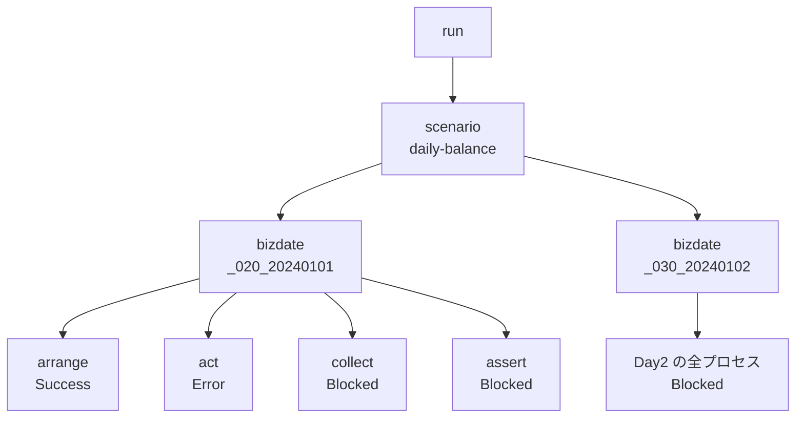

## この記事について

リリース前の総合テストで、こんな作業に心当たりはないでしょうか。

- 「業務日付を1日進めて再実行」を、日付を書き換えながら手動で繰り返す
- 途中でエラーが出たとき、以降を続けていいか詳しい人に聞かないと判断できない

こうした**業務日付をまたぐシナリオテスト**は自動化しづらく属人化しがちです。この記事では、そうしたテストをディレクトリ規約とプラグインの組み合わせで自動実行する Go 製 CLI [**stfw**](https://github.com/scenario-test-framework/stfw)（scenario test framework）を紹介します。読み終わる頃には、手元で `stfw run` を試したくなっているはずです。

## stfw とは

stfw は業務日付をまたぐシナリオテストをディレクトリ規約で記述し、単一バイナリで自動実行する Apache License 2.0 の OSS です。次の特徴があります。

- **単一バイナリ**: Go 製。実行エンジンを内包しており、digdag のような外部ワークフローエンジンや JVM は不要
- **規約ベース**: `scenario/{name}/_{seq}_{bizdate}/_{seq}_{group}_{type}/` という階層にスクリプトや設定を置くだけでテストになる
- **順序保証・エラー時停止**: ファイル名の昇順で逐次実行し、エラー以降のステップは `Blocked` として記録される
- **可視化**: JSONL 実行ジャーナル + `stfw status` + 静的 HTML レポート
- **オブザーバビリティ**: run/scenario/bizdate/process/step の実行状況を OTLP トレースとしてエクスポート（Jaeger 等でそのまま可視化）
- **組込みプラグイン**: Arrange → Act → Collect → Assert を部品の組み合わせで記述できる

配布はマルチプラットフォームバイナリ（GitHub Releases）と Docker イメージ（`ghcr.io/scenario-test-framework/stfw`）です。

## Quick Start

まずは触ってみます。Linux / macOS の場合はワンライナーでインストールできます（Windows は PowerShell 版の `install.ps1` が別途用意されています）。

```sh
curl -fsSL https://raw.githubusercontent.com/scenario-test-framework/stfw/master/install.sh | bash
stfw --version
```

`install.sh` は OS / arch を自動判定し最新リリースを入れます。Docker 版もあり、組込みプラグイン（RDBMS / Redis / ssh 系 / invokeWeb）を使う場合は mysql / psql / redis-cli / sshpass / Chromium 同梱の `stfw:full`（`docker pull ghcr.io/scenario-test-framework/stfw:full`）を使います。

インストールできたら、プロジェクトを初期化してサンプルシナリオを実行してみます。

```console
$ mkdir myproject && cd myproject
$ stfw init                        # プロジェクト初期化 (sample シナリオ付き)
$ stfw run sample                  # シナリオ実行
$ stfw status                      # 実行結果ツリーの表示
$ stfw report                      # HTML レポート再生成 (.stfw/reports/)
```

## ディレクトリ規約

stfw の中核は、この 3 階層のディレクトリ規約です。

```
myproject/
├── stfw.yml                     # プロジェクト設定 (デフォルト設定を上書き)
├── config/
│   ├── inventory/staging.yml    # テスト対象ホストのグループ定義
│   ├── encrypt/                 # 暗号化キー (stfw secret keygen)
│   └── passwd/                  # 暗号化済み資格情報 (stfw secret set)
├── plugins/                     # 階層フック・独自プロセスプラグイン
└── scenario/
    └── {scenario}/              # シナリオ
        └── _{seq}_{bizdate}/    # 業務日付 (昇順に実行)
            └── _{seq}_{group}_{type}/   # プロセス (昇順に実行)
                └── scripts/     # ステップ (昇順に逐次実行, エラーで停止)
```

ポイントは 2 つです。**`bizdate` ディレクトリが業務日付を第一級で表現する**こと（`_{seq}_{bizdate}` を昇順に実行するだけで、前日の結果を翌日へ繰り越す日次バッチを自然に表現できます）。もう 1 つは**`type` がプラグイン種別を表す**こと（`group` にフェーズ名を入れておけば、ディレクトリ名を見るだけでテストの流れが読めます）。

## Arrange → Act → Collect → Assert で組み立てる

stfw のシナリオテストは、次の 4 フェーズで記述します。

| フェーズ | 何をするか |
|---|---|
| **Arrange**（準備） | テスト前提のデータ・ファイルを外部システムへ配置し、状態を初期化する |
| **Act**（実行） | テスト対象システム（SUT）に取引を入力し、処理を起動する |
| **Collect**（収集） | 実行後の状態（DB・ファイル・ログ）をエビデンスとして取り出す |
| **Assert**（検証） | 収集したエビデンスを期待値と突合し、合否を判定する |

各フェーズの組込みプラグインは次のとおりです。

| フェーズ | プラグイン | 説明 |
|---|---|---|
| Arrange | `importMysql`/`importPostgres`/`importRedis` | CSV からデータストアへ投入 |
| Arrange | `clearMysql`/`clearPostgres`/`clearRedis` | データストアの初期化 (truncate/flush) |
| Arrange | `scpPut` | ローカルファイルをリモートへ原子的に配置 |
| Act | `invokeRest`/`invokeWeb` | grafana k6 による API 取引入力・ブラウザ操作 |
| Act | `sshExec` | リモートスクリプトの一括実行 |
| Collect | `collectFile`/`collectLog` | リモートのファイル/ログ収集 (時刻フィルタ) |
| Collect | `exportMysql`/`exportPostgres`/`exportRedis` | データストアの CSV エクスポート |
| Assert | `compare` | 期待値とエビデンスのディレクトリ突合 |

言葉だけだとイメージしづらいので、同梱の実行可能サンプル [`examples/daily-balance`](https://github.com/scenario-test-framework/stfw/tree/master/examples/daily-balance)（口座残高の日次バッチ。postgres + トイ REST API 同梱、`./run.sh` で end-to-end に動く）を通し例に見ていきます。「データ準備」と「業務日付ごとの実行」を bizdate 階層で分離しています。

```
scenario/daily-balance/
├── _010_20240101/                     # データ準備 (取引は流さない)
│   ├── _10_arrange_clearPostgres/     # truncate
│   ├── _15_arrange_importMasterData/  # マスタ投入 (カスタムプラグイン。後述)
│   └── _20_arrange_importPostgres/    # 初期残高を投入
│       └── data/appdb/accounts.csv
├── _020_20240101/                     # Day1
│   ├── _10_arrange_updateBizdate/     # SUT の業務日付を 20240101 へ (カスタムプラグイン)
│   ├── _30_act_invokeRest/            # 取引 POST (script.js)
│   ├── _40_collect_exportPostgres/    # 残高・取引履歴を収集 (evidence/appdb/*.csv)
│   └── _50_assert_compare/            # 期待残高・取引の業務日付と突合
└── _030_20240102/                     # Day2 (reset/seed なし = 前日を繰越)
    ├── _10_arrange_updateBizdate/     # SUT の業務日付を 20240102 へ
    ├── _30_act_invokeRest/
    ├── _40_collect_exportPostgres/
    └── _50_assert_compare/
```

`_020` 以降は reset / seed を行わず、**updateBizdate**（カスタムプラグイン）で業務日付だけを進めます。取引の業務日付は API の payload では渡さず、SUT が業務日付テーブル `biz_calendar` から解決します。

### Arrange — データを整える

プラグインの設定は `stfw.process.{type}` 配下に書き、3 層の上書きチェーン（プラグイン既定 → プロジェクト共通 `config/plugins/process/{type}/config.yml` → プロセス `config/config.yml`）で解決されます。**シナリオを跨いで同じ設定（接続系など）はプロジェクト共通に置き、プロセスには差分だけを書きます**（接続情報は config に直書きせず inventory/secret で解決）。

```yaml
# config/plugins/process/importPostgres/config.yml — プロジェクト共通 (全シナリオに効く)
stfw:
  process:
    importPostgres:
      host_group: db        # inventory グループ → 接続先ホスト
      database: appdb
      user: appuser          # パスワードは secret {host}-{user} で解決
```

```yaml
# _20_arrange_importPostgres/config/config.yml — プロセスは差分のみ
stfw:
  process:
    importPostgres:
      tables: [accounts]     # data/appdb/accounts.csv を投入
```

投入 CSV（`data/{database}/{table}.csv`）はヘッダー付き・NULL は `\N`（`exportPostgres` の出力形式と同じ）。

### Act — システムを叩く

`invokeRest` は grafana k6 でスクリプトを実行します。接続先はプロジェクト共通の config（`host_group: api`）で解決され、その先頭ホストが `__ENV.stfw_target_host` として k6 スクリプトに渡ります。スクリプトは既定の `script.js`（プロセスディレクトリ直下）を使うため、プロセス側の config は差分なし（`invokeRest: {}`）です。

```js
// script.js — 閾値を満たさない (=非 201) 応答があれば k6 が非 0 終了し Act 失敗
const host = __ENV.stfw_target_host;
export const options = { vus: 1, iterations: 1, thresholds: { checks: ['rate==1.0'] } };
export default function () {
  const res = http.post(`http://${host}:8080/transactions`, JSON.stringify(tx), ...);
  check(res, { 'status is 201': (r) => r.status === 201 });
}
```

k6 の `check` が失敗すると k6 自体が非 0 で終了し、そのまま Act フェーズの失敗になります。

### Collect / Assert — 取り出して突合する

`exportPostgres` は対象テーブルを `evidence/{database}/{table}.csv` へ書き出します。config は `importPostgres` と同形で `tables` を列挙するだけです。`compare` は `expect/` と収集済みエビデンス（`actual/`）を突合します。期待残高を CSV で置くだけです。

```
# _020_20240101/_50_assert_compare/expect/_40_collect_exportPostgres/appdb/accounts.csv
id,balance
acc-001,1500     # 1000 + 500
acc-002,2300     # 2000 + 300
```

Day2（`_030`）は初期化を持たず、updateBizdate で業務日付だけを進め、Day1 の残高（1500 / 2300）に取引（-200 / +100）を反映して **1300 / 2400** になることを検証します。これが「業務日付をまたぐ繰越」の実体です。

collect は残高（accounts）に加えて取引履歴（transactions）も収集し、compare は「取引が正しい業務日付で記録されたこと」も突合します。

```
# _020_20240101/_50_assert_compare/expect/_40_collect_exportPostgres/appdb/transactions.csv
id,account_id,amount,bizdate
1,acc-001,500,20240101
2,acc-002,300,20240101
```

`transactions` の連番 `id` は `TRUNCATE` でシーケンスがリセットされないため、再実行のたびに値がずれます。そこで**プロジェクト共通の比較レイアウト**（`config/plugins/process/compare/compare_layout/transactions.json`）で `id` を `Ignore`（比較除外）、`account_id` + `bizdate` を `compareKey`（行の対応付けキー）にしています。id がずれても、行の物理順が変わっても、突合は安定します。

```json
{ "id": "id",         "criteria": "Ignore", "compareKey": "false" },
{ "id": "account_id", "criteria": "Equal",  "compareKey": "true" },
{ "id": "amount",     "criteria": "Equal",  "compareKey": "false" },
{ "id": "bizdate",    "criteria": "Equal",  "compareKey": "true" }
```

このレイアウトはシナリオを跨いで共通のため、プロジェクト共通の置き場（`config/plugins/process/compare/`）に 1 つ置くだけで全シナリオに効きます（プロセス固有の上書きは各プロセスの `config/compare_layout/` が優先）。残高（accounts.csv）にも同様に `id` をキーにした共通レイアウトを置き、行順に依存しない突合にしています。`compare` は `expect/{収集プロセス名}/{table}.csv` の期待値を収集済みエビデンスと突合し、差分があれば非 0 終了してシナリオを失敗させます。

### 動かしてみる・失敗させてみる

`examples/daily-balance` は Docker Compose で完結しており、次のコマンドで一気通貫に動きます。

```sh
cd examples/daily-balance
./run.sh
```

`run.sh` は依存サービス起動から `stfw run daily-balance`、HTML レポート配信までを一括で行います。実行後は `http://localhost:8088` で HTML レポート、`http://localhost:16686` で Jaeger のトレースを見られます（後片付けは `./run.sh --down`）。

Assert が効いているかは、期待値を書き換えて再実行すれば確認できます。

```sh
# 例: Day1 の期待残高を 1500 → 9999 に変える
vi stfw/scenario/daily-balance/_020_20240101/_50_assert_compare/expect/_40_collect_exportPostgres/appdb/accounts.csv
docker compose run --rm stfw run daily-balance   # compare が差分を検出し Error 終了
```

## 失敗時の挙動: エラー停止と Blocked 伝播

シナリオテストで一番運用がつらいのは、「成功パス」よりも「失敗したときにどこまで進んでいいか」の判断です。stfw はこれをルール化しています。

- ステップはファイル名の**昇順で逐次実行**される
- いずれかが**エラー終了すると、以降は実行されず `Blocked` として記録**される（Blocked 伝播）
- この伝播は process 内だけでなく bizdate・scenario・run の各階層にも及ぶ

たとえば Day1 の Act が失敗すると、こうなります。



これにより、失敗時に詳しい人へ都度確認する属人化を避けられます。結果は JSONL の実行ジャーナルに記録され、`stfw status` / `stfw report` で確認できます。OTLP トレースを有効にすれば run → scenario → bizdate → process → step のスパンツリーを Jaeger 等でも確認できます（1 run = 1 トレース）。

## 拡張: プロセスプラグイン契約

独自のテストロジックもプロセスタイプとして追加できます。契約はシンプルです。

- **入力**: 環境変数（`stfw_*` = 設定のフラット化 + `STFW_PROJ_DIR` などの実行コンテキスト）
- **出力**: リターンコード（`0` = Success / `3` = Warn / `6` = Error。ただし成否判定は「`0` か否か」で、`3` も実行上は Error として扱われます）
- **実装言語は任意**（実行可能ファイルであればよい）

プロセスは `setup → pre_execute → execute → post_execute → teardown` の順に実行され、非 0 終了で後続がブロックされます。

`examples/daily-balance` にはこの契約に沿ったカスタムプラグインが 2 つあり、どちらも「組込みプラグインを部品として再利用できる」実演です。

- **importMasterData**: 複数シナリオ共有のマスタデータ（口座名義 `users`）を投入し、DB 反映は組込み `importPostgres` へ委譲
- **updateBizdate**: stfw が注入する実行コンテキスト env `stfw_bizdate`（YYYYMMDD）から SUT の業務日付テーブル `biz_calendar` を更新し、反映は組込み `clearPostgres`/`importPostgres` へ委譲。**bizdate ディレクトリ名が業務日付の唯一の正**になる

詳細は [docs/AS-BUILT.md](https://github.com/scenario-test-framework/stfw/blob/master/docs/AS-BUILT.md) §4 を参照してください。

## ドキュメント往復: シナリオを文書化・雛形生成する

ここまでの `daily-balance` はディレクトリを直接編集して作りましたが、stfw にはシナリオを spec（構造化 YAML）や doc（Markdown）へ変換するコマンドもあります。「**tree（ディレクトリ構造）が真実の源**・spec は tree と可逆・doc は tree からの読み取り専用の投影」という方式です。

```sh
cd examples/daily-balance/stfw

# tree -> spec + doc (既定出力先 docs/)
stfw scenario reverse daily-balance
#   -> docs/daily-balance.yml  (spec)
#   -> docs/daily-balance.md   (doc)

# spec -> tree (往復の入口)
stfw scenario scaffold /tmp/daily-balance-2.yml
```

`reverse` は spec と doc を常にセットで生成します。doc には要求トレーサビリティ表と、業務日付ごとの process 一覧・設定が並びます。往復できるのは骨格（seq / bizdate / group / type / description / requirement_specifications / config.yml）のみで、`data/**`・`scripts/**`・`expect/**` などの葉（人が書く部分）は対象外です。

spec を編集後は `stfw scenario scaffold --sync docs/daily-balance.yml` で既存ディレクトリへ差分同期できます（消えた bizdate/process は葉ごと削除される破壊的操作）。

## まとめ

stfw は業務日付をまたぐシナリオテストを、次の 3 点で扱いやすくします。

- **ディレクトリ規約**でテストの構造をコード化し、レビュー可能・再実行可能な資産にする
- **Arrange → Act → Collect → Assert** の組込みプラグインで DB・API・ssh・ファイル突合を部品として組み合わせられる
- **Blocked 伝播 + HTML レポート + OTLP トレース**で、失敗時の判断を属人化させない

単一バイナリで CI にも組み込みやすく、`examples/daily-balance` を動かすのが理解の近道です。

リポジトリ: https://github.com/scenario-test-framework/stfw（インストールは記事冒頭の `curl | bash` 一行）。

この記事が少しでも参考になった、あるいは改善点などがあれば、ぜひリアクションやコメント、SNSでのシェアをいただけると励みになります！
