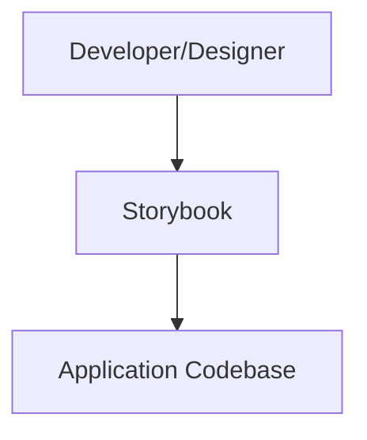
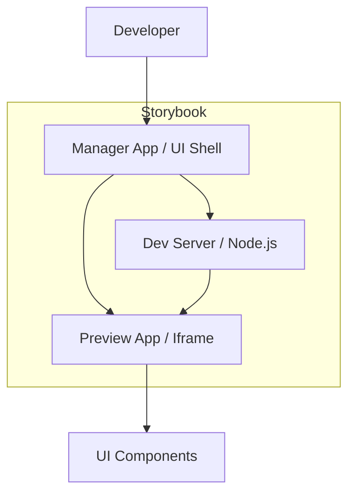
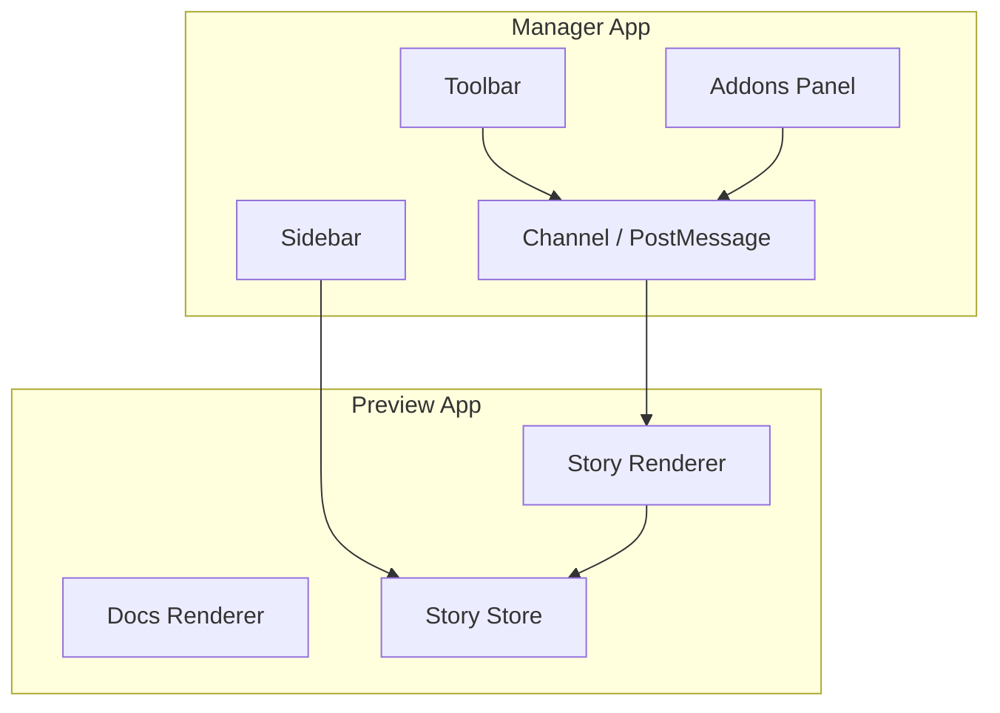
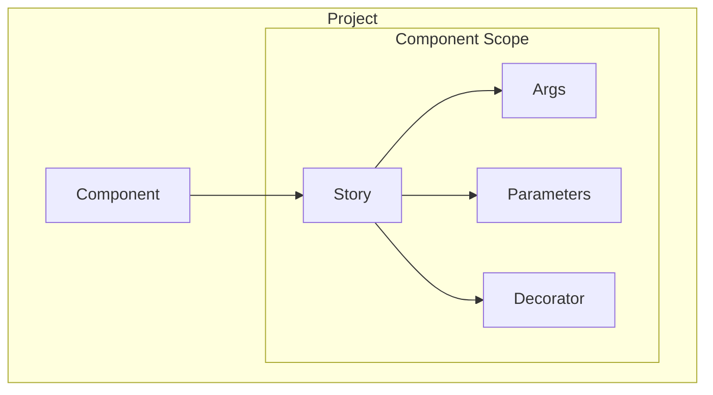
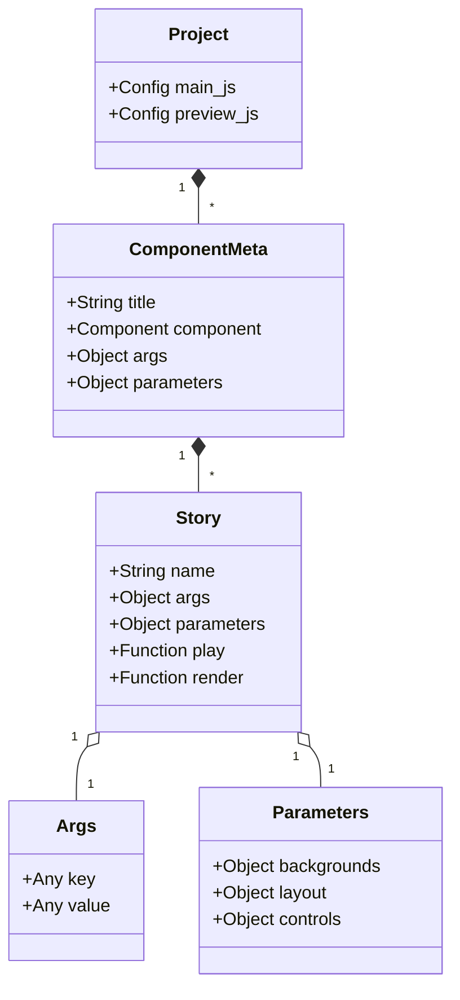
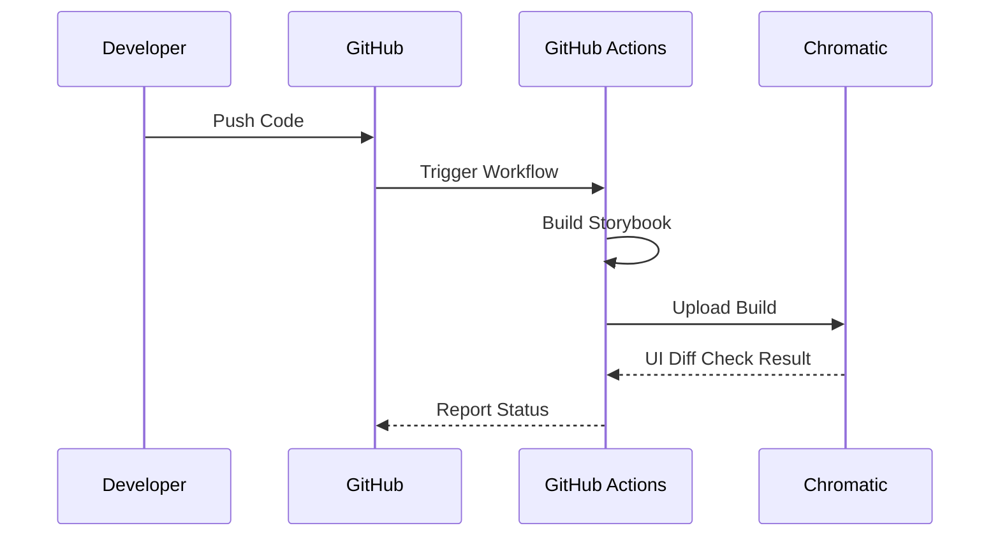

## ■概要
Storybookは、UIコンポーネントをアプリケーションのビジネスロジックから切り離して開発、テスト、ドキュメント化するためのフロントエンドワークショップ環境です。
単なる「コンポーネントカタログ」ではなく、アプリケーションという巨大なシステムから切り離された「サンドボックス」の中で、個々のコンポーネントを独立して構築できる環境を提供します。

多くの現場で導入されていますが、**「導入したものの、更新されずに形骸化してしまう」**という課題もよく耳にします。本記事では、Storybookの基本的な使い方だけでなく、その**内部アーキテクチャ**を理解し、**持続可能な運用**を行うための設計とベストプラクティスを解説します。

### ●コンポーネント駆動開発 (CDD)
Storybookは「コンポーネント駆動開発（Component-Driven Development: CDD）」を強力に推進します。CDDとは、UIを「ページ」単位ではなく「コンポーネント」単位でボトムアップに構築していく手法です。
これにより、バックエンドAPIが未完成であってもUI開発を先行させることが可能となり、エッジケースの検証も容易になります。

## ■特徴
- **分離開発 (Isolation)**: アプリケーションのコンテキスト（APIや複雑な状態）に依存せず、コンポーネント単体で開発・検証が可能。
- **生きたドキュメント (Living Documentation)**: 実装と同期したカタログとして機能し、デザイナーとの共通言語になります。
- **堅牢なテスト基盤**: インタラクションテストやビジュアルリグレッションテストの基盤として機能します。

## ■構造

Storybook 10では、アーキテクチャが刷新され、**ESM (ECMAScript Modules) ネイティブ**となりました。CommonJS (CJS) のサポートが廃止されたことで、「デュアルパッケージハザード」が解消され、パフォーマンスが大幅に向上しています（インストールサイズ約50%減）。

### ●システムコンテキスト図



| 要素名               | 説明                                                        |
| :------------------- | :---------------------------------------------------------- |
| Developer/Designer   | Storybookを利用してUIコンポーネントを確認、開発するユーザー |
| Storybook            | UIコンポーネントの開発・カタログ化を行うツール              |
| Application Codebase | 開発対象のUIコンポーネントが含まれるソースコード            |

### ●コンテナ図



:::message
**なぜIframeなのか？**
Preview AppはIframe内で動作します。これにより、Storybook自体のCSSやスクリプトが、ユーザーのコンポーネントに影響を与える（汚染する）ことを防いでいます。逆に言えば、アプリのGlobal CSS等は明示的にPreview側に読み込ませる必要があります。
:::

| 要素名        | 説明                                                         |
| :------------ | :----------------------------------------------------------- |
| Manager App   | ユーザーが操作するUIシェル（サイドバー、アドオンパネルなど） |
| Preview App   | ユーザーのコンポーネントを実際にレンダリングするIframe領域   |
| Dev Server    | ビルドやホットリロードを提供するバックエンドプロセス         |
| UI Components | 実際に描画されるアプリケーションのコンポーネント群           |

### ●コンポーネント図



| 要素名         | 説明                                                            |
| :------------- | :-------------------------------------------------------------- |
| Sidebar        | Storyの階層構造を表示し、ナビゲーションを提供するコンポーネント |
| Toolbar        | ズーム、背景色変更、Canvas/Docs切り替えなどのツール群           |
| AddonsPanel    | Actions、Controlsなどのアドオン機能を表示するパネル             |
| Channel        | ManagerとPreview間でイベントやデータを通信するための機構        |
| Story Renderer | 選択されたStoryをCanvas上に描画するコンポーネント               |
| Docs Renderer  | 自動生成されたドキュメントページを描画するコンポーネント        |
| StoryStore     | ロードされた全てのStoryとメタデータを管理するストア             |

## ■データ

### ●概念モデル



| 要素名     | 説明                                                    |
| :--------- | :------------------------------------------------------ |
| Project    | Storybookで管理される全体のプロジェクト                 |
| Component  | 開発対象のUIコンポーネント単位                          |
| Story      | コンポーネントの特定の状態を定義したもの                |
| Args       | コンポーネントに渡される動的な入力データ（Props等）     |
| Parameters | StoryやAddonの静的な設定メタデータ                      |
| Decorator  | Storyの描画をラップして装飾やコンテキストを提供する関数 |

### ●情報モデル



| 要素名        | 説明                                                                      |
| :------------ | :------------------------------------------------------------------------ |
| Project       | Storybook全体の設定（main.js, preview.js）を持つルート要素                |
| ComponentMeta | CSFファイルのデフォルトエクスポート。コンポーネント全体のメタデータを定義 |
| Story         | CSFファイルの各エクスポート。個別のStory定義                              |
| Args          | Storyに渡される引数。主にコンポーネントのPropsとして利用される            |
| Parameters    | Storybookの機能やアドオンの挙動を制御する静的な設定値                     |

### ●Component Story Format (CSF)
CSFは、UIコンポーネントのStoryを記述するためのオープンな標準フォーマットです。ES6モジュールベースで記述され、ポータビリティとツール間の相互運用性を高めます。

- **構成要素**:
  - **Default Export (Meta)**: コンポーネントのメタデータ（タイトル、対象コンポーネント、パラメータ等）を定義します。
  - **Named Exports (Stories)**: 各エクスポートが1つのStory（コンポーネントの状態）を表します。

```tsx
// Button.stories.tsx
import type { Meta, StoryObj } from '@storybook/react';
import { Button } from './Button';

// Default Export: コンポーネントの設定
const meta: Meta<typeof Button> = {
  title: 'Components/Button',
  component: Button,
  tags: ['autodocs'],
};
export default meta;

// Named Export: 個別のStory
type Story = StoryObj<typeof Button>;

export const Primary: Story = {
  args: {
    primary: true,
    label: 'Button',
  },
};
```

## ■アドオン
Storybookの機能を拡張するためのプラグインエコシステムです。以下は主要なアドオンです。

| カテゴリ         | アドオン名          | 用途                                         |
| :--------------- | :------------------ | :------------------------------------------- |
| **基本操作**     | **Controls**        | PropsをGUIで動的に変更して挙動確認           |
|                  | **Actions**         | イベントハンドラのログ出力                   |
|                  | **Backgrounds**     | 背景色切り替え（ダークモード確認など）       |
|                  | **Viewport**        | レスポンシブデザイン確認                     |
|                  | **Docs**            | ドキュメント自動生成                         |
| **品質保証**     | **A11y**            | アクセシビリティ違反の自動検知（**必須級**） |
|                  | **Interactions**    | ユーザー操作のシミュレーションテスト         |
| **デザイン連携** | **Designs**         | Figma等を埋め込み、実装とデザインを比較      |
| **デバッグ**     | **Measure/Outline** | マージンやレイアウト境界の可視化             |

### ●Figma連携 (Designs Addon)
FigmaのデザインカンプをStorybookのアドオンパネルに表示し、実装との差異を即座に確認できます。

#### 1. セットアップ
```bash
npm install -D @storybook/addon-designs
```

`.storybook/main.ts`の`addons`配列に追加します。

```ts
addons: ['@storybook/addon-designs']
```

#### 2. 利用方法
StoryのパラメータにFigmaファイルのURLを設定します。
```tsx
export const Primary: Story = {
  parameters: {
    design: {
      type: 'figma',
      url: 'https://www.figma.com/file/LKQ4FJ4bTnCSjedbRpk931/Sample-File',
    },
  },
};
```

#### 3. Tips
- **コンポーネント単位のリンク**: Figmaの特定のFrameへのリンクを使用すると、そのコンポーネントのデザインだけを表示できます。ロード時間の短縮にもつながります。
- **バージョン管理**: Figmaのバージョン履歴URLを使用することで、特定時点のデザインを固定して表示できます。

## ■開発者体験 (DX) の向上 (v10 New Features)

### ●CSF Factoriesによる型安全性
Storybook 10で導入された `createStorybook` APIを使用することで、`satisfies` 演算子を使わずに、より簡潔かつ型安全にStoryを記述できます。

```tsx
import { createStorybook } from '@storybook/react';
import { Button } from './Button';

const { meta, story } = createStorybook({ component: Button });

export default meta({ title: 'Components/Button' });
export const Primary = story({ args: { primary: true } });
```

### ●モジュールオートモッキング (sb.mock)
`@storybook/test` から提供される `mock` APIを使用することで、外部ライブラリ（Next.jsのルーターなど）のインポートを簡単にモック化できます。Vitestの `vi.mock` に似たAPIです。

```ts
import { mock } from '@storybook/test';

// next/navigation のモック
mock.module('next/navigation', () => ({
  useRouter: () => ({ push: () => {} }),
  useSearchParams: () => new URLSearchParams('?query=test'),
}));
```

## ■構築方法

### ●初期セットアップ
- 既存のプロジェクトに対してStorybookを初期化します。
- フレームワーク（React, Vue, etc.）やビルドツール（Vite, Webpack）は自動検出されます。

```bash
npx storybook@latest init
```

### ●設定のカスタマイズ
Storybookの挙動は、`.storybook`ディレクトリ内の設定ファイルで制御します。

#### 設定値一覧

| ファイル       | 設定項目       | 説明                                                                                                       |
| :------------- | :------------- | :--------------------------------------------------------------------------------------------------------- |
| **main.js**    | `stories`      | Storyファイルの格納場所を指定するGlobパターン配列                                                          |
|                | `addons`       | 利用するアドオンのリスト                                                                                   |
|                | `framework`    | 利用するフレームワーク（React, Vue等）とビルダー（Vite, Webpack）の設定                                    |
|                | `staticDirs`   | 静的ファイル（画像等）のディレクトリ指定                                                                   |
|                | `docs`         | ドキュメント生成（Autodocs）に関する設定                                                                   |
|                | `typescript`   | TypeScriptの型チェックやdocgenの設定                                                                       |
|                | `webpackFinal` | Webpackの設定をカスタマイズする関数                                                                        |
|                | `viteFinal`    | Viteの設定をカスタマイズする関数                                                                           |
| **preview.js** | `parameters`   | Storyやアドオンのグローバルな設定（背景色、レイアウト等）                                                  |
|                | `decorators`   | 全てのStoryに適用するラッパーコンポーネント（テーマプロバイダー等）                                        |
|                | `globalTypes`  | ツールバーで切り替えるグローバルな変数（テーマ、言語等）の定義                                             |
|                | `tags`         | Storyのフィルタリングや分類に使用するタグ定義 ([Docs](https://storybook.js.org/docs/writing-stories/tags)) |
|                | `loaders`      | Story描画前に非同期データをロードする機能 ([Docs](https://storybook.js.org/docs/writing-stories/loaders))  |

#### 設定ファイルサンプル

**.storybook/main.ts**
```ts
import type { StorybookConfig } from '@storybook/react-vite';

const config: StorybookConfig = {
  stories: ['../src/**/*.mdx', '../src/**/*.stories.@(js|jsx|mjs|ts|tsx)'],
  addons: [
    '@storybook/addon-links',
    '@storybook/addon-essentials',
    '@storybook/addon-interactions',
    '@storybook/addon-a11y', // 追加アドオン
  ],
  framework: {
    name: '@storybook/react-vite',
    options: {},
  },
  docs: {
    autodocs: 'tag',
  },
};
export default config;
```

**.storybook/preview.ts**
```ts
import type { Preview } from '@storybook/react';

const preview: Preview = {
  parameters: {
    actions: { argTypesRegex: '^on[A-Z].*' },
    controls: {
      matchers: {
        color: /(background|color)$/i,
        date: /Date$/i,
      },
    },
    backgrounds: {
      default: 'light',
      values: [
        { name: 'light', value: '#ffffff' },
        { name: 'dark', value: '#333333' },
      ],
    },
  },
  // グローバルデコレーターの設定例（テーマプロバイダーやGlobalStyleの適用）
  /*
  decorators: [
    (Story) => (
      <ThemeProvider theme={defaultTheme}>
        <GlobalStyle />
        <Story />
      </ThemeProvider>
    ),
  ],
  */
};
export default preview;
```

## ■利用方法

### ●開発サーバーの起動
- ローカル環境でStorybookを起動し、ブラウザで確認します。

```bash
npm run storybook
```

### ●Storyの作成
- コンポーネントと同じディレクトリ、または`src/stories`配下に`*.stories.tsx`（または`.js`, `.vue`等）を作成します。
- Component Story Format (CSF) に従って記述します。

```tsx
// Button.stories.tsx
import type { Meta, StoryObj } from '@storybook/react';
import { Button } from './Button';

const meta: Meta<typeof Button> = {
  component: Button,
  title: 'Components/Button',
};

export default meta;
type Story = StoryObj<typeof Button>;

export const Primary: Story = {
  args: {
    primary: true,
    label: 'Button',
  },
};
```

### ●ドキュメントの確認
- Storybook上の「Docs」タブで、自動生成されたドキュメントやPropsの定義表を確認します。

### ●インタラクションテストの記述
- `play`関数を使用して、ユーザー操作（クリック、入力など）をシミュレートし、コンポーネントの動作を検証します。

```tsx
import { within, userEvent, waitFor } from '@storybook/testing-library';
import { expect } from '@storybook/jest';

export const ClickFlow: Story = {
  play: async ({ canvasElement, step }) => {
    const canvas = within(canvasElement);

    await step('ボタンをクリックする', async () => {
      const button = canvas.getByRole('button');
      await userEvent.click(button);
    });

    await step('非同期処理の完了を待機し、テキスト変更を確認する', async () => {
      // 非同期な状態変化（APIレスポンス待ちなど）がある場合は waitFor を使う
      await waitFor(() => {
        const button = canvas.getByRole('button');
        expect(button).toHaveTextContent('Clicked');
      });
    });
  },
};
```

### ●React Nativeへの導入 (v10)
Storybook 10では、React Native (Expo/Metro) の設定が大幅に簡素化されました。`metro.config.js` で `withStorybook` をラップするだけで導入可能です。

```js
// metro.config.js
const { getDefaultConfig } = require('expo/metro-config');
const { withStorybook } = require('@storybook/react-native/metro/withStorybook');

const config = getDefaultConfig(__dirname);

module.exports = withStorybook(config, {
  enabled: process.env.STORYBOOK_ENABLED === 'true',
  configPath: './.rnstorybook',
});
```

## ■運用

### ●静的ビルドとデプロイ
- Webサーバーにホスティング可能な静的ファイルとしてビルドします。
- Vercel, Netlify, GitHub Pagesなどにデプロイして共有します。

```bash
npm run build-storybook
```

### ●ビジュアルリグレッションテスト
Chromaticなどのサービスと連携し、UIの変更差分を自動検知する運用が一般的です。

#### Chromaticのセットアップと実行

```bash
# 1. パッケージのインストール
npm install --save-dev chromatic

# 2. Chromaticでのテスト実行（トークンはChromatic管理画面で取得）
npx chromatic --project-token=<YOUR_PROJECT_TOKEN>
```

#### CI/CDパイプラインの流れ



CI/CD（GitHub Actions等）に組み込むことで、Pull RequestごとにUIの差分を自動でチェックできます。

#### Test Runner (Interaction Testの自動化)
`play`関数で記述したインタラクションテストを、CI上でヘッドレスブラウザを使って自動実行するには、Test Runnerを使用します。

```bash
npm install -D @storybook/test-runner
```

```json
// package.json
{
  "scripts": {
    "test-storybook": "test-storybook"
  }
}
```
これにより、Jest/Vitestと同様に、Storybook上のテストをコマンドラインから実行可能になります。

#### Vitestとの統合 (Storybook Test)
Storybook 10では、テストランナーとしてVitestとの統合が推奨されています。サイドバーの「Test」タブで、以下の3種類のテスト結果を一元管理できます。
1.  **Interaction Tests**: ユーザー操作のシミュレーション
2.  **Accessibility Tests**: a11yルールの自動チェック
3.  **Visual Tests**: 画像差分の検知

#### Portable Stories (ストーリーの再利用)
`composeStories` を使用して、Storybookで定義したストーリーをVitestなどの外部テストランナーで再利用できます。これにより、テスト用セットアップの二重管理を防げます。

```tsx
// Button.test.tsx
import { composeStories } from '@storybook/react';
import * as stories from './Button.stories';
import { render, screen } from '@testing-library/react';

const { Primary } = composeStories(stories);

test('renders primary button', async () => {
  render(<Primary />);
  await Primary.play(); // Play関数も実行可能
  expect(screen.getByRole('button')).toBeEnabled();
});
```

### ●バージョンアップ
- 定期的にCLIを使ってStorybook本体やアドオンをアップデートします。

```bash
npx storybook@latest upgrade
```

#### マイグレーション (v9 to v10)
Storybook 10への移行は破壊的変更（ESM化など）を伴います。公式CLI `npx storybook@latest upgrade` を使用することで、依存関係の更新や設定ファイルの書き換えを自動化できます。

**主な注意点**:
- **CommonJSの廃止**: `require` を使用している設定ファイルは `import` に書き換える必要があります。
- **Node.jsバージョン**: v18系はサポート対象外となるため、v20.16+ または v22.19+ へのアップデートが必要です。

### ●パフォーマンスチューニング
大規模なプロジェクトではStorybookの起動や動作が重くなることがあります。以下の設定で改善可能です。

- **Story Store V7 (On-demand loading)**:
  Storyを必要になったタイミングで遅延ロードする機能です。Storybook 7以降ではデフォルトで有効ですが、明示的に設定を確認します。
  ```ts
  // .storybook/main.ts
  features: {
    storyStoreV7: true,
  },
  ```
- **Lazy Compilation**:
  Webpackビルダーを使用している場合、`builder.options.lazyCompilation` を有効にすることで、初期ビルド時間を短縮できます。
- **Storybook 9/10 Performance**:
  最新のStorybook（v9以降）では、バンドルサイズが大幅に削減（約50%減）され、起動速度が向上しています。可能な限り最新版を利用することが最大のパフォーマンスチューニングになります。


## ■ベストプラクティス

### ●Storybook全般
- **コンポーネントの分離**: ビジネスロジックや特定のコンテキスト（API呼び出し等）から切り離し、純粋なUIコンポーネント（Presentational Component）として実装します。
  - **Bad**: `UserList` コンポーネント内で `fetch('/api/users')` している。
    - → Storybookで表示するためにAPIモックが必要になり、維持コストが上がる。
  - **Good**: `UserList` は `users` 配列をPropsで受け取るだけにする。
    - → 任意のデータを渡すだけで様々な状態（空、大量データ、エラー）を再現できる。
- **Atomic Designの適用**: Atoms, Molecules, Organismsといった粒度でコンポーネントを整理し、再利用性を高めます。
- **Storyの網羅性**: 正常系だけでなく、エラー状態、ローディング状態、長文テキスト入力時などのエッジケースもStoryとして定義します。
- **Argsの活用**: コンポーネントのPropsをArgsとして定義し、Controlsアドオンで動的に検証できるようにします。
- **Component Driven Development (CDD)**: 画面全体を一気に作るのではなく、最小単位のコンポーネントからボトムアップで構築・検証していく開発手法を徹底します。これにより、手戻りを防ぎ、堅牢なUIを構築できます。

### ●Storybook全般のアンチパターン
- **Over-mocking (モックのしすぎ)**:
  - APIクライアントや複雑なライブラリをすべてモックしようとすると、Storyのセットアップが肥大化し、メンテナンス不能になります。
  - **対策**: コンポーネントを「データを受け取って表示するだけ（Presentational）」と「データを取得する（Container）」に分割し、Storybookでは前者のみを扱います。
- **Logic in Stories (Story内へのロジック記述)**:
  - `play`関数内や`render`関数内で複雑な計算や分岐を行うと、テストの信頼性が下がります。
  - **対策**: Storyはあくまで「状態の定義」に留め、ロジックはコンポーネント本体か、単体テスト（Jest/Vitest）で検証します。
- **Ignoring A11y (アクセシビリティの無視)**:
  - 見た目だけ整えても、キーボード操作ができない、スクリーンリーダーで読めないコンポーネントは品質が低いです。
  - **対策**: `storybook-addon-a11y` を導入し、CIでエラーが出たらマージしないルールを徹底します。

### ●APIモックの標準化 (MSW)
API通信を伴うコンポーネント（Smart Component）をStorybookで扱う場合、`msw-storybook-addon` を使用してネットワーク層でリクエストをインターセプトするのが標準的です。
これにより、コンポーネントコードに手を加えることなく、成功・失敗・ローディング等の状態を再現できます。

```bash
npm install msw msw-storybook-addon -D
```

```ts
// .storybook/preview.ts
import { initialize, mswLoader } from 'msw-storybook-addon';

initialize(); // Service Workerの起動

export const loaders = [mswLoader];
```

### ●Storyの再利用 (Testing Integration)
定義したStoryは、JestやVitestなどの単体テストでも再利用できます。`composeStories`（`@storybook/react`等からインポート）を使用することで、Storyのセットアップ（DecoratorやArgs）をそのままテスト環境に持ち込めます。

```tsx
// Button.test.tsx
import { render, screen } from '@testing-library/react';
import { composeStories } from '@storybook/react';
import * as stories from './Button.stories';

const { Primary } = composeStories(stories);

test('renders primary button', () => {
  render(<Primary />);
  expect(screen.getByRole('button')).toHaveTextContent('Button');
});
```

### ●デザインシステム運用
- **Single Source of Truth**: Storybookをデザインシステムの唯一の正解（信頼できる情報源）として運用し、デザイナーと開発者の認識を統一します。
- **ドキュメントの充実**: Docsアドオンを活用し、Propsの説明、使用例、デザインガイドラインを併記します。
- **自動化テストの導入**:
  - **Visual Regression Test**: 意図しないデザイン崩れを防ぐため、Chromatic等を導入します。
  - **Interaction Test**: ユーザー操作をシミュレートする`play`関数を利用し、機能的な動作保証を行います。
  - **Accessibility Test**: A11yアドオンを常時有効にし、アクセシビリティ違反を早期に検知します。
- **デザインツール連携**: Figmaアドオンなどを利用し、デザインカンプと実装を相互に参照できるようにします。

#### 網羅すべきコンポーネント
一般的なデザインシステムにおいて、優先的に整備すべきコンポーネントのチェックリストです。

| 分類             | コンポーネント例                                              |
| :--------------- | :------------------------------------------------------------ |
| **Foundations**  | Color, Typography, Spacing, Icons, Shadows                    |
| **Inputs**       | Button, TextField, Checkbox/Radio, Toggle, Select, DatePicker |
| **Feedback**     | Alert, Toast, Modal, Tooltip, Spinner, Skeleton               |
| **Navigation**   | Tabs, Breadcrumbs, Pagination, Stepper                        |
| **Data Display** | Card, Table, List, Tag/Badge, Avatar                          |

### ●ディレクトリ構成サンプル

#### Atomic Designとベストプラクティスを適用したディレクトリ構成

コンポーネント、Story、テスト、スタイルをコロケーション（同居）させます。
※ プロジェクトの規模によっては、機能単位（Features）でフォルダを分ける構成も有効です。

```text
src/
  components/
    foundations/        # 1. 基礎要素
      Colors/
      Typography/
      Icons/
      Spacing/
    atoms/              # 2. インタラクティブ要素 (Inputs & Controls)
      Button/
      TextInput/
      Checkbox/
      Toggle/
      Badge/            # 4. フィードバック (Badge)
    molecules/          # 複合要素
      SearchForm/
      Breadcrumbs/      # 3. ナビゲーション (Breadcrumbs)
      Toast/            # 4. フィードバック (Toast)
      Dialog/           # 4. フィードバック (Dialog)
    organisms/          # 3. ナビゲーション, 5. データ表示
      Header/
      Footer/
      Card/
      Table/
    templates/
      MainLayout/
    pages/
      TopPage/
```

:::message
**Barrel File (index.ts)**
各ディレクトリに `index.ts` を置いて再エクスポート（Barrel File）すると、import文がスッキリしますが、Storybookやテストランナーの起動速度（Tree Shakingの効率）に悪影響を与える場合があります。
大規模プロジェクトでは、Barrel Fileの使用を控えるか、ツール側の設定（`sideEffects: false`等）で最適化することを検討してください。
:::

#### Feature-basedなディレクトリ構成（大規模向け）
Atomic Designは厳密すぎると運用が難しくなる場合があります。その場合、機能（Feature）単位でディレクトリを分割し、その中でコンポーネントを管理する方法も有効です。

```text
src/
  features/
    Auth/
      components/
        LoginForm/      # この機能だけで使うコンポーネント
        LoginButton/
    Dashboard/
      components/
        StatsCard/
  components/           # 全体で共有する汎用コンポーネント
    ui/
      Button/
      Modal/
```

#### Hybrid Approach (推奨)
現代のReact開発では、Atomic Designの厳密さとFeature-basedの実用性を兼ね備えたハイブリッドな構成が増えてきています。
- **汎用コンポーネント**: `src/components/ui` (Button, Modal等)
- **機能固有コンポーネント**: `src/features/Auth/components` (LoginForm等)
- **ページ**: `src/pages` または `src/app`

```text
src/
  components/
    ui/                 # 汎用UIコンポーネント (Atomic DesignのAtoms/Molecules相当)
      Button/
      Modal/
      TextField/
    layouts/            # 汎用レイアウト
      Header/
      Sidebar/
  features/             # 機能単位のディレクトリ
    Auth/
      components/       # この機能内でのみ使用するコンポーネント
        LoginForm/
      api/
      types/
    Dashboard/
      components/
        StatsCard/
        RecentActivity/
  pages/                # ページコンポーネント (Next.js App Routerなら app/)
    index.tsx
    login.tsx
```

この構成により、再利用性と凝集度のバランスを保ちやすくなります。

## ■トラブルシューティング

### ●スタイルが当たらない / フォントが反映されない
Storybookは独立したiframe内で動作するため、アプリ本体のグローバルスタイル（Reset CSSやFont定義）が読み込まれていない場合があります。
**解決策**: `.storybook/preview.ts` の `decorators` でGlobalStyleコンポーネントを読み込むか、`.storybook/preview-head.html` にフォント読み込みタグを追加します。

### ●Context (Router, Redux, Theme) エラー
コンポーネントが `useRouter` や `useTheme` などのフックを使用している場合、Storybook上で単体表示するとContext不在でエラーになります。
**解決策**: `.storybook/preview.ts` の `decorators` で、アプリ全体をラップするProvider（MockProviderなど）を設定します。

### ●画像のリンク切れ
**解決策**: 画像などの静的アセットは `public` ディレクトリに配置し、絶対パス（`/images/logo.png`など）で参照するか、`import` 文を使用してモジュールとして読み込みます。

### ●環境変数の読み込み (`process.env` / `import.meta.env`)
APIのエンドポイントなどを環境変数で管理している場合、Storybook上では `undefined` になり動かないことがあります。
**解決策**: `.env` ファイルを用意し、Storybookの設定ファイル（`main.ts`など）で環境変数を読み込む設定を追加するか、`storybook-addon-environment` などのアドオンを利用します。Viteベースの場合は `import.meta.env` が自動で読み込まれるケースが多いですが、プレフィックス（`VITE_`など）に注意が必要です。

### ●フレームワーク固有機能のモック (Next.js App Router / RSC)
Next.jsのApp RouterやReact Server Components (RSC) を使用している場合、`@storybook/nextjs` フレームワークを使用することで、大部分が自動的に設定されます。

#### App Router (`next/navigation`) のモック
`useRouter`, `usePathname`, `useSearchParams` などのフックは、`parameters` で簡単にモックできます。

```ts
// .storybook/preview.ts
const preview: Preview = {
  parameters: {
    nextjs: {
      appDirectory: true,
      navigation: {
        pathname: '/profile',
        query: { userId: '123' },
      },
    },
  },
};
```

#### React Server Components (RSC)
Storybook 8以降（特にv9/v10）では、RSCのブラウザレンダリングサポートが強化されています。
サーバーコンポーネントをStorybookで表示する場合、非同期コンポーネントとして定義されたStoryもサポートされますが、Node.js固有のAPI（`fs`など）やDB接続を直接行っているコンポーネントは、ブラウザ環境では動作しません。
**解決策**:
- **Presentational Componentへの分離**: サーバーロジックを含むコンポーネントと、表示のみを行うコンポーネントを分離し、後者をStorybookで管理します。
- **MSWによるモック**: データフェッチは `msw-storybook-addon` でネットワーク層でモックします。


Storybook本体とアドオンのバージョンが乖離していると、起動しないことがあります。特にメジャーバージョンアップ時は注意が必要です。
**解決策**: `package.json` を確認し、`@storybook/*` 系のパッケージバージョンを統一します。`npx storybook@latest upgrade` コマンドを使うと安全に更新できます。

### ●ビルドツールの設定競合 (Webpack / Vite)
Storybookは内部で独自のWebpack/Vite設定を持っていますが、ユーザー定義の設定（`webpackFinal` / `viteFinal`）と競合してエラーになることがあります。
**解決策**: `console.dir(config, { depth: null })` 等でマージ後の設定を出力して確認します。特にAliasやLoaderの設定順序に注意してください。

## ■Tips: 現場で役立つ高度なテクニック

### ●Global Stateの効率的なハンドリング
ReduxやContext APIなどのグローバルステートをStoryごとに切り替えるのは面倒です。
`globalTypes` (Toolbar) と `decorators` を組み合わせることで、UI上から動的にステート（ログイン状態、テーマ、言語など）を切り替えられるようにすると、検証効率が劇的に向上します。

### ●大規模リポジトリでのパフォーマンス
Story数が数千を超えると、起動やHMRが遅くなります。
- **Split Storybook**: ドメインごとにStorybookを分割し、`Composition` 機能で統合して閲覧する構成を検討します。
- **Lazy Compilation**: 開発時は `lazyCompilation: true` にして、閲覧しているStoryのみをビルドするようにします。

### ●Storybook as a Design System Core
Storybookの `autodocs` で生成されるドキュメントを、そのままデザインシステムの公式ドキュメントとして公開・運用します。
Markdown (MDX) を駆使して、単なるコンポーネントカタログではなく、「デザイン原則」や「トーン＆マナー」のガイドラインもStorybook内に記述することで、情報の一元化（Single Source of Truth）を実現できます。

## ■まとめ
Storybookは、単なるカタログツールではなく、**「UI開発のサンドボックス」** であり **「品質保証のゲートキーパー」** です。

1.  **アーキテクチャを理解する**（Manager/Previewの分離）。
2.  **純粋なUIコンポーネント**として切り出して実装する。
3.  **自動テスト(VRT/Interaction)** を組み込み、メンテナンスコストを下げる。

これらを意識することで、開発効率と品質を同時に高めることができるでしょう。


この記事が少しでも参考になった、あるいは改善点などがあれば、ぜひリアクションやコメント、SNSでのシェアをいただけると励みになります！


---

## ■参考リンク
- Storybook 公式ドキュメント
  - [Storybook: Documentation](https://storybook.js.org/docs)
  - [Storybook: What's a story?](https://storybook.js.org/docs/get-started/whats-a-story)
  - [Storybook: Component Story Format (CSF)](https://storybook.js.org/docs/api/csf)
  - [Storybook: Introduction to addons](https://storybook.js.org/docs/addons) - Architectureの参考
  - [Storybook: Builders (Vite vs Webpack)](https://storybook.js.org/docs/builders)
  - [Storybook: Loaders](https://storybook.js.org/docs/writing-stories/loaders)
  - [Storybook: Configure Storybook](https://storybook.js.org/docs/configure)
  - [Storybook: Integrations](https://storybook.js.org/integrations)
  - [Storybook: Visual Testing with Chromatic](https://storybook.js.org/docs/writing-tests/visual-testing)
  - [Storybook: Designs Addon](https://storybook.js.org/addons/@storybook/addon-designs)
- [Chromatic](https://www.chromatic.com/)
- [Atomic Design](https://bradfrost.com/blog/post/atomic-web-design/)
- [The Component Gallery](https://component.gallery/)
- [GitHub: alan2207/bulletproof-react](https://github.com/alan2207/bulletproof-react) - Feature-basedなディレクトリ構成
- [Feature Sliced Design](https://feature-sliced.design/)
