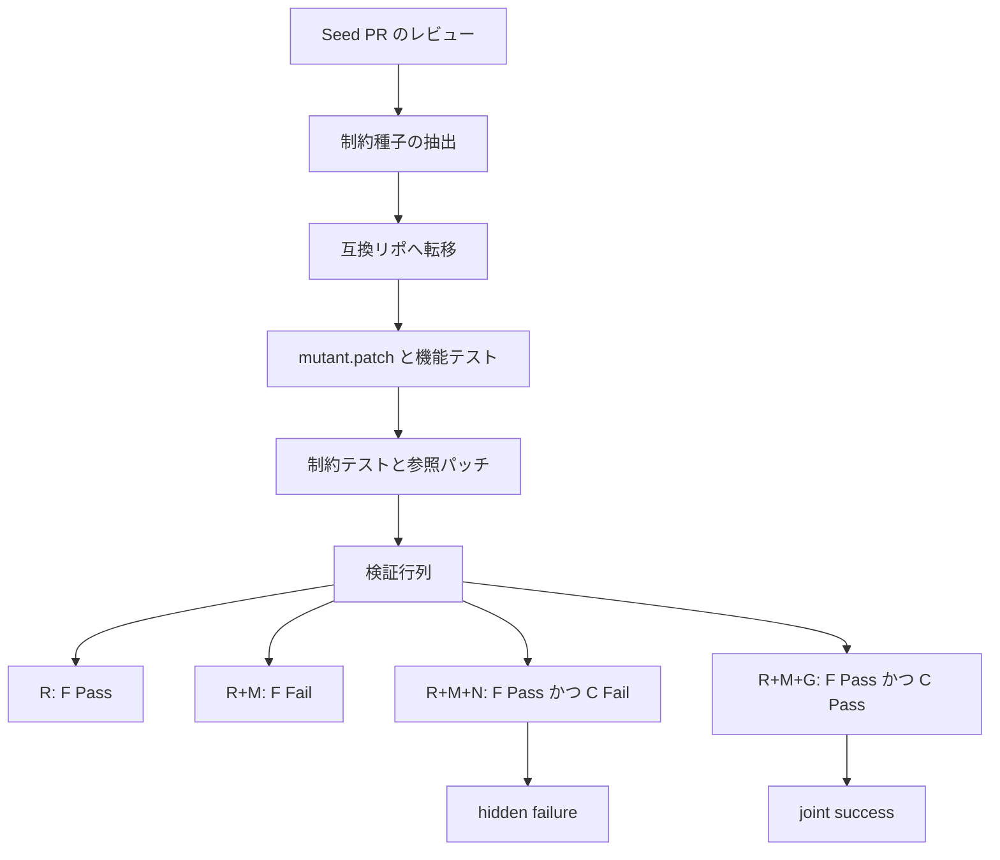

機能テストが通れば、そのパッチはリポジトリに入れてよい、と思いがちです。
SWE-Gate は、その確信を実験で崩します。

Xin He らによる [SWE-Gate: Passing Functional Tests Is Not Enough for Software Engineering Agents](https://arxiv.org/abs/2609.04167) は、実 PR のレビューコメントから **レビュー由来の受入制約** を取り出し、機能テストとは別の実行可能テストにします。
303 件の修理課題を 75 の公開 Python リポジトリへ合成し、4 つの LLM を共通の Mini-SWE-Agent で走らせました。
機能テストを通った修理 644 件のうち、221 件（34.3%）が制約テストで落ちます。
この 644 は課題数ではなく、4 モデルの機能成功を足した数です。

本稿は、数値の読み方、二層オラクルの仕組み、制約文を渡したときの副作用、現場へ移す条件までを、論文と複製パッケージに沿って整理します。
評価の完了条件を機能テストだけにすると過大評価になる、という主張は一次数値と整合します。
現場の品質ゲートへそのまま移植するには、条件が要ります。

:::message alert
本記事は 2026-09-03 投稿の arXiv preprint（[arXiv:2609.04167v1](https://arxiv.org/abs/2609.04167)、cs.SE）を解説したものです。会議採録の一次証拠は確認していません。数値は論文 Table 2〜4 と、複製パッケージ [DeepSoftwareAnalytics/SWE-Gate](https://github.com/DeepSoftwareAnalytics/SWE-Gate)（2026-09-05 確認）に依拠します。
:::

*この記事の全体像。以下、順に解説します。*

## 機能テスト通過はマージ許可ではない

コーディングエージェントの評価は、issue を直して機能テストが通るか、で語られがちです。
[SWE-bench](https://openreview.net/forum?id=VTF8yNQM66) 系は、FAIL_TO_PASS と PASS_TO_PASS で機能修理を測ります。
そこには、レビュアが差し戻す種類の制約がありません。

公開インタフェースを壊さない、例外の意味を変えない、スキーマと型を維持する、リソースを片付ける。
人間レビューでは日常的に落ちる論点です。
機能テストは、対象の振る舞いが直ったことしか見ません。

動機の実例は [pydantic/pydantic#12657](https://github.com/pydantic/pydantic/pull/12657) です。
extra フィールドの条件付きシリアライズを足す PR で、初期実装は `ExtrasSchema` を新設しました。
レビュアが公開インタフェース破壊を指摘し、著者は `extras_ser_exclude_if` へ切り替えました。
機能（対象 extra が出力から落ちるか）と互換（既存 schema が使えるか）は、別テストに分けられます。
論文が「採用した」と書いたのは設計変更の採用であり、2026-09-05 時点のマージ完了ではありません。
PR の状態は OPEN です。

## SWE-Gateが分けて測るもの

SWE-Gate の 1 課題は、次の関係が同時に成り立つときだけ残ります。

**検証行列**（論文 Table 1）は、次の 4 状態です。

| 状態 | 記法 | 機能テスト F | 制約テスト C |
|---|---|---|---|
| 元リポジトリ | R | Pass | 対象外 |
| 注入バグ | R+M | Fail | 対象外 |
| 非準拠の修理 | R+M+N | Pass | Fail |
| gold 修理 | R+M+G | Pass | Pass |

非準拠パッチが存在するので、制約は機能要求の言い換えではありません。
gold が存在するので、制約は満たし不能でもありません。
エージェントの出力は、この行列の「修理」側に載ります。
F だけ Pass なら hidden failure です。
F と C がともに Pass なら joint success です。

設計の要点は次です。

- **二層の実行オラクル**: 機能テスト（F）と制約テスト（C）を別ファイルで実行する。評価の合否に LLM 判定器は使わない。種子抽出と意味スクリーニングには LLM を使う
- **制約ファーストの合成**: 元の issue-PR をそのまま使わない。レビュー意図を種子にし、別リポへ転移する（[SWE-Mirror](https://arxiv.org/abs/2509.08724) の転移を制約側へ転用）
- **実行不能なレビューは捨てる**: workflow、ドキュメントのみ、テストのみ、フォーマット、命名、typo、曖昧な要求はフィルタする
- **入力 ablation**: 制約文を渡す条件（+C）と、issue だけ渡す条件（−C）。隠れテストは同じ
- **主指標は JSR**: 機能と制約の両方を通した割合。機能成功率（FSR）と、機能成功のうち制約も通した割合（CFR）を併記する

定義は次です。分母 303 は課題数です。

- FSR = N_F / 303
- CFR = N_{F∩C} / N_F
- JSR = N_{F∩C} / 303
- HFR = 1 − CFR

対象は全 303 件です。
scaffold は Mini-SWE-Agent、最大 100 step、1 課題あたり 1 生成です。
生成パッチがベンチマークのテストファイルを書き換えても、評価前に破棄します。

## 644と221の読み方

Constraint-Provided（+C）の結果は、論文 Table 2 と Table 3 です。

| モデル | 機能成功 | 両方成功 | FSR | CFR | JSR | hidden | HFR |
|---|---:|---:|---:|---:|---:|---:|---:|
| GPT-5.5 | 227 | 160 | 74.9% | 70.5% | 52.8% | 67 | 29.5% |
| GPT-5.4-mini | 187 | 120 | 61.7% | 64.2% | 39.6% | 67 | 35.8% |
| DeepSeek-V4-Flash | 202 | 130 | 66.7% | 64.4% | 42.9% | 72 | 35.6% |
| GPT-4o-mini | 28 | 13 | 9.2% | 46.4% | 4.3% | 15 | 53.6% |
| 合計 | 644 | 423 | n/a | n/a | n/a | 221 | 34.3% |

検算は一次と一致します。
227+187+202+28=644。
67+67+72+15=221。
644−221=423。
221/644=34.3%。
GPT-5.5 の 227/303=74.9%、160/227=70.5%、160/303=52.8%。

読み方の注意があります。
34.3% は「303 課題のうち 221 が偽完了」ではありません。
弱いモデル（GPT-4o-mini の FSR 9.2%）を混ぜたプール値です。
最強モデル単体の HFR は 29.5% です。
4 モデルすべてで CFR は 100% 未満です。
機能テストだけを完了条件にすると、その部分集合では過大評価になります。

制約は多ラベルです。
最多は Error Semantics 152 件（50.2%）と Schema / Metadata / Typing 143 件（47.2%）です。
機能成功後の CFR が低いカテゴリとして、論文 RQ3 は次を挙げます。

- Scope Generalization（強い 3 モデルで 63.0%、46.3%、53.5%）
- Lifecycle Cleanup / Resource（62.5%、53.8%、57.1%）
- Encoding / Escaping / Quoting（GPT-5.4-mini 51.1%、DeepSeek-V4-Flash 55.9%）
- Schema / Metadata / Typing（強いモデルで 60.7% から 68.3%）

Missing vs empty / sentinel と Ordering / argument preservation は相対的に高いです。
Lifecycle は N=19 と小さいです。
カテゴリ比較は記述的です。

## 制約を見せると何が起きるか

制約文を渡す効果は、論文 Table 4 です。
+C から −C を引いた差分です。

| モデル | Δ FSR | Δ CFR | Δ JSR |
|---|---:|---:|---:|
| GPT-5.5 | −0.7 | +15.9 | +11.5 |
| GPT-5.4-mini | −9.9 | +13.5 | +3.3 |
| DeepSeek-V4-Flash | −3.3 | +10.2 | +4.9 |
| GPT-4o-mini | −6.6 | +25.6 | +1.0 |

JSR は全モデルで上がります。
joint 成功は 360 件から 423 件です。
FSR は全モデルで下がるか、ほぼ横ばいです。
制約を issue に足すと、単純な機能パッチから逸れる、というのが著者の候補説明です。
1 生成のため、著者は因果主張を控えています。

実務への含意は短いです。
制約をエージェントへ渡す実験は、JSR だけでなく FSR の低下を同時に見ます。
二層契約は joint を上げても、機能修正を減らすことがあります。

## 先行研究との位置

SWE-Gate が測る「機能は直ったが受入できない」は、次の問題と交差します。
同じ問題ではありません。

| 系統 | 何を直すか | 判定 | SWE-Gate との差 |
|---|---|---|---|
| SWE-bench / Verified | issue の機能修理 | FAIL_TO_PASS と PASS_TO_PASS | 制約次元が無い |
| [UTBoost](https://doi.org/10.18653/v1/2025.acl-long.189)（ACL 2025） | 弱い機能テストによる偽の green | 追加ユニットテスト | 機能オラクルを厚くする。レビュー制約ではない |
| [SWE-Mirror](https://arxiv.org/abs/2509.08724) | issue 意味のクロスリポ複製 | 機能テスト | 転移の先行。オラクルは 1 系統 |
| [SWE-Shield](https://arxiv.org/abs/2604.05955)（2026-04） | 設計制約の遵守 | LLM judge | 同じ「pass rate 不足」。判定が非実行。著者は設計制約を non-executable と定義する |
| SWE-CARE / SWE-Review / SWE-PRBench | レビューコメントや合否判定の品質 | コメント一致、改訂後 resolve、LLM judge | 修理パッチの制約テストではない |

SWE-Gate の「first」は、related work 上 **実行可能な制約テストを repository-level 修理に載せた** ことに限定されます。
「テスト通過は正しさを保証しない」自体は、Qi ら ISSTA 2015、Smith ら ESEC/FSE 2015、UTBoost 2025 が先行します。

コードレビュー研究は、受入条件の中心が欠陥検出だけではないことを示します。
[Bacchelli and Bird（ICSE 2013）](https://doi.org/10.1109/ICSE.2013.6606617) では、コメント分類で code improvement が defects を上回ります。
[Sadowski ら（ICSE-SEIP 2018）](https://doi.org/10.1145/3183519.3183525) は Google の期待を教育、規範維持、ゲートキーピング、事故防止に分けます。
Finding defects はゼロではありません。
それでも、命名、コメント、代替設計、知識移転は実行テストに落ちません。
SWE-Gate はそこを種子から外しています。

## 数字が支持することと、支持しきれないこと

論文が示すのは次までです。
実行可能な二層オラクルを置けば、機能合格とレビュー制約合格は分離できます。
機能テストだけを完了条件にすると、その部分集合では過大評価になります。
現場でどの制約を機械ゲートにするかは、論文の結論ではありません。

支持する材料は明確です。

- Table 1 の非準拠 / gold が、分離可能性と同時充足を実行で示す
- Table 3 の 221/644。4 モデルすべてで CFR < 100%
- pydantic#12657 が、機能追加と公開 API 互換の衝突を実 PR で示す
- 制約文を渡すと CFR と JSR が上がる（Table 4）。エージェントは制約を「見えても」守り切れないが、見えないよりは守る

反証と限界も同じだけ具体です。

- **過厳テスト**: OpenAI は 2026-07-08、SWE-Bench Pro 公開 split 731 件のうち、パイプラインが 200 件（27.4%）、人間注釈が 249 件（34.1%）を broken と判定し、全体の約 30% が壊れていると見積もりました。一次は 4 カテゴリを列挙します。overly strict tests、underspecified prompts、low-coverage tests、misleading prompt。制約テストを増やす運用は、とくに overly strict tests を再現し得ます。一次は [Separating signal from noise in coding evaluations](https://openai.com/index/separating-signal-from-noise-coding-evaluations/) です
- **対象の狭さ**: 34.3% はフィルタ後の実行可能部分集合です。SWE-Shield は設計制約を非実行と定義します。SWE-Gate 自身も「実行可能でないレビュー要求」を future work に残します
- **合成**: 実 PR の 1 対 1 再利用ではありません。汚染の完全除去は主張しません。構築とスクリーニングに LLM が入ります
- **外的妥当性**: Mini-SWE-Agent、100 step、1 生成、Python のみです。本番の Claude Code / Codex とは scaffold が違います
- **複製の穴**: 303 件と予測 JSONL は GitHub にあります。standalone `validation_matrix.json` は 255 件に限り、48 件は欠落します（[validation_coverage.md](https://github.com/DeepSoftwareAnalytics/SWE-Gate/blob/main/docs/validation_coverage.md)）。構築 stages 4-5 は認証済み `codex` CLI が必須です。Hugging Face 公開は [Issue #1](https://github.com/DeepSoftwareAnalytics/SWE-Gate/issues/1) が OPEN（2026-09-04、NielsRogge）です。star は約 0（2026-09-05 時点）です

「分離できる」は論文内実験で頑健です。
「現場の完了条件をすべて制約テストへ変換せよ」は支持しきれません。
過厳テストと非実行可能レビューが、変換の上限を決めます。

未解決の問いは、二層契約を試す判断を止めません。
全レビューの機械化判断は止めます。

- supplementary の段階別棄却件数は、11 ページ本編に無い
- Mini-SWE-Agent 以外の scaffold での HFR は未測定
- 48 件の validation_matrix 欠落が、公開予測の再集計に効くかは未確認
- 社内規約を制約テストにしたときの過厳率は、SWE-Gate では測っていない

## 現場へ移すときの条件

論文の future work は Python 外と、実行不能なレビュー要求です。
移植はリスト差し替えだけでは済みません。

必要な条件は次です。

1. **種子**: マージ済み PR のインラインコメント、hunk、リンク issue が API で取れること
2. **分離**: 「機能は通るが制約は落ちる」非準拠パッチが、そのコードベースで自然に書けること。書けない制約はテスト化しない
3. **オラクル**: 制約テストが、特定 API 名や隠しヘルパーを強制しないこと。SWE-Gate の QA は実装指定を落とす
4. **実行**: 決定的なテストランナーとコンテナ。SWE-Gate は 99 の base Docker に載せる
5. **言語**: pytest 前提を捨てるなら、コンパイル、型、非同期の失敗を機能失敗と制約失敗から切り分ける。[Multi-SWE-bench](https://arxiv.org/abs/2504.02605) では、Python 以外の resolved rate が大きく下がる
6. **社内**: 非公開テスト、ポリグロット CI、変更範囲のレビュー規範は、実行オラクルにならないことが多い。そこは人間ゲートのまま残す

社内へ先に移す候補は、論文で件数が多い Error Semantics と Schema / Typing、および Compatibility です。
変更範囲や「この抽象を使うな」は、テストに落とすと過厳になりやすいです。

**推奨**は、完了条件を機能テストの 1 層にしないことです。
ただし全レビューをテスト化しません。
契約できるもの（公開 API 互換、例外型とメッセージ方針、スキーマと型、リソース寿命）だけを独立ゲートにします。
残る設計議論と可読性は人間レビューに残します。

逆転条件は次です。

- 制約テストが、プロンプトに無い実装を強制している（OpenAI の過厳テスト型）
- 制約テストを足したあと、機能修正のスループットが許容を超えて落ちる（Table 4 の FSR 低下）
- 対象言語に決定的テストランナーが無い

直近のアクションは小さく始めます。

1. 自リポの「よく差し戻すレビュー」を 10 件拾い、実行可能かどうかを SWE-Gate の除外規則で分ける
2. 実行可能なものだけ、機能テストと制約テストを別ジョブにし、F Pass かつ C Fail を hidden failure として数える
3. 制約文をエージェントへ渡す実験は、JSR だけでなく FSR の低下を同時に見る
4. 論文の数字を KPI にコピーしない。644/221 は 4 モデルプールである

## まとめ

SWE-Gate は、機能テストとレビュー由来の受入制約を、実行可能な二層オラクルとして分離します。
機能成功 644 件のうち 221 件（34.3%）が制約テストで落ちます。
この 34.3% は 4 モデルのプール値であり、最強モデル単体でも HFR は 29.5% です。
制約文を渡すと JSR は上がり、FSR は下がるか横ばいです。
分離できることは論文内で頑健です。
全レビューの機械化は支持しきれません。
契約できる制約だけを独立ゲートにし、設計議論は人間レビューに残すのが、現場への移し方です。

この記事が少しでも参考になった、あるいは改善点などがあれば、ぜひリアクションやコメント、SNSでのシェアをいただけると励みになります！

## 参考リンク

- Xin He, Yanlin Wang, Mingwei Liu, Jiachi Chen, Hongyu Zhang, Guanbin Li. *SWE-Gate: Passing Functional Tests Is Not Enough for Software Engineering Agents*. arXiv:2609.04167v1, 2026-09-03. https://arxiv.org/abs/2609.04167 / [PDF](https://arxiv.org/pdf/2609.04167)
- 複製パッケージ: [DeepSoftwareAnalytics/SWE-Gate](https://github.com/DeepSoftwareAnalytics/SWE-Gate)（確認 2026-09-05）
- 検証行列の欠落記録: [validation_coverage.md](https://github.com/DeepSoftwareAnalytics/SWE-Gate/blob/main/docs/validation_coverage.md)
- Hugging Face 公開の issue: [Issue #1](https://github.com/DeepSoftwareAnalytics/SWE-Gate/issues/1)
- [pydantic/pydantic#12657](https://github.com/pydantic/pydantic/pull/12657)（OPEN、2026-09-05）
- Carlos E. Jimenez et al. SWE-bench. ICLR 2024. https://openreview.net/forum?id=VTF8yNQM66
- Boxi Yu et al. UTBoost. ACL 2025. https://doi.org/10.18653/v1/2025.acl-long.189
- Junhao Wang et al. SWE-Mirror. https://arxiv.org/abs/2509.08724
- Kai Yu et al. SWE-Shield. https://arxiv.org/abs/2604.05955
- Daoguang Zan et al. Multi-SWE-bench. https://arxiv.org/abs/2504.02605
- Alberto Bacchelli, Christian Bird. ICSE 2013. https://doi.org/10.1109/ICSE.2013.6606617
- Caitlin Sadowski et al. ICSE-SEIP 2018. https://doi.org/10.1145/3183519.3183525
- OpenAI. *Separating signal from noise in coding evaluations*. 2026-07-08. https://openai.com/index/separating-signal-from-noise-coding-evaluations/
