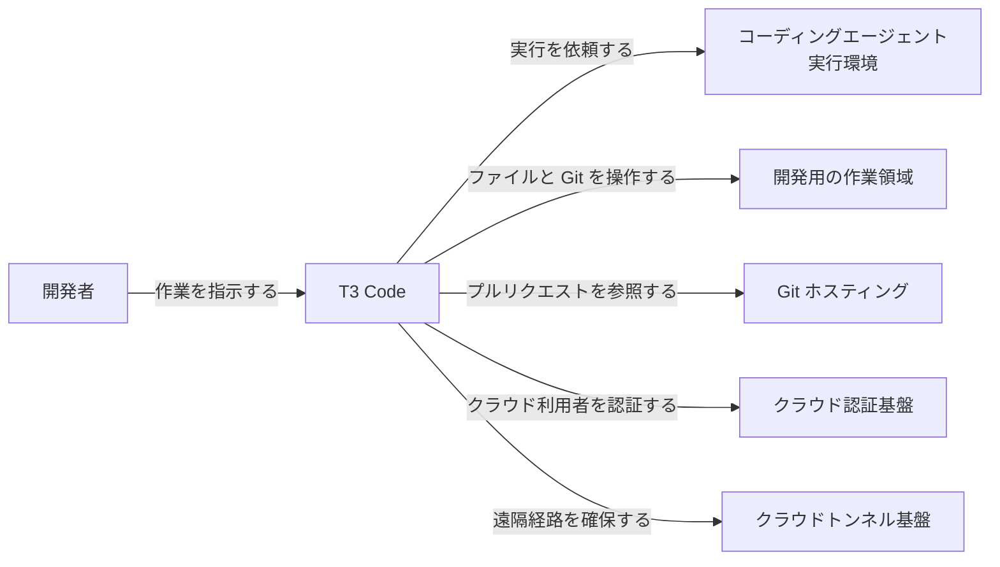
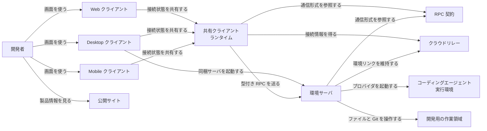
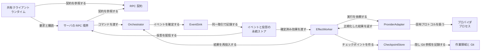
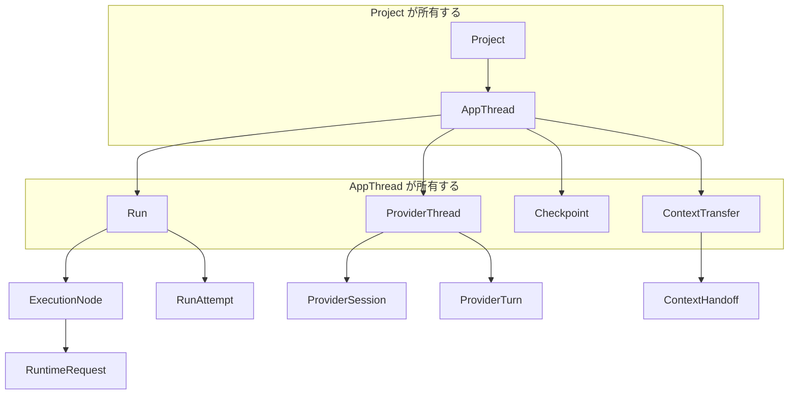
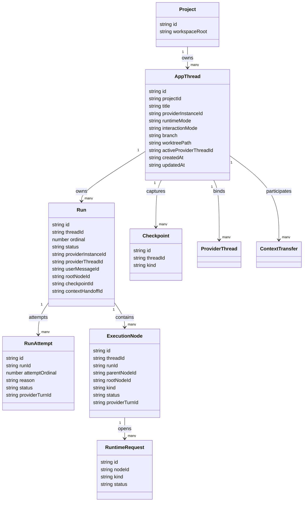
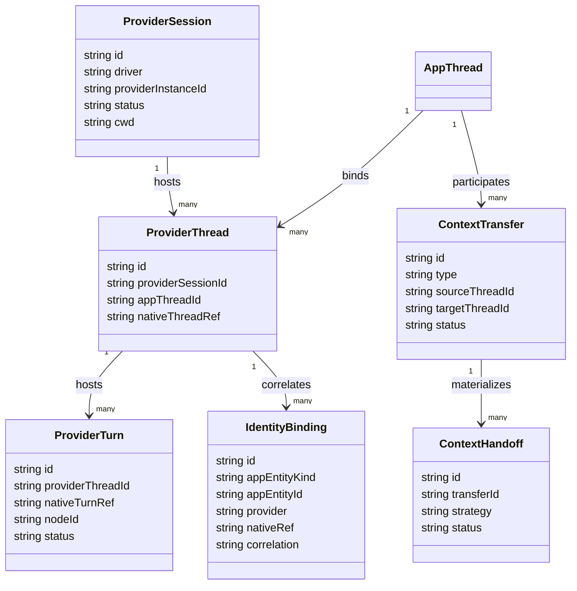

T3 Code は、自分のマシンで動く Claude Code や Codex などのコーディングエージェントを、Web・デスクトップ・スマートフォンから 1 つの画面で操作するオープンソースのアプリです。この記事では、[t3.codes](https://t3.codes/) と GitHub の [pingdotgg/t3code](https://github.com/pingdotgg/t3code)（2026-10-03 時点の `main`）をもとに、T3 Code の構造、データモデル、導入、利用、運用を順に説明します。

読み終えると、次のことがわかります。

- 「作業領域を持つサーバ」と「指示だけを出すクライアント」がどう分かれているか
- 会話・実行・プロバイダのセッションを、どんなデータで管理しているか
- インストール、プロバイダの認証、遠隔接続、常駐化、更新の手順


*この記事の全体像。以下、順に解説します。*

## T3 Codeとは

T3 Code は、コーディングエージェントのための制御画面です。README は自身を "agent harness control surface" と呼んでいます。開発者向けの AGENTS.md は、Claude Desktop、Codex App、Cursor Glass、Conductor の代わりになる "bring-your-own-subscription"、つまり利用者が自分の契約を持ち込む製品と位置づけています。

T3 Code の基本方針は、作業領域をサーバ側に置くことです。

- プロバイダのプロセス、ターミナル、Git、プロジェクトのファイルは、作業領域を持つサーバのマシンに残ります。
- リモートのクライアントは指示と表示だけを担います。
- クライアントは自分のファイルシステムや認証情報をサーバの代わりに使いません。

リポジトリは TypeScript のモノレポ `@t3tools/monorepo` で、ライセンスは MIT です。

| 項目 | 値 |
| --- | --- |
| `engines.node` | `^24.13.1` |
| `packageManager` | `pnpm@11.10.0` |
| 開発時の起動 | Vite+ の `vp`（pnpm を直接使わない） |
| GitHub stars / forks（2026-10-03 に GitHub API の `repos/pingdotgg/t3code` で取得） | 24,276 / 6,346 |
| リポジトリ作成日 | 2026-02-08 |
| homepage | `https://t3.codes` |

T3 Code を理解するには、次の用語を押さえておくと便利です。

| 用語 | 意味 |
| --- | --- |
| Environment | 稼働中のサーバ 1 つと、そのマシンが持つ資格情報・作業領域・状態のまとまり |
| Client | Web、Desktop、Mobile の UI。Desktop はサーバを同梱できる |
| Project | 環境ローカルなディレクトリを起点にした作業記録 |
| Thread | プロジェクト上の会話と作業履歴。プロバイダのプロセスが終了しても残る |
| Turn / Run | 利用者からエージェントへの 1 回の作業周期。オーケストレーション v2 では利用者に見える回数の単位を `Run` と呼ぶ |

公式サイトは、スレッドごとにブランチを切り、差分を確認してから commit、push、プルリクエスト作成までを 1 画面で行える、と案内しています。独立したドキュメントサイトは無く、利用者向けの資料はリポジトリの `docs/user/` にあります。

## 特徴

- **複数プロバイダ**: Claude Code、Codex、Cursor、Grok Build、OpenCode、Antigravity を、既存の契約と認証のまま 1 つの画面から操作できます。インストール文書は Pi にも対応しています。
- **トークンの再販なし**: 認証とバイナリは、環境のマシンに置きます。
- **3 種類のクライアント**: Web（`app.t3.codes` とローカル配信）、Electron デスクトップ、モバイルがあります。
- **遠隔接続の手段**: LAN のペアリング、Tailscale HTTPS、SSH、T3 Connect（リレー）を使い分けます。
- **イベントログが正本**: オーケストレーションの状態はイベントログで決まります。コマンドの受領は「意図が確定した」という意味で、プロバイダの作業完了とは別です。
- **ブランチを汚さないチェックポイント**: 利用者のブランチにコミットを足さず、隠し Git ref に作業領域を記録します。
- **権限モード**: スレッドごとに Supervised、Auto-accept edits、Auto、Full access を選べます。新規スレッドの初期既定は Full access です。
- **ソース管理連携**: GitHub、GitLab、Forgejo、Gitea、Bitbucket、Azure DevOps に対応し、クローン、公開、プルリクエスト、レビューを扱います。
- **テレメトリ**: 製品の利用イベントを PostHog へ送ります。プロンプト本文や会話 ID は含みません。`T3CODE_TELEMETRY_ENABLED=false` で停止できます。
- **フォーク可能**: MIT ライセンスなので、フォークして UI やプロバイダを変えられます。README は、まだ初期段階のため大きな機能の貢献は原則として受け付けていない、と書いています。

### 類似製品との位置づけ

README と AGENTS.md が名指しする類似製品との関係です。一次資料に性能の実測値は無いため、ここでは位置づけだけを比べます。

| 製品 | 開発元の資料での位置づけ | T3 Code が前面に出す軸 |
| --- | --- | --- |
| T3 Code | 既存の契約を持ち込むオープンソースの制御画面 | 複数プロバイダ、遠隔操作、Web / Desktop / Mobile |
| Claude Desktop | 類似のデスクトップ体験 | 単一ベンダに閉じず、契約は利用者側 |
| Codex App | 類似のデスクトップ体験 | 複数ハーネスとオープンソース |
| Cursor Glass | 類似のエージェント画面 | フォーク可能であることと遠隔操作 |
| Conductor | 類似のオーケストレーション体験 | 3 種類のクライアントと MIT |

### Orca との違い

既存の CLI 契約を持ち込んで 1 つの画面にまとめる MIT ライセンスの製品には、[Orca](https://www.onorca.dev/) もあります。Orca の構造は「[複数のCLIエージェントをworktreeで並列に走らせるADE Orcaの構造と使い方](https://zenn.dev/suwash/articles/orca_20261003)」で解説しています。両者は目的が近い一方、中心に置くものが違います。

- T3 Code は、エージェントとの**会話（スレッド）**を中心に置く制御画面です。
- Orca は、タスクごとの **worktree と端末**を中心に置く ADE（Agent Development Environment）です。

| 観点 | T3 Code | Orca |
| --- | --- | --- |
| 中心の単位 | 環境サーバが持つ Project と Thread。ブランチや worktree はスレッドに付く | タスクごとの git worktree。端末とブラウザタブがそこに付く |
| エージェントとの接続 | プロバイダごとのアダプタがプロトコル（Codex の app server、ACP など）を扱い、イベントを正規化して記録する | 各 CLI をそのまま端末プロセスとして起動し、TUI を描画する。状態は OSC タイトルとフックから取る |
| 対応エージェント | 7 種（Codex、Claude、Cursor、Grok Build、OpenCode、Antigravity、Pi） | 公式の対応表に 37 行。表に無い CLI も端末で起動できる |
| 操作面 | Web（`app.t3.codes` とローカル配信）、Electron デスクトップ、iOS / Android | デスクトップ（macOS / Windows / Linux）、CLI `orca`、モバイルコンパニオン（iOS / Android） |
| ランタイムの所有者 | 常に環境サーバ。クライアントは指示と表示だけを担う | 実行モードで変わる。Local と SSH worktree はラップトップの Orca、Remote Orca Server はサーバ、Cloud VM レシピは利用者が契約するプロバイダ |
| 遠隔接続 | LAN ペアリング、Tailscale HTTPS、SSH、T3 Connect（リレー） | SSH worktree、Tailscale 上の Remote Orca Server、Cloud VM レシピ |
| 権限の既定 | 新規スレッドは Full access | 各 CLI の権限バイパスフラグ（`--dangerously-skip-permissions` など）を埋めて起動する |
| 差分レビュー | スレッドの Git 操作で commit、push、プルリクエスト作成まで行う | 差分行への Markdown コメントをエージェントへ戻す。worktree ごとのブラウザに Design Mode がある |

どちらも、初期設定ではエージェントに承認なしで操作させます。チームで使うときは、どちらの製品でも権限の既定を見直します。

使い分けの目安は次のとおりです。

| 向いている作業 | 選ぶ製品 |
| --- | --- |
| 1 台のホストにある作業領域を、スマートフォンやブラウザから会話で動かし続けたい | T3 Code |
| 同じ課題を複数のエージェントに worktree ごとに並列で試させ、差分を比べたい | Orca |
| ルータのポート転送を置かずに外出先から接続したい | T3 Code（T3 Connect） |
| タスクごとに使い捨ての VM を立てたい | Orca（Cloud VM レシピ） |

### ユースケース

| 利用場面 | 使い方 | 根拠となる資料 |
| --- | --- | --- |
| 複数のハーネスを 1 画面で切り替える | ホストで各 CLI を認証し、Settings の Providers でインスタンスを足す | install.md のプロバイダ表 |
| 外出先から自分の作業ツリーを操作する | ホストを起動したまま、モバイルか `app.t3.codes` から T3 Connect かペアリングで接続する | remote-access.md |
| 画面やアダプタを自分用に変える | `pingdotgg/t3code` をフォークし、`vp` で開発する | README と development.md |
| 単発で試す | `npx t3@latest` | install.md |

## 構造

作業領域を所有するのは環境サーバです。クライアントは認証済みの RPC でサーバに指示します。Desktop のレンダラも同じ境界に従います。

### システムコンテキスト図



| 要素 | 説明 |
| --- | --- |
| 開発者 | Web、Desktop、Mobile から作業を指示する利用者 |
| T3 Code | クライアント、環境サーバ、接続支援を含むシステム全体 |
| コーディングエージェント実行環境 | サーバが起動するプロバイダの CLI やエージェント |
| 開発用の作業領域 | 環境が所有するプロジェクトのファイルと Git |
| Git ホスティング | プルリクエストを扱う連携先 |
| クラウド認証基盤 | T3 Connect の利用者認証。ソースビルドに含まれる公開識別子は Clerk のもの |
| クラウドトンネル基盤 | ルータのポート転送なしで環境に届けるリレー。開発用の設定例は `T3CODE_RELAY_URL=https://relay.t3.codes` |

### コンテナ図



| 要素 | 説明 |
| --- | --- |
| Web クライアント | ホスト型の公開アプリと、ローカルサーバが配信する画面 |
| Desktop クライアント | Electron のシェル。サーバを同梱し、リモート接続のホストにもなる |
| Mobile クライアント | 別マシンのサーバへ接続する React Native アプリ |
| 公開サイト | 製品紹介の静的サイト。エージェントの実行先ではない |
| 共有クライアントランタイム | 再接続と複数環境の状態を Web と Mobile で共有する |
| RPC 契約 | 別々に更新されるクライアントとサーバの境界。ソケットの認証は、全メソッドの認可を意味しない |
| 環境サーバ | オーケストレーション、プロバイダ、SQLite、添付ファイルを所有する |
| クラウドリレー | 環境リンクと、到達のための資格情報を扱う |
| コーディングエージェント実行環境 | サーバマシン上のプロバイダプロセス |
| 開発用の作業領域 | プロジェクトのディレクトリと Git |

SSH と Tailscale は、環境サーバに到達するための手段です。ACP や Codex の app server を包む Effect ラッパは、プロバイダプロトコルとの境界に置かれます。

### コンポーネント図

環境サーバの内部では、オーケストレーション v2 の部品が次のようにつながります。



| 要素 | 説明 |
| --- | --- |
| 共有クライアントランタイム | `packages/client-runtime`。環境ごとの接続と購読を持つ |
| RPC 契約 | `packages/contracts`。公開の WebSocket メソッドには `orchestration.dispatchCommand` や `orchestration.subscribeThread` がある |
| サーバの RPC 境界 | スレッド単位で購読させ、見ていないスレッドの履歴を毎回送らない |
| Orchestrator | `apps/server/src/orchestration-v2/Orchestrator.ts`。コマンドを直列化し、プロバイダ I/O をせずにイベントを決める |
| EventSink | イベント、投影、コマンドの受領、outbox の効果を 1 つのデータベース取引で確定する。購読者は確定後に受け取る |
| 永続ストア | SQLite。WAL、`busy_timeout` 5000、外部キーを有効にし、起動時にマイグレーションする |
| EffectWorker | 記録済みの意図に対する副作用を実行し、結果をオーケストレーションへ戻す |
| ProviderAdapter | 現行の型名は `ProviderAdapterV2Shape`。能力の取得とセッション開始が中心で、ターン送信・中断・承認・ロールバック・イベントはセッションランタイム側が持つ |
| プロバイダプロセス | ドライバ種別ごとの CLI やマネージドランタイム |
| CheckpointStore | 隠し Git ref で作業領域を記録する。会話を巻き戻せないプロバイダでは、ファイルを変える前に復元を拒否する |
| 作業領域と Git | プロジェクトのチェックアウトと worktree |

この構造には、時間の扱いに関する重要な性質があります。

- コマンドの受領は、プロバイダの作業、チェックポイント作成、差分計算の完了を含みません。
- プロバイダのターン終了と、その後の確定は別のマイルストーンです。
- 差分の計算が遅れても、記録済みのプロバイダ所要時間は延びません。

## データ

オーケストレーション v2 は、利用者に見える会話と、プロバイダ固有の会話ハンドルを分けて管理します。

- 同一性を決めるのはアプリ側の ID です。プロバイダ側の ID は、対応づけのための証拠として扱います。
- 確定したイベントには、ストアが単調増加の `sequence` を振ります。
- クライアントはスナップショットの `snapshotSequence` をカーソルにし、それより大きい sequence のイベントだけを適用します。
- プロバイダから届く生のフレームは、アプリ状態の正本ではありません。

### 概念モデル



| 要素 | 説明 |
| --- | --- |
| Project | 環境ローカルな作業領域の記録。ベースディレクトリを持つ |
| AppThread | 利用者に見える会話。プロバイダのネイティブスレッドと常に 1 対 1 である必要はない |
| Run | 数えられる利用者向けのターン。プロバイダの turn id をアプリのライフサイクル境界にしない |
| RunAttempt | 1 回の Run に対するプロバイダ実行の試行。ステアリングや回復で複数になる |
| ExecutionNode | Run の中の実行単位。木構造になる |
| ProviderSession | 生きている、または再開できるプロバイダプロセス |
| ProviderThread | プロバイダネイティブの会話を指す、アプリ側のハンドル |
| ProviderTurn | ネイティブのターンを指す、アプリ側のハンドル |
| Checkpoint | 差分表示と復元のための作業領域スナップショット |
| ContextTransfer | フォーク、プロバイダ切替、マージバック、サブエージェントのための中立な関係 |
| ContextHandoff | ネイティブの転送が使えないときに使う可搬なコンテキスト |
| RuntimeRequest | 承認や質問など、プロバイダからのコールバック |

AppThread と ProviderThread を分けているため、同じ会話の途中でプロバイダを切り替えたり、別プロバイダへフォークしたりできます。

### 情報モデル

次の図は、設計文書の型スケッチを `packages/contracts/src/orchestrationV2.ts` の現行フィールド名に寄せた抜粋です。図の読み方の補足は次のとおりです。

- IdentityBinding は `entity-ids-and-correlation.md` に書かれた対応づけの概念で、現行の OrchestrationV2 の構造体にはありません。
- Checkpoint.kind は、現行の型では CheckpointScope.kind です。
- ContextHandoff の対応フィールドは strategy です。

会話と実行の側（Project から RuntimeRequest まで）です。



プロバイダとの対応づけ、コンテキスト転送の側です。



| 属性 | 説明 |
| --- | --- |
| AppThread.providerInstanceId | そのスレッドが使うプロバイダインスタンス。Run も自分の providerInstanceId を持つ |
| AppThread.runtimeMode | 権限ポリシー。interactionMode は計画などの作業の進め方で、権限とは別 |
| AppThread.lineage | 閲覧用の軽い親子関係。運用上の転送点は ContextTransfer に置く |
| Run.status | preparing、queued、starting、running、waiting、completed、interrupted、failed、cancelled、rolled_back |
| 利用者に見えるターン数 | 型上のフラグは ExecutionNode.countsForRun と CheckpointScope.advancesAppRunCount |
| RunAttempt.reason | initial、steering_restart、retry、provider_recovery |
| IdentityBinding.correlation | 設計文書上の値は native_exact、native_scoped、ordinal、fingerprint、synthetic |
| ExecutionNode.status | idle、pending、running、waiting、completed、interrupted、failed、cancelled、rolled_back |
| sequence | イベント封筒のカーソル。ドメインのペイロードのフィールドではない |

### 永続ファイルの配置

永続ファイルの場所は `apps/server/src/config.ts` の `deriveServerPaths` が決めます。既定のベースディレクトリはホームの `.t3` です（`os-jank.ts`）。

| 対象 | 場所 |
| --- | --- |
| 状態ディレクトリ | 開発 URL が有効でベースを明示していないときは `dev`、それ以外は `userdata` |
| データベース | `{stateDir}/statev2.sqlite` |
| 添付ファイル | `{stateDir}/attachments` |
| サーバトレース | `{stateDir}/logs/server.trace.ndjson` |
| プロバイダイベント | `{stateDir}/logs/provider/events.log` |
| 設定 | `{stateDir}/settings.json` |
| worktree | ベース直下の `worktrees` |
| プロバイダ状態のキャッシュ | ベース直下の `caches` |

待受ポートはモードで変わります。デスクトップモードはポート未指定なら `DEFAULT_PORT` の 3773 をそのまま使います。web モードは 3773 から空いているポートを探します。設定用の環境変数は次のとおりです。

- ポート: `T3CODE_PORT`
- ホスト: `T3CODE_HOST`
- データディレクトリ: `T3CODE_HOME` または `--base-dir`

## 構築方法

### 前提

- スレッドを始める前に、プロバイダを 1 つ以上インストールして認証します。アプリを先に起動して、あとから Settings で足すこともできます。
- CLI の `t3` は `~/.local/bin` に入ります。シェルの PATH にこのディレクトリが含まれている必要があります。
- Intel Mac 向けの `t3` 実行ファイルはありません。デスクトップアプリを使うか、Node.js 24 と `vp` でソースからサーバをビルドします。
- ソースからビルドする場合の Node は `^24.13.1` です。Bun は任意です。

### CLI をインストールする

安定版は次のコマンドで入れます。

```bash
curl -fsSL https://t3.codes/install.sh | sh
```

Windows の PowerShell では次のコマンドです。

```powershell
irm https://t3.codes/install.ps1 | iex
```

ナイトリー版や版の固定は、インストーラを実行するシェルの環境変数で指定します。パイプの右側の `sh` が読めるように、先に export します。

```bash
export T3CODE_CHANNEL=nightly
curl -fsSL https://t3.codes/install.sh | sh
```

```bash
export T3CODE_VERSION=0.0.42
curl -fsSL https://t3.codes/install.sh | sh
```

インストールせずに 1 回だけ試すときは、Node.js 上で `npx t3@latest` を使います。

### デスクトップとモバイルを入れる

| プラットフォーム | コマンドまたは入手先 |
| --- | --- |
| Windows | `winget install T3Tools.T3Code` |
| macOS | `brew install --cask t3-code` |
| Debian / Ubuntu | `sudo apt install ./T3-Code-*.deb` |
| Arch（安定版） | `yay -S t3code-bin` |
| Arch（ナイトリー） | `yay -S t3code-nightly-bin` |
| iOS | App Store（id `6787819824`） |
| Android | Google Play（`com.t3tools.t3code`） |

- `.deb` 版の更新はパスワードプロンプトを使います。プロンプトが出ないデスクトップ環境では、新しい `.deb` を同じ手順で入れ直します。
- WSL をエージェントの実行先にするときは、Settings の Connections でディストロを選びます。プロバイダの CLI は、そのディストロの中に入れます。

### Intel Mac でサーバをビルドする

Intel Mac 向けの `t3` 実行ファイルはありませんが、デスクトップアプリはあります。サーバをソースから動かす公式手順は次のとおりです。

```bash
git clone https://github.com/pingdotgg/t3code
cd t3code && vp i && vp run build:desktop
node apps/server/dist/bin.mjs
```

この方法では `t3 update` とバックグラウンドサービスを使えません。更新は `git pull` と再ビルドで行います。

### ソースから開発起動する

まず `vp` を入れます。

```bash
curl -fsSL https://vite.plus | bash
```

Windows では `irm https://vite.plus/ps1 | iex` です。チェックアウト後に次を実行します。

```sh
vp i
vp run dev
```

- 開発ランナーが表示するペアリング URL を開きます。オリジンの URL だけでは、新しいブラウザは認証されません。
- デスクトップアプリの開発起動は `vp run dev:desktop` です。
- ポートは `[dev-runner]` の出力で確認します。

開発時の状態の置き場所は、起動方法で変わります。

| 起動方法 | SQLite の場所 |
| --- | --- |
| メインチェックアウトでベースを明示しない | `~/.t3/dev/statev2.sqlite` |
| ベースを `~/.t3/dev` と明示する | `~/.t3/dev/userdata/statev2.sqlite` |
| リンクした worktree（`T3CODE_HOME` があっても） | その worktree の `.t3/userdata/statev2.sqlite` |
| `--home-dir` を指定する | 指定したディレクトリが最優先 |

本番データの `~/.t3/userdata` を、開発サーバの対象にしないようにします。

## 利用方法

起動、認証、権限、遠隔接続、ソース管理は、どれもエージェントが動く環境のマシンを基準にします。クライアントは指示と表示を担い、資格情報の保存先にはなりません。

### 起動コマンド

| 目的 | コマンド |
| --- | --- |
| サーバを起動してブラウザを開く | `t3` |
| ブラウザを開かずに起動する | `t3 serve` |
| 指定したインタフェースで待ち受ける | `t3 serve --host <private-ip>` |
| Tailscale HTTPS 付きで起動する | `t3 serve --tailscale-serve` |
| 稼働中サーバのペアリングリンクを出す | `t3 pair` |
| Tailscale 経由でペアリングする | `t3 pair --tailscale` |
| T3 Connect を始める | `t3 connect` |
| 起動済み Desktop で現在のディレクトリのスレッドを開く | `t3 app` |
| ヘルプを見る | `t3 --help` |

- `t3 app` は、同じマシンでデスクトップアプリが動いている必要があります。スタンドアロンのサーバや SSH セッションだけでは動きません。パスを渡す例は `t3 app ../my-project` です。
- デスクトップモードの待受ホストの既定は `127.0.0.1` です。web モードはホスト未指定です。
- Tailscale Serve の HTTPS ポートの既定は 443 で、`--tailscale-serve-port` で変えられます。

### プロバイダを認証する

Settings → Providers → 対象の環境、の順に開いて、プロバイダを有効にします。スマートフォンから接続していても、インストールとログインは環境のマシンで行います。

- CLI はサーバの PATH 上に必要です。見つからないときは Binary path を指定します。
- Cursor の実行ファイル名は `cursor-agent` で、ログインコマンドは `agent login` です。
- ChatGPT 接続の Codex と Antigravity は、PATH を必要としないマネージドランタイムを使えます。

| プロバイダ | 認証方法 |
| --- | --- |
| Codex | ChatGPT 接続、または Codex CLI の `codex login` |
| Claude | Claude Code を入れて `claude auth login` |
| Cursor | Cursor CLI を入れて `agent login` |
| Grok Build | Grok Build CLI を入れて `grok login` |
| OpenCode | `opencode auth login` |
| Antigravity | プロバイダ設定からインストールし、Google でサインイン |
| Pi | `pi` を 1 回実行し、ログインまたは API キーの設定を完了 |

別のアカウントは、別のプロバイダインスタンスとして登録します。インスタンスごとに環境変数を持てます。秘密値を sensitive にすると、保存後は元の値を表示しません。

### スレッドと権限モード

コンポーザでモードを選ぶと、そのスレッドに適用されます。

- 新規スレッドの既定は Settings → General → New threads → Permissions で決めます。
- プロジェクトは環境の既定を上書きできます。
- 新規スレッドは、直前に見ていたスレッドのモードを引き継ぎません。
- 初期の既定は Full access です。

| モード | 振る舞い |
| --- | --- |
| Supervised | コマンドとファイル変更のたびに承認を求める |
| Auto-accept edits | ファイル編集は自動で承認し、それ以外の操作は承認を求める |
| Auto | プロバイダの自動レビューで定型の操作を承認し、それ以外を尋ねる |
| Full access | コマンドと編集を承認プロンプトなしで許可する |

モードの効き方はプロバイダで異なります。

| プロバイダ | 差分 |
| --- | --- |
| Codex、Claude、Cursor、Grok | Auto の自動レビューに対応 |
| OpenCode、Antigravity | Auto は「尋ねる」動作になる |
| Pi | Auto を表示しない。保存済みの Auto は Supervised として表示・動作する |
| Grok | Auto-accept edits が無く、そのモードのスレッドは Supervised として動く |
| Antigravity | Full access でもネイティブの承認要求を送ることがある |

権限モードは、エージェントが課題について質問することは止めません。

プロバイダごとの接続の違いは次のとおりです。

- OpenCode は 1.14.19 以降が必要です。Server URL が空なら T3 Code がローカルサーバを起動します。既存のサーバを使うときは Server URL とパスワードを設定します。
- Pi は利用者の `pi` を使います。同じインスタンス内の再開、ロールバック、フォークは Pi のネイティブセッションファイルで行います。
- ACP Registry のエージェントは自分のツールを持ちます。チェックポイントのロールバックでファイルは戻りますが、会話は巻き戻せず、次のターンは新しいセッションになります。
- Codex は作業中に質問できます。回答はスレッドの質問パネルから行います。

### リモートで接続する

#### T3 Connect

デスクトップでは Settings → Connections でサインインし、その環境で有効にします。CLI のホストでは次を実行します。

```bash
t3 connect
```

- サインインを保存しただけでは、外から到達できるようにはなりません。セットアップが勧めるバックグラウンドサービスを断ったときは、`t3 serve` でサーバを起動します。
- 別のデバイスからは、同じ T3 Connect アカウントで環境を選びます。
- SSH 越しでは、CLI がブラウザ用のリンクと短いコードを出します。コードが一致することを確認してから承認します。

T3 Connect の管理コマンドは次のとおりです。

```bash
t3 connect status
t3 connect login
t3 connect unlink
t3 connect logout
```

| コマンド | 動作 |
| --- | --- |
| `status` | 保存した認可とリンク設定を表示する。到達性の検査ではない |
| `unlink` | ログインを残したまま、外部への公開を止める |
| `logout` | ログイン情報も消す |

#### LAN、SSH、Tailscale

- **LAN**: デスクトップで Network access を有効にし、ペアリングリンクを作ります。変更するとデスクトップアプリが再起動します。ループバックの `127.0.0.1` は、リンクを開いたデバイス自身にしか届きません。
- **`app.t3.codes` から接続する場合**: 接続先に HTTPS の終点が必要です。ホスト型のペアリングリンクは、届かないバックエンドを到達可能にはしません。
- **SSH**: デスクトップの Settings → Connections → Add environment → SSH で追加します。リモートは Linux か Apple Silicon の Mac で、`curl` または `wget`、`tar`、`sha256sum` または `shasum` が必要です。初回はサーバ本体を `~/.t3/runtime` へダウンロードします。
- **Tailscale**: `t3 pair --tailscale` の設定は再起動後も残ります。既定ポートの公開を外すコマンドは `tailscale serve --https=443 off` です。

#### 操作専用のデスクトップにする

デスクトップを操作専用にするときは、Settings → Connections の Local environment をオフにします。

- ローカルサーバ、ローカルエージェント、WSL バックエンドが止まります。
- 他のデバイスからこのコンピュータへは接続できなくなります。
- プロジェクトと履歴は残ります。
- 同じ場所でオンに戻すと、以前のローカル設定で再起動します。

モバイルからの環境の更新は、Settings → Environments で環境を選び、Check for updates を押します。

#### T3 Connect のエラーと回復

Connect が恒久的な拒否を返した場合は、原因を直したあとホストのサーバを再起動します。

| エラー | 回復方法 |
| --- | --- |
| `environment_link_limit_exceeded` | 使っていない環境を登録解除し、ホストの T3 Code を再起動する |
| `auth_invalid` または `invalid_bearer` | `t3 connect login` を実行する。失効しているときは `logout` してから `t3 connect`。サインイン後にサーバを再起動する |
| link proof の期限切れ・無効 | ホストの日時を確認し、T3 Code を更新して再起動する |
| 原因不明の HTTP 403 | リレー、プロキシ、ファイアウォールを確認する。Cloudflare の Ray ID を控える |
| HTTP 408、429、5xx | ネットワークとリレーを確認する。起動時の一時的な失敗は最大 10 分再試行される |

### ソース管理を使う

Git の認証はサーバのマシンで行います。サインインしたら Settings → Source Control → Rescan を実行します。

```bash
gh auth login
glab auth login
az extension add --name azure-devops
az login
```

| ホスト | 必要な CLI・資格情報 |
| --- | --- |
| GitHub | GitHub CLI 2.81.0 以降 |
| GitLab | `glab` |
| Azure DevOps | `az` と azure-devops 拡張 |
| Forgejo | `fj` |
| Gitea | `tea` 0.16 以降 |
| Bitbucket | Settings にアクセストークンか API トークンを保存する。未保存のときはサーバ環境の `T3CODE_BITBUCKET_ACCESS_TOKEN`、または `T3CODE_BITBUCKET_EMAIL` と `T3CODE_BITBUCKET_API_TOKEN` を読む（変更後はサーバを再起動） |

- 新規プロジェクトは `~/.t3/projects` に Git リポジトリを作ります。
- コマンドパレットは `Cmd/Ctrl+K` で開きます。
- スレッドの Git 操作から、commit、push、プルリクエスト作成を行います。
- GitHub sharing は既定でオフです。Read PRs または Read and act は、信頼する環境ごとに Connections で有効にします。

Web、デスクトップ、モバイル、環境サーバは、それぞれ別々に更新されます。そのため、プルリクエストの紐づけ方はクライアントの版ではなく、環境ディスクリプタで決まります。

| 環境ディスクリプタ | 紐づけ方 |
| --- | --- |
| `threadPullRequests` がある | 保存した `pullRequests[]` による複数リンク |
| レガシーの `threadPullRequestLinking` だけ | `linkedPullRequest` による単一リンク |
| どちらも無い | リンク操作を隠す。ブランチから見つけた PR の表示は残る |

## 運用

常駐、更新、ログ、テレメトリ、待受ポートは、いずれもホスト側で行う操作です。サービスを再起動すると、実行中のターンとリモートクライアントは中断されます。

### バックグラウンドサービス

Linux と macOS では、利用者単位のサービスとして常駐させられます。Windows にバックグラウンドサービスはありません。

| 操作 | コマンド |
| --- | --- |
| 導入して起動する | `t3 service install` |
| 状態とログの場所を見る | `t3 service status` |
| 再起動する | `t3 service restart` |
| 停止して自動起動の登録を外す | `t3 service uninstall` |

- サービスを外しても、プロジェクト、スレッド、設定は残ります。
- `t3 uninstall` は、確認のあとランチャとダウンロード済みのバージョンを削除し、`~/.t3/userdata` は残します。スクリプトからは `--yes` を渡せます。
- Linux は systemd のユーザサービスです。ログアウト後も動かすには lingering を有効にします。
- macOS ではログイン中だけ動き、ログアウトすると止まります。画面に誰もログインしていない状態で SSH から導入すると、最後の起動で失敗することがあります。その場合もサービス登録は残り、次のログインで起動します。
- T3 Connect からサインアウトしても、サービスは止まりません。

### チャネルと更新

`t3 update` は、現在のチャネルの最新版へ切り替え、サービスを再起動する前に確認を求めます。

- 確認を断ると、`t3 service restart` するまで旧版のまま動きます。
- 手動で起動したサーバは動き続けます。止めてから、同じオプションで起動し直します。

```sh
t3 update
t3 update 0.0.42
t3 update --channel nightly
t3 update --allow-downgrade
```

`preview` はメンテナ向けの試験チャネルです。更新候補には表示されず、入れるときに確認が求められます。

クライアントとサーバでオーケストレーションプロトコルの版が違うと、片方だけ上げた状態では接続できません。

- 新しいアプリは、古いサーバへ接続する前に止まります。
- 新しいサーバは、古いアプリからの接続を拒否します。
- 通知が名指しした側を更新します。

サーバをクライアントの版に合わせるには、ホスト上で次を実行します。

```sh
t3 update <client-version>
```

`npx` で動かしているサーバには、更新対象のバイナリがありません。サーバを止めて、`npx t3@<client-version>` に同じサブコマンドとオプションを付けて起動し直します。サービスの更新に失敗すると、前の版に戻ることがあります。

Settings → General → Continue threads after restarts は既定でオフです。有効にすると、更新、クラッシュ、マシン再起動のあと、再開情報を持つスレッドを続けられます。自動起動そのものは有効になりません。旧オーケストレーションから更新した場合、会話の記録は残りますが、実行時の履歴がすべて引き継がれるわけではありません。

### ログと状態を確認する

- `t3 service status` がログのパスを表示します。
- Linux では、導入済みのサービスが running、enabled、ログアウト後も許可されているかを確認します。壊れていると表示されたら、もう一度 `t3 service install` を実行すると修復されます。
- プロバイダの診断ログは、ライフサイクル、応答、失敗を残します。トークン差分と重複フレームは落とし、機密値はマスクします。
- 診断ログのエンコード上限は 64 KiB です。これを超えるペイロードは、経路識別子、メソッド、ステータス、エラーフィールドを残した構造要約になります。

フォークして開発している場合は、変更したファイルに対して次を実行します。

```sh
vp test run <files>
vp lint <files>
vp run --filter <package> typecheck
```

ネイティブのモバイル変更には `vp run lint:mobile`、リポジトリ全体の未使用コード検査には `vp run knip:check` を使います。

### テレメトリを止める

サーバは、ハッシュ化したアカウントまたはインストールの識別子に紐づけて、利用イベントを PostHog へ送ります。

| 送る | 送らない |
| --- | --- |
| プロバイダ、モデル、推論の強度 | プロンプト、応答 |
| 権限モード、ターンの結果、所要時間 | ファイルの内容、認証トークン |
| メインエージェントのトークン合計（子エージェント分は除く） | 会話 ID、生のプロバイダイベント、子エージェントの出力 |

止めるには、起動前のサーバ環境に次の変数を置きます。

```sh
T3CODE_TELEMETRY_ENABLED=false t3 serve
```

### ポート、データ、観測の設定値

| 項目 | 値 |
| --- | --- |
| 既定ポートの定数 | 3773 |
| desktop モードでポート未指定 | 3773 固定 |
| web モードでポート未指定 | 3773 から空きポートを探す |
| desktop モードのホスト既定 | 127.0.0.1 |
| Tailscale HTTPS の既定 | 443 |
| ベースディレクトリの既定 | `~/.t3` |
| 通常の状態ディレクトリ | `~/.t3/userdata` |
| SQLite | `userdata/statev2.sqlite`、開発時は `dev/statev2.sqlite` |
| OTLP の serviceName | `t3code-server` |
| journal_mode | WAL |
| busy_timeout | 5000 |

OpenTelemetry へのエクスポートは、トレース、メトリクス、ログで同じサービス識別子を使います。

- 終点 URL はシグナルごとに分かれます: `T3CODE_OTLP_TRACES_URL`、`T3CODE_OTLP_METRICS_URL`、`T3CODE_OTLP_LOGS_URL`
- プロトコル、ヘッダ、export interval は 3 シグナルで共通です。

## ベストプラクティス

### 認証はホストのマシンで済ませる

リモートのスマートフォンやブラウザは、指示を出すだけの端末です。プロバイダの CLI、Git、GitHub CLI は、エージェントが動く環境の PATH に置き、非対話のログインシェルからも見えるようにします。SSH 環境では、次のように確認できます。

```bash
ssh user@example.com 'sh -lc "command -v claude codex"'
```

### 新規スレッドの権限を明示する

新規スレッドの初期既定は Full access です。承認を前提に運用するチームは、Settings の New threads で Supervised か Auto に変更します。

- Grok で Auto-accept edits を選んでも、Supervised として動きます。
- OpenCode の Auto には AI レビューが無く、Supervised と同じ規則で動きます。
- 承認の範囲にも注意します。共有の外部サーバで他のセッションにも許可が広がるのは Allow for workspace です。単一の要求だけを許すのは Allow once です。

### 開発データと本番の userdata を分ける

- `vp run dev` は、メインチェックアウトでベースを明示しないとき `~/.t3/dev/statev2.sqlite` を使います。
- `--home-dir` を指定するとそのディレクトリがベースになり、状態は配下の `userdata` に入ります。
- worktree は、自分の `.t3/userdata` を既定にします。
- 本番の `~/.t3/userdata` を開発サーバに向けないようにします。
- 暗黙の開発トレースは `~/.t3/dev/logs/server.trace.ndjson` に出ます。
- 使い回す開発用の認証トークンは、そのホスト名の全ポートへクッキーが送られる前提で扱い、コミットや公開ログに出さないようにします。

### 更新は通知が指したマシンで行う

- クライアントだけを新しくしても、古いサーバには接続できません。
- リモートの更新が進行中のときは、完了を待ってから `t3 update` します。
- サービスの再起動は、実行中のターン、ターミナル、リモートクライアントを中断します。続けたいスレッドがあるなら、更新前に Continue threads after restarts を有効にします（対応している環境のみ）。

### リレーと直結を使い分ける

| 状況 | 推奨する接続 |
| --- | --- |
| 同じ LAN や tailnet にいる | `t3 serve --host` か `--tailscale-serve` で直結する |
| ルータのポート転送を置かずに複数デバイスから使う | T3 Connect |
| `app.t3.codes` から接続する | 終点を HTTPS にする |
| 平文の LAN | その URL を開けるブラウザか、デスクトップのペアリングを使う |

### ソース管理の資格情報は環境に置く

- GitHub sharing の Read and act は、元の環境の資格情報より広い GitHub 権限を使うことがあります。自分が管理する環境だけで有効にします。
- Bitbucket のトークンは保存後に再表示されません。置き換えるときは新しい値を入力します。

## 注意点

公開資料どうしや、資料と実装の間には、次のような食い違いがあります。設定や手順を探すときの参考にしてください。

| 対象 | 資料の記載 | 実際 | 読み方 |
| --- | --- | --- | --- |
| 利用者数と stars | 公式サイトと AGENTS.md は「40 万人超の利用者」と書く | 2026-10-03 時点の GitHub API では stars 24,276、forks 6,346。利用者数を独立に監査した数字は公開されていない | 利用者数と stars は別の指標として読む。stars は今後も変動する |
| 対応プロバイダ | README の警告と公式サイトの前面は 6 種 | `docs/user/install.md` は Pi を 7 番目として案内している | 対応範囲は install.md と Settings の Providers を正とする |
| Cursor のコマンド | 公式サイトの短い表記は cursor-agent | install.md は実行ファイル名 `cursor-agent`、ログインは `agent login` と分けている | ログイン手順に cursor-agent を使わない |
| durable outbox | `docs/orchestration-v2/README.md` は durable effect outbox を「最初の V2 の前提ではなく後続の改善」と書く | `docs/internals/overview.md` は、EventSink が outbox 効果を投影・受領と同じ取引で確定し、EffectWorker が副作用を実行する、と現行の処理経路を説明している | 境界の説明は overview と、そこが指すソースを正とする |
| ポート 3773 | `DEFAULT_PORT` は 3773 | 未指定時に 3773 固定なのは desktop モードだけ。web モードは 3773 から空きを探す | 常に 3773 で待ち受けるとは限らない |
| 貢献方針 | README は大きな機能の貢献を原則として受けないと書く | AGENTS.md は、貢献の多くが T3 Code 自身から来ること、リモート操作中のデータを壊さないことを開発者向けに書く | 受け入れ方針は README、実装時の注意は AGENTS.md を見る |
| 状態ディレクトリ | アンインストール文書は `~/.t3/userdata` を残すと書く | 開発 URL が有効でベース未明示なら `dev` 配下、worktree はリポジトリ内の `.t3/userdata` が既定 | 本番・開発・worktree で SQLite の場所が分かれる |
| 開発データのパス | `docs/operations/development.md` はメインチェックアウトの既定を `~/.t3/dev/userdata` と書く | `deriveServerPaths` は、開発 URL がありベース未明示なら状態ディレクトリを `~/.t3/dev` にし、SQLite は `~/.t3/dev/statev2.sqlite`。`~/.t3/dev/userdata` になるのはベースを `~/.t3/dev` と明示したとき | 文書のパスをそのまま探すと開発 DB が見つからない |
| ターン数のフラグ名 | core-graph 文書の散文は「`countsForConversation = true` の Run が利用者向けの件数に入る」と書く | 同じ文書の Run 詳細型にそのフィールドは無く、件数のフラグは ExecutionNode.countsForRun と CheckpointScope.advancesAppRunCount | countsForConversation を設定キーとして探さない |
| 設計スケッチと contracts | core-graph 文書の散文には `defaultProvider` や Run の `provider` が残る | `packages/contracts/src/orchestrationV2.ts` の AppThread と Run は `providerInstanceId`。Run.status は `preparing` を、ExecutionNode.status は `idle` を含む。IdentityBinding は現行構造体に無い | 設定キーや列名を設計文書の古い名前で探さない |
| テストデータのファイル名 | AGENTS.md のコピー例は `state.sqlite` | 実装のデータベース名は `statev2.sqlite` | 例のファイル名を本番の DB 名として使わない |
| OTLP の変数名 | `apps/server/src/cli/config.ts` のコメントは「OTLP 変数はシグナル名を持たず、1 つの値が 3 シグナルに効く」と書く | このコメントの対象はプロトコル、ヘッダ、export interval。終点は `T3CODE_OTLP_TRACES_URL` などシグナル別に分かれる | 1 つの URL 変数で 3 シグナルを送れるわけではない |

## トラブルシューティング

| 症状 | 原因 | 対処 |
| --- | --- | --- |
| `t3` が command not found | `~/.local/bin` が PATH に無い | インストーラが表示した PATH 追加行をシェルの設定ファイルへ入れる |
| SSH を切るとサービスが止まる | Linux の linger が無効 | 管理者権限で `sudo loginctl enable-linger "$(id -un)"` を実行する。T3 Code 自体は root で動かさない |
| status が linger-unavailable | systemd-logind が見えない | `loginctl show-user "$(id -un)" --property=Linger` で Linger を確認する |
| status が user-manager-unavailable | ユーザセッションの systemd が無い | ログインセッションで `systemctl --user status` を確認する |
| status が service-disabled または service-stopped | ユニットが無効または停止 | ログと `systemctl --user status t3code.service` を読み、表示された修復コマンドを実行する |
| status が restart-pending | 新しい版は入ったが、サービスは旧プロセスのまま | `t3 service restart` |
| クライアントが接続前に止まる、またはサーバが接続を拒否する | オーケストレーションプロトコルの版が違う | 通知が名指ししたマシンを `t3 update <client-version>` で合わせる |
| プロバイダが見つからない | CLI がサーバの PATH に無い | Settings で Binary path を指定する。バージョンマネージャを使っていると起きやすい |
| Grok で Auto-accept edits が期待どおりに動かない | Grok にそのモードが無い | Supervised として動く。ファイル変更にはセッション単位の Allow all edits this session を使える |
| `app.t3.codes` から LAN の HTTP サーバに届かない | ホスト型アプリは HTTPS の終点を要求する | 直接のペアリング URL か Tailscale HTTPS を使う。モバイルで IP を手入力するとき、スキームを省くと HTTP になる |
| ソース管理が Not authenticated | サーバ側のホスト CLI が未ログイン | そのマシンでログインし、Source Control を Rescan する |
| GitHub のサインインを検証できない | GitHub CLI が 2.81.0 未満 | `gh` を 2.81.0 以降に上げて Rescan する |
| アカウントは接続できるのに push が失敗する | Git リモートの資格情報が API のログインと別 | SSH や HTTPS の資格情報をリモート側で用意する |
| Intel Mac で `t3` が無い | Intel 向けの CLI バイナリが無い | デスクトップアプリを使うか、Node 24 と `vp` で `node apps/server/dist/bin.mjs` を動かす。この方法では `t3 update` とバックグラウンドサービスは使えない |
| macOS でサービスがログイン時に起動しない | ログイン項目から外れた | システムのログイン項目を確認する。Desktop や Documents に届かないときは、`~/Library/LaunchAgents/com.t3tools.t3code.service.plist` の ProgramArguments にある `t3` に Full Disk Access を付ける |
| モバイルアプリが起動時に落ちる | 起動処理での例外 | 次に起動できたときに Settings → Diagnostics を開く。直近 7 日の起動クラッシュとコンポーネントスタックを GitHub issue に貼る前に、含まれる値を確認する |

### 起動できない

- PATH とインストール先を分けて確認します。CLI は `~/.local/bin/t3`、データは `~/.t3/userdata`、SSH の初回で入るサーバ本体は `~/.t3/runtime` です。
- Intel Mac で CLI が無いことと、デスクトップアプリの有無は別の問題です。
- `npx t3@latest` には Node.js が必要です。インストールした `t3` とは更新の手順が違います。

### 接続できない

- ペアリングリンクのアドレスが、それを開くデバイスから到達できるかを最初に確認します。
- プロトコル不一致の通知が出たら、見ている端末ではなく、通知が名指ししたホストを更新します。
- Connect の資格情報の更新に失敗しても、正常な会話そのものは切断されません。失敗はそのリクエストにだけ残ります。
- セッションのアクセス資格が期限切れになっても、開いている接続は一覧に残ります。

### プロバイダと権限

- 互換性の警告が出たら、Settings → Providers の推奨バージョンを確認します。Update now は、インストーラの所有が確認できたときだけ表示されます。確認できない経路で入れた場合は手動で更新します。
- Homebrew で提供される版は、npm の最新より数時間遅れることがあります。比較するときは Homebrew が示す版を基準にします。
- 承認しても進まないときは、プロバイダの違いを確認します。Antigravity は Full access でもネイティブの承認要求を出すことがあります。Codex の非同期の質問には、保留中の RPC 応答ではなく、新しいユーザメッセージとして答えます。

### ソース管理

- Bitbucket は、Settings に保存した資格情報か、起動中のサーバが見ている `T3CODE_BITBUCKET_*` を確認します。環境変数を変えたあとはサーバを再起動します。
- レビューが読み込めない間は、ホスティングサービスのサイトで権限と到達性を確認します。
- GitHub の viewed 状態は github.com と双方向に同期します。Forgejo、GitLab、Bitbucket、Azure DevOps の viewed は接続中のサーバにだけ残り、ホスティングサイトには反映されません。
- Code タブは Web と Desktop にあります。モバイルは状態を表示しますが、差分は表示しません。

## まとめ

- T3 Code は、自分のマシンで動く複数のコーディングエージェントを、Web・デスクトップ・モバイルから 1 画面で操作する MIT ライセンスの制御画面です。
- 作業領域、資格情報、プロバイダのプロセスは環境サーバに置き、クライアントは指示と表示だけを担います。
- オーケストレーション v2 は、イベントログを正本とし、利用者に見える会話（AppThread / Run）とプロバイダ固有のハンドル（ProviderThread / ProviderTurn）を分けて管理します。
- 遠隔接続は LAN、Tailscale、SSH、T3 Connect から選べます。`app.t3.codes` から接続するときは HTTPS の終点が必要です。
- 運用では、新規スレッドの既定が Full access であること、開発データと本番の `userdata` を分けること、クライアントとサーバのプロトコル版を揃えることが要点です。

この記事が少しでも参考になった、あるいは改善点などがあれば、ぜひリアクションやコメント、SNSでのシェアをいただけると励みになります！

## 参考リンク

### 公式サイトと配布

- [T3 Code](https://t3.codes/)
- [app.t3.codes](https://app.t3.codes)
- [GitHub pingdotgg/t3code](https://github.com/pingdotgg/t3code)
- [Releases](https://github.com/pingdotgg/t3code/releases)
- [iOS](https://apps.apple.com/us/app/t3-code-remote-claude-more/id6787819824)
- [Android](https://play.google.com/store/apps/details?id=com.t3tools.t3code)
- [Discord](https://discord.gg/jn4EGJjrvv)
- [Orca: What is Orca?](https://www.onorca.dev/docs)
- [Orca: Supported agents](https://www.onorca.dev/docs/agents/supported)
- [stablyai/orca](https://github.com/stablyai/orca)

### 利用者向け文書

- [Install](https://github.com/pingdotgg/t3code/blob/main/docs/user/install.md)
- [Remote access](https://github.com/pingdotgg/t3code/blob/main/docs/user/remote-access.md)
- [Background service](https://github.com/pingdotgg/t3code/blob/main/docs/user/background-service.md)
- [Updating](https://github.com/pingdotgg/t3code/blob/main/docs/user/updating.md)
- [Permission modes](https://github.com/pingdotgg/t3code/blob/main/docs/user/permission-modes.md)
- [Source control](https://github.com/pingdotgg/t3code/blob/main/docs/user/source-control.md)
- [Telemetry](https://github.com/pingdotgg/t3code/blob/main/docs/user/telemetry.md)

### 内部構造とデータ

- [Architecture overview](https://github.com/pingdotgg/t3code/blob/main/docs/internals/overview.md)
- [Glossary](https://github.com/pingdotgg/t3code/blob/main/docs/internals/glossary.md)
- [Providers](https://github.com/pingdotgg/t3code/blob/main/docs/internals/providers.md)
- [Core graph and data model](https://github.com/pingdotgg/t3code/blob/main/docs/orchestration-v2/core-graph-and-data-model.md)
- [Entity IDs](https://github.com/pingdotgg/t3code/blob/main/docs/orchestration-v2/entity-ids-and-correlation.md)
- [Provider capability system](https://github.com/pingdotgg/t3code/blob/main/docs/orchestration-v2/provider-capability-system.md)
- [Development](https://github.com/pingdotgg/t3code/blob/main/docs/operations/development.md)
- [AGENTS.md](https://github.com/pingdotgg/t3code/blob/main/AGENTS.md)
- [Server config deriveServerPaths](https://github.com/pingdotgg/t3code/blob/main/apps/server/src/config.ts)
- [Default home directory](https://github.com/pingdotgg/t3code/blob/main/apps/server/src/os-jank.ts)
