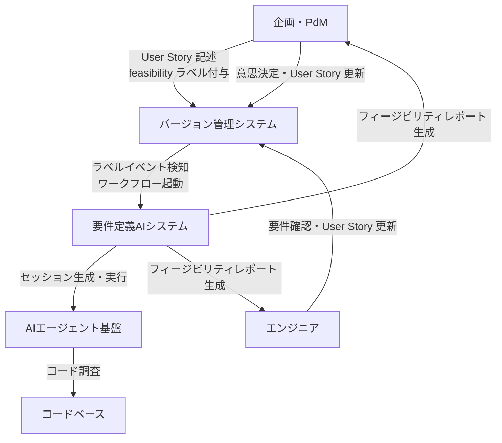
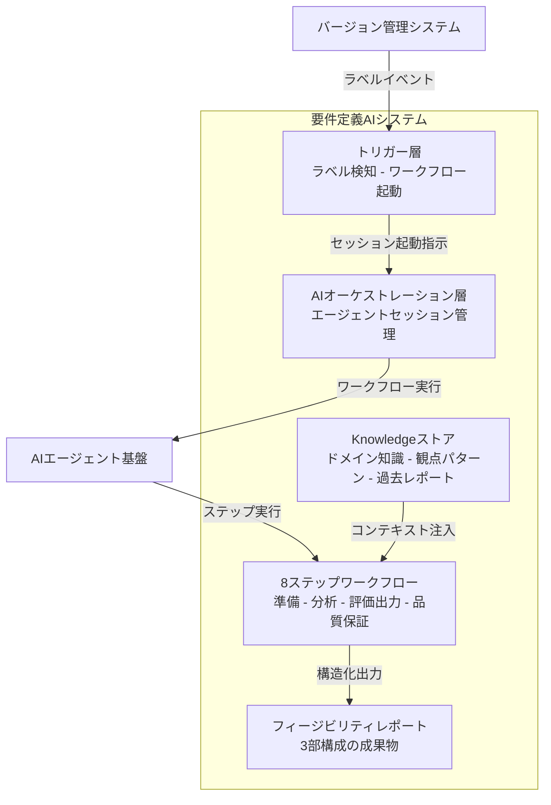
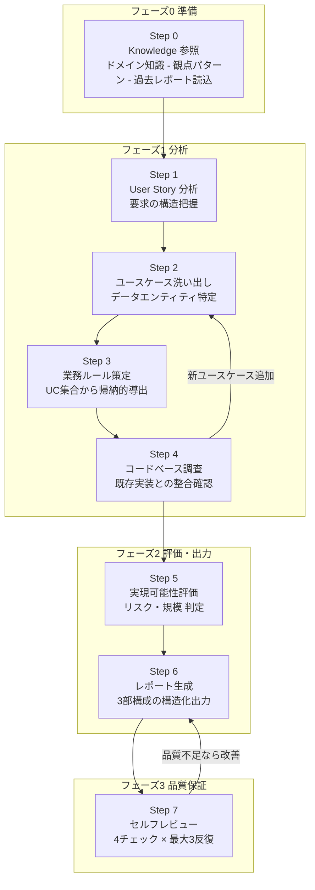
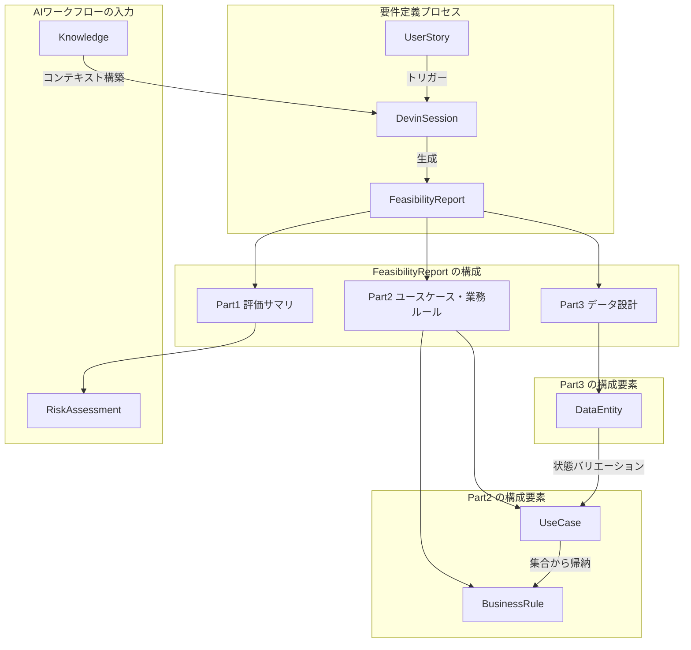
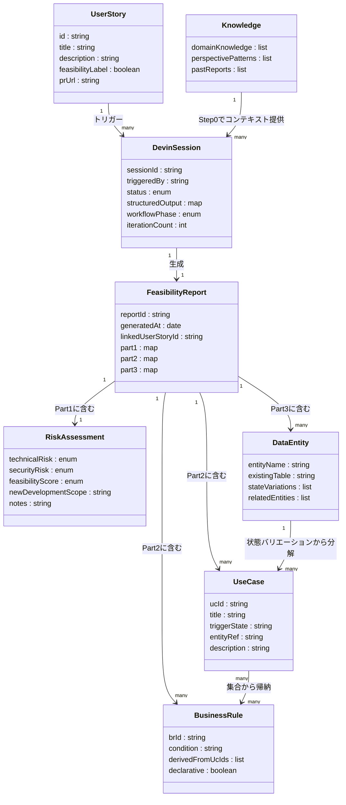

> 調査日: 2026-06-12 / 対象: 食べログ Tech Blog「AIで要件定義の土台を即時生成する」(2026-06-11)。効果数値はすべて食べログ自社申告の体感概算(n=1、第三者検証なし)です。Devin の実装案コードは公式 docs を参照した参考実装であり、食べログの実装そのものではありません。

## 概要

食べログ(カカクコム)が 2026-06-11 に公開した記事「AIで要件定義の土台を即時生成する」は、要件定義工程の直列構造を並列化した実践事例です。

中心的な問いは1つに集約されます。**AIに「要件定義の答え」を出させるか、「エンジニアと企画が同時にレビューできる構造化された論点」を出させるか — この成果物設計の差が工程の並列化を決めます。**

### 解決した課題

要件定義工程には構造的なボトルネックがあります。エンジニアが調査・洗い出しを終えてから企画に渡す直列構造では、AIを導入しても速度上限は変わりません。さらにAIに「要件定義そのもの」を出力させると、データ構造・業務ルール・ユースケースが混在した大量のリストが返り、精査コストがゼロから書く場合と同等になりました。検証がボトルネックを置き換えただけで、直列は解消しませんでした。

この方法論が解決するのは、**「AIの出力を検証する工程」が直列のまま残ること**です。

### 転換の本質

| | 改善前(直列のまま高速化=失敗) | 改善後(並列化=成功) |
|---|---|---|
| AIに出させるもの | 要件定義の答え(完成品) | 構造化された論点(レビュー材料) |
| 出力の形 | データ/業務ルール/ユースケースが混在した大量リスト | 読み手別に分離した3部構成レポート |
| 精査コスト | 手作業と変わらない(検証 ≒ ゼロから書く) | 企画は Part 1 のみ、エンジニアは確認 1〜2時間 |
| 工程構造 | エンジニアが精査してから企画に渡す直列のまま | 企画とエンジニアが同一成果物を同時並行で消費 |

転換の本質は、成果物を「企画の判断基盤」と「エンジニアの要件定義書」の両方として機能する**フィージビリティレポート(実現可能性評価レポート)**に再設計した点にあります。同一レポートの異なる部位を、異なる読み手が異なる文脈で並列に消費できる「成果物の多重化」が、工程の並列化を実現します。

自動化は GitHub Actions(`feasibility` ラベル付与でトリガー)と Devin API(AIセッション生成)で構成され、User Story の更新から数分でレポートが生成されます。要求変更が発生した場合も、同じサイクルで即時に再生成できます。

## 特徴

### フィージビリティレポートの3部構成

| Part | 内容 | 主な読み手 |
|------|------|-----------|
| **Part 1 評価サマリ** | 実現可能性・リスク(◎/○/△判定、技術・セキュリティリスク、新規開発規模) | 企画・PdM |
| **Part 2 ユースケース・業務ルール** | 何が起きるか、どのような制約があるか(UC 一覧・BR 一覧) | エンジニア |
| **Part 3 データ設計** | データエンティティ、状態バリエーション、既存モデルとの関係 | エンジニア |

企画は Part 1 だけで意思決定でき、Part 2・3 の完成を待つ必要がありません。これが「並列化」の実体です。

### データ軸のユースケース分解

ユースケースを「誰が何をする」ではなく「データエンティティのどの状態のとき何が起きるか」で分解します。

- データは機能より変わりにくく安定しています。
- 既存 DB の暗黙ルール・歴史的経緯をデータから引き出しやすくなります。
- 例: 「モーダルを表示する」を、未表示・離脱済み・回答済み・月跨ぎの4状態ごとに別ユースケース(UC-06〜UC-10)へ細分化します。

### 業務ルールの帰納的導出

業務ルール(BR)は、ユースケースの集合から帰納的に導出します。

- 例: UC-06〜UC-10 を束ねて BR-001「有効な表示期間内 かつ 当月内に回答済みでない かつ 離脱済みでない場合に表示」を導きます。
- 業務ルールには実装の詳細を書きません。業務上の制約だけを宣言的に記述します。

### 8ステップ・4フェーズのAIワークフロー

| フェーズ | ステップ | 内容 |
|---------|---------|------|
| 準備 | Step 0 | Knowledge 参照(ドメイン知識・観点パターン・過去レポート)でコンテキスト構築 |
| 分析 | Step 1〜4 | User Story 分析 → ユースケース洗い出し + データ特定 → 業務ルール策定 → コードベース調査(Step 2 と Step 4 が相互フィードバック) |
| 評価・出力 | Step 5〜6 | 実現可能性評価 → レポート生成 |
| 品質保証 | Step 7 | セルフレビュー(4チェック × 最大3反復で品質を自動改善) |

### 要求変更への即時追従

User Story が更新されると同じワークフローが再起動し、フィージビリティレポートが再生成されます。変更履歴は業務ルールの進化として追跡できます。この再追従サイクルの存在が、**初回生成の高速化よりも「変更追従コストの圧縮」を主眼に置く**設計思想を支えています。

効果の目安として、食べログは以下の数値を公開しています。ただし**これらはすべて食べログ自社申告の体感ベース概算であり、著者自身が「案件規模によって幅がある」と明記しています。**計測方法・ベースライン定義・第三者検証は存在せず、対象は単一の軽量 UI 機能(モーダル表示 n=1)です。

| 指標 | 改善前(概算) | 改善後(概算) |
|------|-------------|-------------|
| 初回要件定義(変更なし) | 約2週間 | 2〜3日 |
| 初回要件定義(要求変更込み) | 約1ヶ月 | 約1週間 |
| 要求変更1件あたり | 数日〜1週間 | 半日以内(再生成5分+確認1〜2時間+MTG30分) |
| すり合わせ MTG | 3回(手戻りで4回以上) | 1回・30分 |

### SDD 系ツール・古典手法との比較

この方法論は新しい理論ではなく、既存の確立手法を **AI 生成の文脈で「並列レビュー可能な単一成果物」へ再パッケージした実務統合**です。

| 手法 | 実行方式 | 成果物の性格 | 狙う並列化 | 食べログとの主な差分 |
|------|---------|-------------|-----------|-------------------|
| **食べログ本事例** | AI 自動(数分) | 論点(レビュー材料) | 要件定義工程(企画↔エンジニア同時着手) | — |
| GitHub Spec Kit | AI 支援(人手 + CLI) | spec → source of truth | 仕様→実装の実装並列化 | 並列化の対象が「実装」工程、食べログは「要件定義」工程 |
| AWS Kiro | AI 支援(IDE 統合) | requirements/design/tasks の3 md | 仕様→実装(tasks.md に分解して実装) | 同上。仕様を3 md に分解して実装を進める(EARS 形式・タスク間依存の自動並列化は公式ドキュメント要確認) |
| Tessl | AI 支援(spec registry) | capability + API 使用例 | 仕様→実装 | OSS 知識をプリロードした spec registry が中心、工程並列化に特化せず |
| メルカリ ASDD | AI フレンドリー仕様設計(人手) | 社内仕様標準フォーマット | 全社開発の仕様標準化 | 全社規模の仕様書フォーマット再設計、要件定義1工程への特化ではない |
| RUP Inception フェーズ(※二次情報・原典未照合) | 人手・逐次 | feasibility 評価ドキュメント | フェーズ移行判断 | feasibility 評価の概念は同じだが人手・逐次、AI 即時生成と読み手別 3 部構成はない |
| DOA(データ中心設計、※二次情報) | 人手・逐次 | データモデル → プロセス設計 | — | 「データを軸に選ぶ」設計思想の源流。食べログは DOA を LLM プロンプトの構造化原則として再定式化 |

この方法論の独自性は3点に集約されます。

1. Kiro/Spec Kit が「仕様→実装」の並列化を狙うのに対し、**要件定義工程そのもの**を並列化します(企画とエンジニアが同一成果物を別文脈で同時消費)。
2. RUP で人手・逐次だった feasibility 評価を AI で数分で即時生成し、**変更追従コスト**を主眼に置きます。
3. DOA/状態遷移という古典手法を、**LLM に渡す生成プロンプトの構造化原則**(「データ状態→ユースケース分解→業務ルール帰納」)として再定式化します。

## 構造

C4 model を「提案フレームワークの論理構造」に読み替えて3段階で図解します。

### システムコンテキスト図



#### システムコンテキスト: アクターと外部システム

| 要素名 | 説明 |
|---|---|
| 企画・PdM | 機能要求を定義し、実現可能性サマリで意思決定する |
| エンジニア | ユースケース・業務ルール・データ設計を確認し、要件を確定する |
| 要件定義AIシステム | feasibility ラベルを起点にフィージビリティレポートを自動生成する本体 |
| バージョン管理システム | PR・ラベル管理・User Story 格納の基盤 |
| AIエージェント基盤 | 8ステップワークフローを実行するAI自律エージェント |
| コードベース | 既存実装・スキーマ・業務ロジックの参照源 |

### コンテナ図



#### コンテナ: 主要コンポーネント

| 要素名 | 説明 |
|---|---|
| トリガー層 | バージョン管理システムのラベルイベントを検知し、AIセッション起動を指示する |
| AIオーケストレーション層 | AIエージェントのセッション生成・状態管理・出力ポーリングを担う |
| 8ステップワークフロー | 準備・分析・評価出力・品質保証の4フェーズで構成される処理本体 |
| Knowledgeストア | ドメイン知識・観点パターン・過去レポートを蓄積し、Step 0 で参照される |
| フィージビリティレポート | 3部構成の構造化成果物。企画とエンジニアが並列に消費する |

### コンポーネント図

8ステップワークフローのドリルダウンです。



#### フェーズ0 準備

| 要素名 | 説明 |
|---|---|
| Step 0 Knowledge 参照 | Knowledgeストアからドメイン知識・観点パターン・過去レポートを読み込み、分析フェーズのコンテキストを構築する |

#### フェーズ1 分析

| 要素名 | 説明 |
|---|---|
| Step 1 User Story 分析 | 入力された User Story を解析し、要求の構造と対象範囲を把握する |
| Step 2 ユースケース洗い出し | データエンティティの状態バリエーションごとにユースケースを分解する。例: モーダル表示をUC-06〜UC-10に細分化 |
| Step 3 業務ルール策定 | ユースケース集合から共通する制約を帰納的に導出し、実装詳細を含まない宣言的な業務ルールとして記述する。例: BR-001「当月内未回答かつ離脱済みでない場合に表示」 |
| Step 4 コードベース調査 | 既存実装・スキーマと照合し整合性を確認する。調査で新ユースケースが発見された場合は Step 2 へフィードバックする |

#### フェーズ2 評価・出力

| 要素名 | 説明 |
|---|---|
| Step 5 実現可能性評価 | 技術リスク・セキュリティリスク・新規開発規模を評価し、全体実現性を判定する |
| Step 6 レポート生成 | Part 1 評価サマリ・Part 2 ユースケース業務ルール・Part 3 データ設計の3部構成レポートを構造化出力する |

#### フェーズ3 品質保証

| 要素名 | 説明 |
|---|---|
| Step 7 セルフレビュー | 4観点のチェックを最大3反復で実行し、品質不足なら Step 6 へ戻って自動改善する。食べログ独自のプロンプト実装と推定される |

## データ

方法論が扱うエンティティを概念モデルと情報モデルでモデル化します。記事に明示的な ER 図はないため、登場概念から構成し、記事に未記載の属性は「記事記述から推測」と注記します。

### 概念モデル

エンティティ間の所有関係(subgraph 入れ子)と利用関係(矢印)を示します。



#### 概念モデル: エンティティ

| 要素名 | 説明 |
|---|---|
| UserStory | 機能要求の入力。`feasibility` ラベル付与がワークフローのトリガー |
| DevinSession | AIエージェントのセッション。8ステップを実行する |
| FeasibilityReport | 生成される3部構成の成果物。多重化設計の核心 |
| Part1 評価サマリ | 企画向けの実現性・リスク評価。RiskAssessment を含む |
| Part2 ユースケース・業務ルール | エンジニア向け。UseCase と BusinessRule を含む |
| Part3 データ設計 | エンジニア向け。DataEntity を含む |
| UseCase | データエンティティの状態バリエーションごとに分解された単位 |
| BusinessRule | UseCase 集合から帰納的に導出された宣言的制約 |
| DataEntity | 状態を持つデータエンティティ。ユースケース分解の起点 |
| Knowledge | Step 0 で参照するドメイン知識・観点パターン・過去レポート |
| RiskAssessment | 技術・セキュリティリスクと実現性判定(◎/○/△) |

### 情報モデル

主要属性のみ記載します。型は汎用名(string / list / map / enum / boolean / int / date)を用います。



#### 情報モデル: 主要属性の補足

| 要素名 | 説明 |
|---|---|
| UserStory.feasibilityLabel | `feasibility` ラベルの付与有無。GitHub Actions のトリガー条件 |
| DevinSession.structuredOutput | Devin API の structured_output。AIが作業中に自律的に埋める JSON |
| DevinSession.iterationCount | Step 7 セルフレビューの反復回数(最大3) |
| RiskAssessment.feasibilityScore | 記事実例より ◎/○/△ の3段階(technicalRisk / securityRisk も同様) |
| UseCase.triggerState | 「データエンティティのどの状態のとき」に相当(例: 未表示/離脱済み/回答済み/月跨ぎ) |
| BusinessRule.derivedFromUcIds | 帰納元の UseCase ID リスト(例: UC-06〜UC-10 → BR-001) |
| BusinessRule.declarative | 実装詳細を含まず業務制約のみを宣言的に記述するフラグ(記事記述から推測) |
| DataEntity.stateVariations | 状態バリエーションのリスト。ユースケース分解の起点 |

## 構築方法

食べログの仕組みを自社で再現するための構築手順です。以下のコードは Devin 公式 docs を参照した**実装案**であり、食べログの実装そのものではありません。

### 前提条件

- **Devin API キー**: [app.devin.ai](https://app.devin.ai) の Settings > API Keys で発行します。キーの種別はエンドポイントの系統で異なります(v3 の組織 API は Service User credential、`cog_` プレフィックス)。利用する API バージョンに対応したキーを用意してください。
- **GitHub リポジトリ**: User Story を PR で管理するリポジトリ。GitHub Actions が有効であること。
- **プラン選定**: 同時セッション数に注意します。Free/Pro は同時10セッション上限です。並列フィージビリティチェックが多い場合は Max/Teams/Enterprise が必要です。
- **Devin の Organization ID**: v3 API エンドポイントに必要です。`DEVIN_ORG_ID` として管理します。

### GitHub Actions ワークフローの設定

ラベルトリガーは **GitHub Actions 側の `types: [labeled]` で実装する機能であり、Devin のネイティブ機能ではありません**。Cognition 公式の PR レビュー例でも GitHub Actions 側でカスタムラベルを使う構成が示されています(Devin 公式 docs への label-trigger の直接記載は未確認)。

なお下記の例はセッション生成に v1 エンドポイントを使います。これは Cognition 公式ブログの例が v1 を使っているためで、後方互換として利用できます。新規実装では `POST /v3/organizations/{org_id}/sessions` を推奨します。また PR 本文に改行やダブルクォートが含まれると `python3 -c` の文字列展開が壊れるため、堅牢にするなら `gh pr view "$PR_NUMBER" --json body -q .body` を変数に格納してから `jq` で JSON 化する方式に置き換えてください。

```yaml
name: Feasibility Check via Devin

on:
  pull_request:
    types: [labeled]

permissions:
  contents: read
  pull-requests: write
  issues: write

jobs:
  feasibility:
    if: github.event.label.name == 'feasibility'
    runs-on: ubuntu-latest
    steps:
      - name: Checkout
        uses: actions/checkout@v4
        with:
          fetch-depth: 0

      - name: Create Devin session
        id: devin-session
        env:
          DEVIN_API_KEY: ${{ secrets.DEVIN_API_KEY }}
          PR_NUMBER: ${{ github.event.pull_request.number }}
          REPO: ${{ github.repository }}
          GH_TOKEN: ${{ secrets.GITHUB_TOKEN }}
        run: |
          PR_BODY=$(gh pr view "$PR_NUMBER" --json body -q .body)
          PROMPT=$(python3 -c "import json,sys; print(json.dumps(sys.argv[1]))" \
            "PR #$PR_NUMBER ($REPO) のフィージビリティ評価を Playbook に従って実施してください。User Story: $PR_BODY")
          RESPONSE=$(curl -s -X POST "https://api.devin.ai/v1/sessions" \
            -H "Authorization: Bearer $DEVIN_API_KEY" \
            -H "Content-Type: application/json" \
            -d "{\"prompt\": $PROMPT, \"playbook_id\": \"${{ secrets.DEVIN_PLAYBOOK_ID }}\"}")
          SESSION_ID=$(echo "$RESPONSE" | python3 -c "import json,sys; print(json.load(sys.stdin)['session_id'])")
          echo "session_id=$SESSION_ID" >> $GITHUB_OUTPUT
```

### シークレット管理

GitHub リポジトリの Settings > Secrets and variables > Actions に登録します。

| シークレット名 | 内容 |
|---|---|
| `DEVIN_API_KEY` | Devin の API キー(利用する API バージョンに対応した種別を使う) |
| `DEVIN_ORG_ID` | Devin の Organization ID(v3 API 使用時) |
| `DEVIN_PLAYBOOK_ID` | フィージビリティ評価 Playbook の ID |

### Devin の Knowledge 準備

Knowledge はドメイン知識や慣例を事前登録し、セッション時に Devin へ参照させる仕組み(Knowledge Notes)です。モデルの重みを更新する学習ではありません。UI または API(`POST /v1/knowledge`)で登録します。食べログの「Step 0: Knowledge 参照」はこの機構に対応します。

```bash
curl -X POST "https://api.devin.ai/v1/knowledge" \
  -H "Authorization: Bearer $DEVIN_API_KEY" \
  -H "Content-Type: application/json" \
  -d '{
    "name": "ドメイン用語集",
    "body": "User Story / フィージビリティ / 主要エンティティ一覧 ...",
    "trigger_description": "フィージビリティ評価を実施するとき"
  }'
```

登録対象の例として、ドメイン用語集(主要エンティティ名)、過去のフィージビリティレポートのリスク分類(高/中/低)、コードベース規約(ディレクトリ構成・主要モジュール)を挙げます。

### Devin の Playbook 準備

Playbook はタスクの実行手順を記述するドキュメントです。セッション生成時に `playbook_id` を渡すと Devin がその手順に従います。8ステップのフローと「セルフレビュー4チェック×最大3反復」を Playbook に記述します。

> **重要**: 「4チェック × 最大3反復」ループは Devin 標準機能ではありません。Playbook/プロンプト内に「4観点で自己レビューし最大3回改善せよ」と指示することで実現する**食べログ独自実装と推定されます**(Devin 公式 docs に該当機能の記述なし)。

```bash
# title / body のパラメータ名は公式 OpenAPI で未直接確認。実装前に docs.devin.ai で確認すること
curl -X POST "https://api.devin.ai/v3/organizations/$DEVIN_ORG_ID/playbooks" \
  -H "Authorization: Bearer $DEVIN_API_KEY" \
  -H "Content-Type: application/json" \
  -d "{\"title\": \"フィージビリティ評価\", \"body\": \"# Step 0..7 の手順 ...\"}"
```

### リポジトリ Indexing の設定

コードベース調査(Step 4)の精度はリポジトリのインデックス化に依存します。事前に有効化します。search index(コード検索用)と wiki index(DeepWiki、シンボルレベル説明)の2種があり、大規模モノリスでは索引完了に時間がかかります。

> 下記の indexing エンドポイントは Beta(`v3beta1`)です。`branch_names` を body で指定できます。Beta のため将来パスが変わりうる点に留意し、実装前に docs.devin.ai の最新 API リファレンスで確認してください。

```bash
curl -X PUT "https://api.devin.ai/v3beta1/organizations/$DEVIN_ORG_ID/repositories/$REPO_PATH/indexing" \
  -H "Authorization: Bearer $DEVIN_API_KEY"
```

## 利用方法

### Devin API v1 セッション生成パラメータ

`POST https://api.devin.ai/v1/sessions` の主要パラメータです(公式 docs で確認した範囲)。v1 は後方互換エンドポイントで、現行の組織スコープ付きセッション生成は `POST /v3/organizations/{org_id}/sessions` が正系統です(Cognition 公式ブログの例は v1 を使用)。新規実装は v3 を推奨します。

| パラメータ | 必須/オプション | 型 | 説明 |
|---|---|---|---|
| `prompt` | **必須** | string | タスクの指示。JSON スキーマを埋め込んで structured_output を制御する |
| `playbook_id` | オプション | string | 事前登録した Playbook の ID |
| `snapshot_id` | オプション | string | 特定の環境スナップショットを使用する場合 |
| `create_as_user_id` | オプション | string | セッションを特定ユーザーに帰属させる(権限必要) |

`GET /v1/sessions/{session_id}` のレスポンスでは `status` / `status_enum`(`working`/`blocked`/`expired`/`finished` 等)/ `structured_output` / `pull_request` 等を取得できます。

### User Story 記述 → feasibility ラベル付与 → レポート取得

User Story を PR 本文に記述し、ラベルを付与してトリガーします。

```bash
gh pr edit <PR番号> --add-label "feasibility"
```

Devin はプロンプトで「PR にレポートをコメントせよ」と指示された場合に PR へコメントを投稿します(上記の最小ワークフローはセッション作成までで、完了ポーリングや `gh pr comment` を Actions 側で実装する場合は別ステップを足します)。構造化データはセッション ID で直接取得できます。

```bash
curl -s "https://api.devin.ai/v1/sessions/$SESSION_ID" \
  -H "Authorization: Bearer $DEVIN_API_KEY" \
  | python3 -c "import json,sys; d=json.load(sys.stdin); print(json.dumps(d['structured_output'], ensure_ascii=False, indent=2))"
```

### structured_output に JSON スキーマを埋め込む

structured_output を制御するには、**prompt 内に JSON スキーマを直接埋め込み、Devin に「relevant なことが起きたら structured_output を更新せよ」と指示します**。これが公式推奨パターン(「Devin のメモ帳」)です。各ステップ完了時の更新タイミングをスキーマに指定します。なお JSON Schema を渡す `structured_output_schema` パラメータも利用できます。v3 の `structured_output_required` は最終的な structured output の提出を必須化するフラグで、スキーマ指定そのものとは役割が異なります。

```python
import json

schema = {
    "use_cases": [],
    "business_rules": [],
    "data_design": {"entities": [], "state_variations": []},
    "code_impact": {"files": [], "tables": [], "apis": []},
    "feasibility_summary": {"level": "", "rationale": "", "risks": [], "estimated_effort": ""},
    "report": {"part1_pdm": "", "part2_engineer": "", "part3_data_design": ""},
    "self_review_done": False,
    "review_iterations": 0,
}

prompt = f"""...タスク指示(Step 0〜7)...

# structured_output スキーマ
以下のスキーマに従って structured_output を管理し、各ステップ完了時に必ず更新してください:
{json.dumps(schema, ensure_ascii=False, indent=2)}
"""
```

ポーリングで structured_output を確認します。**公式推奨のポーリング間隔は 10〜30 秒**です。

```python
import time, json, urllib.request

def poll_session(session_id, api_key, interval=20, timeout_sec=3600):
    terminal = {"finished", "expired", "blocked"}
    elapsed = 0
    while elapsed < timeout_sec:
        req = urllib.request.Request(
            f"https://api.devin.ai/v1/sessions/{session_id}",
            headers={"Authorization": f"Bearer {api_key}"},
        )
        with urllib.request.urlopen(req) as resp:
            data = json.loads(resp.read())
        if data.get("status_enum", "") in terminal:
            return data
        time.sleep(interval)
        elapsed += interval
    raise TimeoutError(f"Session {session_id} did not finish within {timeout_sec}s")
```

### 要求変更時の再評価

User Story が更新された場合は再評価します。

- **パターン A(ラベル再付与・新規セッション)**: `types: [labeled]` は「ラベル付与の瞬間」に発火するため、一度外して再付与します(`gh pr edit <PR> --remove-label feasibility && gh pr edit <PR> --add-label feasibility`)。
- **パターン B(既存セッションへメッセージ送信)**: `POST /v3/organizations/$DEVIN_ORG_ID/sessions/$SESSION_ID/messages` に更新通知を送ります。

## 運用

### レポート生成の起動・状態確認

`feasibility` ラベル付与で GitHub Actions が起動し、`POST /v1/sessions` でセッションを作成、`GET /v1/sessions/{id}` を 10〜30 秒間隔でポーリングして `structured_output` を取得します。`status` の `blocked` は人手介入またはタイムアウト扱いにします。

### 要求変更サイクルの回し方

1. **User Story 更新** — 企画が PR の User Story を更新し、再度 `feasibility` ラベルを付与する。
2. **セッション再起動** — Knowledge 参照(Step 0)から 8 ステップを再実行する。
3. **差分確認** — 前回レポートとの diff をレビュー(Part 2 の UC/BR 変更点、Part 3 のデータ変更点)。
4. **MTG** — Part 1 サマリで企画が実施可否を決定 → Part 2・3 をベースにエンジニアが詳細確認。
5. **サイクル継続** — 要求変更のたびに 1〜4 を繰り返す。

### Devin ACU コスト管理(従量・レート制限非開示)

- **ACU 消費の目安**: 1 ACU ≈ 能動作業 約 15 分。料金は Core 約 $2.25/ACU、旧 Team は $2.00/ACU(いずれも 2025-10 時点の二次情報。現行公式未確認)。フィージビリティレポート 1 件あたりの消費量は公式開示なし。
- **レート制限**: API は 429 を返しますが公式の req/min 閾値は非開示です。Free/Pro プランは同時セッション 10 上限です。
- **コスト管理の実践**: ラベル付与権限を PM/エンジニアリーダーに絞る / GitHub Actions の `if:` 条件でラベル名を明示し連鎖起動を防ぐ / 月次で ACU 消費を確認しプランを見直す。
- **課金体系の変動リスク**: 2024〜2026 年の約 2 年で Team $500/月 → Devin 2.0 $20+ACU従量 → seat+overage へと 2 回転換しています。料金前提で ROI を固定しないようにします。

### Knowledge・過去レポートの育て方

- Knowledge は `/v1/knowledge` に登録します。新しい業務ドメイン・例外パターン・ブランドルールが出たら都度追加します。
- 完成したレポートを Knowledge に追加し「このドメインではこういう BR パターンが出やすい」文脈を渡します。
- Knowledge は過剰に増やすとコンテキストが汚染されます。「汎用的なドメイン知識」と「案件固有の制約」を分離し、後者は User Story 本文に埋め込みます。

### 品質ゲート(人手レビュー)の運用

- **Part 1 サマリの確認**: 重大リスク(△)には必ず詳細確認を要求します。「サマリだけ読んで承認」は automation bias のリスクが高くなります。
- **横断整合レビュー**: Part 2(UC/BR)↔ Part 3(データ設計)の整合性を人手で確認します。AI の整合性認識率は 52〜78% との報告(ASE'25)があり、誤判定を前提とします。
- **業務ルールの欠落チェック**: AI は「書かれていないことを実装しない」性質があります。暗黙の業務ルールは現場ヒアリングで補完します。

## ベストプラクティス

反証エビデンスを「誤解 → 反証 → 推奨」の構造で統合します。

### 効果数値は体感概算・n=1 — 自社計測基盤を先に用意する

- **誤解**: 「2週間→2-3日」は再現可能な実績で、導入すれば同等効果が得られる。
- **反証**: 著者自身が「体感ベースの概算。案件規模によって幅がある」と明記しています。対象は単一の軽量 UI 機能(モーダル表示 n=1)です。第三者検証はありません。
- **推奨**: 数値を ROI 計算の前提に使いません。自社の直近 3〜5 案件でベースライン計測(リードタイム / 手直し工数 / 手戻り発生率)をしてから期待値を設定します。

### 「データは安定・案件非依存」は条件付き — 適用範囲を見極める

- **誤解**: データ軸分解はどんな案件でも機械的に再現できる。
- **反証**: スキーマ進化の実測(ICEIS 2008 の MediaWiki DB 研究で 4.5 年に 171 スキーマバージョン変更が観測され、カラム削除も多発)/ イベント駆動・マイクロサービスでは「唯一のデータ軸」が取れない / 状態爆発(state explosion、計算機科学の確立した問題)で機械的再現には人手の抽象化が必須。
- **推奨**: データモデルが安定・状態バリエーションが有限かつ少ない・モノリスまたは共有スキーマがある軽量〜中規模機能に限定します。適用前に「データモデルは直近 1 年で何回変わったか」を確認します。

### automation bias は専門家・訓練でも防げない — 横断整合レビューを設計に組む

- **誤解**: 「Part 1 サマリだけで意思決定」が強みで、品質は保証される。
- **反証**: automation bias は「AI 生成と知っていても従う」(Klingbeil et al. 2024)、専門家・訓練でも防げない(Parasuraman & Manzey 2010)。partial/shallow review は欠陥検出を改善しない(Di Biase et al. 2019)。
- **推奨**: Part 1 だけで確定せず「UC と BR の整合」「状態の網羅」「既存コードとの矛盾」の 3 点を横断確認するステップを設計に組みます。企画 1 名 + エンジニア 1 名が別々に確認し、相違点を MTG で突合します。

### AI 仕様生成はハルシネーション前提 — 人手の品質ゲートを必ず残す

- **誤解**: AI 生成の UC/BR/データ設計は「調査済み」として信頼できる。
- **反証**: 食品安全規制から Gherkin 仕様を生成する human-subject 実験では、概ね高評価ながら occasional な仕様の捏造(hallucination)・必須要件の欠落(omission)・意図の混在が報告されています(arXiv:2508.20744)。LLM によるコード↔仕様の整合性判定にも体系的な失敗が報告され、認識率は 52〜78% です(arXiv:2508.12358)。
- **推奨**: BR 一覧に「根拠となる業務文書または現場確認日」の列を足し、未確認行を明示します。既存システム整合は人間が該当コードを目視確認します。

### Devin の実タスク精度は限界前提 — 曖昧さ解消は人間が担保する

- **誤解**: Devin に任せれば曖昧な User Story も解釈して正しいレポートを作る。
- **反証**: 実タスク成功率は 15%(Answer.AI 2025-01、20 タスクで成功3/失敗14/不確定3)です。「自律性が負債になる」と報告されています。
- **推奨**: User Story は「誰が・何のために・どんな状態のとき・何をする」まで書いてから渡します。`blocked` を返したら人間が補完してから再開します。最終判断を Devin に委ねません。

### ベンダーロックインを織り込む — 出力形式を内製資産化する

- **誤解**: Devin への最適化が競争優位になる。
- **反証**: 約 2 年で課金体系が 2 回転換しています。VC 段階のスタートアップで継続性は保証されません。
- **推奨**: レポートの出力フォーマット(JSON スキーマ・Markdown 構成)を内製資産として定義し、Devin に依存しない形で保存します。Knowledge/Playbook を自社 Git にも commit します。

## トラブルシューティング

| 症状 | 原因 | 対処 |
|------|------|------|
| レポートに「混在した大量リスト」が返る | AIに「要件定義の答え」を直接出力させている(最初の失敗パターン) | プロンプトを「データエンティティ→状態→UC→BR の順に帰納」構造に再設計し、Part 1〜3 の出力スキーマを structured_output に明記する |
| 業務ルール(BR)に実装詳細(SQL/API)が混入する | 「宣言的に業務制約だけ記述」の制約がプロンプトに無い | Playbook に「BR は宣言的に業務制約のみ。SQL/API 等は Part 3 に分離」と明記する |
| 既存システム整合性を誤判定する | LLM の整合性認識率が 52〜78% で構造的に誤判定が起きる(ASE'25) | AI の判定は参考にとどめ、該当コードを人間が目視確認する。整合エラーは「AI 要確認」列でフラグ立てする |
| ポーリングがタイムアウトする | 大規模コードベースのインデックス未完了・複雑な User Story・`blocked` 放置 | `status` を確認し `blocked` なら補足情報を入力して再開。タイムアウト 30 分目安、超えたら User Story を分割する |
| ACU が枯渇しセッションが起動しない | ラベル付与権限が緩く連鎖起動・同時セッション上限(Free/Pro は 10)到達 | ラベル付与権限を限定し、`if:` 条件でドラフト/ボット PR を除外。ACU 消費を月次集計する |
| ユースケースが際限なく膨張する(状態爆発) | 状態変数が多い複雑機能で状態→UC 分解を機械適用 | 状態の直交性を確認し「意味を持つ組み合わせ」を人手で絞る。状態変数 4 つ以上はデータ軸分解の適用範囲を見直す |
| セルフレビューが機能せず品質が安定しない | 「4チェック×最大3反復」は Devin 標準でなく Playbook 実装。指示が曖昧だとスキップされる | Playbook に「Step 7: 4観点(UC↔BR整合/状態網羅/既存コード矛盾/実装詳細混入)で最大3回改善せよ」と明示する |
| コストが読めずラベル乱発を止められない | ACU 従量単価・レート制限が公式非開示 | billing API で週次 ACU をモニタリングし閾値超過で通知。PR テンプレに「コスト確認チェックボックス」を追加する |
| 暗黙の業務ルールが BR に入らない | AI は「書かれていないことは実装しない」 | Knowledge に「よく抜けるパターン一覧」を蓄積。User Story 作成時に「現行の例外ケース」を明示するテンプレートを用意する |
| データレジデンシー・SLA 要件でブロックされる | 数値 SLA・地理的データレジデンシーは公式非開示で個別商談 | SOC 2 Type II・暗号化は公式確認済み。規制業種の要件は Enterprise 契約交渉または Devin 不使用を検討する |

## まとめ

食べログの事例は「AIに要件定義の答えを書かせる」と失敗し、「企画とエンジニアが別文脈で同時に消費できる構造化された論点(フィージビリティレポート)を書かせる」と要件定義工程が直列から並列に変わることを示します。再利用できるのは効果数値ではなく、成果物の多重化設計と「データ状態→ユースケース→業務ルールの帰納」という生成プロンプトの構造化原則であり、適用時はデータ安定性の条件・AI のハルシネーション・automation bias を前提に人手の品質ゲートを残すことが重要です。

この記事が少しでも参考になった、あるいは改善点などがあれば、ぜひリアクションやコメント、SNSでのシェアをいただけると励みになります！

## 参考リンク

- 一次ソース(本事例・公式ドキュメント)
  - [食べログ Tech Blog「AIで要件定義の土台を即時生成する」(2026-06-11)](https://tech-blog.tabelog.com/entry/ai-driven-requirements-definition-process_52)
  - [Devin API リファレンス(overview)](https://docs.devin.ai/api-reference/overview)
  - [Devin API リファレンス(structured output)](https://docs.devin.ai/api-reference/v1/structured-output)
  - [Devin 料金体系](https://devin.ai/pricing)
  - [Devin セキュリティ・コンプライアンス](https://docs.devin.ai/admin/security)
  - [Cognition「Devin 101: Automatic PR Reviews with the Devin API」](https://cognition.ai/blog/devin-101-automatic-pr-reviews-with-the-devin-api)
- 系譜(SDD・古典手法)
  - [GitHub Spec Kit](https://github.com/github/spec-kit)
  - [AWS Kiro Specs](https://kiro.dev/docs/specs/)
  - [AWS「Kiro でイベントストーミング」](https://aws.amazon.com/jp/blogs/news/eventstorming-with-kiro/)
  - [メルカリ ASDD(エンジニアtype)](https://type.jp/et/feature/29747/)
  - [DOA データモデリング(Think IT)](https://thinkit.co.jp/article/17291)
- 反証(査読・採録済み研究 / プレプリント)
  - [Answer.AI「Thoughts On A Month With Devin」(2025-01-08)](https://www.answer.ai/posts/2025-01-08-devin.html)
  - [規制→仕様生成のハルシネーション実証(Information and Software Technology 採録, arXiv:2508.20744)](https://arxiv.org/abs/2508.20744)
  - [LLM コード↔仕様適合検証の失敗(ASE 2025 NIER, arXiv:2508.12358)](https://arxiv.org/abs/2508.12358)
  - [Di Biase et al.「The Effect of Change Decomposition on Code Review」(PeerJ CS, 2019)](https://peerj.com/articles/cs-193/)
  - [Parasuraman & Manzey「Complacency and Bias in Human Use of Automation」(Human Factors, 2010)](https://journals.sagepub.com/doi/10.1177/0018720810376055)
  - [Clarke「Model Checking and the State Explosion Problem」](https://pzuliani.github.io/papers/LASER2011-Model-Checking.pdf)
  - [Klingbeil et al. automation bias(2024, Computers in Human Behavior)](https://www.sciencedirect.com/science/article/pii/S0747563224002206)
  - [Wikipedia DB スキーマ進化研究(ICEIS 2008)](https://web.cs.ucla.edu/~zaniolo/papers/ICEIS2008.pdf)
- 二次情報
  - [Devin 料金体系の変遷(eesel, 2025-10時点)](https://www.eesel.ai/blog/cognition-ai-pricing)
