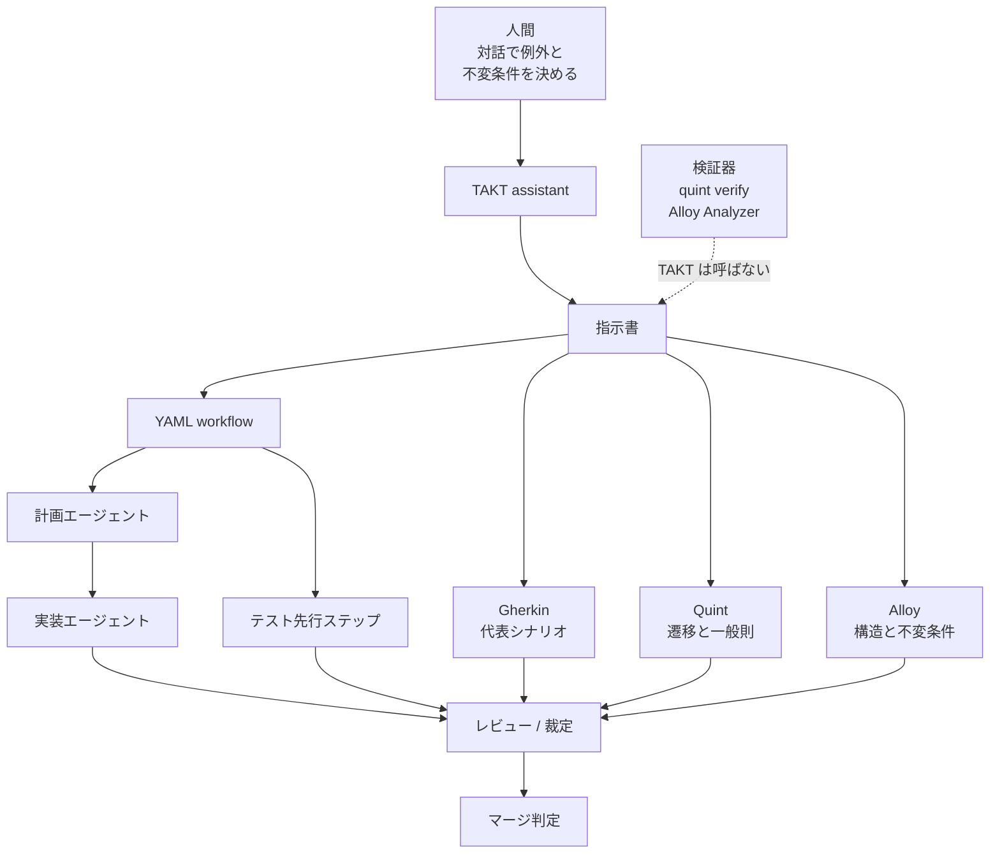

コーディングエージェントに仕事を渡すとき、いちばん高くつくのは「言い忘れた例外」です。実装が終わってレビューで気づき、初期化順まで巻き戻す。この手戻りを実装前に潰す手段として、形式仕様の記法をエージェントとの合意に使うアプローチが出てきました。

CLI ワークフローツール TAKT の `assistant.formal_spec`（形式仕様モード）がその一例です。有効にすると、要件を Gherkin に加えて Quint と Alloy でも書かせ、それを指示書に残します。

この記事では次を扱います。

- TAKT の形式仕様モードが実際に強制すること、しないこと
- Quint と Alloy をどう使い分け、何を `iff` 1 文に畳むのか
- 検証器（model checker）を回さない設計をどう評価すべきか
- 自分のプロジェクトで、どのタスクに限定して導入するか

先に結論を書きます。このモードは **形式検証ではなく、実行前合意の強制装置** です。二段に分けて評価しないと、過大評価にも過小評価にも倒れます。


*この記事の全体像。以下、順に解説します。*

## 対象と前提

- TAKT は YAML でワークフロー（計画・実装・レビュー・修復）を拘束する MIT ライセンスの CLI です（[nrslib/takt](https://github.com/nrslib/takt)）。
- 形式仕様モードは v0.61.0 で入りました（CHANGELOG 日付 2026-08-23、npm 公開 2026-08-24）。本記事の確認時点の npm 最新は 0.63.0（2026-08-27）です。
- 記法の背景として [Quint](https://quint.sh/docs/what-does-quint-do) と [Alloy](https://alloytools.org/) の公式ドキュメントを参照します。

## 形式仕様モードは何を強制するのか

### 設定と起動時の挙動

`assistant.formal_spec` は `true` / `false` / `"Y/n"` / `"y/N"` のいずれか、または `{mode, comments}` のオブジェクトで指定します（[#1512](https://github.com/nrslib/takt/issues/1512)）。既定は `mode: 'y/N'`、`comments: true` です。

```yaml
# 既定と等価な明示指定
assistant:
  formal_spec:
    mode: "y/N"     # true / false / "Y/n" / "y/N"
    comments: true  # 生成物に説明コメントを付ける
```

挙動のポイントは 3 つです。

- TTY ではセッション開始時に **1 回だけ**確認します（[docs/configuration.ja.md](https://github.com/nrslib/takt/blob/main/docs/configuration.ja.md)）。
- 非 TTY と ACP 経由では質問しません。CI や自動実行では既定値のまま走ります。
- `mode` の大文字がそのまま既定回答です。`"y/N"` は「聞かれたら基本 No」を意味します。

### 出力される 3 つの記法

開発・実装タスクでは Gherkin を使います。研究や文書化のタスクは Markdown のみです（CHANGELOG 0.62.0、2026-08-25）。導入当初（[#1454](https://github.com/nrslib/takt/issues/1454)）は Gherkin を常時注入していたので、ここは絞り込まれています。

形式仕様モードが有効だと、これに加えて **各要件を Quint と Alloy の両方で**書きます。省略するには「その記法では表現できない」という理由が要ります。

プロンプト側（`score_summary_formal_spec_instructions.md`）は、実際の Quint / Alloy 構文で書くこと、時相性質を弱めないこと、`temporal val` を使わないこと、仕様どうしが自己整合することを要求します。

ただし **これらはすべてプロンプトの要求であり、パーサや検査器の実行ではありません**。つまり、この機能の実体は「仕様生成プロンプトの強化」です。形式検証パイプラインではありません。

## Quint と Alloy をどう使い分けるか

教育的な切り方として、次の分担が示されています。

| 記法 | 担当する問い | 典型的な書き味 |
|---|---|---|
| Gherkin | 外から観測できる代表シナリオはどれか | Given / When / Then |
| Quint | どんな遷移が起き、どんな一般則が成り立つか | 状態機械と振る舞い |
| Alloy | 何が登場し、常に成り立つ制約は何か | 構造と不変条件 |

例として、TAKT の Issue [#1505](https://github.com/nrslib/takt/issues/1505)（設定パス衝突ガード）を見ます。プロジェクト設定とグローバル設定のパスが同一のとき、通常コマンドは起動を止め、メタコマンドだけは通す、という要件です。

Quint 側は「どの入力でどう決まるか」を関数として置きます。Issue 本文の要旨は次の形です。

```
decide(Meta | Normal, projectConfig, globalConfig)
```

Alloy 側は「常に成り立つこと」を 1 文に畳みます。

```
Rejected iff NormalCommand and paths equal
```

この `iff`（必要十分）が効きどころです。自然言語で書くと「ただしメタコマンドは除く」「ただしパスが違えば通す」という但し書きが仕様書の各所に散ります。`iff` にすると、拒否する条件と通す条件が 1 箇所に閉じ、書けない時点で「例外を決めきれていない」と分かります。

:::message
公開されている解説記事の識別子（`startupOutcome` / `MetaOnly` など）は、著者が説明用に簡略化したものと明記されています。引用や実装の根拠にするなら、Issue 本文の記述を正本にしてください。
:::

なお、この分担はあくまで入門用の切り分けです。Alloy 6 は時相論理も扱えますし、Quint 公式が本丸に据えているのは `quint run` / `quint verify` による[検査](https://quint.sh/docs/checking-properties)です。

## TAKT がつないでいるのは検証器ではない

全体像を並べると、TAKT が実際に接続している線がはっきりします。



実線は「対話 → 指示書 → レビュー」です。破線の検証器は入っていません。

これは実装漏れではなく **スコープの宣言**です。導入 Issue [#1454](https://github.com/nrslib/takt/issues/1454) は、model checker を実行も同梱もしないこと、機械検証を受け入れ条件にしないことを明示しています。実際、`package.json` 0.63.0 に quint / alloy / apalache への依存はありません。

TAKT の設計哲学（[docs/design-philosophy.md](https://github.com/nrslib/takt/blob/main/docs/design-philosophy.md)）も、エージェントの出力そのものを権威にせず、成果物とゲートで判定する方針を取っています。形式仕様を「レビューで参照する資産」に位置づけるのは、この方針と整合します。

一方で、Quint / Alloy 公式や [AWS の TLA+ 実践報告](https://dl.acm.org/doi/10.1145/2699417)が売ってきた価値、すなわち **人間が思いつかない反例を検査器が見つける**という部分は、このスコープの外です。

### 「書けた」と「正しい」の差は小さくない

検査を外すと何が見えなくなるのか。LLM が書く形式仕様の評価研究が参考になります。

- 自然言語から TLA+ を生成させた研究（[arXiv:2606.05792v1](https://arxiv.org/html/2606.05792v1)）では、open-weight 25 モデルの few-shot 合計で構文チェッカ SANY の通過が 173/650（26.6%）、モデル検査 TLC の通過は progressive 設定のみで 56/650（8.6%）でした。proprietary の GPT-5 few-shot は SANY 26/26 に対し TLC は 7/26（26.9%）です。
- Alloy 式の生成研究（[arXiv:2502.15441v1](https://arxiv.org/html/2502.15441v1)）は、Analyzer の等価性 `check` で正誤を分けています。o3-mini の Reflexive 設定では 20 件中 18 件が誤りでした。

構文が通ることと意味が合っていることの間には、大きな差があります。検査器を回さない運用では、この差が観測できません。だからこそ「仕様の正しさは人間が対話で担保する」という前提が外せなくなります。

## 何と比べて選ぶか

適用手段を並べると、TAKT の記法利用が埋めている位置が見えます。

| 基準 | Gherkin + テストのみ | TAKT 記法（検査なし） | Quint/Alloy 検査ゲート | TLA+ + TLC |
|---|---|---|---|---|
| 事前に例外を確定する強制 | 弱い（代表例どまり） | 強い（`iff` が書けないと指示書が完成しない） | 強い | 強い |
| 未知の反例 | テストが当たった範囲 | ほぼ無い | bounded で有る | 設計検証の本丸 |
| 仕様誤りの検出 | テスト失敗 | 人間の対話 | 検査器 + 人間 | 検査器 + 人間 |
| 運用負荷 | 低い | 中（二重記述とトークン増） | 高（ツール、scope、誤検知） | 高（専門家が要る） |
| 向く作業 | UI、局所修正 | 排他・ガード・状態の境界 | 分散プロトコル、並行処理 | ストレージ複製など |

それぞれが最適になる条件は次のとおりです。

- **Gherkin + テストのみ**: 観測可能な入出力だけで足り、排他条件が散らばらないとき。
- **TAKT 記法**: `--help` の例外扱いやパス同一性のように、後から直すと初期化順まで壊れる判断。人間が対話で `iff` を確認できる規模。
- **検査ゲート / TLA+**: 並行、故障、公平性。人も AI も列挙しきれない状態の交差。

## 導入するときの判断基準

現時点で言えるのは、TAKT の形式仕様は **実行前合意とレビュー用の資産としては有効**、**形式検証としては未実装**、という二段の評価です。踏まえた導入方針を挙げます。

1. **形式化する対象を選ぶ。** 候補は (a) 例外つきの排他（`iff` に畳める）、(b) 初期化順に効く状態遷移、(c) データ所有とカーディナリティの不変条件。UI 文言やファイル配置は Gherkin とテストに残します。
2. **人間が `iff` を対話で確認してからエージェントを走らせる。** 仕様の正本は検査器ではなく、この確認です。
3. **マージ判定の一次はテストと自然言語の充足リストにする。** Quint / Alloy は根拠の索引として使います。現状の TAKT は検査器をゲートにできません。
4. **検査器をデフォルトにしない。** 並行や故障を扱うタスクに限って、`quint run`（反例探索）や Alloy の `check` を人間または別ジョブで足します。その際は「仕様誤りで落ちたときの運用」を先に決めておきます。
5. **二重記述のドリフトを見る。** 現行プロンプトは Quint と Alloy の両方を必須にしています（#1454 の当初方針は重複記載の禁止でした）。どちらに寄せるかは、1 スプリント試してトークン量と記法間の不一致件数で判断します。

### 撤退・切り替えの条件

- 仕様をエージェントだけが書き、人間が `iff` を読まない運用になったとき。誤った仕様に収束するので止めます。
- 検査器を足さないまま「形式検証済み」と対外説明したとき。事実と一致しません。
- 対象が公平性を含む分散プロトコルになったとき。記法だけでは不足なので、`quint verify` か TLA+ に切り替えます。

## 残る不確実性

判断を保留すべき点も明示しておきます。

- Issue #1505 とその実装 PR [#1514](https://github.com/nrslib/takt/pull/1514) は、確認時点でどちらも OPEN です。マージゲートとしての実証はまだありません。
- 公開されている PR の差分は TypeScript・テスト・設定ドキュメントで、`.qnt` / `.als` ファイルは含まれません。記法の一次情報は Issue 本文にあります。
- 「大規模な手戻りが減る」の定量的な効果量、第三者の採用事例、形式仕様モードを常時 ON にしたときのトークンとレビュー時間の増分は、いずれも未検証です。
- 時相性質（fairness、eventually）をプロンプトだけで弱めずに書けるかも未確認です。

したがって、「形式手法を採用した」という対外説明や全面導入は、現時点では根拠不足です。一方で、ガード級のタスクへの試験導入を止める理由はありません。

## まとめ

- TAKT の形式仕様モードは、Quint と Alloy を **検証器つきの形式手法として回す機能ではありません**。対話で例外と不変条件を確定させ、Gherkin・Quint・Alloy を指示書に残し、計画・レビュー・マージの答え合わせに使う仕組みです。
- 価値の中心は `iff` です。書けなければ例外を決めきれていないと分かるので、実装前に判断を強制できます。
- 検査器を同梱しないのは設計上のスコープ宣言です。未知の反例が要る領域（並行、故障、公平性）は、`quint verify` や TLA+ に明示的に切り替えます。
- LLM が書く形式仕様は、構文が通ることと意味が正しいことの差が大きいことが実測されています。人間が仕様を読む工程を省略しないでください。
- 導入は全面ではなく、排他・ガード・状態境界のタスクに限定して始めるのが妥当です。

この記事が少しでも参考になった、あるいは改善点などがあれば、ぜひリアクションやコメント、SNSでのシェアをいただけると励みになります！

## 参考リンク

1. nrs「開発をシフトレフトせよ――形式手法でAIと事前に合意する開発のすすめかた」Zenn: https://zenn.dev/nrs/articles/93424504f49ce6
2. nrslib/takt（GitHub）: https://github.com/nrslib/takt
3. TAKT CHANGELOG: https://github.com/nrslib/takt/blob/main/CHANGELOG.md
4. TAKT `docs/configuration.ja.md`: https://github.com/nrslib/takt/blob/main/docs/configuration.ja.md
5. TAKT design philosophy: https://github.com/nrslib/takt/blob/main/docs/design-philosophy.md
6. nrslib/takt #1454（形式仕様モード導入）: https://github.com/nrslib/takt/issues/1454
7. nrslib/takt #1505（設定パス衝突ガード）: https://github.com/nrslib/takt/issues/1505
8. nrslib/takt #1514（#1505 の実装 PR）: https://github.com/nrslib/takt/pull/1514
9. Quint「What does Quint do?」: https://quint.sh/docs/what-does-quint-do
10. Quint「Checking Properties」: https://quint.sh/docs/checking-properties
11. Quint Language Manual: https://quint.sh/docs/lang
12. Alloy 公式サイト: https://alloytools.org/
13. Alloy Commands: https://alloy.readthedocs.io/en/latest/language/commands.html
14. Newcombe et al.「How Amazon Web Services Uses Formal Methods」CACM 58(4), 2015: https://dl.acm.org/doi/10.1145/2699417
15. Bisharat et al.「Can LLMs Write Correct TLA+ Specifications?」arXiv:2606.05792v1: https://arxiv.org/html/2606.05792v1
16. Hong et al.「On the Effectiveness of Large Language Models in Writing Alloy Formulas」arXiv:2502.15441v1: https://arxiv.org/html/2502.15441v1
