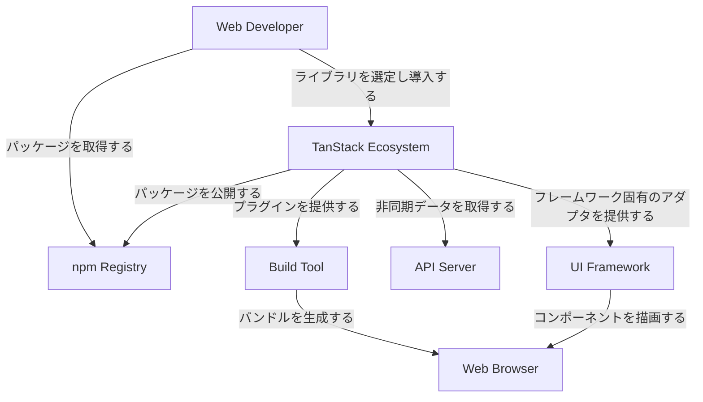
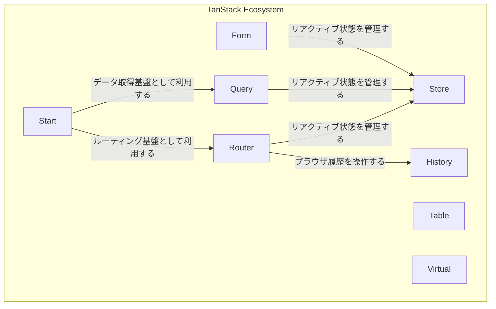
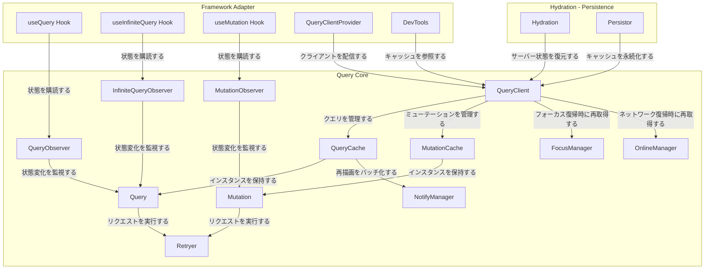
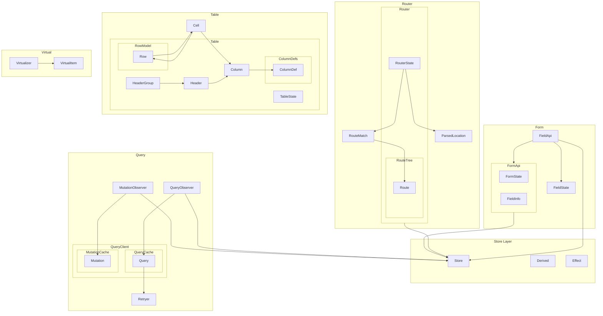

## 概要

TanStack は、Tanner Linsley 氏が主導するオープンソースプロジェクト群です。ルーティング、状態管理、データフェッチ、テーブル、フォームなど、Web アプリケーション開発に必要な機能をフレームワーク非依存のライブラリとして提供しています。

各ライブラリは「ヘッドレス」設計を採用しており、UI のマークアップを開発者が完全に制御できます。React、Vue、Solid、Svelte、Angular、Lit、Qwik など主要フレームワークに対応しています。

本記事では、TanStack エコシステム全体の構造・データモデル・構築方法・利用方法・運用ノウハウを、図解とコード例を交えて解説します。

### ライブラリ一覧

| ライブラリ | 概要 | GitHub Stars |
|---|---|---|
| **Query** | 非同期状態管理・サーバーステート・データフェッチ | 49k |
| **Table** | ヘッドレスなテーブル・データグリッド構築 | 28k |
| **Router** | 型安全なクライアントファーストルーティング | 14k |
| **Virtual** | 大量要素の仮想化レンダリング | 6.7k |
| **Form** | 型安全なフォーム状態管理 | 6.4k |
| **DB** | リアクティブなクライアントストア | 3.6k |
| **AI** | AI 統合のための型安全 SDK | 2.4k |
| **CLI** | スキャフォールディング・ツーリング CLI | 1.2k |
| **Store** | フレームワーク非依存のリアクティブストア | 802 |
| **Pacer** | デバウンス・スロットル・レートリミット | 666 |
| **Start** | フルスタックフレームワーク - Router ベース | - |
| **Config** | ビルド・バンドル設定ツール | - |
| **DevTools** | 各ライブラリ用デバッグツール | - |

### 対応フレームワーク

| フレームワーク | 対応状況 |
|---|---|
| React | 全ライブラリで対応 |
| Vue | Query, Table, Store 等で対応 |
| Solid | Query, Router, Store, AI 等で対応 |
| Svelte | Query, Table 等で対応 |
| Angular | Form, Store 等で対応 |
| Lit | Form 等で対応 |
| Qwik | 一部ライブラリで対応 |
| Vanilla JS | Store, Pacer 等のコアで利用可能 |

## 特徴

### ヘッドレス UI / フレームワーク非依存設計

- UI のマークアップやスタイリングをライブラリが強制しない
- ロジックのみを提供し、見た目は開発者が完全に制御する
- 既存のデザインシステムやコンポーネントライブラリと容易に統合できる

### TypeScript ファーストの型安全性

全ライブラリが TypeScript で記述されています。

- Router は 100% 型推論によるナビゲーションを実現している
- Form はバリデーションスキーマと連携した型安全なフォーム管理を提供する
- Query はジェネリクスによる型推論でデータの型を自動伝播する

```tsx
// Query の型推論例: queryFn の戻り値型が data に自動伝播する
const { data } = useQuery({
  queryKey: ['user', id],
  queryFn: async (): Promise<User> => {
    const res = await fetch(`/api/users/${id}`)
    return res.json()
  },
})
// data の型は User | undefined と推論される

// Router の型推論例: パスパラメータが型チェックされる
<Link
  to="/users/$userId"
  params={{ userId: '123' }}  // userId: string が必須
/>
```

### Core / Adapter パターン

フレームワーク非依存のコア（ロジック層）と、フレームワーク固有のアダプター（バインディング層）を分離しています。コアに機能を実装し、各フレームワーク向けのアダプターで薄くラップします。新しいフレームワークへの対応はアダプターの追加のみで完了します。

Store がこのパターンの基盤として、他の TanStack ライブラリの内部状態管理に使用されています。

| レイヤー | パッケージ例 | 役割 |
|---|---|---|
| Core | `@tanstack/query-core` | フレームワーク非依存のロジック。状態管理、キャッシュ、リトライ等 |
| Adapter | `@tanstack/react-query` | React 固有のフック - useQuery 等。Core を薄くラップ |
| Adapter | `@tanstack/vue-query` | Vue 固有の Composable - useQuery 等。同じ Core を使用 |
| Adapter | `@tanstack/solid-query` | Solid 固有のプリミティブ。同じ Core を使用 |

### 充実した DevTools

- Query DevTools でキャッシュ状態、クエリのステータス、データの中身をリアルタイムに確認できる
- Router DevTools でルートマッチング、パラメータ、ローダーの状態を可視化できる
- ブラウザの開発者ツールに統合する形式で提供されている

### コミュニティの規模

NPM 累計ダウンロード数は 64 億を超え、GitHub Stars 合計は 120,000 以上に達しています。React エコシステムにおけるデファクトスタンダードの一つと言えます。

| 指標 | 数値 |
|---|---|
| NPM 累計ダウンロード数 | 64 億以上 |
| GitHub Stars 合計 | 120,000 以上 |
| コントリビューター数 | 2,300 以上 |
| GitHub 依存リポジトリ数 | 120 万以上 |
| Discord メンバー数 | 6,300 以上 |
| 採用企業数 | 9,000 社以上 |

## 構造

### システムコンテキスト図

TanStack エコシステムと外部システムの関係を示します。



| 要素名 | 説明 |
|---|---|
| Web Developer | TanStack を利用してアプリケーションを構築する開発者 |
| TanStack Ecosystem | ヘッドレス・型安全・フレームワーク非依存のライブラリ群 |
| npm Registry | パッケージの配布基盤 |
| UI Framework | React, Vue, Solid, Svelte, Angular 等の UI フレームワーク |
| API Server | アプリケーションが通信するバックエンド |
| Build Tool | Vite, Webpack, Rspack 等のバンドラ |
| Web Browser | エンドユーザーがアプリケーションを利用する実行環境 |

### コンテナ図

TanStack エコシステム内部のライブラリ群とその依存関係を示します。



| 要素名 | 説明 |
|---|---|
| Start | フルスタックフレームワーク。SSR、サーバー関数、デプロイ機能を提供 |
| Router | 型安全なクライアントサイドルーター。ファイルベースルーティング、Search Params 管理を担当 |
| Query | 非同期状態管理ライブラリ。サーバーデータの取得・キャッシュ・同期を担当 |
| Table | ヘッドレステーブルライブラリ。ソート・フィルタ・ページネーション等のデータ変換ロジックを提供 |
| Form | ヘッドレスフォームライブラリ。バリデーションとフォーム状態管理を提供 |
| Virtual | 仮想スクロールライブラリ。大量データの効率的な描画を実現 |
| Store | リアクティブ状態管理プリミティブ。シグナルベースの細粒度リアクティビティを提供 |
| History | ブラウザ History API のラッパー。Router の基盤として動作 |

### コンポーネント図

TanStack Query の内部構造を示します。Query はハブ・アンド・スポーク型のアーキテクチャを採用しており、フレームワーク非依存のコアと各フレームワーク向けアダプタで構成されます。



| 要素名 | 説明 |
|---|---|
| useQuery Hook | クエリの状態を購読し、コンポーネントにデータを提供するフレームワーク固有のフック |
| useInfiniteQuery Hook | 無限スクロール向けクエリを購読するフック |
| useMutation Hook | データ変更操作を購読するフック |
| QueryClientProvider | QueryClient をコンポーネントツリーに配信するプロバイダ |
| DevTools | キャッシュ状態を可視化する開発者ツール |
| QueryClient | 全キャッシュ操作の中央ファサード。デフォルトオプションの階層的マージを担当 |
| QueryCache | Query インスタンスを queryHash をキーとする Map で保持するキャッシュ |
| MutationCache | Mutation インスタンスを Set で保持し、スコープ単位で直列実行を制御するキャッシュ |
| Query | データ取得のライフサイクルを管理するステートマシン。pending, success, error の状態遷移を持つ |
| Mutation | データ変更操作のライフサイクルを管理するステートマシン。楽観的更新に対応 |
| QueryObserver | 単一の Query の状態変化を監視し、フレームワークアダプタに通知するオブザーバ |
| InfiniteQueryObserver | QueryObserver を拡張し、ページネーション付きクエリを監視するオブザーバ |
| MutationObserver | Mutation の状態変化を監視するオブザーバ。mutate 呼び出しごとに新しい Mutation を生成 |
| Retryer | リクエストのリトライ・指数バックオフ・キャンセルを制御する実行エンジン |
| FocusManager | ウィンドウフォーカス復帰を検知し、陳腐化したクエリの再取得をトリガ |
| OnlineManager | ネットワーク接続の回復を検知し、一時停止中のクエリを再開 |
| NotifyManager | オブザーバへの通知をバッチ化し、過剰な再描画を抑制 |
| Hydration | SSR でプリフェッチしたサーバー状態をクライアント側の QueryClient に復元する仕組み |
| Persistor | QueryCache の状態を localStorage 等のストレージに永続化・復元する仕組み |

## データ

### 概念モデル

TanStack エコシステム全体のエンティティ関係を示します。



| 要素名 | 説明 |
|---|---|
| Store | フレームワーク非依存のリアクティブ状態コンテナ。TanStack エコシステム全体の基盤 |
| Derived | Store の状態から遅延計算される派生値 |
| Effect | Store や Derived の変更に応じて実行される副作用 |
| QueryClient | Query と Mutation のキャッシュを統合管理するエントリポイント |
| QueryCache | すべての Query インスタンスを保持するキャッシュストア |
| Query | 非同期データ取得のライフサイクルを管理するステートマシン |
| MutationCache | すべての Mutation インスタンスを保持するキャッシュストア |
| Mutation | データ変更操作のライフサイクルを管理するエンティティ |
| QueryObserver | Query の状態変更を購読し、フレームワークアダプタへ通知するブリッジ |
| MutationObserver | Mutation の状態変更を購読し、フレームワークアダプタへ通知するブリッジ |
| Retryer | リトライ制御、指数バックオフ、キャンセル処理を担当するエンティティ |
| Router | ルーティングエンジンの中核。ナビゲーション状態とルートマッチングを管理 |
| RouterState | ナビゲーションの現在状態を保持するオブジェクト |
| RouteTree | Route の階層構造。ルートマッチングのために平坦化される |
| Route | 個別の URL パターンに対応するルート定義 |
| RouteMatch | 現在の URL に一致した Route のインスタンス |
| ParsedLocation | URL をパース済みの構造体。pathname、search、hash を保持 |
| Table | テーブルの中核インスタンス。状態と全機能 API を提供 |
| TableState | テーブルの全機能状態を一元管理するオブジェクト |
| ColumnDef | カラムの定義オブジェクト。アクセサやレンダリングを設定 |
| Column | ColumnDef から生成されたカラムインスタンス |
| RowModel | データ変換パイプラインの出力。フィルタ、ソート、ページネーション適用後の行集合 |
| Row | 個別のデータ行を表すインスタンス。階層構造をサポート |
| Cell | Row と Column の交差点。セル値へのアクセスを提供 |
| HeaderGroup | ヘッダー行のスライス。ネストされたヘッダーレベルを管理 |
| Header | 個別のヘッダーセル。Column と関連付け |
| FormApi | フォーム全体のロジックと状態を管理するコントローラ |
| FormState | フォーム全体のバリデーション状態、送信状態を保持 |
| FieldInfo | フォーム内の全フィールドのメタデータを追跡するレコード |
| FieldApi | 個別フィールドの操作インターフェース。FormApi と連携 |
| FieldState | 個別フィールドの値、エラー、タッチ状態を保持 |
| Virtualizer | 仮想スクロールのコアエンジン。可視範囲の算出とアイテム配置を管理 |
| VirtualItem | 仮想化された個別アイテムの位置とサイズ情報 |

### 情報モデル

主要クラスの属性と関連を示します。

```mermaid
classDiagram
    class Store {
        +TState state
        +TState prevState
        +Set~Listener~ listeners
        +setState(updater) void
        +subscribe(listener) Unsubscribe
    }

    class Derived {
        +TState state
        +mount() void
        +unmount() void
    }

    class QueryClient {
        +QueryCache queryCache
        +MutationCache mutationCache
        +DefaultOptions defaultOptions
        +getQueryCache() QueryCache
        +getMutationCache() MutationCache
        +fetchQuery(options) Promise
        +prefetchQuery(options) Promise
        +invalidateQueries(filters) Promise
    }

    class QueryCache {
        +Map queries
        +build(client, options) Query
        +find(filters) Query
        +findAll(filters) Query[]
        +subscribe(listener) Unsubscribe
    }

    class Query {
        +QueryKey queryKey
        +string queryHash
        +QueryState state
        +QueryObserver[] observers
        +QueryCache cache
        +fetch(options) Promise
        +cancel() void
        +destroy() void
    }

    class QueryState {
        +string status
        +string fetchStatus
        +TData data
        +TError error
        +number dataUpdatedAt
        +number errorUpdatedAt
        +boolean isInvalidated
        +number fetchFailureCount
        +TError fetchFailureReason
    }

    class MutationCache {
        +Map mutations
        +build(client, options) Mutation
        +find(filters) Mutation
        +findAll(filters) Mutation[]
        +subscribe(listener) Unsubscribe
    }

    class Mutation {
        +number mutationId
        +MutationState state
        +MutationOptions options
        +MutationObserver[] observers
        +execute(variables) Promise
    }

    class MutationState {
        +string status
        +TData data
        +TError error
        +TVariables variables
        +number submittedAt
        +boolean isPaused
    }

    class QueryObserver {
        +Query currentQuery
        +QueryResult currentResult
        +QueryOptions options
        +subscribe(listener) Unsubscribe
        +getOptimisticResult() QueryResult
    }

    class Router {
        +Store~RouterState~ __store
        +RouterState state
        +Record routesById
        +Record routesByPath
        +navigate(options) void
        +load() Promise
        +matchRoutes(pathname) RouteMatch[]
    }

    class RouterState {
        +string status
        +boolean isLoading
        +RouteMatch[] matches
        +RouteMatch[] pendingMatches
        +RouteMatch[] cachedMatches
        +ParsedLocation location
    }

    class Route {
        +string path
        +Function loader
        +Function beforeLoad
        +Function component
        +Route[] children
    }

    class RouteMatch {
        +string id
        +string pathname
        +Record params
        +Route route
        +string status
    }

    class ParsedLocation {
        +string pathname
        +TSearch search
        +string hash
        +Record state
    }

    class Table {
        +TableState state
        +ColumnDef[] columnDefs
        +Column[] allColumns
        +Row[] rows
        +HeaderGroup[] headerGroups
        +getRowModel() RowModel
        +getCoreRowModel() RowModel
        +getFilteredRowModel() RowModel
        +getSortedRowModel() RowModel
        +getPaginatedRowModel() RowModel
    }

    class TableState {
        +Record columnVisibility
        +string[] columnOrder
        +ColumnPinningState columnPinning
        +Record columnSizing
        +ColumnFilter[] columnFilters
        +string globalFilter
        +SortingState sorting
        +PaginationState pagination
        +Record rowSelection
        +Record expanded
        +string[] grouping
    }

    class Column {
        +string id
        +Function accessorFn
        +ColumnDef columnDef
        +number depth
        +Column parent
        +Column[] columns
    }

    class ColumnDef {
        +string id
        +string accessorKey
        +Function accessorFn
        +Function header
        +Function cell
        +Function footer
    }

    class Row {
        +string id
        +TData original
        +number index
        +number depth
        +Row[] subRows
        +string parentId
        +Cell[] allCells
        +getValue(columnId) any
    }

    class Cell {
        +string id
        +Row row
        +Column column
        +getValue() any
        +renderValue() any
    }

    class FormApi {
        +Store baseStore
        +Record fieldInfo
        +FormState state
        +FormOptions options
        +validateForm() Promise
        +handleSubmit() Promise
        +reset() void
    }

    class FormState {
        +boolean isValid
        +boolean isSubmitting
        +boolean isSubmitted
        +boolean isDirty
        +boolean isTouched
        +number submitCount
        +ValidationError[] errors
    }

    class FieldApi {
        +FormApi form
        +string name
        +Store store
        +FieldState state
        +setValue(value) void
        +handleChange(value) void
        +handleBlur() void
        +validate() Promise
    }

    class FieldState {
        +TValue value
        +ValidationError[] errors
        +boolean isTouched
        +boolean isDirty
        +boolean isValidating
    }

    class Virtualizer {
        +VirtualizerOptions options
        +VirtualItem[] virtualItems
        +number totalSize
        +scrollToIndex(index) void
        +scrollToOffset(offset) void
        +measure() void
    }

    class VirtualItem {
        +number index
        +number start
        +number end
        +number size
        +number lane
        +string key
    }

    Store <-- Derived : depends on
    QueryClient *-- QueryCache
    QueryClient *-- MutationCache
    QueryCache *-- Query
    MutationCache *-- Mutation
    Query *-- QueryState
    Mutation *-- MutationState
    QueryObserver --> Query : subscribes
    QueryObserver --> Store : uses
    Router *-- RouterState
    Router --> Store : uses
    RouterState *-- RouteMatch
    RouterState *-- ParsedLocation
    RouteMatch --> Route
    Table *-- TableState
    Table *-- Column
    Table *-- Row
    Column --> ColumnDef
    Row *-- Cell
    Cell --> Column
    Cell --> Row
    FormApi --> Store : uses
    FormApi *-- FormState
    FieldApi --> FormApi
    FieldApi --> Store : uses
    FieldApi *-- FieldState
    Virtualizer *-- VirtualItem
```



| 要素名 | 説明 |
|---|---|
| Store | 汎用リアクティブ状態コンテナ。state、prevState を保持し、setState で不変更新、subscribe でリスナー登録を実行 |
| Derived | Store に依存する遅延計算値。mount/unmount でライフサイクルを管理 |
| QueryClient | QueryCache と MutationCache を所有。fetchQuery、invalidateQueries 等の操作 API を提供 |
| QueryCache | Query インスタンスの Map を管理。build で Query を生成または再利用 |
| Query | queryKey で一意に識別。QueryState をステートマシンとして管理し、Retryer 経由でフェッチを実行 |
| QueryState | status は pending、success、error の 3 状態。fetchStatus は idle、fetching、paused の 3 状態。dataUpdatedAt でキャッシュ鮮度を追跡 |
| MutationCache | Mutation インスタンスの Map を管理 |
| Mutation | mutationId で一意に識別。variables と data のペアで変更操作を追跡 |
| MutationState | status、data、error に加え、submittedAt で実行時刻、isPaused で一時停止状態を保持 |
| QueryObserver | Query の状態を購読し、フレームワーク向けの正規化された QueryResult を生成 |
| Router | Store ベースの RouterState を保持。routesById、routesByPath で O-1 ルート検索を実行 |
| RouterState | status は pending と idle の 2 状態。matches は現在のルート階層、location は現在の URL 情報 |
| Route | path で URL パターンを定義。loader でデータ取得、beforeLoad で事前処理を実行 |
| RouteMatch | pathname と params を保持する、Route と URL の一致結果 |
| ParsedLocation | URL を pathname、search、hash、state に分解した構造体 |
| Table | TableState で全機能状態を一元管理。データ変換パイプラインとして複数の RowModel 取得メソッドを提供 |
| TableState | ソート、フィルタ、ページネーション、行選択、カラム表示等の全機能状態を保持 |
| Column | ColumnDef から生成。depth と parent でカラムの階層を表現 |
| ColumnDef | accessorKey または accessorFn でデータ抽出方法を定義。header、cell、footer でレンダリングを設定 |
| Row | original で元データへの参照を保持。subRows と parentId で階層構造をサポート |
| Cell | Row と Column の交差点。getValue で型安全な値取得を実行 |
| FormApi | Store ベースの baseStore でフォーム状態を管理。fieldInfo で全フィールドのメタデータを追跡 |
| FormState | isValid、isSubmitting、isDirty 等のフォーム全体の状態を集約 |
| FieldApi | FormApi への参照を保持。個別の Store でフィールドごとの粒度でリアクティブ更新を実行 |
| FieldState | value、errors、isTouched、isDirty でフィールド単位の状態を管理 |
| Virtualizer | 仮想スクロールのコア。totalSize で全体サイズを算出し、virtualItems で可視アイテムを提供 |
| VirtualItem | index、start、end、size で仮想アイテムの位置とサイズを管理 |

## 構築方法

### TanStack Query のインストールと基本セットアップ - React

パッケージをインストールします。

```bash
npm install @tanstack/react-query
# DevTools - 任意
npm install @tanstack/react-query-devtools
```

`QueryClient` を作成し、`QueryClientProvider` でアプリケーション全体をラップします。

```tsx
import { QueryClient, QueryClientProvider } from '@tanstack/react-query'

const queryClient = new QueryClient()

function App() {
  return (
    <QueryClientProvider client={queryClient}>
      <MyApp />
    </QueryClientProvider>
  )
}
```

`QueryClient` はアプリ全体のキャッシュとクエリ設定を管理します。

### TanStack Table のインストールと基本セットアップ - React

パッケージをインストールします。

```bash
npm install @tanstack/react-table
```

`useReactTable` フックでテーブルインスタンスを作成します。必要な Row Model をインポートして設定します。

```tsx
import {
  useReactTable,
  getCoreRowModel,
  flexRender,
  ColumnDef,
} from '@tanstack/react-table'

const columns: ColumnDef<Person>[] = [
  { accessorKey: 'name', header: '名前' },
  { accessorKey: 'age', header: '年齢' },
]

function MyTable({ data }: { data: Person[] }) {
  const table = useReactTable({
    data,
    columns,
    getCoreRowModel: getCoreRowModel(),
  })
  // テーブルの描画は table.getHeaderGroups() / table.getRowModel() を使用
}
```

TanStack Table はヘッドレス UI のため、描画は開発者が自由に実装します。

### TanStack Router のインストールと基本セットアップ

前提条件: React 18.x 以上、TypeScript 5.3 以上（推奨）

パッケージをインストールします。

```bash
npm install @tanstack/react-router
npm install -D @tanstack/router-plugin @tanstack/router-devtools
```

Vite プラグインを設定します。

```ts
// vite.config.ts
import { defineConfig } from 'vite'
import react from '@vitejs/plugin-react'
import { TanStackRouterVite } from '@tanstack/router-plugin/vite'

export default defineConfig({
  plugins: [
    TanStackRouterVite({ autoCodeSplitting: true }),
    react(),
  ],
})
```

ファイルベースルーティング（推奨）を使用する場合、`src/routes/` ディレクトリにルートファイルを配置します。CLI ツールで新規プロジェクトを作成する方法もあります。

```bash
npx create-tsrouter-app my-app
```

### TanStack Form のインストールと基本セットアップ

パッケージをインストールします。

```bash
npm install @tanstack/react-form
```

`useForm` フックでフォームインスタンスを作成します。

```tsx
import { useForm } from '@tanstack/react-form'

function MyForm() {
  const form = useForm({
    defaultValues: { name: '', email: '' },
    onSubmit: async ({ value }) => {
      console.log(value)
    },
  })

  return (
    <form
      onSubmit={(e) => {
        e.preventDefault()
        form.handleSubmit()
      }}
    >
      <form.Field
        name="name"
        children={(field) => (
          <input
            value={field.state.value}
            onChange={(e) => field.handleChange(e.target.value)}
          />
        )}
      />
      <button type="submit">送信</button>
    </form>
  )
}
```

特別なプロバイダー設定は不要で、すぐに利用を開始できます。

### TanStack Start のプロジェクト作成

CLI で新規プロジェクトを作成します。

```bash
npm create @tanstack/start@latest
# または
pnpm create @tanstack/start@latest
```

CLI がプロジェクト名、Tailwind CSS、ESLint などのオプションを対話的に確認します。既存の例をクローンして開始する方法もあります。

```bash
npx gitpick TanStack/router/tree/main/examples/react/start-basic start-basic
cd start-basic && npm install && npm run dev
```

TanStack Start は TanStack Router をベースとしたフルスタックフレームワークです。サーバーサイドレンダリング、データローダー、サーバーファンクションを標準サポートしています。

## 利用方法

### Query: 基本的なデータフェッチ

`useQuery` フックでデータを取得します。`queryKey` でキャッシュを識別し、`queryFn` でデータ取得関数を指定します。

```tsx
import { useQuery } from '@tanstack/react-query'

function UserList() {
  const { data, isPending, error } = useQuery({
    queryKey: ['users'],
    queryFn: () =>
      fetch('/api/users').then((res) => res.json()),
  })

  if (isPending) return <p>読み込み中...</p>
  if (error) return <p>エラー: {error.message}</p>

  return (
    <ul>
      {data.map((user) => (
        <li key={user.id}>{user.name}</li>
      ))}
    </ul>
  )
}
```

| プロパティ | 説明 |
|---|---|
| `data` | 取得したデータ |
| `isPending` | 初回読み込み中かどうか |
| `error` | エラーオブジェクト |
| `isFetching` | バックグラウンドで再取得中かどうか |

### Query: Mutation

`useMutation` フックでデータの作成・更新・削除を行います。`onSuccess` コールバックでキャッシュを無効化し、最新データを再取得します。

```tsx
import { useMutation, useQueryClient } from '@tanstack/react-query'

function AddUser() {
  const queryClient = useQueryClient()

  const mutation = useMutation({
    mutationFn: (newUser: { name: string }) =>
      fetch('/api/users', {
        method: 'POST',
        body: JSON.stringify(newUser),
      }),
    onSuccess: () => {
      queryClient.invalidateQueries({ queryKey: ['users'] })
    },
  })

  return (
    <button onClick={() => mutation.mutate({ name: 'New User' })}>
      ユーザーを追加
    </button>
  )
}
```

### Query: Infinite Query

`useInfiniteQuery` フックで無限スクロールやページネーションを実装します。`getNextPageParam` で次ページの判定ロジックを定義します。

```tsx
import { useInfiniteQuery } from '@tanstack/react-query'

function InfiniteList() {
  const {
    data,
    fetchNextPage,
    hasNextPage,
    isFetchingNextPage,
  } = useInfiniteQuery({
    queryKey: ['items'],
    queryFn: ({ pageParam = 0 }) =>
      fetch(`/api/items?cursor=${pageParam}`).then((res) => res.json()),
    initialPageParam: 0,
    getNextPageParam: (lastPage) => lastPage.nextCursor ?? undefined,
  })

  return (
    <div>
      {data?.pages.map((page) =>
        page.items.map((item) => <div key={item.id}>{item.name}</div>)
      )}
      <button
        onClick={() => fetchNextPage()}
        disabled={!hasNextPage || isFetchingNextPage}
      >
        {isFetchingNextPage ? '読み込み中...' : 'さらに読み込む'}
      </button>
    </div>
  )
}
```

### Table: テーブル定義

`ColumnDef` 型でカラムを定義します。`accessorKey` でデータのプロパティ名を指定します。`accessorFn` で加工した値をカラムに表示します。

```tsx
const columns: ColumnDef<Person>[] = [
  {
    accessorKey: 'firstName',
    header: '名',
    cell: (info) => info.getValue(),
  },
  {
    accessorFn: (row) => `${row.firstName} ${row.lastName}`,
    id: 'fullName',
    header: 'フルネーム',
  },
]
```

### Table: ソート

`getSortedRowModel` を追加します。ヘッダークリックでソートを切り替えます。

```tsx
import { getSortedRowModel } from '@tanstack/react-table'

const table = useReactTable({
  data,
  columns,
  getCoreRowModel: getCoreRowModel(),
  getSortedRowModel: getSortedRowModel(),
})

// ヘッダーの描画
<th
  onClick={header.column.getToggleSortingHandler()}
  style={{ cursor: 'pointer' }}
>
  {flexRender(header.column.columnDef.header, header.getContext())}
  {{ asc: ' ↑', desc: ' ↓' }[header.column.getIsSorted() as string] ?? ''}
</th>
```

### Table: フィルタリング

`getFilteredRowModel` を追加します。カラムフィルター状態を管理します。

```tsx
import { getFilteredRowModel, ColumnFiltersState } from '@tanstack/react-table'

const [columnFilters, setColumnFilters] = useState<ColumnFiltersState>([])

const table = useReactTable({
  data,
  columns,
  state: { columnFilters },
  onColumnFiltersChange: setColumnFilters,
  getCoreRowModel: getCoreRowModel(),
  getFilteredRowModel: getFilteredRowModel(),
})

// フィルター入力
<input
  value={(table.getColumn('name')?.getFilterValue() as string) ?? ''}
  onChange={(e) => table.getColumn('name')?.setFilterValue(e.target.value)}
  placeholder="名前で検索"
/>
```

### Table: ページネーション

`getPaginationRowModel` を追加します。ページ状態を管理し、ナビゲーションボタンを設置します。

```tsx
import { getPaginationRowModel, PaginationState } from '@tanstack/react-table'

const [pagination, setPagination] = useState<PaginationState>({
  pageIndex: 0,
  pageSize: 10,
})

const table = useReactTable({
  data,
  columns,
  state: { pagination },
  onPaginationChange: setPagination,
  getCoreRowModel: getCoreRowModel(),
  getPaginationRowModel: getPaginationRowModel(),
})

// ページネーション UI
<div>
  <button onClick={() => table.firstPage()} disabled={!table.getCanPreviousPage()}>{'<<'}</button>
  <button onClick={() => table.previousPage()} disabled={!table.getCanPreviousPage()}>{'<'}</button>
  <button onClick={() => table.nextPage()} disabled={!table.getCanNextPage()}>{'>'}</button>
  <button onClick={() => table.lastPage()} disabled={!table.getCanNextPage()}>{'>>'}</button>
  <span>ページ {table.getState().pagination.pageIndex + 1} / {table.getPageCount()}</span>
</div>
```

### Router: ルート定義

ファイルベースルーティングでは `src/routes/` にファイルを配置します。`createFileRoute` でルートを定義します。

| ファイルパス | URL パス |
|---|---|
| `src/routes/index.tsx` | `/` |
| `src/routes/about.tsx` | `/about` |
| `src/routes/users/$userId.tsx` | `/users/:userId` |
| `src/routes/posts/index.tsx` | `/posts` |

```tsx
// src/routes/index.tsx
import { createFileRoute } from '@tanstack/react-router'

export const Route = createFileRoute('/')({
  component: IndexPage,
})

function IndexPage() {
  return <h1>ホーム</h1>
}
```

### Router: 型安全なナビゲーション

`Link` コンポーネントで型安全なナビゲーションを実現します。存在するルートのみが `to` プロパティのオートコンプリートに表示されます。

```tsx
import { Link } from '@tanstack/react-router'

function Navigation() {
  return (
    <nav>
      <Link to="/" activeProps={{ style: { fontWeight: 'bold' } }}>
        ホーム
      </Link>
      <Link to="/users/$userId" params={{ userId: '123' }}>
        ユーザー詳細
      </Link>
    </nav>
  )
}
```

動的パラメータも型チェックされます。型登録により、ルーター全体の型安全性を確保します。

```tsx
declare module '@tanstack/react-router' {
  interface Register {
    router: typeof router
  }
}
```

### Router: データローダー

`loader` オプションでルートのデータを事前取得します。`useLoaderData` でコンポーネント内からデータにアクセスします。

```tsx
// src/routes/users/$userId.tsx
import { createFileRoute } from '@tanstack/react-router'

export const Route = createFileRoute('/users/$userId')({
  loader: async ({ params }) => {
    const res = await fetch(`/api/users/${params.userId}`)
    return res.json()
  },
  component: UserDetail,
})

function UserDetail() {
  const user = Route.useLoaderData()
  return <h1>{user.name}</h1>
}
```

ローダーはルート遷移前に実行されます。`abortController` でルート離脱時のリクエストキャンセルが可能です。

### Form: フォーム定義

`useForm` でフォームインスタンスを作成します。`form.Field` でフィールドを定義します。

```tsx
import { useForm } from '@tanstack/react-form'

function ContactForm() {
  const form = useForm({
    defaultValues: {
      name: '',
      email: '',
      message: '',
    },
    onSubmit: async ({ value }) => {
      await fetch('/api/contact', {
        method: 'POST',
        body: JSON.stringify(value),
      })
    },
  })

  return (
    <form onSubmit={(e) => { e.preventDefault(); form.handleSubmit() }}>
      <form.Field
        name="name"
        children={(field) => (
          <div>
            <label>名前</label>
            <input
              value={field.state.value}
              onChange={(e) => field.handleChange(e.target.value)}
            />
          </div>
        )}
      />
      <form.Field
        name="email"
        children={(field) => (
          <div>
            <label>メール</label>
            <input
              value={field.state.value}
              onChange={(e) => field.handleChange(e.target.value)}
            />
          </div>
        )}
      />
      <button type="submit">送信</button>
    </form>
  )
}
```

### Form: バリデーション

フィールドレベルとフォームレベルの両方でバリデーションを定義できます。`onChange`、`onBlur`、`onSubmit` でバリデーションタイミングを制御します。Zod、Yup、Valibot のアダプターも利用可能です。

```tsx
<form.Field
  name="email"
  validators={{
    onChange: ({ value }) => {
      if (!value.includes('@')) return 'メールアドレスの形式が正しくありません'
      return undefined
    },
    onBlur: ({ value }) => {
      if (value.length < 5) return '5文字以上で入力してください'
      return undefined
    },
  }}
  children={(field) => (
    <div>
      <input
        value={field.state.value}
        onChange={(e) => field.handleChange(e.target.value)}
        onBlur={field.handleBlur}
      />
      {field.state.meta.errors.length > 0 && (
        <p style={{ color: 'red' }}>{field.state.meta.errors.join(', ')}</p>
      )}
    </div>
  )}
/>
```

非同期バリデーションも `onChangeAsync` で対応します。

```tsx
validators={{
  onChangeAsync: async ({ value }) => {
    const exists = await checkEmailExists(value)
    if (exists) return 'このメールアドレスは既に登録されています'
    return undefined
  },
  onChangeAsyncDebounceMs: 500,
}}
```

### Store: 状態管理の基本

`@tanstack/store` と `@tanstack/react-store` をインストールします。

```bash
npm install @tanstack/store @tanstack/react-store
```

`Store` クラスでストアを作成します。`useStore` フックでセレクタを通じて状態を読み取ります。

```tsx
import { Store } from '@tanstack/store'
import { useStore } from '@tanstack/react-store'

// コンポーネント外でストアを作成
const countStore = new Store({ count: 0, label: 'カウンター' })

function Counter() {
  // セレクタで必要な値のみ購読 - count が変わった時だけ再レンダリング
  const count = useStore(countStore, (state) => state.count)

  return (
    <div>
      <p>カウント: {count}</p>
      <button
        onClick={() =>
          countStore.setState((state) => ({
            ...state,
            count: state.count + 1,
          }))
        }
      >
        +1
      </button>
    </div>
  )
}
```

| 特徴 | 説明 |
|---|---|
| バンドルサイズ | 約 2KB |
| 再レンダリング | セレクタで購読した値が変更された場合のみ |
| フレームワーク対応 | React、Vue、Solid、Vanilla JS |
| プロバイダー | 不要 |

## 運用

### TanStack Query DevTools の導入と活用

パッケージをインストールします。

```bash
npm install @tanstack/react-query-devtools
```

アプリのルート近くに配置します。

```tsx
import { ReactQueryDevtools } from '@tanstack/react-query-devtools'

function App() {
  return (
    <QueryClientProvider client={queryClient}>
      <YourApp />
      <ReactQueryDevtools initialIsOpen={false} />
    </QueryClientProvider>
  )
}
```

画面隅にトグルボタンが表示され、開閉状態は localStorage に保持されます。Embedded Mode では `ReactQueryDevtoolsPanel` を任意の場所に埋め込めます。

| オプション | 型 | 説明 |
|---|---|---|
| `initialIsOpen` | `boolean` | 初期表示時に開くか |
| `buttonPosition` | `string` | トグルボタンの位置 |
| `client` | `QueryClient` | カスタム QueryClient の指定 |
| `errorTypes` | `Array` | エラーシミュレーション用の定義 |
| `styleNonce` | `string` | CSP nonce の指定 |

本番環境では `process.env.NODE_ENV === 'development'` の場合のみバンドルに含まれます。

### TanStack Router DevTools の導入と活用

パッケージをインストールします。

```bash
npm install @tanstack/react-router-devtools
```

ルートルート内にレンダリングすると、自動的にルーターインスタンスに接続されます。

```tsx
import { TanStackRouterDevtools } from '@tanstack/react-router-devtools'

function RootComponent() {
  return (
    <>
      <Outlet />
      <TanStackRouterDevtools />
    </>
  )
}
```

ルーター状態のリアルタイム監視、ルートマッチング情報の確認、ナビゲーション履歴の追跡が可能です。本番ビルドには含まれません。

### TanStack Table DevTools の導入と活用

パッケージをインストールします。

```bash
npm install @tanstack/react-table-devtools
```

統合 DevTools（アルファ版）は Solid.js で構築され、軽量なパフォーマンスを実現しています。

```bash
npm install @tanstack/devtools
```

```tsx
import { TanStackDevtools } from '@tanstack/devtools'

function App() {
  return (
    <>
      <YourApp />
      <TanStackDevtools />
    </>
  )
}
```

複数の TanStack ライブラリの DevTools を一元管理できます。

### キャッシュの監視・管理

| 設定 | デフォルト値 | 説明 |
|---|---|---|
| `staleTime` | `0` | データが「古い - stale」と判定されるまでの時間 |
| `gcTime` | `5分` | 未使用キャッシュがガベージコレクションされるまでの時間 |

キャッシュの手動操作は以下の通りです。

```tsx
const queryClient = useQueryClient()

// 特定クエリの無効化 - 再フェッチをトリガー
queryClient.invalidateQueries({ queryKey: ['todos'] })

// キャッシュデータの直接更新
queryClient.setQueryData(['todo', id], updatedTodo)

// キャッシュデータの取得
const cachedData = queryClient.getQueryData(['todos'])

// 特定クエリの削除
queryClient.removeQueries({ queryKey: ['todos'] })

// 全キャッシュのクリア
queryClient.clear()
```

`persistQueryClient` プラグインで localStorage 等に永続化できます。`gcTime` を永続化の `maxAge` 以上に設定します。

```tsx
const queryClient = new QueryClient({
  defaultOptions: {
    queries: {
      gcTime: 1000 * 60 * 60 * 24, // 24時間
    },
  },
})
```

### SSR / Hydration の運用

基本的な流れは以下の通りです。

1. サーバーサイドで QueryClient を作成し、データをプリフェッチする
2. `dehydrate` でクエリ状態をシリアライズする
3. クライアントサイドで `hydrate` により状態を復元する

React（Next.js）での実装パターンです。

```tsx
// サーバーサイド
import { dehydrate, QueryClient } from '@tanstack/react-query'

export async function getServerSideProps() {
  const queryClient = new QueryClient()
  await queryClient.prefetchQuery({
    queryKey: ['todos'],
    queryFn: fetchTodos,
  })
  return {
    props: {
      dehydratedState: dehydrate(queryClient),
    },
  }
}
```

```tsx
// クライアントサイド
import { HydrationBoundary } from '@tanstack/react-query'

function App({ dehydratedState }) {
  return (
    <QueryClientProvider client={queryClient}>
      <HydrationBoundary state={dehydratedState}>
        <YourApp />
      </HydrationBoundary>
    </QueryClientProvider>
  )
}
```

SSR 運用のポイントは以下の通りです。

- リクエストごとに新しい QueryClient を生成する（ユーザー間のデータ共有を防止）
- `staleTime` を適切に設定し、ハイドレーション直後の不要な再フェッチを防止する

### バージョンアップ・マイグレーション戦略

| 変更内容 | v4 | v5 |
|---|---|---|
| ステータス名 | `loading` | `pending` |
| フラグ名 | `isLoading` | `isPending` |
| キャッシュ時間の設定名 | `cacheTime` | `gcTime` |
| 前データ保持 | `keepPreviousData` | `placeholderData` + `keepPreviousData` ユーティリティ |
| コールバック | `onSuccess/onError/onSettled` - useQuery | 削除 - useMutation のみ維持 |
| API 引数 | オーバーロード形式 | 単一オブジェクト形式 |
| React 要件 | React 16.8+ | React 18.0+ |

マイグレーション手順は以下の通りです。

1. 公式マイグレーションガイドを確認する
2. codemod を活用して機械的に変更する（`npx jscodeshift`）
3. 段階的に移行する（一括置換は避ける）
4. TypeScript 4.7 以上にアップグレードする
5. テストを実行し、動作を確認する

## ベストプラクティス

### Query Key の設計パターン

階層構造で設計します。

```typescript
// Query Key Factory パターン
const todoKeys = {
  all:     ['todos'] as const,
  lists:   ()  => [...todoKeys.all, 'list'] as const,
  list:    (filters: Filters) => [...todoKeys.lists(), filters] as const,
  details: ()  => [...todoKeys.all, 'detail'] as const,
  detail:  (id: number) => [...todoKeys.details(), id] as const,
}

// 使用例
useQuery({ queryKey: todoKeys.detail(1), queryFn: () => fetchTodo(1) })

// 関連キャッシュの一括無効化
queryClient.invalidateQueries({ queryKey: todoKeys.lists() })
```

設計原則は以下の通りです。

- エンティティ名をプレフィクスにする（例: `['todos']`, `['users']`）
- 絞り込み条件はオブジェクトで追加する（例: `['todos', { status: 'done' }]`）
- ID はプリミティブ値で指定する（例: `['todo', 1]`）
- Query Key Factory でキー生成を一元管理する

### キャッシュ戦略の選び方 - staleTime, gcTime

| ユースケース | staleTime | gcTime | 理由 |
|---|---|---|---|
| リアルタイム性が必要 - チャット等 | `0` | `5分` | 常に最新データを取得 |
| 頻繁に変わるリスト - TODO 等 | `30秒〜1分` | `5分` | 適度にキャッシュしつつ鮮度を保持 |
| ほぼ静的なデータ - 設定、マスタ等 | `30分〜1時間` | `24時間` | 不要なリクエストを削減 |
| 完全に静的なデータ | `Infinity` | `Infinity` | 再フェッチを完全に防止 |

- `staleTime` はデータの「鮮度の許容範囲」で決定する
- `gcTime` は `staleTime` 以上に設定する
- グローバルデフォルトを設定し、個別クエリで上書きする

```typescript
const queryClient = new QueryClient({
  defaultOptions: {
    queries: {
      staleTime: 1000 * 60,     // 1分
      gcTime: 1000 * 60 * 5,    // 5分
    },
  },
})
```

### エラーハンドリングのパターン

個別クエリでのハンドリングです。

```tsx
const { data, error, isError } = useQuery({
  queryKey: ['todos'],
  queryFn: fetchTodos,
  retry: 3,
  retryDelay: (attemptIndex) => Math.min(1000 * 2 ** attemptIndex, 30000),
})

if (isError) return <div>Error: {error.message}</div>
```

グローバルエラーハンドリングです。

```typescript
const queryClient = new QueryClient({
  queryCache: new QueryCache({
    onError: (error, query) => {
      if (query.state.data !== undefined) {
        toast.error(`データ更新に失敗しました: ${error.message}`)
      }
    },
  }),
  mutationCache: new MutationCache({
    onError: (error) => {
      toast.error(`操作に失敗しました: ${error.message}`)
    },
  }),
})
```

Error Boundary との組み合わせです。

```tsx
import { QueryErrorResetBoundary } from '@tanstack/react-query'
import { ErrorBoundary } from 'react-error-boundary'

function App() {
  return (
    <QueryErrorResetBoundary>
      {({ reset }) => (
        <ErrorBoundary onReset={reset} fallbackRender={({ resetErrorBoundary }) => (
          <div>
            <p>エラーが発生しました</p>
            <button onClick={resetErrorBoundary}>再試行</button>
          </div>
        )}>
          <Todos />
        </ErrorBoundary>
      )}
    </QueryErrorResetBoundary>
  )
}
```

### テストの書き方 - Testing Library との組み合わせ

テストごとに独立した QueryClient を作成します。リトライを無効化してテストの安定性を確保します。

```typescript
import { renderHook, waitFor } from '@testing-library/react'
import { QueryClient, QueryClientProvider } from '@tanstack/react-query'

function createTestQueryClient() {
  return new QueryClient({
    defaultOptions: {
      queries: { retry: false },
    },
  })
}

function createWrapper() {
  const queryClient = createTestQueryClient()
  return ({ children }) => (
    <QueryClientProvider client={queryClient}>
      {children}
    </QueryClientProvider>
  )
}
```

カスタムフックのテストです。

```typescript
test('useCustomHook returns data', async () => {
  const { result } = renderHook(() => useCustomHook(), {
    wrapper: createWrapper(),
  })

  await waitFor(() => expect(result.current.isSuccess).toBe(true))
  expect(result.current.data).toEqual('Hello')
})
```

API モックとの組み合わせ（MSW）です。

```typescript
import { http, HttpResponse } from 'msw'
import { setupServer } from 'msw/node'

const server = setupServer(
  http.get('/api/todos', () => {
    return HttpResponse.json([{ id: 1, title: 'Test' }])
  })
)

beforeAll(() => server.listen())
afterEach(() => server.resetHandlers())
afterAll(() => server.close())

test('useTodos fetches data', async () => {
  const { result } = renderHook(() => useTodos(), {
    wrapper: createWrapper(),
  })
  await waitFor(() => expect(result.current.isSuccess).toBe(true))
  expect(result.current.data).toHaveLength(1)
})
```

テスト間のキャッシュ汚染を防ぐため、テストごとに新しい QueryClient を作成します。

### パフォーマンス最適化 - select, structural sharing, placeholderData

`select` による必要データの絞り込みです。

```typescript
const { data: todoCount } = useQuery({
  queryKey: ['todos'],
  queryFn: fetchTodos,
  select: (data) => data.length,
})
```

Structural Sharing は、変更されていないデータの参照を維持し、不要な再レンダリングを防ぎます。

```typescript
// 大規模データで構造共有を無効化
useQuery({
  queryKey: ['large-dataset'],
  queryFn: fetchLargeData,
  structuralSharing: false,
})
```

`placeholderData` による UX 向上です。

```typescript
// リストキャッシュから詳細画面の仮データを提供
useQuery({
  queryKey: ['todo', id],
  queryFn: () => fetchTodo(id),
  placeholderData: () => {
    return queryClient
      .getQueryData(['todos'])
      ?.find((todo) => todo.id === id)
  },
})

// 前回データの保持 - v5
import { keepPreviousData } from '@tanstack/react-query'

useQuery({
  queryKey: ['todos', page],
  queryFn: () => fetchTodos(page),
  placeholderData: keepPreviousData,
})
```

- `notifyOnChangeProps: ['data', 'error']` で監視対象のプロパティを限定する
- `enabled: false` で条件付きクエリを実装し、不要なリクエストを防止する

## トラブルシューティング

### よくあるエラーとその対処法

- **「No QueryClient set」エラー**
  - 原因: `QueryClientProvider` がコンポーネントツリーの上位に設定されていない
  - 対処: アプリのルートに `QueryClientProvider` を配置する

- **「Missing queryFn」エラー**
  - 原因: `useQuery` に `queryFn` が渡されていない
  - 対処: `queryFn` を明示的に指定する（v5 では `defaultOptions` での省略が不可）

- **データが `undefined` のままになる**
  - 原因: `enabled: false` の設定、または queryFn の戻り値が `undefined`
  - 対処: `enabled` の条件を確認する。queryFn は必ず値を返す

### キャッシュ不整合の解決方法

**ミューテーション後にリストが更新されない**

原因: ミューテーション後のキャッシュ無効化が不足しています。`onSuccess` で関連クエリを無効化します。

```typescript
const mutation = useMutation({
  mutationFn: updateTodo,
  onSuccess: () => {
    queryClient.invalidateQueries({ queryKey: ['todos'] })
  },
})
```

**楽観的更新の不整合**

原因: ロールバック処理が不完全です。`onMutate` でスナップショットを保存し、`onError` で復元します。

```typescript
useMutation({
  mutationFn: updateTodo,
  onMutate: async (newTodo) => {
    await queryClient.cancelQueries({ queryKey: ['todos'] })
    const previous = queryClient.getQueryData(['todos'])
    queryClient.setQueryData(['todos'], (old) =>
      old.map((t) => (t.id === newTodo.id ? newTodo : t))
    )
    return { previous }
  },
  onError: (_err, _newTodo, context) => {
    queryClient.setQueryData(['todos'], context.previous)
  },
  onSettled: () => {
    queryClient.invalidateQueries({ queryKey: ['todos'] })
  },
})
```

**無限クエリのキャッシュ不整合**

- `maxPages` オプションでキャッシュページ数を制限する
- `refetchPage` で特定ページのみ再フェッチする

### 無限ループ・過剰リフェッチの対処

**コンポーネントが無限にリフェッチする**

原因1: `queryKey` にレンダーごとに新しいオブジェクト参照が含まれています。`useMemo` でキーオブジェクトを安定化します。

```typescript
// NG: レンダーごとに新しい参照が生成される
useQuery({ queryKey: ['todos', { filter }], ... })

// OK: useMemo で安定化する - filter がプリミティブ値ならそのままでよい
const stableFilter = useMemo(() => ({ status, sort }), [status, sort])
useQuery({ queryKey: ['todos', stableFilter], ... })
```

原因2: `queryFn` 内で状態を更新し、再レンダリングを引き起こしています。

原因3: `staleTime: 0`（デフォルト）で、ウィンドウフォーカス時に再フェッチが走ります。`staleTime` を適切に設定します。

**ミューテーション後に同じクエリが複数回フェッチされる**

原因: `invalidateQueries` が広範囲のキーにマッチしています。`queryKey` をより具体的に指定するか、`exact: true` オプションを使用します。

```typescript
// 広範囲マッチ
queryClient.invalidateQueries({ queryKey: ['todos'] })

// 完全一致のみ無効化
queryClient.invalidateQueries({ queryKey: ['todos'], exact: true })
```

### TypeScript の型エラー対処

**エラー型の推論が `Error` になる**

Register インターフェースでグローバルエラー型を登録します。

```typescript
declare module '@tanstack/react-query' {
  interface Register {
    defaultError: AxiosError<ApiError>
  }
}
```

**`getQueryData` の戻り値が `unknown` になる**

ジェネリクスで型を指定します。

```typescript
const data = queryClient.getQueryData<Todo[]>(['todos'])
```

**`tsconfig.json` の推奨設定**

```json
{
  "compilerOptions": {
    "moduleResolution": "bundler",
    "strict": true
  }
}
```

## まとめ

TanStack は、ヘッドレス設計・TypeScript ファースト・フレームワーク非依存の Core/Adapter パターンにより、React をはじめとする複数フレームワークで一貫した開発体験を提供するライブラリ群です。Query によるサーバー状態管理、Router による型安全なルーティング、Table・Form・Virtual 等の UI ロジックまで、Web アプリケーション開発の主要な課題を網羅しています。特に Query Key Factory パターンやキャッシュ戦略の選定指針は、実際のプロジェクトですぐに活用できるはずです。

この記事が少しでも参考になった、あるいは改善点などがあれば、ぜひリアクションやコメント、SNSでのシェアをいただけると励みになります！

## 参考リンク

- 公式ドキュメント
  - [TanStack 公式サイト](https://tanstack.com/)
  - [TanStack Query Overview](https://tanstack.com/query/latest/docs/framework/react/overview)
  - [TanStack Query Core Concepts](https://tanstack.com/query/latest/docs/framework/react/guides/queries)
  - [TanStack Query Mutations Guide](https://tanstack.com/query/latest/docs/framework/react/guides/mutations)
  - [TanStack Query Infinite Queries](https://tanstack.com/query/latest/docs/framework/react/guides/infinite-queries)
  - [TanStack Query Installation](https://tanstack.com/query/latest/docs/framework/react/installation)
  - [TanStack Query DevTools](https://tanstack.com/query/latest/docs/framework/react/devtools)
  - [TanStack Query SSR Guide](https://tanstack.com/query/latest/docs/framework/react/guides/ssr)
  - [TanStack Query v5 マイグレーションガイド](https://tanstack.com/query/latest/docs/framework/react/guides/migrating-to-v5)
  - [TanStack Query TypeScript ガイド](https://tanstack.com/query/latest/docs/framework/react/typescript)
  - [TanStack Query レンダー最適化](https://tanstack.com/query/v5/docs/framework/react/guides/render-optimizations)
  - [TanStack Table Installation](https://tanstack.com/table/latest/docs/installation)
  - [TanStack Table Column Definitions](https://tanstack.com/table/latest/docs/guide/column-defs)
  - [TanStack Table Guide](https://tanstack.com/table/latest/docs/guide/tables)
  - [TanStack Router Quick Start](https://tanstack.com/router/latest/docs/framework/react/quick-start)
  - [TanStack Router File-Based Routing](https://tanstack.com/router/latest/docs/framework/react/guide/file-based-routing)
  - [TanStack Router DevTools](https://tanstack.com/router/latest/docs/framework/react/devtools)
  - [TanStack Form Quick Start](https://tanstack.com/form/latest/docs/framework/react/quick-start)
  - [TanStack Form Validation](https://tanstack.com/form/latest/docs/framework/react/guides/validation)
  - [TanStack Store Overview](https://tanstack.com/store/latest/docs/overview)
  - [TanStack Start Overview](https://tanstack.com/start/latest/docs/framework/react/overview)
  - [TanStack Devtools - 統合版](https://tanstack.com/devtools/latest)
  - [The State of TanStack, Two Years of Full-Time OSS](https://tanstack.com/blog/tanstack-2-years)
- GitHub
  - [TanStack GitHub](https://github.com/tanstack)
  - [TanStack Query テストガイド](https://github.com/tanstack/query/blob/main/docs/framework/react/guides/testing.md)
- 記事
  - [deepwiki - TanStack Query](https://deepwiki.com/TanStack/query)
  - [deepwiki - TanStack Table](https://deepwiki.com/TanStack/table)
  - [deepwiki - TanStack Router](https://deepwiki.com/TanStack/router)
  - [React Query Render Optimizations - TkDodo](https://tkdodo.eu/blog/react-query-render-optimizations)
  - [Effective React Query Keys - TkDodo](https://tkdodo.eu/blog/effective-react-query-keys)
