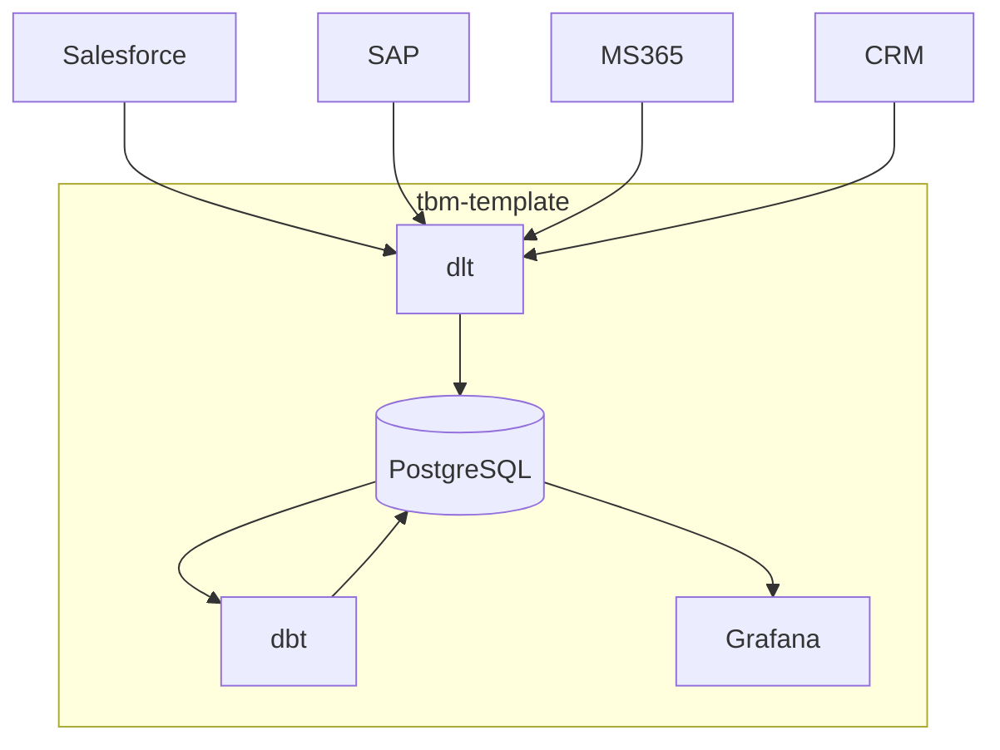

現代のビジネス環境において、IT部門は単なるコストセンターではなく、ビジネス成長を牽引する戦略的パートナーとしての役割がますます求められています。しかしながら、その役割を果たす上で、以下のような課題に直面されているのではないでしょうか。

* **コストのブラックボックス化:** ITインフラやアプリケーション、人件費など、多岐にわたるITコストの内訳や全体像を正確に把握できていますか？
* **ビジネス貢献度の不明確さ:** IT投資が具体的にどの事業や業務プロセスの価値向上に貢献しているのか、定量的に説明することは容易でしょうか？
* **経営層とのコミュニケーションギャップ:** ITの専門的な活動内容やコスト構造を、ビジネスの言葉で経営層に分かりやすく伝えられていますか？
* **投資判断の属人性:** 新規テクノロジーの導入や既存システムの刷新に関する意思決定が、担当者の経験や勘に依存していませんか？
* **リソース配分の非効率:** 限られた予算や人員といったITリソースが、組織全体の目標達成に向けて最適に配分されていると確信できますか？

これらの課題は、IT部門がその価値を最大限に発揮し、経営に貢献していく上での障壁になります。

## 課題解決のフレームワーク「TBM」：ITをビジネスの言葉で語る

こうした課題に対する有効なアプローチの一つとして、**TBM (Technology Business Management)** というフレームワークが注目されています。TBMは、ITコストを標準化された分類（タクソノミー）に基づいて整理・可視化し、IT投資とビジネス成果を結びつけるための体系的な手法です。

TBMを導入することで、単にコストを把握するだけでなく、以下のような具体的なメリットが得られます。

* **コストの完全な透明性と説明責任の確立:**
    * ITコストをインフラ、アプリケーション、サービスといった標準的なカテゴリに分類し、「何に」「どれだけ」コストがかかっているかを明確にします。
    * これにより、コスト構造を理解しやすくなり、利用部門や経営層に対してコストの根拠を具体的に説明できるようになります。ブラックボックスを解消し、IT部門の説明責任を果たします。
* **IT投資とビジネス価値の明確な連携:**
    * ITコストを、それが支えるビジネスサービスやビジネスケイパビリティ（事業遂行能力）に紐付けます。
    * 「このIT投資が、どのビジネス価値に、どのように貢献しているのか」を定量的に示せるようになり、ITのビジネス貢献度を具体的に示すことが可能になります。
* **データに基づいた合理的な意思決定の促進:**
    * コスト、利用状況、パフォーマンスなどのデータを一元的に分析することで、勘や経験に頼るのではなく、客観的な根拠に基づいた投資判断（新規投資、維持、撤退など）が可能になります。
    * リソース配分の最適化や、具体的なコスト削減機会の特定にも繋がります。
* **経営層・ビジネス部門との共通言語の構築:**
    * TBMタクソノミーという標準化されたフレームワークを用いることで、IT部門、ビジネス部門、経営層が同じ土俵でITのコストと価値について議論できるようになります。
    * これにより、部門間の認識齟齬を防ぎ、IT戦略に対する理解と協力を得やすくなります。

TBMは、IT部門が直面するこれらの複雑な課題に対して、**構造化されたアプローチ**と**共通言語**を提供し、ITマネジメントの高度化を実現します。TBMの概念やメリットについて、より体系的にご理解いただくためには、こちらの[TBMガイド（Zenn Book）](https://zenn.dev/suwash/books/tbm-guide_202504)もご参照ください。

https://zenn.dev/suwash/books/tbm-guide_202504

## TBM導入の現実的な第一歩：「tbm-template」

しかし、「TBMが良いのは分かったが、導入には大規模なプロジェクトが必要なのではないか？」と感じられるかもしれません。確かに、本格的なTBM導入には相応の準備と工数を要します。

そこで、TBMの導入を**より現実的かつ低リスクで開始**する **「tbm-template」** を開発しました。

このテンプレートは、TBMの基本的な考え方と構成要素を、Dockerコンテナでパッケージ化したものです。オープンソースのツール（PostgreSQL, dbt, dlt, Grafana）を利用しており、特別なライセンス費用なしに利用を開始できます。このテンプレートの技術的な詳細や具体的な利用方法については、**[tbm-template GitHubリポジトリ](https://github.com/suwa-sh/tbm-template)** をご覧ください。

https://github.com/suwa-sh/tbm-template

**tbm-templateが、管理者層の皆様の課題解決にどのように貢献できるか:**

1.  **コストのブラックボックス化解消:** 標準的なTBMタクソノミーに基づいたデータモデルと、コスト配賦のサンプルロジックを提供します。まずはサンプルデータでコスト構造の可視化を体験できます。
2.  **ビジネス貢献度の明確化:** ITコストをITサービス、そしてビジネスユニットやビジネスケイパビリティへと段階的に紐付ける配賦プロセスを実装しています。これにより、ITがどのビジネス領域を支えているかの可視化につながります。
3.  **経営層とのコミュニケーション改善:** Grafanaによるダッシュボードを提供します。全社視点、部門視点、コスト配賦の内訳など、多様な切り口でのレポートは、経営層への説明資料作成の助けとなります。
   * 全社
     * 
   * 部門ごと
     * 
   * 配賦の内訳
     * 
4.  **客観的な投資判断支援:** コストデータを集約し分析可能な状態にすることで、勘や経験に頼らない、データに基づいた投資判断の土台を築きます。
5.  **リソース配分の最適化:** どのサービスや部門にどれだけのコスト（リソース）が投入されているかを可視化することで、非効率な領域やコスト削減の機会を発見する手がかりとなります。

## tbm-templateの仕組み（概要）

テンプレートは、以下のプロセスを自動化します。

1.  **データ収集 (dlt):** 各種システムからコスト関連データを収集。（テンプレートではサンプルデータを使用）
2.  **データ変換・配賦 (dbt):** TBMタクソノミーに基づきデータを変換し、定義されたルールに従ってコストを配賦。
3.  **データ可視化 (Grafana):** 配賦結果をダッシュボードで表示。

Docker環境があれば、簡単なコマンドでこれらの環境を構築し、サンプルデータを用いたTBMのプロセスをすぐに確認できます。

## スモールスタートによるTBM導入のメリット

このテンプレートは、あくまでTBM導入の**出発点**です。最初から完璧なデータ収集や配賦ルールを目指す必要はありません。

* **低リスクでの試行:** まずはテンプレートを動かし、TBMの概念や効果を体験することから始められます。
* **段階的な学習と適用:** テンプレートをベースに、自社の状況に合わせてデータソースや配賦ルールを少しずつカスタマイズしていくことで、無理なく導入を進められます。
* **早期の価値実感:** コストの可視化といった初期の効果を早期に得ることで、関係者の理解と協力を得やすくなります。

## まとめ： ITマネジメント高度化への一歩として

ITコストの最適化、IT投資対効果の最大化、そしてビジネスへの貢献度向上は、IT部門にとって普遍的な課題です。TBMはこれらの課題に取り組むための強力な羅針盤となり得ます。

まずは、**[tbm-template](https://github.com/suwa-sh/tbm-template)** を用いて、現状のITコスト構造やビジネスへの繋がりについて、新たな視点を得てみませんか？導入やカスタマイズに関してご不明な点があれば、[X](https://x.com/suwa_sh)や[問い合わせフォーム](https://suwa-sh.github.io/profile/#Contact)からお気軽にご相談ください。

この「tbm-template」が、IT部門とビジネス部門をつなぐ一助となれば幸いです。

https://github.com/suwa-sh/tbm-template

この記事でなにか得られることがあったら、SNSでシェアしていただけると励みになります。
