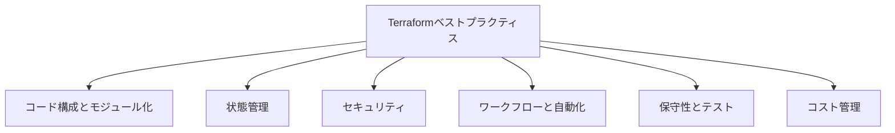
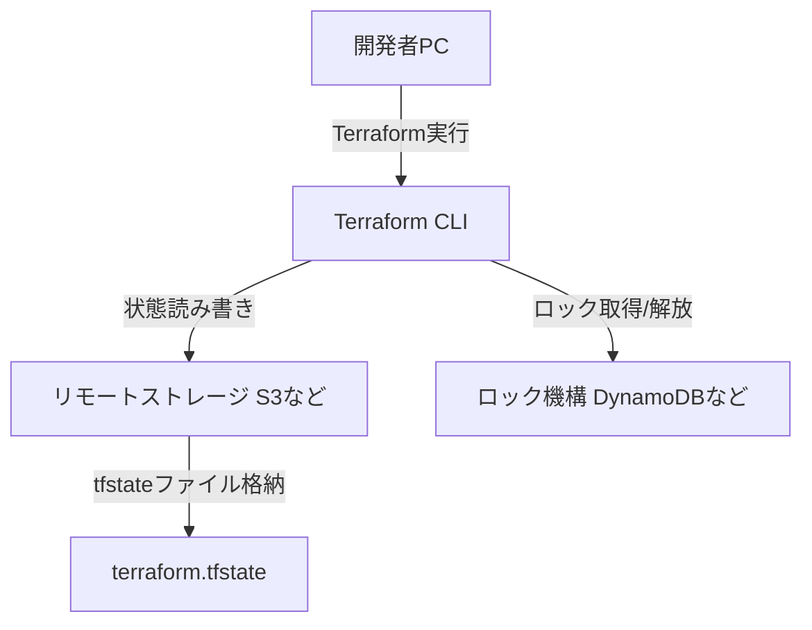
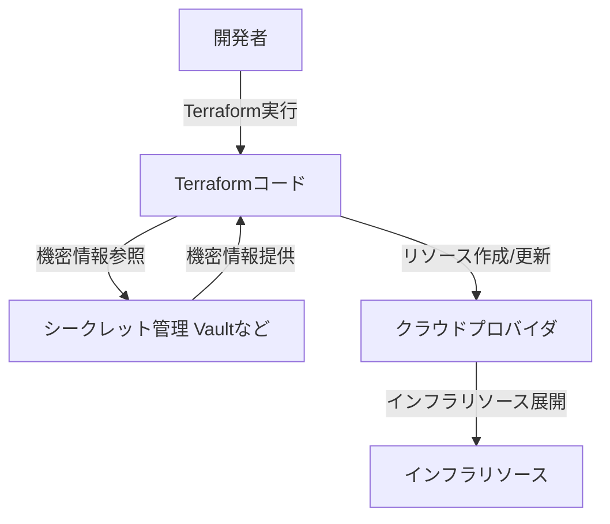
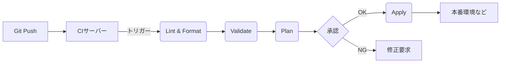

- Terraformを効果的に利用し、インフラストラクチャ管理の品質、効率性、安全性を向上させるためのベストプラクティスを解説します。
- 本ガイドは、プロジェクトの規模や成熟度に応じて段階的に導入することを推奨します。
- LLMへの指示のベースにすることを想定しています。
  - このベストプラクティスにプロジェクトの特性を組み合わせて、vibe codingのruleファイルを作成して利用します。

## 1. Terraformベストプラクティスの全体像

Terraformのベストプラクティスは、相互に関連する複数の領域にわたります。これらの領域をバランス良く実践することが重要です。



**図1: Terraformベストプラクティスの主要カテゴリ**

| 要素名                      | 説明                                                                     |
| :-------------------------- | :----------------------------------------------------------------------- |
| Terraformベストプラクティス | 本ガイドで解説するTerraform運用の推奨事項全体を示します。                |
| コード構成とモジュール化    | Terraformコードの構造、再利用性、可読性を高めるためのプラクティスです。  |
| 状態管理                    | Terraformの状態ファイル (tfstate) を安全かつ効率的に管理する方法です。   |
| セキュリティ                | インフラストラクチャとTerraformコードの安全性を確保するための対策です。  |
| ワークフローと自動化        | Terraformの実行プロセスを効率化し、人為的ミスを削減するための手法です。  |
| 保守性とテスト              | コードの品質を維持し、変更容易性や信頼性を高めるためのプラクティスです。 |
| コスト管理                  | クラウド費用の最適化をTerraform運用に組み込むための考慮事項です。        |

## 2. 基盤となる原則

Terraformを運用する上で基本となる考え方です。

| 原則                                | 説明                                                                                  |
| :---------------------------------- | :------------------------------------------------------------------------------------ |
| Infrastructure as Code (IaC) の徹底 | 全てのインフラ構成をTerraformコードで管理します。手動変更は避け、コードに反映します。 |
| イミュータブルインフラストラクチャ  | 既存リソースの変更ではなく、新規リソース作成と旧リソース破棄による更新を目指します。  |
| DRY (Don't Repeat Yourself)         | モジュールや変数を活用し、コードの重複を排除します。                                  |

## 3. コード構成とモジュール化

コードの品質と再利用性を高めるためのプラクティスです。

| 推奨度 | プラクティス                               | 概要                                                                                                                                                                                                                                                                                                                                                                                                                                                                                                                                                    |
| :----- | :----------------------------------------- | :------------------------------------------------------------------------------------------------------------------------------------------------------------------------------------------------------------------------------------------------------------------------------------------------------------------------------------------------------------------------------------------------------------------------------------------------------------------------------------------------------------------------------------------------------ |
| 10/10  | モジュール化の積極採用と適切なスコープ設定 | **自作モジュールの作成は、複数のアプリケーションやチーム間で共通して利用できる標準的な構成要素（例: ネットワーク、データベースクラスタ、監視設定など）に限定することを推奨します。** 単一アプリケーション内でのみ利用する構成のために安易にモジュールを作成すると、過度な抽象化により可読性やメンテナンス性が低下する場合があります。ただし、非常に大規模で複雑なリソース群を論理的に分割し、管理を容易にする目的であれば、単一アプリケーション内でも限定的なモジュール化は有効です。既存の公開モジュールやコミュニティモジュールは積極的に活用します。 |
| 9/10   | 明確なディレクトリ構造とファイル分割       | 環境別 (`environments/`) やモジュール別 (`modules/`) にディレクトリを分割します。**各環境のルート構成内では、リソースの種類、機能、またはライフサイクルに応じてファイルを分割する（例: `network.tf`, `frontend.tf`, `backend.tf`, `database.tf`, `dns.tf` など）ことを推奨します。** これにより、特定の関心事に集中しやすくなり、可読性とメンテナンス性が向上します。                                                                                                                                                                   |
| 8/10   | 一貫した命名規則とタグ付け                 | リソース、変数などに明確な命名規則 (`snake_case`推奨) を適用します。リソースには識別用タグを付与します。                                                                                                                                                                                                                                                                                                                                                                                                                                                |
| 9/10   | 変数の効果的な管理                         | `variables.tf` に型、説明、デフォルト値を定義します。環境固有値は `.tfvars` で管理します。                                                                                                                                                                                                                                                                                                                                                                                                                                                              |
| 8/10   | 出力値の戦略的活用                         | モジュールからは必要な情報のみを出力します。ルート構成からは後続処理に必要な情報を出力します。                                                                                                                                                                                                                                                                                                                                                                                                                                                          |

```text
プロジェクトルート/
├── environments/
│   ├── dev/
│   │   ├── main.tf            # (オプション: プロバイダ設定やバックエンド設定など、全体に関わる設定)
│   │   ├── variables.tf
│   │   ├── outputs.tf
│   │   ├── versions.tf        # (Terraformやプロバイダのバージョン指定)
│   │   ├── network.tf         # (VPC, Subnet, Security Groupなど)
│   │   ├── frontend.tf        # (フロントエンド用EC2, ECS Task Definitionなど)
│   │   ├── backend.tf         # (バックエンド用EC2, Lambda Functionなど)
│   │   ├── database.tf        # (RDS, DynamoDBなど)
│   │   └── dns.tf             # (Route 53 Recordなど)
│   ├── stg/
│   │   ├── ... (devと同様のファイル構成)
│   └── prod/
│       ├── ... (devと同様のファイル構成)
└── modules/
    ├── shared_vpc/
    │   ├── main.tf
    │   ├── variables.tf
    │   └── outputs.tf
    └── common_database/
        ├── main.tf
        ├── variables.tf
        └── outputs.tf
```
**テキストツリー表示2: 推奨ディレクトリ構造の例 (環境内ファイル分割と共通モジュール利用時)**

| 要素名                                                | 説明                                                                                                                                                                      |
| :---------------------------------------------------- | :------------------------------------------------------------------------------------------------------------------------------------------------------------------------ |
| プロジェクトルート (`./`)                             | Terraformプロジェクトの最上位ディレクトリです。                                                                                                                           |
| `environments/`                                       | 環境ごと (開発、ステージング、本番) の設定を管理するディレクトリです。                                                                                                    |
| `modules/`                                            | 複数のプロジェクトや環境で共有される、自作または外部の共通モジュールを格納するディレクトリです。                                                                          |
| 各環境ディレクトリ (`environments/dev/` など)         | 各環境 (開発、ステージング、本番) のルート構成ディレクトリです。                                                                                                          |
| 各モジュールディレクトリ (`modules/shared_vpc/` など) | 具体的な共通モジュール (例: 共有VPC、共通データベース設定) のディレクトリです。                                                                                           |
| `main.tf` (環境配下)                                  | (オプション) プロバイダ設定、バックエンド設定、ローカル変数など、その環境全体に関わる基本的な設定を記述します。リソース定義は機能別のファイルに分割することを推奨します。 |
| `variables.tf`                                        | そのディレクトリやモジュールで使用する変数を定義するファイルです。                                                                                                        |
| `outputs.tf`                                          | そのディレクトリやモジュールからの出力値を定義するファイルです。                                                                                                          |
| `versions.tf`                                         | Terraform本体および使用するプロバイダのバージョンを固定するためのファイルです。                                                                                           |
| `network.tf`                                          | ネットワーク関連リソース (VPC, Subnet, Security Group等) を定義します。                                                                                                   |
| `frontend.tf`                                         | フロントエンドアプリケーションに関連するコンピューティングリソースを定義します。                                                                                          |
| `backend.tf`                                          | バックエンドアプリケーションに関連するコンピューティングリソースを定義します。                                                                                            |
| `database.tf`                                         | データベース関連リソース (RDS, DynamoDB等) を定義します。                                                                                                                 |
| `dns.tf`                                              | DNS関連リソース (Route 53 Record等) を定義します。                                                                                                                        |

## 4. 状態管理 (State Management)

Terraformの状態ファイル (`terraform.tfstate`) を安全かつ効率的に管理します。

| 推奨度 | プラクティス                           | 概要                                                                                                        |
| :----- | :------------------------------------- | :---------------------------------------------------------------------------------------------------------- |
| 10/10  | リモートバックエンドとロック機構の利用 | 状態ファイルをS3等のリモートストレージに保存し、DynamoDB等でロックします。チーム開発での競合を防ぎます。    |
| 9/10   | 状態ファイルの分割                     | プロジェクト規模に応じ、状態ファイルを分割します。`plan`/`apply` の影響範囲を限定し、実行時間を短縮します。 |
| 9/10   | 状態ファイルへの機密情報混入防止       | 状態ファイルへのアクセス権限を厳格に管理します。サーバーサイド暗号化を有効にします。                        |


**図3: リモート状態管理の概念図**

| 要素名                    | 説明                                                                            |
| :------------------------ | :------------------------------------------------------------------------------ |
| 開発者PC                  | 開発者がTerraformコマンドを実行する環境です。                                   |
| Terraform CLI             | Terraformのコマンドラインインターフェースです。                                 |
| リモートストレージ S3など | 状態ファイルを保存する共有ストレージサービスです (例: AWS S3)。                 |
| ロック機構 DynamoDBなど   | 状態ファイルへの同時アクセスを防ぐためのロックサービスです (例: AWS DynamoDB)。 |
| terraform.tfstate         | インフラストラクチャの現在の状態を記録したファイルです。                        |

## 5. セキュリティ

インフラストラクチャとTerraformコードの安全性を確保します。

| 推奨度 | プラクティス                          | 概要                                                                                                          |
| :----- | :------------------------------------ | :------------------------------------------------------------------------------------------------------------ |
| 10/10  | 最小権限の原則                        | Terraformが使用するIAMロール等には、操作に必要な最小限の権限のみを付与します。                                |
| 10/10  | 機密情報の外部管理                    | APIキー等の機密情報はコードに記述せず、Vault等のシークレット管理ツールを使用します。                          |
| 9/10   | 静的コード解析とポリシーチェック      | `tfsec`等のツールをCI/CDに組み込み、脆弱性やポリシー違反を早期に検出します。OPA等の利用も検討します。         |
| 8/10   | プロバイダとTerraformバージョンの管理 | `versions.tf`でバージョンを固定します。定期的にセキュリティアップデートのためにバージョンアップを計画します。 |


**図4: 機密情報管理のフロー例**

| 要素名                     | 説明                                                                  |
| :------------------------- | :-------------------------------------------------------------------- |
| 開発者                     | Terraformコードを作成・実行するユーザーです。                         |
| Terraformコード            | インフラ構成を定義した `.tf` ファイル群です。                         |
| シークレット管理 Vaultなど | APIキーやパスワードなどの機密情報を安全に保管・管理するシステムです。 |
| クラウドプロバイダ         | AWS, Azure, GCPなどのクラウドサービスプラットフォームです。           |
| インフラリソース           | Terraformによってプロビジョニングされた実際のクラウド資源です。       |

## 6. ワークフローと自動化 (CI/CD)

Terraformの実行プロセスを効率化し、人為的ミスを削減します。

| 推奨度 | プラクティス                        | 概要                                                                                                       |
| :----- | :---------------------------------- | :--------------------------------------------------------------------------------------------------------- |
| 10/10  | バージョン管理システム (Git) の利用 | 全てのTerraformコードをGitで管理します。フィーチャーブランチモデルを採用し、Pull Requestでレビューします。 |
| 10/10  | CI/CD パイプラインの構築            | Lint, Format, Validate, Plan, Apply の各ステップを自動化します。承認プロセスを設けます。                   |
| 10/10  | `plan` の徹底的なレビュー           | `apply` 前に `plan` の結果を必ず確認し、意図しない変更がないか検証します。                                 |
| 8/10   | Terraform自動化支援ツールの活用     | Atlantis等のツールを導入し、Pull RequestベースのTerraform運用を効率化します。                              |


**図5: CI/CDパイプラインの基本ステップ**

| 要素名        | 説明                                                                   |
| :------------ | :--------------------------------------------------------------------- |
| Git Push      | 開発者がコード変更をGitリポジトリにプッシュする操作です。              |
| CIサーバー    | Git Pushをトリガーに自動的にパイプラインを実行するサーバーです。       |
| Lint & Format | コードの静的解析とフォーマット統一を行います。                         |
| Validate      | Terraformコードの構文チェックを行います。                              |
| Plan          | 実行計画を作成し、インフラへの変更内容をプレビューします。             |
| 承認          | Planの結果をレビュアーが確認し、変更を承認または却下するプロセスです。 |
| Apply         | 承認された変更を実際のインフラに適用します。                           |
| 本番環境など  | Terraformによって管理される実際のインフラ環境です。                    |
| 修正要求      | Planの結果に問題がある場合、開発者に修正を促します。                   |

## 7. 保守性とテスト

コードの品質を維持し、変更容易性や信頼性を高めます。

| 推奨度 | プラクティス           | 概要                                                                                                                   |
| :----- | :--------------------- | :--------------------------------------------------------------------------------------------------------------------- |
| 8/10   | コメントとドキュメント | 複雑なロジックやリソースの目的をコメントで記述します。モジュールにはREADMEを作成します。`terraform-docs`も活用します。 |
| 9/10   | 小さな変更と段階的適用 | 一度の `apply` で行う変更範囲を小さく保ちます。問題発生時の影響特定とロールバックを容易にします。                      |
| 7/10   | テストの導入           | Terratest等で単体テストや統合テストを導入します。コンプライアンステストも実施します。                                  |

## 8. コスト管理と最適化

クラウド費用を意識したTerraform運用を行います。

| 推奨度 | プラクティス                 | 概要                                                                                                 |
| :----- | :--------------------------- | :--------------------------------------------------------------------------------------------------- |
| 7/10   | コスト意識した設計           | リソース選定時にコストを考慮します。`infracost`等のツールをCI/CDに組み込み、コスト差分を確認します。 |
| 7/10   | 不要リソースのクリーンアップ | 開発環境等の一時リソースは不要になったら速やかに `destroy` します。定期的に棚卸しを実施します。      |

## 9. まとめ

本ガイドで示したベストプラクティスは、Terraformプロジェクトの成功に不可欠です。これらを段階的に導入し、継続的に改善することで、Terraform運用の成熟度を高めることができます。
