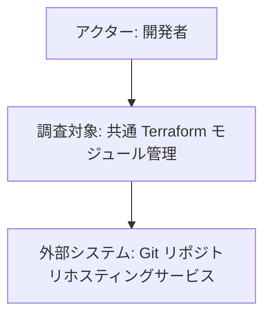
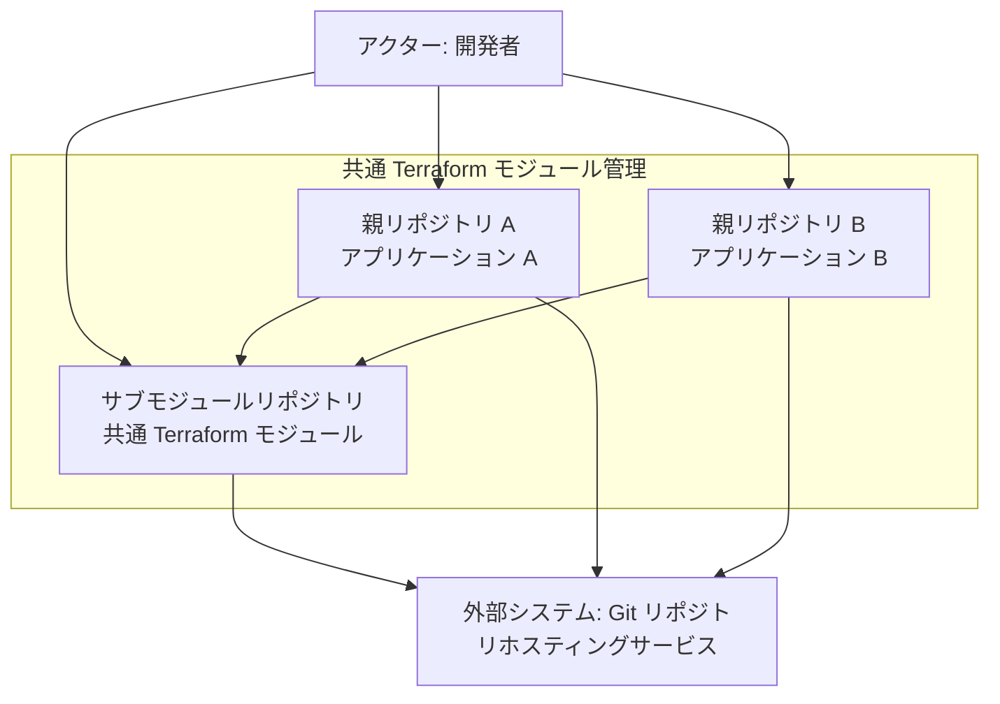
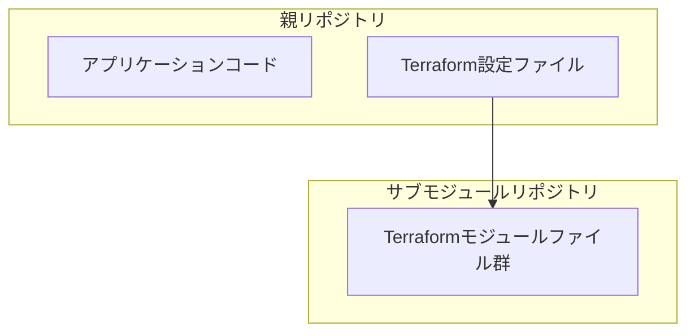

## ■概要

Git Submoduleを利用すると、あるGitリポジトリ（親リポジトリ）の中に、別のGitリポジトリ（サブモジュール）を特定のコミットへの参照として含めることができます。この機能をTerraformと組み合わせることで、複数のアプリケーションやプロジェクト（それぞれが親リポジトリとなる）から共通で利用するTerraformモジュール（サブモジュールリポジトリとなる）を一元的に管理し、再利用性を高めることが可能です。

共通のインフラストラクチャ構成（例えば、VPC、セキュリティグループ、IAMロールなど）をTerraformモジュールとして定義し、それをサブモジュールとして各アプリケーションのリポジトリに組み込むことで、コードの重複を避け、一貫性のあるインフラ構築を実現できます。また、共通モジュールの更新もサブモジュール経由で各プロジェクトに効率的に反映させることができます。

## ■構造

### ●システムコンテキスト図



| 要素名                               | 説明                                                                 |
| :----------------------------------- | :------------------------------------------------------------------- |
| アクター: 開発者                     | 共通Terraformモジュールの作成、更新、およびそれを利用するアプリケーションの開発を行う人物。 |
| 調査対象: 共通 Terraform モジュール管理 | Git Submodule を利用して、複数のアプリケーションから共通で利用される Terraform モジュールを管理する仕組み。 |
| 外部システム: Git リポジトリホスティングサービス | Gitリポジトリ（親リポジトリ、サブモジュールリポジトリ）をホスティングするサービス。例: GitHub, GitLab。 |

### ●コンテナ図



| 要素名                                       | 説明                                                                                                |
| :------------------------------------------- | :-------------------------------------------------------------------------------------------------- |
| アクター: 開発者                             | 親リポジトリやサブモジュールリポジトリを操作します。                                                              |
| 親リポジトリ A (アプリケーション A)            | アプリケーションAのコードと、共通Terraformモジュールをサブモジュールとして含むGitリポジトリです。                               |
| 親リポジトリ B (アプリケーション B)            | アプリケーションBのコードと、共通Terraformモジュールをサブモジュールとして含む別のGitリポジトリです。                             |
| サブモジュールリポジトリ (共通 Terraform モジュール) | 複数の親リポジトリから参照される、再利用可能なTerraformコード（モジュール）が格納されたGitリポジトリです。                       |
| 外部システム: Git リポジトリホスティングサービス | 親リポジトリとサブモジュールリポジトリを永続化し、開発者間の共有を可能にするサービスです。                                         |

### ●ディレクトリ構成

```txt
- サブモジュールリポジトリ
  - main.tf
  - variables.tf
  - outputs.tf
  - README.md
  - versions.tf
  - examples/
  - tests/
```

| 要素名       | 説明                                                                                                                               |
| :----------- | :--------------------------------------------------------------------------------------------------------------------------------- |
| main.tf      | モジュールがプロビジョニングする主要なリソース定義を記述します。例えば、AWSのVPCやEC2インスタンスの定義などが含まれます。                                    |
| variables.tf | モジュールが受け入れる入力変数を定義します。例えば、VPCのCIDRブロックやインスタンスタイプなどを変数として定義します。                                           |
| outputs.tf   | モジュールが外部に提供する出力値を定義します。例えば、作成されたVPCのIDやEC2インスタンスのパブリックIPアドレスなどを出力します。                                  |
| README.md    | モジュールの目的、使い方、入力変数、出力値などに関するドキュメントを記述します。利用者がモジュールを理解しやすくするために重要です。                                   |
| versions.tf  | Terraform本体のバージョン制約や、モジュールが依存するプロバイダのバージョン制約を記述します。これにより、意図しないバージョンの差異による問題を避けることができます。 |
| examples/    | モジュールの具体的な使用例を示すTerraformコードを格納するディレクトリです。利用者がモジュールをどのように使えるかを理解するのに役立ちます。                               |
| tests/       | モジュールの単体テストや統合テストのコードを格納するディレクトリです。例えば、Terratestなどを使用してテストを記述します。                                            |

## ■情報

### ●概念モデル



| 要素名                                       | 説明                                                                                             |
| :------------------------------------------- | :----------------------------------------------------------------------------------------------- |
| 親リポジトリ                                   | アプリケーションのコードと、共通モジュールを利用するためのTerraform設定ファイルを含みます。                      |
| アプリケーションコード                         | 親リポジトリに含まれる、ビジネスロジックなどを実装したコードです。                                             |
| Terraform設定ファイル                          | 親リポジトリに含まれ、サブモジュールとして取り込んだ共通Terraformモジュールを呼び出し、インフラを構成するファイルです。 |
| サブモジュールリポジトリ (共通 Terraform モジュール) | 再利用可能なインフラ構成を定義したTerraformモジュールファイル群を含みます。                                      |
| Terraformモジュールファイル群                  | `main.tf`, `variables.tf`, `outputs.tf` など、Terraformモジュールを構成する一連のファイルです。                |

## ■構築方法

### ●共通Terraformモジュールリポジトリの作成

  - 独立したGitリポジトリとして、共通で利用したいTerraformモジュールを作成します。
  - リポジトリには、`main.tf`, `variables.tf`, `outputs.tf` などの標準的なTerraformモジュールファイルを含めます。
  - 必要に応じて、バージョン管理のためにタグ（例: `v1.0.0`）を付与します。
  - このリポジトリをGitリポジトリホスティングサービス（GitHub, GitLabなど）にプッシュします。

### ●親リポジトリへのサブモジュールの追加

  - 共通Terraformモジュールを利用したい各アプリケーションのGitリポジトリ（親リポジトリ）のルートディレクトリ、または任意のディレクトリに移動します。
  - 以下のコマンドを実行して、共通Terraformモジュールリポジトリをサブモジュールとして追加します。
    ```bash
    git submodule add <共通TerraformモジュールリポジトリのURL> <サブモジュールとして配置するパス>
    ```
    例: `git submodule add git@github.com:your-org/common-tf-module.git modules/common`
  - これにより、親リポジトリに `.gitmodules` ファイルが作成（または更新）され、サブモジュールの情報が記録されます。また、指定したパスにサブモジュールのディレクトリが作成されます。
  - 変更をステージングし、コミットします。
    ```bash
    git add .gitmodules <サブモジュールとして配置するパス>
    git commit -m "Add common terraform module as submodule"
    ```

### ●サブモジュールの初期化とクローン

  - 親リポジトリをクローンした後や、他の人が追加したサブモジュールをローカルに反映させるためには、以下のコマンドを実行します。
      - まだ一度もサブモジュールを初期化していない場合:
        ```bash
        git submodule init
        git submodule update
        ```
      - または、まとめて実行:
        ```bash
        git submodule update --init
        ```
  - 親リポジトリをクローンする際に、サブモジュールも一緒にクローンするには `--recurse-submodules` オプションを使用します。
    ```bash
    git clone --recurse-submodules <親リポジトリのURL>
    ```

## ■利用方法

### ●Terraformコードからの共通モジュールの参照

  - 親リポジトリのTerraform設定ファイル（例: `main.tf`）から、サブモジュールとして追加した共通Terraformモジュールを以下のように参照します。
    ```terraform
    module "my_common_module_instance" {
      source = "./modules/common" // git submodule add で指定したパス

      // 共通モジュールで定義された変数を指定
      vpc_cidr_block = "10.0.0.0/16"
      environment    = "production"
      // ... その他の変数
    }
    ```
  - `source`属性には、`git submodule add` コマンドで指定したサブモジュールのローカルパスを指定します。

### ●サブモジュールの更新

  - 共通Terraformモジュール自体に変更があった場合、それを親リポジトリに反映させる手順は以下の通りです。
    1.  **サブモジュールディレクトリ内での更新:**
          - 親リポジトリ内のサブモジュールディレクトリに移動します。
            ```bash
            cd <サブモジュールとして配置するパス>
            ```
          - サブモジュールリポジトリの最新の変更を取得し、特定のブランチやタグに切り替えます（推奨）。
            ```bash
            git fetch
            git checkout main // または特定のタグ例: git checkout v1.1.0
            git pull origin main // または git pull origin v1.1.0
            ```
    2.  **親リポジトリでの変更のコミット:**
          - 親リポジトリのルートディレクトリに戻ります。
            ```bash
            cd ../.. // サブモジュールの階層に応じて調整
            ```
          - サブモジュールの参照が新しいコミットIDに更新されていることを確認し、その変更をステージングしてコミットします。
            ```bash
            git add <サブモジュールとして配置するパス>
            git commit -m "Update common terraform module to latest version"
            ```
  - 他の開発者が親リポジトリをプルした後、サブモジュールの更新を取り込むには以下のコマンドを実行します。
    ```bash
    git submodule update --remote --merge // リモートの最新を取り込みマージ (推奨)
    // または、親リポジトリで記録されたコミットに追従
    // git submodule update --init --recursive
    ```

## ■運用

### ●バージョン管理

  - **共通モジュールのバージョニング:**
      - 共通Terraformモジュールリポジトリでは、セマンティックバージョニング（例: `v1.0.0`, `v1.0.1`, `v2.0.0`）に従ってGitのタグを使用することを強く推奨します。
      - 破壊的変更を含む場合はメジャーバージョンを、後方互換性のある機能追加の場合はマイナーバージョンを、バグ修正の場合はパッチバージョンを上げます。
  - **親リポジトリでのバージョン指定:**
      - 親リポジトリからサブモジュールを参照する際は、特定のタグ（バージョン）を指すようにします。これにより、意図しない共通モジュールの更新による影響を防ぎ、安定した運用が可能になります。
      - サブモジュールを更新する際は、テスト済みの特定のバージョンタグに切り替えてから、親リポジトリでその変更をコミットします。

### ●変更管理と影響範囲

  - **変更の影響評価:** 共通Terraformモジュールへの変更は、それを利用している全ての親リポジトリ（アプリケーション）に影響を与える可能性があります。変更を加える前に、影響範囲を慎重に評価してください。
  - **コミュニケーション:** 共通モジュールに破壊的変更や大きな変更を加える場合は、事前に利用している全てのチームや開発者に通知し、調整を行うことが重要です。
  - **段階的なロールアウト:** 可能であれば、新しいバージョンの共通モジュールを一部のアプリケーションから段階的に導入し、問題がないことを確認しながら展開します。

### ●テスト戦略

  - **共通モジュールのテスト:**
      - 共通Terraformモジュールリポジトリ自体に、単体テストや統合テストを導入します。
      - Terraformの `validate` や `plan` コマンドでの基本的な検証に加えて、`Terratest` などのツールを用いて、実際にリソースが意図通りに作成・設定されるかを確認するテストを記述します。
  - **親リポジトリでのテスト:**
      - 共通モジュールを更新した際には、親リポジトリ側でもインテグレーションテストやE2Eテストを実施し、アプリケーション全体として問題なく動作することを確認します。

### ●サブモジュールのメンテナンス

  - 定期的に共通モジュールの依存関係（プロバイダバージョンなど）を更新し、セキュリティパッチや最新機能を取り込むようにします。
  - 長期間利用されていない、あるいはメンテナンスされていない共通モジュールは、アーカイブまたは削除を検討します。

## ■参考リンク

  - **概要**
      - [Git - Submodules](https://git-scm.com/book/en/v2/Git-Tools-Submodules)
      - [Terraform Modules Overview](https://developer.hashicorp.com/terraform/language/modules)
  - **構造**
      - [The C4 model for visualising software architecture](https://c4model.com/)
  - **構築方法**
      - [Git Submodules: The Definitive Guide](https://www.vogella.com/tutorials/GitSubmodules/article.html)
      - [Creating Modules - Terraform Documentation](https://developer.hashicorp.com/terraform/language/modules/develop)
  - **利用方法**
      - [Calling a Child Module - Terraform Documentation](https://developer.hashicorp.com/terraform/language/modules/syntax#calling-a-child-module)
      - [git-submodule - Git Manual](https://git-scm.com/docs/git-submodule)
  - **運用**
      - [Module Blocks / Versioning - Terraform Documentation](https://developer.hashicorp.com/terraform/language/modules/syntax#version)
      - [Write Terraform Tests - Terraform Documentation](https://developer.hashicorp.com/terraform/tutorials/configuration-language/test)
      - [Terratest by Gruntwork](https://terratest.gruntwork.io/)
