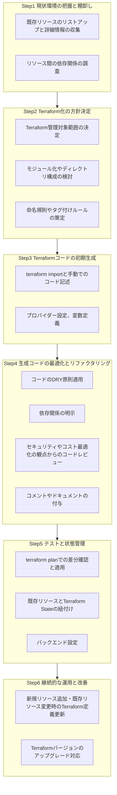

先日、久しぶりに**既存環境をterraformにリバース・エンジニアリング**する機会がありました。最近はexportも進化しているし、LLMにも助けてもらえる。昔に比べると楽になっているはず！？と考えていましたが、やはり**最近でも手作業は多く、結構な手間がかかる**ことは手を付ける前に認識しておかなくてはな、と感じました。

この記事では、既存環境をTerraformにリバースエンジニアリングする際の**ワークフロー**と、**支援ツールの使い所**についてまとめます。

## terraform周辺の静的解析ツール

Infrastructure as Code (IaC) のセキュリティと品質を向上させるために、Terraformの静的解析ツールは不可欠です。「シフトレフト」の考え方に基づき、開発ライフサイクルの早期段階で問題を検出し修正することが重要です。これらのツールは、セキュリティの脆弱性、設定ミス、コンプライアンス違反などをコードレベルで検出します。CI/CDパイプラインに組み込むことで、継続的な監視を実現します。

### 主要ツールと特徴

主要な静的解析ツールとその特徴は以下の通りです。

  * **Checkov**
      * Palo Alto Networks (Prisma Cloud) が開発・サポートするオープンソースツールです。
      * ポリシー数が1000以上と非常に豊富です。
      * AWS、Azure、GCPなど主要なクラウドプロバイダーに対応しています。
      * Terraform HCLに加えて、プランファイルもスキャンできます。
      * カスタムポリシーはPythonやYAMLで記述できます。
      * コミュニティも活発です。
  * **tfsec (Trivy IaC)**
      * Aqua Securityに買収され、現在はコンテナスキャナで知られるTrivyにIaCスキャン機能として統合されています。
      * 主要クラウドに対応し、多くの組み込みルールを持っています。
      * 開発は継続され、Trivyの一部として機能が拡充されています。
  * **KICS (Keeping Infrastructure as Code Secure)**
      * Checkmarxが開発するオープンソースプロジェクトです。
      * Terraform以外にも多くのIaCツールやコンテナ定義ファイル (Dockerfile, Kubernetes) に対応し、包括的なスキャンが可能です。
      * 多数のクエリ (ルール) を持ち、カスタマイズもできます。
  * **Terrascan**
      * Tenableによってメンテナンスされていました。
      * 近年は他のツールと比較して、アクティビティや機能追加は落ち着いている傾向です。
      * 依然として多くのポリシーを持ち、利用されています。
  * **TFLint**
      * 主にTerraformのベストプラクティス、潜在的なエラー、スタイル規約に焦点を当てたLinterです。
      * クラウドプロバイダー固有のルールセットもプラグインとして提供しています。
      * `tfsec`や`Checkov`とは異なる観点でのチェックができます。
  * **Open Policy Agent (OPA)**
      * 汎用的なポリシーエンジンです。
      * Terraformの設定に対してカスタムポリシーを記述し、適用できます。
      * 柔軟性は非常に高いですが、ポリシー記述言語 (Rego) の学習が必要です。

### LLMとの関係

LLMは、静的解析ツールを補完する役割を果たします。
静的解析ツールは具体的なルールに基づいて網羅的に問題を「検出」します。
一方、LLMは以下の点で強みを発揮します。

  * コード生成
  * リファクタリング提案
  * ドキュメント作成
  * 一般的なセキュリティ知識の提供
  * 問題の「理解支援」
  * 「修正案の提案」
  * 「関連情報の提示」

一部の商用セキュリティツールでは、AI (LLM含む) を活用して検出結果のトリアージや修正案を自動生成する機能も登場しています。

## 想定状況

  * **対象クラウド**: AWS
  * **対象リソース**: VPC, EC2, SG, ELB/ALB, RDS, S3, IAMロール・ポリシー
  * **既存環境の特徴**:
      * 手動構築
      * ドキュメント不備
      * 命名不統一
      * 暗黙的依存関係
  * **ゴール**:
      * Terraform管理化
      * コードによる再現性と変更管理の実現
  * **作業者**: インフラエンジニア1〜2名

## リバースエンジニアリングのワークフロー

## リバースエンジニアリングワークフローと支援ツールのマッピング

| ワークフローのステップ                | アクション                                                               | 支援ツール                                            | 人の作業量 (支援ツール活用時) | 支援の効果 | 支援の具体例                                                                                                                                                                                                                        | 備考                                                                                                                                                                                        |
| :------------------------------------ | :----------------------------------------------------------------------- | :---------------------------------------------------- | :---------------------------- | :--------- | :---------------------------------------------------------------------------------------------------------------------------------------------------------------------------------------------------------------------------------- | :------------------------------------------------------------------------------------------------------------------------------------------------------------------------------------------ |
| **1. 現状環境の把握と棚卸し** | 1.1. 既存リソースのリストアップと詳細情報の収集                          | LLM                                                   | 大                            | 中         | CLI/APIの出力結果（JSON, CSV）を整形・要約し、人間が理解しやすいリストを作成します。特定のタグやパターンに基づくリソースの初期分類案を提示します。                                                                                              | リソース特定や情報抽出の主体は人です。LLMは整理・要約で補助します。認証情報が必要な直接操作はLLMにはできません。                                                                                    |
|                                       | 1.2. リソース間の依存関係の調査                                          | LLM                                                   | 大                            | 小～中     | 収集した設定情報から、直接的な依存関係の候補を提示します。ネットワーク構成図や設定ファイルからの依存関係解釈を支援します。                                                                                                                      | アプリケーションログ解析やヒアリングによる暗黙的依存の特定は人が行います。LLMは推測を補助します。                                                                                                     |
| **2. Terraform化の方針決定** | 2.1. Terraform管理対象範囲の決定                                         | LLM                                                   | 中                            | 小         | 管理対象/対象外のメリット・デメリット整理を支援します。一般的な判断基準や考慮事項を提示します。                                                                                                                                                 | ビジネス要件や組織戦略を考慮した総合的な意思決定は人が行います。LLMは情報提供のみ行います。                                                                                                     |
|                                       | 2.2. モジュール化やディレクトリ構成の検討                                | LLM                                                   | 中                            | 中         | Terraformのベストプラクティスに基づいたモジュール構成案やディレクトリ構造のテンプレートを複数提案します。既存リソースの特性に応じた再利用可能なモジュールの設計アイデアを提供します。                                                           | チームのスキルセットや組織標準を考慮した最終設計は人が行います。LLMは一般的な提案を行います。                                                                                                     |
|                                       | 2.3. 命名規則やタグ付けルールの策定                                      | LLM                                                   | 小                            | 中         | 一貫性があり意味のある命名規則やタグ付けのパターンを複数提案します。既存の命名規則（もしあれば）をTerraformコードに反映させるためのルール変換案を提示します。                                                                                   | 組織内での合意形成や移行戦略の最終決定は人が行います。                                                                                                                                        |
| **3. Terraformコードの初期生成** | 3.1. `terraform import` コマンドの活用と手動でのコード記述               | LLM                                                   | 極大                          | 中～大     | `import`後のリソースIDと型情報から、Terraformリソースブロックの雛形を自動生成します。既存環境から取得した設定値（JSON等）をHCL属性形式に変換補助します。                                                                                        | `import`コマンド実行や対象ID特定は人が行います。`import`でカバーできない属性の記述も人が主体です。LLMは雛形生成と変換を補助します。この段階で`TFLint`を早期導入し、基本的なLintチェックを行うことも有効です。 |
|                                       | 3.2. プロバイダー設定、変数定義                                          | LLM                                                   | 中                            | 中         | プロバイダー情報の記述テンプレートを生成します。環境ごとに変更が必要そうな値を抽出し、変数定義の雛形を生成します。                                                                                                                                | 実際の変数値（特に機密情報）の入力と安全な管理方法の決定・実装は人が行います。                                                                                                                      |
| **4. 生成コードの最適化とリファクタリング** | 4.1. コードのDRY原則適用（Don't Repeat Yourself）                        | LLM                                                   | 中                            | 大         | 重複コードブロックを検出し、モジュール化や`count`/`for_each`を活用したリファクタリング案を具体的に提示します。                                                                                                                            | リファクタリング後の動作検証や可読性とのバランス判断は人が行います。                                                                                                                                  |
|                                       | 4.2. 依存関係の明示 (`depends_on`)                                       | LLM                                                   | 中                            | 中         | `terraform plan`結果やリソース間の論理的な繋がりから、`depends_on` 設定の追加を提案します。                                                                                                                                               | `plan/apply`を通じた最終確認と修正は人が行います。                                                                                                                                                    |
|                                       | 4.3. セキュリティやコスト最適化の観点からのコードレビュー                | `Checkov`, `tfsec (Trivy IaC)`, `KICS`, `TFLint`, LLM | 中                            | 大         | **静的解析ツール**: 定義済ルールに基づき、セキュリティ脆弱性(過剰権限、公開リソース等)、設定ミス、ベストプラクティス違反を自動検出します。 **LLM**: 指摘事項の解説、修正案の提示、一般的なコスト最適化アイデアを提供します。                 | 組織固有ポリシーとの照合、リスク評価、`tfsec`等の指摘の重要度判断、誤検知判断は人が行います。コスト最適化の最終判断も人が行います。ツールとLLMを併用し、網羅的なチェックと深い理解を両立します。                      |
|                                       | 4.4. コメントやドキュメントの付与                                        | LLM                                                   | 小                            | 大         | 生成コードの各リソースやモジュールに対し、目的や主要設定値の説明コメントを自動生成します。README雛形を作成します。                                                                                                                                | 「なぜこの設定か」という設計意図や背景の記述は人が補足します。                                                                                                                                    |
| **5. テストと状態管理 (State)** | 5.1. `terraform plan` での差分確認と適用                                 | `Checkov` (planスキャン), LLM, OPA (オプション)       | 大                            | 中         | **Checkov等**: `plan`ファイルに対するポリシーチェックを行い、意図しない変更やポリシー違反を検出します。 **LLM**: `plan`出力の要約、特定の変更に関する自然言語での質疑応答を行います。 **OPA**: カスタムポリシーに基づく`plan`結果を検証します。 | `plan`結果の最終確認と本番`apply`の実行判断は人が行います。問題発生時の対応も人が行います。                                                                                                                     |
|                                       | 5.2. 既存リソースとTerraform Stateの紐付け (`terraform import` の再確認) | LLM                                                   | 中                            | 小         | 既存リソースリストとStateの内容を比較し、差異の可能性を指摘します。                                                                                                                                                                       | `import`漏れやミスの最終確認、Stateと実環境の乖離調査・修正は人が行います。                                                                                                                           |
|                                       | 5.3. バックエンド設定 (S3, Terraform Cloudなど)                          | LLM                                                   | 中                            | 中         | `backend`ブロックの雛形を生成します。必要なIAMポリシーやバケットポリシーのテンプレートを提案します。                                                                                                                                                | バックエンド環境の実際の作成・権限設定、外部SaaS設定は人が行います。S3バケットポリシー等に対しては`tfsec`等でチェックできます。                                                                           |
| **6. 継続的な運用と改善** | 6.1. 新規リソース追加・既存リソース変更時のTerraform定義更新             | LLM, `Checkov`, `tfsec (Trivy IaC)`, `KICS`, `TFLint` | 中（継続的）                  | 大         | **LLM**: 新規リソースのコードスニペット生成、既存コードへの変更案提示、ドキュメント更新案を提示します。 **静的解析ツール**: CI/CDに組み込み、コード変更の都度、自動的にセキュリティ・品質スキャンを実行します。                                  | ビジネス要件のヒアリングとインフラ設計、他システムへの影響調査、テストとデプロイ判断は人が行います。                                                                                                  |
|                                       | 6.2. Terraformバージョンのアップグレード対応                             | LLM, `Checkov`, `tfsec (Trivy IaC)`, `KICS`, `TFLint` | 中（不定期）                  | 中～大     | **LLM**: リリースノート要約、破壊的変更の抽出、コード修正案を提示します。 **静的解析ツール**: アップグレード後のコードに対し、新たな非推奨設定やセキュリティリスクがないかを確認します。                                                     | バージョンアップに伴う破壊的変更の最終調査と綿密なテスト、アップグレード計画の策定と実行は人が行います。                                                                                              |

## 補足

1.  **ツールの導入・学習コスト**

      * 静的解析ツールは多機能ですが、初期設定、ルールセットのカスタマイズ、誤検知への対応などには学習コストと運用工数がかかります。
      * 特にOPAのような汎用エンジンはRego言語の習得が必要です。
      * LLMも効果的に活用するには、適切なプロンプトエンジニアリングや、生成された内容のファクトチェック能力が求められます。

2.  **特定ツールへの依存リスクとメンテナンス**

      * 特定のオープンソースツールに過度に依存すると、そのツールの開発が停滞または終了した場合に影響を受ける可能性があります。
      * 複数のツールを組み合わせる、コミュニティが活発なツールを選ぶなどの対策が考えられます。
      * ツールのバージョンアップへの追従も必要です。

3.  **LLMの限界とセキュリティリスク**

      * LLMは支援ツールであり、生成するコードや情報が常に正しいとは断定できません。
      * 特にセキュリティに関する提案は、専門家による検証が不可欠です。
      * 機密情報を含む可能性のある既存環境の情報やコードを外部のLLMサービスに入力する際は、セキュリティポリシーや利用規約を十分に確認し、情報漏洩リスクに注意が必要です。
      * オンプレミスLLMやAPI経由でのマスキング処理なども検討対象です。

4.  **網羅性と誤検知のバランス**

      * 静的解析ツールは網羅性を高めると誤検知が増える傾向があります。
      * 逆に誤検知を減らすと検知漏れのリスクが生じます。
      * 自社の状況に合わせてルールを調整し、運用していく必要があります。

5.  **「リバースエンジニアリング」特有の難しさ**

      * 既存環境には、設計意図が不明なリソースや、歴史的経緯で複雑化した設定が多く含まれる場合があります。
      * これらを正確にコード化し、かつモダンなベストプラクティスに適合させるには、ツールの支援だけでは不十分です。高度な技術力とドメイン知識を持つ人間の深い関与が依然として最も重要です。
      * `terraform import`で取り込める情報には限りがあり、多くの手作業が発生する点は、ツールやLLMを使っても完全には解消できません。

6.  **コスト最適化の観点**

      * この資料ではセキュリティ面に厚く触れました。
      * コスト最適化の観点では、`Infracost`のようなコスト見積もりツールもTerraformエコシステムでは重要です。
      * LLMもアイデア出しはできますが、具体的なコストシミュレーションは専用ツールが適しています。

これらの点を考慮し、ツールとLLMを適切に組み合わせ、人間の専門知識を最大限に活かすことで、リバースエンジニアリングプロジェクトの成功につながります。

この記事が少しでも参考になった、あるいは改善点などがあれば、ぜひリアクションやコメント、SNSでのシェアをいただけると励みになります！
