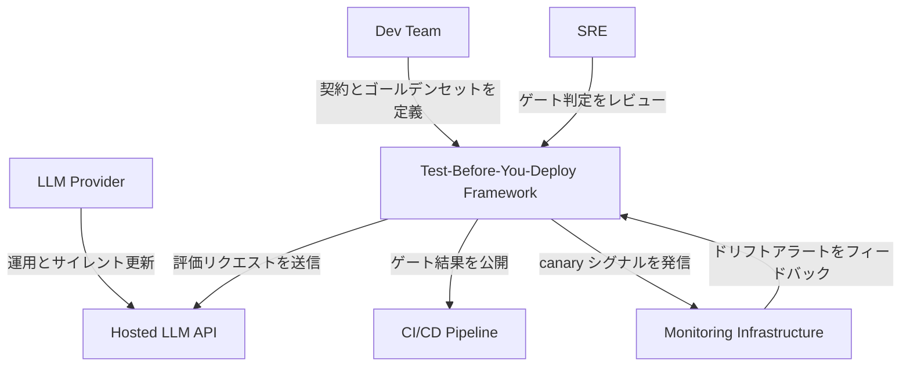
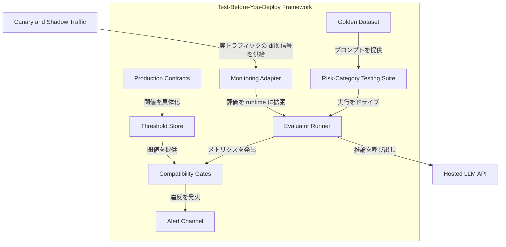
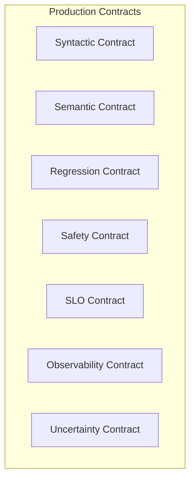
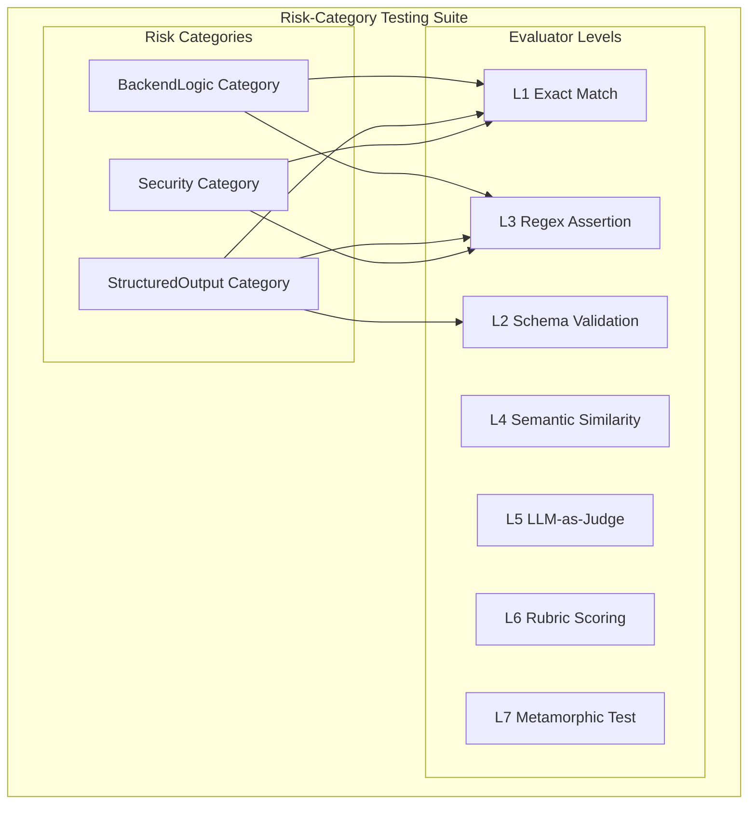
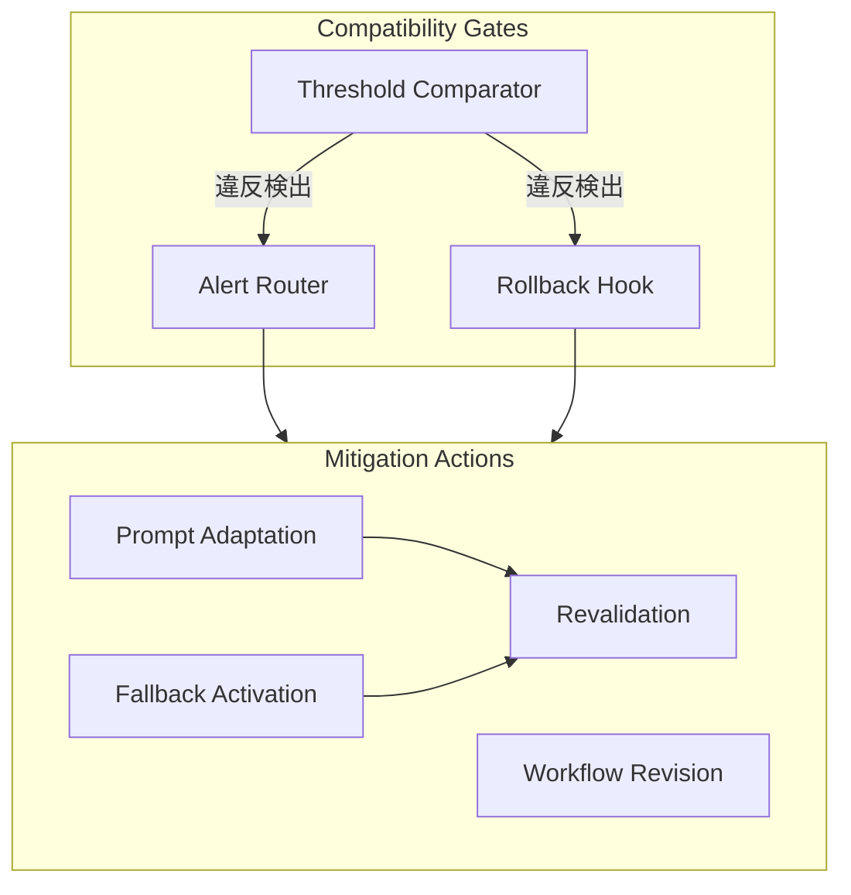
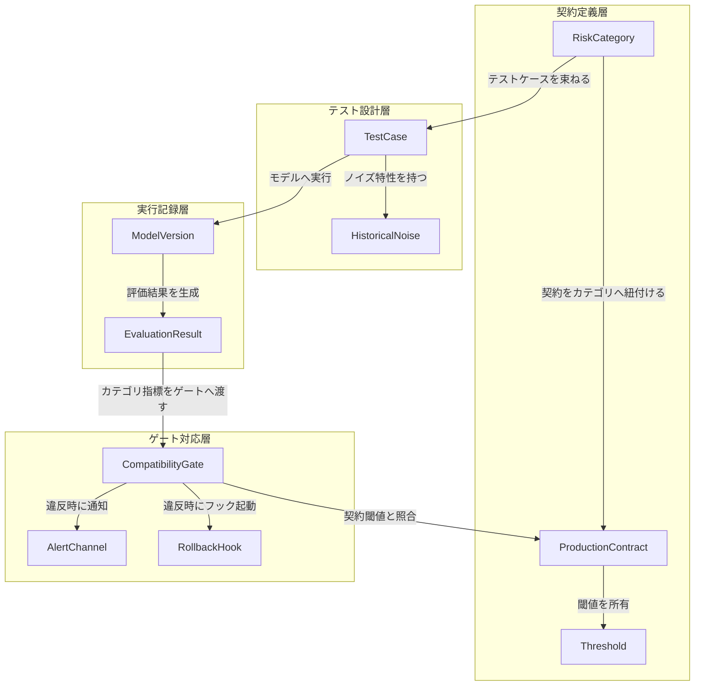
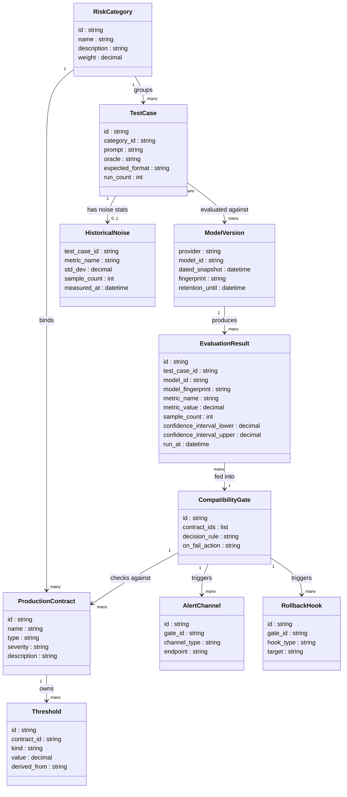

## ■概要

昨日まで通っていた JSON parse が突然落ちる。先週まで pass していた認証コード生成テストが今朝の CI で fail する。モデル ID は何も変えていないのに、です。これは provider が裏側でモデルを更新したサイレント更新の典型症状で、OpenAI、Anthropic、Google Vertex AI、Amazon Bedrock、Azure OpenAI などホスト型 LLM すべてで起き得ます。下流アプリケーションは予告なく挙動ドリフト（behavioral drift）にさらされます。

従来のソフトウェアサプライチェーン管理は「依存ライブラリのバージョンを固定すれば挙動が固定される」という前提に立ちます。ホスト型 LLM はこの前提を根本的に崩します。日付付きモデル ID（dated snapshot）を pin（固定）しても、固定されるのはモデル ID の一部に限られます。serving stack（推論時の safety filter、post-training patch、quantization、routing 層）は pin の対象外であり、同名バージョン内の挙動変動が実証されています。

Chishti, Oyinloye, Li (2026) の論文 *Test Before You Deploy: Governing Updates in the LLM Supply Chain*（arXiv:2604.27789、LLMSC 2026 @ FSE 2026）は、この問題を「provider 側の責任問題」ではなく「**consumer 側が制御すべきソフトウェアサプライチェーンのガバナンス問題**」として再定義します。提案フレームワークは以下の 3 層で構成されます。

| 層  | 名称                              | 役割                                                                                     |
| --- | --------------------------------- | ---------------------------------------------------------------------------------------- |
| 1   | Production Contracts              | 測定可能な閾値付きの振る舞い契約を宣言的に明文化                                         |
| 2   | Risk-Category-Based Testing Suite | デプロイリスク観点でテストをグループ化し、カテゴリ単位で独立評価                         |
| 3   | Compatibility Gates               | CI/CD パイプライン上でカテゴリ指標と契約閾値を機械的に比較し、違反時にデプロイをブロック |

学術系譜は「問題発見（Chen 2023）→ 理論化（Ma 2024 / Wang 2024）→ モデル側緩和（Apple MUSCLE 2024）→ 運用ガバナンス（Liu 2025 / Chishti 2026）」と推移しており、本論文は consumer 側ガバナンスの最新提案にあたります。Wang et al. (2024) の "LLM Supply Chain: A Research Agenda" が提示した open question のうち、本論文は「ホスト型 LLM の継続更新を下流アプリ側でどうゲートするか」という運用層の課題に直接応答します。

### ●関連手法との比較

| 手法                              | アプローチ                                                       | 主体     | 介入時点           | 強み                                    | 弱み                                                 |
| --------------------------------- | ---------------------------------------------------------------- | -------- | ------------------ | --------------------------------------- | ---------------------------------------------------- |
| Champion/Challenger 評価          | 新旧モデルを同一データで性能比較                                 | consumer | デプロイ前評価     | 実装が簡単                              | 総合スコアがカテゴリ固有の劣化を隠蔽                 |
| A/B モデル切替                    | 本番トラフィックを新旧に分割                                     | consumer | デプロイ後観測     | 実ユーザー反応を直接観測                | 劣化を本番に露出してから検知                         |
| Attestation 系（Tan et al. 2026） | provider が学習・リリース主張に対する attestation を発行         | provider | リリース前認証     | provider 側での透明性確保               | provider の協力が前提                                |
| Provider 側 weight pinning        | provider が特定バージョンの weight を固定                        | provider | 更新制御           | consumer 側の追加作業不要               | provider の裁量に完全依存                            |
| MUSCLE（Echterhoff et al. 2024）  | fine-tuning 時に negative flip を抑制                            | provider | 学習フェーズ       | negative flip を最大 40% 削減           | ホスト型 API には適用不可                            |
| Test-Before-You-Deploy（本論文）  | contracts × risk category × CI/CD ゲートで consumer 側が機械検証 | consumer | デプロイ前ブロック | provider 非依存・カテゴリ固有の劣化捕捉 | テストスイート設計・閾値校正コストを consumer が負担 |

## ■特徴

- **Consumer 側の自律的ガバナンス**: provider の更新通知や attestation に依存せず、consumer 側で互換性検証を完結
- **Binary ブロック**: 平均値の改善ではなく契約閾値の遵守を最上位に置き、1 つでも違反すればデプロイをブロック
- **Risk Category 単位の局所劣化検出**: 総合スコアでは平均化されて消える局所 regression を捕捉
- **Non-deterministic 環境への閾値設計**: pass-rate、フォーマット適合率、セキュリティ違反率などの統計指標で契約を表現
- **CI/CD 組込み前提**: provider 更新の検知からテスト実行・ゲート判定までを自動化
- **デプロイ文脈固有の契約**: 汎用ベンチマークではなく、アプリ固有の出力フォーマット・業務ルール・セキュリティ制約を取り込む
- **Exploratory validation による実証**: Anthropic Claude シリーズ（Haiku 3.5/4.5、Sonnet 4/4.5、Opus 3/4.5/4.6）を対象に 25 プロンプト × 3 ドメインで検証し、各プロンプトを 3〜5 回実行
  - JSON フォーマット系で regression が顕著（モデル遷移で premature JSON エラー）
  - SQL / 認証ロジックは概ね安定
  - 同一バージョン内（Sonnet 4）でもサイレントな日次変動を観測
  - Sonnet 4.5 は 2 日連続で安定

## ■構造

C4 model（Context / Container / Component の 3 粒度でシステムを記述する図法）に基づき、システムコンテキスト → コンテナ → コンポーネントの 3 段階でフレームワークの内部アーキテクチャを示します。

### ●システムコンテキスト図



| 要素名                           | 説明                                                                                                |
| -------------------------------- | --------------------------------------------------------------------------------------------------- |
| Dev Team                         | アプリケーションを開発し、プロンプトや評価基準を定義するチーム                                      |
| SRE                              | Site Reliability Engineering 担当。デプロイ判断を担い、ゲート結果に基づいてリリースを管理するチーム |
| LLM Provider                     | OpenAI / Anthropic 等、ホスト型 LLM を提供する外部事業者                                            |
| Test-Before-You-Deploy Framework | 3 層からなる consumer 側ガバナンスフレームワーク                                                    |
| Hosted LLM API                   | provider が公開する推論エンドポイント。サイレント更新される                                         |
| CI/CD Pipeline                   | フレームワークが組み込まれるパイプライン。ゲート判定で deploy を制御                                |
| Monitoring Infrastructure        | 本番環境で出力ドリフトを継続観測する基盤                                                            |

### ●コンテナ図



#### Production Contracts コンテナ

| 要素名               | 説明                                                                   |
| -------------------- | ---------------------------------------------------------------------- |
| Production Contracts | モデルが満たすべき振る舞いを測定可能な閾値付きで明文化した宣言的契約群 |
| Threshold Store      | 各契約カテゴリの閾値を保持するストア                                   |

#### Risk-Category Testing Suite コンテナ

| 要素名                      | 説明                                                                            |
| --------------------------- | ------------------------------------------------------------------------------- |
| Risk-Category Testing Suite | デプロイリスク観点でグループ化した評価プロンプト群                              |
| Golden Dataset              | リスクカテゴリ別の評価用プロンプトと期待振る舞いを収録したデータセット          |
| Evaluator Runner            | Golden Dataset をモデルに投入し、カテゴリ単位のメトリクスを算出する実行エンジン |

#### Compatibility Gates コンテナ

| 要素名              | 説明                                                                                        |
| ------------------- | ------------------------------------------------------------------------------------------- |
| Compatibility Gates | カテゴリ別メトリクスを Threshold Store の閾値と比較し、デプロイ可否を binary 判定するゲート |
| Alert Channel       | 閾値違反時に SRE やオペレーターへ通知を送るチャネル                                         |
| Monitoring Adapter  | canary / shadow traffic からの drift 信号を Evaluator Runner に取り込むアダプタ             |

### ●コンポーネント図

#### Production Contracts コンポーネント



| 要素名                 | 説明                                                                                                                   |
| ---------------------- | ---------------------------------------------------------------------------------------------------------------------- |
| Syntactic Contract     | 出力が JSON / XML / 正規表現等の機械可読フォーマットに従うことを縛る契約                                               |
| Semantic Contract      | 値域・参照整合性・業務ルール等の意味的な正しさを縛る契約                                                               |
| Regression Contract    | 主要メトリクスが過去バージョンより許容劣化幅を超えて退行しないことを縛る契約                                           |
| Safety Contract        | PII（個人識別情報）漏洩・toxicity・jailbreak 成功率・不適切 refusal 率の上限を縛る契約                                 |
| SLO Contract           | Service Level Objective に関する契約。p95 レイテンシ・TTFT (Time To First Token)・コスト・トークン数等の性能目標を縛る |
| Observability Contract | トレースに含めるべき必須項目を縛る契約                                                                                 |
| Uncertainty Contract   | 信頼区間付きでメトリクスを報告し、CI 下限が閾値を割ったら alert を出すことを縛る契約                                   |

#### Risk-Category Testing Suite コンポーネント



##### Risk Categories

| 要素名                    | 説明                                                               |
| ------------------------- | ------------------------------------------------------------------ |
| BackendLogic Category     | 認証・SQL 等の複雑なバックエンドロジックを対象とするリスクカテゴリ |
| StructuredOutput Category | JSON フォーマット適合を対象とするリスクカテゴリ                    |
| Security Category         | 生成コード中の脆弱パターン検出を対象とするリスクカテゴリ           |

##### Evaluator Levels

| 要素名                 | 説明                                                                   |
| ---------------------- | ---------------------------------------------------------------------- |
| L1 Exact Match         | 出力と期待値の完全一致を判定                                           |
| L2 Schema Validation   | JSON Schema 妥当性・必須キー集合・値型の一致を判定                     |
| L3 Regex Assertion     | 正規表現やヒューリスティック assertion で必須要素や値域を検査          |
| L4 Semantic Similarity | embedding cosine 類似度・BLEU・BERTScore 等で意味的近さを判定          |
| L5 LLM-as-Judge        | LLM に binary pass/fail またはペアワイズ比較を判定させる               |
| L6 Rubric Scoring      | Prometheus / G-Eval 等のルーブリックで多軸スコアリング                 |
| L7 Metamorphic Test    | 入力の等価変換に対して出力性質が保たれるかをメタモルフィック関係で検査 |

#### Compatibility Gates コンポーネント



| 要素名               | 説明                                                                       |
| -------------------- | -------------------------------------------------------------------------- |
| Threshold Comparator | カテゴリ別メトリクスを契約閾値と照合し、適合か違反かを判定                 |
| Alert Router         | 閾値違反時に Alert Channel を通じて担当者へ通知を振り分ける                |
| Rollback Hook        | 閾値違反時に旧バージョンへの切り戻しをトリガーするフック                   |
| Prompt Adaptation    | 新バージョンの振る舞いに合わせてプロンプトを修正する緩和アクション         |
| Workflow Revision    | 評価ワークフローや契約定義を見直す緩和アクション                           |
| Fallback Activation  | 違反が解消されるまで旧バージョンまたは代替モデルへ切り替える緩和アクション |
| Revalidation         | 緩和アクション適用後に再度テストスイートを実行して契約適合を確認           |

## ■データ

### ●概念モデル



| エンティティ名     | 役割                                                         |
| ------------------ | ------------------------------------------------------------ |
| ProductionContract | デプロイ安全性の行動要件を閾値付きで宣言する契約単位         |
| Threshold          | 合否判定の閾値。絶対値・相対値・信頼区間下限の 3 種          |
| RiskCategory       | 同じデプロイリスク観点のテストケースをグループ化する分類単位 |
| TestCase           | 評価に使用するプロンプトと期待値の組み合わせ                 |
| HistoricalNoise    | 同一テストケースを繰り返し実行した際の出力ばらつき統計       |
| ModelVersion       | 評価対象となるホスト型 LLM のスナップショット情報            |
| EvaluationResult   | 1 回の評価実行で得られたカテゴリ単位の指標レコード           |
| CompatibilityGate  | カテゴリ指標を契約閾値と比較し、デプロイ採否を決定するゲート |
| AlertChannel       | ゲート違反を通知する送信先                                   |
| RollbackHook       | ゲート違反時に起動するロールバックまたは差し止め処理         |

### ●情報モデル



主要属性の補足。

| エンティティ       | 属性                      | 型      | 説明                                                                                                       |
| ------------------ | ------------------------- | ------- | ---------------------------------------------------------------------------------------------------------- |
| ProductionContract | type                      | string  | syntactic / semantic / regression / safety / SLO のいずれか。Category が複数 Contract を束ねる片方向の所有 |
| ProductionContract | severity                  | string  | critical / major / minor 等で表す違反時の重大度                                                            |
| Threshold          | kind                      | string  | absolute / relative / ci_lower のいずれか                                                                  |
| Threshold          | derived_from              | string  | 相対閾値の場合の比較基準モデルバージョンまたは期間の識別子                                                 |
| RiskCategory       | weight                    | decimal | カテゴリ全体評価における相対的な重要度                                                                     |
| TestCase           | run_count                 | int     | 非決定性吸収のための 1 テストケースあたり実行回数。論文実験では 3〜5 回                                    |
| HistoricalNoise    | std_dev                   | decimal | 繰り返し実行で観測された指標の標準偏差                                                                     |
| ModelVersion       | fingerprint               | string  | モデル行動的特徴を要約したコンパクト表現                                                                   |
| EvaluationResult   | confidence_interval_lower | decimal | 指標値の 95% 信頼区間下限                                                                                  |
| CompatibilityGate  | decision_rule             | string  | 全契約違反の AND 条件など、採否決定ロジックの記述                                                          |
| CompatibilityGate  | on_fail_action            | string  | block / flag / escalate のいずれか                                                                         |
| AlertChannel       | channel_type              | string  | email / webhook / slack 等                                                                                 |
| RollbackHook       | hook_type                 | string  | traffic_hold / model_pin / revalidate 等                                                                   |

## ■構築方法

### ●必須パラメータ一覧

| パラメータ                    | 形式 / 値                                                                                                       | 注記                             |
| ----------------------------- | --------------------------------------------------------------------------------------------------------------- | -------------------------------- |
| モデル ID (OpenAI)            | `gpt-4o-YYYY-MM-DD`（例: `gpt-4o-2024-08-06`）                                                                  | alias 禁止                       |
| モデル ID (Anthropic)         | `claude-{family}-{tier}-{major}-{minor}-YYYYMMDD`                                                               | 日付付き ID 必須                 |
| モデル ID (Vertex AI)         | モデルにより `-001` / `-002` の固定 version ID あり（例: `gemini-2.5-pro-002`）。alias は `-latest` / `-stable` | alias は本番禁止                 |
| `response_format`             | `{"type": "json_schema", "json_schema": ...}`                                                                   | 抽出・分類タスクのみ適用         |
| `fail-on-threshold`           | 80–100（整数、パーセント）                                                                                      | promptfoo-action の入力値        |
| golden dataset 規模 (PR)      | 50–300 件（層化抽出）                                                                                           | カテゴリ比率を維持               |
| golden dataset 規模 (staging) | 1,000–10,000 件                                                                                                 | フルセット評価                   |
| historical noise サンプル数   | N = 20                                                                                                          | 同一プロンプト・同一モデルで反復 |

### ●前提条件

- Python 3.10 以上（DeepEval / Inspect AI の最低要件）
- Node.js 18 以上（promptfoo の最低要件）
- 評価対象プロバイダの API キーを GitHub Actions Secrets に登録
- リポジトリ構成は以下のとおり

```
.
├── prompts/             # プロンプトテンプレート
├── evals/               # 評価設定ファイル
├── tests/
│   └── llm/             # DeepEval / pytest テストファイル
├── schemas/             # JSON Schema ファイル
├── golden/              # golden dataset
└── scripts/
    └── check_cost.py    # トークン・コスト予算チェック
```

### ●評価ツールの選択

compatibility gate には目的に応じてツールを使い分けます。

| ツール         | ライセンス | 主用途                               | CI 適性 | 選定基準                                                         |
| -------------- | ---------- | ------------------------------------ | ------- | ---------------------------------------------------------------- |
| **promptfoo**  | MIT        | YAML 宣言型の回帰テスト・モデル diff | ◎       | PR 上で新旧モデルを並列評価したい場合の第一選択                  |
| **DeepEval**   | Apache-2.0 | pytest 互換の LLM eval               | ◎       | 既存 pytest 基盤に統合したい場合                                 |
| **Inspect AI** | MIT        | Sandboxed agent / safety eval        | ○       | pre-deploy / nightly の深い multi-turn / tool 使用シナリオに特化 |

判断フローは「PR ゲートには promptfoo → 既存 pytest があれば DeepEval を追加 → agent / capability eval が必要なら Inspect AI を pre-deploy / nightly に配置」とします。

```bash
npm install -g promptfoo
pip install deepeval
pip install inspect-ai
```

### ●production contract の定義

production contract は「入力プロンプト集合 / 期待振る舞い / 計測指標 / 閾値」の 4 要素で表現します。

```python
# contracts/code_gen.py
from pydantic import BaseModel, Field, model_validator
from typing import Literal

class CodeGenContract(BaseModel):
    output_format: Literal["python", "sql", "json"]
    unit_test_pass_rate: float = Field(ge=0.95)            # Category 1
    json_format_compliance: float = Field(ge=1.0)          # Category 2
    security_violation_rate: float = Field(le=0.0)         # Category 3
    regression_delta_floor: float = Field(default=-0.01)
    pii_leak_count: int = Field(le=0)
    jailbreak_asr: float = Field(le=0.01)
    p95_latency_ms: float = Field(le=3000)
    cost_per_request_usd: float = Field(le=0.01)

    @model_validator(mode="after")
    def validate_thresholds(self):
        assert self.unit_test_pass_rate >= 0.95
        assert self.json_format_compliance >= 1.0
        assert self.security_violation_rate <= 0.0
        return self
```

YAML 形式の契約サマリーは以下のとおり。

```yaml
# evals/contract.yaml
contract:
  version: "1.0"
  task: code_generation
  thresholds:
    backend_logic:
      unit_test_pass_rate:
        absolute_floor: 0.95
        regression_delta: -0.01
    structured_output:
      json_format_compliance:
        absolute_floor: 1.0
        regression_delta: 0.0
    security:
      violation_rate:
        ceiling: 0.0
    performance:
      p95_latency_ms: 3000
      cost_per_request_usd: 0.01
  uncertainty:
    bootstrap_confidence: 0.95
    min_samples_per_category: 50
```

### ●risk category の定義

論文のコード生成シナリオでは以下の 3 カテゴリを使用します。

| カテゴリ   | 内容                                           | 指標                     | 閾値  |
| ---------- | ---------------------------------------------- | ------------------------ | ----- |
| Category 1 | 複雑なバックエンドロジック（認証・SQL）        | unit test pass rate      | > 95% |
| Category 2 | 構造化出力（JSON フォーマット適合）            | format compliance rate   | 100%  |
| Category 3 | セキュリティ監査（生成コード中の脆弱パターン） | security violation count | 0 件  |

RAG QA への拡張例は以下のとおり。

```yaml
# evals/risk_categories.yaml
risk_categories:
  - id: faithfulness
    metrics:
      - faithfulness_score:
          floor: 0.90

  - id: format_compliance
    metrics:
      - schema_validation:
          floor: 1.0

  - id: safety
    metrics:
      - pii_leak_count:
          ceiling: 0
      - toxicity_score:
          ceiling: 0.05
      - jailbreak_asr:
          ceiling: 0.01

  - id: regression
    metrics:
      - accuracy_delta:
          floor: -0.01
```

### ●golden dataset の準備

層化抽出（stratified sampling）でリスクカテゴリ比率を保ちながら作成します。PR ゲート用は 50–300 件、staging 用フルセットは 1,000–10,000 件が目安です。

```python
# scripts/build_golden_dataset.py
import json, random
from pathlib import Path

CATEGORY_TARGETS = {
    "backend_logic": 60, "structured_output": 60,
    "security": 40, "regression": 40,
}

def build_golden_set(source_dir: Path, output_path: Path) -> None:
    dataset = []
    for category, target_count in CATEGORY_TARGETS.items():
        source_file = source_dir / f"{category}.jsonl"
        with open(source_file) as f:
            examples = [json.loads(line) for line in f]
        sampled = random.sample(examples, min(target_count, len(examples)))
        for ex in sampled:
            ex["risk_category"] = category
            dataset.append(ex)
    with open(output_path, "w") as f:
        for item in dataset:
            f.write(json.dumps(item, ensure_ascii=False) + "\n")
```

### ●GitHub Actions ワークフローのセットアップ

```bash
npx promptfoo@latest init
```

PR ゲートワークフローは以下のとおり。

```yaml
# .github/workflows/llm-compat-gate.yml
name: LLM Compatibility Gate
on:
  pull_request:
    paths: ["prompts/**", "evals/**", "src/llm/**", "schemas/**"]

jobs:
  promptfoo-eval:
    runs-on: ubuntu-latest
    permissions:
      pull-requests: write
      contents: read
    strategy:
      matrix:
        model:
          - gpt-4o-2024-08-06
          - gpt-4o-2024-11-20
          - claude-sonnet-4-5-20250929
    steps:
      - uses: actions/checkout@v4
      - uses: actions/cache@v4
        with:
          path: .promptfoo-cache
          key: promptfoo-${{ matrix.model }}-${{ hashFiles('evals/**') }}
      - id: eval
        uses: promptfoo/promptfoo-action@v1
        with:
          config: evals/promptfooconfig.yaml
          github-token: ${{ secrets.GITHUB_TOKEN }}
          fail-on-threshold: "95"
          repeat: "3"
          repeat-min-pass: "2"
          cache-path: .promptfoo-cache
          output-path: results/promptfoo-${{ matrix.model }}.json
        env:
          OPENAI_API_KEY: ${{ secrets.OPENAI_API_KEY }}
          ANTHROPIC_API_KEY: ${{ secrets.ANTHROPIC_API_KEY }}
      - uses: actions/upload-artifact@v4
        with:
          name: promptfoo-results-${{ matrix.model }}
          path: results/promptfoo-${{ matrix.model }}.json

  deepeval-regression:
    runs-on: ubuntu-latest
    needs: promptfoo-eval
    steps:
      - uses: actions/checkout@v4
      - uses: actions/setup-python@v5
        with: { python-version: "3.12" }
      - run: pip install deepeval pytest
      - env:
          OPENAI_API_KEY: ${{ secrets.OPENAI_API_KEY }}
        run: deepeval test run tests/llm/ -c -r 3

  inspect-capability:
    runs-on: ubuntu-latest
    needs: promptfoo-eval
    steps:
      - uses: actions/checkout@v4
      - uses: actions/setup-python@v5
        with: { python-version: "3.12" }
      - run: pip install inspect-ai openai anthropic
      - env:
          OPENAI_API_KEY: ${{ secrets.OPENAI_API_KEY }}
          ANTHROPIC_API_KEY: ${{ secrets.ANTHROPIC_API_KEY }}
        run: |
          inspect eval evals/capability_gate.py \
            --model openai/gpt-4o-2024-08-06 \
            --log-dir logs/capability/ \
            --limit 200

  cost-budget-gate:
    runs-on: ubuntu-latest
    needs: promptfoo-eval
    steps:
      - uses: actions/download-artifact@v4
        with:
          pattern: promptfoo-results-*
          merge-multiple: true
          path: results/
      - run: |
          for f in results/promptfoo-*.json; do
            python scripts/check_cost.py \
              --results "$f" \
              --max-usd 5.0 \
              --max-tokens 500000
          done
```

### ●モデル ID の pin

```yaml
# evals/providers.yaml
providers:
  - id: openai:chat:gpt-4o-2024-08-06        # OpenAI: dated snapshot
    config:
      temperature: 0
      seed: 42
  - id: anthropic:claude-sonnet-4-5-20250929 # Anthropic: 日付付き ID
    config: { temperature: 0 }
  - id: vertex:gemini-2.5-pro-002            # Vertex AI: 固定 version ID
    config: { temperature: 0 }
  - id: bedrock:anthropic.claude-3-5-sonnet-20241022-v2:0 # Bedrock: model ID 直指定
    config: { temperature: 0 }
```

system_fingerprint の変化を検出するスクリプトは以下のとおり。

```python
# scripts/check_fingerprint.py
import json
from pathlib import Path

def assert_fingerprint_stable(current_response: dict,
                              baseline_path: Path = Path(".fingerprints/gpt-4o-2024-08-06.json")) -> None:
    current_fp = current_response.get("system_fingerprint")
    if not baseline_path.exists():
        baseline_path.parent.mkdir(parents=True, exist_ok=True)
        baseline_path.write_text(json.dumps({"fingerprint": current_fp}))
        return
    baseline = json.loads(baseline_path.read_text())
    if baseline["fingerprint"] != current_fp:
        print(f"WARNING: system_fingerprint changed: {baseline['fingerprint']} -> {current_fp}")
```

### ●historical noise の測定

許容劣化幅を設定する前に、同一プロンプト・同一モデルで N=20 回実行して std を計測します。許容幅 = max(2σ, business_tolerance) とします。

```python
# scripts/measure_historical_noise.py
import statistics, json
from typing import Callable

def measure_noise(prompt: str,
                  model_call: Callable[[str], dict],
                  metric_fns: dict[str, Callable[[dict], float]],
                  n_samples: int = 20) -> dict[str, dict[str, float]]:
    results: dict[str, list[float]] = {name: [] for name in metric_fns}
    for _ in range(n_samples):
        response = model_call(prompt)
        for metric_name, fn in metric_fns.items():
            results[metric_name].append(fn(response))

    noise_report = {}
    for metric_name, values in results.items():
        mean = statistics.mean(values)
        std = statistics.stdev(values)
        threshold_2sigma = mean - 2 * std
        noise_report[metric_name] = {
            "mean": round(mean, 4),
            "std": round(std, 4),
            "threshold_2sigma": round(threshold_2sigma, 4),
            "samples": n_samples,
        }
    return noise_report
```

## ■利用方法

### ●新モデル候補の評価

新モデル候補は現本番モデルと並列に実行して diff を取ります。

```bash
npx promptfoo@latest eval \
  -c evals/promptfooconfig.yaml \
  --output results/$(date +%Y%m%d)_candidate_eval.json
```

candidates 設定例は以下のとおり。

```yaml
# evals/candidate_eval.yaml
providers:
  - id: openai:chat:gpt-4o-2024-08-06
    label: "current-prod"
    config: { temperature: 0 }
  - id: openai:chat:gpt-4o-2024-11-20
    label: "candidate-v1"
    config: { temperature: 0 }
tests: golden/pr_gate_200.jsonl
evaluateOptions:
  repeat: 3
  maxConcurrency: 5
  cache: true
```

Inspect AI による capability 評価は以下のとおり。

```python
# evals/capability_gate.py
from inspect_ai import Task, task
from inspect_ai.dataset import json_dataset
from inspect_ai.scorer import model_graded_fact
from inspect_ai.solver import generate

@task
def code_gen_capability():
    return Task(
        dataset=json_dataset("golden/full_10k.jsonl"),
        solver=[generate()],
        scorer=model_graded_fact(model="openai/gpt-4o-2024-08-06"),
    )
```

### ●PR 上での diff 確認

PR を作成すると promptfoo-action が自動で評価を実行し、結果を PR コメントとして投稿します。確認すべき項目は Pass rate / カテゴリ別スコア / コスト差分 / レイテンシ差分です。

PR コメント例は以下のとおり。

```
## promptfoo Evaluation Results
| Model                         | Pass Rate | Cat 1  | Cat 2  | Cat 3 |
| ----------------------------- | --------- | ------ | ------ | ----- |
| gpt-4o-2024-08-06 (current)   | 97.5%     | 98.0%  | 100%   | 100%  |
| gpt-4o-2024-11-20 (candidate) | 95.0%     | 95.5%  | 98.0%  | 100%  |
| Δ                             | -2.5pt    | -2.5pt | -2.0pt | 0pt   |

⚠️ Category 2 (structured output): 98.0% < threshold 100%
→ PR blocked: contract violation in Category 2
```

### ●しきい値違反時のハンドリング

PR ゲートで違反すると promptfoo-action が exit code 1 を返し、required check が失敗してマージがブロックされます。違反後の対処フローは以下のとおり。

1. PR コメントの diff からどのリスクカテゴリで違反したかを特定する
2. プロンプトの修正か候補モデルの再選択かを判断する
3. しきい値が厳しすぎて false alarm が頻発する場合は historical noise 測定を再実施し `threshold_2sigma` を確認する
4. しきい値変更は理由をコントラクトファイルに記録してコミットする

### ●canary 投入前のフルセット評価

staging / pre-deploy ステージで 1,000–10,000 件のフルセット評価を実施してから canary に進みます。

```yaml
# .github/workflows/llm-deploy.yml
name: LLM Pre-Deploy Full Eval
on:
  push:
    branches: [main]

jobs:
  full-eval:
    runs-on: ubuntu-latest
    steps:
      - uses: actions/checkout@v4
      - run: |
          npx promptfoo@latest eval \
            -c evals/full_eval.yaml \
            --output results/full_$(date +%Y%m%d).json
      - run: |
          PASS_RATE=$(jq '.results.stats.successes / (.results.stats.successes + .results.stats.failures) * 100' results/full_$(date +%Y%m%d).json)
          if (( $(echo "$PASS_RATE < 95" | bc -l) )); then
            echo "Full eval failed: ${PASS_RATE}% < 95%"
            exit 1
          fi

  canary-deploy:
    needs: full-eval
    runs-on: ubuntu-latest
    steps:
      - run: |
          ./deploy.sh --model gpt-4o-2024-11-20 \
            --traffic-percent 1 \
            --slo-error-rate 0.01 \
            --slo-p95-latency-ms 4000
```

### ●structured output の使い分け

Category 2（構造化出力）はフォーマット適合率 100% を要求します。ただし全タスクに JSON 強制を適用すると reasoning タスクで精度が低下します（arXiv:2408.02442、EMNLP 2024 Industry）。

| タスクタイプ                       | structured output                   | 理由                                 |
| ---------------------------------- | ----------------------------------- | ------------------------------------ |
| 構造化抽出（請求書・エンティティ） | 推奨: `response_format=json_schema` | 機械パースが必須                     |
| 分類・ルーティング                 | 推奨: `response_format=json_schema` | ラベル完全一致が必要                 |
| ツール呼び出し                     | 推奨: strict tool use               | 引数スキーマ遵守が必須               |
| RAG QA                             | 中立: L2 assertion で検査           | 回答内容が主、フォーマットは補助     |
| 要約                               | 非推奨: 自然言語 → 後処理パース     | reasoning 的処理を含み精度低下リスク |
| コード生成                         | 非推奨: コードブロック → 後処理抽出 | 制約デコーディングが構文と干渉       |
| 自由対話                           | 非推奨: 自然言語出力                | reasoning / creativity を損なう      |

推奨パターン（構造化抽出）は以下のとおり。

```python
import openai
from pydantic import BaseModel

class ExtractedInvoice(BaseModel):
    invoice_number: str
    total_yen: int
    issued_date: str

client = openai.OpenAI()
response = client.chat.completions.parse(
    model="gpt-4o-2024-08-06",
    response_format=ExtractedInvoice,
    messages=[{"role": "user", "content": "Extract invoice data: ..."}],
)
invoice = response.choices[0].message.parsed
```

非推奨パターンと代替は以下のとおり。

```python
# 非推奨: reasoning タスクに JSON 強制
response = client.chat.completions.create(
    model="gpt-4o-2024-08-06",
    response_format={"type": "json_object"},
    messages=[{"role": "user", "content": "Solve step by step: ..."}],
)

# 代替: 自然言語で生成 → 後処理パース
response = client.chat.completions.create(
    model="gpt-4o-2024-08-06",
    messages=[
        {"role": "user",
         "content": "Solve step by step: ... At the end, output 'ANSWER: <value>'"}
    ],
)
import re
match = re.search(r"ANSWER:\s*(.+)", response.choices[0].message.content)
answer = match.group(1).strip() if match else None
```

## ■運用

優先度は以下のとおり。最小構成から段階的に成熟させます。

| 段階                     | 構成                                                                    |
| ------------------------ | ----------------------------------------------------------------------- |
| 最小構成（まず入れる）   | PR gate（promptfoo + DeepEval）+ staging full eval + canary 1〜10%      |
| 成熟構成（半年以内）     | deprecation watcher + judge nightly + meta-eval + multi-vendor failover |
| 拡張構成（必要に応じて） | shadow traffic + golden set 自動 refresh + メタモルフィック MR 拡充     |

### ●4 ステージゲートの運用

論文の 3 コンポーネントを CI/CD に組み込む際の推奨構成は 4 ステージモデルです。

| ステージ             | トリガ                | 主な目的                                               | 評価規模              | 失敗時の挙動     |
| -------------------- | --------------------- | ------------------------------------------------------ | --------------------- | ---------------- |
| pre-commit           | `git commit`          | プロンプト構文・JSON schema・トークン上限の静的検査    | 5〜20 件              | コミット拒否     |
| pre-merge (PR)       | `pull_request`        | プロンプト/評価 diff・ゴールデンセット回帰・コスト予算 | 50〜300 件            | PR ブロック      |
| pre-deploy (staging) | main merge / tag push | フルセット・性能・幻覚・安全性の総合判定               | 1k〜10k 件            | デプロイブロック |
| canary / shadow      | 本番 deploy 後        | 実トラフィックで drift / latency / cost を監視         | 実トラフィック 1〜10% | 自動ロールバック |

要点は以下のとおり。

- pre-commit には L1（exact match）・L2（JSON schema）・L3（regex/必須要素）のみを置く
- judge および human review は pre-merge 以降のオフラインに位置づけ、CI のブロッキングには使わない
- 失敗判定は「fail（ブロック）」と「flag（人間レビュー）」の 2 段階に分ける

### ●canary と shadow traffic

canary ramp の標準手順は 1% → 5% → 25% → 100% で各ステップに一定インターバル（例: 30 分）を設けます。

```bash
./canary.sh --steps=1,5,25,100 --interval=30m \
  --slo-error-rate=0.01 \
  --slo-p95-latency=4000 \
  --slo-cost-per-req=0.002 \
  --slo-refusal-rate=0.05
```

監視 SLO の 4 軸は以下のとおり。

| SLO 指標     | 典型しきい値    | 備考                             |
| ------------ | --------------- | -------------------------------- |
| error rate   | ≤ 1%            | HTTP 5xx + parse failure         |
| p95 latency  | ≤ 4000 ms       | TTFT を含む end-to-end           |
| cost / req   | budget 超過なし | Batch API 割引を考慮した実コスト |
| refusal rate | ≤ 5%            | 正当リクエストへの不当拒否率     |

shadow traffic では本番リクエストを複製して新モデルを裏側で処理します（レスポンスはユーザーに返さない）。本番モデルと新モデルの出力を judge でオフライン比較し、勝率（pairwise win rate）が 45% 以上であることを確認してから canary に移行します。

### ●deprecation watcher と retention 管理

`deprecations.info` の RSS を購読し、OpenAI / Anthropic / Vertex AI / Bedrock / Azure OpenAI の deprecation 情報を一元監視します。retirement 予定日の 90 日前にチームへ警告する CI ジョブを置きます。

```python
# deprecation_watcher.py（nightly cron で実行）
def check_retirements(pinned_models: list[str]) -> list[Alert]:
    alerts = []
    for model_id in pinned_models:
        retirement_date = fetch_retirement_date(model_id)
        days_left = (retirement_date - today()).days
        if days_left <= 90:
            alerts.append(Alert(model_id, days_left, severity="warn"))
        if days_left <= 30:
            alerts.append(Alert(model_id, days_left, severity="critical"))
    return alerts
```

プロバイダ別 retention 保証は以下のとおり。

| プロバイダ        | retirement 前通知                 | weight 保存                                                                                                                                                         |
| ----------------- | --------------------------------- | ------------------------------------------------------------------------------------------------------------------------------------------------------------------- |
| Anthropic         | 通常 6 か月以上                   | 社の存続期間中                                                                                                                                                      |
| OpenAI            | 通常 6 か月程度                   | 非公開                                                                                                                                                              |
| Azure OpenAI (GA) | 最低 60 日前                      | retirement 時の挙動はデプロイ設定依存。`No Auto Upgrade` の場合は hard 410 Gone、`Auto-update to default` / `Upgrade when expired` の場合は自動アップグレードが走る |
| Vertex AI (GA)    | 6 か月以上前に earliest date 予告 | retirement 1 か月前から新規アクセス遮断                                                                                                                             |
| Bedrock           | EOL の最低 6 か月前               | EOL 後は全リージョン不可                                                                                                                                            |

### ●judge nightly 実行と meta-eval

LLM-as-judge は CI ブロッキングには使わず、nightly バッチジョブとして実行します（Hamel Husain Evals FAQ の推奨）。Batch API（50% 割引、24h 以内）でコストを削減します。判定形式は binary pass/fail または pairwise に限定し、Likert スコアは drift しやすいため採用しません。

meta-eval（judge を評価する meta レベルの eval）は四半期に 1 回、human spot-check（50〜100 件の人手ラベル）と judge スコアの相関を Pearson / Spearman 係数で測定します。

```python
from scipy.stats import pearsonr, spearmanr

def run_meta_eval(human_labels, judge_scores):
    pearson_r, _ = pearsonr(human_labels, judge_scores)
    spearman_r, _ = spearmanr(human_labels, judge_scores)
    if min(pearson_r, spearman_r) < 0.70:
        raise JudgeDriftAlert(
            f"Judge correlation degraded: Pearson={pearson_r:.2f}, Spearman={spearman_r:.2f}"
        )
```

### ●golden set refresh とメタモルフィック MR 拡充

静的 golden set はモデル更新サイクルで contamination し、測定意味が崩壊します（arXiv:2502.17521）。四半期ごとに以下を実施します。

1. 本番トレースからエラーケースと境界ケースを抽出し、新サンプルを追加する
2. 既存サンプルのラベルをモデル更新後の期待値に合わせて再確認する
3. judge score や embedding 比較の基準を再ベースライン化する

Cho et al. (2025) "Metamorphic Testing of LLMs for NLP" (arXiv:2511.02108) は 191 MR（Metamorphic Relation、メタモルフィック関係。入力を等価変換しても出力性質が保たれることを期待する関係）を 24 NLP タスクでカタログ化しています。代表 MR は以下のとおり。

| MR の種類        | 変換内容                 | 期待される不変条件     |
| ---------------- | ------------------------ | ---------------------- |
| 冠詞追加         | "a" / "the" を入力に追加 | 分類ラベルが変わらない |
| 言語切替         | 日本語 ↔ 英語で同義文    | 感情・意図ラベルが一致 |
| 語順変換         | 主語・述語を入れ替え     | 要約の主旨が保たれる   |
| フィールド順入替 | JSON 入力のキー順を変更  | 抽出値が同一           |

同論文の実証値: 類似度しきい値 0.8・非類似しきい値 0.4 を採用すると、約 56 万件テストで平均 failure rate 18% を観測。さらに traditional testing が見逃した failures のうち 11% を MT が追加で補足できます。

### ●multi-vendor failover

最低 2 系統（例: Anthropic + OpenAI または Anthropic + Bedrock）を常時稼働させます。フェイルオーバー条件は HTTP 5xx が 1 分以内に閾値超過 / p95 latency が 3 倍超 / モデル retirement による hard 410 Gone です。

```python
class MultiVendorRouter:
    PRIMARY  = "claude-sonnet-4-5-20250929"
    FALLBACK = "gpt-4o-2024-08-06"

    def call(self, prompt: str) -> str:
        try:
            return anthropic_call(self.PRIMARY, prompt)
        except (ModelRetiredError, ServiceUnavailableError) as e:
            log_failover(e)
            return openai_call(self.FALLBACK, prompt)
```

Bedrock は SDK の例外型不整合（`ValidationException` が retirement 後に返る: aws-sdk-js-v3 #6424）があるため、model-error 全般でフォールバックする catch を実装します。

## ■ベストプラクティス

「契約・テスト・ゲートを置けば安心」の前提を崩す 8 つの誤解と推奨を、反証エビデンスとともに整理します。一覧は以下のとおり。

| #   | 誤解                                                     | 推奨                                      |
| --- | -------------------------------------------------------- | ----------------------------------------- |
| 1   | dated snapshot pin で挙動が固定される                    | fingerprint 監視と canary を併用          |
| 2   | LLM-as-judge を CI に組めば客観評価できる                | judge は nightly オフラインに置く         |
| 3   | 全タスクに JSON schema 強制で品質が上がる                | reasoning タスクは自然言語 + 後処理パース |
| 4   | Guardrails で PII / jailbreak は防げる                   | defense-in-depth の一層に位置づける       |
| 5   | 一度作った golden set は使い続けられる                   | 四半期 refresh + メタモルフィック MR 常設 |
| 6   | judge プロンプトは長期間使える                           | 四半期に 1 回 meta-eval で相関を測る      |
| 7   | 自前 contracts + tests + gates で規制対応十分            | 第三者評価を加える                        |
| 8   | dated snapshot pin で provider の lifecycle 終了まで安全 | multi-vendor playbook を持つ              |

各項目は「誤解 → 反証 → 推奨」の構造で詳細化します。

### ●dated snapshot pin の限界を前提にする

- **誤解**: dated snapshot を pin すれば挙動が固定される
- **実態**: 得られるのは再現性であり、挙動同一性ではない。serving stack（safety filter / post-training patch / quantization / routing）は pin の対象外
- **反証**: PLOS One 2026-02 縦断研究 / OpenAI Service Terms は API モデル挙動の同一性を保証しない / 本論文の Sonnet 4 内日次変動 / GPT-5.2 frozen drift
- **推奨**: `seed` + `system_fingerprint` を CI で記録し、変化を assert する。canary を常設し fingerprint 変化検出時に即座に回帰テストを再実行する

### ●LLM-as-judge は CI に置かずオフラインで運用する

- **誤解**: LLM-as-judge を CI gate に組み込めば客観的な品質評価ができる
- **反証**: Self-Preference Bias（arXiv:2410.21819）/ CALM framework（arXiv:2410.02736）/ Hamel Husain Evals FAQ / Judging the Judges（arXiv:2604.23178）
- **推奨**: CI には L1〜L3（assertion / schema / regex）のみを置く。judge は nightly バッチでオフライン実行する。CI に組み込む場合の最低条件は judge モデル ≠ 被評価モデル、複数 judge の合議、binary pass/fail（Likert 不使用）

### ●structured output はタスクタイプで使い分ける

- **誤解**: 全タスクに JSON schema を強制すれば出力品質が上がる
- **反証**: Let Me Speak Freely?（arXiv:2408.02442、EMNLP 2024 Industry）は format-restricting instructions が reasoning タスクの精度を低下させると報告
- **推奨**: 抽出・分類・ツール呼び出しでは JSON schema を強制する。reasoning・要約・自由記述では自然言語生成 → 後処理パースを採用する

### ●Guardrails は defense-in-depth の一層に位置づける

- **誤解**: Guardrails を入れれば PII / jailbreak は防御できる
- **反証**: Bypassing LLM Guardrails（arXiv:2504.11168、ACL LLMSEC 2025）は Azure Prompt Shield / Meta Prompt Guard / Protect AI v2 等を対象に Unicode Tags / Emoji Smuggling 等で最大 100% の evasion を実証
- **推奨**: Guardrails は defense-in-depth の一層として位置づける。アプリ側に独立した検出層を重ね、red-team suite に Unicode tags / 絵文字スマグリングのテストケースを含める

### ●静的 eval dataset は腐敗する前提で refresh する

- **誤解**: 一度作った golden set は繰り返し使える
- **反証**: Benchmarking LLMs Under Data Contamination Survey（arXiv:2502.17521）/ Tracking the Moving Target（arXiv:2504.18985）
- **推奨**: golden set を四半期ごとに refresh する。タスク変換に依存しないメタモルフィック MR を常設キーとして維持する

### ●judge ロジックの陳腐化を meta-eval で監視する

- **誤解**: judge プロンプトを一度チューニングすれば長期間使い続けられる
- **反証**: Judging the Judges（arXiv:2604.23178）は過去に指摘された position bias が最新世代では消失と報告
- **推奨**: 四半期に 1 回、human spot-check vs judge スコアの相関を Pearson / Spearman で測定。0.7 未満で見直しを実施する

### ●規制対応は self-assessment を必要条件とし第三者評価を加える

- **誤解**: 自前の contracts + testing + gates を構築すれば規制対応として十分
- **反証**: EU AI Act Article 43 / EESC 推奨 / NIST AI RMF GenAI Profile
- **推奨**: 自前ガバナンスは必要条件。高リスク用途では third-party 評価 / 外部セキュリティ監査 / 規制トラッキングを追加する

### ●provider hard sunset に備え multi-vendor playbook を持つ

- **誤解**: dated snapshot を pin しておけば provider の lifecycle 終了まで安全に使い続けられる
- **反証**: Azure GA でも 18 か月保証で retirement に到達する。`No Auto Upgrade` 設定では hard 410 Gone、`Auto-update to default` 設定では本番が自動アップグレードされ挙動が変わる。gpt-4o は 2026-03-31 に retire し、Standard SKU は gpt-5.1 に自動切替。Bedrock SDK 例外型不整合（aws-sdk-js-v3 #6424）
- **推奨**: Anthropic + OpenAI または Anthropic + Bedrock の最低 2 系統を常時稼働させる。`deprecations.info` RSS とプロバイダ公式メールアラートで retirement 90 日前に CI 警告を発する

## ■トラブルシューティング

| #   | 症状                                                                                                | 原因                                                                                                                                    | 対処                                                                                                                                                                                                                                  |
| --- | --------------------------------------------------------------------------------------------------- | --------------------------------------------------------------------------------------------------------------------------------------- | ------------------------------------------------------------------------------------------------------------------------------------------------------------------------------------------------------------------------------------- |
| 1   | **false alarm 多発**: CI gate が頻繁に fail し、デプロイが滞る                                      | 許容劣化幅が historical noise より小さく、ばらつきをレグレッションと誤判定                                                              | N=20 回実行で std を測定し、許容幅を `max(2σ, business_tolerance)` に再設定。L3 assertion の通過基準を 100% から 90-95% に緩和し、`fail` と `flag` の 2 段判定に切替                                                                  |
| 2   | **CI コスト爆発**: eval 実行に費用がかかりすぎる                                                    | judge を CI に組み込んでいる。全プロンプトをフルセットで毎回実行                                                                        | judge を CI から外して nightly バッチ（Batch API 50% 割引）に移す。PR ゲートは層化抽出した 50〜300 件に絞り、main merge 時にフル 1k〜10k 件を実行するように分離                                                                       |
| 3   | **canary でのみ regression**: staging では問題なかった挙動が canary 後に悪化                        | 合成 eval データが実トラフィック分布を反映していない                                                                                    | shadow traffic を導入し、本番リクエスト複製で新モデルを事前評価。本番トレースからエラーケースを golden set に追加                                                                                                                     |
| 4   | **JSON schema 違反増加**: structured output の parse failure が増加                                 | モデル更新後に constrained decoding の挙動が変化、または reasoning タスクに JSON schema を強制                                          | reasoning タスクは structured output を解除して自然言語生成 + 後処理パースに切替。抽出・分類タスクは schema を維持しつつ Instructor の reask（最大 N=2 回 retry）を導入                                                               |
| 5   | **dated snapshot pin したのに挙動変化**: pin しているはずのモデルで eval が pass から fail に転じる | serving stack が pin の対象外。OpenAI Service Terms は API モデル挙動の同一性を保証せず、サービス改善のための変更を行うことがあると明記 | `seed` + `system_fingerprint` を CI で記録し、変化を assert する。fingerprint 変化を検知したら即座に pre-deploy フルセット eval を再実行。canary を常設し別 provider への fallback を準備                                             |
| 6   | **retirement 通知見逃し**: 突然 hard 410 Gone (Azure) や `ValidationException` (Bedrock) が発生する | deprecations.info / RSS / メールアラートを未設定                                                                                        | `deprecations.info` RSS 購読とプロバイダ公式メールアラートを設定。CI nightly ジョブで `retirement_date - today()` を計算し、90 日前に warn・30 日前に critical を発報。Bedrock では model-error 全般でフォールバックする catch を実装 |
| 7   | **日本語 PII / toxicity 検出精度低下**: 日本語コンテンツで safety eval の false negative が増加     | 英語前提の validator を日本語に流用                                                                                                     | 日本語向けの社内ベンチマークを構築し、evaluator の Recall と Precision を測定。llm-jp-eval / Swallow LLM 評価 / Nejumi LLM Leaderboard の日本語評価軸を参照                                                                           |

## まとめ

Chishti et al. (2026) の Test-Before-You-Deploy フレームワークは、ホスト型 LLM のサイレント更新を consumer 側のサプライチェーンガバナンス問題として再定義し、production contracts / risk-category-based testing / compatibility gates の 3 層で機械的に検証する設計を提示します。本記事ではフレームワーク本体に加え、CI/CD 実装パターン、プロバイダ別バージョン管理、反証エビデンスを踏まえた 8 つのベストプラクティスまでを実装可能なレベルで整理しました。

自社で LLM 更新検知・golden set refresh・CI ゲート設計に取り組んでいる方は、運用上の知見や違うアプローチをコメントで共有いただけると嬉しいです。記事が参考になった場合はリアクションや SNS でのシェアもぜひお願いします！

## ■参考リンク

- 一次論文（本フレームワーク）
  - [Chishti, Oyinloye, Li (2026). Test Before You Deploy: Governing Updates in the LLM Supply Chain. arXiv:2604.27789](https://arxiv.org/abs/2604.27789)
  - [arXiv HTML 版](https://arxiv.org/html/2604.27789)
  - [LLMSC 2026 Workshop](https://llmsc.github.io/)
  - [FSE 2026](https://conf.researchr.org/home/fse-2026)
- 関連学術論文（系譜）
  - [Chen, Zaharia, Zou (2023). How is ChatGPT's behavior changing over time? arXiv:2307.09009](https://arxiv.org/abs/2307.09009)
  - [Ma, Yang, Kästner (2024). (Why) Is My Prompt Getting Worse? CAIN'24, arXiv:2311.11123](https://arxiv.org/abs/2311.11123)
  - [Echterhoff et al. (2024) MUSCLE. arXiv:2407.09435](https://arxiv.org/abs/2407.09435)
  - [Wang et al. (2024). LLM Supply Chain Research Agenda. arXiv:2404.12736](https://arxiv.org/abs/2404.12736)
  - [Liu et al. (2025). Towards the Versioning of LLM-Agent-Based Software. FSE'25](https://dl.acm.org/doi/10.1145/3696630.3728714)
  - [Tan et al. (2026). Attesting LLM Pipelines (LLMSC 2026 姉妹論文)](https://eprints.gla.ac.uk/382828/)
  - [Cho et al. (2025). Metamorphic Testing of LLMs for NLP. arXiv:2511.02108](https://arxiv.org/abs/2511.02108)
- 反証論文
  - [Self-Preference Bias in LLM-as-a-Judge. arXiv:2410.21819](https://arxiv.org/abs/2410.21819)
  - [Justice or Prejudice? CALM framework. arXiv:2410.02736](https://arxiv.org/html/2410.02736v1)
  - [Judging the Judges. arXiv:2604.23178](https://arxiv.org/html/2604.23178)
  - [Let Me Speak Freely? EMNLP 2024 Industry. arXiv:2408.02442](https://arxiv.org/html/2408.02442v1)
  - [Bypassing LLM Guardrails. ACL LLMSEC 2025. arXiv:2504.11168](https://arxiv.org/abs/2504.11168)
  - [Benchmarking LLMs Under Data Contamination Survey. arXiv:2502.17521](https://arxiv.org/html/2502.17521v2)
  - [Tracking the Moving Target. arXiv:2504.18985](https://arxiv.org/html/2504.18985v1)
  - [Instability of Safety: Random Seeds and Temperature. arXiv:2512.12066](https://arxiv.org/html/2512.12066v1)
  - [GPT-5.2 Changed Behaviour on Feb 10, 2026](https://genesisclawbot.github.io/llm-drift/blog/gpt-52-behavior-change.html)
  - [EU AI Act Article 43](https://artificialintelligenceact.eu/article/43/)
  - [NIST AI RMF GenAI Profile](https://nvlpubs.nist.gov/nistpubs/ai/NIST.AI.600-1.pdf)
- 評価ツール公式
  - [promptfoo](https://www.promptfoo.dev/)
  - [promptfoo CI/CD Integration](https://www.promptfoo.dev/docs/integrations/ci-cd/)
  - [DeepEval](https://deepeval.com/)
  - [DeepEval Unit Testing in CI/CD](https://deepeval.com/docs/evaluation-unit-testing-in-ci-cd)
  - [Inspect AI (UK AISI)](https://inspect.aisi.org.uk/)
  - [Instructor](https://python.useinstructor.com/)
  - [Guardrails AI](https://www.guardrailsai.com/)
  - [Outlines](https://dottxt-ai.github.io/outlines/)
- プロバイダ公式
  - [OpenAI Deprecations](https://developers.openai.com/api/docs/deprecations)
  - [OpenAI Model Release Notes](https://help.openai.com/en/articles/9624314-model-release-notes)
  - [Anthropic Model Deprecations](https://platform.claude.com/docs/en/about-claude/model-deprecations)
  - [Anthropic Deprecation Commitments](https://www.anthropic.com/research/deprecation-commitments)
  - [Vertex AI Model Versions and Lifecycle](https://docs.cloud.google.com/vertex-ai/generative-ai/docs/learn/model-versions)
  - [Amazon Bedrock Model Lifecycle](https://docs.aws.amazon.com/bedrock/latest/userguide/model-lifecycle.html)
  - [Azure OpenAI Model Retirements](https://learn.microsoft.com/en-us/azure/ai-foundry/openai/concepts/model-retirements)
  - [deprecations.info](https://deprecations.info/)
- インシデント post-mortem
  - [OpenAI Sycophancy in GPT-4o](https://openai.com/index/sycophancy-in-gpt-4o/)
  - [Anthropic April 23 Postmortem](https://www.anthropic.com/engineering/april-23-postmortem)
  - [LLMDrift dataset (Stanford × UC Berkeley)](https://github.com/lchen001/LLMDrift)
  - [Bedrock SDK ValidationException Issue](https://github.com/aws/aws-sdk-js-v3/issues/6424)
- 実務記事
  - [Hamel Husain — Evals FAQ](https://hamel.dev/blog/posts/evals-faq/)
  - [Hamel Husain — LLM-as-Judge](https://hamel.dev/blog/posts/llm-judge/)
  - [Eugene Yan — LLM Evaluators](https://eugeneyan.com/writing/llm-evaluators/)
- 日本企業事例
  - [メルカリ — SRE2.0: No LLM Metrics, No Future](https://engineering.mercari.com/en/blog/entry/20250612-d2c354901d/)
  - [LayerX — 間接的な精度評価によるチューニング](https://tech.layerx.co.jp/entry/2024/11/18/151901)
  - [LINEヤフー — LLMOps 構築事例](https://techblog.lycorp.co.jp/ja/20250409a)
  - [Gaudiy — LLMによるLLMの評価とその評価の評価](https://zenn.dev/gaudiy_blog/articles/b34345aab2949e)
  - [PASH合同会社 — LLM/RAG 回帰テスト CI 設計ガイド](https://www.pashworks.jp/guides/llm-regression-testing-ci)
