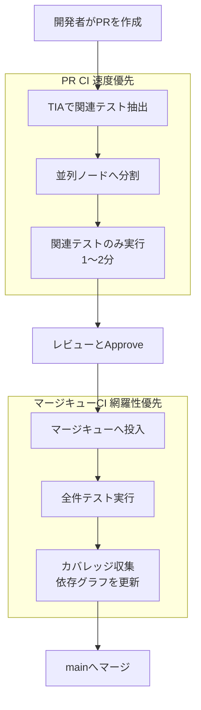

## この記事の対象と得られるもの

CIのテスト実行時間が伸び続け、PRのフィードバックが遅くなっているチームが対象です。

読み終えると、次の3点が判断できます。

- PR時に全テストを回すのをやめる、という設計の意味と前提
- Test Impact Analysis (TIA) とマージキューをどう分業させるか
- この構成が逆効果になる条件と、導入前に測っておくべき数字

題材はタイミーの事例です。同社は約35,000件のテストが月あたり約2,000件増える状況で、PR CIの実行時間を約10分から1〜2分へ短縮しています。事例の詳細は [テストが増えすぎてもう限界だったので、PRで全テストを回すのをやめた話](https://tech.timee.co.jp/entry/2026/08/07/164910) を参照してください。

*この記事の全体像。以下、順に解説します。*

## なぜ「並列数を増やす」では解けないのか

テスト実行時間の遅延には、性質の違う2つの原因があります。

| 原因 | 内容 | 並列化で解けるか |
| --- | --- | --- |
| 1回あたりの総実行量 | テスト件数の増加 | 一時的には解ける |
| 実行回数 | PR数・コミット数の増加 | 解けない |

並列数を増やすと、1回のCI時間は短くなります。しかし総実行量が単調増加するため、並列数も単調増加させ続ける必要があります。CIコストは並列数にほぼ比例するので、この経路は費用が先に限界を迎えます。

さらに、AIコーディング支援の普及でPR数そのものが増えると、実行回数側も同時に膨らみます。「1回を速くする」だけでは追いつきません。

そこで、実行量そのものを減らす選択肢が出てきます。ただし単純に減らすと網羅性が落ちます。ここを解くのが、次に述べる時間軸の分離です。

## 設計の核心: 検出速度と網羅性を時間軸で分ける

考え方はシンプルです。**すべてのタイミングで網羅性を求めない**。

- PR作成時: 速度を優先し、変更に関連するテストだけ実行する
- マージ直前 (マージキュー): 網羅性を優先し、全件テストを実行する

PR時の実行は「開発者への速いフィードバック」が目的です。多少の取りこぼしがあっても、mainへ入る前にもう一度全件で確認できるなら、品質の最終的な保証は損なわれません。

この構成のポイントは、**マージキューが全件実行の場所とカバレッジ更新の場所を兼ねる**ことです。TIAは「どのテストがどのコードを通るか」というカバレッジデータに依存します。そのデータが古くなると関連テストの抽出が外れます。全件実行のたびにカバレッジを収集すれば、依存グラフの陳腐化 (Stale Graph) を専用ジョブなしで防げます。

## 実装で効いている4つの判断

事例の実装には、そのまま真似できる判断が4つあります。

### 1. suiteモードを選ぶ

Datadog TIAには、テストケース単位で判定する `test` モードと、テストファイル単位で判定する `suite` モードがあります。

事例では `suite` モードを採用しています。理由は判定オーバーヘッドです。

- `test` モード: 約35,000テストの判定に約2分
- `suite` モード: 数秒で完了

PR CIの目標が1〜2分のとき、判定だけで2分かかる構成は成立しません。しかも全テストに影響する共通ファイルを変更した場合、2分かけて「全部実行する」という結論に到達します。粒度を粗くして判定を軽くする、という割り切りです。

### 2. 判定を先に済ませ、その結果を分割する

テストフレームワークのgem組み込みスキップ機能を使うと、各並列ノードが自分の担当分をロードしてからスキップ判定します。結果として、スキップだらけのノードと実行だらけのノードが生まれ、並列の意味が薄れます。

事例では順序を入れ替えています。

1. `ddtest plan` で実行対象のテストファイル一覧を先に確定する
2. その一覧を `split-test` に渡し、実行時間ベースで35並列へ均等分割する

「絞ってから分ける」ことで、ノード間の実行時間のばらつきを抑えています。

### 3. 空ノードにもレポートを出す

絞り込みの結果、担当テストが0件になる並列ノードが発生します。このときテスト結果レポートが出力されないと、レポートを集約する後続ジョブが失敗します。

対策は、**空のダミーJUnitレポートを出力する**ことです。地味ですが、TIAを並列CIへ組み込むときにほぼ必ず踏む箇所です。

### 4. PR全体の差分で判定する

TIAはコミット間の差分を見て関連テストを選びます。素朴に組むと最新コミットの差分だけが評価され、PRの初期コミットで加えた変更に対するテストが漏れます。

事例では、GitHub APIで分岐点 (`merge-base`) を取得し、その分岐点を親としたコミットを作ってから判定させています。これにより「PR全体の変更」が1つの差分として扱われます。

なお、マージキュー側では全件実行を強制する必要があります。カバレッジ収集を有効にすると自動スキップも同時に働くため、事例ではRSpecの `define_derived_metadata` で全テストにスキップ不可のメタデータを付与し、確実に全件実行させています。設定でスキップを止められない場合に、テストフレームワーク側から押さえるという発想です。

## この構成が逆効果になる条件

強力な構成ですが、前提が崩れると悪化します。導入前に次の3点を確認してください。

### Flaky Testがあるとマージキューが凍る

マージキューは複数PRをまとめて先読み実行 (Speculative Execution) します。バッチ内で1件でも失敗すると、後続PRの結果が無効化され、再実行が連鎖します。

Flaky Testの発生率がわずかでも、実行対象が全件でバッチが長いほど、1バッチに不安定なテストが混入する確率は上がります。連鎖的な再実行が始まると、キューが詰まり、削減したはずのCIコストが戻ってきます。

**この構成の前提条件は、Flaky Testの検出と隔離の仕組みが先にあること**です。順序を逆にしないでください。

### PR数が増えるとマージキューが律速する

PR CIを1〜2分にしても、マージキューは全件テストを直列に処理します。1日のPR数が数百件規模になると、ボトルネックがPR CIからマージキューへ移動するだけになります。

TIAの効果を「PR CIの短縮幅」だけで評価すると、この移動を見落とします。マージ完了までの時間で測ってください。

### 動的な言語・非コード変更では取りこぼす

TIAはコードの依存関係をもとに関連テストを選びます。次のケースでは依存関係を追えず、偽陰性 (関連テストの取りこぼし) が起きやすくなります。

- リフレクションやメタプログラミングを多用する動的言語
- 非同期処理をまたぐ呼び出し
- 設定ファイル・IaC・DBマイグレーションなど、コード解析の対象外となる変更

そのため、マージキューでの全件実行は「念のため」ではなく**設計上必須の構成要素**です。PR CIの高速化だけを取り入れ、全件実行の置き場所を用意しない構成は、単なる品質低下になります。

## 自分の環境で始める手順

いきなり全面導入せず、次の順で判断材料を作ることを勧めます。

1. **現状を測る**
   - PR作成からCI完了までの時間 (中央値と95パーセンタイル)
   - マージキュー投入からマージ完了までの時間
   - Flaky Testの発生率と、それによる再実行の回数・コスト
2. **前提を満たす**
   - Flaky Testの検出・隔離の仕組みを先に用意する
   - マージキューを未導入なら、まずマージキューだけを入れて全件実行の置き場所を作る
3. **判定コストを検証する**
   - 判定モードの粒度を変え、判定そのものにかかる時間を測る
   - PR全体の差分 (`merge-base` からの差分) で判定できているか確認する
4. **並列とレポートを整える**
   - 判定結果を先に確定してから並列分割する
   - 対象0件のノードでも後続ジョブが通ることを確認する

1の数字がないまま導入すると、効果も副作用も評価できません。逆に、1を測った段階で「Flaky Testの再実行コストのほうが大きい」と分かることもあります。その場合はTIAより先に手を付けるべき対象がはっきりします。

## まとめ

- CIの遅延は「1回の実行量」と「実行回数」の2軸で起きる。並列化は前者にしか効かず、費用が先に限界を迎える
- TIAとマージキューの組み合わせは、検出速度と網羅性を**時間軸で分離**する設計。PRは速度、マージ直前は網羅性を担う
- 実装の勘所は、判定粒度を粗くする、判定を先に確定してから並列分割する、空ノードにもレポートを出す、PR全体の差分で判定する、の4点
- マージキューでの全件実行は保険ではなく必須要素。偽陰性を前提に置いた設計になっている
- 前提はFlaky Testの隔離。ここが崩れるとマージキューが凍り、削減したコストが戻る
- 導入判断の前に、CI完了までの時間とFlaky Testの再実行コストを測る

この記事が少しでも参考になった、あるいは改善点などがあれば、ぜひリアクションやコメント、SNSでのシェアをいただけると励みになります！

## 参考リンク

- [テストが増えすぎてもう限界だったので、PRで全テストを回すのをやめた話 - Timee Product Team Blog](https://tech.timee.co.jp/entry/2026/08/07/164910)
