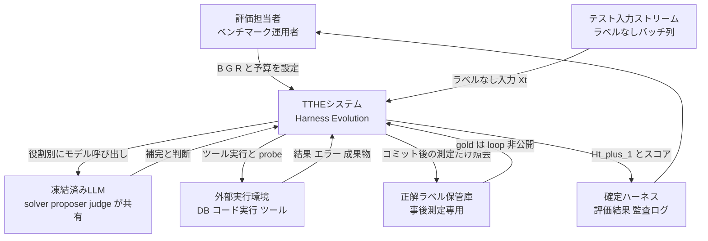
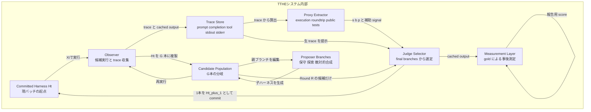
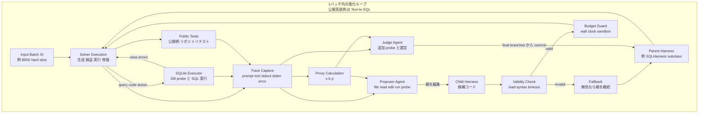
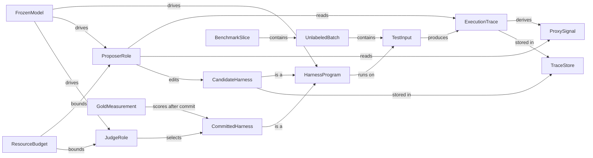
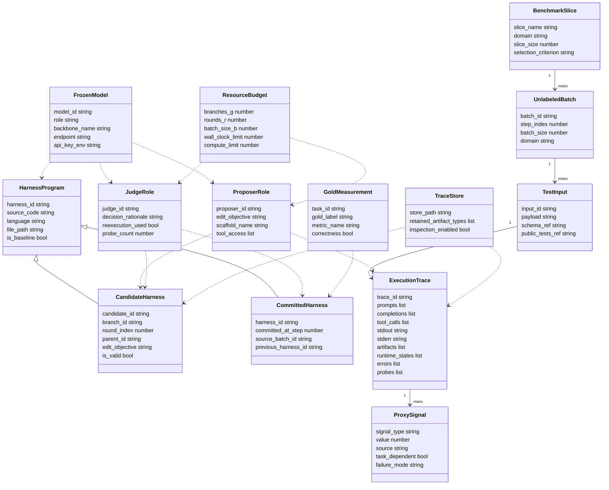

起点: arXiv 論文「TTHE: Test-Time Harness Evolution」(2607.08124) と公開実装 junnie00/TTHE。モデル重みを凍結したまま、ラベルなしの実行トレースだけを手がかりに、エージェントの「ハーネス」を評価実行の最中に進化させる方法論を、構造・データ・構築・運用の観点で整理します。

## 概要

### Test-Time Harness Evolution とは

Test-Time Harness Evolution (TTHE) は、LLM エージェントの挙動を決める「ハーネス」を、評価実行中に更新する方法論です。ここでのハーネスは、コンテキスト構築、ツール呼び出し、中間結果の検証、失敗復旧を担う実行可能な制御プログラムです。論文は、モデル重みを凍結し、金ラベルを proposer や judge に見せず、未ラベルの実行トレースだけからハーネスを進化させる枠組みを提案しています。

従来のプロンプト探索、DSPy のようなパイプライン最適化、ADAS/AFlow のようなワークフロー探索は、多くの場合、開発データ上で事前に最適化し、テスト時には固定成果物を使います。TTHE はこの最適化を評価プロセスの内側へ移します。各バッチでは、現在のハーネス `Ht` を起点に G 本の候補ブランチを R ラウンド進化させ、最後に agentic judge が実行由来の proxy signal だけを用いて 1 本を `Ht+1` としてコミットします。金ラベルはコミット後の測定にだけ使われます。

TTHE の役割分担は次の通りです。

| 役割 | 何をするか | ラベル利用 | 永続性 |
|---|---|---|---|
| solver | 現在のハーネス配下でタスクを解く | なし | 出力とトレースを残す |
| proposer | 自分のブランチのハーネスをコード編集する | なし | 子ハーネスとして次ラウンドへ進む |
| judge | 最終候補から 1 本を選ぶ | なし | 選ばれたハーネスが次バッチへ継承される |
| measurement | コミット後に gold で測定する | あり | 報告と診断にのみ使う |

solver、proposer、judge は、論文上は同じ凍結バックボーン LLM を異なる役割・異なるハーネスで呼び出す存在です。追加の教師モデルを訓練したり、重みを更新したりするわけではありません。したがって、適応の状態は「モデル内部」ではなく「周辺プログラムのソースコード」に残ります。

論文は、text-to-SQL、競技プログラミング、ソフトウェアエンジニアリング、データサイエンスコーディング、エージェント的ツール利用の 5 ドメインで、固定 ReAct 風ベースラインからの改善を報告しています。一方で、実行が成功しても意味的に正しいとは限らないため、proxy reliability が中心的な課題として残ります。

## 特徴

### 適応対象は重みではなくハーネスです

Test-time training や test-time adaptation は、テストストリーム上でモデル重みや正規化統計量を更新します。TTHE は、テスト時に適応するという発想を共有しながら、更新対象を実行可能なハーネスコードへ移します。これにより、値の接地、複数候補生成、実行ベース検証、契約チェック、条件付き復旧分岐などを、単なるプロンプト追記ではなくコード変更として表現できます。

### 単一応答ではなく永続プログラムを改善します

ReAct、Reflexion、Self-Refine、self-debugging、Self-Consistency は、主に 1 つの応答や 1 回の試行を改善します。TTHE は、選ばれたハーネスが次の入力群を支配する永続的なプログラムになる点が異なります。したがって、失敗知見は「今回の回答を直すメモ」ではなく、以後の実行制御に効くコード差分として扱われます。ここでの永続性は、`Ht+1` が単なるバッチ内 winner ではなく、次バッチ `Xt+1` の起点 `Ht` として再利用されるという意味です。

### 事前探索ではなく評価中に探索します

DSPy や GEPA 風の prompt/pipeline optimizer は、明示的な metric や開発セットで事前最適化するのが基本です。TTHE は、評価対象の実データ、実スキーマ、実リポジトリ、実ツール制約に遭遇した時点で、そこで生まれる実行トレースを読んで更新します。このため、開発時には見えない分布差やツール相互作用に反応できます。

### proxy signal を単一報酬に潰しません

論文は、execution health、round-trip consistency、public-test pass rate を「不完全な証拠」として扱います。候補同士が同じ凍結モデルを共有するため、候補間の一致も正しさの証明にはなりません。TTHE は proxy と生トレースを proposer/judge に渡し、judge がコード・トレース・追加 probe を読んで選定する設計です。

### 関連手法との位置づけ

| 系譜 | 適応対象 | 適応タイミング | 信号 | TTHE との差分 |
|---|---|---|---|---|
| Test-time training / TENT | 重み・統計量 | テスト時 | 自己教師・エントロピー | TTHE は重みを更新しません |
| ReAct | 固定 scaffold 内の行動 | 応答生成時 | 人手設計手順 | TTHE は ReAct 風 baseline 自体を更新します |
| Reflexion / Self-Refine | テキスト反省・応答 | 応答後 | 自己フィードバック | TTHE は実行可能プログラムを永続更新します |
| Self-Consistency | 複数推論サンプル | 応答生成時 | 多数決 | TTHE はサンプル集約をハーネス内の方策として獲得し得ます |
| DSPy / GEPA | prompt / pipeline | 評価前 | metric / textual feedback | TTHE は評価中の未ラベル trace で進化します |
| LLM-as-judge | 出力評価 | 評価時 | 評価基準・参照 | TTHE judge は gold なしで trace を調停します |
| Self-Harness / MOSS / Meta-Harness | harness / source | 主に事前・失敗集合起点 | 外部成功信号や curated failures | TTHE は test batch 内で gold を隔離します |

### 5 ドメインの実験像

| ドメイン | 論文内スライス | baseline → TTHE | 代表的に獲得された方策 |
|---|---|---:|---|
| text-to-SQL | BIRD hard 50 問 | 12.0% → 50.0% | DB 値の exact casing 接地、出力形状チェック、実行 self-debug |
| 競技プログラミング | LiveCodeBench hard 60 問 | 30.0% → 38.3% | public tests 失敗後だけ検証・修復へ escalate |
| ソフトウェア工学 | SWE-bench Verified 40 件 | 20.0% → 35.0% | reproduce-first、root cause 宣言、post-edit verification、empty-patch 回避 |
| データサイエンスコード | DS-1000 50 問 | 38.0% → 44.0% | insertion-only output contract、deterministic self-check |
| エージェント的ツール利用 | claw-eval 30 タスク | 48.9% → 69.8% | single-line tool payload、ID citation、exact identifier chaining |

### 重要な caveat

- 実行が成功しても、質問に正しく答えているとは限りません。
- public tests は hidden tests の代替ではありません。
- 論文の測定は transductive です。すなわち、バッチ `Xt` で選ばれたハーネスを同じ `Xt` 上で測定します。
- search budget は非単調です。BIRD では B=10 がピークで、B=5 や B=25 は悪化しました。
- judge は miscalibration を起こします。論文は、より良い候補があったのに悪い候補をコミットする selection regret を報告しています。
- proposer と judge が同一凍結モデルを共有するため、探索を増やしても相関した誤りを繰り返す場合があります。
- 追加計算コストの厳密な倍率は論文本文では体系的に報告されていません。したがって、実務導入では model call 数、wall clock、候補数、timeout 件数を自環境で別途測定する必要があります。

## 構造

### システムコンテキスト図



| 要素名 | 説明 |
|---|---|
| 評価担当者 | バッチサイズ B、分岐数 G、ラウンド数 R、予算を設定します。 |
| テスト入力ストリーム | text-to-SQL や coding tasks などの未ラベル入力列です。 |
| 正解ラベル保管庫 | gold SQL、hidden tests、rubric などを保持します。proposer/judge から隔離します。 |
| TTHEシステム | Observe、Propose、Judge、Score の論理ループです。 |
| 凍結済みLLM | solver、proposer、judge を駆動する同一バックボーンです。 |
| 外部実行環境 | DB、コード実行、mock service、公開テストなどです。 |
| 確定ハーネス | judge が選んだ `Ht+1` と評価結果です。次バッチへ引き継がれます。 |

### コンテナ図



| 要素名 | 説明 |
|---|---|
| Committed Harness Ht | 直前までに確定したハーネスです。初期値は ReAct 風 baseline です。 |
| Observer | ハーネスを batch 上で実行し、出力と trace を集めます。 |
| Trace Store | prompt、completion、tool call、stdout/stderr、artifact、runtime state、error、probe を保持します。 |
| Candidate Population | G 本の固定 lineage です。各 branch は自分の親を編集します。 |
| Proposer Branches | 失敗 trace を読み、candidate harness をコード編集します。 |
| Proxy Extractor | execution health、round-trip consistency、public-test pass rate などを導出します。 |
| Judge Selector | 最終候補群のコード、trace、proxy を見て 1 本を選びます。 |
| Measurement Layer | gold を使う唯一の層です。選定後の報告にだけ使います。 |

### コンポーネント図



| 要素名 | 説明 |
|---|---|
| Input Batch Xt | ラベルなしの現バッチです。 |
| Parent Harness | 分岐 g の編集元です。公開実装では `SQLHarness` を継承する Python class に相当します。 |
| Solver Execution | 凍結 solver がハーネス内で実行される処理です。 |
| SQLite Executor | Text-to-SQL 公開実装における DB 実行環境です。 |
| Public Tests | code task で利用できる公開テストです。完全な oracle ではありません。 |
| Trace Capture | proposer/judge が読む詳細な実行証跡です。 |
| Proxy Calculation | trace から軽量 proxy signal を算出します。 |
| Proposer Agent | 自 branch の親を編集し、子ハーネスを書きます。 |
| Validity Check | 構文、ロード可否、timeout などを確認します。 |
| Fallback | 無効な child を採用せず親を使います。 |
| Judge Agent | final round の候補だけから 1 本を選びます。 |
| Budget Guard | 非停止候補や過剰コストを抑えます。 |

## データ

### 概念モデル



| 要素名 | 説明 |
|---|---|
| FrozenModel | 重みを更新しない単一バックボーン LLM です。 |
| HarnessProgram | モデルを包む実行可能制御プログラムです。 |
| CommittedHarness | judge が確定し、次バッチへ持ち越すハーネスです。 |
| CandidateHarness | proposer が branch ごとに生成する候補です。 |
| ProposerRole | trace と proxy を読み、親ハーネスを編集します。 |
| JudgeRole | final branches の中から 1 本を選びます。 |
| UnlabeledBatch | ラベルなしテストストリームの処理単位です。 |
| TestInput | SQL 質問、coding problem、tool-use task などです。 |
| ExecutionTrace | 実行時に生まれる prompt、tool、stdout、error、artifact などです。 |
| ProxySignal | trace 由来の不完全な信号です。 |
| GoldMeasurement | 選定後の報告用測定です。 |
| BenchmarkSlice | 評価用に固定された hard slice です。 |
| ResourceBudget | B、G、R、timeout、compute cap です。 |
| TraceStore | harness code、trace、decision を保存する領域です。 |

### 情報モデル



| 要素名 | 主な属性 | 出典区分 |
|---|---|---|
| FrozenModel | model_id, role, backbone_name | 論文記述 |
| FrozenModel | endpoint, api_key_env | 公開実装例 |
| HarnessProgram | harness_id, source_code, is_baseline | 論文記述 |
| HarnessProgram | language, file_path | 公開実装例 |
| CandidateHarness | branch_id, round_index, parent_id, edit_objective, is_valid | 論文記述 |
| CommittedHarness | committed_at_step, source_batch_id | 論文記述 |
| ExecutionTrace | prompts, completions, tool_calls, stdout, stderr, artifacts, errors, probes | 論文記述 |
| ProxySignal | signal_type, value, source, task_dependent | 論文記述 |
| ResourceBudget | branches_g, rounds_r, batch_size_b, wall_clock_limit | 論文記述 |
| TraceStore | store_path, retained_artifact_types | 実装案と公開実装例 |

### ProxySignal の意味

| 信号 | 値域 | 論文上の意味 | 典型的な失敗 |
|---|---:|---|---|
| execution health | {0,1} | 出力が実行でき、整形式・形状一貫の結果を返すか | 実行できても質問と粒度が違う |
| round-trip consistency | [0,1] | 出力から逆生成した説明が入力と合うか | 出力由来説明がもっともらしいだけの場合がある |
| public-test pass rate | [0,1] | 公開例・公開テストの通過率 | hidden tests への過適応を検出できない |

公開リポジトリは Text-to-SQL 用の実装例です。README は `reward.py` を label-free proxy signal の実装として説明し、実際の source には SQL 実行健全性や self-consistency、metamorphic evaluation に関連する実装があります。論文本文の一般化された意味論を一次情報源とし、公開実装は SQL 版の参考実装として区別するのが安全です。

## 構築方法

TTHE は論文としては方法論ですが、著者の公開リポジトリは Text-to-SQL 向けの実装例を提供しています。以下のコードとコマンドは、出典が README のものは「公開実装例」、この調査で一般化したものは「実装案/例」として明示します。

### 前提条件

- Python 環境。
- `openai` と `pyyaml`。公開リポジトリの `requirements.txt` に記載されています。
- Claude Code CLI。README は proposer/judge が `claude` CLI 上で動くと説明しています。
- OpenAI 互換 LLM endpoint。DeepSeek、OpenAI、vLLM、gateway などを設定できます。
- BIRD で動かす場合は BIRD Mini-Dev のデータセット。

### 公開実装例: インストール

出典: [TTHE README](https://raw.githubusercontent.com/junnie00/TTHE/main/README.md)

```bash
# 公開実装例: README の Install 手順
git clone https://github.com/junnie00/TTHE.git
cd TTHE
pip install -r requirements.txt
```

### 公開実装例: 設定ファイル

出典: [TTHE README](https://raw.githubusercontent.com/junnie00/TTHE/main/README.md) と [config.example.yaml](https://raw.githubusercontent.com/junnie00/TTHE/main/config.example.yaml)

```bash
# 公開実装例: README の Configure 手順
cp config.example.yaml config.yaml
export OPENAI_API_KEY=sk-...
```

```yaml
# 公開実装例: config.example.yaml の主要キー
llm:
  provider: openai
  base_url: https://api.deepseek.com/v1
  api_key_env: OPENAI_API_KEY
  solver_model: deepseek-chat
  controller_model: deepseek-chat
  temperature: 0.0
  request_timeout: 60

dataset:
  name: demo
  db_id: demo

output_dir: runs
```

設定ファイルの場所は `TTHE_CONFIG=/path/to/config.yaml` で上書きできます。`config.yaml`、`logs/`、`runs/`、実行時に生成される `agents/*.py` は `.gitignore` 対象です。

### 公開実装例: スモークテストと BIRD 実行

出典: [TTHE README](https://raw.githubusercontent.com/junnie00/TTHE/main/README.md)

```bash
# 公開実装例: 内蔵 demo DB の smoke test
python -m tthe.optimize --db demo --cap 5 --max-rounds 3
```

```bash
# 公開実装例: BIRD Mini-Dev を設定した上での実行
python -m tthe.optimize --db california_schools --batch-size 10 --max-rounds 3
```

| フラグ | 記号 | 意味 | 出典 |
|---|---|---|---|
| `--batch-size` | B | 1 バッチで進化させる質問数 | README |
| `--group` | G | 1 ラウンドあたりの proposer 数 | README |
| `--max-rounds` | R | 1 バッチあたりの提案ラウンド数 | README |
| `--initial-harness` | なし | `bare` または `react` | README |

論文の主要 Text-to-SQL 実験は B=10、G=3、R=3 を使います。ただし、この値は自タスクへそのまま移植する定数ではありません。論文の ablation では batch size と search budget が非単調でした。

### 公開実装例: リポジトリ構成

出典: [TTHE README](https://raw.githubusercontent.com/junnie00/TTHE/main/README.md)

```text
TTHE/
├── tthe/
│   ├── optimize.py
│   ├── evolve.py
│   ├── proposer.py
│   ├── evaluator.py
│   ├── reward.py
│   ├── harness_base.py
│   ├── react_baseline.py
│   ├── bridge.py
│   ├── bt.py
│   ├── claude_wrapper.py
│   └── agents/
│       ├── bare.py
│       └── react.py
├── ase/
│   ├── llm.py
│   ├── dataset.py
│   ├── db.py
│   └── demo_db.py
├── config.example.yaml
├── requirements.txt
└── LICENSE
```

### 実装案/例: 既存システムへ移植する Harness interface

出典の考え方: 論文の Harness 定義、公開実装の [`harness_base.py`](https://raw.githubusercontent.com/junnie00/TTHE/main/tthe/harness_base.py)

```python
# 実装案/例: SQL 以外の agent に移植するための Harness interface
from typing import Protocol

class Harness(Protocol):
    id: str
    source_path: str

    def run(self, task_input) -> "ExecutionTrace":
        """モデル呼び出し、ツール呼び出し、検証、復旧を実行し、出力と trace を返す。"""
        ...
```

### 実装案/例: Trace schema

出典の考え方: 論文 Figure 1 と Section 4.3 の trace 構成要素

```python
# 実装案/例: TTHE の trace を他ドメインに移植する schema
from dataclasses import dataclass
from typing import Any

@dataclass
class ExecutionTrace:
    prompts: list[str]
    completions: list[str]
    tool_calls: list[dict[str, Any]]
    stdout: str
    stderr: str
    artifacts: list[str]
    runtime_states: list[dict[str, Any]]
    errors: list[str]
    probes: list[dict[str, Any]]
    final_output: Any
```

### 実装案/例: observe → propose → judge ループ

出典の考え方: 論文 Algorithm 1 と公開実装 [`optimize.py`](https://raw.githubusercontent.com/junnie00/TTHE/main/tthe/optimize.py)

```python
# 実装案/例: TTHE loop のドメイン非依存疑似コード
def tthe_loop(committed_harness, batches, branches_g, rounds_r):
    for batch in batches:
        traces = observe(committed_harness, batch)
        branches = [clone(committed_harness) for _ in range(branches_g)]

        for round_index in range(1, rounds_r + 1):
            next_branches = []
            for branch_id, parent in enumerate(branches):
                child = propose(
                    parent=parent,
                    peer_traces=traces,
                    role=role_for(branch_id),
                )
                next_branches.append(child if is_valid(child) else parent)
            branches = next_branches
            traces.update(observe_all(branches, batch))

        committed_harness = judge(branches, traces, batch)
        report_score_after_commit(committed_harness, batch)

    return committed_harness
```

### 実装案/例: proxy signal extractor

出典の考え方: 論文 Section 4.3、公開実装 [`reward.py`](https://raw.githubusercontent.com/junnie00/TTHE/main/tthe/reward.py)

```python
# 実装案/例: proxy は oracle ではなく evidence として返す
def compute_proxies(trace: ExecutionTrace) -> dict:
    return {
        "execution_health": trace.errors == [] and is_well_formed(trace.final_output),
        "round_trip_consistency": estimate_round_trip_match(trace),
        "public_test_pass_rate": run_public_tests(trace) if has_public_tests(trace) else None,
        "notes": "proxy is evidence, not correctness",
    }
```

## 利用方法

### 公開実装例: demo で最小確認する

TTHE の public repository は SQL ドメインに限定した参照実装です。まず `demo` dataset と mock provider で、ハーネス生成・trace 収集・候補検証・judge 選定の流れだけを確認するのが安全です。

```bash
# 公開実装例: API を使わない smoke test を意図する場合
# config.yaml で llm.provider: mock を設定してから実行する
python -m tthe.optimize --db demo --cap 5 --max-rounds 3
```

### 公開実装例: BIRD の hard slice 風に実行する

```bash
# 公開実装例: BIRD 用 DB を設定済みの場合
export BIRD_DEV_FILE=mini_dev.json
python -m tthe.optimize \
  --db california_schools \
  --batch-size 10 \
  --group 3 \
  --max-rounds 3 \
  --initial-harness react
```

### 公開実装例: Dataset を追加する

出典: [TTHE README](https://raw.githubusercontent.com/junnie00/TTHE/main/README.md)

```python
# 公開実装例: README が示す Dataset interface
class Dataset:
    def get_database(self, db_id) -> Database:
        ...

    def eval_questions(self, db_id):
        ...
```

### 実装案/例: run artifact を保存する

出典の考え方: README の `logs/`、`runs/`、`agents/*.py` への言及

```text
# 実装案/例: バッチごとの成果物ディレクトリ
runs/<run_id>/batch_0007/
├── committed_harness.py
├── candidate_harnesses/
├── traces.jsonl
├── proxies.json
├── judge_decision.md
├── post_commit_gold_score.json
└── rollback_pointer.txt
```

### 実装案/例: baseline と committed harness を比較する

出典の考え方: 論文の fixed baseline vs committed TTHE harness 比較

```bash
# 実装案/例: 固定 baseline の測定
python -m tthe.optimize \
  --db california_schools \
  --batch-size 10 \
  --group 1 \
  --max-rounds 1 \
  --initial-harness react

# 実装案/例: TTHE 進化 loop の測定
python -m tthe.optimize \
  --db california_schools \
  --batch-size 10 \
  --group 3 \
  --max-rounds 3 \
  --initial-harness react
```

## 運用

### 監視観点

| # | 観点 | 何を見るか | 理由 |
|---:|---|---|---|
| 1 | バッチ単位ログ | B/G/R、run id、committed harness | 非単調な search budget を後から検証するため |
| 2 | lineage | branch g と parent-child 関係 | 有用な方策がどの lineage で生まれたかを見るため |
| 3 | proxy/gold 分離 | proposer/judge が gold を見ていない証跡 | label-free 条件を守るため |
| 4 | judge rationale | 採択理由、棄却理由、追加 probe | selection regret を診断するため |
| 5 | cost | model calls、wall clock、timeout | 探索予算の上限を守るため |
| 6 | invalid child | syntax error、load failure、timeout | fallback の頻度を測るため |
| 7 | sandbox | filesystem、network、secret exposure | 提案コードの副作用を抑えるため |
| 8 | post-commit drift | proxy と gold の乖離 | proxy reliability を継続監査するため |

### 実装案/例: JSONL ログ

出典の考え方: 論文 Algorithm 1、Section 5.8 の selection regret 分析

```jsonl
{"event":"observe","batch_id":"B0007","harness_id":"H_t","n_inputs":10,"proxy":{"exec_success_rate":0.90,"public_pass_rate":0.62},"gold_used":false}
{"event":"propose","batch_id":"B0007","round":1,"branch":1,"parent_id":"H_t","child_id":"H_t_g1_r1","role":"conservative-repair","valid":true}
{"event":"propose","batch_id":"B0007","round":1,"branch":2,"parent_id":"H_t","child_id":"H_t_g2_r1","role":"exploration","valid":false,"fallback_to":"H_t"}
{"event":"judge","batch_id":"B0007","final_branches":["H_t_g1_r3","H_t_g2_r3","H_t_g3_r3"],"committed":"H_t_g3_r3","reexecution_probe":true,"gold_used":false}
{"event":"score","batch_id":"B0007","harness_id":"H_t_g3_r3","gold_accuracy":0.60,"measurement_only":true}
```

### 実装案/例: proxy と gold のアクセス制御

出典の考え方: 論文 Section 4.5 の gold isolation

```yaml
# 実装案/例: label-free 条件を壊さないアクセス制御
signals:
  proxy:
    visible_to: [solver, proposer, judge]
    sources:
      - execution_health
      - round_trip_consistency
      - public_tests
      - raw_execution_trace
  gold:
    visible_to: [measurement_pipeline_only]
    sources:
      - hidden_test_suite
      - gold_sql_result_set
      - heldout_rubric
    inject_into_harness: forbidden
    inject_into_trace: forbidden
    audit_log: required
```

### 実装案/例: timeout と fallback guard

出典の考え方: 論文 Section 4.5 の fixed resource / non-terminating candidate exclusion、公開実装 `optimize.py` の wall-time guard

```python
# 実装案/例: 候補実行の timeout と fallback
def observe_with_guard(harness, batch, timeout_sec=90):
    try:
        return run_harness_in_subprocess(harness, batch, timeout=timeout_sec)
    except TimeoutError:
        return TraceResult(status="timeout", errors=["wall clock exceeded"])


def propose_with_fallback(parent, traces):
    child = run_proposer(parent, traces)
    if not child.loads_successfully():
        return parent
    if child.static_risk_score() > 0:
        return parent
    return child
```

### 実装案/例: sandbox policy

出典の考え方: 論文 Section 6 の restricted sandbox caveat

```yaml
# 実装案/例: proposer が生成する候補コードの実行制約
sandbox:
  filesystem:
    writable_paths:
      - workspace/harness_candidates
      - workspace/run_artifacts
    readonly_paths:
      - workspace/input_batches
    denied_paths:
      - workspace/gold
      - home_ssh
      - cloud_credentials
  network:
    egress: deny_all
  process:
    max_wall_clock_sec: 90
    max_memory_mb: 2048
  secrets:
    env_allowlist: []
    scrub_patterns: [API_KEY, TOKEN, PASSWORD, SECRET]
```

## ベストプラクティス

### 誤解・反証・推奨

| 誤解 | 論文の反証 | 推奨 |
|---|---|---|
| proxy は oracle として扱える | 実行成功でも wrong question / wrong shape が起こります | proxy を evidence として扱い、post-commit gold 監査を残します |
| public tests 合格で十分 | public pass でも hidden fail が起こります | public tests は必要条件に留めます |
| 探索予算を増やせば単調に改善する | G/R/B の効果は非単調です | 小さい sweep を先に実施します |
| transductive score は将来性能です | 論文は forward generalization を未検証と明示します | prequential evaluation を主指標に追加します |
| judge の申告スコアは信頼できる | selection regret と miscalibration が報告されています | judge rationale と事後 score の差分を監査します |
| 同一モデルでも多様性は十分です | proposer/judge が相関誤りを繰り返す場合があります | role 多様化、別モデル judge、外部 verifier を検討します |
| accumulate は常に良い | accumulate gain の一部は batch-local specialization です | reset/shuffled/prequential を併用します |
| 良い候補が必ず生成される | pool oracle でも coverage gap が残ります | generation coverage と selection quality を分けて測ります |

### 実装案/例: prequential 評価

出典の考え方: 論文 Section 6 が future work として挙げる prequential scoring

```bash
# 実装案/例: batch t で確定した harness を batch t+1 に適応前評価する
python -m tthe_eval.prequential \
  --stream data/unlabeled_stream.jsonl \
  --committed-harness-log runs/run_20260711/committed_harnesses.jsonl \
  --score-on next_batch_before_adaptation \
  --also-run shuffled_batch_control \
  --output runs/run_20260711/prequential_report.json
```

### 実装案/例: rollback policy

出典の考え方: 論文の proxy unreliability と selection regret

```yaml
# 実装案/例: committed harness の昇格・巻き戻し条件
rollback_policy:
  promote_condition:
    min_holdout_delta: ">= 0.0"
    max_judge_gold_gap: "<= 0.20"
    max_timeout_rate: "<= 0.05"
  rollback_trigger:
    - hidden_score_drop_vs_last_good: "> 10pt"
    - judge_claimed_vs_gold_gap: "> 2/10"
    - timeout_rate: "> 5%"
  action_on_trigger: revert_to_last_known_good_harness
  keep_last_good_versions: 10
```

### 実装案/例: judge checklist

出典の考え方: 論文 Section 5.8 の judge miscalibration 事例

```markdown
<!-- 実装案/例: judge 選定前チェックリスト -->
- [ ] 実行成功と意味的正しさを別々に確認しましたか
- [ ] 出力列数、粒度、型、単位を確認しましたか
- [ ] public tests だけで選んでいませんか
- [ ] raw trace を読み、エラー回復分岐の挙動を確認しましたか
- [ ] 最終 round の全候補を比較しましたか
- [ ] 候補間一致を正しさと誤認していませんか
- [ ] 追加 probe や再実行で judge の直感を検証しましたか
```

## トラブルシューティング

| 症状 | 想定原因 | 診断 | 対処 |
|---|---|---|---|
| 実行は成功するが不正解です | execution health を correctness と誤認しています | gold 事後測定で exec ok / incorrect を抽出します | 出力形状・粒度・制約を judge checklist に追加します |
| judge が悪い候補を commit します | judge miscalibration / selection regret です | pool oracle と committed score を比較します | reexecution probe、別 judge、rollback を追加します |
| 候補が timeout します | proposer が非停止コードを書いています | timeout log と branch lineage を見ます | subprocess guard と parent fallback を必須化します |
| public tests は通るが hidden で落ちます | proxy overfit です | public/hidden の乖離を集計します | public pass を十分条件にせず holdout を用意します |
| B を変えると悪化します | batch evidence と adaptation step の trade-off です | B sweep を作ります | タスク別に B/G/R を測定し直します |
| accumulate で batch-local overfit が出ます | transductive selection に適応しすぎています | shuffled / prequential を比較します | rollback と prequential gate を昇格条件にします |
| trace が巨大です | raw trace を全候補へ渡しています | token 数と log bytes を測ります | truncate と要約を併用し、情報 ablation で影響を測ります |
| secrets が trace に混入します | 候補実行環境へ環境変数が継承されています | `TOKEN` や `API_KEY` を監査 grep します | env allowlist と log scrubber を入れます |
| 探索を増やしても改善しません | 同一モデル由来の相関誤りです | branch diversity と誤答パターンを見ます | role 多様化、別モデル judge、外部 verifier を検討します |
| 公開実装と論文の signal 名がずれます | public repo は SQL 参照実装で、論文は一般方法論です | README、`reward.py`、`evaluator.py` を分けて確認します | 記事では「論文定義」と「公開実装例」を分離して書きます |

## まとめ

Test-Time Harness Evolution は、モデル重みを凍結したまま、未ラベルの実行トレースだけを頼りにエージェントのハーネスを評価中に進化させ、失敗知見を「今回の回答を直すメモ」ではなく「以後の実行制御に効くコード差分」として蓄積する方法論です。導入時は proxy を oracle と誤認せず、gold 隔離・prequential 評価・rollback を運用の柱に据え、B/G/R の非単調性を自環境で必ず測り直してください。

この記事が少しでも参考になった、あるいは改善点などがあれば、ぜひリアクションやコメント、SNSでのシェアをいただけると励みになります！

## 参考リンク

### 一次論文・実装

- [TTHE: Test-Time Harness Evolution arXiv abstract](https://arxiv.org/abs/2607.08124)
- [TTHE arXiv HTML](https://arxiv.org/html/2607.08124)
- [TTHE arXiv PDF](https://arxiv.org/pdf/2607.08124)
- [TTHE public repository](https://github.com/junnie00/TTHE)
- [TTHE README raw](https://raw.githubusercontent.com/junnie00/TTHE/main/README.md)
- [TTHE harness_base.py raw](https://raw.githubusercontent.com/junnie00/TTHE/main/tthe/harness_base.py)
- [TTHE optimize.py raw](https://raw.githubusercontent.com/junnie00/TTHE/main/tthe/optimize.py)
- [TTHE reward.py raw](https://raw.githubusercontent.com/junnie00/TTHE/main/tthe/reward.py)
- [TTHE evaluator.py raw](https://raw.githubusercontent.com/junnie00/TTHE/main/tthe/evaluator.py)

### 関連学術論文

- [ReAct: Synergizing Reasoning and Acting in Language Models](https://arxiv.org/abs/2210.03629)
- [Reflexion: Language Agents with Verbal Reinforcement Learning](https://arxiv.org/abs/2303.11366)
- [DSPy: Compiling Declarative Language Model Calls into Self-Improving Pipelines](https://arxiv.org/abs/2310.03714)
- [GEPA: Reflective Prompt Evolution Can Outperform Reinforcement Learning](https://arxiv.org/abs/2507.19457)
- [Self-Consistency Improves Chain of Thought Reasoning in Language Models](https://arxiv.org/abs/2203.11171)
- [Tent: Fully Test-time Adaptation by Entropy Minimization](https://arxiv.org/abs/2006.10726)
- [Judging LLM-as-a-Judge with MT-Bench and Chatbot Arena](https://arxiv.org/abs/2306.05685)
- [Self-Harness: Harnesses That Improve Themselves](https://arxiv.org/abs/2606.09498)
- [MOSS: Self-Evolution through Source-Level Rewriting in Autonomous Agent Systems](https://arxiv.org/abs/2605.22794)
- [Meta-Harness: End-to-End Optimization of Model Harnesses](https://arxiv.org/abs/2603.28052)
- [Self-Taught Optimizer STOP: Recursively Self-Improving Code Generation](https://arxiv.org/abs/2310.02304)
- [Darwin Gödel Machine: Open-Ended Evolution of Self-Improving Agents](https://arxiv.org/abs/2505.22954)

### 反証・限界関連

- [TTHE arXiv HTML Section 6 Limitations](https://arxiv.org/html/2607.08124)
- [LiveCodeBench: contamination-free code benchmark](https://arxiv.org/abs/2403.07974)

### ベンチマーク・関連ツール

- [BIRD benchmark](https://bird-bench.github.io/)
- [LiveCodeBench site](https://livecodebench.github.io/)
- [SWE-bench paper](https://arxiv.org/abs/2310.06770)
- [SWE-bench repository](https://github.com/SWE-bench/SWE-bench)
- [DS-1000 paper](https://arxiv.org/abs/2211.11501)
- [Claude Code documentation](https://docs.claude.com/claude-code)
