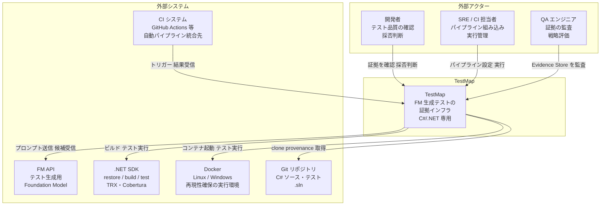
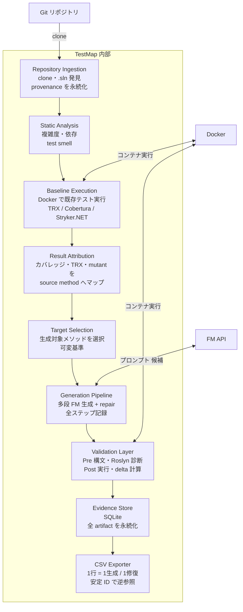
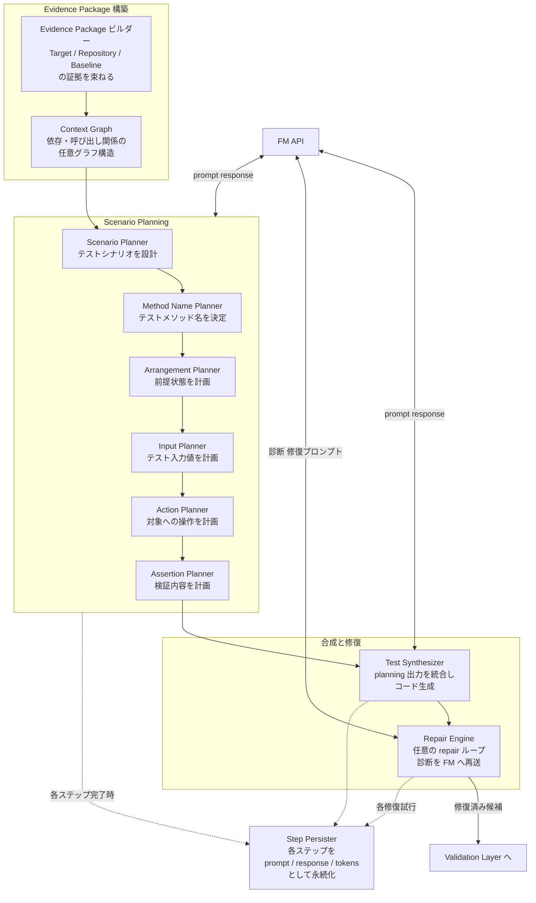
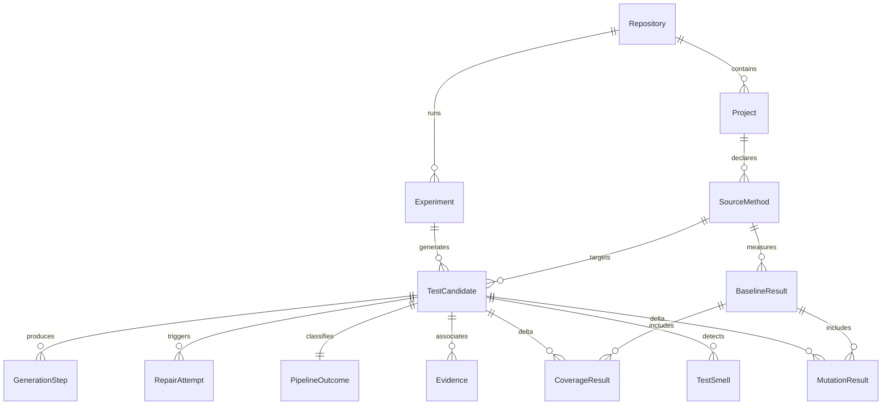
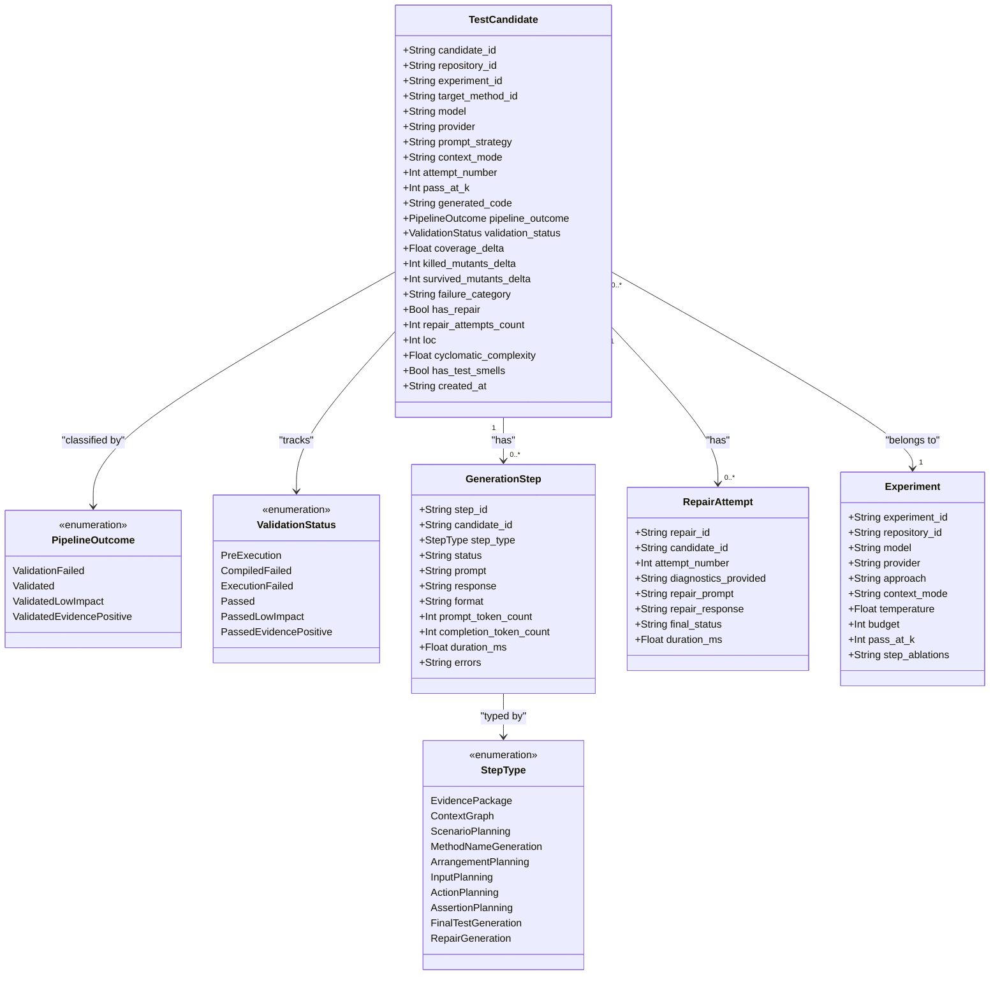
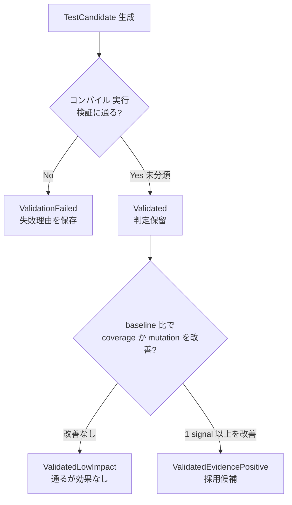

> 調査対象: Hunter Leary, Luke Hanuska, Chris Brown, *TestMap: Evidence Infrastructure for Foundation-Model-Assisted Test Generation*, arXiv 2606.10211（submitted 2026-06-08, cs.SE, CC BY 4.0、AIWare 2026 採録〔arXiv ページ記載〕）
> 調査日: 2026-06-11

## 概要

FM（Foundation Model）にユニットテストを書かせる実践は、もう珍しくありません。一方で「生成されたテストが**良いテストかどうか**」を判断する共通基盤は、まだ存在しません。多くのツールは「コンパイルが通った」「テストが green になった」「カバレッジが増えた」のいずれか一点だけを成果として報告します。しかし、通ること自体は品質を保証しません。assert を緩めればカバレッジは稼げますし、一度通っても flaky なテストかもしれないからです。

**TestMap** は、この問題に「評価指標を改善する」のではなく「**証拠インフラ（evidence infrastructure）**」という角度から答えるプロトタイプです。C#/.NET リポジトリを対象に、FM が生成した各テスト候補の**ライフサイクル全体**を記録します。コンパイル失敗・修復・低インパクト・証拠陽性（evidence-positive）という状態を、カバレッジ差分・ミューテーション結果・修復履歴・プロンプト/レスポンスまでまとめて SQLite に構造化保存します。採用したテストだけでなく、**捨てた候補とその理由**まで残し、後から監査・再現できるようにする点が中核です。

著者の主張を一言にまとめると、こうなります。テスト生成エージェントの評価指標は、**生成成功率ではなく「証拠として採用できるテストの比率」**に寄せるべきだ、という主張です。

ただし注意点があります。本論文はプロトタイプの design case であり、**定量的な有効性評価（実リポジトリでの採用率・カバレッジ改善幅）はありません**。著者自身も「開発者がこの証拠をどう解釈・行動するかは未測定」と Section 5.1 に明記しています。効果の実証は今後の課題として残されています。本記事では TestMap の思想と機構を C4・データモデルとして整理しつつ、限界や反証も過信なく扱います。

## 特徴

TestMap が他の LLM テスト生成研究と異なるのは、**「フィルタの出力（採否）」ではなく「判断材料（証拠）」を一級市民にした**点です。

1. **二値ではなくライフサイクルで記録する**
   生成テストを pass/fail の二値で捨てません。4 つの pipeline outcome に分類します（`ValidationFailed` / `Validated` / `ValidatedLowImpact` / `ValidatedEvidencePositive`）。「通らなかった候補」も「通るが効果のない候補」も、状態と証拠ごと保存します。「通るだけの空テスト」を `ValidatedLowImpact` として可視化できる点が、中核の仕掛けです。

2. **9 種類の証拠を構造化スキーマで保存する**
   Repository / Target / Generation / Execution / Testing-impact / Quality / Failure / Repair / Strategy の 9 カテゴリです（論文 Table 1）。プロンプト・レスポンス・トークン数・実行時間・コンパイラ診断・修復試行までを SQLite に永続化します。CSV（1 行 = 1 生成または 1 修復試行、安定 ID で逆参照可能）でエクスポートします。

3. **実験マトリクスを前提にした設計**
   model × prompt × strategy × pass@k × repair loop × temperature × step ablation を experiment metadata として持ちます。MLflow / Weights & Biases / DVC の sweep（試行も棄却も全部残す）と構造的に同型です。失敗した run も安定 ID で証拠へ逆参照できます。

4. **既存の .NET 品質ツール群を統合する**
   Roslyn（静的解析・複雑度）、TRX（テスト結果）、Cobertura（カバレッジ）、Stryker.NET（ミューテーション）、xNose のカスタム版（C#/xUnit 向け test smell 検出）を 1 つのパイプラインに束ねます。特に Stryker.NET のミューテーション結果を `ValidatedEvidencePositive` の判定基準に組み込みます。

5. **著者自身が 5 つの限界を明示している**
   言語スコープ（C#/.NET 専用）、環境依存による失敗の混入、オラクル品質の限界、flakiness、そして「開発者がこの証拠をどう解釈・行動するかは未測定」という 5 点を Section 5.1 に列挙します。誇張のない設計提案です。

6. **Meta の TestGen-LLM / Assured LLMSE 思想を拡張する**
   Meta の TestGen-LLM は「既存スイートを measurable に改善したか」でフィルタします。TestMap はこの「measurable improvement で評価する」思想を引き継ぎつつ、**フィルタの「出力（採否）」ではなく「判断材料（証拠）」を一級市民にした**点が差分です。Assured LLMSE が「採用テストを出す」のに対し、TestMap は「なぜ採用/不採用なのかを台帳に残す」設計です。

7. **provenance（来歴）の保全を設計思想の軸にする**
   AI 生成コードは、コミットされた瞬間に「どのモデルが・どのプロンプトで・何を棄却して生まれたか」を失います。TestMap は棄却候補まで残して、この来歴の欠落を埋めます。イベントソーシング的な「状態だけでなく状態に至る出来事の列を保存し、replay 可能にする」発想と同型です。

## 構造

C4 model の各段階を「提案フレームワークの論理構造」に読み替えて示します。

### システムコンテキスト図

TestMap がどのアクター・外部システムと接続するかを示します。



| 要素 | 説明 |
|---|---|
| 開発者 | FM 生成テストの採否を証拠に基づいて判断 |
| SRE / CI 担当者 | TestMap をパイプラインへ組み込み、実行管理 |
| QA エンジニア | Evidence Store を後から監査し、生成戦略を評価 |
| TestMap | FM 生成テスト候補のライフサイクル全体を証拠化・永続化 |
| FM API | テストコードを生成するモデル。model / provider / temperature を設定パラメータとして抽象化 |
| .NET SDK | restore → build → test を担当し、TRX・Cobertura XML を出力 |
| Docker | Linux / Windows コンテナで既存テスト・生成テストを再現可能に実行 |
| Git リポジトリ | C# ソース・テスト・.sln を提供。commit / branch が provenance として記録 |
| CI システム | TestMap をトリガーし、Evidence Store の CSV 結果を受信 |

### コンテナ図

TestMap 内部の主要構成要素です。論文 Section 3.3 の 9 段パイプラインを機能ブロックに整理しています。



| コンテナ（対応段） | 説明 |
|---|---|
| Repository Ingestion（段 1） | リポジトリを clone し、Roslyn で .sln を発見。branch / commit を provenance として記録 |
| Static Analysis（段 2） | namespace / class / method / property を解析。LOC・循環的複雑度・test smell（xNose カスタム版）を記録 |
| Baseline Execution（段 3） | Docker で既存テストを実行。TRX・Cobertura XML・Stryker.NET（可能時）を収集 |
| Result Attribution（段 4） | カバレッジを source / method / line / branch へ、TRX をテストメソッドへ、mutation を source 箇所へマップ |
| Target Selection（段 5） | 生成対象メソッドを可変基準（baseline coverage / surviving mutant / related tests / code metrics）で選択 |
| Generation Pipeline（段 6、論文の段名は Test Generation） | FM への多段プロンプト生成。各ステップを prompt / response / tokens / duration ごと記録 |
| Validation Layer（段 7・8） | Pre は構文抽出・Roslyn コンパイラ診断。Post は実行・coverage / mutation 収集・候補単位の evidence 計算 |
| Evidence Store（段 9） | SQLite。全 artifact を永続化 |
| CSV Exporter（段 9 出力） | 1 行 = 1 生成 or 1 修復試行。安定 ID で Evidence Store に逆参照可能 |

### コンポーネント図

Generation Pipeline（段 6）の内部フローです。論文 Section 3.3 の記述から詳細化しています。



| コンポーネント | 説明 |
|---|---|
| Evidence Package ビルダー | Target・Repository・Baseline の証拠を FM へのコンテキストとして束ねる |
| Context Graph | メソッド間の依存・呼び出し関係を任意のグラフ構造で表現（実装詳細は論文記述から推測） |
| Scenario Planner | テスト対象シナリオを設計。多段分解の第 1 ステップ |
| Method Name Planner | テストメソッド名を決定 |
| Arrangement Planner | 前提状態・フィクスチャ・依存の注入方法を計画 |
| Input Planner | テスト入力値を計画 |
| Action Planner | テスト対象メソッドへの操作を計画 |
| Assertion Planner | assert の内容を計画 |
| Test Synthesizer | 各 planning ステップの出力を統合しテストコードを生成 |
| Repair Engine | Validation Layer の診断を FM へ再送し、任意回数の修復ループを実行 |
| Step Persister | 各ステップを prompt / response / tokens / duration ごと SQLite に保存 |

Context Graph の具体的な実装（AST ベース / 呼び出しグラフ / 依存グラフ等）は、論文に記載がありません。「arbitrary context graph」という表現のみで、上記は論文記述からの推測です。

## データ

### 概念モデル

主要エンティティとその関連です。



| エンティティ | 説明 |
|---|---|
| Repository | クローン元リポジトリ。provenance（ブランチ・コミットハッシュ）の起点 |
| Project | リポジトリ内の .sln / .csproj 単位。Roslyn で発見 |
| SourceMethod | テスト生成の対象メソッド（Target）。静的解析で抽出 |
| TestCandidate | FM が生成した 1 テストメソッド候補。ライフサイクル全体を保持 |
| GenerationStep | 多段分解の各ステップ。プロンプト/レスポンス/トークン数/所要時間を永続化 |
| RepairAttempt | コンパイル/実行エラーを診断フィードバックとして FM に再送した修復試行 |
| Evidence | 9 カテゴリを抽象化した証拠コンテナ。TestCandidate に 1 対多で関連 |
| PipelineOutcome | 4 値 enum。TestCandidate に 1 対 1 |
| Experiment | 実験マトリクス（model × approach × context_mode × budget × temperature × step_ablation）を定義 |
| BaselineResult | テスト生成前の既存スイートの実行結果（TRX/Cobertura/Stryker）。比較基準 |
| CoverageResult | メソッド・行・ブランチ単位のカバレッジ。Baseline と Candidate 差分を保持 |
| MutationResult | Stryker.NET によるミューテーション結果。Baseline と Candidate 差分を保持 |
| TestSmell | xNose カスタム版で検出したテストスメル。候補の品質証拠 |

`Evidence` は概念上の抽象コンテナです。実際の SQLite スキーマでは、9 カテゴリを各テーブル（candidates / generation_steps 等）への分散保存で表現します。

#### 9 カテゴリの証拠（論文 Table 1）

各カテゴリが「どの問いに答えるか」を整理します。

| カテゴリ | 回答する問い |
|---|---|
| Repository | どこで・どの条件で評価されたか |
| Target | 何の振る舞いを意図して生成されたか |
| Generation | どのように生成されたか |
| Execution | プロジェクト内で実行できるか |
| Testing-impact | baseline スイートを超える観測可能な価値があるか |
| Quality | 保守可能でレビュー可能か |
| Failure | 失敗候補から何がわかるか |
| Repair | 有効化に何が必要だったか |
| Strategy | このリポジトリでどのアプローチが有効か |

### 情報モデル

TestCandidate を中心とした構造です。



`ValidationStatus` enum は、論文に明示の名称がありません。`PipelineOutcome` の検証フェーズを補完表現したものです（実装案）。

#### PipelineOutcome の判定ロジック



| Outcome | 現場的な意味 |
|---|---|
| `ValidationFailed` | 「動かない」。理由は Failure evidence に保存。修復試行が記録 |
| `Validated` | 「通るが未分類」。Testing-impact 計算が未完または保留 |
| `ValidatedLowImpact` | 「通るだけ」の空テスト・自明テストを可視化する核心カテゴリ |
| `ValidatedEvidencePositive` | coverage delta > 0 または killed_mutants_delta > 0。採用判断の入力になる候補 |

#### CSV 出力の列構成

論文 Section 3.3 段 9 の記述です。1 行 = 1 生成試行 or 1 修復試行で、安定 ID（candidate_id / repair_id）で SQLite の詳細 evidence へ逆参照できます。列名は論文に明示がなく、論文記述からの推測です。

| 列グループ | 列名（推測含む） |
|---|---|
| Provenance | repository_id, branch, commit_hash |
| Target | target_method_id, class_name, method_name, namespace |
| Baseline state | baseline_line_coverage, baseline_branch_coverage, baseline_killed_mutants |
| Generation config | model, provider, approach, context_mode, temperature, budget, pass_at_k |
| Attempt | attempt_number, candidate_id |
| Repair metadata | has_repair, repair_attempts_count, repair_final_status |
| Validation status | validation_status, pipeline_outcome |
| Testing-impact signals | coverage_delta, killed_mutants_delta, survived_mutants_delta |
| Quality | loc, cyclomatic_complexity, smell_types |
| Failure category | failure_category, compiler_errors_summary |

データ設計は 3 つの原則で貫かれています。

- **採用候補だけでなく棄却候補も保存**: `ValidationFailed` / `ValidatedLowImpact` も残し、「なぜ捨てたか」の監査証跡を形成
- **GenerationStep を step 単位で永続化**: prompt ablation や strategy 比較の実験追跡が可能
- **安定 ID による CSV ↔ SQLite の双方向参照**: CSV は集計用の軽量ビュー、詳細は SQLite に保持

## 構築方法

TestMap 本体はプロトタイプ論文で、公開 OSS リポジトリは本調査時点（2026-06-11）で未確認です。以下の構築手順は、**TestMap の思想（9 段パイプライン + 証拠インフラ）を自分の .NET プロジェクトに反映した実装案**です。`【実装案】` と明示します。論文に明記されたコンポーネント（Docker / `dotnet test --collect` / Stryker.NET / TRX / Cobertura / SQLite）は論文由来です。

### 前提ツールのインストール

```bash
# Stryker.NET — ミューテーションテスト（論文 段3 で使用）
dotnet tool install -g dotnet-stryker

# ReportGenerator — Cobertura XML を HTML レポートへ変換（任意）
dotnet tool install -g dotnet-reportgenerator-globaltool
```

`coverlet.collector` は `dotnet new xunit` で生成したプロジェクトにデフォルトで含まれます（Microsoft Learn 記載）。

### Step 1: Docker でベースライン実行環境を用意する【実装案】

論文 Section 3.3 段 3 は「Docker（Linux/Windows コンテナ）で既存テストを実行し、TRX と Cobertura を収集する」と記述しています。

```dockerfile
# 【実装案】 .NET SDK 付き最小イメージ例（論文はイメージを指定していない）
FROM mcr.microsoft.com/dotnet/sdk:8.0
WORKDIR /repo
COPY . .
RUN dotnet restore
```

```bash
# 【実装案】 Docker コンテナを起動してテスト実行
docker build -t testmap-baseline .
docker run --rm \
  -v "$(pwd)/results:/repo/results" \
  testmap-baseline \
  dotnet test --results-directory /repo/results \
              --logger "trx;LogFileName=baseline.trx" \
              --collect:"XPlat Code Coverage"
```

`--logger "trx"` は TRX 形式のテスト結果を、`--collect:"XPlat Code Coverage"` は Coverlet 経由で Cobertura XML を出力します。後者は Microsoft Learn 記載の正式フラグです。

### Step 2: dotnet test で Cobertura カバレッジを収集する

```bash
dotnet test --collect:"XPlat Code Coverage"
```

出力ファイルは `TestResults/{guid}/coverage.cobertura.xml` です。XML 構造の主要フィールドは、論文 段 4「Result Attribution」で使用します。

```xml
<coverage line-rate="0.82" branch-rate="0.73">
  <packages>
    <package name="MyLib">
      <classes>
        <class name="MyLib.MyService" filename="src/MyService.cs">
          <methods>
            <method name="Calculate" signature="(System.Int32)">
              <lines>
                <line number="42" hits="5" branch="True" condition-coverage="100% (2/2)" />
              </lines>
            </method>
          </methods>
        </class>
      </classes>
    </package>
  </packages>
</coverage>
```

### Step 3: Stryker.NET でミューテーションテストを実行する

論文 Section 3.3 段 3 は「可能な場合に Stryker.NET でミューテーションを実行する」と記述しています。

```bash
# テストプロジェクトのディレクトリで実行
dotnet stryker
```

設定ファイル `stryker-config.json` は公式ドキュメント記載の形式です。

```json
{
  "stryker-config": {
    "reporters": ["progress", "html", "json"],
    "coverage-analysis": "perTest"
  }
}
```

慣例的なデフォルト出力先（`StrykerOutput/` 配下、要確認）に JSON / HTML レポートが生成され、killed / survived / timeout の各 mutant が記録されます。

### Step 4: 生成テスト候補を挿入して差分（Δ）を測る【実装案】

論文 Section 3.3 段 6〜8 の思想を反映した実装案です。論文はこの処理の内部実装詳細を公開していません。

```bash
# 【実装案】 生成テストファイルを挿入してから再計測
CANDIDATE_FILE="tests/Generated/MyServiceTests_candidate_001.cs"
TEST_RESULTS_DIR="results/candidate_001"

cp "$CANDIDATE_FILE" "tests/MyServiceTests/"
dotnet test --results-directory "$TEST_RESULTS_DIR" \
            --logger "trx;LogFileName=candidate_001.trx" \
            --collect:"XPlat Code Coverage"
dotnet stryker   # mutation delta を取得

rm "tests/MyServiceTests/$(basename "$CANDIDATE_FILE")"   # ベースラインに復元
```

このループを候補ごとに繰り返し、カバレッジ Δ・mutation score Δ を証拠台帳に記録します。

## 利用方法

### 証拠台帳のスキーマ【実装案】

論文 Section 3.3 段 9 / Section 3.2 の「全 artifact を SQLite に永続化し、CSV で 1 行 = 1 生成試行として出力する」記述を元にした、最小スキーマの実装案です。

```sql
-- candidates テーブル: 1行 = 1生成試行
CREATE TABLE candidates (
    id                  TEXT PRIMARY KEY,   -- 安定 ID（論文: stable ID）
    repo_revision       TEXT NOT NULL,      -- git commit hash
    target_method       TEXT NOT NULL,      -- 例: MyLib.MyService::Calculate
    model               TEXT,
    provider            TEXT,
    approach            TEXT,
    attempt             INTEGER NOT NULL,   -- 修復含む試行番号
    outcome             TEXT NOT NULL
                        CHECK (outcome IN (
                            'ValidationFailed',
                            'Validated',
                            'ValidatedLowImpact',
                            'ValidatedEvidencePositive'
                        )),
    baseline_line_rate  REAL,
    candidate_line_rate REAL,
    coverage_delta      REAL,               -- candidate - baseline
    new_lines_covered   INTEGER,
    baseline_mutation_score  REAL,
    candidate_mutation_score REAL,
    killed_mutants_delta     INTEGER,
    failure_category    TEXT,               -- CompileError / RuntimeError / AssertionFail 等
    repair_attempts     INTEGER DEFAULT 0,
    repair_succeeded    INTEGER,
    smell_count         INTEGER,
    created_at          TEXT NOT NULL DEFAULT (datetime('now'))
);

-- generation_steps テーブル: プロンプト・応答の永続化（論文 段6）
CREATE TABLE generation_steps (
    id              TEXT PRIMARY KEY,
    candidate_id    TEXT NOT NULL REFERENCES candidates(id),
    step_type       TEXT NOT NULL,   -- scenario / method_name / assertion / repair 等
    status          TEXT NOT NULL,   -- success / failed / skipped
    prompt          TEXT,
    response        TEXT,
    format          TEXT,
    token_count_in  INTEGER,
    token_count_out INTEGER,
    duration_ms     INTEGER,
    errors          TEXT
);
```

CSV 出力例（1 行 = 1 生成試行）の実装案です。

```csv
id,repo_revision,target_method,model,provider,approach,attempt,outcome,coverage_delta,new_lines_covered,killed_mutants_delta,failure_category,repair_attempts,smell_count,created_at
cand-001,abc1234,MyLib.MyService::Calculate,gpt-4o,openai,zero-shot,1,ValidatedEvidencePositive,0.12,3,2,,0,0,2026-06-11T08:00:00
cand-002,abc1234,MyLib.MyService::Calculate,gpt-4o,openai,zero-shot,2,ValidationFailed,,,,CompileError,0,0,2026-06-11T08:01:00
cand-003,abc1234,MyLib.MyService::Validate,gpt-4o,openai,few-shot,1,ValidatedLowImpact,0.00,0,0,,0,2,2026-06-11T08:02:00
```

### アウトカム分類ロジック【実装案】

論文 Section 3.2 の 4 分類定義を Python で実装した擬似コードです。

```python
# 【実装案】 TestMap アウトカム分類（論文 Section 3.2 の定義を表現）
from dataclasses import dataclass

@dataclass
class CandidateResult:
    compile_ok: bool
    run_ok: bool
    coverage_delta: float        # 新規カバレッジ増分（0.0 以上）
    killed_mutants_delta: int    # 新規 kill できた mutant 数（0 以上）


def classify_outcome(result: CandidateResult) -> str:
    # コンパイル or 実行に失敗 → ValidationFailed
    if not result.compile_ok or not result.run_ok:
        return "ValidationFailed"
    # 少なくとも 1 つの signal を改善 → EvidencePositive
    if result.coverage_delta > 0.0 or result.killed_mutants_delta > 0:
        return "ValidatedEvidencePositive"
    # 通るが observable な改善なし → LowImpact
    return "ValidatedLowImpact"
```

C# での同等実装案です。

```csharp
// 【実装案】 TestMap アウトカム分類（C#）
public enum TestOutcome
{
    ValidationFailed,
    Validated,
    ValidatedLowImpact,
    ValidatedEvidencePositive
}

public record CandidateResult(
    bool CompileOk, bool RunOk, double CoverageDelta, int KilledMutantsDelta);

public static class OutcomeClassifier
{
    public static TestOutcome Classify(CandidateResult r)
    {
        if (!r.CompileOk || !r.RunOk)
            return TestOutcome.ValidationFailed;
        bool hasGain = r.CoverageDelta > 0.0 || r.KilledMutantsDelta > 0;
        return hasGain
            ? TestOutcome.ValidatedEvidencePositive
            : TestOutcome.ValidatedLowImpact;
    }
}
```

## 運用

### 証拠台帳を CI に組み込む【実装案】

TestMap の SQLite/CSV アウトカムを PR に見せると、「何件生成して何件が EvidencePositive だったか」が merge 判断の入力になります。

```yaml
# 【実装案】 .github/workflows/testmap-evidence.yml
name: TestMap Evidence Report
on:
  pull_request:
    paths:
      - "src/**/*.cs"
      - "tests/**/*.cs"
jobs:
  testmap:
    runs-on: ubuntu-latest
    steps:
      - uses: actions/checkout@v4
      - name: Run TestMap pipeline
        run: dotnet run --project tools/TestMap -- --repo . --output /tmp/testmap-results.csv
      - name: Summarize outcome distribution
        run: python3 scripts/summarize_outcomes.py /tmp/testmap-results.csv > /tmp/testmap-summary.md
      - name: Post summary to PR
        uses: actions/github-script@v7
        with:
          script: |
            const fs = require('fs');
            const summary = fs.readFileSync('/tmp/testmap-summary.md', 'utf8');
            github.rest.issues.createComment({
              issue_number: context.issue.number,
              owner: context.repo.owner,
              repo: context.repo.repo,
              body: summary
            });
```

運用のポイントは 3 点です。

- **ValidatedEvidencePositive 率（以下 EvidencePositive 率）をまず観測指標として追跡する**: 生成候補のうち EvidencePositive になった割合を週次/sprint で追う。率の低下は、対象メソッドの複雑度上昇・プロンプト劣化・モデル変更のシグナル（有効性は未実証のため、強い KPI ではなく観測から始める）
- **ValidationFailed・ValidatedLowImpact はアーカイブして捨てない**: 失敗カテゴリを CSV に蓄積すると「どのメソッドが何回失敗したか」を遡れ、再試行戦略の根拠になる
- **棄却候補を再利用する**: ValidationFailed の repair 試行ログを context として与え、generation matrix を引き継いだ ablation 比較ができる

### mutation / 全証拠保存のコスト管理

ミューテーションテスト（Stryker.NET）は、大規模コードベースで高コストです。

- **差分実行（incremental mutation）**: PR の変更行に対応するメソッドのみ mutation を走らせる。Stryker.NET の `--since:<committish>`（または config の `"since": { "target": "..." }`）で diff-based フィルタを活用
- **サンプリング**: 循環的複雑度が高い・既存カバレッジが低い・最近変更されたメソッドを優先的に Target Selection へ渡す
- **CI スケジュール分離**: 差分 mutation は PR ごと、フル mutation は夜間 scheduled run に回す
- **証拠ストレージ**: 古い experiment（merge 済み）はアーカイブし、メイン SQLite を軽量に保つ

## ベストプラクティス

「誤解 → 反証 → 推奨」で整理します。

### 誤解1: カバレッジが増えれば良いテスト

反証として、LLM 生成テストはミューテーションスコア（欠陥検出力）の面で人間記述テストに及ばない傾向が、複数の研究で報告されています（具体的な数値は研究・データセットにより幅があり、一次出典の再確認が必要）。assert を緩めてカバレッジだけ稼ぐテストが量産されうるからです。実際に Accenture Japan 有志の事例では、カバレッジ目標を与えた Claude Code が 1,300 件・5 万行超の「自作自演テスト」を生成し、ブランチ破棄に至ったと報告されています（Zenn, acntechjp, 2026/03）。

推奨は、ミューテーションを併用して `ValidatedLowImpact` を区別することです。EvidencePositive 率を主要な指標にし、カバレッジ % の数値目標は置きません。

### 誤解2: 全証拠を残せば安心

反証として、著者自身が「開発者が evidence をどう解釈・行動するか（trust calibration・採用判断改善）は未測定」と認めています（論文 Section 5.1 限界 5）。誰も見なければ、構造化ログは無駄なストレージコストになります。ミューテーションは長年「高コストで現場採用が進まない」と批判されており、全証拠保存はそこに運用負荷を上乗せします。

推奨は、**アウトカム分布だけを常時可視化**し、詳細ログはオンデマンド参照に留めることです。PR コメントには「EvidencePositive 率 + Outcome 分布」のサマリのみ出します。

### 誤解3: mutation score が高ければ安全

反証として、生成 mutant の一部が equivalent mutant（元プログラムと意味的に等価で理論上検出不能）になり、その等価判定は一般に決定不能です。mutation score は意味的正しさの完全な指標ではありません（論文 Section 5.1 限界 3 で著者自認）。

推奨は、mutation score を絶対視せず、coverage と mutation score の gap を診断シグナルとして使うことです。score 低下時は「equivalent mutant が多い可能性」と「品質低下」を切り分けます。

### 誤解4: C#/.NET のパターンがそのまま他言語に使える

反証として、TestMap は Roslyn / TRX / Cobertura / Stryker.NET に密結合し、著者が Section 5.1 限界 1 で「言語スコープは C#/.NET 固有」と明記しています。一般化可能性は未検証です。

推奨は、他言語には相当するツールチェーンに置き換えることです（後述の対応表）。4 分類アウトカムと difference signal のコンセプトは移植可能ですが、ツール結合部は別途実装が必要です。

### 国内事例: 食べログの三層品質保証

食べログ（Tabelog Tech Blog 2025/11）は、AI に直接テストを実行させず「コード生成のみ AI 化」する設計を採りました。生成後に複数の検証項目を機械チェックし、AI が「検証失敗 → 自動修正 → 再検証」を反復する三層構造です。この「AI に実行させない」設計は、flaky・偽陽性の混入リスクを下げる現実的な設計です。TestMap の pre-validation（段 7）の実運用版と見なせます。生成精度や実行工数削減についても、同社ブログが具体値を報告しています（数値は同ブログ参照）。

## トラブルシューティング

### 環境依存でテスト失敗が混入する

- **症状**: Baseline Execution（段 3）や Post-Execution Validation（段 8）で、テスト品質と無関係に落ちる。SDK バージョン・OS 差異・外部サービス依存が原因
- **対処**: 論文 Section 5.1 限界 2 の通り「失敗がテスト品質由来か環境由来か」を切り分ける。Docker でベースライン実行を隔離し、外部サービスは test double で置換。環境起因の失敗は `ValidationFailed` でなく別カテゴリで記録する

### flaky 生成テストが evidence positive に混入する

- **症状**: `ValidatedEvidencePositive` に分類されたテストが、CI で断続的に落ちる（タイミング・実行順序・共有状態・乱数・外部資源依存。論文 Section 5.1 限界 4）
- **対処**: 同一テストを複数回実行（例: 3〜5 回を目安）して pass/fail パターンを確認し、常に通るものだけ positive とする。flaky と判定した候補は `ValidatedLowImpact` に降格して記録に残す

### equivalent mutant で mutation score が実態より低く出る

- **症状**: mutation score が期待より低いが、テスト内容はしっかりしているように見える
- **対処**: survived mutant を手動サンプリングして equivalent かを判断する。mutation score を絶対指標にせず「前回比の変化」と「coverage との gap」を診断シグナルに使う。TestMap の EvidencePositive 判定は mutation か coverage の一方でも改善すれば positive なので、mutation だけで判断しない

### C#/.NET 以外のプロジェクトへ適用する

| TestMap の C#/.NET コンポーネント | 他言語での相当ツール |
|---|---|
| Roslyn（静的解析・コンパイル検証） | Java: JavaParser、Python: ast / astroid、JS/TS: ts-morph |
| TRX（テスト結果フォーマット） | JUnit XML（Java/Python）、TAP（Node.js）、pytest JSON report |
| Cobertura XML（カバレッジ） | JaCoCo（Java）、coverage.py（Python）、Istanbul/nyc（JS/TS） |
| Stryker.NET（mutation testing） | PIT（Java）、mutmut（Python）、Stryker JS（JavaScript/TypeScript） |

4 分類アウトカムと evidence signal（coverage delta / killed mutant）のコンセプトは言語非依存です。上記ツールの出力を SQLite に収集する形で、同等の証拠インフラを構築できます。

## まとめ

TestMap は、FM が生成したテストを「通った/通らない」の二値ではなく、候補ごとのライフサイクル（失敗・修復・低インパクト・証拠陽性）とカバレッジ・ミューテーションの証拠として構造化保存するプロトタイプです。評価の軸を「生成成功率」から「証拠として採用できる比率」へ移し、採用テストだけでなく棄却候補とその理由まで残す点に、現場へ転用できる思想があります。

この記事が少しでも参考になった、あるいは改善点などがあれば、ぜひリアクションやコメント、SNSでのシェアをいただけると励みになります！

## 参考リンク

- 一次論文
  - [TestMap: Evidence Infrastructure for Foundation-Model-Assisted Test Generation（arXiv abstract）](https://arxiv.org/abs/2606.10211)
  - [TestMap 論文（HTML 全文）](https://arxiv.org/html/2606.10211)
- 関連学術論文（系譜）
  - [Meta TestGen-LLM（filter pipeline）](https://arxiv.org/abs/2402.09171)
  - [Assured LLM-Based Software Engineering](https://arxiv.org/abs/2402.04380)
  - [TestPilot](https://arxiv.org/abs/2302.06527)
  - [CoverUp](https://arxiv.org/abs/2403.16218)
  - [MuTAP（mutation-guided test generation）](https://arxiv.org/abs/2308.16557)
  - [pass@k 起源（Codex 論文）](https://arxiv.org/abs/2107.03374)
- 反証・限界
  - [LLM 生成テストのソフトウェア進化下での品質評価](https://arxiv.org/abs/2603.23443)
  - [The Difference Between Coverage and Mutation Score（Jain & Le Goues）](https://arxiv.org/abs/2309.02395)
  - [pseudo-tested methods 研究（Vera-Pérez et al., EMSE 2019）](https://hal.science/hal-01867423)
- 関連ツール公式
  - [xNose（C#/.NET test smell 検出器）](https://arxiv.org/abs/2405.04063)
  - [Stryker.NET](https://stryker-mutator.io/docs/stryker-net/introduction/)
  - [Coverlet + dotnet test --collect](https://learn.microsoft.com/en-us/dotnet/core/testing/unit-testing-code-coverage)
  - [ReportGenerator](https://github.com/danielpalme/ReportGenerator)
  - [Roslyn（.NET コンパイラプラットフォーム）](https://github.com/dotnet/roslyn)
  - [PIT（Java mutation testing）](https://pitest.org/)
  - [mutmut（Python mutation testing）](https://mutmut.readthedocs.io/)
  - [Stryker JS（JS/TS mutation testing）](https://stryker-mutator.io/docs/stryker-js/introduction/)
- 国内事例
  - [食べログ三層品質保証（Tabelog Tech Blog 2025/11）](https://tech-blog.tabelog.com/entry/ai-for-qa-automation-test)
  - [acntech 失敗談（Accenture Japan 有志 Zenn 2026/03）](https://zenn.dev/acntechjp/articles/92a2a9af7a671a)
  - [ミューテーションテスト実践（豆蔵デベロッパーサイト）](https://developer.mamezou-tech.com/blogs/2024/12/03/mutation-testing/)
