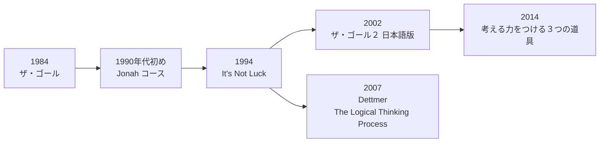
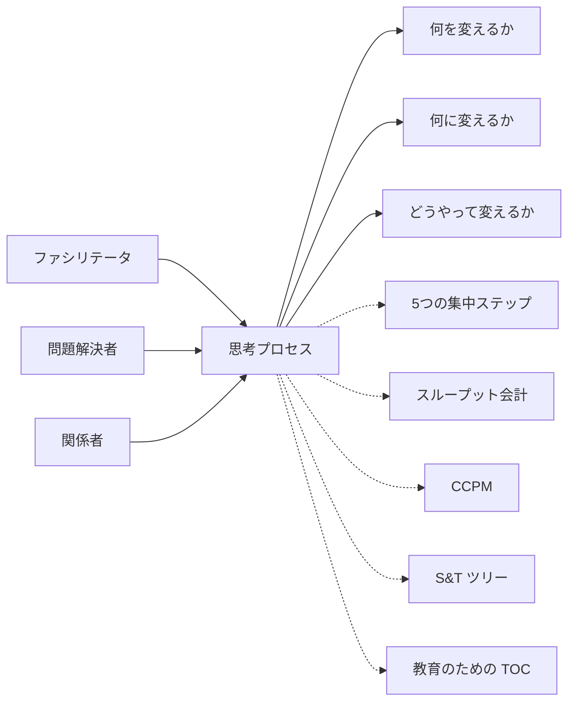
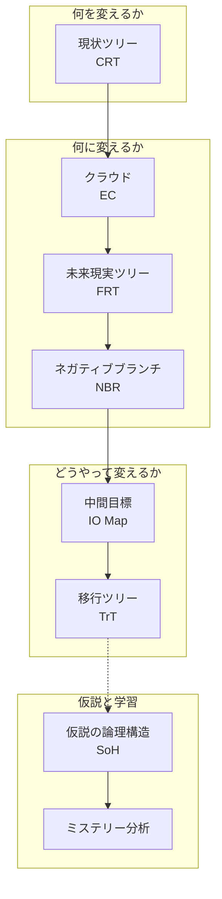
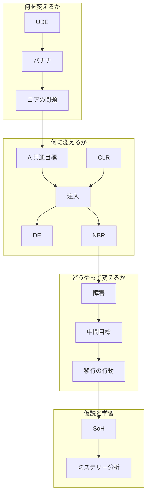
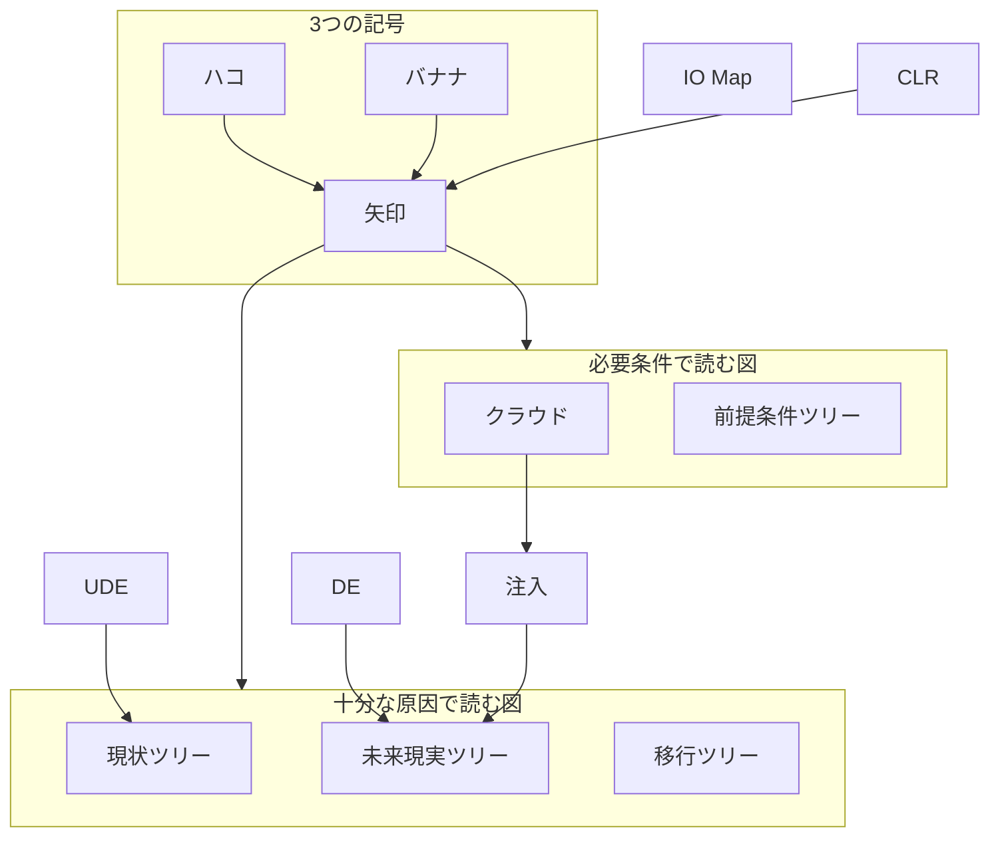
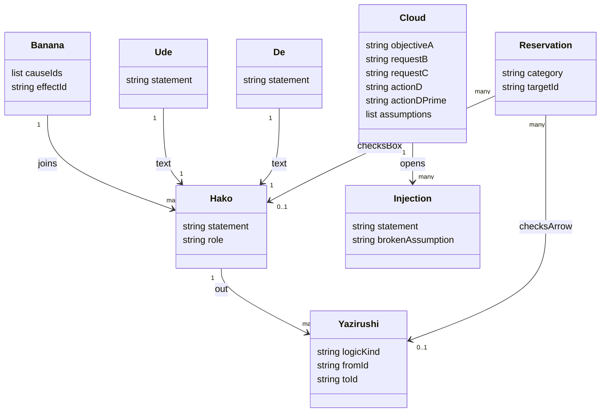

制約理論（TOC）の思考プロセスは、絡み合った問題を原因と結果の図にして、根本原因から解く問題解決手法です。この記事は、ゴールドラットジャパンの用語集「[思考プロセス](https://www.goldratt.co.jp/toc-dictionary/tp)」を起点に、3 つの記号と 8 つのツールの役割、図の読み方、現場で回す手順を整理します。

読み終えると、次のことができるようになります。

- 状況に応じて、8 つのツールのどれから開くかを選べる
- 現状ツリー、クラウド、未来現実ツリーなどを、記号の意味どおりに描いて読み上げられる
- 用語集・岸良論文・TOCICO・Dettmer など資料ごとの呼び名や項目数の違いを踏まえて引用できる

記事中の YAML は、図の要素を構造化して残すための記述例です。ゴールドラットジャパンが公開するスキーマではありません。


*この記事の全体像。以下、順に解説します。*

## 概要

思考プロセスは、エリヤフ・ゴールドラットが開発した全体最適の問題解決手法です。

- 用語集は、発表の場を『ザ・ゴール２　思考プロセス』と書きます。
- 原題は It's Not Luck で、North River Press から 1994 年に出ました。
- [ダイヤモンド社の書誌](https://www.diamond.co.jp/book/9784478420416.html)は、訳者を三本木亮、発行年月を 2002 年 2 月、頁数を 384 と書きます。
- 前作『ザ・ゴール』（1984 年）は、工場の流れと制約への集中を小説で示しました。続編は、企業レベルの問題解決を同じ論理の図で示します。
- 岸良裕司の英語論文（[International Journal of Current Research 10(04), 2018](https://www.goldratt.co.jp/_files/ugd/b40a97_dcc29bd32a024e69b70b70c29954d9cd.pdf)）は、正式な紹介を It's Not Luck とし、1990 年代初めの 2 週間の Jonah コースで教えられていたと書きます。

用語集が示す特徴は、問題を分解して個別に消すやり方とは別の入口にあります。事象を原因と結果でつなぎ、全体像から根本原因を特定します。その原因を解消すると、望ましくない現象がまとめて解消します。

図の記号は 3 つです。

| 記号 | 意味 | 読み上げ |
|---|---|---|
| ハコ | 事象を 1 文で書く | 文をそのまま読む |
| 矢印 | 事象のつながり | 「もし……ならば」 |
| バナナ | 2 つ以上の事象が重なって結果が起きる | 「かつ」 |

[岸良の日本語論文](https://www.goldratt.co.jp/_files/ugd/b40a97_1b006ef2cd9b4dba9042ebb1a52e4aa8.pdf)によると、バナナの名は、ゴールドラットが「かつ」の記号をバナナ形に描いたことに由来します。

思考プロセスが答える問いは、[ゴールドラットジャパンのコンサルティングページ](https://www.goldratt.co.jp/consulting)では次の 3 つです。

1. 何を変えるか
2. 何に変えるか
3. どうやって変えるか

用語集が列挙するツールは 8 つです。

| ツール | 略称 | 用語集・論文上の役割 |
|---|---|---|
| 現状ツリー | CRT | 問題の全体構造を明らかにし、コアの問題を特定する |
| クラウド（エバポレーティング・クラウド） | EC | コアのジレンマを解消する |
| 未来現実ツリー | FRT | ジレンマ解消のあとに起きる未来を描く |
| ネガティブブランチ | NBR | 懸念を先に解消する |
| 中間目標 | IO Map | 実行の妨げとなる障害を避け、目標までの道を作る |
| 移行ツリー | TrT | 実行手順を作る |
| 仮説の論理構造 | SoH | 因果で仮説を作る |
| ミステリー分析 | なし | 失敗を引き起こした思い込みを解消する |

SoH とミステリー分析の名は、岸良論文が筆者の命名として定義しています。土台の 3 記号はゴールドラットのものです。

系譜は次の順です。



- Dettmer『The Logical Thinking Process』（2007 年）は、中間目標マップと前提条件ツリーを別章にしています。
- [TOCICO の Practitioner 試験](https://www.tocico.org/tp-practitioner-exam)は、UDE から移行ツリーまでを別々の問にしています。
- 用語集は、適用範囲が組織の問題解決から「考える力を育てる」教育のための TOC へ広がったと書きます。『[考える力をつける３つの道具](https://www.diamond.co.jp/book/9784478027738.html)』（ダイヤモンド社、2014 年、岸良裕司・きしらまゆこ著）はその入口の一冊です。
- 株式会社 Goldratt Japan は 2012 年 4 月設立で、代表は岸良裕司です（[会社案内](https://www.goldratt.co.jp/company-info)）。

## 特徴

- 全体の因果を 1 枚に残し、コアの問題に手を入れます。
- 記号はハコ、矢印、バナナの 3 つだけです。
- 望ましくない現象を [UDE](https://www.goldratt.co.jp/toc-dictionary/ude)（ウーディー）と呼びます。用語集は UDE を症状として扱います。人を責める文や「提案が未実施」という文は UDE に採りません。
- 望ましい現象を [DE](https://www.goldratt.co.jp/toc-dictionary/de)（ディーイー）と呼びます。FRT は、注入（インジェクション）から DE と UDE の除去へ至る筋を描きます。
- [クラウド](https://www.goldratt.co.jp/toc-dictionary/cloud)は 5 要素です。A は共通の目標、B と C は要望、D と D' は対立する要求・行動です。
- クラウドの矢印は必要条件です。矢印の始点が終点の必要条件になります。公式図では、矢印が要求から要望へ、要望から共通目標へ向きます。
- クラウドの作業の中心は、矢印の下にある仮定を問い、両方の要望が同時に成り立つ注入を見つけることです。
- [NBR](https://www.goldratt.co.jp/toc-dictionary/nbr) は、提案が引き起こしうる負の結果を先に言語化し、提案を修正してその結果を避ける手順です。
- IO Map は、目標達成を妨げる障害を避け、中間目標の道を作るツールです。
- TrT は実行手順を作るツールです。
- SoH は、前提・行動・理由の 3 つが揃うと結果が予測できる、という 4 箱の構造です。
- ミステリー分析は、予測と違う結果から、理由の中の思い込みを探す手続きです。結果は「予測どおり」「予測より悪い」「予測より良い」の 3 種に分けます。予測より良い結果も、予測が外れた点で分析の対象です。
- 論理の点検には CLR（Categories of Legitimate Reservation）を使います。岸良論文が列挙する 7 つは、明瞭性、事象の存在、因果関係の存在、原因不十分、別の原因、因果が逆さま、予想される結果の存在です。
- 十分な原因（もし A ならば B）と必要条件（A が無いと B が無い）は、矢印の見た目が同じでも読みが変わります。[Flying Logic の CLR 解説](https://docs.flyinglogic.com/thinking-with-flying-logic/the-categories-of-legitimate-reservation.html)は、十分な原因を CRT・FRT・移行ツリーに、必要条件をクラウドと前提条件ツリーに割り当てます。

### 5 つの集中ステップとの違い

[5 つの集中ステップ](https://www.goldratt.co.jp/toc-dictionary/5fs)は、同じ TOC の別プロセスです。用語集はこれを継続的改善のプロセスと呼びます。

| 段 | 用語集の内容 |
|---|---|
| 1 | システムの制約を特定する |
| 2 | 制約を徹底活用する方法を決める |
| 3 | 制約に他のすべてを従属させる |
| 4 | 制約の能力を高める |
| 5 | 惰性が制約にならないように気をつける。新たな制約が現れるかもしれないので、継続して制約を特定し対処する |

| 比較項目 | 思考プロセス | 5 つの集中ステップ |
|---|---|---|
| 主対象 | 因果とジレンマで絡む問題 | 流れを制限する制約 |
| 成果物 | 論理図、注入、実行手順 | 制約の特定、徹底活用、従属、能力増、惰性への注意 |
| 投資の順序 | 図の中で仮定を外してから行動を書く | 能力増の前に、今ある能力の徹底活用を置く |
| 用語集上の位置 | 方針や対立を言語化する論理ツール | TOC の根幹プロセスの一つ |

### どのツールから開くか

| 場面 | 先に開くもの | 理由 |
|---|---|---|
| 症状が複数あり、犯人探しになっている | CRT と UDE のルール | UDE を症状、コアを原因側に置く |
| どちらも正しく、両立しない | クラウド | 5 要素と仮定が定義されている |
| 注入の副作用が心配 | NBR | 負の結果を先に書き、提案を修正する |
| 目標までの障害が行動を止めている | IO Map と TrT | 障害の道と実行手順を分けて扱う |
| まだ起きていない結果を予測したい | SoH | 前提・行動・理由・結果を定義する |
| 予測と結果がずれた | ミステリー分析 | 悪いずれと良いずれの両方を対象にする |
| 物理的なボトルネックの稼働順を決める | 5 つの集中ステップ | 思考プロセスの 8 ツールとは別項目 |

### 隣接する手法との違い

| 隣接する考え方 | 思考プロセスとの違い |
|---|---|
| 特性要因図 | 特性要因図は原因候補の分類です。思考プロセスはハコを完全な文にし、矢印を十分原因か必要条件かで読みます |
| 系統図 | 系統図は目的と手段の分解です。IO Map と TrT は、障害・中間目標・実行手順を TOC の記号で残します |
| TRIZ の矛盾 | TRIZ は工学パラメータの矛盾行列を持ちます。クラウドは A から D' の 5 箱と、矢印ごとの仮定で扱います |
| なぜなぜ分析 | なぜなぜは単一事象を 1 本の鎖でたどります。CRT は複数の UDE から原因側をたどって共通のコアを探し、コアから各 UDE へ向かう因果の図にします。原因が揃って結果が起きる箇所はバナナで表します |

## 構造

### システムコンテキスト図

思考プロセスを、関わる人と、外へ返す 3 つの問い、隣接する TOC の項目との関係で示します。



| 要素名 | 説明 |
|---|---|
| ファシリテータ | 読み上げと CLR の点検を進め、図の範囲を保つ役割 |
| 問題解決者 | UDE、仮定、注入、行動をハコに書く役割 |
| 関係者 | 図の文が現場の事実と一致するかを確認する役割 |
| 思考プロセス | 3 記号と論理ツールで因果を残す対象 |
| 何を変えるか | 1 問目。担当の中心は CRT |
| 何に変えるか | 2 問目。担当の中心はクラウド、FRT、NBR |
| どうやって変えるか | 3 問目。担当の中心は IO Map と TrT |
| 5つの集中ステップ | 制約の特定から惰性への注意までの改善サイクル。用語集の別項目 |
| スループット会計 | 全体最適の意思決定会計。用語集の別項目 |
| CCPM | クリティカルチェーンのプロジェクト管理。用語集の別項目 |
| S&T ツリー | 戦略と戦術を積む知識体系。用語集の別項目 |
| 教育のための TOC | 思考プロセスの適用が教育へ広がった先 |

### コンテナ図

8 つのツールを、3 つの問いと「仮説と学習」に分けて並べます。



| 要素名 | 説明 |
|---|---|
| 現状ツリー CRT | 問題の全体構造を明らかにし、コアの問題を特定する |
| クラウド EC | コアのジレンマを 5 要素で書き、仮定を外す |
| 未来現実ツリー FRT | ジレンマ解消のあとに起きる未来を描く |
| ネガティブブランチ NBR | 懸念を先に解消する |
| 中間目標 IO Map | 障害を避けて目標までの道を作る |
| 移行ツリー TrT | 実行手順を作る |
| 仮説の論理構造 SoH | 前提、行動、理由、結果で予測する（岸良論文の定義） |
| ミステリー分析 | 予測との差から思い込みを探す（岸良論文の定義） |

図の矢印は、用語集の並びを作業順として読んだものです。TOCICO の Practitioner 試験は、UDE、3 UDE クラウド、コア対立、CRT、注入、FRT、NBR、前提条件ツリー、I-O Map、移行ツリーを別々の問にしています。

### コンポーネント図

各ツールの中で扱う要素と、ツール間の受け渡しを示します。この図の矢印は作業で扱う順序（何を材料に次の要素を書くか）を表し、因果の向きではありません。たとえば「UDE → バナナ → コアの問題」は、UDE から原因側をたどってコアを探す作業順です。CRT の図そのものでは、因果の矢印はコアから UDE へ向きます（利用方法の「現状ツリーでコアを読む」の例を参照）。



| 要素名 | 説明 |
|---|---|
| UDE | システムの負の結果。CRT の材料。人責と未実施策は採らない |
| バナナ | 複数の原因が揃って結果になる「かつ」 |
| コアの問題 | 複数の UDE が集まる原因側。CRT の特定対象 |
| A 共通目標 | クラウドの共通目標 |
| B 要望・C 要望 | D と D' がそれぞれ満たそうとする要望 |
| D・D' 要求と行動 | 対立する要求・行動。公式図の見出しは「要求・行動」 |
| 矢印の下の仮定 | 必要条件だと思っている文。公式図では点線の「仮定」 |
| CLR | ハコと矢印の点検 |
| 注入 | 仮定を無効にし、両方の要望が立つ解決。FRT の起点 |
| DE | 望ましい現象。FRT の到達側 |
| NBR | 注入を実行すると起きうる負の結果と、その回避のための提案の修正 |
| 障害 | 目標達成を妨げるもの。IO Map が扱う対象 |
| 中間目標 | 障害を越えた途中の状態 |
| 移行の行動 | TrT が手順として残す行動 |
| SoH | 前提、行動、理由、結果の 4 箱 |
| ミステリー分析 | 予測との差から理由の思い込みを探す |

クラウドの公式図では、A が左、B と C が中央、D と D' が右に並びます。仮定は上下の別箱です。対立の記号として、中央で交わる双方向の矢印と、その右に分離した稲妻のジグザグの両方が描かれます。


*出典: [ゴールドラットジャパン TOC 用語集「エバポレーティング・クラウド」](https://www.goldratt.co.jp/toc-dictionary/cloud)*

## データ

### 概念モデル

3 つの記号と、矢印の読み方で分かれる図の種類を示します。



| 要素名 | 説明 |
|---|---|
| ハコ | 1 つの事象を 1 文で書く記号 |
| 矢印 | 原因と結果、または必要条件のつながり |
| バナナ | 複数の原因が揃って結果になる「かつ」 |
| 現状ツリー | UDE からコアへ十分な原因で集める図 |
| 未来現実ツリー | 注入から DE へ十分な原因で予測する図 |
| 移行ツリー | Flying Logic が十分な原因に割り当てる実行の図 |
| クラウド | 用語集が必要条件と書く 5 要素の図 |
| 前提条件ツリー | Flying Logic が必要条件に割り当てる図 |
| IO Map | 障害と中間目標の道。論理種別は用語集に書かれていない |
| UDE | CRT に載る負の現象 |
| DE | FRT に載る望ましい現象 |
| 注入 | 仮定を置き換える解決のハコ |
| CLR | ハコと矢印を点検する留保の分類 |

矢印の論理種別は図の種類で決まります。クラウドは用語集が必要条件と明記しています。CRT・FRT・移行ツリーを十分な原因、前提条件ツリーを必要条件とする割り当ては Flying Logic の解説によります。

### 情報モデル

図をツールやファイルに残すときの、要素と属性の構造化例です。



| 要素名 | 説明 |
|---|---|
| Hako | ハコ。statement は現在形の 1 文。role は UDE、中間、コア、DE、行動など |
| Yazirushi | 矢印。logicKind は sufficiency（十分な原因）か necessity（必要条件） |
| Banana | バナナ。causeIds が揃って effectId が起きる |
| Cloud | クラウド。requestB と requestC は要望、actionD と actionDPrime は要求・行動 |
| Ude | UDE の文。対応するハコは 1 件 |
| De | DE の文。対応するハコは 1 件 |
| Injection | 注入。1 つのクラウドから複数持てる。無効にする仮定を brokenAssumption に残す |
| Reservation | CLR の 1 件。点検対象は矢印かハコ |

属性名は、用語集と岸良論文の要素を構造化した例です。ゴールドラットジャパンは JSON スキーマなどの保存形式を公開していません。

## 構築方法

### 場と範囲を決める

- システム境界を 1 文で書きます。部署、製品、期間のどれを図の中に入れるかを先に固定します。
- 一緒に読む人を、問題解決者と関係者に分けます。
- 5 つの集中ステップの稼働改善と、思考プロセスの論理図を同じ用紙に混ぜません。

```yaml
session:
  system_boundary: "受注から出荷までの仕事の流れ"
  questions:
    - "何を変えるか"
    - "何に変えるか"
    - "どうやって変えるか"
  roles:
    - facilitator
    - problem_solver
    - stakeholder
  out_of_scope:
    - "5つの集中ステップの段取りそのもの"
```

### 三つの記号を置く

- ハコは 1 枚に 1 事象です。読み上げて論理が足りるかを確認します。
- 矢印は 1 本につき 1 つのつながりです。
- バナナは、原因が複数揃って結果になるときだけ使います。

次の例は、岸良論文の TOC の例を記号で書いたものです。

```yaml
marks:
  - id: e1
    kind: hako
    statement: "システムにつながりとばらつきがある"
  - id: e2
    kind: hako
    statement: "制約に集中する"
  - id: e3
    kind: hako
    statement: "全体に成果をもたらす"
  - id: b1
    kind: banana
    causes: [e1, e2]
    effect: e3
    reading: "かつ"
```

### UDE を集める

- UDE は、今起きている負の結果を完全な文で書きます。
- 人を責める文は UDE に採りません。
- 「提案された解決策が未実施だ」という文も採りません。用語集は、その種の文が分析を歪めると書きます。
- 件数の公式な下限は用語集にありません。TOCICO の試験は Three UDE Cloud を 1 問にしています。3 件は試験課題の単位で、現場の UDE 数の上限ではありません。

```yaml
ude_rules:
  source: "https://www.goldratt.co.jp/toc-dictionary/ude"
  accept_if:
    - "システムに今ある負の結果である"
    - "1つのハコに1つの文である"
  reject_if:
    - "人を主語にして責めている"
    - "未実施の解決策を問題文にしている"
```

### クラウドの五つの箱を置く

- A に共通目標を書きます。
- B と C に、A のための要望を 1 つずつ書きます。
- D と D' に、対立する要求・行動を書きます。
- 4 本の矢印の下に、必要条件だと思っている仮定を 1 本ずつ書きます。公式図は仮定を別箱にしています。

次は、制約工程の担当者に急ぎの依頼が割り込む状況の例です。

```yaml
cloud:
  source: "https://www.goldratt.co.jp/toc-dictionary/cloud"
  A: "約束した日に出荷できる"
  B: "制約の人が制約の仕事だけをする"
  C: "急ぎの依頼を断らない"
  D: "非制約の作業を受けない"
  D_prime: "割り込みを全部受ける"
  necessity_arrows:
    - from: D
      to: B
    - from: D_prime
      to: C
    - from: B
      to: A
    - from: C
      to: A
  conflict: "D と D_prime"
  assumptions:
    - arrow: "D to B"
      statement: "制約の仕事だけをするには、非制約の作業を拒否するしかない"
    - arrow: "D_prime to C"
      statement: "急ぎを断らないには、割り込みを全部受けるしかない"
    - arrow: "B to A"
      statement: "約束日に出荷するには、制約の人が制約の仕事だけをする必要がある"
    - arrow: "C to A"
      statement: "約束日に出荷するには、急ぎの依頼を断らない必要がある"
```

## 利用方法

### 現状ツリーでコアを読む

- UDE を上に置きます。矢印は下の原因から上の結果へ向けます。
- 複数の原因が揃う段にバナナを入れます。
- 読み上げは「もし原因ならば結果」です。
- コアは、UDE から矢印を原因側へたどったときに集まるハコです。

```yaml
crt:
  entities:
    - id: accept_all
      statement: "来た仕事を断らない"
    - id: no_priority
      statement: "制約の仕事を選ぶ規則が無い"
    - id: mid
      statement: "制約の人が非制約の作業も受ける"
    - id: core
      statement: "制約に仕事が選択されず集中できない"
    - id: ude_late
      statement: "納期に遅れる"
    - id: ude_wip
      statement: "制約工程の前に仕掛かりが積み上がる"
  banana:
    - causes: [accept_all, no_priority]
      effect: mid
      reading: "もし来た仕事を断らず、かつ選ぶ規則が無いならば、制約の人が非制約の作業も受ける"
  arrows:
    - from: mid
      to: core
      logic: sufficiency
    - from: core
      to: ude_late
      logic: sufficiency
    - from: core
      to: ude_wip
      logic: sufficiency
```

### クラウドの仮定を注入で破る

- 4 本の仮定を声に出します。
- どちらかの要望を捨てる妥協を、最初の案にしません。用語集は、Win-Win の解決を仮定を覆すことで見つけると書きます。
- 注入は、無効にした仮定と対にして残します。

```yaml
injection:
  id: inj-1
  broken_assumption: "急ぎを断らないには、制約の人が割り込みを全部受けるしかない（D' から C への仮定）"
  statement: "急ぎの依頼は制約の人以外の受付先が受け、制約の人は制約の仕事に集中する"
  keeps:
    - B
    - C
    - A
```

### 未来現実ツリーで DE を予測する

- 起点に注入を置きます。
- 到達側に DE を置きます。用語集の DE の項は、FRT を注入から DE と UDE の除去へ至る図と書きます。
- 途中のハコは、予測される事象を現在形の文にします。

```yaml
frt:
  source_de: "https://www.goldratt.co.jp/toc-dictionary/de"
  root: inj-1
  effects:
    - id: de-1
      statement: "制約の人が制約の仕事に集中している"
    - id: ude-gone
      statement: "納期遅れが解消している"
  logic: sufficiency
```

### ネガティブブランチを切る

- 注入を実行したときに起きうる負の結果を 1 文で書きます。これが NBR です。
- 注入と負の結果の因果を読み上げます。
- 負の結果が起きないように注入を修正します。用語集の NBR の項が次のステップと書く内容です。
- 修正後の注入で FRT を読み直します。

```yaml
nbr:
  source: "https://www.goldratt.co.jp/toc-dictionary/nbr"
  proposal: inj-1
  negative_effect: "受付先の担当者に急ぎの依頼が集中し、その担当者の本来の仕事が遅れる"
  trim:
    statement: "受付先を交代制にし、1 日に受ける急ぎの件数に上限を決める"
```

### 中間目標から移行ツリーへ進む

- 修正済みの注入を目標側に置きます。
- 実行を止める障害を列挙します。用語集はこの道を IO Map と呼びます。
- 障害ごとに、障害を越えた状態として中間目標を書きます。
- 中間目標を達成する行動を TrT に書きます。用語集は TrT を実行手順と呼びます。
- TOCICO の Practitioner 試験は、前提条件ツリーの障害、中間目標、I-O Map、I-O Map からプロジェクト計画への変換、移行ツリーを別問にしています。1 枚の図に全部の名前を重ねません。

論理種別の注記は Flying Logic の割り当てに合わせています。用語集が定義するのは目的だけです。

```yaml
io_map:
  goal: "修正済み注入が実行されている"
  logic_note: "Flying Logic は前提条件の道を必要条件で読む"
  steps:
    - obstacle: "急ぎ仕事の受付先が未定義"
      intermediate_objective: "受付先が制約の人以外で合意されている"
```

```yaml
transition:
  logic_note: "Flying Logic は移行ツリーを十分な原因で読む"
  step:
    need: "受付先の合意がまだ無い"
    action: "非制約チームと受付ルールを 1 枚にする"
    expected: "受付先が合意されている"
```

## 運用

### 共同で読み上げる

- 作成者と関係者が、同じハコを声に出します。
- 矢印を「もし、ならば」と「〜するには〜が必要」のどちらで読むかを、図の種類ごとに固定します。
- 読み上げで息が詰まる矢印は、間のハコが足りない候補です。

```yaml
read_aloud:
  crt_frt_trt: "もし原因ならば結果"        # Flying Logic の割り当て
  cloud: "終点には始点が必要"               # 用語集が必要条件と明記
  io_map: "終点には始点が必要"              # 運用上の選択。用語集は論理種別を定めていない
  banana: "かつ"
  stop_when: "聞き手が文を復唱できない"
```

### CLR で矢印を点検する

- 岸良論文の 7 分類を上から順に使います。明瞭性を最初に見ます。
- 事象の存在は、ハコの文が今の事実かを見ます。FRT と TrT は、条件つきで将来真になる文を含みます。Flying Logic はこの差を Entity Existence の項で説明しています。
- 原因不十分は、バナナが必要なのに 1 本の矢印になっている状態です。
- 別の原因は、その原因を消しても結果が残る状態です。
- 予想される結果の存在は、見えない原因から、もう 1 つ見える結果が出るかを見ます。
- 作図でよく起きる違反は、途中を飛ばす長い矢印、原因不足、事実でないハコの 3 つです。Flying Logic の解説と [Dettmer の対談](https://www.youtube.com/watch?v=Cta0t3xDr0Y)が同じ 3 点を挙げています。

```yaml
clr_pass:
  order:
    - clarity
    - entity_existence
    - causality_existence
    - cause_insufficiency
    - additional_cause
    - cause_effect_reversal
    - predicted_effect_existence
  source: "岸良裕司論文の7分類"
  fail_example:
    category: cause_insufficiency
    note: "バナナが無いのに結果を単原因で書いている"
```

### 仮説の論理構造で予測する

- 前提、行動、理由、結果の 4 箱を埋めます。
- 読み上げは「前提かつ行動ならば結果。理由は理由の箱」です。
- 実行前に、予測した結果の文を残します。

```yaml
soh:
  source: "https://www.goldratt.co.jp/_files/ugd/b40a97_1b006ef2cd9b4dba9042ebb1a52e4aa8.pdf"
  premise: "システムにつながりとばらつきがある"
  action: "制約に集中する"
  reason: "システム全体のパフォーマンスは制約で決まる"
  predicted_result: "全体に成果をもたらす"
  connector: "かつ"
```

### ミステリー分析で予測との差を見る

- 結果を「予測どおり」「予測より悪い」「予測より良い」のどれかに分類します。
- 予測どおりなら、その仮説を維持します。
- 悪い差と良い差は、どちらも理由の箱にある思い込みを探す対象です。
- 新しい理由が見つかったら、SoH の理由を書き換えて次の予測にします。

次の例は、理由を「すべての改善が成果になる」と置いて改善を始めた SoH が、予測より悪い結果になった場合です。分析の結果、理由が前の節の SoH と同じ「制約で決まる」へ更新されます。

```text
action: 各工程を個別に改善する
reason: すべての改善が成果になる
predicted: 全体に成果をもたらす
observed: 予測より悪い
mystery: 理由「すべての改善が成果になる」に思い込みがある
revised_reason: システム全体のパフォーマンスは制約で決まる
next_action: 制約に集中する
```

### 教育と組織で図の相手を変える

- 組織の図では、UDE とコアと注入を残します。
- 教育のための TOC は、用語集が「考える力を育てる」適用と書く範囲です。記号は同じ 3 つです。
- 子ども向けの事例は、岸良論文が『考える力をつける３つの道具』と、教育のための TOC 日本支部の公開事例を参照先に挙げています。

```yaml
session_audience:
  organization:
    keep: ["UDE", "コア", "注入"]
  education:
    keep: ["ハコ", "矢印", "バナナ"]
    case_source: "考える力をつける３つの道具"
```

### 図のあとで惰性を点検する

- 5 つの集中ステップの段 5 は「惰性が制約にならないように気をつける」です。
- 用語集は、ステップが完了すると新たな制約が現れるかもしれない、と書きます。「段 1 へ戻る」とは書いていません。
- 思考プロセスの図は、次の UDE の集合が現れたときに作り直します。

次の記録例は、注入の効果が続いた後の判断を残すためのものです。用語集の段 5 の文言そのものではありません。

```yaml
return_to_constraint:
  when: "注入の結果が予測どおりに続いた"
  glossary_step5: "惰性が制約にならないように気をつける"
  glossary_note: "新たな制約が現れるかもしれない。継続的に制約を特定し対処し続ける"
  rebuild_tp_when: "次の UDE の集合が現れた"
```

## ベストプラクティス

### 症状の束をコアに集める

- UDE を複数並べ、それぞれから原因側をたどって共通の原因（コア）を探します。図では因果をコアから各 UDE へ向け、複数の原因が揃って結果になる箇所だけにバナナを置きます。
- 1 件の UDE だけを直す案は、CRT の読みが終わるまで保留します。
- コアの候補が 2 つ残るときは、両方をクラウドの材料にします。TOCICO の試験もコア対立を独立の問にしています。

### 妥協の前に仮定を 4 本書く

- D と D' のどちらを捨てるかは、4 本の仮定を書いたあとに検討します。
- 注入には、無効にした仮定の文を併記します。
- 両方の要望が残る文だけを FRT の起点にします。

### 注入の直後に負の枝を残す

- FRT を閉じる前に、NBR を 1 本以上書きます。
- 懸念が「起きうる」で止まった案は、修正文が付いてから実行手順へ渡します。
- 修正で新しい仮定が増えたら、クラウドの該当する矢印へ戻します。

### 人の代わりに思い込みを探す

- セッションの開始時に、「UDE の主語を人の評価にしない」という規則を読みます。
- 予測が外れたときは、理由の箱を先に開きます。
- 岸良の日本語論文が科学者の心構えとして置く 4 つは、図を点検する姿勢として使えます。
  - ものごとは、そもそもシンプルである
  - 人はもともと善良である
  - ウィンーウィンは常に可能である
  - わかっているとは決して言わない

### 物理的なボトルネックは集中ステップから入る

- 工程の停止や処理量が制約のときは、5 つの集中ステップの段 1 から始めます。
- 能力を増やす投資は、段 2 の徹底活用と段 3 の従属のあとに置きます。
- 方針の対立が見えたときだけ、思考プロセスのクラウドを開きます。

### 論理種別を図ごとに固定する

- 1 枚の図の中で、矢印の読みを十分な原因と必要条件で混ぜません。
- 用語集が論理種別を書いていない IO Map と TrT は、採用した読みを図の隅に 1 行残します。

## 注意点

資料によって、ツールの名前や項目数が異なります。引用や教材づくりのときは次の差に注意してください。

| 対象 | 資料の記載 | 別の資料の記載 | 読者への影響 |
|---|---|---|---|
| 3 つの問いに答えるツール | コンサルティングページは「未来現実ツリー」「前提条件ツリー」の 2 つを挙げ、その議論で根っこが見つかるとする | 用語集は CRT、EC、FRT、NBR、IO Map、TrT などの 8 ツールに役割を分ける | 概要ページだけを手順にすると、現状ツリーを飛ばしやすい |
| 前提条件ツリーという名 | 2016 年の[ダイヤモンド・オンラインの岸良の記事](https://diamond.jp/articles/-/89297?page=2)は、障害から中間目標を見つけるツールを「前提条件ツリー」と呼ぶ | 現行の用語集は、同じ役割の項目名を IO Map とする | 現場教材と用語集で図の名前が一致しない |
| PRT と I-O Map | 用語集は IO Map の 1 項目 | TOCICO の試験と [Dettmer 2007 の目次](https://catdir.loc.gov/catdir/toc/ecip0721/2007026109.html)は、前提条件ツリーと I-O Map を別に扱う | 1 枚をどちらかの名で呼び切ると、試験範囲や教科書の手順が欠ける |
| クラウド図の対立記号 | 用語集の本文は、D と D' を稲妻形の矢印で結ぶと書く | 公式図は、交わる双方向矢印と稲妻のジグザグを両方描く | どちらか一方だけで描くと公式図と見た目がずれる |
| CLR の個数 | 岸良の日本語論文と英語論文は 7 分類 | Dettmer 2007 の目次は 8 番目に Tautology を置く。[TOCICO Appendix B](https://cdn.ymaws.com/www.tocico.org/resource/resmgr/ch.25_appendix_b.pdf) は 3 レベルに整理する | 点検リストの項目数が資料で変わる |
| ミステリー分析の 7 問 | [ジャーナル Vol.018](https://www.goldratt.co.jp/journal/vol.-018) は 7 つの質問で可視化すると書く | 公開論文の本文は 3 種の結果と理由の思い込みまでを示し、7 問の質問文を載せていない | 質問文を記憶で補わない |
| SoH とミステリー分析の帰属 | 用語集は両者を思考プロセスのツール一覧に置く | 岸良論文は、この 2 つの名を筆者の命名と書く | 1994 年の小説にこの 2 つの名が出てくるとは書かない |
| ツールの作業順 | 本記事のコンテナ図は CRT から TrT の順に矢印を引く | 用語集は、この順を必須の一本道として固定していない | 現場が別の入口から始めても用語集には反しない |
| SoH の箱の言い方 | 論文は前提、行動、理由、結果 | [ジャーナル Vol.012](https://www.goldratt.co.jp/journal/vol.-012) は、前提を望ましくない状態、目標を望ましい状態と現場の言葉で書く | 定義は論文、現場の言い換えはジャーナル、と分けて使う |
| 問いの数 | ゴールドラットジャパンのコンサルティングページは 3 問 | [TOCICO の基礎ワークショップ](https://learningcenter.tocico.org/courses/the-thinking-processes-basics-workshop)は 5 問（なぜ、何を、何に、どう起こす、どう維持する） | 出典に合わせて問いの数を書き分ける |
| DBM の展開 | コンサルティングページの見出しは Drum Buffer Management | 用語集の DBM の項は Dynamic Buffer Management | 在庫手法を参照するときは用語集を開く |
| 日本語版の発行日 | 一部の書籍案内は 2002 年 2 月 23 日と書く | ダイヤモンド社の書誌は 2002 年 2 月までで、日は書かない | 日付は出版社ページの年月に留める |
| 矢印の論理種別 | 用語集が必要条件と明示するのはクラウドだけ | Flying Logic は CRT、FRT、移行ツリーを十分な原因、前提条件ツリーを必要条件に割り当てる | 用語集に無い論理種別名を公式の手順名として書かない |
| 5 つの集中ステップの段 5 | 用語集は惰性への注意と、新たな制約が現れる可能性を書く | Dettmer 2007 の目次は第 5 段を Go Back to Step 1, but Avoid Inertia と書く | 用語集の段 5 を「段 1 に戻る」と書き換えない |
| 4 つの信念の第 4 項 | 日本語論文は「わかっているとは決して言わない」 | 英語論文は Every situation can be substantially improved – Never say I know とし、状況は大きく改善できる、を同じ項に含む | 英語版を引くときは両方の節を残す |
| 3 つの道具と 8 ツール | 論文は『考える力をつける３つの道具』を子ども向けの参照にする | 出版社ページの目次は、8 ツールとの対応表を載せていない | 3 つの道具を 8 ツールの別名として書かない |

## トラブルシューティング

作図のときに起きやすい症状と対処です。

| 症状 | 原因 | 対処 |
|---|---|---|
| UDE が人の評価になる | 人を責める文が混ざっている | 負の結果の文に書き直し、評価語を外す |
| 矢印がページを縦断する | 中間のハコが無い（Dettmer が long arrow と呼ぶ、中間の効果を飛ばした接続） | 聞き手が復唱できる段までハコを割る |
| 結果が 1 本の原因で説明しきれない | 原因不十分。バナナが無い | 揃って初めて結果になる原因をバナナで結ぶ |
| その原因を消しても UDE が残る | 別の原因がある | 独立した原因の矢印を追加する |
| クラウドが「どちらかを我慢する」で止まる | 仮定が未記入のまま妥協している | 4 本の仮定を書き、1 本を注入で外す |
| FRT の先に負の結果が残る | NBR の修正前に手順へ進んだ | 負の結果が起きない修正を注入に足す |
| 中間目標が作業の箇条書きになる | 障害が未記入 | 障害を 1 文書き、越えた状態を中間目標にする |
| ハコが「〜したい」で終わる | 事象の文が状態になっていない | 現在形の事実か、条件つきの予測状態に直す |
| 矢印の向きを逆に読む | 原因と結果の取り違え（CLR の「因果が逆さま」） | 「もし始点ならば終点」が不自然なら向きを戻す |
| 同じ文の言い換えが原因と結果になる | 循環した説明（Dettmer の 8 番目の Tautology が扱う型） | 予測される別の結果で原因を点検する |

### UDE が人の評価になる

- 症状: ハコの主語が担当者の性格や怠慢になっています。
- 原因: UDE の採録規則から外れています。
- 対処: 観測できる負の結果へ文を戻します。

### 矢印が長すぎる

- 症状: 上の UDE から下のコアまで、説明の段が飛んでいます。
- 原因: 中間の事象が頭の中に残ったままです。
- 対処: 読み上げが 1 息で終わるまでハコを増やします。

### クラウドが妥協で止まる

- 症状: D か D' を捨てる結論だけが残ります。
- 原因: 仮定の箱が空です。
- 対処: 公式図の仮定欄を 4 本埋めてから注入を書きます。

### 未来の図に負の枝が残る

- 症状: DE と同時に別の UDE が増えます。
- 原因: NBR の修正が注入に戻っていません。
- 対処: 修正文を新しい注入にして、FRT を読み直します。

### 中間目標が作業一覧になる

- 症状: IO Map が ToDo の列になります。
- 原因: 障害と、障害を越えた状態が分離していません。
- 対処: 障害 1 件につき中間目標 1 文を対応させます。

## まとめ

- 思考プロセスは、ハコ・矢印・バナナの 3 記号で因果を 1 枚に残し、コアの問題から解く手法です。
- ゴールドラットジャパンの用語集は 8 つのツールを挙げます。CRT で何を変えるかを決め、クラウド・FRT・NBR で何に変えるかを決め、IO Map と TrT でどう変えるかを決めます。SoH とミステリー分析は、予測と学習のループを担います。
- 矢印は、クラウドでは必要条件、CRT・FRT では十分な原因として読みます。図ごとに読みを固定し、CLR で点検します。
- 物理的なボトルネックには 5 つの集中ステップを、方針の対立には思考プロセスを使い分けます。
- 前提条件ツリーと IO Map、CLR の個数、問いの数などは資料ごとに異なるので、出典を添えて引用します。

この記事が少しでも参考になった、あるいは改善点などがあれば、ぜひリアクションやコメント、SNSでのシェアをいただけると励みになります！

## 参考リンク

### ゴールドラットジャパン

- [TOC 用語集「思考プロセス」](https://www.goldratt.co.jp/toc-dictionary/tp)
- [TOC 用語集](https://www.goldratt.co.jp/toc-dictionary)
- [エバポレーティング・クラウド](https://www.goldratt.co.jp/toc-dictionary/cloud)
- [NBR](https://www.goldratt.co.jp/toc-dictionary/nbr)
- [UDE](https://www.goldratt.co.jp/toc-dictionary/ude)
- [DE](https://www.goldratt.co.jp/toc-dictionary/de)
- [5 つの集中ステップ](https://www.goldratt.co.jp/toc-dictionary/5fs)
- [戦略と戦術のツリー](https://www.goldratt.co.jp/toc-dictionary/sttree)
- [コンサルティング（3 つの問い）](https://www.goldratt.co.jp/consulting)
- [論文一覧](https://www.goldratt.co.jp/papers)
- [岸良裕司「仮説の論理構造」（日本語 PDF）](https://www.goldratt.co.jp/_files/ugd/b40a97_1b006ef2cd9b4dba9042ebb1a52e4aa8.pdf)
- [Kishira 2018, International Journal of Current Research 10(04), 68443–68450（PDF）](https://www.goldratt.co.jp/_files/ugd/b40a97_dcc29bd32a024e69b70b70c29954d9cd.pdf)
- [会社案内](https://www.goldratt.co.jp/company-info)
- [ジャーナル Vol.005（CRT とビシャスサイクル）](https://www.goldratt.co.jp/journal/vol.-005)
- [ジャーナル Vol.007（仮説の論理構造と CiRA）](https://www.goldratt.co.jp/journal/vol.-007)
- [ジャーナル Vol.012（東急建設と仮説の論理構造）](https://www.goldratt.co.jp/journal/vol.-012)
- [ジャーナル Vol.018（ミステリー分析）](https://www.goldratt.co.jp/journal/vol.-018)

### 書籍と講座

- [ダイヤモンド社『ザ・ゴール２』](https://www.diamond.co.jp/book/9784478420416.html)
- [ダイヤモンド社『考える力をつける３つの道具』](https://www.diamond.co.jp/book/9784478027738.html)
- [ダイヤモンド社『全体最適の問題解決入門』](https://www.diamond.co.jp/book/9784478006009.html)
- [岸良裕司「がんばっているのに成果が出ない」ダイヤモンド・オンライン（2016）](https://diamond.jp/articles/-/89297?page=2)
- [TOCICO Thinking Processes Basics Workshop](https://learningcenter.tocico.org/courses/the-thinking-processes-basics-workshop)
- [TOCICO TP Practitioner Exam](https://www.tocico.org/tp-practitioner-exam)
- [The Logical Thinking Process 目次（Dettmer, 2007）](https://catdir.loc.gov/catdir/toc/ecip0721/2007026109.html)
- [Goldratt Marketing: Pre-requisite Tree / IO Map](https://www.toc-goldratt.com/en/toc-application/pre-requisite-tree-io-map)

### 論理規則

- [Flying Logic: Categories of Legitimate Reservation](https://docs.flyinglogic.com/thinking-with-flying-logic/the-categories-of-legitimate-reservation.html)
- [TOCICO Appendix B: CLR の 3 レベル（PDF）](https://cdn.ymaws.com/www.tocico.org/resource/resmgr/ch.25_appendix_b.pdf)
- [Dettmer が long arrow を頻出違反として話す対談（YouTube）](https://www.youtube.com/watch?v=Cta0t3xDr0Y)
