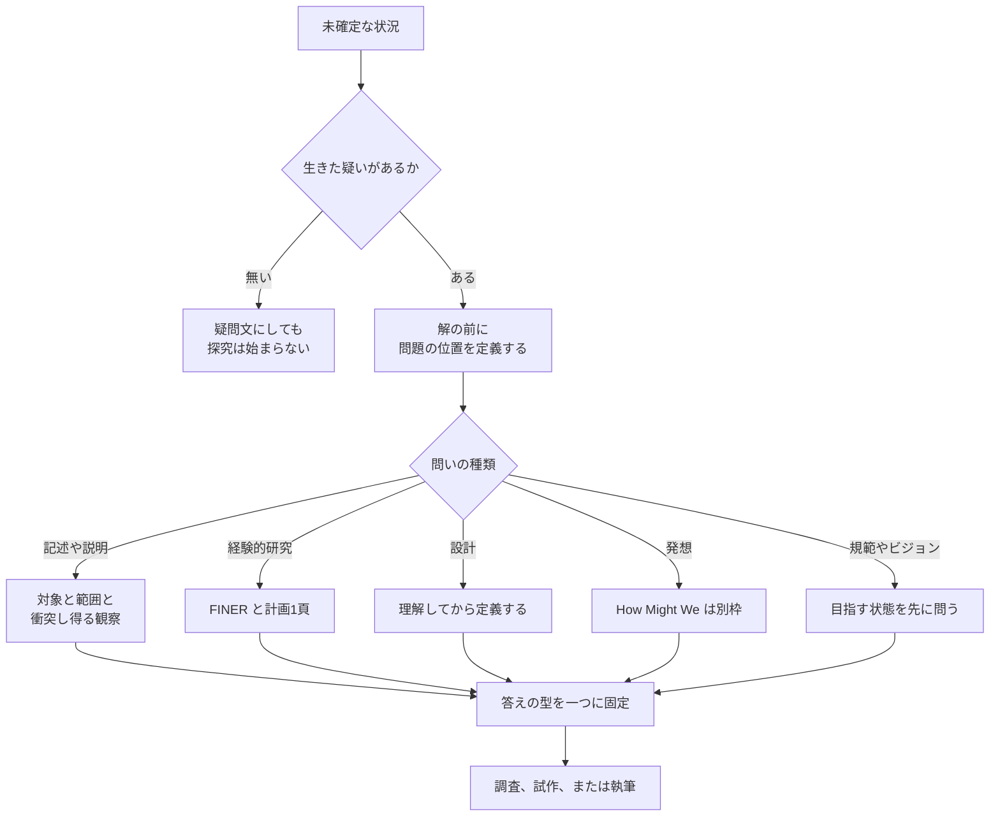

技術調査や技術記事を書く前の「問い」は、立て方次第で作業の量と質が大きく変わります。
問いが広すぎると調べ終わりません。
検証できない問いは結論が出ません。
解から逆算した問いは、調べる前に答えが決まっています。

この記事では、探究の哲学、科学哲学、臨床研究、経営学、デザイン、批判的思考、日本語の実務書という複数の伝統が「問い」をどう扱ってきたかを、一次資料に沿って整理します。
そのうえで、個人が技術調査や技術記事の問いを、次の行動を決められる粒度まで狭める手順を示します。

想定読者は、個人で技術調査や技術記事を書く人です。

*この記事の全体像。以下、順に解説します。*

## 問いの立て方とは

問いの立て方は、未確定な状況から、答えを出せて、その答えで次の行動が決まる問いを作る作業です。
複数の伝統が、それぞれ別の対象を「問い」と呼び、別の条件を課しています。
以下では伝統ごとに、何を「問い」と呼び、何を整えようとしているかを見ます。

### 探究の哲学: 問いは未確定な状況から始まる

Charles Sanders Peirce は 1877年の *The Fixation of Belief* で、探究を「疑いの刺激が信念を得ようとする闘争」と置きました。
疑問文にしただけでは心は動かず、生きた疑いが要る、と書いています。
探究の唯一の目的は意見の決着である、とも書いています。

Peirce は信念を固定する方法として、固執、権威、アプリオリ、科学的方法の四つを挙げます。
科学的方法だけが、自分の感じや目的への直接の訴えではなく、方法の適用そのものによって試される、と区別しています。

John Dewey は 1910年の *How We Think* で、省察を「信念をその根拠と帰結に照らして能動的かつ持続的に検討すること」と定義しました。
同書の第6章は、省察を次の五段に分けます。

1. 感じられた困難
2. 困難の位置と定義
3. 可能な解決の示唆
4. 示唆の帰結の推理
5. 観察や実験による採否

Dewey は、批判的思考の本質を判断の保留とし、その保留の本質を「解決を試みる前に問題の性質を定める探究」としました。
「問題が思考の目的を固定し、目的が思考の過程を制御する」とも書いています。
第一段と第二段はしばしば融合する、という留保も同じ章にあります。

1938年の *Logic: The Theory of Inquiry* では、探究を「未確定な状況を、構成要素の区別と関係が定まり全体として一つになる状況へ、制御して変えること」と定義します。
同書は、ある地点までは探究と問うことが同義だとも書きます。

### 科学哲学: 理論の科学的地位を問う

Karl Popper は *Conjectures and Refutations* の章 “Science: Conjectures and Refutations” で、1919年秋からの問題を「理論はいつ科学的とみなせるか」と立てました。
「いつ真か」や「いつ受け入れ可能か」とは別の問いです。

同章は七項目で論点をまとめます。

- 確認は、ほぼあらゆる理論について簡単に得られる
- 確認が数えられるのは、危険な予測の結果であるときだけである
- 良い科学理論は禁止であり、禁止が多いほど良い
- どんな出来事でも論駁できない理論は非科学的であり、論駁不能は美点ではない
- 本物のテストは理論を偽ろうとする試みであり、テスト可能性は反証可能性で、程度がある
- 確認証拠は、偽ろうとして失敗した真剣な試みとして提示できるときだけ数える
- 偽と分かった理論はアドホックな補助仮定で救えるが、科学的地位を壊すか下げる

結論として、理論の科学的地位の基準は falsifiability、refutability、testability（反証可能性、論駁可能性、テスト可能性）だとまとめています。

### 経験的研究: 問いを研究計画に変える FINER

Cummings、Browner、Hulley の章 “Conceiving the Research Question and Developing the Study Plan” は、研究上の問いを「研究者が研究によって解消したい不確実さ」と置きます。
良い研究計画につながる問いの条件は、頭字語で FINER です。

| 条件 | 章での中身 |
|---|---|
| Feasible | 対象者数、技術、時間と費用、範囲、資金 |
| Interesting | 答えが研究者とその同僚の関心を引くこと |
| Novel | 新しい知見、先行知見の確認・反駁・拡張、概念や実践や手法の革新 |
| Ethical | 機関の審査委員会が承認できること |
| Relevant | 科学的知識、臨床実践、保健政策、今後の研究の方向への影響 |

Interesting について章は、自分だけが面白い問いでないかを、指導者や外部の専門家に確認するよう勧めます。
Novel については、完全に独創でなくても、別集団への適用や予期しなかった結果の確認に価値がある、と書きます。
章は、早い段階で問いと1頁の研究計画を書くことも勧めています。

### 臨床の問い: 検索できる形にする四つの部分

Richardson、Wilson、Nishikawa、Hayward は 1995年の *ACP Journal Club* の記事で、well-built な臨床質問の条件を示しました。
手元の問題に直接関係すること、正確な答えを探しやすい言い方であること、そのために四つの部分を明示することです。

四つの部分は次のとおりです。

- 対象の患者か問題
- 検討する介入か曝露
- 関連するときの比較の介入か曝露
- 関心のある臨床アウトカム

比較は常に必須とはされていません。
この四部分は、後に Patient、Intervention、Comparison、Outcome の頭字語 PICO として広まりました。

### 経営学: 隙間探しと前提への挑戦

Mats Alvesson と Jörgen Sandberg は 2011年の *Academy of Management Review* の論文抄録で、既存文献から研究問いを作る支配的なやり方は隙間を見つけることだ、と述べました。
提案する problematization は、文献の前提を特定して挑戦し、より影響の大きい理論につながりやすい問いを作る方法だ、と抄録は説明します。

日本語では、大木清弘が 2016年の『赤門マネジメント・レビュー』で、リサーチクエスチョンを、佐藤郁哉を引いて「社会調査において設定されるさまざまな問いの中でも、システマティックな探求のために定式化された問い」と紹介しています。
同論文は、経営学の学術論文で筋が悪い設問として、次の型を挙げます。

- 今後どうなるか、どうすべきかを、そのまま学術設問にする
- 事実の描写にとどまり、説明に届かない
- 対象と理論を無理に結ぶ

学生が興味のある対象に「なぜか」「何か」を付けて疑問文にしても同じ批判が返る、とも書いています。
「各社の戦略はどうなっているか」「なぜ儲かっているか」「普及するにはどうすべきか」が例です。

### デザイン: 問題の切り方と発想の起動

デザインの枠は、真偽ではなく問題の切り方と発想を扱います。

Design Council は Double Diamond を、方法や道具を問わない設計・イノベーション過程の図と説明します。
四段は Discover、Define、Develop、Deliver です。

- Discover: 問題を仮定せずに理解する
- Define: 発見で得た洞察によって、課題を別の形で定義する
- Develop と Deliver: 案を展開し、試す

Stanford d.school は How Might We を、発想の枠であり、ブレインストームを始めるために使うことが多い、と説明します。
目標は、意味があり関連する発想を誘う、洞察とニュアンスのある問いです。

Clayton Christensen Institute は Jobs to Be Done を、人と組織を決定へ向け、または決定から遠ざける状況や力を見せるレンズと定義します。
人は製品を買うのではなく、進歩のために生活へ引き入れる、という見方です。
標準的な市場調査が「なぜ買ったか」を聞くのに対し、Jobs は状況の物語を掘る、と区別しています。

### 批判的思考と論証: 問いの言い換えと根拠の分離

Richard Paul と Linda Elder は、推論の八つの部分を、目的、問い、仮定、視点、データ、概念、推論、含意と置きます。
問いについては次の四つを指示します。

- 明確かつ精密に述べる
- 複数の言い方にする
- 小問に分ける
- 正解が一つの問いか、意見の問題か、複数の視点からの推理が要る問いかを見分ける

Stephen Toulmin の *The Uses of Argument*（1958年）は、主張を支える事実を data、その事実から主張への一歩を許可する一般的な仮言を warrant と呼びます。
「何を根拠にしているか」と聞かれたら data を出します。
「どうしてそこに至るか」と聞かれたら、If D then C の形に書ける warrant を出します。

Rudyard Kipling の *Just So Stories* にある “The Elephant’s Child” の末尾には、六人の正直な召使い（What、Where、When、How、Why、Who）の詩があります。
いわゆる 5W1H の記憶法としてよく引かれる詩です。

### 日本語の実務と申請: イシューと学術的「問い」

安宅和人は 2017年の公開対談で、知的生産の本質を「何らかのイシューに答えを出すこと」としました。
課題解決には、目指す姿が明確かどうかで二種類ある、と続けています。

| 型 | 目指す姿 | 最初のイシュー |
|---|---|---|
| ギャップフィル型 | 明確 | ギャップとその構造の見立て |
| ビジョン設定型 | 不明 | 目指すべき姿を明らかにすること |

この二類型は『イシューからはじめよ』には混乱を避けるため書かなかった、とも述べています。
2012年のほぼ日の対談では、イシューの見極めを「いま、自分の置かれた局面で、答えを出す必要性の高い問題とは、何か」と確認する問いに同意しています。

細谷功は、問題発見を、与えられた問題を解く前に「そもそも何が問題なのか」を考えることとして紹介しています。
インタビューでは、的確な質問のために、自分と相手の見方の差を、部分と全体、具体と抽象といった軸で切り分けることを勧めています。

日本学術振興会の科研費の様式Ｓ－２１（若手研究）は、本文の冒頭に概要を置き、次の五点を書くよう求めます。

1. 学術的背景と着想の経緯、課題の核心をなす学術的「問い」
2. 目的と学術的独自性・創造性
3. 国内外の研究動向と本研究の位置づけ
4. 何をどのように、どこまで明らかにするか
5. 準備状況

問いを単体で書くのではなく、位置、射程、準備とセットで書かせる様式です。

### 各枠が整える対象の比較

各枠が整える対象は、それぞれ違います。

| 枠 | 整えるもの | 主な区別 |
|---|---|---|
| Peirce 1877 | 探究が始まる条件 | 生きた疑いと、紙の上の疑問文 |
| Dewey 1910 | 省察の順序 | 困難の位置定義と、解決案 |
| Dewey 1938 | 探究の到達点 | 未確定な状況と、区別と関係が定まった全体 |
| Popper | 理論の科学的地位 | 反駁できる理論と、どんな観察とも両立する説 |
| FINER | 経験的研究の計画 | 実行できる問いと、計画にならない問い |
| 1995年の四部分 | 臨床質問の検索 | 患者か問題、介入か曝露、比較、アウトカム |
| problematization | 理論向けの問いの作り方 | 隙間探しと、前提への挑戦 |
| Double Diamond | 設計過程 | 問題の理解・定義と、案の展開・試行 |
| How Might We | 発想の起動 | 発想用の問いと、真偽を決める問い |
| Jobs to Be Done | 採用の理由 | 人口統計と、状況の中で求める進歩 |
| Kipling の詩 | 六つの疑問詞の記憶 | 詩と、妥当性の検査 |
| Paul and Elder | 推論の部分と基準 | 問いの言い換えと、答えの型 |
| Toulmin | 論証の骨格 | data と warrant |
| 様式Ｓ－２１ | 申請上の学術的問い | 問い単体と、位置・射程・準備のセット |
| 大木 2016 | 経営学論文で避ける設問 | 学術設問と、ビジネスレポートの問い |
| 安宅 2017 対談 | 知的生産の最初の課題 | ギャップ充填と、ビジョン設定 |

### 問いを狭める流れ

これらを重ねると、問いを狭める作業は一本の採点ではなく、分岐として描けます。
最初に、生きた未確定があるかを決めます。
次に、解を置く前に問題の位置を固定します。
そのあとで、問いの種類に応じて検査を選びます。

種類を混ぜた疑問文は、検査も混ぜることになります。
たとえば「何が起きていて、なぜそうで、どうすべきか」は、記述、説明、規範の三つの問いです。
Paul と Elder の区別でも、正解が一つの問い、意見の問い、複数視点が要る問いは同じ扱いをしません。
野矢茂樹は公開インタビューで、同じ「なぜ」でも、行為については当人の理由を、自然現象については仕組みを求める場合がある、と説明しています。

## 注意点

これらの枠を一つの万能手順に積み上げると、短い技術記事の問いまで過剰に制約します。
各枠の射程と、よくある誤った引用を押さえておきます。

### 各枠の射程

- **Peirce**: 「探究の唯一の目的は意見の決着」は、チェックリストの根拠にはなりません。決着した信念は、偽でも探究を終わらせると本人が書いています。生きた疑いは開始条件であり、結論の正しさの保証ではありません。
- **Dewey**: 1910年の五段と 1938年の定義は、同じ文章の言い換えではありません。1938年の定義へ五段の番号を読み戻さないほうが安全です。
- **Popper**: 基準は理論の科学的地位についてのものです。設計の問い、規範の問い、探索的な記述の問いに、反証可能性を必須にする根拠にはなりません。また、物理学の実験は孤立した一仮説ではなく理論の組を裁く、という Duhem の指摘もあり、単一の反証で理論が決まるとは限りません。
- **FINER**: 臨床研究の章の基準です。技術記事の題名選びや規範的な提言の採否に、そのまま使わないほうが適切です。資金の要らない一人の調査では、資金面の Feasible を必須にしません。
- **problematization**: 抄録の提案は、理論の影響についての方法論的提案です。実務家の意思決定が良くなるという実証ではありません。また、FINER の Novel は隙間の確認・拡張・反駁にも価値を認めているので、隙間探しを禁止する規則にはしません。
- **Double Diamond**: 設計過程の図です。Define は発見のあとで課題の定義が変わり得る段階であり、研究問いの妥当性テストではありません。
- **How Might We**: 発想用の問いです。真偽を決める調査設問の代わりにはなりません。
- **Jobs to Be Done**: 人が何を採用しているかを状況から問うレンズです。研究設問の採点表ではありません。
- **Kipling の六語**: 児童文学の詩です。六語を埋めただけで、反証可能性も実行可能性も独自性も満たしたことにはなりません。
- **大木 2016**: 失敗型は経営学の学術論文についてのものです。実務の「どうすべきか」を、記事や意思決定の問いとして禁止する根拠にはなりません。
- **様式Ｓ－２１**: 科研費の研究計画についての様式です。個人の技術記事の題に独自性と創造性を必須にしません。

### よくある誤った引用

- **Interesting を impactful と書き換える**: 「Adapted from Hulley et al., 2007」と記す研修資料に、Interesting を impactful と書き換えた例があります。章本文の Interesting は関心であり、影響ではありません。
- **PICO を 1995年記事の用語とする**: 1995年記事が示すのは四つの部分であり、頭字語 PICO はその記事の語ではありません。比較も常に必須とはされていません。
- **Double Diamond の対句を公式ラベルとする**: 「正しいものを設計する（designing the right thing）」「正しく設計する」という対句は、Design Council の概要ページの公式ラベルではありません。沿革ページで関係者が自分の説明として置いたものです。公表年についても、Framework for Innovation のページは Launched in 2004 と書き、沿革ページは 2004年から会議と発表で共有したと書きます。
- **How Might We の狭すぎ・広すぎの例を公式定義とする**: アイスクリームを例にした「狭すぎると解に寄り、広すぎると発想が散る」という説明は、d.school の現行ページにはありません。第三者の資料にある例です。
- **5W1H を Kipling の詩そのものとする**: Project Gutenberg の初期版（#2781）は名前の行を What、Where、When、How、Why、Who と印刷します。1912年の改良版（#32488）の名前の行は What、Where、When、How、Where、Who で、Why は後の行に出ます。どちらの版も、六語を研究手順にはしていません。
- **安宅の数値や部数を確定値とする**: 「課題解決の8〜9割はギャップフィル型」は対談上の本人の見立てであり、計測の手続きは示されていません。改訂版の商品ページには累計部数が 70万部と 58万部の二通り書かれており、どちらも出版社の販促文です。

### 枠を直列につなぐ危険

Peirce、Dewey、Popper、FINER、PICO、problematization、Double Diamond、How Might We、科研費様式を、毎回すべて直列で通す必要はありません。
種類の違う検査を直列にすると、次のように良い問いまで落ちます。

- 設計の問いが、反証可能性で落ちる
- 規範の問いが、FINER で落ちる
- 探索的な記述の問いが、学術的独自性で落ちる

## 個人の技術調査ではどの枠を使えばよいか

個人の技術調査で使うときは、状況ごとに先に使う枠と、使わない枠を分けます。

| 状況 | 先に使う枠 | 使わない枠 |
|---|---|---|
| 題が疑問文なだけで、判断が変わらない | Peirce の生きた疑い | 以降の検査すべて |
| 解や道具が先に決まっている | Dewey 1910 の第二段、Double Diamond の Discover から Define | How Might We を調査設問の代わりにすること |
| 目指す状態が言えない | 安宅のビジョン設定型 | ギャップの測定、FINER の Relevant |
| 経験的な主張を記事の結論にする | Popper の「何が観察されたら衝突するか」 | 設計案や規範の採否への転用 |
| 人と時間を使う調査計画にする | FINER。Interesting は関心であり影響ではない | impactful への書き換え |
| 介入の比較を検索する | 1995年の四部分 | 四部分を哲学的探究へ強制すること |
| 先行研究の穴だけを理由にする | 使っている前提を一行書く | 隙間探しの全面禁止 |
| 案を増やしたい | How Might We を発想枠として分離 | 真偽の検査 |
| 科研費の計画書にする | 様式の五点 | 個人記事への流用 |
| 経営学の査読論文にする | 大木の三つの失敗型 | 実務記事の禁止 |

## 技術調査の問いを狭める8つの手順

個人が技術調査や技術記事の問いを狭めるときは、次の順に進めます。
該当しない段は飛ばします。

1. **依存を書く**: 何が未確定で、自分の次の判断か次の行動がそれに依存するかを一文で書きます。依存が無ければ、疑問文にしても調べません。
2. **問題の位置を書く**: 解、手法、道具の名を出す前に、問題がどこにあるかを一文で書きます。目指す状態が言えないなら、状態を問う文を先に作ります。
3. **種類を一つに絞る**: 記述、説明、評価、設計、規範のうち、主たる種類を一つ選びます。残りは別の問いに分けます。答えが一つの事実か、複数の視点が要る判断かも書きます。
4. **衝突する観察を書く**: 主たる種類が経験的な主張なら、その答えと衝突し得る観察を一つ書きます。設計、規範、発想の問いには、この段を必須にしません。
5. **実行可能性を確かめる**: 調査として人と時間を使うなら、次を各一行で書きます。
   - 対象は足りるか
   - 技術は手元にあるか
   - 範囲は主問いに絞れているか
   - 相手に不利益が無いか
   - 答えは知識と実践のどちらを進めるか

   興味は「答え自体が自分と読み手の関心を引くか」で見ます。
6. **隙間の前提を書く**: 先行研究の穴を理由にするなら、その穴がどの前提をそのまま使っているかを一行足します。
7. **発想の問いを分ける**: 案が欲しいときは、調査設問とは別に How Might We を書きます。調査設問の成否は、そちらで判定しません。
8. **申請や論文の要件を足す**: 学術申請や査読論文にするときだけ、背景、独自性、位置、どこまで明らかにするか、準備を足します。経営学論文にするなら、既に答えがあるか、方法が無いか、対象と理論を無理に結んでいないかを確認します。

この手順では、生きた疑い、解の前の定義、種類の分離の三つを全件に共通させます。
反証、FINER、学術様式は、問いの種類が該当するときだけ足します。

## 手順を題に当てはめるとどうなるか

よくある題の型ごとに、どの手順で引っかかり、どう直すかを示します。

| 題の型 | 例 | 引っかかる手順 | 直し方 |
|---|---|---|---|
| 広すぎる | 「AI 時代の問いの立て方」 | 手順1 | 依存が書けなければ落とす。または「来週書く技術記事の題を、調べる価値がある問いに変えるには、どの検査を残すか」まで依存を書く |
| 解が先にある | 「RAG を導入すべきか」 | 手順2 | 何の未確定が導入の可否を決めているかを先に書く。検索の失敗が再現しているなら説明の問い、利用者の仕事が別なら Jobs の状況の問いに分かれる |
| 検証できない | 「良い問いは世界を変えるか」 | 手順3と4 | 規範か評価かに分ける。衝突する観察が書けなければ、経験的主張として書かない |
| 既に答えがある | 調べたら先行記事があった | 手順6 | 先に文献を見る。FINER の Novel は、確認や別状況への拡張も新規性に数える。穴が無いことと、書く価値が無いことは同じではない |

## まとめ

- 「問い」は伝統ごとに別の対象を指します。探究の開始条件、理論の科学的地位、研究計画、臨床質問の検索、理論の新規性、設計過程、発想の起動、推論の部分、申請様式は、それぞれ別の枠です。
- 問いを狭める作業は、一本の採点ではなく分岐です。生きた疑いの有無、解の前の問題の位置、問いの種類の順に決めます。
- 全件に共通させるのは、生きた疑い、解の前の定義、種類の分離の三つです。反証可能性、FINER、学術様式は、問いの種類が該当するときだけ足します。
- 枠を直列に全部通すと、設計や規範や探索の問いまで落ちます。PICO や Double Diamond の対句、5W1H のように、一次資料と後年の要約がずれている引用にも注意が要ります。

この記事が少しでも参考になった、あるいは改善点などがあれば、ぜひリアクションやコメント、SNSでのシェアをいただけると励みになります！

## 参考リンク

- Peirce, C. S. “The Fixation of Belief.” *Popular Science Monthly* 12 (1877). https://en.wikisource.org/wiki/The_Fixation_of_Belief
- Dewey, J. *How We Think*. D. C. Heath, 1910. https://www.gutenberg.org/files/37423/37423-h/37423-h.htm
- Dewey, J. *Logic: The Theory of Inquiry*. Henry Holt, 1938. https://archive.org/details/JohnDeweyLogicTheTheoryOfInquiry
- Popper, K. R. “Science: Conjectures and Refutations.” *Conjectures and Refutations: The Growth of Scientific Knowledge*.
- Toulmin, S. E. *The Uses of Argument*. Cambridge University Press, 1958. 抜粋の転載: https://web.archive.org/web/20120130181558/http://caae.phil.cmu.edu/cavalier/Forum/info/ToulLogic.html
- Cummings, S. R., Browner, W. S., and Hulley, S. B. “Conceiving the Research Question and Developing the Study Plan.” https://www.topvelocity.net/wp-content/uploads/2017/10/Ch2-Hulley-Conceiving-the-Research-Question.pdf
- Richardson, W. S., Wilson, M. C., Nishikawa, J., and Hayward, R. S. A. “The well-built clinical question: a key to evidence-based decisions.” *ACP Journal Club* 123(3), A12–13, 1995. https://augusta.elsevierpure.com/en/publications/the-well-built-clinical-question-a-key-to-evidence-based-decision
- Alvesson, M., and Sandberg, J. “Generating research questions through problematization.” *Academy of Management Review* 36(2), 247–271, 2011. https://espace.library.uq.edu.au/view/UQ:229129
- Design Council. “The Double Diamond.” https://www.designcouncil.org.uk/our-resources/the-double-diamond/
- Design Council. “History of the Double Diamond.” https://www.designcouncil.org.uk/resources/the-double-diamond/history-of-the-double-diamond/
- Design Council. “Framework for Innovation.” https://www.designcouncil.org.uk/resources/framework-for-innovation/
- Stanford d.school. “How Might We Questions.” https://dschool.stanford.edu/resources/how-might-we-questions
- Christensen Institute. “Jobs to Be Done Theory.” https://www.christenseninstitute.org/theory/jobs-to-be-done/
- Kipling, R. “The Elephant’s Child.” *Just So Stories*. https://www.gutenberg.org/files/2781/2781-h/2781-h.htm / https://www.gutenberg.org/files/32488/32488-h/32488-h.htm
- Paul, R., and Elder, L. “The Analysis & Assessment of Thinking.” Foundation for Critical Thinking. https://www.criticalthinking.org/pages/the-analysis-amp-assessment-of-thinking/497
- 日本学術振興会「様式Ｓ－２１ 研究計画調書（添付ファイル項目）若手研究」https://www.jsps.go.jp/file/storage/kaken_kiban_2025_g_3687/s-21.pdf
- 大木清弘「筋が悪いリサーチクエスチョンとは何か？」『赤門マネジメント・レビュー』15巻10号（2016）https://www.jstage.jst.go.jp/article/amr/15/10/15_151002/_article/-char/ja
- 安宅和人、糸井重里「重要なのは『イシュー』だ。」ほぼ日刊イトイ新聞（2012）https://www.1101.com/c/ataka_kazuto/2012-01-12.html
- 石川善樹、安宅和人「身につけよ！ 人生100年時代における新しい『教養』」HILLS LIFE DAILY（2017）https://hillslife.jp/learning/2017/08/08/new-perspective2/
- 英治出版「イシューからはじめよ［改訂版］」https://eijipress.co.jp/products/2356
- 細谷功「出版・著作」https://www.isao-hosoya.com/%E5%87%BA%E7%89%88-%E8%91%97%E4%BD%9C/
- サイボウズ式（細谷功インタビュー）https://cybozushiki.cybozu.co.jp/articles/m005966.html
- ダイヤモンド・オンライン（細谷功対談、2017）https://diamond.jp/articles/-/152420
- 問いびと（野矢茂樹インタビュー）https://www.toibito.com/toibito/articles/3%E6%84%8F%E5%91%B3%E3%81%A7%E8%A1%8C%E7%82%BA%E3%82%92%E6%8D%89%E3%81%88%E3%82%8B
