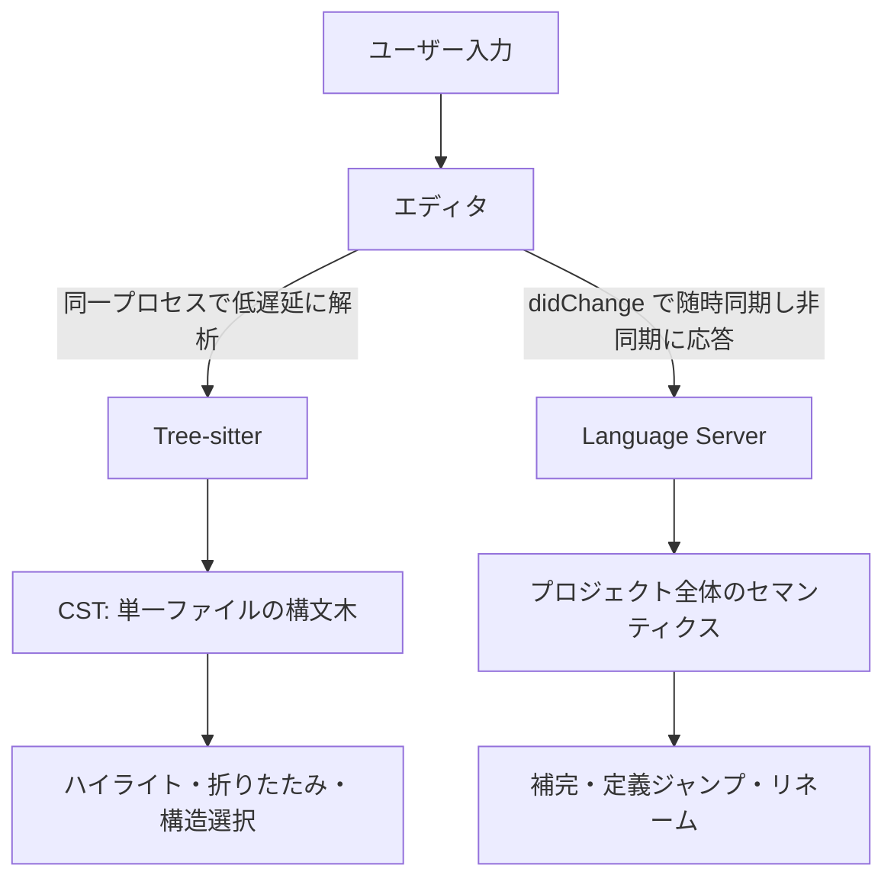
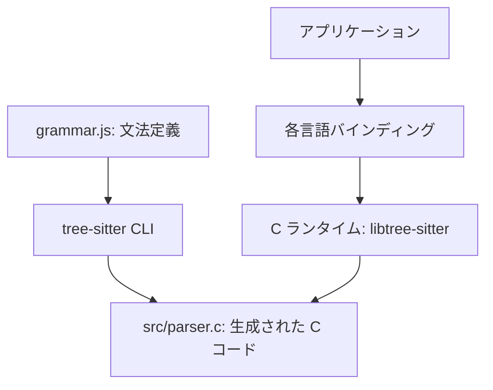
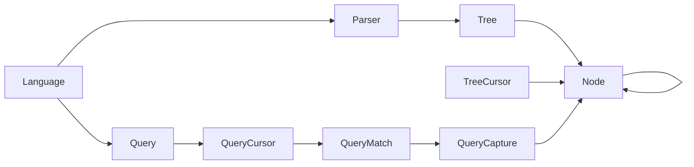

Neovim や Zed のシンタックスハイライトが、タイピング中の壊れたコードでも崩れないのはなぜか。その中核にあるのが Tree-sitter です。

この記事では、Tree-sitter を「エディタ用の高速パーサー」で終わらせず、**どこまでを任せ、どこから先を LSP に渡すか**という設計判断まで踏み込んで整理します。CLI のセットアップ、クエリの書き方、CI 運用、詰まりやすい点まで、実際に文法を書く／組み込む立場で必要な情報を扱います。

:::message
Tree-sitter は CLI／コアライブラリと、各言語のバインディング・文法クレートが別々にバージョニングされます。本記事は 2026-08-06 時点の次のバージョンで確認しています。

| 対象 | バージョン |
| :--- | :--- |
| CLI / コアライブラリ | v0.26.11 |
| Node.js バインディング（npm `tree-sitter`） | 0.25.1 |
| Rust 文法クレート（`tree-sitter-rust`） | 0.24.2 |

0.24 以前の記事とはコマンド体系が変わっている箇所があるため、後述の「バージョンによる差分」も併せて確認してください。
:::


*この記事の全体像。以下、順に解説します。*

## Tree-sitter とは何か

Tree-sitter は、インクリメンタル構文解析ライブラリと、そのパーサージェネレータのセットです。ソースコードから **具象構文木（CST: Concrete Syntax Tree）** を構築し、編集のたびに差分だけを更新し続けます。

コンパイラ向けパーサーが「1 回きりの完全な解析」を前提にするのに対し、Tree-sitter は「キーストロークごとに何度も呼ばれる」ことを前提に設計されています。この前提の違いが、以下の性質すべての根拠になっています。

| 性質 | 内容 |
| :--- | :--- |
| インクリメンタル解析 | 変更の影響範囲だけを再解析し、未変更ノードを再利用する |
| エラー耐性 | 構文エラーを含むコードでも解析を継続し、木を維持する |
| クエリ言語 | S 式で構文木からパターンを抽出できる |
| 言語混在 | HTML 内の JavaScript / CSS のような入れ子言語を扱える |
| 依存ゼロのランタイム | 純粋な C11 実装で、外部ライブラリを必要としない |

ランタイムが C ライブラリであることは実用上とても大きく、エディタのプロセスへ直接リンクできます。プロセス間通信のオーバーヘッドがないぶん、公式も「キーストロークごとに解析できる速度」を設計目標に置いています。

ただしこれは「同期実行しても UI が固まらない」という保証ではありません。同期呼び出しは実行中スレッドを占有するため、巨大ファイルや重い文法では実測し、必要に応じて別スレッド化・タイムアウト・解析範囲の限定を検討します。

## Tree-sitter と LSP の責務分界

Tree-sitter を導入するとき最初に決めるべきは、「何を Tree-sitter に任せないか」です。Tree-sitter は**単一ファイルの構文**しか見ないため、別ファイルにある型定義の追跡はできません。



分界線は実行タイミングではなく、**解析の種類**で引きます。LSP にも `textDocument/didChange` という必須の同期通知があり、変更のたびにサーバーへ内容が渡ります。「Tree-sitter は入力ごと、LSP は保存時」という理解は誤りです。

実際の違いは次の 2 点です。

- Tree-sitter は同一プロセス内で、単一ファイルの構文だけを扱う
- Language Server は別プロセスで、プロジェクト横断の意味解析を非同期に返す

現代のエディタはこの 2 系統を併用するハイブリッド構成が主流です。判断軸は「その機能はファイル 1 枚で完結するか」の一点に集約されます。

### 他の解析手法との比較

| 技術 | 実行方式 | リソース | 得意領域 | 応答性 |
| :--- | :--- | :--- | :--- | :--- |
| Tree-sitter | C ライブラリを組み込み・差分更新 | 小（別プロセス不要） | 構文木構築、ハイライト、折りたたみ、クエリ | キーストロークごとに同期実行可能 |
| LSP | RPC 通信で外部プロセス | 大（常駐サーバー） | 型解決、補完、定義ジャンプ | 起動時のプロジェクト解析コストあり |
| TextMate 文法 | 行単位の正規表現マッチ | 小 | 簡易ハイライト | 高速だが多行構文・深い入れ子に弱い |
| ANTLR / Yacc | 通常はフル再解析 | 中〜大 | 言語処理系のパーサー、AST 構築 | 差分更新の仕組みを持たない |

### 用途別の選択

| やりたいこと | 選ぶもの | 理由 |
| :--- | :--- | :--- |
| 入力中のリアルタイムハイライト | Tree-sitter | 構文エラーに強く、差分更新で速い |
| 定義ジャンプ・リネーム | LSP | ファイル横断の参照解決が必要 |
| ログの単純な色付け | TextMate 文法 | 厳密な構文解析が不要 |
| 新言語のコンパイラ実装 | ANTLR / Yacc / 独自実装 | エラー診断や中間コード生成が主目的 |

## 差分更新のしくみ

Tree-sitter の速さの実体は、編集内容をバイトオフセットと行・列の両方で受け取り、影響のないサブツリーを丸ごと再利用する点にあります。

呼び出し側の手順は 3 ステップです。

1. 編集内容を `TSInputEdit` として組み立てる
2. 既存ツリーへ `ts_tree_edit` で編集を適用する
3. 編集適用済みの古いツリーを渡して再パースする

C API の編集記述子は以下の形です。

```c
typedef struct {
    uint32_t start_byte;    // 変更の開始バイトオフセット
    uint32_t old_end_byte;  // 変更前の終了バイトオフセット
    uint32_t new_end_byte;  // 変更後の終了バイトオフセット
    TSPoint start_point;    // 変更の開始行・列
    TSPoint old_end_point;  // 変更前の終了行・列
    TSPoint new_end_point;  // 変更後の終了行・列
} TSInputEdit;
```

Node.js バインディングでも同じ概念がそのまま出てきます。`let` を `const` へ書き換えた場合の例です。

```javascript
tree.edit({
  startIndex: 0,
  oldEndIndex: 3,
  newEndIndex: 5,
  startPosition: { row: 0, column: 0 },
  oldEndPosition: { row: 0, column: 3 },
  newEndPosition: { row: 0, column: 5 },
});

const newTree = parser.parse(newSourceCode, tree);
```

ここで重要なのは、**編集情報を渡さずに再パースすると差分更新にならない**ことです。エディタ側のバッファ変更イベントを、そのまま `TSInputEdit` へ写像できる設計になっているかが、組み込み時の実質的な性能要件になります。

## エラー耐性の実体

Tree-sitter は GLR（Generalized LR）パーシングを使い、構文エラーでパースを中断しません。エラー時はスタックを分岐させ、複数の復旧戦略を並行して試します。

- **不正トークンのスキップ**: 文末やブロック終端など、安全な同期ポイントまで読み飛ばす
- **欠落トークンの挿入**: 閉じ括弧などを仮想的に補い、木の構造を保つ
- **コストによる採択**: スキップ量や挿入量からコストを計算し、より多くの有効ノードを構築できた分岐を採る

復旧の痕跡は木の上に残ります。これは「壊れたまま握りつぶす」のではなく、**壊れた範囲が木の上で明示される**という設計です。ただし残り方が 2 種類あり、両方を見ないと構文エラーを取りこぼします。

| 種類 | 意味 | クエリ | ノード API |
| :--- | :--- | :--- | :--- |
| `ERROR` | 認識できなかったテキストを包むノード | `(ERROR)` | `is_error` |
| `MISSING` | 挿入で補われた欠落トークン。幅ゼロで、通常ノードの属性として表現される | `(MISSING)` | `is_missing` |

```lisp
(ERROR) @error-node
(MISSING) @missing-node
(MISSING ";") @missing-semicolon
```

`MISSING` は `(ERROR)` クエリには**捕捉されません**。閉じ括弧やセミコロンの欠落を検知したいなら、両方を明示的に拾う必要があります。

## クエリ言語

構文木からのパターン抽出は、S 式ベースのクエリで書きます。`@` を付けた名前が**キャプチャ**になり、マッチしたノードを取り出せます。

```lisp
(function_declaration
  name: (identifier) @function.name
  parameters: (formal_parameters) @function.params)
```

`name:` や `parameters:` はフィールド名で、同じ型の子ノードを役割で区別するために使います。ハイライト定義（`highlights.scm`）も静的解析ツールも、この同じ仕組みの上に乗ります。

クエリと手続き的な木の走査は、置き換え関係ではなく併存する 2 つの API です。使い分けの目安は次のとおりです。

- 定型的な部分木の抽出（関数定義、変数宣言など）: クエリ
- 状態を持つ複雑な処理や木全体の走査: `TreeCursor`

ハイライト・折りたたみ・タグ付けが同じクエリ基盤で表現できるため、言語を増やすときの追加コストが下がる点がクエリ側の利点です。

## 構造：生成フェーズと実行フェーズ

Tree-sitter で混乱しやすいのが、**パーサーを作る側**と**パーサーを使う側**でまったく別のものを触る点です。



| 要素 | 役割 |
| :--- | :--- |
| `grammar.js` | 言語ごとの構文規則。JavaScript で記述する |
| tree-sitter CLI | 文法定義から C パーサーを生成し、テスト・ビルドも担う |
| `src/parser.c` | 生成物。依存関係のない C コードとして配布できる |
| C ランタイム | 解析エンジン本体。生成パーサーを読んで木を構築する |
| バインディング | Rust / Node.js / WebAssembly などから C API を呼ぶラッパー |

JavaScript ランタイムが要るのは、**`grammar.js` を評価して `grammar.json` を作る段階だけ**です。生成済みの `grammar.json` から `parser.c` を作り直す場合も、実行フェーズでも不要です。この分離が「配布物は C コードだけ」という軽さにつながっています。

## データモデル

実行時に触るオブジェクトは、大きく「解析」「木」「検索」の 3 グループに分かれます。



| 要素 | 役割 |
| :--- | :--- |
| `Language` | 特定言語の構文規則を持つ不変オブジェクト |
| `Parser` | `Language` を設定して `Tree` を生成する状態付きエンジン |
| `Tree` | ファイル全体の構文構造。編集して次の `Tree` を作れる |
| `Node` | 木の個々の要素。型・バイト位置・行列位置・親子関係を持つ |
| `TreeCursor` | ノード間を移動するイテレータ。使い回すことで走査コストを下げられる |
| `Query` | コンパイル済みの S 式クエリ |
| `QueryCursor` | クエリを特定ノードに対して実行し、結果を順に返す |
| `QueryMatch` / `QueryCapture` | マッチ結果と、その中の個々のキャプチャ |

`Node` が持つ属性のうち、実装で効いてくるのは次の 3 つです。

- `start_byte` / `end_byte` と `start_point` / `end_point` を**両方**持つ
- `is_named` で「名前付きノード（文法でルール名を与えた要素）」と「匿名ノード（キーワードや区切り記号など、文字列リテラル由来のトークン）」を区別できる
- `is_error` でエラーノードを、`is_missing` で挿入された欠落トークンを判別できる

:::message alert
`Point` の `row` / `column` は 0 オリジンですが、**`column` は行頭からのバイト数**であり、文字インデックスではありません。マルチバイト文字を含む行では両者が一致しません。

エディタ内部の座標や LSP の UTF-16 座標との変換は Tree-sitter 側では行われず、`TSInputEdit` を組み立てる呼び出し側の責務です。
:::

## 導入

### 依存関係

パーサーを**開発する**場合、必要なのは 2 つです。

- **JavaScript ランタイム**: `grammar.js` を評価するために使う（既定は `node`）
- **C コンパイラ**: 生成パーサーをビルド・テストするために使う

なお v0.26 以降は `--js-runtime native` を指定すると、CLI に同梱された QuickJS を使えます。この場合 Node.js のインストールは不要です（ベース文法を npm から取得する構成では `npm install` が別途必要）。

### CLI のインストール

公式に案内されている方法は次の 3 つです。

```bash
# Rust: 任意のプラットフォームで動く
cargo install tree-sitter-cli --locked

# npm: ビルド済みバイナリを使うため速いが、対応プラットフォームは限られる
npm install -g tree-sitter-cli
```

このほか、GitHub リリースからバイナリを直接取得して PATH へ置く方法もあります。macOS の Homebrew では**パッケージ名の使い分けに注意**が必要です。

```bash
brew install tree-sitter-cli  # CLI 本体
brew install tree-sitter      # ライブラリ (libtree-sitter) のみ
```

`brew install tree-sitter` はライブラリだけをインストールする形に整理されており、CLI は入りません。

```bash
tree-sitter --version
```

### プロジェクトの初期化

新しい文法リポジトリは `tree-sitter init` で作ります。以前は `npm init` からの手作業が案内されていましたが、現在は CLI が `tree-sitter.json`・`grammar.js`・各言語バインディングの雛形をまとめて生成します。

```bash
mkdir tree-sitter-mylang
cd tree-sitter-mylang
tree-sitter init
```

:::message alert
文法名（`grammar({ name: ... })`）にハイフンは使えません。v0.26.6 で一度許可されましたが v0.26.7 で撤回されており、v0.26.11 でも使えません。

リポジトリ名の `tree-sitter-<lang>` は別物で、こちらはハイフンを含んで問題ありません。
:::

生成される `grammar.js` は ESM 形式です（`generate` は ESM・CJS の両方を受け付けます）。

```javascript
/// <reference types="tree-sitter-cli/dsl" />
// @ts-check

export default grammar({
  name: 'mylang',

  rules: {
    // 最初のルールが構文木のルートになる
    source_file: $ => repeat($._item),

    _item: $ => choice($.number, $.string),

    number: $ => /\d+/,
    string: $ => /"[^"]*"/
  }
});
```

先頭の 2 行は型情報のためのもので、`npm install` して `tree-sitter-cli/dsl` を配置すると、エディタ上で DSL の補完が効くようになります。

### 生成とテスト

```bash
tree-sitter generate   # grammar.js から src/parser.c などを生成
tree-sitter test       # test/corpus/ のテストを実行
tree-sitter parse example-file   # 実ファイルをパースして木を出力
```

`generate` の出力のうち、運用で意識すべきものは次の 2 つです。

- `src/grammar.json`: 文法の構造化表現。**JavaScript ランタイムなしで `parser.c` を再生成できる**ため、配布時に効く
- `src/node-types.json`: ノードの型情報。ダウンストリームのツールが静的に型を知るために使う

### 曖昧さの解消

文法が曖昧だと `generate` は `Unresolved conflict` で止まります。解決手段は 2 つです。

- `prec` / `prec.left` / `prec.right`: 優先順位と結合性を静的に決める
- `conflicts`: 本質的に曖昧な組み合わせを宣言し、GLR パーサーへ実行時解決を委ねる

```javascript
export default grammar({
  name: 'example',

  conflicts: $ => [
    // 配列リテラルと分割代入のように、同じトークン列が複数解釈を持つ場合
    [$.array, $.destructuring_pattern]
  ],

  rules: {
    binary_expression: $ => choice(
      prec.left(1, seq($._expression, '+', $._expression)),
      prec.left(2, seq($._expression, '*', $._expression))
    ),
  }
});
```

`conflicts` は「実行時に分岐を増やす」宣言なので、乱用するとパース速度に響きます。静的に決められるものは `prec` で決めるのが原則です。

## 利用

ホスト言語が変わっても、流れは「パーサー生成 → 言語設定 → パース → 走査」で共通です。

### Rust

使うクレートはコアの `tree-sitter`（0.26.11）と、言語ごとの文法クレート（ここでは `tree-sitter-rust` 0.24.2）の 2 つです。

```toml
[dependencies]
tree-sitter = "0.26"
tree-sitter-rust = "0.24"
```

現在の言語クレートは `LANGUAGE` 定数（`LanguageFn`）を公開しており、`extern "C"` の手書き宣言は不要です。

```rust
use tree_sitter::Parser;

fn main() {
    let code = "fn double(x: i32) -> i32 { x * 2 }";

    let mut parser = Parser::new();
    let language = tree_sitter_rust::LANGUAGE;
    parser
        .set_language(&language.into())
        .expect("Error loading Rust parser");

    let tree = parser.parse(code, None).unwrap();
    let root = tree.root_node();
    assert!(!root.has_error());

    let mut cursor = root.walk();
    for child in root.children(&mut cursor) {
        println!("Node kind: {}", child.kind());
    }
}
```

`set_language` は `&Language` を取るため、`LanguageFn` から `.into()` で変換します。古い記事にある `unsafe { tree_sitter_rust() }` 形式は、現行クレートでは書く必要がありません。

### Node.js

バインディングは npm の `tree-sitter`（0.25.1）で、文法は言語ごとのパッケージを別途入れます。

```bash
npm install tree-sitter tree-sitter-javascript
```

```javascript
const Parser = require('tree-sitter');
const JavaScript = require('tree-sitter-javascript');

const parser = new Parser();
parser.setLanguage(JavaScript);

const tree = parser.parse('let x = 1; console.log(x);');
console.log(tree.rootNode.toString());
```

文字列以外のデータ構造（ロープや行配列）を持っている場合は、コールバックを渡して読み取らせられます。エディタのバッファをそのまま扱う際に使う経路です。

ここで 2 点はまるポイントがあります。返却バイト数がゼロになると**文書終端扱い**になることと、`position.column` がバイトオフセットであることです。行配列を渡すなら、行末の改行を保持し、UTF-8 バイト列として切り出します。

```javascript
// 行末の改行を残したまま UTF-8 バイト列として保持する
const lines = sourceCode.split(/(?<=\n)/).map((s) => Buffer.from(s, 'utf8'));

const tree = parser.parse((index, position) => {
  const line = lines[position.row];
  if (line === undefined) return null;
  return line.subarray(position.column).toString('utf8');
});
```

改行を落とすと行が進まず、空文字列を返すとそこで解析が打ち切られます。空行を `if (line)` で弾いてしまう実装も同じ理由で壊れます。

### 多数の子を辿るときはカーソルを使う

`node.child(i)` をインデックスで回すのは、子の列挙には向きません。インデックス参照そのものが `log(i)` のコストを持つためです。子を順に見るなら、各バインディングの `children` 系 API か、使い回した `TreeCursor` を使います。

ノードの表現はバインディングごとに異なります。Rust の `Node` は `Copy` な値型ですが、Node.js などではオブジェクトが生成されます。割り当てコストの大小はバインディング依存なので、ホットパスでは実測して判断してください。

## 運用

### デバッグ

パーサーが想定どおり動かないときは `-d/--debug` で字句・構文解析のログを stderr へ出します。より詳しく見たい場合は `-D/--debug-graph` でスタックとパース木のグラフを `log.html` に書き出せます。

```bash
tree-sitter parse --debug path/to/file
tree-sitter parse --debug-graph --open-log path/to/file
```

実際のノード名を確認したいときは playground が有効です。ただし**先に Wasm ビルドが必要**です。

```bash
tree-sitter build --wasm
tree-sitter playground
```

### 状態数の監視

複雑な文法は生成される状態機械を肥大化させ、コンパイル時間とパース速度を悪化させます。どのルールが状態を食っているかは `generate` で調べられます。

```bash
tree-sitter generate --report-states-for-rule -   # ルールごとの状態数だけ
tree-sitter generate --report-states-for-rule '*' # 全ルールの詳細
```

コストの高いルールを小さなサブルールへ分割するのが基本的な対処です。

### Wasm ビルド

ブラウザや Web エディタで動かす場合は、`build` の `--wasm` を使います。

```bash
tree-sitter build --wasm
```

:::message alert
かつての `tree-sitter build-wasm` は独立サブコマンドでしたが、現在は `build --wasm` に統合されています。古い CI 設定が残っていると失敗します。
:::

WASI SDK が必要で、`TREE_SITTER_WASI_SDK_PATH` が未設定の場合は CLI がキャッシュディレクトリへ自動取得します。CI ではこのダウンロードをキャッシュするか、SDK をイメージへ焼き込むと安定します。

### CI での検証

文法開発は回帰が出やすいため、CI の作り込みが効きます。

- **コーパステスト**: `test/corpus/` にスニペットと期待 S 式を置き、すべての PR で `tree-sitter test` を回す
- **期待値の更新**: 意図的な文法変更後は `tree-sitter test -u` で期待値を一括更新してからコミットする（`ERROR` / `MISSING` を含むテストは更新対象外）
- **実コードでの結合テスト**: 対象言語の著名 OSS を丸ごとパースし、コーパスでは拾えないエッジケースと性能劣化を検知する
- **機械可読な結果**: `--json-summary` は `generate`（競合）・`test`（テストサマリー）・`parse`（ファイル別の解析結果）でそれぞれ別の内容を返します。同名オプションでも出力形は共通ではないため、CI へ組み込む前に対象バージョンで実出力を確認してから判定式を書きます

### バージョン運用

Tree-sitter の破壊的変更は 2 方向から来ます。

1. **ABI**: `generate --abi` の既定は ABI 15 で、ABI 14 も生成できます。エディタ側エンジンが要求する ABI と、配布したパーサーバイナリの ABI が食い違うと読み込みに失敗します
2. **ノード名**: 構文木のノード名が変わると、下流のハイライト定義や Linter が壊れます

後者はパッチバージョンで出さず、マイナー以上を上げる運用ルールにしておくのが安全です。また、Node.js・CLI・C コンパイラのバージョン差でトラブルが起きやすいため、CI はコンテナでピン留めします。

### メモリ管理

| 環境 | 扱い | 明示解放 |
| :--- | :--- | :--- |
| C | `ts_tree_delete` / `ts_parser_delete` を呼ぶ | 必要 |
| Go | C メモリを確保するオブジェクトで `Close()` を呼ぶ | 必要 |
| Rust | `Drop` によりスコープ離脱時に解放される | 不要 |
| Node.js | GC／ファイナライザに委ねる | 不要 |

明示解放が要るのは C と Go です。Rust と Node.js は言語側の仕組みに委ねられますが、エディタのように `Tree` を毎編集で作る用途では、**古い `Tree` への参照を持ち続けない**ことが実質的なリーク対策になります。

## 詰まりやすい点

| 症状 | 原因 | 対処 |
| :--- | :--- | :--- |
| クエリ実行時に `invalid node type` | `.scm` のノード名が現行パーサーに存在しない、または綴り違い | `tree-sitter build --wasm` 後に `tree-sitter playground` を開き、実際に生成されるノード名を確認して修正する |
| ABI version mismatch | パーサーバイナリとエディタ内蔵エンジンの ABI 不一致 | プラグイン側を更新し、パーサーを再ビルドする（Neovim なら `:TSUpdate <lang>`） |
| 特定コードでフリーズ・クラッシュ | 文法ルールの無限ループ、または状態数の爆発 | `tree-sitter parse --debug` で直前の状態遷移を特定し、最小再現コードまで削ってルールを直す |
| 想定した構文が `(ERROR)` になる | 文法の曖昧性、または優先順位の指定不足 | `prec` 系で静的に解決するか、意図的な曖昧性なら `conflicts` に登録する |
| `Unresolved conflict` で生成が止まる | 文法に未解決の競合がある | `--json-summary` で競合を機械可読に取得し、`prec` / `conflicts` を検討する |

## バージョンによる差分

0.24 以前の資料を参照するときに引っかかりやすい点をまとめます。

| 項目 | 古い記述 | 現在（v0.26 系） |
| :--- | :--- | :--- |
| Wasm ビルド | `tree-sitter build-wasm` | `tree-sitter build --wasm` |
| プロジェクト初期化 | `npm init` + 手書き `grammar.js` | `tree-sitter init` が一式を生成 |
| `grammar.js` の形式 | `module.exports = grammar(...)` | ESM の `export default grammar(...)`（CJS も可） |
| JavaScript ランタイム | 必須 | `--js-runtime native` で同梱 QuickJS を使える |
| Rust バインディング | `extern "C" { fn tree_sitter_rust() -> Language; }` | `tree_sitter_rust::LANGUAGE` + `set_language(&language.into())` |
| Homebrew | `brew install tree-sitter` で CLI | CLI は `brew install tree-sitter-cli` |

## まとめ

- Tree-sitter は「キーストロークごとに呼ばれる」前提で設計された差分パーサーで、CST を維持しながら変更範囲だけを更新する
- 単一ファイルの構文に責務を絞っており、プロジェクト横断の意味解決は LSP に渡す。分界は実行タイミングではなく解析の種類で引く
- エラー時は GLR の分岐探索で復旧し、その痕跡を `ERROR` と `MISSING` として木の上に残す。両方を拾わないと構文エラーを取りこぼす
- `Point` の `column` は行頭からのバイト数で、エディタや LSP の座標系との変換は呼び出し側の責務になる
- 文法開発は生成フェーズ、組み込みは実行フェーズと分離されている。JavaScript ランタイムが要るのは `grammar.js` を評価する段階だけで、配布物は C コードだけで済む
- 0.24 以前の資料はコマンド体系と Rust バインディングが変わっている。`build --wasm`・`tree-sitter init`・`LANGUAGE` 定数を前提に読み替える
- 運用の要点は ABI とノード名のバージョン管理、状態数の監視、コンテナでのビルド環境固定に集約される

この記事が少しでも参考になった、あるいは改善点などがあれば、ぜひリアクションやコメント、SNSでのシェアをいただけると励みになります！

## 参考リンク

- [Tree-sitter 公式ドキュメント](https://tree-sitter.github.io/tree-sitter/)
- [Creating Parsers - Getting Started](https://tree-sitter.github.io/tree-sitter/creating-parsers/1-getting-started.html)
- [Using Parsers - Getting Started](https://tree-sitter.github.io/tree-sitter/using-parsers/1-getting-started.html)
- [Using Parsers - Basic Parsing](https://tree-sitter.github.io/tree-sitter/using-parsers/2-basic-parsing.html)
- [Query Syntax（ERROR / MISSING ノード）](https://tree-sitter.github.io/tree-sitter/using-parsers/queries/1-syntax.html)
- [CLI: tree-sitter generate](https://tree-sitter.github.io/tree-sitter/cli/generate.html)
- [CLI: tree-sitter build](https://tree-sitter.github.io/tree-sitter/cli/build.html)
- [CLI: tree-sitter test](https://tree-sitter.github.io/tree-sitter/cli/test.html)
- [CLI: tree-sitter playground](https://tree-sitter.github.io/tree-sitter/cli/playground.html)
- [tree-sitter v0.26.7 リリースノート（ハイフン許可の撤回）](https://github.com/tree-sitter/tree-sitter/releases/tag/v0.26.7)
- [tree-sitter GitHub リリース](https://github.com/tree-sitter/tree-sitter/releases)
- [node-tree-sitter (npm)](https://www.npmjs.com/package/tree-sitter)
- [tree-sitter-rust (docs.rs)](https://docs.rs/tree-sitter-rust/latest/tree_sitter_rust/)
- [Language Server Protocol 3.17 仕様（textDocument/didChange）](https://microsoft.github.io/language-server-protocol/specifications/lsp/3.17/specification/)
