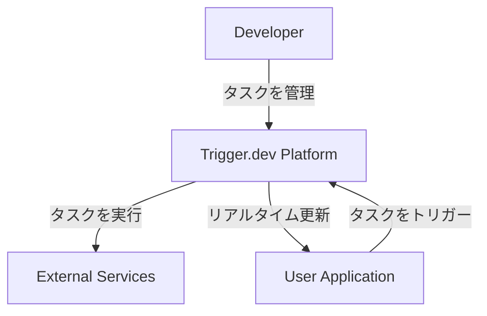
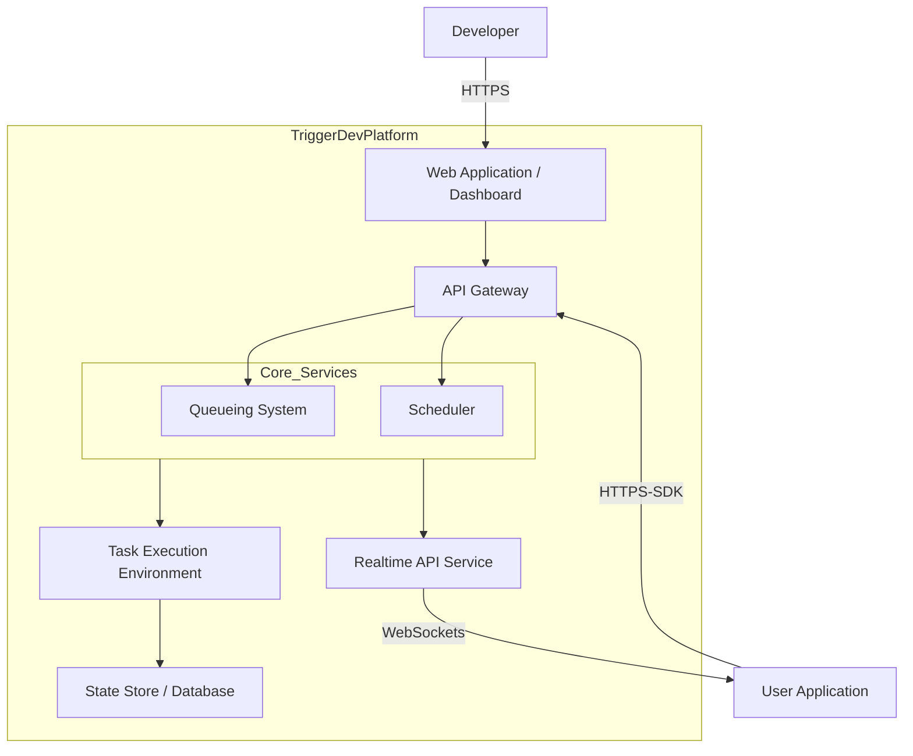
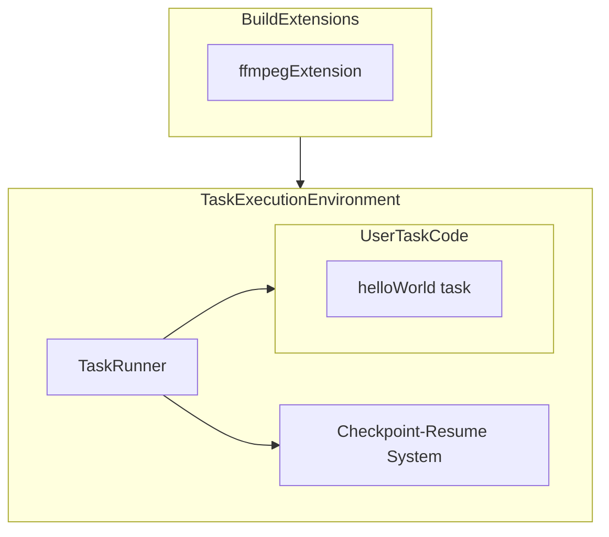
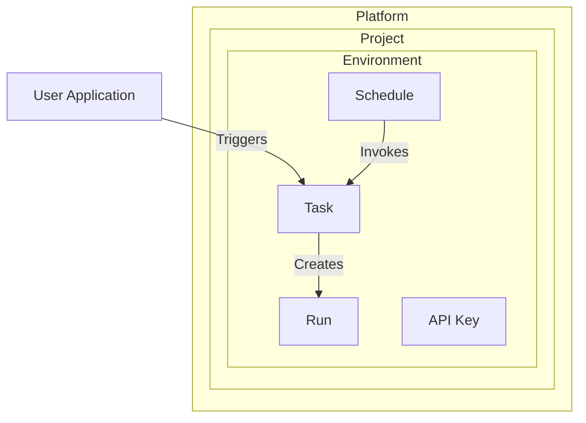
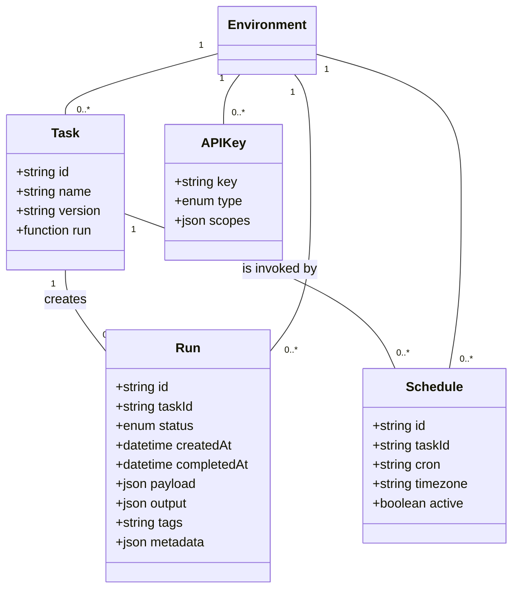

## ■概要

Trigger.devは、開発者が自身のコードベース内で、長時間実行するバックグラウンドジョブや複雑なAIワークフローを構築、デプロイ、管理するための**オープンソースフレームワーク**です。

このフレームワークの最大の価値は、**サーバーレス環境の実行時間制限を事実上なくし**、開発者が通常の非同期コードを記述するだけで、スケーラブルで耐久性のあるタスクを作成できる点にあります。まるでZapierのような手軽さと、Temporalのような堅牢性を、使い慣れたTypeScriptで実現します。

### ●主な用途

  * 複数日にわたるメールキャンペーンの送信
  * 数時間に及ぶ動画処理
  * 大規模なデータETLプロセス
  * 複数のAIモデルを連携させるエージェントワークフロー

### ●提供形態

開発者は、プロジェクト要件に応じて2つの運用形態を選択できます。

  * **マネージドクラウドサービス**: Trigger.devがインフラを管理し、すぐに利用可能。
  * **セルフホスティング**: 開発者自身のインフラ（Docker/Kubernetes）で運用し、データを外部に出さない構成も可能。


## ■特徴

Trigger.devは、バックグラウンドジョブのライフサイクル全体を支援する多様な機能を提供します。これらの特徴は、Trigger.devが単なるジョブキューイングシステムではなく、タスクの定義から実行、監視、フロントエンド連携までをカバーする統合的な**高信頼実行プラットフォーム**であることを示します。開発者は分散システムの複雑な側面を意識することなく、ビジネスロジックの実装に集中できます。

  * **タイムアウトのない実行**
      * サーバーレス環境の**実行時間制限（例: Vercelの最大5分）を受けずに**、数日にわたるような長時間のタスクも確実に完了させます。動画エンコーディングや大規模なAI推論に最適です。
  * **開発者中心のSDK**
      * 使い慣れた**JavaScript/TypeScript SDK**を提供し、既存プロジェクト内でタスクをコードとして直接定義できます。これにより、Gitでのバージョン管理やローカルテストなど、標準的な開発ワークフローをそのまま適用できます。
  * **包括的な可観測性**
      * 専用のWebダッシュボードで、全タスク実行（Run）の状況をリアルタイムに監視できます。各Runには詳細なログとライブトレースビューが提供され、デバッグを強力に支援します。
  * **高い信頼性と耐久性**
      * エラー発生時には、指数的バックオフを用いた**自動リトライ**が作動します。
      * **Checkpoint-Resume System**がタスクの状態を永続化し、インフラ障害時も中断箇所から自動で処理を再開します。
  * **キューと並行実行制御**
      * タスクの実行フローを管理するキュー機能と、**同時実行数を細かく制御する機能**を提供します。これにより、ユーザーごとやサービスティアごとに実行レートを調整できます。
  * **柔軟なスケジュールと遅延実行**
      * **CRON構文**で定期実行スケジュールを簡単に設定できます。
      * `wait.for()`や`wait.until()`関数で、プログラム的に数秒から数日にわたる遅延をタスクに組み込めます。
  * **リアルタイムAPIとフロントエンド連携**
      * **Realtime機能**により、実行中のバックグラウンドタスクとフロントエンドアプリケーションをシームレスに連携できます。Reactフックを使い、タスクの実行ステータスをUIにリアルタイムで反映させたり、LLMの応答をストリーミング表示したりできます。
  * **柔軟な実行環境とビルド拡張**
      * **Build Extensions機能**で、タスクの実行環境を自由にカスタマイズできます。システムパッケージのインストールや、FFmpeg、Puppeteerといった外部ツールをコンテナに追加可能です。


## ■構造

Trigger.devのアーキテクチャを、C4モデルを用いて段階的に説明します。

### ●システムコンテキスト図



| 要素名 | 説明 |
| :--- | :--- |
| **Developer** | タスクの定義、デプロイ、監視を行う開発者。CLIやWebダッシュボードでプラットフォームと対話。 |
| **User Application** | 開発者が構築するアプリケーション。SDKでタスクをトリガーし、Realtime APIでリアルタイム更新を受信。 |
| **Trigger.dev Platform** | タスクの受付、キューイング、スケジューリング、実行、監視といったオーケストレーション全体を担当。 |
| **External Services** | タスクが対話する外部のサードパーティAPIやサービス群（例: OpenAI, Slack, Stripe）。 |

### ●コンテナ図

「Trigger.dev Platform」の内部を構成する主要なコンテナ（サービスやデータストア）を示します。このアーキテクチャは、リクエスト管理を行う「**コントロールプレーン**」と、タスク実行を行う「**データプレーン**」に明確に分離されており、それぞれを独立してスケールできます。



| 要素名 | 説明 |
| :--- | :--- |
| **Web Application / Dashboard** | 開発者がプロジェクト、タスク実行、APIキーなどを管理・監視するWeb UI。 |
| **API Gateway** | SDKからのタスク実行リクエストを受け付ける公開エンドポイント。認証とルーティングを実行。 |
| **Core Services (Orchestrator)** | タスクのキューイング、スケジューリング、システム全体の状態を管理する中核サービス群。 |
| **Task Execution Environment** | 開発者のタスクコードが実行される、安全な隔離ランタイム環境。 |
| **Realtime API Service** | フロントエンドとのWebSocket接続を管理し、タスクのステータス変更などをリアルタイムに通知。 |
| **Queueing System** | 実行リクエストされたタスクをキューに格納し、優先度や並行実行数に基づき管理。 |
| **State Store / Database** | タスク定義、実行履歴、ログ、チェックポイントなど、全ての永続データを格納。 |
| **Scheduler** | CRONベースのタスクや遅延タスクの起動を管理。 |

### ●コンポーネント図

「Task Execution Environment」を構成する内部コンポーネントを示します。核となる**Checkpoint-Resume System**が、タイムアウトのない長時間実行を実現します。このシステムは、`wait.for()`などのSDK呼び出しをトリガーに、実行中プロセスの全状態をスナップショットとして保存します。



| 要素名 | 説明 |
| :--- | :--- |
| **Task Runner** | 個々のタスク実行のライフサイクルを管理。ユーザーコードを取得し、`run`関数を実行。 |
| **Checkpoint-Resume System (CRIU)** | 待機処理が呼び出された際に、プロセスの状態をスナップショットとして保存・復元する低レベルコンポーネント。**CRIU** (*Checkpoint/Restore In Userspace*) というLinuxの技術を基にしています。 |
| **User Task Code** | 開発者がデプロイしたJavaScript/TypeScriptコード。一意のIDと`run`関数を持つタスク定義。 |
| **Build Extensions** | デプロイ時にコンテナイメージをカスタマイズするコンポーネント。FFmpegなどを追加可能。 |


## ■データ

### ●概念モデル

システム内の主要エンティティと関係性の全体像です。



| 要素名 | 説明 |
| :--- | :--- |
| **Project** | 複数の環境（dev, staging, prod）を内包する論理的なコンテナ。 |
| **Environment** | 特定のデプロイメント段階に対応する環境（dev, staging, prodなど）。 |
| **Task** | 実行される作業の定義。一意のIDと実行ロジック（`run`関数）を持つ。 |
| **Run** | Taskが実際に実行されたインスタンス。ステータス、ログなどの履歴情報を保持。 |
| **Schedule** | TaskをCRON式で定期的に起動するための定義。 |
| **API Key** | EnvironmentへのAPIアクセスを認証するキー。 |
| **User Application** | 開発者のアプリケーション。APIキーを使いタスクをトリガー。 |

### ●情報モデル

エンティティの具体的な属性をクラス図で示します。データ構造は「**Run（実行）**」中心に設計されており、すべての実行が監査・再現可能なオブジェクトとして扱われます。



| クラス名 | 属性 | 説明 |
| :--- | :--- | :--- |
| **Task** | id | タスクの一意な識別子 |
| | name | タスクの表示名 |
| | version | デプロイごとのバージョン |
| | run | 実行されるビジネスロジックを含む関数 |
| **Run** | id | 実行の一意な識別子 |
| | taskId | 関連するTaskのID |
| | status | 実行状態（PENDING, COMPLETED, FAILEDなど） |
| | createdAt | 実行開始日時 |
| | completedAt | 実行完了日時 |
| | payload | 実行時の入力データ |
| | output | 実行結果の出力データ |
| | tags | 検索やフィルタリング用のタグ配列 |
| | metadata | 実行に関連するカスタムメタデータ |
| **Schedule** | id | スケジュールの一意な識別子 |
| | taskId | 起動するTaskのID |
| | cron | CRON式のスケジュール文字列 |
| | timezone | スケジュールが準拠するタイムゾーン |
| | active | スケジュールが有効かどうかのフラグ |
| **APIKey** | key | APIキーの文字列 |
| | type | キーの種類（SECRETまたはPUBLIC\_ACCESS） |
| | scopes | PUBLIC\_ACCESSトークンに許可された操作範囲 |


## ■構築方法

さっそくTrigger.devを使ってみましょう。プロジェクトのセットアップは数分で完了します。

1.  **アカウントとプロジェクトの作成**
    1.  [公式サイト](https://cloud.trigger.dev)で、GitHubまたはメールアドレスでサインアップします。
    2.  サインアップ後、画面の指示に従いOrganization（組織）と最初のProjectを作成します。
2.  **CLIによる初期設定**
    1.  既存のWebアプリケーション（例: Next.js）のルートディレクトリで、以下のコマンドを実行します。
        ```bash
        npx trigger.dev@latest init
        ```
    2.  このコマンドは、ログイン認証、設定ファイル（`trigger.config.ts`）の生成、サンプルタスク（`/trigger/example.ts`）の配置を対話的に行います。
3.  **環境変数の設定**
    1.  プロジェクトのルートに`.env`ファイルを作成します。
    2.  ダッシュボードの「API Keys」ページで確認できる**Secret Key**を`TRIGGER_SECRET_KEY`として設定します。
        ```
        TRIGGER_SECRET_KEY="tr_dev_xxxxxxxxxxxx"
        ```
4.  **ローカル開発環境の実行**
    1.  以下のコマンドでローカル開発サーバーを起動します。
        ```bash
        npx trigger.dev@latest dev
        ```
    2.  このコマンドは、`/trigger`ディレクトリ内のファイル変更を監視し、タスク定義を自動でプラットフォームに登録・更新します。また、プラットフォームからのリクエストを受け、**あなたのマシン上でタスクを直接実行します**。
    3.  起動後、ターミナルに出力される「Test page」のURLから、Web UIでローカルのタスクをテストできます。


## ■利用方法

SDKを使用したタスクの定義から実行、管理までの基本的な利用方法を解説します。

### ●タスクの定義

`@trigger.dev/sdk/v3`からインポートした`task`関数でタスクを定義します。各タスクは、一意の`id`と`run`非同期関数を持つオブジェクトとして`export`します。

  * **コードサンプル (`/trigger/simple-task.ts`):**
    ```typescript
    import { task } from "@trigger.dev/sdk/v3";

    // 各タスクはエクスポートが必要
    export const simpleTask = task({
      // プロジェクト内で一意のID
      id: "simple-task",

      // run関数がタスクの本体。payloadでデータを受け取る
      run: async (payload: { url: string }, { logger }) => {
        logger.info("シンプルなタスクを開始します", { payload });

        // 5秒間の待機をシミュレート
        await new Promise(resolve => setTimeout(resolve, 5000));

        logger.info(`処理が完了しました: ${payload.url}`);

        return { success: true, completedAt: new Date() };
      },
    });
    ```

### ●タスクのトリガー

アプリケーションのバックエンドから`tasks.trigger()`メソッドを呼び出してタスクを起動します。

  * **コードサンプル (`/app/api/trigger-task/route.ts` - Next.js App Routerの例):**
    ```typescript
    import { tasks } from "@trigger.dev/sdk/v3";
    import { NextResponse } from "next/server";

    export async function POST(request: Request) {
      try {
        // "simple-task" IDを持つタスクをペイロード付きでトリガー
        const handle = await tasks.trigger("simple-task", {
          url: "https://trigger.dev",
        });

        // handleには実行IDなどが含まれる
        return NextResponse.json(handle);
      } catch (error) {
        return NextResponse.json({ error: "Failed to trigger task" }, { status: 500 });
      }
    }
    ```

### ●Management APIの利用

Management APIを使い、タスクの実行履歴（Run）をプログラムから取得・操作します。`configure`関数でAPIキーを設定してから使用します。

  * **コードサンプル (バックエンドの任意のスクリプト):**
    ```typescript
    import { runs, configure } from "@trigger.dev/sdk/v3";

    // 環境変数からAPIキーを読み込み設定
    configure({ secretKey: process.env.TRIGGER_SECRET_KEY });

    async function getFailedRuns() {
      console.log("失敗した実行を取得します...");
      const failedRuns = await runs.list({
        status: "FAILED",
        limit: 10,
      });

      console.log(`失敗した実行が ${failedRuns.data.length} 件見つかりました。`);
      console.log(failedRuns.data);
    }

    getFailedRuns().catch(console.error);
    ```

### ●Realtime APIの利用

`@trigger.dev/react-hooks`を利用し、フロントエンドでタスクの実行状況をリアルタイムに表示します。

  * **セットアップ (`/app/layout.tsx` など):**
    まず、アプリケーションのルートコンポーネントを `TriggerProvider` でラップし、**Public API Key** を渡します。

    ```javascript
    "use client";
    import { TriggerProvider } from "@trigger.dev/react-hooks";

    export default function RootLayout({ children }: { children: React.ReactNode }) {
      return (
        <html lang="en">
          <body>
            <TriggerProvider
              publicApiKey={process.env.NEXT_PUBLIC_TRIGGER_PUBLIC_KEY!}
            >
              {children}
            </TriggerProvider>
          </body>
        </html>
      );
    }
    ```

  * **コードサンプル (Reactコンポーネント):**

    ```javascript
    "use client";
    import { useRealtimeRun } from "@trigger.dev/react-hooks";
    import { useEffect } from "react";

    export function RunStatusViewer({ runId }: { runId: string }) {
      // runIdを渡し、実行状態をリアルタイムに購読
      const { run, error } = useRealtimeRun(runId);

      useEffect(() => {
        if (run) {
          console.log(`Run status updated: ${run.status}`);
        }
      }, [run]);

      if (error) {
        return <div style={{ color: "red" }}>Error: {error.message}</div>;
      }

      if (!run) {
        return <div>Loading run status...</div>;
      }

      return (
        <div>
          <h3>Run ID: {run.id}</h3>
          <p>Status: <strong style={{ textTransform: "capitalize" }}>{run.status.toLowerCase()}</strong></p>
        </div>
      );
    }
    ```


## ■運用

本番環境での運用で気をつけるポイントを解説します。

### ●デプロイ

CLIの`deploy`コマンドで、開発したタスクを本番環境へデプロイします。

```bash
npx trigger.dev@latest deploy
```

このコマンドは、`/trigger`ディレクトリ内のコードをバンドルし、Trigger.devプラットフォームにアップロードします。デプロイによって**実行中のタスクが影響を受けることはありません**。

### ●監視とロギング

  * **ダッシュボードによる監視**
      * Webダッシュボードで、全環境のタスク実行（Run）のステータス、成功率、実行時間などを一覧で確認します。
  * **詳細ログとトレース**
      * 各Runの詳細ページで、出力したログや各ステップの実行時間を含む詳細なトレースを確認し、問題の原因特定やパフォーマンス分析に役立てます。
  * **アラート設定**
      * タスクの失敗やデプロイの問題が発生した際に、メール、Slack、Webhookへ通知を送信できます。

### ●セルフホスティング

インフラの完全な制御やデータコンプライアンス要件に対応するため、セルフホスティングが可能です。
セルフホスティングでは、インフラのプロビジョニング、スケーリング、セキュリティ、監視の責任を自身で負います。その代わりに、**データを外部に出さず**、自社のセキュリティポリシー下でプラットフォームを運用できます。

  * **Dockerによる構築**
      * `docker-compose.yml`ファイルを用いて、必要なサービス群を一括で起動します。小規模な本番運用まで対応できます。
  * **Kubernetesによる構築**
      * 公式のHelmチャートが提供されており、大規模で高可用性が求められる本番環境の構築を簡素化します。

### ●制限事項

Trigger.dev Cloudの各プランにおける主要な制限事項です。（詳細は公式サイトをご確認ください）

| 機能 | Free | Hobby | Pro |
| :--- | :--- | :--- | :--- |
| **同時実行数** | 10 | 25 | 100+ |
| **APIレート制限** | 1,500リクエスト/分 | 1,500リクエスト/分 | 1,500リクエスト/分 |
| **スケジュール数** | 10 | 100 | 1,000+ |
| **ログ保持期間** | 1日 | 7日 | 30日 |
| **Realtime接続数** | 10 | 50 | 500+ |


## ■参考リンク

- 公式
    - [Trigger.dev | Open source background jobs and AI infrastructure.](https://trigger.dev/)
    - [Welcome to the Trigger.dev docs](https://trigger.dev/docs/introduction)
    - [How it works - Trigger.dev](https://trigger.dev/docs/how-it-works)
    - [Quick start - Trigger.dev](https://trigger.dev/docs/quick-start)
    - [Self-hosting Trigger.dev v4 using Docker](https://trigger.dev/blog/self-hosting-trigger-dev-v4-docker)
    - [Limits - Trigger.dev](https://trigger.dev/docs/limits)
    - [Realtime API - Trigger.dev](https://trigger.dev/docs/realtime/overview)
    - [OveAPI reference - Trigger.dev](https://trigger.dev/docs/management/overview)
    - [Authentication - Trigger.dev](https://trigger.dev/docs/frontend/overview)
    - [API keys - Trigger.dev](https://trigger.dev/docs/apikeys)
    - [Self-hosting Trigger.dev v4 using Kubernetes](https://trigger.dev/blog/self-hosting-trigger-dev-v4-kubernetes)
- GitHub
    - [Trigger.dev – open source background jobs and AI infrastructure - GitHub](https://github.com/triggerdotdev/trigger.dev)
- DEV Community
    - [Trigger.dev - DEV Community](https://dev.to/triggerdotdev)


この記事が少しでも参考になった、あるいは改善点などがあれば、ぜひリアクションやコメント、SNSでのシェアをいただけると励みになります！
