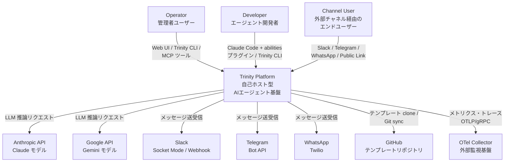
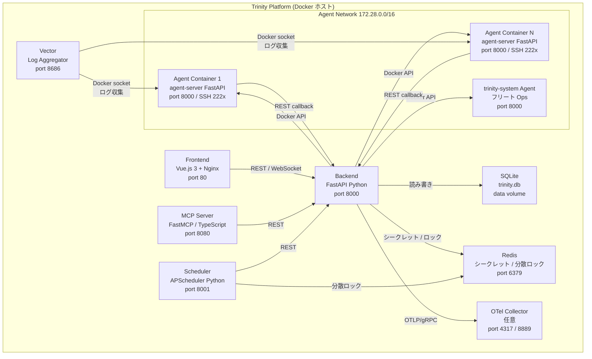
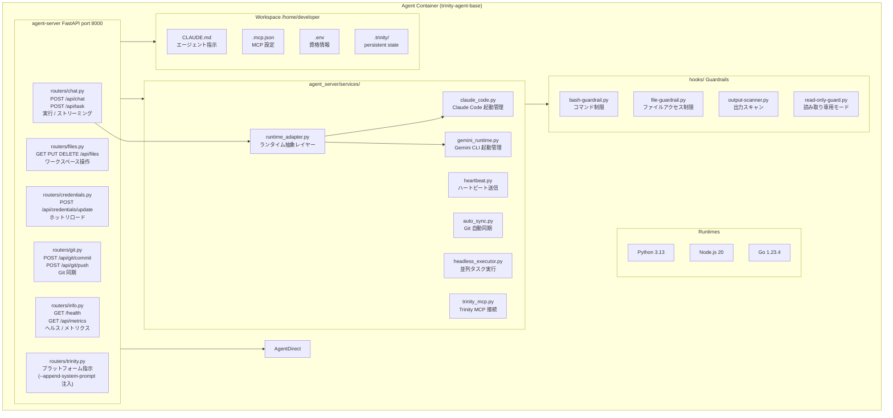
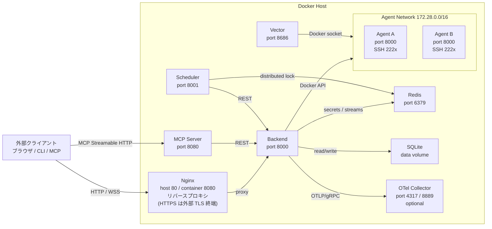
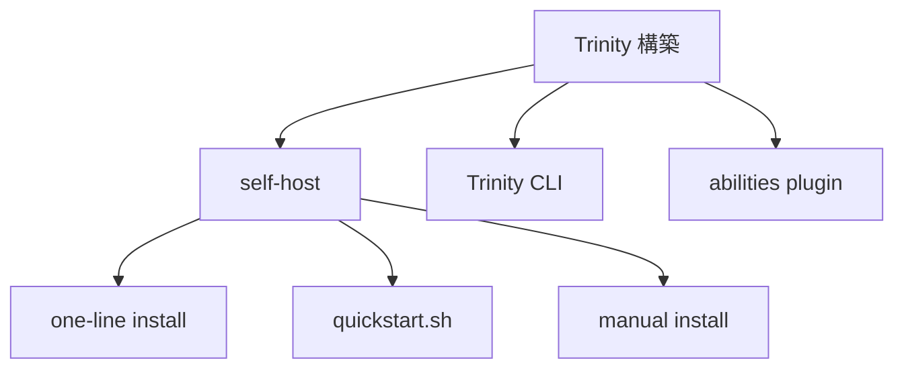

Trinity は、AI エージェントを本番環境で稼働させるための自己ホスト型オーケストレーション基盤です。Claude Code や Gemini CLI で開発したエージェントを Docker コンテナとして隔離実行し、スケジューリング・観測性・監査証跡・マルチエージェント連携を付与します。本調査では、構造（C4 モデル）・データモデル・構築/利用方法・運用までを一次情報（README / 開発者向け CLAUDE.md / `src/backend/db/schema.py` 等の実装ソース）に基づいて整理します。

| 項目 | 内容 |
|---|---|
| 調査対象 | Trinity（`github.com/Abilityai/trinity`） |
| 開発元 | Ability.ai |
| 分類 | 自己ホスト型 AI エージェント本番運用プラットフォーム |
| ライセンス | Apache-2.0 |
| 主要言語 | Python（FastAPI バックエンド）+ Vue 3（フロントエンド） |
| バージョン | v0.6.1 |
| 公式サイト | ability.ai/trinity / docs.ability.ai |


## ■概要

Trinity は、AI エージェントを本番環境で稼働させるための自己ホスト型オーケストレーション基盤です。開発元は Ability.ai、ライセンスは Apache-2.0、現行バージョンは v0.6.1 です。

**Trinity が解決する課題**

AI エージェントの本番運用には 3 つの壁があります。SaaS プラットフォームはデータが自社の管理外に出ます。自前実装は 6〜12 か月・数千万円規模の工数がかかります。フレームワーク単体ではフリート管理・スケジューリング・監査証跡がありません。Trinity はこの 3 つを同時に解決します。

**位置づけ**

「Claude Code がエージェントを書く、Trinity が本番で動かす」という分業が公式の位置づけです。Claude Code（または Gemini CLI）で開発したエージェントを Trinity に登録すると、Docker コンテナとして隔離されたランタイムで稼働し、スケジューリング・監視・監査が自動で付与されます。

**2 つの運用モデル**

| モデル | 説明 |
|---|---|
| セルフホスト | ワンライナーで自社インフラに展開。データはすべて自社管理下に留まる |
| マネージドインスタンス | 自分が管理するクラウド上に Ability.ai エンジニアが支援して構築。データは指定のクラウドに残る |

どちらのモデルでも、データは第三者の SaaS 環境に流出しません。

**関連技術との比較**

| ツール | 適した用途 | データの所在 | コンテナ分離 | スケジューリング | 監査証跡 |
|---|---|---|---|---|---|
| Claude Code | ローカルでのエージェント開発・反復 | 手元の PC | なし | なし | なし |
| OpenClaw / Hermes | 自前ハーネスとしてのエージェント実行 | 自社インフラ | なし | なし | なし |
| Multica / Paperclip | マネージド SaaS でのエージェント運用 | SaaS ベンダー側 | あり | あり | あり |
| **Trinity** | 自社インフラでの本番エージェント運用 | 自社インフラ | エージェントごと | あり | あり |


## ■特徴

Trinity の機能は 4 つのカテゴリに整理されます。

### フリート可観測性（Fleet Observability）


- **グラフビュー** — エージェント群の接続トポロジーをリアルタイム描画。各エージェントの成功率・コスト・リソース使用量を表示します。
- **タイムラインビュー** — ガントチャート形式の実行履歴。トリガー種別（手動 / スケジュール / MCP / エージェント起動 / 公開 / 課金）ごとに色分けされます。
- **ホストテレメトリー** — ダッシュボードヘッダーにホストの CPU・メモリ・ディスクをリアルタイム表示します。
- **フリートヘルス監視** — Docker・ネットワーク・ビジネスロジックの多層ヘルスチェック。WebSocket でアラートを配信します。
- **OpenTelemetry 連携** — コスト・トークン使用量・生産性の指標を Grafana や Datadog にエクスポートできます。マルチエージェント呼び出しの分散トレースもサポートします。

### エージェントランタイム（Agent Runtime）

- **コンテナ隔離** — エージェント 1 つにつき 1 Docker コンテナ。リソースを独立して割り当てます。
- **マルチランタイム** — Claude Code（Anthropic）と Gemini CLI（Google）をエージェントごとに選択できます。
- **モデル選択** — タスク・スケジュールごとに Claude モデル（Opus / Sonnet / Haiku）を切り替えられます。
- **カスタムダッシュボード** — `dashboard.yaml` で定義した 11 種類のウィジェットで、エージェントの指標を可視化します。
- **プレイブック** — エージェントが持つスキル（`.claude/skills/`）を UI から直接呼び出せます。
- **動的思考ステータス** — エージェントの動作状況（ファイル読込・コード検索など）をリアルタイムにラベル表示します。
- **永続メモリ** — ファイルベースおよびデータベースバックの記憶がセッション間を通じて維持されます。
- **実行ガードレール** — コンフィグで設定した確定的な安全制約をエージェントごとにオーバーライドできます。
- **実行キュー** — 並列上限を超えたタスクを SQLite バックの FIFO キューに積み、再起動後も保持します。
- **暴走防止** — `max_turns` パラメータでエージェントの実行深度を上限設定できます。

### オーケストレーション（Orchestration）

- **エージェント間通信** — 階層的な委任と細粒度のアクセス制御でエージェントが互いに呼び出し合えます。
- **並列タスク実行** — オーケストレーター/ワーカーパターン向けにステートレスな並列実行をサポートします。
- **共有フォルダ** — Docker ボリューム経由でエージェント間のファイル共有を実現します。
- **システムマニフェスト** — 1 枚の YAML ファイルでマルチエージェントシステムを定義して一括デプロイできます。
- **スケジューリング** — cron ベースの自動実行。Redis 分散ロックで多重起動を防ぎます。
- **MCP サーバー** — 約 80 ツールを持つ Model Context Protocol サーバーで外部からエージェントを操作できます（実装 `src/mcp-server/src/tools/*.ts` で 80 ツール登録。README は 74、開発者向け CLAUDE.md は 62 と記載しており、ツール追加に伴い公称値は陳腐化している）。
- **チャネルアダプター** — Slack・Telegram・WhatsApp をメッセージングフロントエンドとして接続できます。
- **統合アクセス制御** — メール認証アローリストが Web・Slack・Telegram のすべてに横断適用されます。
- **プロアクティブメッセージ** — エージェントが自発的にユーザーへメッセージを送信できます。

### 運用管理（Operations）

- **テンプレート展開** — ビルトインテンプレートまたは GitHub リポジトリからエージェントを作成できます。
- **クレデンシャル管理** — ファイル直接注入と Git 暗号化ストレージ（`.credentials.enc`）で秘密情報を安全に扱います。
- **プラットフォーム監査ログ** — ライフサイクル・認証・MCP イベントの追記専用クロスカッティング証跡（admin のみ閲覧）。
- **ロール階層** — 4 段階 RBAC（`user` < `operator` < `creator` < `admin`）を最初のログイン時のホワイトリストで制御します。
- **ライブ実行ストリーミング** — 実行ログを Web UI にリアルタイム配信します。
- **エフェメラル SSH アクセス** — 時間限定の SSH 資格情報でエージェントコンテナに直接ターミナル接続できます。
- **公開エージェントリンク** — 未認証ユーザー向けに共有リンクを発行できます。セッション永続化と Slack 連携に対応しています。
- **課金対応（x402）** — Nevermined x402 決済プロトコルでエージェントごとに有料アクセスを設定できます。
- **モバイル管理 PWA** — `/m` でアクセスできるモバイル向け管理画面をホーム画面にインストールできます。
- **サブスクリプション管理** — Claude Max/Pro サブスクリプショントークンを複数エージェントで集中管理できます。


## ■構造

### ●システムコンテキスト図



#### システムコンテキスト図 — 要素説明

| 要素名 | 説明 |
|---|---|
| Operator | Web UI・Trinity CLI・MCP ツールでフリートを管理する管理者ユーザー |
| Developer | Claude Code + abilities プラグインを使ってエージェントを構築・デプロイするエージェント開発者 |
| Channel User | Slack / Telegram / WhatsApp / Public Link 経由でエージェントと対話するエンドユーザー |
| Trinity Platform | 自己ホスト型の AI エージェントオーケストレーション基盤本体 |
| Anthropic API | Claude モデルの推論エンドポイント（Claude Code ランタイムが接続） |
| Google API | Gemini CLI ランタイムが使う Gemini モデルのエンドポイント |
| Slack | Socket Mode と Webhook の 2 トランスポートでメッセージを送受信する外部チャネル |
| Telegram | Bot API Webhook でメッセージ・音声・ファイルを送受信する外部チャネル |
| WhatsApp | Twilio 経由でメッセージを送受信する外部チャネル |
| GitHub | エージェントテンプレートの clone 元・Git sync の対向リポジトリ |
| OTel Collector | OTLP/gRPC でメトリクス・トレースを受信する外部監視基盤（任意） |

### ●コンテナ図



#### コンテナ図 — Platform Containers

| 要素名 | 説明 |
|---|---|
| Frontend | Vue.js 3 + Nginx の Web UI。ユーザーがエージェントフリートを操作する制御コンソール |
| Backend | FastAPI ベースの REST API サーバー。多数のエンドポイントを多数のルーターで提供する |
| MCP Server | FastMCP（TypeScript / Node.js）実装の MCP サーバー。約 80 ツール（実装 `tools/*.ts` 由来。README 公称は 74）を Streamable HTTP で外部公開する |
| Scheduler | APScheduler ベースの cron 実行サービス。Redis 分散ロックでスケジュールの多重起動を防ぐ |
| Vector | ログアグリゲーター。全コンテナの stdout/stderr を Docker socket 経由で収集し JSON に変換する |
| Redis | シークレット・OAuth トークン・分散ロック・スロットカウンター・EventBus ストリームを保持する |
| SQLite | エージェント定義・チャット履歴・スケジュール・実行履歴・監査ログ等を永続化する |
| OTel Collector | メトリクスとトレースを Grafana / Datadog 等の外部監視基盤へ転送する（任意コンポーネント） |

#### コンテナ図 — Agent Network

| 要素名 | 説明 |
|---|---|
| Agent Container 1..N | テンプレートから起動されるユーザー定義の AI エージェントコンテナ。Claude Code または Gemini CLI を実行する |
| trinity-system Agent | フリート全体の Ops 操作（ヘルス確認・再起動・コスト確認）を担う組み込みシステムエージェント |

### ●コンポーネント図

#### Backend（FastAPI）内部構成

```mermaid
graph TD
    subgraph Backend["Backend src/backend"]
        MAIN["main.py<br/>FastAPI App<br/>WebSocket Manager<br/>ルーター登録"]

        subgraph Routers["routers/"]
            R_AGENT["agents.py<br/>agent_config.py<br/>agent_files.py<br/>エージェント CRUD / 起動停止"]
            R_AUTH["auth.py<br/>users.py<br/>mcp_keys.py<br/>認証 / ユーザー管理"]
            R_EXEC["schedules.py<br/>executions.py<br/>loops.py<br/>スケジュール / 実行管理"]
            R_CHAN["slack.py<br/>telegram.py<br/>whatsapp.py<br/>voip.py<br/>チャネルアダプター"]
            R_OBS["monitoring.py<br/>telemetry.py<br/>audit_log.py<br/>observability.py<br/>監視 / 監査"]
            R_PUB["public_links.py<br/>public.py<br/>paid.py<br/>webhooks.py<br/>公開アクセス / 決済"]
        end

        subgraph Services["services/"]
            S_DOCKER["docker_service.py<br/>コンテナ管理"]
            S_EXEC["task_execution_service.py<br/>capacity_manager.py<br/>slot_service.py<br/>backlog_service.py<br/>タスク実行 / 容量管理"]
            S_BREAKER["dispatch_breaker.py<br/>agent_client.py<br/>サーキットブレーカー"]
            S_SCHED["scheduler_service.py<br/>cleanup_service.py<br/>スケジュール / 清掃"]
            S_EVENT["event_bus.py<br/>WebSocket イベント配信<br/>Redis Streams"]
            S_MON["monitoring_service.py<br/>heartbeat_service.py<br/>canary_service.py<br/>ヘルス監視"]
            S_CRED["credential_encryption.py<br/>ssh_service.py<br/>資格情報 / SSH"]
            S_CHAN_SVC["slack_service.py<br/>proactive_message_service.py<br/>loop_service.py<br/>チャネル統合サービス"]
        end

        subgraph Adapters["adapters/ チャネルアダプター"]
            A_ROUTER["message_router.py<br/>レート制限 / エージェント解決"]
            A_SLACK["slack_adapter.py<br/>slack_socket.py<br/>slack_webhook.py"]
            A_TG["telegram_adapter.py<br/>telegram_webhook.py"]
            A_WA["whatsapp_adapter.py<br/>twilio_webhook.py"]
        end

        subgraph DB["db/ ドメインモジュール"]
            DB_AGENTS["agents.py<br/>schedules.py<br/>executions 関連"]
            DB_CHAT["chat.py<br/>sessions.py<br/>チャット永続化"]
            DB_AUDIT["audit.py<br/>monitoring.py<br/>notifications.py<br/>監査 / 通知"]
            DB_CHAN["slack.py<br/>telegram_channels.py<br/>whatsapp_channels.py<br/>チャネル設定"]
        end

        subgraph Canary["canary/ 不変条件監視"]
            C_INV["invariants/<br/>キュー整合性<br/>スロット重複<br/>ゾンビ検出"]
        end

        MAIN --> Routers
        Routers --> Services
        Services --> DB
        Services --> Adapters
        Adapters --> A_ROUTER
        Services --> Canary
    end
```



#### Backend 内部構成 — Routers

| 要素名 | 説明 |
|---|---|
| agents.py / agent_config.py / agent_files.py | エージェントの CRUD・起動停止・設定・ファイルアクセスを担うコアルーター群 |
| auth.py / users.py / mcp_keys.py | 管理者ログイン・メール認証・ユーザー RBAC・MCP API キー管理 |
| schedules.py / executions.py / loops.py | cron スケジュール・実行履歴・逐次ループの CRUD と制御 |
| slack.py / telegram.py / whatsapp.py / voip.py | 外部チャネルの Webhook 受信・バインディング管理 |
| monitoring.py / telemetry.py / audit_log.py / observability.py | フリートヘルス・ホストリソース・監査ログの提供 |
| public_links.py / public.py / paid.py / webhooks.py | 認証なし公開リンク・x402 決済・Webhook トリガー管理 |

#### Backend 内部構成 — Services

| 要素名 | 説明 |
|---|---|
| docker_service.py | Docker SDK を通じてコンテナのライフサイクルを管理する唯一の窓口 |
| task_execution_service.py | タスク実行のライフサイクル全体（スロット取得・アクティビティ記録・結果書き込み）を担う |
| capacity_manager.py | スロット管理とバックログ管理を統合した容量制御ファサード |
| slot_service.py | Redis を使ったアトミックな並行スロットカウンター（CapacityManager 内部） |
| backlog_service.py | SQLite FIFO でオーバーフロータスクを永続キューイングする（CapacityManager 内部） |
| dispatch_breaker.py | エージェントへの AUTH エラーを検知して open/half-open/closed を遷移するサーキットブレーカー |
| agent_client.py | エージェントコンテナへの HTTP クライアント。トランスポート障害用の別サーキットブレーカーを持つ |
| scheduler_service.py | APScheduler ベースで cron ジョブを管理するスケジューリングエンジン |
| cleanup_service.py | 孤立した実行レコードや失効スロットをウォッチドッグで回収するリカバリサービス |
| event_bus.py | Redis Streams を使って WebSocket イベントを全接続クライアントへ配信するイベントバス |
| monitoring_service.py | 定期ループでフリート全体のヘルスチェックを実施する監視サービス |
| heartbeat_service.py | エージェントからの push ハートビートを監視し、失火時にオペレーターアラートを発行する |
| canary_service.py | 不変条件ハーネスを定期実行してオーケストレーションの整合性を検証する |
| credential_encryption.py | AES-256-GCM で資格情報ファイルを暗号化・復号する |
| slack_service.py / proactive_message_service.py / loop_service.py | Slack API クライアント・能動的メッセージ送信・逐次ループ実行の各統合サービス |

#### Backend 内部構成 — Channel Adapters

| 要素名 | 説明 |
|---|---|
| message_router.py | 受信メッセージのレート制限・エージェント解決・タスク実行パイプラインを担う共通ルーター |
| slack_adapter.py / slack_socket.py / slack_webhook.py | Slack DM・メンション・スレッド返信を Socket Mode または Webhook で受信する |
| telegram_adapter.py / telegram_webhook.py | Telegram DM・グループチャット・音声文字起こしを Webhook で受信する |
| whatsapp_adapter.py / twilio_webhook.py | Twilio HMAC 署名を検証して WhatsApp メッセージを受信する |

#### Backend 内部構成 — DB / Canary

| 要素名 | 説明 |
|---|---|
| db/agents.py / schedules.py 等 | SQLite への読み書きをドメインごとに分割した永続化モジュール群 |
| canary/invariants/ | キュー整合性・スロット重複・ゾンビプロセス等の不変条件を定期アサートする監視モジュール群 |

#### Agent Container 内部構成



#### Agent Container 内部構成 — Runtimes

| 要素名 | 説明 |
|---|---|
| Python 3.13 | エージェント実行・agent-server の主要ランタイム |
| Node.js 20 | Claude Code 本体および JavaScript 系タスクのランタイム |
| Go 1.23.4 | Go 系タスクのランタイム |

#### Agent Container 内部構成 — agent-server Routers

| 要素名 | 説明 |
|---|---|
| routers/chat.py | POST /api/chat でメッセージを受け取り Claude Code または Gemini CLI を起動して結果を返す |
| routers/files.py | /home/developer 配下のワークスペースファイルを一覧・取得・更新・削除する |
| routers/credentials.py | .env ファイルを更新して実行中エージェントに資格情報をホットリロードする |
| routers/git.py | agent の GitHub リポジトリへのコミット・プッシュ・プルを実行する |
| routers/info.py | /health でステータス・並行実行数・連続失敗数を返し、/api/metrics でカスタムメトリクスを提供する |
| routers/trinity.py | Trinity プラットフォーム指示を提供する。なお旧来の inject / reset エンドポイントは Issue #136 で廃止され、現在はプラットフォーム指示を Claude Code 起動ごとに `--append-system-prompt` でランタイム注入する方式に変わっている |

#### Agent Container 内部構成 — Services

| 要素名 | 説明 |
|---|---|
| claude_code.py | Claude Code プロセスを起動・監視・終了する |
| gemini_runtime.py | Gemini CLI プロセスを起動・監視・終了する |
| runtime_adapter.py | Claude Code と Gemini CLI を統一インターフェースで扱う抽象レイヤー |
| heartbeat.py | 定期的に Backend へハートビートを送信して生存を通知する |
| auto_sync.py | 定期的に Git リポジトリを自動コミット・プッシュする |
| headless_executor.py | POST /api/task で呼ばれる並列ステートレス実行エンジン |
| trinity_mcp.py | Trinity MCP サーバーへの接続設定を管理する |

#### Agent Container 内部構成 — Hooks（Guardrails）

| 要素名 | 説明 |
|---|---|
| bash-guardrail.py | エージェントが実行できる Bash コマンドをポリシーで制限する |
| file-guardrail.py | ワークスペース外へのファイルアクセスを遮断する |
| output-scanner.py | エージェントの出力から資格情報や機密情報を検出してマスクする |
| read-only-guard.py | 読み取り専用モード時にソースコードへの書き込みを禁止する |

#### ネットワーク構成図



| 要素名 | 説明 |
|---|---|
| Nginx | 外部からのリクエストを Backend（port 8000）へプロキシするリバースプロキシ |
| Backend / port 8000 | 全サービスの制御ハブ。Docker API・SQLite・Redis すべてに接続する |
| MCP Server / port 8080 | Streamable HTTP で MCP ツールを公開する。認証は Bearer トークン |
| Scheduler / port 8001 | 独立プロセスとして cron ジョブを管理し、Backend REST API を呼んで実行をトリガーする |
| Vector / port 8686 | Docker socket 経由で全コンテナのログを収集し /data/logs に JSON で書き出す |
| Agent Network 172.28.0.0/16 | エージェントコンテナが互いに通信できる分離ネットワーク。SSH ポートは 2222 から順に割り当て |
| OTel Collector 4317/8889 | Backend から OTLP/gRPC でメトリクス・トレースを受け取り外部監視基盤へ転送する（任意） |


## ■データ

### ●概念モデル

Trinity が扱うエンティティの所有関係と参照関係を示します。

```mermaid
graph TD

  subgraph Platform["プラットフォーム管理"]
    User["User"]
    subgraph AgentGroup["エージェント"]
      Agent["Agent"]
      AgentTag["Tag"]
      AgentSkill["Skill"]
      AgentPermission["Permission<br/>agent-to-agent"]
      AgentSharedFolder["SharedFolder"]
    end
    subgraph SchedGroup["スケジューリング"]
      Schedule["Schedule"]
      Execution["Execution"]
      Loop["Loop"]
      LoopRun["LoopRun"]
    end
    subgraph AuthGroup["認証・アクセス制御"]
      McpApiKey["McpApiKey"]
      EmailWhitelist["EmailWhitelist"]
      SystemView["SystemView"]
    end
    subgraph SubGroup["サブスクリプション"]
      Subscription["Subscription"]
    end
  end

  subgraph ChatGroup["チャット・セッション"]
    ChatSession["ChatSession"]
    ChatMessage["ChatMessage"]
    AgentSession["AgentSession"]
    AgentSessionMessage["AgentSessionMessage"]
    PublicLink["PublicLink"]
    PublicChatSession["PublicChatSession"]
    PublicChatMessage["PublicChatMessage"]
    PublicUserMemory["PublicUserMemory"]
  end

  subgraph ChannelGroup["外部チャネル"]
    SlackWorkspace["SlackWorkspace"]
    SlackChannel["SlackChannel"]
    TelegramBinding["TelegramBinding"]
    TelegramGroup["TelegramGroup"]
    WhatsAppBinding["WhatsAppBinding"]
  end

  subgraph ObsGroup["観測・監査"]
    AuditLog["AuditLog"]
    Notification["Notification"]
    Event["Event"]
    EventSubscription["EventSubscription"]
    HealthCheck["HealthCheck"]
    DashboardValue["DashboardValue"]
    OperatorQueue["OperatorQueue"]
    CanaryViolation["CanaryViolation"]
  end

  subgraph GitGroup["Git・資格情報"]
    GitConfig["GitConfig"]
    GitSyncState["GitSyncState"]
    Credential["Credential file"]
    NeverminedConfig["NeverminedConfig"]
    NeverminedLog["NeverminedLog"]
  end

  subgraph AccessGroup["アクセスリクエスト"]
    AccessRequest["AccessRequest"]
  end

  User -->|所有| Agent
  User -->|所有| Subscription
  User -->|所有| McpApiKey
  User -->|管理| EmailWhitelist
  User -->|作成| SystemView
  Agent --> AgentTag
  Agent --> AgentSkill
  Agent --> AgentPermission
  Agent --> AgentSharedFolder
  Agent -->|参照| Subscription
  Agent --> Schedule
  Schedule --> Execution
  Agent --> Loop
  Loop --> LoopRun
  LoopRun -->|参照| Execution
  Agent --> ChatSession
  ChatSession --> ChatMessage
  Agent --> AgentSession
  AgentSession --> AgentSessionMessage
  Agent --> PublicLink
  PublicLink --> PublicChatSession
  PublicChatSession --> PublicChatMessage
  PublicLink --> PublicUserMemory
  Agent --> SlackChannel
  SlackWorkspace --> SlackChannel
  Agent --> TelegramBinding
  TelegramBinding --> TelegramGroup
  Agent --> WhatsAppBinding
  Agent --> Notification
  Agent --> Event
  EventSubscription -->|参照| Agent
  Agent --> HealthCheck
  Agent --> DashboardValue
  Agent --> OperatorQueue
  Agent --> GitConfig
  GitConfig --> GitSyncState
  Agent --> NeverminedConfig
  NeverminedConfig --> NeverminedLog
  Agent --> AccessRequest
  AuditLog -.->|全エンティティを記録| Agent
```



| 要素名 | 説明 |
|---|---|
| User | プラットフォームユーザー。RBAC ロール（user / operator / creator / admin）を持つ |
| Agent | デプロイ済みエージェント。SQLite の agent_ownership が主レコード |
| Tag | エージェントに付与するラベル。フリート整理に使用 |
| Skill | エージェントに割り当てるスキル定義 |
| Permission | エージェント間の呼び出し許可（source → target） |
| SharedFolder | エージェント間ファイル共有の expose / consume 設定 |
| Schedule | cron ベースの定期実行定義 |
| Execution | スケジュール実行の 1 回分の記録 |
| Loop | 有界繰り返しタスク実行の定義 |
| LoopRun | Loop 内の 1 回の実行記録 |
| McpApiKey | MCP API キー。ユーザー所有またはエージェント所有 |
| EmailWhitelist | ログイン許可メールアドレスの台帳。初回ロール付与を制御 |
| SystemView | タグフィルタを保存したフリートビュー定義 |
| Subscription | Claude Max/Pro サブスクリプション資格情報（暗号化保存） |
| ChatSession | 認証ユーザーとのチャットセッション |
| ChatMessage | チャットセッション内の 1 メッセージ |
| AgentSession | セッション継続タブ用のエージェントセッション |
| AgentSessionMessage | AgentSession 内の 1 メッセージ |
| PublicLink | 未認証アクセス可能な公開エンドポイント |
| PublicChatSession | 公開リンク経由のチャットセッション |
| PublicChatMessage | 公開セッション内のメッセージ |
| PublicUserMemory | 公開リンクエージェント用のユーザーメモリ |
| SlackWorkspace | Slack ワークスペース接続設定 |
| SlackChannel | Slack チャネルとエージェントのバインディング |
| TelegramBinding | Telegram ボット接続設定 |
| TelegramGroup | Telegram グループチャット設定 |
| WhatsAppBinding | Twilio WhatsApp 接続設定 |
| AuditLog | 全プラットフォームイベントの追記専用監査証跡 |
| Notification | エージェントからプラットフォームへの構造化通知 |
| Event | エージェントが発行するイベント |
| EventSubscription | エージェント間イベント購読設定 |
| HealthCheck | ヘルスチェック結果の記録 |
| DashboardValue | カスタムダッシュボードのウィジェット計測値履歴 |
| OperatorQueue | 人間オペレーターへのエスカレーションキュー |
| CanaryViolation | 不変条件違反の記録 |
| GitConfig | エージェントの Git リポジトリ同期設定 |
| GitSyncState | Git 同期の最終状態・健全性 |
| Credential | エージェントコンテナへのファイルインジェクション資格情報（AES-256-GCM 暗号化、Git 管理） |
| NeverminedConfig | Nevermined x402 決済設定 |
| NeverminedLog | 決済イベントログ |
| AccessRequest | チャネル経由のアクセスリクエスト（承認待ち） |

### ●情報モデル

主要エンティティの属性・型・永続化先を示します。属性名・型・テーブル名は `src/backend/db/schema.py`（59 テーブルの `CREATE TABLE IF NOT EXISTS` 文）で裏取りしています。

```mermaid
classDiagram
  class User {
    id : integer
    username : text
    password_hash : text
    role : text
    email : text
    name : text
    picture : text
    created_at : text
    last_login : text
    suspended_at : text
  }

  class Agent {
    agent_name : text
    owner_id : integer
    is_system : integer
    autonomy_enabled : integer
    memory_limit : text
    cpu_limit : text
    max_parallel_tasks : integer
    execution_timeout_seconds : integer
    full_capabilities : integer
    read_only_mode : integer
    read_only_config : text
    subscription_id : text
    require_email : integer
    open_access : integer
    max_backlog_depth : integer
    group_auth_mode : text
    voice_system_prompt : text
    guardrails_config : text
    file_sharing_enabled : integer
    circuit_breaker_enabled : integer
    avatar_identity_prompt : text
    is_default_avatar : integer
    deleted_at : text
    created_at : text
  }

  class Subscription {
    id : text
    name : text
    encrypted_credentials : text
    subscription_type : text
    rate_limit_tier : text
    owner_id : integer
    created_at : text
    updated_at : text
  }

  class McpApiKey {
    id : text
    name : text
    key_prefix : text
    key_hash : text
    scope : text
    agent_name : text
    user_id : integer
    is_active : integer
    usage_count : integer
    last_used_at : text
    created_at : text
  }

  class EmailWhitelist {
    id : integer
    email : text
    default_role : text
    source : text
    added_by : text
    added_at : text
  }

  class AgentTag {
    agent_name : text
    tag : text
    created_at : text
  }

  class AgentSkill {
    id : integer
    agent_name : text
    skill_name : text
    assigned_by : text
    assigned_at : text
  }

  class AgentPermission {
    id : integer
    source_agent : text
    target_agent : text
    created_by : text
    created_at : text
  }

  class Schedule {
    id : text
    agent_name : text
    name : text
    cron_expression : text
    message : text
    enabled : integer
    timezone : text
    model : text
    timeout_seconds : integer
    allowed_tools : text
    max_retries : integer
    retry_delay_seconds : integer
    validation_enabled : integer
    webhook_token : text
    webhook_enabled : integer
    deleted_at : text
    owner_id : integer
    last_run_at : text
    next_run_at : text
  }

  class Execution {
    id : text
    schedule_id : text
    agent_name : text
    status : text
    triggered_by : text
    message : text
    response : text
    error : text
    started_at : text
    completed_at : text
    duration_ms : integer
    cost : real
    context_used : integer
    context_max : integer
    model_used : text
    subscription_id : text
    attempt_number : integer
    source_user_id : integer
    source_agent_name : text
    source_mcp_key_id : text
    claude_session_id : text
    fan_out_id : text
    loop_id : text
    retry_count : integer
    business_status : text
    queued_at : text
  }

  class Loop {
    id : text
    agent_name : text
    message_template : text
    max_runs : integer
    stop_signal : text
    delay_seconds : integer
    timeout_per_run : integer
    model : text
    status : text
    runs_completed : integer
    stop_reason : text
    started_by_user_id : integer
    source_agent_name : text
    created_at : text
    started_at : text
    completed_at : text
  }

  class LoopRun {
    id : text
    loop_id : text
    run_number : integer
    execution_id : text
    status : text
    response : text
    cost : real
    duration_ms : integer
    started_at : text
    completed_at : text
  }

  class ChatSession {
    id : text
    agent_name : text
    user_id : integer
    user_email : text
    status : text
    message_count : integer
    total_cost : real
    total_context_used : integer
    subscription_id : text
    started_at : text
    last_message_at : text
  }

  class ChatMessage {
    id : text
    session_id : text
    agent_name : text
    user_id : integer
    role : text
    content : text
    cost : real
    context_used : integer
    tool_calls : text
    source : text
    output_tokens : integer
    timestamp : text
  }

  class AgentSession {
    id : text
    agent_name : text
    user_id : integer
    status : text
    cached_claude_session_id : text
    message_count : integer
    total_cost : real
    consecutive_resume_failures : integer
    compact_count : integer
    started_at : text
    last_message_at : text
  }

  class AgentSessionMessage {
    id : text
    session_id : text
    role : text
    content : text
    cost : real
    cache_read_tokens : integer
    claude_session_id : text
    compact_metadata : text
    timestamp : text
  }

  class PublicLink {
    id : text
    agent_name : text
    token : text
    type : text
    require_email : integer
    enabled : integer
    expires_at : text
    created_by : text
    created_at : text
  }

  class PublicUserMemory {
    id : text
    agent_name : text
    user_email : text
    memory_text : text
    message_count : integer
    updated_at : text
  }

  class GitConfig {
    id : text
    agent_name : text
    github_repo : text
    working_branch : text
    source_branch : text
    instance_id : text
    sync_enabled : integer
    auto_sync_enabled : integer
    github_pat_encrypted : text
    last_sync_at : text
    last_commit_sha : text
  }

  class GitSyncState {
    agent_name : text
    last_sync_status : text
    consecutive_failures : integer
    ahead_main : integer
    behind_main : integer
    last_error_summary : text
    updated_at : text
  }

  class AuditLog {
    id : integer
    event_id : text
    event_type : text
    event_action : text
    actor_type : text
    actor_id : text
    actor_email : text
    actor_ip : text
    mcp_key_id : text
    target_type : text
    target_id : text
    previous_hash : text
    entry_hash : text
    details : text
    source : text
    timestamp : text
  }

  class Notification {
    id : text
    agent_name : text
    notification_type : text
    title : text
    message : text
    priority : text
    category : text
    metadata : text
    status : text
    acknowledged_at : text
    acknowledged_by : text
    created_at : text
  }

  class Event {
    id : text
    source_agent : text
    event_type : text
    payload : text
    subscriptions_triggered : integer
    created_at : text
  }

  class EventSubscription {
    id : text
    subscriber_agent : text
    source_agent : text
    event_type : text
    target_message : text
    enabled : integer
    created_by : text
    created_at : text
  }

  class OperatorQueue {
    id : text
    agent_name : text
    type : text
    status : text
    priority : text
    title : text
    question : text
    options : text
    context : text
    execution_id : text
    response : text
    responded_by_email : text
    responded_at : text
    expires_at : text
    created_at : text
  }

  class HealthCheck {
    id : text
    agent_name : text
    check_type : text
    status : text
    container_status : text
    cpu_percent : real
    memory_percent : real
    memory_mb : real
    reachable : integer
    latency_ms : real
    error_rate : real
    active_executions : integer
    checked_at : text
  }

  class DashboardValue {
    id : text
    agent_name : text
    widget_key : text
    widget_label : text
    widget_type : text
    value_numeric : real
    value_text : text
    captured_at : text
  }

  class SlackWorkspace {
    id : text
    team_id : text
    team_name : text
    bot_token : text
    enabled : integer
    connected_at : text
  }

  class SlackChannel {
    id : text
    team_id : text
    slack_channel_id : text
    slack_channel_name : text
    agent_name : text
    is_dm_default : integer
    created_at : text
  }

  class TelegramBinding {
    id : integer
    agent_name : text
    bot_token_encrypted : text
    bot_username : text
    bot_id : text
    webhook_secret : text
    webhook_url : text
    last_update_id : integer
    created_at : text
  }

  class TelegramGroup {
    id : integer
    binding_id : integer
    chat_id : text
    chat_type : text
    trigger_mode : text
    verified_by_email : text
    is_active : integer
    created_at : text
  }

  class WhatsAppBinding {
    id : integer
    agent_name : text
    account_sid : text
    auth_token_encrypted : text
    from_number : text
    messaging_service_sid : text
    webhook_secret : text
    enabled : integer
    created_at : text
  }

  class NeverminedConfig {
    id : text
    agent_name : text
    nvm_environment : text
    nvm_agent_id : text
    nvm_plan_id : text
    credits_per_request : integer
    enabled : integer
    encrypted_credentials : text
    created_at : text
  }

  class NeverminedLog {
    id : text
    agent_name : text
    execution_id : text
    action : text
    subscriber_address : text
    credits_amount : integer
    tx_hash : text
    remaining_balance : integer
    success : integer
    error : text
    created_at : text
  }

  class AccessRequest {
    id : text
    agent_name : text
    email : text
    channel : text
    status : text
    decided_by : integer
    decided_at : text
    requested_at : text
  }

  class CanaryViolation {
    id : integer
    invariant_id : text
    tier : text
    severity : text
    observed_state : text
    signal_query : text
    snapshot_time : text
    created_at : text
  }

  User "1" --> "many" Agent : owns
  User "1" --> "many" Subscription : owns
  User "1" --> "many" McpApiKey : owns
  Agent "1" --> "many" AgentTag : has
  Agent "1" --> "many" AgentSkill : has
  Agent "1" --> "many" AgentPermission : grants
  Agent "1" --> "many" Schedule : defines
  Schedule "1" --> "many" Execution : produces
  Agent "1" --> "many" Loop : runs
  Loop "1" --> "many" LoopRun : contains
  Agent "1" --> "many" ChatSession : hosts
  ChatSession "1" --> "many" ChatMessage : contains
  Agent "1" --> "many" AgentSession : hosts
  AgentSession "1" --> "many" AgentSessionMessage : contains
  Agent "1" --> "many" PublicLink : exposes
  Agent "1" --> "0..1" GitConfig : configures
  GitConfig "1" --> "0..1" GitSyncState : tracks
  Agent "1" --> "many" Notification : emits
  Agent "1" --> "many" Event : emits
  Agent "1" --> "many" HealthCheck : records
  Agent "1" --> "many" DashboardValue : records
  Agent "1" --> "many" OperatorQueue : escalates
  Agent "1" --> "0..1" SlackChannel : binds
  SlackWorkspace "1" --> "many" SlackChannel : routes
  Agent "1" --> "0..1" TelegramBinding : binds
  TelegramBinding "1" --> "many" TelegramGroup : configures
  Agent "1" --> "0..1" WhatsAppBinding : binds
  Agent "1" --> "0..1" NeverminedConfig : configures
  NeverminedConfig "1" --> "many" NeverminedLog : logs
  Agent "1" --> "many" AccessRequest : receives
  EventSubscription --> Agent : subscribes
  Subscription "0..1" --> "many" Agent : assigned
```



#### 永続化先サマリ

| エンティティ | テーブル名 | 永続化先 |
|---|---|---|
| User | users | SQLite |
| Agent | agent_ownership | SQLite |
| Subscription | subscription_credentials | SQLite（encrypted_credentials は AES-256-GCM） |
| McpApiKey | mcp_api_keys | SQLite（key_hash のみ保存、平文なし） |
| EmailWhitelist | email_whitelist | SQLite |
| AgentTag | agent_tags | SQLite |
| AgentSkill | agent_skills | SQLite |
| AgentPermission | agent_permissions | SQLite |
| Schedule | agent_schedules | SQLite |
| Execution | schedule_executions | SQLite |
| Loop | agent_loops | SQLite |
| LoopRun | agent_loop_runs | SQLite |
| ChatSession | chat_sessions | SQLite |
| ChatMessage | chat_messages | SQLite |
| AgentSession | agent_sessions | SQLite |
| AgentSessionMessage | agent_session_messages | SQLite |
| PublicLink | agent_public_links | SQLite |
| PublicUserMemory | public_user_memory | SQLite |
| GitConfig | agent_git_config | SQLite（github_pat_encrypted は AES-256-GCM） |
| GitSyncState | agent_sync_state | SQLite |
| Credential | .credentials.enc | Git 管理ファイル（AES-256-GCM 暗号化） |
| AuditLog | audit_log | SQLite（追記専用。SQLite trigger で全 UPDATE 禁止、DELETE は保持期間 365 日以内のみ禁止＝期間外は pruning 可） |
| Notification | agent_notifications | SQLite |
| Event | agent_events | SQLite |
| EventSubscription | agent_event_subscriptions | SQLite |
| HealthCheck | agent_health_checks | SQLite |
| DashboardValue | agent_dashboard_values | SQLite |
| OperatorQueue | operator_queue | SQLite |
| CanaryViolation | canary_violations | SQLite |
| SlackWorkspace | slack_workspaces | SQLite（bot_token は暗号化） |
| SlackChannel | slack_channel_agents | SQLite |
| TelegramBinding | telegram_bindings | SQLite（bot_token_encrypted は AES-256-GCM） |
| TelegramGroup | telegram_group_configs | SQLite |
| WhatsAppBinding | whatsapp_bindings | SQLite（auth_token_encrypted は AES-256-GCM） |
| NeverminedConfig | nevermined_agent_config | SQLite（encrypted_credentials は AES-256-GCM） |
| NeverminedLog | nevermined_payment_log | SQLite |
| AccessRequest | access_requests | SQLite |
| SystemView | system_views | SQLite |
| 分散ロック（実行時） | — | Redis（scheduler distributed locks） |
| シークレット（実行時） | — | Redis（secrets store） |
| エージェント状態 | — | Git（working branch, agent state versioning） |


## ■構築方法

### 前提条件

- Docker および Docker Compose v2+
- Anthropic API キー（Claude ベースのエージェントを使う場合）または Google API キー（Gemini ベースの場合）

### 構築経路の概要



| 要素名 | 説明 |
|---|---|
| self-host | Trinity サーバーをローカルまたは自社インフラに立ち上げる経路 |
| Trinity CLI | `pip install trinity-cli` で入る CLI ツール経由の経路 |
| abilities plugin | Claude Code のプラグイン経由でエージェントをデプロイする経路 |

### self-host — one-line install

```bash
curl -fsSL https://raw.githubusercontent.com/abilityai/trinity/main/install.sh | bash
```

- リポジトリのクローン、`.env` 生成（`SECRET_KEY` と `ADMIN_PASSWORD` を自動生成）、ベースイメージのビルド、サービス起動までを一括実行します。
- インストール先は `~/trinity` です。

### self-host — quickstart.sh（対話型セットアップ）

```bash
./quickstart.sh             # 対話形式で順を追ってセットアップ
./quickstart.sh --defaults  # シークレットを自動生成して非対話で起動
```

- 入力が不要なシナリオ（CI/CD など）では `--defaults` を使います。

### self-host — manual install

```bash
# 1. リポジトリをクローン
git clone https://github.com/abilityai/trinity.git
cd trinity

# 2. 環境変数を設定
cp .env.example .env
# .env を開いて SECRET_KEY を設定（openssl rand -hex 32 で生成）

# 3. ベースイメージをビルド
./scripts/deploy/build-base-image.sh

# 4. サービスを起動
./scripts/deploy/start.sh
```

主要な環境変数は以下のとおりです。

| 変数名 | 必須 | 説明 |
|---|---|---|
| `SECRET_KEY` | 必須 | JWT 署名鍵（`openssl rand -hex 32` で生成） |
| `ADMIN_PASSWORD` | 必須 | admin ユーザーのパスワード |
| `ANTHROPIC_API_KEY` | 任意 | Claude ベースのエージェントに必要（UI からも設定可） |
| `GITHUB_PAT` | 任意 | GitHub テンプレートをプライベートリポジトリから取得する場合に必要 |
| `OTEL_ENABLED` | 任意 | OpenTelemetry メトリクス出力を有効にする（デフォルト: false） |
| `EMAIL_PROVIDER` | 任意 | メール認証のプロバイダ（console / smtp / sendgrid / resend） |

### First-time setup wizard（初回セットアップウィザード）

1. `http://localhost` にアクセスすると、セットアップウィザードにリダイレクトされます。
2. admin パスワード（8 文字以上）を設定します。
3. ユーザー名 `admin` と設定したパスワードでログインします。
4. **Settings → API Keys** で Anthropic API キーを登録します。

### アクセス先

| エンドポイント | URL |
|---|---|
| Web UI | `http://localhost` |
| API Docs（Swagger） | `http://localhost:8000/docs` |
| MCP サーバー | `http://localhost:8080/mcp` |

### Trinity CLI — インストールと初期化

```bash
# インストール（pip または brew）
pip install trinity-cli
brew install abilityai/tap/trinity-cli

# インスタンスへの接続（初回のみ）
trinity init
```

- `trinity init` はインスタンス URL とメールアドレスを対話形式で入力し、確認コードを受け取ってログインします。
- 認証情報は `~/.trinity/config.json` に保存されます（パーミッション 0600）。

### abilities plugin（Claude Code プラグイン）— インストールと接続

```bash
# 1. マーケットプレイスを追加（一度のみ）
/plugin marketplace add abilityai/abilities

# 2. 必要なプラグインをインストール（一度のみ）
/plugin install trinity@abilityai
/plugin install create-agent@abilityai

# 3. Trinity インスタンスに接続（インスタンスごとに一度のみ）
/trinity:connect
```

- `/trinity:connect` を実行すると、インスタンス URL とメール確認コードを入力します。
- MCP API キーが自動プロビジョニングされ、`.mcp.json` が生成されます。


## ■利用方法

### 主要コマンドとツールの早見表

#### Trinity CLI コマンド

| コマンド | 必須パラメータ | 説明 |
|---|---|---|
| `trinity init` | なし | インスタンスへの接続と認証 |
| `trinity deploy .` | なし（実行ディレクトリ） | カレントディレクトリをエージェントとしてデプロイ |
| `trinity deploy . --name <名前>` | `--name` | エージェント名を上書きしてデプロイ |
| `trinity chat <agent> "<message>"` | agent 名、メッセージ | エージェントにメッセージを送信 |
| `trinity logs <agent>` | agent 名 | コンテナログを表示 |
| `trinity health fleet` | なし | フリート全体のヘルス状態を確認 |

#### 主要 MCP ツール

| ツール名 | 必須パラメータ | 説明 |
|---|---|---|
| `list_agents` | なし | エージェント一覧とステータスを取得 |
| `chat_with_agent` | `agent_name`、`message` | エージェントにメッセージを送信して応答を受け取る |
| `fan_out` | `agent_name`、タスク配列 | 並列タスクを N 本エージェントに送信して結果を集約 |
| `deploy_system` | `manifest`（YAML 文字列） | YAML マニフェストからマルチエージェントシステムをデプロイ |
| `create_agent` | `name`、`template` | テンプレートからエージェントを作成 |
| `start_agent` / `stop_agent` | `name` | エージェントを起動 / 停止 |
| `inject_credentials` | `name`、認証情報 | エージェントに認証情報を注入 |
| `get_agent_ssh_access` | `agent_name` | エフェメラル SSH 認証情報を生成 |

### エージェント作成

Trinity は 3 つの方法でエージェントを作成できます。

**Web UI から:**

1. `http://localhost` を開きます。
2. **Create Agent** ボタンをクリックします。
3. テンプレートを選択します（blank、組み込みテンプレート、または `github:org/repo@branch`）。
4. 必要な認証情報を設定し、チャットを開始します。

**abilities plugin から（Claude Code）:**

```bash
# ウィザードでスキャフォールドしてデプロイ
/create-agent:create        # テンプレートを選択してスキャフォールド
/trinity:onboard            # Trinity への互換性チェックとデプロイ
```

**MCP ツールから:**

```python
# テンプレートを指定してエージェントを作成
mcp__trinity__create_agent(name="my-agent", template="github:abilityai/agent-cornelius")

# ローカルディレクトリからデプロイ
mcp__trinity__deploy_local_agent(agent_name="my-agent", directory_path="./my-agent")
```

### テンプレート構造

Trinity 互換エージェントのディレクトリ構成は以下のとおりです。

```
my-agent/
├── template.yaml              # Trinity メタデータ（名前・リソース・認証情報スキーマ）
├── CLAUDE.md                  # エージェント指示書（ドメインロジック）
├── .claude/
│   ├── agents/                # サブエージェント（任意）
│   ├── commands/              # スラッシュコマンド（任意）
│   └── skills/                # スキル（任意。プラットフォームライブラリに初回デプロイ時に投入）
├── .mcp.json.template         # ${VAR} プレースホルダー付き MCP 設定
└── .env.example               # 必要な環境変数のドキュメント
```

| ファイル | 説明 |
|---|---|
| `template.yaml` | エージェント名・リソース制限・認証情報スキーマを定義 |
| `CLAUDE.md` | エージェントの「脳」。ドメインロジック・ワークフロー・制約を記述 |
| `.mcp.json.template` | `${VAR}` 形式のプレースホルダーで MCP サーバーの認証情報を管理 |
| `.env.example` | 必要な環境変数をドキュメント化する（実値は含めない） |

`template.yaml` の最小構成例は以下のとおりです。

```yaml
name: my-agent
display_name: "My Agent"
description: "What this agent does"

resources:
  cpu: "2"
  memory: "4g"

credentials:
  mcp_servers:
    server-name:
      env_vars:
        - API_KEY
  env_file:
    - OTHER_VAR
```

### MCP 統合の設定

`.mcp.json` を作成して Claude Code または任意の MCP クライアントから Trinity に接続します。

```json
{
  "mcpServers": {
    "trinity": {
      "type": "streamable-http",
      "url": "http://localhost:8080/mcp",
      "headers": {
        "Authorization": "Bearer YOUR_API_KEY"
      }
    }
  }
}
```

- `YOUR_API_KEY` は **Settings → API Keys** から取得した MCP API キー（`trinity_mcp_...` 形式）を使います。
- `/trinity:connect` を実行すると、このファイルが自動生成されます。

### Multi-Agent System のデプロイ

複数エージェントを 1 つの YAML マニフェストでまとめてデプロイします。

**マニフェストの構造:**

```yaml
name: content-production          # システム識別子
description: Autonomous content pipeline

prompt: |                         # 全エージェントに注入される指示（任意）
  All agents in this system collaborate on content production.

agents:
  orchestrator:                   # エージェントキー（システム内ユニーク）
    template: github:abilityai/agent-corbin
    resources:
      cpu: "2"
      memory: "4g"
    folders:
      expose: true
      consume: true
    schedules:
      - name: daily-review
        cron: "0 9 * * *"
        message: "Review today's content pipeline"
        timezone: "UTC"
        enabled: true

  writer:
    template: github:abilityai/agent-ruby
    folders:
      expose: true
      consume: true

permissions:
  preset: full-mesh               # 全エージェントが相互通信可能
```

`permissions.preset` の選択肢は以下のとおりです。

| preset | 動作 |
|---|---|
| `full-mesh` | 全エージェントが相互に通信可能 |
| `orchestrator-workers` | `orchestrator` という名前のエージェントのみがワーカーを呼べる |
| `none` | 権限なし（エージェント完全隔離） |
| `explicit` | `permissions.explicit` 配下に独自の権限マトリクスを定義 |

**MCP ツールでデプロイ:**

```python
mcp__trinity__deploy_system(
    manifest="<YAML 文字列>",
    dry_run=False
)
```

**REST API でデプロイ:**

```bash
curl -X POST http://localhost:8000/api/systems/deploy \
  -H "Authorization: Bearer $TOKEN" \
  -H "Content-Type: application/json" \
  -d '{"manifest": "name: my-system\nagents:\n  worker:\n    template: local:default"}'
```

### エージェントとのチャットと操作

**CLI:**

```bash
# エージェントにメッセージを送信
trinity chat my-agent "What is the status of the project?"

# ログを確認
trinity logs my-agent
```

**abilities plugin（Claude Code）:**

```bash
# ローカルとリモートの変更を同期
/trinity:sync

# サーバーサイドでタスクをループ実行（bounded loop）
/trinity:loop @my-agent "work the backlog" 10 times
```

**MCP ツール:**

```python
# 同期通信（60 秒以内に完了するタスク向け）
mcp__trinity__chat_with_agent(
    agent_name="my-agent",
    message="Process today's backlog"
)

# 非同期通信（60 秒を超えるタスク向け）
result = mcp__trinity__chat_with_agent(
    agent_name="my-agent",
    message="Process today's backlog",
    async_=True,
    parallel=True
)
# result.execution_id を使ってポーリング

# N 並列タスクをエージェントに送信して結果を集約
mcp__trinity__fan_out(
    agent_name="my-agent",
    tasks=["task1", "task2", "task3"]
)
```

> MCP HTTP ツール呼び出しには Claude Code が 60 秒のタイムアウトを強制します。長時間タスクは `async=true` と `parallel=true` を組み合わせて `execution_id` を取得し、ポーリングで結果を確認します。


## ■運用

### エージェントの起動・停止・状態確認

エージェントのライフサイクル操作は CLI・Web UI・MCP ツール・REST API のいずれかで実施します。

```bash
# CLI: 起動・停止 (agents サブグループ)
trinity agents start my-agent
trinity agents stop my-agent

# CLI: 状態一覧
trinity health fleet

# MCP ツール
mcp__trinity__start_agent(name="my-agent")
mcp__trinity__stop_agent(name="my-agent")
mcp__trinity__list_agents()

# REST API
curl -H "Authorization: Bearer $TOKEN" http://localhost:8000/api/agents
curl -X POST -H "Authorization: Bearer $TOKEN" http://localhost:8000/api/agents/my-agent/start
curl -X POST -H "Authorization: Bearer $TOKEN" http://localhost:8000/api/agents/my-agent/stop
```

### ログ確認

Trinity は Vector でコンテナログを集約し、日付ローテーション付き JSON ファイルに保存します。

```bash
# docker compose 経由 (サービスログ)
docker compose logs -f backend
docker compose logs -f frontend

# エージェントコンテナ直接
docker logs agent-my-agent

# Vector 集約ログ (今日分)
TODAY=$(date +%Y-%m-%d)
docker exec trinity-vector sh -c "tail -100 /data/logs/platform-$TODAY.json" | jq .
docker exec trinity-vector sh -c "tail -100 /data/logs/agents-$TODAY.json" | jq .

# エラーのみ抽出
docker exec trinity-vector sh -c "cat /data/logs/platform-$TODAY.json | tail -100" | jq 'select(.level == "error")'
```

**ログファイルのパス**

| パス | 内容 |
|---|---|
| `/data/logs/platform-YYYY-MM-DD.json` | Backend / Frontend / MCP Server / Redis / Vector |
| `/data/logs/agents-YYYY-MM-DD.json` | 全エージェントコンテナ |

**ログエントリの構造**

```json
{
  "timestamp": "2026-01-23T12:00:00.000Z",
  "container_name": "trinity-backend",
  "message": "The log message",
  "level": "info",
  "is_agent": false,
  "is_platform": true,
  "service": "trinity-backend"
}
```

CLI からログを確認する場合は `trinity logs my-agent` を使います。

### ライブ実行ストリーミング

実行中の処理をリアルタイムで確認します。

- Web UI: エージェント詳細ページ → Tasks タブ → 実行行をクリック → Execution Detail ページ（SSE で自動ストリーミング）
- MCP ツール: `async=true` + `parallel=true` で `execution_id` を取得し `get_execution_result` でポーリング

```bash
# 非同期実行 + ポーリングパターン
result=$(mcp__trinity__chat_with_agent \
  --agent_name worker \
  --message "長時間タスク" \
  --parallel true \
  --async true)
# → {"execution_id": "abc123"}

mcp__trinity__get_execution_result --agent_name worker --execution_id abc123
# （任意で --include_log true。引数は実装 src/mcp-server/src/tools/executions.ts 準拠）
# → {"status": "running" | "success" | "failed", "response": "..."}
```

### 実行の終了（SIGINT / SIGKILL）

```bash
# Web UI: 実行詳細ページの "Stop" ボタン
# API
curl -X POST -H "Authorization: Bearer $TOKEN" \
  http://localhost:8000/api/agents/my-agent/executions/{id}/terminate
```

システムは SIGINT を先に送り、プロセスが終了しなければ SIGKILL を送ります。キューのスロットは自動で解放されます。

### Continue as Chat（実行の会話継続）

失敗または完了した実行を、フルコンテキストを保持したままインタラクティブな会話として再開します。

- Web UI: Execution Detail ページ → "Continue as Chat" ボタン

### 観測性

#### Graph View / Timeline View

| ビュー | 内容 |
|---|---|
| Graph View | フリートのトポロジー / ライブステータス / 成功率 / コスト / リソース使用量（エージェントごと） |
| Timeline View | Gantt スタイルの実行タイムライン（トリガー種別で色分け: manual / schedule / mcp / agent / public / paid） |

Web UI トップページ（`http://localhost`）から確認します。

#### ホストテレメトリ

ダッシュボードヘッダーでホスト全体の CPU / メモリ / ディスク使用量をリアルタイム表示します。

```bash
# API
curl -H "Authorization: Bearer $TOKEN" http://localhost:8000/api/telemetry/host
```

#### フリートヘルスモニタリング（多層チェック）

| チェック層 | 監視対象 |
|---|---|
| Docker 層 | コンテナの稼働状態・リソースメトリクス |
| ネットワーク層 | エージェントの到達可能性 |
| ビジネス層 | ランタイム可用性・エラー率 |

エージェントはハートビートを定期送信します。連続して欠落するとオペレーターアラートが発火します。

```bash
# MCP ツール
mcp__trinity__get_fleet_health()
mcp__trinity__get_agent_health(name="my-agent")
mcp__trinity__trigger_health_check(name="my-agent")

# REST API
curl -H "Authorization: Bearer $TOKEN" http://localhost:8000/api/monitoring/health
```

#### OpenTelemetry メトリクス・トレーシング

エージェントは Claude Code の OTel サポートを経由してメトリクスをエクスポートします。

`.env` で有効化:

```bash
OTEL_ENABLED=1
OTEL_COLLECTOR_ENDPOINT=http://trinity-otel-collector:4317
```

エクスポートされる主なメトリクス:

| メトリクス | 内容 |
|---|---|
| `claude_code.cost.usage` | API 呼び出しごとのコスト（USD） |
| `claude_code.token.usage` | トークン消費量（入力 / 出力 / キャッシュ） |
| `claude_code.lines_of_code.count` | 追加 / 削除コード行数 |
| `claude_code.session.count` | セッションライフサイクル |
| `claude_code.active_time.total` | アクティブ使用時間 |

Grafana・Datadog へのエクスポートは `config/otel-collector.yaml` で設定します。

#### エージェントダッシュボード


各エージェントの `dashboard.yaml` で 11 種類のウィジェットと履歴トラッキング・スパークラインを定義します。

```bash
/trinity:create-dashboard
```

### スケジューリング運用

Trinity はスケジューラーサービス（APScheduler + Redis 分散ロック）で cron 実行を管理します。

#### スケジュール操作

| 操作 | MCP ツール | REST エンドポイント |
|---|---|---|
| 一覧 | `list_agent_schedules(agent_name)` | `GET /api/agents/{name}/schedules` |
| 有効 / 無効 | `toggle_agent_schedule(agent_name, schedule_id, enabled)` | `POST /api/agents/{name}/schedules/{id}/enable` |
| 手動トリガー | `trigger_agent_schedule(agent_name, schedule_id)` | `POST /api/agents/{name}/schedules/{id}/trigger` |
| 実行履歴 | `get_schedule_executions(agent_name, schedule_id)` | `GET /api/agents/{name}/schedules/{id}/executions` |
| 削除 | `delete_agent_schedule(agent_name, schedule_id)` | `DELETE /api/agents/{name}/schedules/{id}` |

MCP ツールの引数名は実装 `src/mcp-server/src/tools/schedules.ts` 準拠（`agent_name` / `schedule_id`。`toggle_agent_schedule` は `enabled` 必須）。

#### 自律モード（Autonomy Mode）

エージェントの全スケジュールを一括で有効 / 無効にするマスタートグルです。無効の場合、個別スケジュールの設定にかかわらず実行されません。

#### Misfire ハンドリング

スケジューラー再起動時、ミスしたジョブを `misfire_grace_time`（デフォルト 3600 秒、env `MISFIRE_GRACE_TIME` で変更可）の猶予内でキャッチアップします。スケジュール定義は `schedule_reload_interval`（デフォルト 60 秒）ごとにリロードされます。

#### Pre-Check Hook

各 cron ティックの前に実行するゲートスクリプト（`~/.trinity/pre-check`）で、作業が不要な場合は Claude 呼び出しをスキップしてコストをゼロにします。

| pre-check の結果 | スケジューラーの動作 |
|---|---|
| ファイルなし | 通常通り実行（後方互換） |
| exit 0 + 非空の stdout | 実行（stdout がチャットメッセージになる） |
| exit 0 + 空の stdout | スキップ（実行コストゼロ） |
| exit 非ゼロ | フェイルオープン（元のメッセージで実行） |
| タイムアウト（>60s） | フェイルオープン（元のメッセージで実行） |

#### リトライとタイムアウト

| 設定項目 | デフォルト | 範囲 |
|---|---|---|
| `max_retries` | 1（MCP/API `create_agent_schedule` の既定。テーブル `agent_schedules` の列 DDL 既定は 0 だが、作成ツールが未指定時に 1 を渡すため実効既定は 1。0 でリトライ無効） | 0-5 |
| `retry_delay_seconds` | 60 | 30-600 秒 |
| 実行タイムアウト | 60 分 | 最大 2 時間 |
| 並列スロット数 | 3 | エージェントごとに設定可能 |

#### 永続的非同期バックログ

SQLite バックド FIFO キューにより、並列キャパシティを超えたタスクを再起動後も保持します。

### アップグレード

```bash
# 1. データベースバックアップ (必須)
docker run --rm -v trinity_trinity-data:/data -v ~/backups:/backup \
  alpine cp /data/trinity.db /backup/trinity-$(date +%Y%m%d-%H%M%S).db

# 2. コード取得
git pull origin main

# 3. プラットフォームサービスのみリビルド
docker compose build --no-cache backend frontend mcp-server scheduler

# 4. 再起動 (down ではなく restart を使う)
docker compose restart backend frontend mcp-server scheduler

# 5. 動作確認 (6 プローブ)
curl -s http://localhost:8000/health      # backend
docker exec trinity-scheduler curl -s http://localhost:8001/health  # scheduler (8001 は host 非公開・内部 health check のみ)
curl -s -o /dev/null -w '%{http_code}' http://localhost  # frontend
docker exec trinity-redis redis-cli ping  # redis
curl -s http://localhost:8080/health      # mcp-server
docker exec trinity-vector wget -q -O - http://localhost:8686/health  # vector
```

`docker compose restart` を使う理由: `down` は `trinity-agent-network` を削除し、実行中のエージェントコンテナがネットワーク孤立するためです。

ベースイメージ（`docker/base-image/Dockerfile`）が変更された場合のみ追加で実行します。

```bash
./scripts/deploy/build-base-image.sh
```

既存エージェントコンテナは次回再作成時に新しいベースイメージを使用します。自動ロールフォワードはありません。

#### ロールバック

```bash
git checkout <previous-sha>
docker compose build --no-cache backend frontend mcp-server scheduler
docker compose restart backend frontend mcp-server scheduler
```

データも戻す場合は、バックアップした DB ファイルを `trinity.db` に上書きコピーします。

### 本番デプロイ

本番環境では `docker-compose.prod.yml` または `docker-compose.prod.enterprise.yml` を使用します。

```bash
docker compose -f docker-compose.prod.yml build --no-cache backend frontend mcp-server scheduler
docker compose -f docker-compose.prod.yml restart backend frontend mcp-server scheduler
```

### エフェメラル SSH アクセス


エージェントコンテナへの時間制限付き SSH アクセスを生成します。

```bash
# MCP ツール
mcp__trinity__get_agent_ssh_access(name="my-agent")

# Web UI: エージェント詳細ページ → Terminal タブ
```

### ファイルマネージャー

Web UI のエージェント詳細ページ → Files タブで、エージェントワークスペースのファイルを閲覧・プレビュー・ダウンロードできます。


## ■ベストプラクティス

### セキュリティ・ガバナンス

#### クレデンシャル暗号化

エージェントのクレデンシャルは `.credentials.enc` に暗号化されて Git 管理されます。プレーンテキストで値をコミットしてはいけません。

| ファイル | 役割 |
|---|---|
| `.env` | 実値（ローカルのみ、`.gitignore` 対象） |
| `.mcp.json.template` | `${VAR}` プレースホルダー |
| `.mcp.json` | ランタイムに生成 |

実行時のシークレットは Redis に保持されます。コードに直接記述しません。

Claude Max / Pro サブスクリプションの共有は Subscription Management 機能で集中管理します（macOS は Keychain から取得）。

```bash
CREDS=$(security find-generic-password -s "Claude Code-credentials" -a "$(whoami)" -w)
curl -X POST "http://localhost:8000/api/subscriptions" \
  -H "Authorization: Bearer $TOKEN" \
  -H "Content-Type: application/json" \
  -d "{\"name\": \"my-max\", \"credentials_json\": $(echo "$CREDS" | jq -Rs .), \"subscription_type\": \"max\"}"
```

#### 監査ログ（AUDIT-SEC-001）

- 追記専用（append-only）: SQLite trigger によりデータベースレベルで全 UPDATE を禁止（`audit_log_no_update`）。DELETE は trigger `audit_log_no_delete` が `WHEN OLD.timestamp > datetime('now','-365 days')` 条件で保持期間内のみ禁止し、保持期間（365 日）を過ぎたエントリは下記プルーニングで削除できる
- 保存期間: デフォルト 365 日（毎日 04:15 UTC にプルーニング。時刻は env `AUDIT_RETENTION_HOUR` で変更可）
- 対象: エージェントライフサイクル / 認証 / 認可 / 設定変更 / クレデンシャル操作 / MCP ツール呼び出し / Git 操作

Web UI では Enterprise → Audit Log（管理者のみ）から確認します。

```bash
# API (管理者のみ)
curl -H "Authorization: Bearer $ADMIN_TOKEN" \
  "http://localhost:8000/api/audit-log?hours=24&event_type=agent_lifecycle"
```

エクスポートは CSV または JSON 形式に対応します。

#### RBAC（4 階層）

| ロール | 権限の概要 |
|---|---|
| user | 共有されたエージェントの利用のみ |
| operator | エージェントの実行・監視 |
| creator | エージェントの作成・設定変更 |
| admin | 全権限 + 監査ログ・ユーザー管理 |

ロールの大小関係は `user` < `operator` < `creator` < `admin` です。初回ログイン時のロールはホワイトリストで決定します（Settings → Email Whitelist）。

#### アクセス制御（require_email / open_access）

エージェントごとに `require_email` または `open_access` ポリシーを設定します。verify 済みメールアドレスの allow-list が Web / Slack / Telegram チャネルを横断して適用されます。

```bash
# 公開アクセスの制限設定例
curl -X PUT "http://localhost:8000/api/agents/my-agent/settings/access" \
  -H "Authorization: Bearer $TOKEN" \
  -d '{"require_email": true}'
```

#### ガードレール（GUARD-001）

インフラレベルの安全制御です。エージェントから迂回できません。

**ブロックされるコマンドの例:**

| コマンド | 危険性 |
|---|---|
| `rm -rf /` | ファイルシステム削除 |
| `chmod a+w` | ワールドライタブル権限付与 |
| `curl ... \| sh` | リモートスクリプト実行 |
| `git push --force` | 強制プッシュ |
| fork bomb | プロセス爆弾 |

**保護されるファイルパスの例:**

- `.env`
- `.mcp.json`
- `.credentials.enc`
- クラウドプロバイダー認証情報
- プラットフォームガードレールファイル

**ターン制限:**

| モード | デフォルト上限 |
|---|---|
| チャットモード | 50 ターン |
| タスク / ヘッドレスモード | 20 ターン |

エージェントの Settings タブまたは API で `max_turns` を変更できます。

#### Read-Only モード / Full-Capabilities モード

- **Read-Only モード**: ソースコードの変更を禁止しつつ、指定ディレクトリへの出力は許可します。
- **Full-Capabilities モード**: `apt-get` / `sudo` などの高い権限が必要なエージェント向けに任意で有効化します。

#### 本番セキュリティ推奨設定

- `openssl rand -hex 32` で強力な `SECRET_KEY` を生成する
- Redis を外部に公開せず内部ネットワークに留める
- HTTPS + リバースプロキシを構成する
- Docker イメージと依存関係を定期的に更新する

#### セキュリティ報告先

脆弱性の報告は公開 Issue ではなく `security@ability.ai` に連絡します。

**ペンテスト実績**: UnderDefense による独立した Web アプリペネトレーションテスト（2026 年 4 月、Grade A — Excellent）。

### コスト最適化

#### Gemini CLI ランタイムによる削減

Gemini CLI ランタイムを選択するとコストを大幅に削減できます。

| 比較項目 | Claude Code（Sonnet） | Gemini CLI（2.5 Pro） |
|---|---|---|
| 価格 | 従量課金（入力 + 出力） | 無料枠あり（1 日あたりのリクエスト上限内） |
| コンテキストウィンドウ | 200K トークン | 1M トークン |
| 適したユースケース | 複雑な推論・コード品質 | データ処理・監視・大規模コードベース |
| レート制限 | 課金プランに準拠 | 無料枠は分・日あたりに上限 |

**推奨パターン: マルチランタイム構成**

```yaml
agents:
  orchestrator:
    runtime: claude-code   # 複雑な推論
    model: sonnet
    resources: {memory: "4g"}

  worker-1:
    runtime: gemini-cli    # データ処理 (無料枠)
    model: gemini-2.5-pro
    resources: {memory: "2g"}
```

複雑な推論はオーケストレーター（Claude）に集約し、定型処理は Gemini ワーカーに振ることでコストを抑えます。

#### モデル選択

スケジュールやタスクごとに Opus / Sonnet / Haiku を切り替えられます。複雑でないタスクには Haiku を使うことでコストを削減します。

#### pre-check フックによるゼロコストスキップ

作業がない場合は pre-check フックで Claude 呼び出しをスキップし、トークンコストをゼロにします（スケジューリング運用の節を参照）。

### データ常駐と環境管理

- **データ常駐**: EU + US に対応。BYOC（Bring Your Own Cloud）も利用可能。カスタマーデータでのトレーニングなし。
- **マルチ環境**: Trinity CLI のプロファイル機能で複数インスタンスを管理します。


## ■トラブルシューティング

### 頻出問題と対処

| 症状 | 原因 | 対処 |
|---|---|---|
| MCP ツール呼び出しが 60 秒でタイムアウト | Claude Code の MCP HTTP ツール呼び出しに 60 秒制限がある | `async=true` + `parallel=true` で実行して `execution_id` を取得し `get_execution_result` でポーリングする |
| OAuth リダイレクトが localhost に戻る | 本番環境で `BACKEND_URL` が未設定または誤設定 | `.env` に `BACKEND_URL=https://your-domain.com/api` を設定し、Google Cloud Console のリダイレクト URI を追加してバックエンドを再起動する |
| `git pull` 後にバックエンドが `ModuleNotFoundError` でクラッシュ | バインドマウントされたソースと古いイメージの Python 環境が不一致 | `docker compose build backend frontend mcp-server scheduler` を実行する |
| 実行ログに "Reader thread still busy" が出て 502 になる | Stop フックが起動した孫プロセスが stdout パイプを保持し続ける | Stop フックでログをリダイレクトする。プラットフォーム側が孤児パイプライターを自動回収するが、コンテナ再作成が必要な場合がある |
| 承認タイムアウトが機能しない | バックグラウンドプロセスが保留中承認を監視していない | 手動で承認 / 拒否する。承認タイムアウトには依存しない |
| エージェントログが Vector に表示されない | Vector の起動後にコンテナが起動した場合のみキャプチャされる | `docker restart agent-my-agent` でコンテナを再起動する |
| Redis 接続エラー | Redis コンテナが停止している | `docker compose ps redis` で確認し `docker compose up -d redis` で起動する |
| エージェント作成失敗 | ベースイメージが存在しない | `docker images \| grep trinity-agent-base` で確認し `./scripts/deploy/build-base-image.sh` で再ビルドする |
| バックエンド再起動後にログインできない | JWT トークンはバックエンド再起動で無効化される | ブラウザで再ログインする。MCP クライアントは再接続する |
| Gemini ランタイムが "not available" | ベースイメージに Gemini CLI が含まれていない | `./scripts/deploy/build-base-image.sh` で再ビルドする |
| `GOOGLE_API_KEY` 未設定エラー | `.env` に設定がない | `.env` に `GOOGLE_API_KEY=your-key` を追加してエージェントコンテナを再起動する |
| Gemini がレート制限に達する | 無料枠の分・日あたり上限を超過 | Claude と Gemini エージェントを混在させて負荷を分散する |
| スケジュールが実行されない | Autonomy Mode が無効 | エージェント設定で Autonomy Mode を有効化する |
| 実行がキューに詰まる | 並列スロットが埋まっている | エージェントの並列スロット数を増やすか、実行タイムアウトを短縮する |

### 調査コマンド集

```bash
# バックエンドログ確認
docker compose logs backend --tail=100

# 環境変数確認
docker compose exec backend env | grep -E "(BACKEND|GOOGLE|ANTHROPIC)"

# Vector ヘルスチェック
curl http://localhost:8686/health

# Docker ソケットアクセス確認 (Vector)
docker exec trinity-vector ls -la /var/run/docker.sock
```


## ■まとめ

Trinity は、Claude Code や Gemini CLI で書いたエージェントを Docker コンテナとして隔離実行し、スケジューリング・観測性・監査証跡・マルチエージェント連携を自社インフラ上で付与する自己ホスト型のオーケストレーション基盤です。本記事では C4 モデルによる構造、SQLite を中心としたデータモデル、構築・利用・運用の手順までを、README や `src/backend/db/schema.py` 等の実装ソースに基づいて整理しました。「エージェントを書く」フェーズと「本番で動かす」フェーズを分離したいときの設計の参考になれば幸いです。

この記事が少しでも参考になった、あるいは改善点などがあれば、ぜひリアクションやコメント、SNSでのシェアをいただけると励みになります！

## ■参考リンク

### 概要 / 公式

- [Trinity GitHub README（Abilityai/trinity）](https://github.com/Abilityai/trinity)
- [Trinity 公式サイト（Ability.ai）](https://www.ability.ai/trinity)
- [Trinity ドキュメントポータル（docs.ability.ai）](https://docs.ability.ai)
- [Trinity CLAUDE.md（開発者向け）](https://github.com/Abilityai/trinity/blob/main/CLAUDE.md)

### 構造 / アーキテクチャ

- [architecture（archive memory, 2026-06-11）](https://raw.githubusercontent.com/Abilityai/trinity/main/docs/archive/memory/architecture-2026-06-11.md)
- [README Architecture / Project Structure 節](https://github.com/Abilityai/trinity/blob/main/README.md)

### データ（実装ソース）

- [src/backend/db/schema.py](https://github.com/Abilityai/trinity/blob/main/src/backend/db/schema.py)
- [src/backend/db/migrations.py](https://github.com/Abilityai/trinity/blob/main/src/backend/db/migrations.py)
- [src/backend/db/audit.py](https://github.com/Abilityai/trinity/blob/main/src/backend/db/audit.py)
- [src/backend/db/notifications.py](https://github.com/Abilityai/trinity/blob/main/src/backend/db/notifications.py)

### 構築方法 / 利用方法

- [CLI ドキュメント（docs/CLI.md）](https://github.com/Abilityai/trinity/blob/main/docs/CLI.md)
- [Multi-Agent System Guide](https://github.com/Abilityai/trinity/blob/main/docs/MULTI_AGENT_SYSTEM_GUIDE.md)
- [Trinity Compatible Agent Guide](https://github.com/Abilityai/trinity/blob/main/docs/TRINITY_COMPATIBLE_AGENT_GUIDE.md)
- [install.sh](https://github.com/Abilityai/trinity/blob/main/install.sh)
- [abilities プラグインマーケットプレイス](https://github.com/abilityai/abilities)

### 運用 / トラブルシューティング

- [Known Issues](https://github.com/Abilityai/trinity/blob/main/docs/KNOWN_ISSUES.md)
- [Querying Logs](https://github.com/Abilityai/trinity/blob/main/docs/QUERYING_LOGS.md)
- [Versioning and Upgrades](https://github.com/Abilityai/trinity/blob/main/docs/VERSIONING_AND_UPGRADES.md)
- [Deployment Guide](https://github.com/Abilityai/trinity/blob/main/docs/DEPLOYMENT.md)
- [Gemini Support Guide](https://github.com/Abilityai/trinity/blob/main/docs/GEMINI_SUPPORT.md)
- [Timezone Handling](https://github.com/Abilityai/trinity/blob/main/docs/TIMEZONE_HANDLING.md)

### セキュリティ

- [SECURITY.md](https://github.com/Abilityai/trinity/blob/main/SECURITY.md)
- [Subscription Credentials](https://github.com/Abilityai/trinity/blob/main/docs/SUBSCRIPTION_CREDENTIALS.md)
