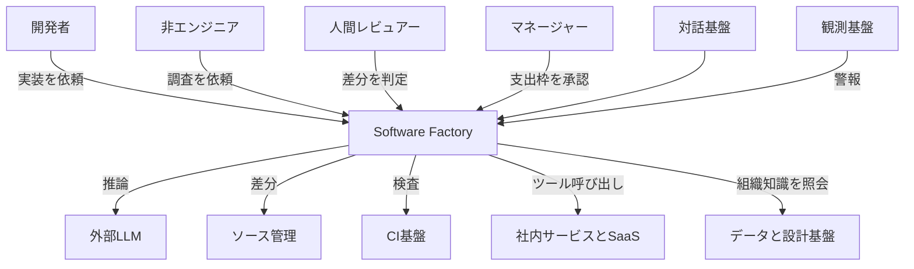
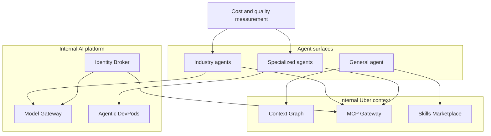
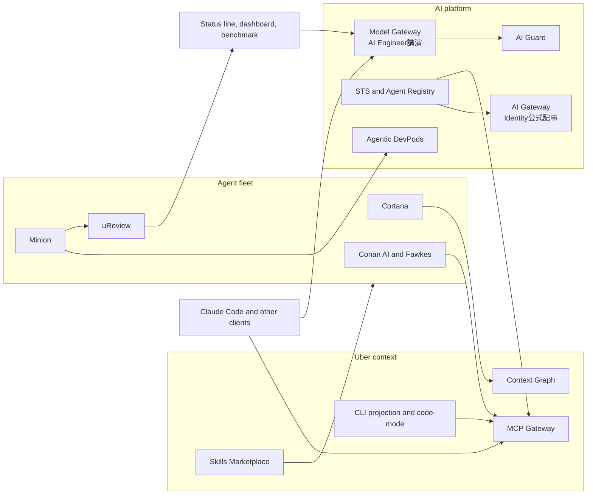
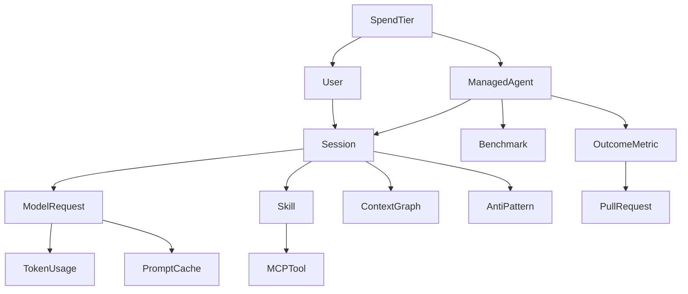
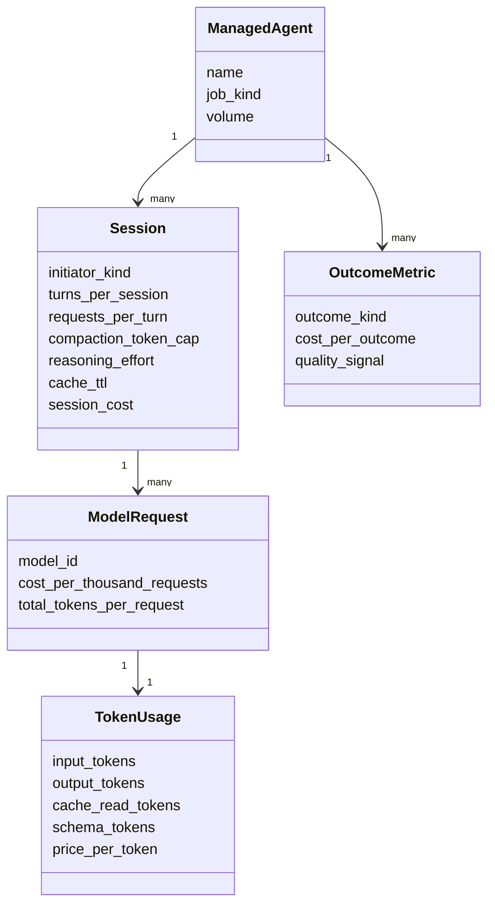
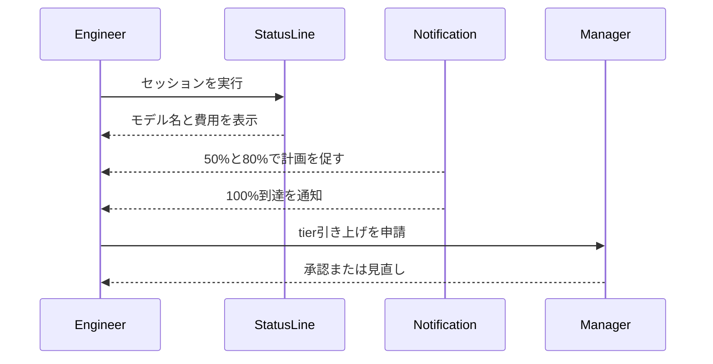

Uberでは、ソフトウェア開発ライフサイクル全体にAIエージェントを組み込み、利用量を伸ばしながら単位コストを下げる社内基盤「Software Factory」を運用しています。

注目すべきは、単に高性能なモデルを配ったのではなく、モデル、実行環境、社内コンテキスト、ツール、スキル、費用計測を一つの制御面にまとめた点です。本記事では、2026年8月27日に公開された[Uber Engineeringの公式解説](https://www.uber.com/us/en/blog/efficient-software-factory/)を中心に、その構造とデータモデルを読み解きます。さらに、公開ツールで応用できる設定例まで落とし込みます。

これまでにも[成果単価でAI投資を測る考え方](https://zenn.dev/suwash/articles/ai-investment-outcome-unit-cost_20260715)、[エージェントのセッション設計](https://zenn.dev/suwash/articles/claude-code-bot-1268-agent-p4_20260817)、[AIトークン最適化](https://zenn.dev/suwash/articles/ai-tokenomics_20260719)を個別に扱ってきました。本記事の守備範囲は、Uberの実測値、6項分解、4層の制御勾配、成果指標を一つの計測面へ接続して読むことです。


*この記事の全体像。以下、順に解説します。*

## 概要

Uber Software Factoryは、対話型コーディングエージェントと自動実行されるマネージドエージェントを同じ基盤で扱う社内制御面です。対象はコード生成だけではありません。コードレビュー、CI修復、実験結果の読み出し、オンコールの原因分析、定期保守までをSDLCの一連の工程として扱います。

Uberの公開値では、PRの70%超がローカルまたはクラウドのエージェントに「attributed」、つまり関与したものとして計上されています。これは70%が無人でマージされたという意味ではありません。マネージドエージェントには人間のレビューとエスカレーションが組み込まれています。

2026年2月から8月中旬までに、週間アクティブユーザーは7倍、週間エージェントリクエストは9.4倍へ増えました。一方、AI支出総額は4月以降おおむね安定しています。モデルを固定した比較では、1,000モデルリクエスト当たりのコストがピークから約34%減り、セッション当たりのコストは6月のピークから52%減りました。


セッションの実行場所は4層に分かれます。上へ行くほど、モデル選択、品質、コストを中央で制御しやすくなります。

| 層 | 実行形態 | 代表例 | 成果単位 |
|---|---|---|---|
| Specialized Agents | Uberクラウド、HITL付き | Minion、uReview、Conan AI、Fawkes | マージPR、レビュー、警報、保守当たりのコスト |
| General Agents | Uberクラウド、対話型 | Cortana | query当たりのコスト |
| Sessions with Skills | ノートPC、対話型 | 3,600超の共通スキル | session当たりのコスト |
| Raw Sessions | ノートPC、対話型 | Claude Code、Codex、OpenCode | session当たりのコスト |


公式発表時点で、エンジニアが作ったエージェントスキルは3,600超、実行回数は1日30,000超です。この規模では、個々の開発者が端末設定を工夫するだけでは全体最適になりません。基盤側で安い実行経路を既定にし、成果単位で継続的に測る必要があります。

## 特徴

Software Factoryの中心は、総コストを次の6項の積へ分解する考え方です。

```text
Users × Sessions/User × Turns/Session × Requests/Turn × Tokens/Request × Price/Token
```

最初の2項は採用とエンゲージメントなので、成長させる対象です。削るべきなのは、無駄なターン、モデルとの往復、毎回再送するトークン、そしてワークロードに対して過剰なモデル単価です。


| 最適化対象 | 主なレバー |
|---|---|
| Requests/Turn | Context Graph、Continuous Skill Optimization |
| Tokens/Request | 400kでの圧縮、プロンプトキャッシュ、ツールの遅延ロード、code-mode |
| Price/Token | 実PRベンチマーク、用途別のモデル選択、安価なサブエージェント |

Uberの公式レバー表は`Turns/Session`を独立行にせず、Context Graphと継続的なスキル改善を`Requests/Turn`へ対応付けています。6項の式にはTurnsも含まれますが、ここでは公式の対応関係を優先します。

もう一つ重要なのが、セッション費用ではなく成果費用を測ることです。MinionならマージされたPR当たり、uReviewならレビュー当たり、Conan AIなら処理した警報当たりのコストを追います。同時にrevert rate、F1、MTTRなどの品質指標も測るため、単なるモデルの値下げ競争になりません。

トークン削減にも複数の仕掛けがあります。

- 1Mトークンのコンテキストを使えるモデルでも、400kトークンで自動圧縮
- reasoning effortの既定をMediumに設定
- 対話セッションのプロンプトキャッシュを5分から1時間へ延長
- サブエージェントは短時間処理が多いため5分を維持
- 1,000超のMCPサーバーをゲートウェイ配下へ集約
- すべてのツール定義を先に読み込まず、CLI投影やtool searchで必要時に解決
- 多段のsubmit、poll、fetchをcode-modeのスクリプト内で完結

## 構造

Software Factoryを理解するときは、二つの切り口を混同しないことが大切です。前節の4層は「セッションがどこで動くか」という制御勾配です。一方、ここから示す図は「プラットフォームが何で構成されるか」を表します。

### システムコンテキスト図

利用者は開発者だけではありません。非エンジニアも全社アシスタントを利用し、人間レビュアーが生成差分を判定し、マネージャーが支出枠を承認します。Software Factoryは外部LLM、ソース管理、CI、社内サービス、SaaS、観測、データ、設計の各基盤を横断します。



ここでのSoftware Factoryは、推論エンジンそのものではありません。外部モデルを利用しながら、誰が、どの権限で、どのツールを使い、どの成果を作り、いくら消費したかを制御する面です。

### コンテナ図

プラットフォームは、AI基盤、Uber固有コンテキスト、業界製エージェント、特化エージェント、計測とイネーブルメントへ分かれます。次の図は、[2026年8月の公式ブログ](https://www.uber.com/us/en/blog/efficient-software-factory/)と[AI Engineer 2026講演](https://www.youtube.com/watch?v=17-YSUHo6Lk)で示された要素を切り分けた、筆者による再構成です。



Model Gatewayはすべての推論の入口です。Agentic DevPodsは事前確保された隔離計算環境を提供します。MCP Gatewayは内部APIと第三者SaaSを同じ認証・ポリシーの下へ置きます。Context GraphとSkills Marketplaceは、エージェントが組織の事情を知らないまま探索を始めるのを防ぎます。

### コンポーネント図

固有コンポーネントまで下ろすと、推論、身分、実行、ツール、知識、スキル、エージェント、計測が一つのループを作っていることが分かります。次の図も公式の単一アーキテクチャ図ではなく、[AI Engineer 2026講演](https://www.youtube.com/watch?v=17-YSUHo6Lk)のbuilding blocks、[エージェント身分の公式解説](https://www.uber.com/us/en/blog/solving-the-agent-identity-crisis/)、2026年8月の公式ブログを統合した筆者による再構成です。



特化エージェントには、intentからPRを作るMinion、コードレビューを行うuReview、実験結果を読み出すAgentic XP、警報の原因分析を行うConan AI、定期保守を行うFawkesがあります。一般エージェントのCortanaと特化エージェントは同じスキル、グラフ、ツール基盤を共有します。講演の`Model Gateway`と身分管理記事の`AI Gateway`は公開上の名称が異なり、同一コンポーネントとは断定できないため図でも分けています。

## データ

コストを改善するには、請求総額だけでなく、セッションから成果までの関係をデータとして持つ必要があります。中心エンティティはSessionです。人間またはManagedAgentがSessionを開始し、その中でModelRequest、TokenUsage、PromptCache、Skill、MCPToolが関連します。

### 概念モデル

次の概念モデルは、6項のコスト方程式と成果単価を同じデータ面で扱うためのものです。



Userはツール横断で重複排除されます。SpendTierは対話ハーネスの共有枠とマネージドエージェントの枠を分けます。ManagedAgentはBenchmarkとOutcomeMetricを持ち、モデル変更が正確性、費用、遅延に与える影響を比較します。

### 情報モデル

公開されている計測項目から、運用に必要な主要属性を整理すると次の形になります。これはUberの公開APIスキーマではなく、同じ考え方を自組織へ実装するための情報モデルです。



| コスト方程式 | 主なデータ |
|---|---|
| Users | ツール横断で重複排除したUser |
| Sessions/User | Userに紐づくSession件数 |
| Turns/Session | Sessionのターン数 |
| Requests/Turn | Session内のModelRequest数 |
| Tokens/Request | 入力、出力、キャッシュ、スキーマのTokenUsage |
| Price/Token | モデル単価とキャッシュ倍率 |

Sessionには主モデルとサブエージェントモデル、圧縮閾値、reasoning effort、キャッシュTTLを記録します。これにより、単価上昇がモデル変更によるものか、コンテキスト肥大化によるものか、キャッシュ切れによるものかを分解できます。

## 構築方法

Software FactoryはUber社内プラットフォームであり、外部向けのインストーラーや公開パッケージはありません。ただし、設計レバーの多くはClaude Code、Anthropic API、MCPを組み合わせて再現できます。

最初に統一ラッパーを用意し、認証、モデル入口、MCP入口、既定設定、コスト計測を集約します。そのうえで、次の順に実装すると効果を測りやすくなります。

1. 全クライアントのモデル呼び出しとツール呼び出しを共通ゲートウェイへ寄せる
2. セッション、リクエスト、トークン、モデル、キャッシュ、成果の帰属データを残す
3. 圧縮閾値、reasoning effort、サブエージェントモデルを共通設定にする
4. MCPツールの先行ロードをやめ、検索またはCLI投影へ移す
5. 長いツール往復をcode-modeへ移す
6. 実作業ベンチマークを作り、モデルをPareto選定する

Claude Codeで近い既定値を設定する例です。`autoCompactWindow`は100,000から1,000,000の範囲で指定できます。

```json
{
  "$schema": "https://json.schemastore.org/claude-code-settings.json",
  "autoCompactEnabled": true,
  "autoCompactWindow": 400000,
  "effortLevel": "medium",
  "env": {
    "ENABLE_TOOL_SEARCH": "true"
  }
}
```

400kを実際に使うには、1M context対応モデルと利用権限が必要です。200k構成などではモデルの実コンテキスト長へ丸められます。`/status`やモデル選択画面で実際のcontext windowを確認してください。サブエージェントを安価なモデルへ寄せつつ手動overrideを残すなら、各サブエージェントのfrontmatterまたは呼び出し時に`model: haiku`を指定します。`CLAUDE_CODE_SUBAGENT_MODEL`は全サブエージェントを上書きする強制設定であり、使う場合は利用可能な完全なモデルIDを指定します。

MCPサーバーはプロジェクトの`.mcp.json`などへ定義します。秘密情報を直接書かず、環境変数で渡します。

```json
{
  "mcpServers": {
    "github": {
      "type": "http",
      "url": "https://api.githubcopilot.com/mcp/",
      "headers": {
        "Authorization": "Bearer ${GITHUB_PAT}"
      }
    }
  }
}
```

## 利用方法

Claude CodeにおけるMCPサーバーの登録設定は、公開CLIで追加、参照、再登録、削除できます。ここで管理するのはMCPプロトコル上の業務リソースではなく、Claude Code側の接続設定です。更新時は同名定義をいったん削除し、必要なscopeで追加し直します。

```bash
# Create
claude mcp add --transport http notion https://mcp.notion.com/mcp
claude mcp add --transport stdio local-tool -- npx -y local-mcp-server

# Read
claude mcp list
claude mcp get notion

# Update
claude mcp remove notion --scope local
claude mcp add --transport http notion https://mcp.notion.com/mcp --scope user

# Delete
claude mcp remove notion
```

プロンプトキャッシュは、対話セッションと短時間のサブエージェントでTTLを分けます。Anthropicの価格倍率は、5分の書き込みが通常入力の1.25倍、1時間の書き込みが2倍、キャッシュ読み出しが0.1倍です。人間が途中で考える対話セッションでは、再開時のヒット率を含めて1時間TTLの採算を判断します。

```python
from anthropic import Anthropic

client = Anthropic()
fixed_context = (
    "Repository convention: inspect, test, and explain each safe change.\n" * 384
)
cached_system = [{
    "type": "text",
    "text": fixed_context,
    "cache_control": {"type": "ephemeral", "ttl": "1h"},
}]

counted = client.messages.count_tokens(
    model="claude-sonnet-4-6",
    system=cached_system,
    messages=[{"role": "user", "content": "Check the cache prefix."}],
)
assert counted.input_tokens >= 2048

def call(message: str):
    return client.messages.create(
        model="claude-sonnet-4-6",
        max_tokens=128,
        system=cached_system,
        messages=[{"role": "user", "content": message}],
    )

first = call("Summarize the conventions.")
second = call("List the testing rules.")
print("created:", first.usage.cache_creation_input_tokens)
print("read:", second.usage.cache_read_input_tokens)
```

Sonnet 4.6の最小キャッシュ長は2,048トークンです。短いprefixはエラーにならず、作成量と読み出し量が0のままになるため、`messages.count_tokens()`で下限を確認します。変動するuser messageより前の固定system blockへ明示的なbreakpointを置き、同じprefixで2回呼び出して`cache_creation_input_tokens`と`cache_read_input_tokens`を確認します。1時間TTLの内訳は`cache_creation`にある`ephemeral_1h_input_tokens`でも確認できます。

ツールが多い場合は、検索ツールだけを常時ロードし、実ツールへ`defer_loading: true`を付けます。Claude Codeでは`ENABLE_TOOL_SEARCH=auto:5 claude`のように、ツール定義がコンテキスト窓の5%を超えたら遅延する設定もできます。

多段のツール呼び出しは、モデルとの会話からプログラムのループへ移します。

```python
def run_warehouse_query(client, sql: str) -> dict:
    job_id = client.submit(sql)["id"]
    while True:
        status = client.poll(job_id)
        if status["state"] == "done":
            rows = client.fetch(job_id)
            return {"row_count": len(rows), "preview": rows[:5]}
```

Uberの同一セッション実測では、小さな`SELECT 1`でも903から402トークンへ55%減り、50行の幅広テーブルでは1,431,594から900トークンへ減りました。削減源は結果サイズだけではなく、スキーマ初期化、pollの往復、逐次reasoningをモデル文脈から外したことです。


## 運用

運用ダッシュボードは、総額、単位経済性、モデル経済性、増減要因、成果の5層で見ると整理しやすくなります。

| 層 | 代表指標 | 答える問い |
|---|---|---|
| Portfolio | 総費用、重複排除ユーザー、ツール別費用 | お金はどこへ行ったか |
| Unit economics | user、request、session当たりの費用、cache hit rate | 同じ利用が安くなったか |
| Model economics | モデル別費用比率、request比率、100万token当たり費用 | モデル変更が請求へどう効いたか |
| Driver decomposition | users、requests/user、input/output tokens/request | 数値がなぜ動いたか |
| Managed outcomes | merged PR、review、alert当たり費用、F1、MTTR | 品質を保って価値単価が下がったか |

支出枠は、対話ハーネスの共有プールとマネージドエージェントを分離します。走行中の費用をstatus lineへ表示し、想定支出の50%、80%、100%で通知します。厳しいハードキャップだけに頼らず、50%と80%の時点で計画変更やマネージャー承認を判断できる設計です。



モデル選定では、実PRをeasy、medium、hardへ分け、precision、recall、F1、レビュー当たりコスト、遅延、タイムアウト、ノイズを同時に比較します。品質か価格の一方だけで決めず、Pareto frontierにある構成を採用し、数週間ごとに再評価します。

Context Graphも強力なコストレバーです。Uberの公式比較では、同じモデルと同じ質問に対し、グラフで接地したエージェントは38秒で正しいテーブルを特定しました。未接地では20分9秒かかり、サブエージェント2つとエラー3件を経て誤った結論に至りました。組織知識の不足は正答率だけでなく、探索ターンとリクエスト数を増やします。


## ベストプラクティス

Software Factory型の運用を自組織へ持ち込むなら、次の原則が有効です。

- **成果単価で測る**: セッション単価だけでなく、マージPR、レビュー、処理警報など価値単位で測定する
- **モデルを固定して改善効果を測る**: モデル世代の価格差と、キャッシュやcode-modeの改善を同じ系列へ混ぜない
- **対話とマネージド実行を分ける**: 支出枠、TTL、品質指標、停止条件をワークロード別にする
- **安い経路を既定にする**: Medium reasoning、早めの圧縮、弱いサブエージェント、ツール遅延ロードをラッパーへ組み込む
- **MCPをゲートウェイへ集約する**: 認証、権限、監査、ツール発見をクライアントごとに実装しない
- **実作業でベンチマークする**: 合成問題だけではなく、既知バグ付きの実PRや実際のオンコール事例を使う
- **人間の判定点を残す**: 実機能の変更はdraft PRで止め、共有CIと人間レビューを通す

セキュリティでは、ワークロード身分をエージェント身分へ交換し、各hopへ短命トークンを渡す考え方が参考になります。ツールゲートウェイは認証だけでなく、どのエージェントがどのツールを呼べるかを強制するポリシー面です。

適用限界もあります。Uber自身が、公開したコスト削減率は同社のコードベース、チーム規模、ワークフローに固有だと注意しています。24Mノードと80MエッジのContext Graphや、1,000超のMCPサーバーを最初から再現する必要はありません。小規模な組織では、キャッシュTTL、サブエージェントのモデル、MCPスキーマの遅延ロード、status lineによる可視化から始める方が現実的です。

## トラブルシューティング

コストや品質が悪化したときは、モデル名、コンテキスト、キャッシュ、ツール初期化、組織知識の順に切り分けます。

| 症状 | 主な原因 | 対処 |
|---|---|---|
| 単純作業なのに費用が高い | 高価な親モデルで短い反復作業まで処理 | 親は分解と評価、サブエージェントは安価なモデルへ分担 |
| ターンごとに入力tokenが増える | 大きなMCP応答が会話履歴へ残る | CLI投影やcode-modeで中間結果をサブプロセスへ閉じる |
| 昼休み後の再開でcache hitが落ちる | 5分TTLが人間の中断時間より短い | 対話は1時間、短いサブエージェントは5分を検討 |
| 入力前から大量のtokenを消費 | 全MCPスキーマを先行ロード | tool searchと`defer_loading`を使う |
| データ探索が長引き誤答する | 社内カタログや依存関係に未接地 | Context Graph相当のカタログを先に渡す |
| モデル変更後にF1が落ちる | コストだけでモデルを選んだ | 実PRで正確性、費用、遅延、ノイズを再評価 |
| 圧縮直後に入力が急増 | 要約とcache prefixの再構築 | 大きなログを別実行へ逃がし、圧縮前後を計測 |
| 改善後も単位コストが横ばい | モデル世代と自前改善を混在 | モデル固定期間を設け、要因を順に分解 |

公開ツールでは、セッション中にモデル名、推定費用、コンテキスト使用率を表示するだけでも行動が変わります。Claude Codeのstatus lineには`cost.total_cost_usd`と`context_window.used_percentage`が渡されるため、軽量なシェルスクリプトで可視化できます。

## まとめ

Uber Software Factoryの本質は、AIエージェントを大量導入したことではなく、利用の成長と単位コストの縮小を別々の変数として設計したことです。モデル、コンテキスト、ツール、スキル、実行環境、計測を同じ制御面へ置き、セッション費用だけでなく成果当たりの費用と品質を追っています。

自組織で始めるなら、まず6項のコスト方程式に沿って計測項目を揃え、Medium reasoning、早めの圧縮、キャッシュTTL、安価なサブエージェント、ツール遅延ロード、code-modeを一つずつ検証するのが近道です。そのうえで、実作業ベンチマークと人間レビューを残したまま、対話セッションから管理されたエージェント群へ適用範囲を広げていけます。

この記事が少しでも参考になった、あるいは改善点などがあれば、ぜひリアクションやコメント、SNSでのシェアをいただけると励みになります！

## 参考リンク

- [Running a Software Factory Efficiently at Uber Scale](https://www.uber.com/us/en/blog/efficient-software-factory/)
- [Uber Engineeringによる起点の投稿](https://x.com/ubereng/status/2093444169037762840)
- [Agentic SDLC at Uber](https://www.youtube.com/watch?v=17-YSUHo6Lk)
- [Solving the Identity Crisis for AI Agents](https://www.uber.com/us/en/blog/solving-the-agent-identity-crisis/)
- [uReview: Scalable, Trustworthy GenAI for Code Review at Uber](https://www.uber.com/blog/ureview/)
- [Anthropic Prompt caching](https://platform.claude.com/docs/en/build-with-claude/prompt-caching)
- [Anthropic Tool search tool](https://platform.claude.com/docs/en/agents-and-tools/tool-use/tool-search-tool)
- [Code execution with MCP](https://www.anthropic.com/engineering/code-execution-with-mcp)
- [Claude Code MCP](https://code.claude.com/docs/en/mcp)
- [Claude Code settings reference](https://code.claude.com/docs/en/settings-reference)
- [Claude Code status line](https://code.claude.com/docs/en/statusline)
- [MCP Tools specification](https://modelcontextprotocol.io/specification/2025-11-25/server/tools)
