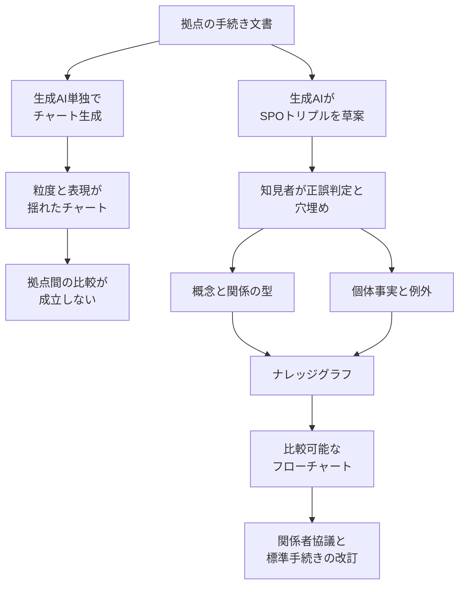
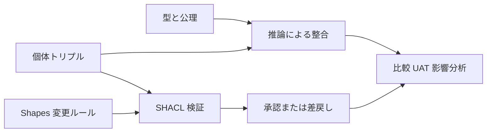

*この記事の全体像。以下、順に解説します。*

## この記事の対象と、読み終えて得られるもの

三菱UFJ銀行の国際事務企画部が、海外拠点の事務手続きを標準化するために生成AIを使い、いったん失敗し、オントロジーとナレッジグラフで組み直した経緯が [ITmedia エンタープライズの記事](https://www.itmedia.co.jp/enterprise/articles/2608/21/news019.html)（2026-08-21、指田昌夫氏）で報じられています。もとになったのは AWS Summit Japan 2026 のセッション IND215 です。

この記事では次の3点を扱います。

- 文書を生成AIに読ませてフローチャート化する構成が、なぜ拠点比較の用途で壊れるのか
- 「オントロジー＋データ＝ナレッジグラフ」という構成が、その壊れ方をどう埋めるのか
- 報じられた「工数9割削減」「約2万件のトリプル」を、自分の現場の目標値としてコピーしてよいのか

想定読者は、業務知識をAIに扱わせる構成を選ぶ立場の方です。ライブラリの使い方ではなく、**どの構造を採るかの判断材料**を目的にしています。

なお、IND215 の講演スライドは [AWS のセッション資料一覧](https://pages.awscloud.com/AWS-Summit-Japan-2026-Session-Materials-Download.html)で「資料提供なし」とされています。定量値の出所は前掲の ITmedia 記事による講演の再構成がほぼ唯一です。本文中では、公式資料で裏が取れる事実と、記事のみが出所である数値を区別して書きます。

## 何が起きたのか

報じられている経緯は次のとおりです。

| 時期 | 内容 |
|---|---|
| 2024年 | 行内の生成AI活用第1号案件として着手 |
| 〜2025年5月 | 生成AI単独で手続き文書からフローチャートを生成。拠点比較に耐えず停滞 |
| 2025年6月〜 | 手続きをトリプルへ分解し、知見者が訂正する構成へ転換。約2万件のトリプルを構築 |
| 2026年3月 | UAT ケース作成への適用を計画として提示 |

対象範囲の大きさは、公式に近い情報でも確認できます。同部の事務対象は約30カ国、現地スタッフは約3000人程度と、同じ登壇者が[日経BP Special の記事](https://special.nikkeibp.co.jp/atcl/ONB/25/servicenow0418/)で語っています。1日平均20万件の入力、うち約8割が送金という規模感は ITmedia 記事のみが出所です。

標準化が難しい直接の理由は文書量の非対称です。本部が定める標準手続きが約600ページなのに対し、拠点固有の手続き文書は数百から数千ページに及ぶと報じられています。人手で突き合わせる前提では、比較そのものが成立しません。

## なぜ生成AI単独では比較できなかったのか

失敗したのは「検索できなかった」からではありません。**手続きの型が定義されていなかった**ことが原因です。記事で挙げられている症状は次の3つです。

- 生成されるチャートの粒度が不安定（過剰に装飾される、あるいは極端に短くなる）
- 複数担当で回している事務を「担当者1人」と読んでしまう
- 表現の揺れが解消されない

3つ目が比較用途では致命的です。たとえば本部標準の「担当者が顧客依頼に従い送金データを登録する」と、ある拠点の「書面または電磁的方法で受け付け、勘定系に登録する」は、業務としては対応関係にあります。しかし文字列としては一致しません。

これは、述語（受付方法・登録先システム・担い手の人数）が構造化されず、自然文のまま残っている状態です。ベクトル検索は「意味の近い文書」を返しますが、フロー比較が要求するのは「同じ関係かどうか」の判定です。近いことと同じであることは別の問題であり、埋め込み距離では後者を決められません。

## オントロジーとナレッジグラフで何が変わるのか

転換後の構成は、手続き文を主語・述語・目的語（SPO）のトリプルに分解し、知見者が正誤を判定して穴を埋め、その受理済みグラフからチャートを生成する流れです。講演では「オントロジー＋データ＝ナレッジグラフ」と表現されたと報じられています。

分解の粒度そのものは特別な発明ではなく、W3C の標準語彙に沿っています。トリプルは `<subject> <predicate> <object>` の論理文です（[RDF 1.1 Primer](https://www.w3.org/TR/rdf11-primer/)）。オントロジーは用語とその相互関係の精密な記述にあたり（[OWL 2 Primer](https://www.w3.org/TR/owl2-primer/)）、ナレッジグラフはその型の上に載る個体事実です。

ここで実務上ひとつ注意点があります。OWL は開世界仮定を採るため、「グラフに書かれていない＝禁止・不存在」という読み方が推論だけでは表現できません。「必須ステップが欠けている」「担い手が1人しかいない」といった、業務側が本当に検査したい条件は制約検証の領域です。これは SHACL の shapes graph 対 data graph の検証が担います（[SHACL 仕様](https://www.w3.org/TR/shacl/)）。

つまり、この事例で効いている構造は次の2点に整理できます。

1. 表現の揺れを、型付きの関係へ畳み込む（比較の必要条件）
2. 生成物をそのまま使わず、知見者が受理したグラフだけを下流へ流す（品質のゲート）

生成AIの役割は、文書からトリプル草案を大量に起こすところに限定されています。**正本はグラフ側にあり、生成AIの出力ではありません。** この境界の引き方が、単独運用との最大の差です。

## 「工数9割削減」をどう読むか

見出しになっている削減率は、部分工程のKPIです。記事が計算対象にしているのは、フローチャートの作成・比較・修正の3工程だけです。

| 工程 | 従来 | AI適用後 |
|---|---|---|
| 作成 | 10人日 | 0.5人日 |
| 比較 | 0.5人日 | 0.25人日 |
| 修正 | 0.5人日 | 0.25人日 |
| 小計 | 11人日 | 1人日 |

(11 − 1) / 11 で約90%です。一方、記事は**関係者協議に要する1〜2人月は変わらない**と明記しています。

仮に1人月を20人日と置くと、プログラム全体では31〜51人日が21〜41人日になる計算で、削減幅は約20〜32%にとどまります。これは記事が与えた数字からの単純な導出であり、実測ではありません。それでも、分母をどこに置くかで見え方が3倍以上変わることは確認できます。

さらに、この数字は記事上「見込み」です。対象事例数、計測期間、実測か計画かは公開されていません。したがって、**社内の稟議で「他社は9割減」と引用するのは危険**です。引用するなら「チャート3工程に閉じた見込み値であり、協議工数は不変」という但し書きまでを含めるべきです。

## 公開情報で確認できることと、できないこと

転用判断の前に、どこまでが一次情報かを押さえておきます。

| 内容 | 確度 |
|---|---|
| AWS Summit Japan 2026 のセッション IND215 の存在とタイトル、主催 | AWS 公式で確認可能 |
| 溝口直樹氏が執行役員 国際事務企画部長であること | [銀行の役員異動リリース](https://www.bk.mufg.jp/news/news2025/pdf/news0110.pdf)で確認可能 |
| 事務対象が約30カ国、現地スタッフ約3000人程度 | 同一登壇者による別媒体（日経BP Special） |
| 1日20万件入力、約8割が送金 | ITmedia 記事のみ |
| 本部標準600ページ対拠点数百〜数千ページ | ITmedia 記事のみ |
| 約2万件のトリプル、11人日→1人日 | ITmedia 記事のみ |
| 2026年3月からの UAT 適用 | ITmedia 記事のみ、かつ講演時点では計画 |
| 実装基盤（グラフDB、モデル、支援ツール） | 非公開 |

最後の行は特に注意が必要です。AWS が [Context Ontology Accelerator](https://aws.amazon.com/about-aws/whats-new/2026/07/aws-context--ontology-accelarator-generally-available/) を提供していますが、この事例で使われたという公式な結びつきは確認できません。製品名と事例実装を同一視しないほうが安全です。

同じ部署が ServiceNow で構築した問い合わせ基盤（GO PORT）も報じられていますが、こちらは問い合わせとFAQの蓄積であり、オントロジー案件とは別物です。標準化の入力（手続きテキスト）と運用の入力（問い合わせ）を後で接合する余地はありますが、代替にはなりません。

## 運用設計で抜けやすい3点

約2万件のトリプルを持つということは、**2万件分の変更管理義務を持つ**ということです。公開情報を読む限り、次の3点は設計が明かされていません。転用するなら、ここが本丸になります。

### 所有者

記事から読めるのは「国際事務企画部の知見者が品質を決める」という点までです。クラスやプロパティのオーナー、拠点固有例外のオーナー、第2線（独立したチェック機能）の有無は分かりません。ドメイン専門家個人の知識量に品質が張り付く構成は、その人が異動した時点で更新が止まります。

### 承認

報じられているフローは、生成AIが草案を出し、知見者が正誤を判定して穴を埋め、人が最終確認する、という流れです。ここで**作成と承認が同一人物に閉じる可能性**があります。誤ったエッジがそのまま「標準」として全拠点に複製されるリスクを考えると、dual control の設計は外せません。

参考までに、AWS の Context Ontology Accelerator も「AIが草案を出し、ドメイン専門家がすべての要素をレビュー・編集・承認する」と製品として主張しています。HITL を省略しない点は共通の前提と見てよいでしょう。

### 失効

グラフは追記型で運用されがちですが、海外事務では**旧規制は失効します**。追記だけでは、古い事実と新しい事実が同居します。Microsoft GraphRAG の [Discussion #511](https://github.com/microsoft/graphrag/discussions/511) では、相反する記述を追加した場合に多数派が残って但し書きが付く挙動が議論されています。規制対応でこの挙動は使えません。

影響分析とは「今のグラフを検索すること」ではなく、「どの公理とどの拠点例外が壊れるかを版付きで出すこと」です。

### 最小の実務セット

以上を踏まえると、一般原則として次の5点が最小構成になります（この事例の実装がこうなっている、という主張ではありません）。

1. 型（送金、受付チャネル、勘定系、担い手）と個体事実（各拠点の現行手続き）を分けて管理する
2. トリプルごとに `validFrom` / `validTo` / `jurisdiction` を持たせる
3. SHACL で必須述語・カーディナリティ・プロパティ集合を検証し、**通過したグラフからしかチャートを生成しない**
4. 変更に who / when / why の来歴を残し、第2線がサンプル監査する
5. 制度改正は追記ではなく `validTo` 更新と、影響サブグラフの再承認キューで扱う

### 構築コストの見積もり感覚

手動キュレーションの単価について、Heiko Paulheim 氏の [How much is a Triple?](https://ceur-ws.org/Vol-2180/ISWC_2018_Outrageous_Ideas_paper_10.pdf)（ISWC 2018）は、Cyc の assertion 1件あたり約9.5分・約5.71ドルという歴史値を挙げています。2万件へ機械的に掛けると構築だけで約11万ドル相当になります。

これは汎用常識グラフの数字であり、銀行事務への直接換算ではありません。それでも、「英文法の正誤問題を解く感覚」という比喩が工数を過小評価しうることは示しています。

## 反証材料

方向性そのものは支持できますが、確信度を下げる材料も揃えておきます。

- **抽出精度**: 未調整の LLM によるトリプル抽出は不正確になり得ます。NVIDIA の[技術ブログ](https://developer.nvidia.com/blog/insights-techniques-and-evaluation-for-llm-driven-knowledge-graphs/)は、ニュース100件を対象に Llama2-70B 相当で54%、LoRA と後処理を加えて98%という比較を示しています。銀行マニュアルでの数値ではありませんが、素の生成では足りないことの傍証になります。
- **人手検証の限界**: 同じ Paulheim 氏の論文では、月次で人手検証を入れていた NELL でも誤差が突出したことが報告されています。「人が見ている」は誤差ゼロを意味しません。
- **監督当局の姿勢**: 日本銀行の[金融システムレポート別冊](https://www.boj.or.jp/research/brp/fsr/fsrb260806.htm)（2026-08-06）は、生成AIの出力不確実性を前提に、顧客への直接提示は少数にとどまると整理しています。金融庁のAIディスカッションペーパー（第1.1版）も、誤りがあり得ること、人間への引き戻し、第三者レビューを求めています。生成物を手続き正本に昇格させる設計は、この線と衝突しやすい構造です。
- **語彙をゼロから積む判断**: FIBO のような業界オントロジーを使ったという証拠はありません。借りられる型があるかを検討せずに2万件を自前で積むのが妥当かは、必要語彙の差分表を作って判断すべきところです。

## 自分の現場へ転用するときの判断

同じ知識資産から生成できるものは、グラフが**承認済みの関係として持っている範囲に限られます**。この境界を先に引いておくと、期待値を外しにくくなります。

| 成果物 | グラフから機械的に出せるもの | 人間が残すもの |
|---|---|---|
| 業務ルール | 必須ステップ、欠落の検出、拠点例外の差分 | 規制解釈、例外の採否 |
| 要件定義 | アクター、情報、状態遷移の候補 | 非機能要件、対象外範囲、優先度 |
| UAT ケース | 正常系パス、カーディナリティ違反、失効ルール | 期待結果の業務判断、証跡 |

進め方としては、次の順序を推奨します。

1. 型の最小語彙を決める（担い手、受付チャネル、登録先システム、通貨、規制例外など）
2. トリプル草案の受理ワークフローを、作成者と承認者を分けて設計する
3. チャート生成の前段に SHACL 検証を必須のゲートとして置く
4. 制度改正は `validTo` 更新と再承認キューで扱う
5. 効果測定の分母を、チャート工数と協議・監査工数に分けて取る

逆に、次の条件下ではこの構成を採らないほうが妥当です。

- 対象が単一拠点・単一文書で、そもそも比較が不要な場合（型への投資が過大になる）
- 知見者が枯渇していて第2線レビューも置けない場合（誤ったエッジが標準として複製される）
- 監査・監督側が「生成物を手続き正本にしてはならない」と明示している場合（補助資料への降格が前提になる）

## まとめ

- 生成AIに手続き文書を読ませてフローチャート化する構成は、**拠点間比較を目的にすると壊れます**。表現の揺れが残り、「同じ関係かどうか」を判定できないためです。
- 概念と関係を型として置き、個体事実を分けて持ち、知見者が受理したグラフだけを下流へ流す構成は、事例と W3C 標準の両面から支持できます。生成AIの役割はトリプル草案の起草に限定されます。
- 報じられた「9割削減」はチャート3工程に閉じた見込み値です。協議工数は不変と明記されており、プログラム全体では約20〜32%相当まで落ちます。目標値としてコピーしないでください。
- トリプル数は成果指標ではありません。**所有者・承認分離・失効管理・影響分析**を先に仕様化してから件数を積むべきです。
- 実装基盤や特定製品との結びつきは公開されていません。製品名と事例を同一視した検討は避けてください。

この記事が少しでも参考になった、あるいは改善点などがあれば、ぜひリアクションやコメント、SNSでのシェアをいただけると励みになります！

## 参考リンク

- 指田昌夫「業務標準化の手間を9割減　三菱UFJ銀行は生成AIに「業務知識」をどう教えた？」ITmedia エンタープライズ, 2026-08-21: https://www.itmedia.co.jp/enterprise/articles/2608/21/news019.html
- AWS Summit Japan 2026 セッション資料一覧（IND215 は資料提供なし）: https://pages.awscloud.com/AWS-Summit-Japan-2026-Session-Materials-Download.html
- 株式会社三菱UFJ銀行「役員の異動について」2025-01-10: https://www.bk.mufg.jp/news/news2025/pdf/news0110.pdf
- 日経BP Special「世界共通の業務体制を目指す三菱UFJ銀行」: https://special.nikkeibp.co.jp/atcl/ONB/25/servicenow0418/
- W3C RDF 1.1 Primer: https://www.w3.org/TR/rdf11-primer/
- W3C OWL 2 Primer (Second Edition): https://www.w3.org/TR/owl2-primer/
- W3C Shapes Constraint Language (SHACL): https://www.w3.org/TR/shacl/
- AWS Context Ontology Accelerator (What's New, 2026-07-31): https://aws.amazon.com/about-aws/whats-new/2026/07/aws-context--ontology-accelarator-generally-available/
- NVIDIA Technical Blog「LLM-Driven Knowledge Graphs」2024-12-16: https://developer.nvidia.com/blog/insights-techniques-and-evaluation-for-llm-driven-knowledge-graphs/
- Heiko Paulheim「How much is a Triple?」ISWC 2018: https://ceur-ws.org/Vol-2180/ISWC_2018_Outrageous_Ideas_paper_10.pdf
- Microsoft GraphRAG Discussion #511: https://github.com/microsoft/graphrag/discussions/511
- 日本銀行「金融機関における生成AIの利用状況とリスク管理」2026-08-06: https://www.boj.or.jp/research/brp/fsr/fsrb260806.htm
- 金融庁 AIディスカッションペーパー（第1.1版）2026-03-03: https://www.fsa.go.jp/news/r7/sonota/20260303/aidp.html
