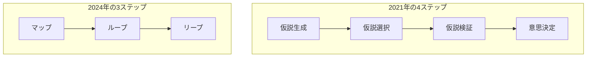

馬田隆明さん（東京大学 FoundX ディレクター）は、仮説思考についてのスライドを Speaker Deck に多数公開しています。この記事では、そのうち次の 6 本を 1 枚の地図にまとめます。

- 2021 年の「スタートアップの仮説思考」シリーズ 4 本
- 2024 年の書籍『仮説行動』の刊行時期に公開された 2 本

読み終えると、次のことが分かります。

- 6 本それぞれが答える問い
- 2021 年の 4 ステップと 2024 年の 3 ステップの対応
- スライド内の外部数値を引用するときの注意点
- 自分の問いに合わせて、どのデッキから開けばよいか

スライド番号は Speaker Deck のページ順です。2021 年の 4 本は、画面フッターのページ番号のほうが大きい箇所があります。閲覧数などの数値は 2026-10-09 時点のものです。

*この記事の全体像。以下、順に解説します。*

## 馬田隆明さんの仮説思考スライド6本とは

### 6 本の一覧

| デッキ | 公開 | 更新 | 枚数 | 閲覧の概数 | 答える問い |
|---|---|---|---|---|---|
| [仮説思考入門](https://speakerdeck.com/tumada/jia-shuo-si-kao-ru-men-sutatoatupufalsejia-shuo-si-kao-1) | 2021-02-15 | 2024-11-23 | 204 | 約 15.7 万 | 仮説とは何か。確からしさはどう段階づくか |
| [仮説生成力を鍛える](https://speakerdeck.com/tumada/jia-shuo-sheng-cheng-li-woduan-eru-sutatoatupufalsejia-shuo-si-kao-2) | 2021-02-17 | 2024-11-23 | 211 | 約 2.0 万 | 事実と推論から仮説をどう作るか |
| [仮説を"選ぶ"技術](https://speakerdeck.com/tumada/jia-shuo-wo-xuan-bu-ji-shu-sutatoatupufalsejia-shuo-si-kao-3) | 2021-02-25 | 2024-11-23 | 80 | 約 3.1 万 | どの仮説から検証するか |
| [ビジネスの仮説検証と実験の考え方](https://speakerdeck.com/tumada/bizinesufalsejia-shuo-jian-zheng-toshi-yan-falsekao-efang-sutatoatupufalsejia-shuo-si-kao-4) | 2021-03-02 | 2024-11-23 | 152 | 約 2.8 万 | 検証をどう設計し、どこで打ち切るか |
| [仮説のマップ・ループ・リープ](https://speakerdeck.com/tumada/jia-shuo-xing-dong-tomatupurupuripu) | 2024-12-04 | 2025-04-04 | 67 | 約 4.1 万 | 仮説を扱うプロセスは何か |
| [行動なしに良い仮説思考はできない](https://speakerdeck.com/tumada/jia-shuo-si-kao-tojia-shuo-xing-dong) | 2024-12-16 | 2025-04-04 | 75 | 約 1.2 万 | 生成・検証・実現のどこで行動が要るか |

- 2021 年の 4 本の副題は「スタートアップの仮説思考 (1)〜(4)」です。
- 6 本目の PDF 名は「仮説思考と仮説行動.pdf」です。画面のタイトルは表紙の文言「行動なしに良い仮説思考はできない」です。
- 以降、各デッキを「入門」「生成」「選ぶ」「検証」「マップ」「行動」と略します。

### 2 つの枠組み

6 本は、別々の時期に公開された 2 つの枠組みに分かれます。

| 観点 | 2021 年 | 2024 年 |
|---|---|---|
| ステップ | 生成 → 選択 → 検証 → 意思決定 | マップ → ループ → リープ |
| 仮説の式 | 事実 × 推論（入門 33） | エビデンス × 推論 ＝ 仮説（行動 21） |
| 行動の位置づけ | 検証の手段として登場 | 生成・検証・実現のすべてに必要 |
| 詳しい解説の案内先 | 「本スライドを基にした本が出た」 | 詳細は書籍『仮説行動』 |

マップ 65 は、3 ステップを次のように置きます。

1. 仮説の全体像をざっくり描く（マップ）
2. 仮説生成と検証のループを回す（ループ）
3. リスクを取って仮説を選び、行動して実現する（リープ）

マップ 66 は、この 3 つを行動を伴いながら回し、さらに行動して仮説を正解にしていく、とまとめます。

### 仮説の種類

入門と選ぶは、スタートアップの仮説の種類を同じ並びで挙げます。

- 課題、解決策、価値
- 製品（機能・体験）、製品実現性
- 市場、成長方法、実行
- 創業チーム、組織
- ビジネスモデル、戦略、ファイナンス

マップは別の切り方をします。アイデアを価値仮説・市場仮説・戦略仮説に分け、価値仮説を顧客・課題・解決策・価格に割ります。粗い仮説マップの例として Lean Canvas と Value Proposition Canvas を挙げます。

### 書籍『仮説行動』

- 出版社: 英治出版
- 発売日: 2024-12-04
- ISBN: 9784862763372
- 判型・頁数・価格: A5、336 頁、税込 2,420 円

2024 年の 2 本が載せる目次の部立ては、出版社ページの目次と一致します。

## デッキ別の中身

### 入門: 仮説とは何か

- 仮説は仮に立てた説です。ビジネスでは「こうすれば前に進むという仮の答え」です（12–13）。
- 確からしさはグラデーションで、白黒ではありません（50）。
- 仮説を持つ理由は 2 つです。意思決定が早くなることと、全体像との整合が上がることです。
- 最適化するのは、1 つの仮説の質ではありません。生成・選択・検証を何度も回すサイクル全体です。「1 年に 1 回」と「1 年に 365 回」を対比します。
- 科学とビジネスの違いとして、意思決定があること、実験のコスト、時間の制限を挙げます。

確からしさの段階は、課題仮説（顧客にその課題があるか）の例として、Y Combinator のオフィスアワーの話とともに示されます（41–50）。46 は、覚書をもらうまで課題が十分に検証できたとは言えない、と置きます。

| 顧客の反応 | 課題仮説の確度の目安 |
|---|---|
| 欲しいと言う | 5% |
| 買う約束をする | 10% |
| お金を払う約束を書面でもらう | 25% |
| お金を払う約束を覚書（LOI）でもらう | 40% |
| 想定金額を支払う | 60% |
| 顧客が宣伝してくれる | 80% |
| 想定以上を支払う | 90% |

49 の図では、「買う約束」が「使う約束」とも書かれています。

### 生成: 事実と推論から仮説を作る

| 要素 | 中身 |
|---|---|
| 事実の扱い | 把握、生成、解釈、再解釈 |
| 推論 | 演繹、帰納、アブダクション |
| アブダクションの道具 | アナロジー、フレームワーク、水平思考、人 |
| 出したあと | 言語化する、人に話す、時間を使う |

- 202 付近は、推論能力そのものより検証の一連のスピードが重要だ、と置きます。
- 「最初の良い仮説まで 200 時間」という目安があります（185）。
- 付録に、インタビューなどの質的データを分析する手法として M-GTA（修正版グラウンデッド・セオリー・アプローチ）、SCAT、TEM（複線径路等至性モデル）があります。Tetlock『超予測力』にも触れます。

### 選ぶ: どの仮説から検証するか

既定の検証順は、課題 → 解決策 → 価値です。最初に大きいリスクは「顧客にその課題があるか」です。例外も置かれています。

- 研究開発型では、実現性を早く確かめることがある。
- 模倣型では、検証済みの課題を飛ばしうる。

リスクマップの軸は、影響度 × 不確実性です（38）。

| 影響度 | 不確実性 | 扱い |
|---|---|---|
| 小 | ― | 落とすか後回し |
| 大 | 低 | 少ない検証で決める |
| 大 | 高 | 先に検証する |

影響度は「痛み」と読み替えられ、締めは「迷ったら痛みのあるほうへ」です（47）。

この 2 軸の図は、2024 年の「仮説マップ」（仮説の木）とは別の図です。

### 検証: 検証を設計して打ち切る

定義は、仮説についての最大の学習と学習棄却を、最適なスコープと実行で最速で行う力です。仮説が生成され選択済みであることを前提に進みます。

方法はコストの低い順に 3 つです。

| 方法 | 必要なもの |
|---|---|
| サーベイと分析 | 一人でできる |
| インタビュー・観察・議論 | 人が要る |
| 実験 | 作る必要がある |

- Build-Measure-Learn（BML。作る・測る・学ぶのサイクル）は「計画は Learn から、実行は Build から」と読みます。Lean Startup は、その回転を速くするものとして名指しされます。
- 4 つの態度は、反証する、負荷をかける、必要な確度を見極める、検証時間を最小化する、です。
- 時間の式は「みはじ」です。スコープを距離に、実行速度を速さに対応させます（133–135）。
- 121 は Bezos の 2016 年の株主への手紙を引き、欲しい情報の 70% 程度で決めるべきだ、と紹介します。
- 検証の出口は、進む、棄却する、次の仮説に移る、のいずれかです。学びには、確度と新しい情報の両方が含まれます。

### マップ・ループ・リープ: 仮説を扱うプロセス

| ステップ | 中身 | 無いとき・下手なときの失敗 |
|---|---|---|
| マップ | 仮説の全体像を木として描く | 緊急だが重要でない仮説で時間切れになる。仮説がバラバラになる。場当たり的に動く。分からないところが分からず止まる（28） |
| ループ | 生成と検証を回す。日常例は Instagram 投稿（ウケるはず → いいねで検証 → 次のネタへ修正。41–47） | 誤った仮説のまま進む。完璧を求めて仮説を出さない（49） |
| リープ | 確信度が 100% にならないまま決断して跳ぶ（54–58） | 情報収集が終わらない。跳びすぎる（59） |

61–62 は、鋭い仮説を作れる人は多いが、リスクを取って動ける人は少ない、と置きます。

### 行動: 生成・検証・実現のそれぞれに行動を入れる

| フェーズ | 思考だけに寄るとどうなるか | 行動側の手段 |
|---|---|---|
| 生成 | 検索や計画だけでは仮説がぼやける | インタビュー、試作、現場を見る、競合を体験する、売る |
| 検証 | 情報収集・検算・フェルミ推定に寄りやすい | 顧客インタビュー、独自調査、実験、プロトタイプ、営業（46–51） |
| 実現 | 良い仮説も実行しなければ価値が生まれない | 環境や前提に働きかけ、間違っていた仮説を正しい仮説にもしうる（65） |

- デリバリー事業の例では、最初は自分たちで届け、顧客と話して良い点と改善点を見ます（52）。
- 新市場では、既存データとフェルミ推定だけでは検証できません。仮説を否定される痛みも少ない、と対比します（53–54）。
- 55 は、情報と思考だけの検証は AI に任せたほうが早くなりつつある、と書きます。56 は、行動する側にチャンスが残る、と続けます。
- 60 は留保です。まず良い仮説がないと、検証のサイクルは回りづらいとしています。

## 2021 年と 2024 年の対応

スライド自身は対応表を出していません。次の表は、両方の文言から付けた筆者の対応です。

| 2021 年のステップ | 2024 年での位置 | 2021 年側のほうが詳しいもの |
|---|---|---|
| 生成 | ループの前半。行動デッキが「生成にも行動」を足す | 事実の 4 つの扱い、アブダクションの道具、200 時間の目安 |
| 選択 | マップ上で、自信のない箇所と勝利条件を特定する操作に近い | 影響度 × 不確実性、痛み、課題 → 解決策 → 価値の既定順 |
| 検証 | ループの後半。行動デッキが行動側の検証を足す | 3 つの方法、負荷、みはじ、BML |
| 意思決定 | リープ | 確度の段階そのもの。リープは「100% にならないまま賭ける」側に寄る |

書籍『仮説行動』の目次は、スライドの部立てに章番号を足した形です（英治出版の商品ページ）。

| 部 | 章 |
|---|---|
| はじめに | 1 本書の3つの特長 |
| 第1部 仮説行動を理解する | 2 なぜ仮説は重要なのか / 3 仮説行動の全体像 |
| 第2部 仮説を強くする | 4 仮説を生成する / 5 仮説を検証する / 6 仮説マップを生成・統合する / 7 ループの停滞を回避する |
| 第3部 仮説を現実にする | 8 仮説を評価する / 9 決断する / 10 仮説を実行する |
| 第4部 大胆な未来を実現する | 11 影響度の大きな仮説を目指す |

第 3 部の「仮説を評価する」は、6 本の中では選ぶデッキの一部と、リープの手前に当たります。マップデッキが関連として挙げる次の 2 本は、6 本には含めていません。

- [ふわっとした考えを仮説にするまでのステップ](https://speakerdeck.com/tumada/jia-shuo-woxing-zuo-rusutetupu): 興味から仮説までの段階
- [良い仮説を評価する技術](https://speakerdeck.com/tumada/liang-ijia-shuo-woping-jia-suruji-shu): 評価を門番として扱う

## 注意点

スライドは教材です。図の数値を、そのまま論文や公式統計の結果として引用しないでください。

### Camuffo らの売上の棒グラフ

入門 9–10 は、科学的思考を学んだ起業家群の翌年売上が高かった、と図示します。

- 棒のラベル: 対照群 255.40 ドル、科学的思考群 12,071.81 ドル
- 説明文: ピボットが増え、より良いアイデアに辿り着いたため
- 出典として挙がるもの: Camuffo ら “A Scientific Approach to Entrepreneurial Decision Making”、関連稿 “Small Changes with Big Impact”、Adam Grant “Think Again”

論文側の数字は次のとおりです。表中の用語は次の意味です。

- RCT: ランダム化比較試験。起業家を処置群（科学的思考の研修あり）と対照群にランダムに分けて比べます。
- 99% winsorize: 上位 1% の極端な値を 99 パーセンタイルの値に置き換え、外れ値の影響を抑える処理です。

| 文献 | 標本 | 売上（群別の平均または群間の差） | ピボットとの関係 |
|---|---|---|---|
| [Management Science 2020](https://doi.org/10.1287/mnsc.2018.3249) | 116 社 | 累積売上の平均は処置 10,630.2 ユーロ、対照 224.9 ユーロ。99% winsorize 後は処置 2,791.7 ユーロ | 処置群が早く売上を得た結果は pivoting と無関係、と論文自身が書く |
| Small Changes with Big Impact（Eller 掲載 PDF） | 250 社（別標本） | 1,573.147 ユーロ（p=0.104）。winsorize 後は 264.656 ユーロ（p=0.359） | ピボット回数への効果は 0.028（p=0.665）。有意なのは 1 回、または 1〜2 回という構成 |
| [Strategic Management Journal 2024 の追試](https://doi.org/10.1002/smj.3580) | 759 社・4 RCT | 処置が 6,999.327 ユーロ多い（p=.030） | 回数への線形効果は −0.053（p=.486）。ちょうど 1 回の確率は +8.3 ポイント、2 回超は −3.7 ポイント |

読み取れることは次のとおりです。

- 棒の比 12,071.81 / 255.40 と、2020 年論文の生の平均の比 10,630.2 / 224.9 は、どちらも約 47.27 です。
- 棒は、外れ値に引っ張られた生のユーロ平均を、1 つのレートでドル表示した値と整合します。処置群の標準偏差は 58,410.7、最大値は 437,474.5 です。
- 観測期間に正の売上を得たのは 116 社中 17 社です。
- 「ピボット回数が増えたから売上が約 47 倍」は、3 本のどの主結果とも一致しません。
- 入門の公開は 2021-02-15 で、2024 年の追試より前です。2024-11-23 の更新後も、この棒の説明は残っています。

### 経験則と教材用のパーセント

| スライドの数値 | 位置づけ |
|---|---|
| 最初の良い仮説まで 200 時間（生成 185） | スライド自身が「経験則」と書いている |
| 課題仮説の確度 5%〜90%（入門 41–50） | YC のオフィスアワーの話として置かれている。分母付きの公表統計は確認できていない |
| 欲しいなら 5%、覚書なら 40%（検証 112–113、124–125） | 負荷と打ち切りを説明する教材図 |
| 欲しい情報の 70% で決める（検証 121） | Bezos の株主への手紙からの引用。スライドの測定値ではない |

### CB Insights の 42% / 29% / 23%

選ぶ 26 は “The Top 20 Reasons Startups Fail” として、次の 3 つを挙げ、市場ニーズ無しを「常に 1 位」と書きます。

- 市場にニーズがなかった: 42%
- 資金が尽きた: 29%
- 正しいチームではなかった: 23%

同じ URL の本文は、年版ごとに置き換わっています。次の表は HTML 本文で確認できた内容だけです（チャート画像は含みません）。

| 時点 | 本文の内容 |
|---|---|
| [2018-06-12 の保存版](https://web.archive.org/web/20180612134758/https://www.cbinsights.com/research/startup-failure-reasons-top/) | 101 件のポストモーテム。市場ニーズ無しが 1 位で 42%。資金・時間の配分を挙げたのは 29%。チーム 23% は本文に無い |
| [2021-11-01 の保存版](https://web.archive.org/web/20211101190824/https://www.cbinsights.com/research/startup-failure-reasons-top/) | 2018 年以降の 111 件。1 位は資金枯渇（その段落にパーセントは無い）。市場ニーズ無しは 2 位で 35% |
| [現行ページ](https://www.cbinsights.com/research/report/startup-failure-reasons-top/)（2026-03-05 付） | 2023 年以降に閉鎖した VC 支援 431 社、理由を特定できたのは 385 社。資金枯渇 70% は最終原因。根本原因は product-market fit の弱さ 43%、悪いタイミング 29%、持続しないユニットエコノミクス 19% |

- 42% と 2018 年の 29% は、その年の公式本文にあります。
- 23% は、2018 年の HTML 本文では確認できません。
- 「常に 1 位」は、2021 年版が市場ニーズ無しを 2 位としている時点で成り立ちません。
- 2018 年の 29% は資金、2026 年の 29% はタイミングです。同じ数字が別の項目を指します。
- 42% と 43% は母集団が違います。

### 更新と書籍との関係

- 2021 年の 4 本は、いずれも 2024-11-23 に更新されています。入門 2 は『仮説行動』の目次の宣伝で、公開後に挿入されたものです。2021 年 2 月の版と現在の PDF は同一ではありません。
- 著者ブログ「[12/4 に書籍『仮説行動』を出版します](https://blog.takaumada.com/entry/hypothesis-book)」（2024-11-19）は、2021 年の 4 本について「少し今の考えとは違っています」と書いています。
- 2024 年の 2 本は書籍のトピックからプロセスを紹介するもので、末尾で詳細を書籍へ案内します（マップ 67、行動 75）。
- 書籍本文が、スライドの数値や比喩をどう直したかは確認できていません。
- 頁数は、出版社が 336 頁、国立国会図書館サーチが 333p としています。

### 「行動すれば仮説が正解になる」の条件

行動 65 は、行動して仮説を正解にする、と主張します。一方で、同じスライド群に条件があります。

- 行動 60: 良い仮説が無いと、検証のサイクルは回りづらい。
- マップ 59: 跳びすぎるリープも失敗である。

行動の推奨は、仮説の質とリスクの大きさを条件として読むのが妥当です。

## どのデッキから読めばよいか

自分の問いに合わせて、開くデッキを変えます。

| いまの問い | 開く順 |
|---|---|
| プロセスの全体像が欲しい | マップ → 行動。必要なら 2021 年の該当ステップ |
| スタートアップの仮説の種類と確度の段階が欲しい | 入門 → 生成 → 選ぶ → 検証 |
| どの仮説から手をつけるか決めたい | 選ぶ。2024 年のマップは木の描き方で、2 軸のリスクマップの代わりにはならない |
| 検証の設計と打ち切りを決めたい | 検証。行動デッキは「検証にも行動が要る」の補足 |
| 用語の新旧を比べたい | 入門の「事実 × 推論」と、行動 21 の「エビデンス × 推論」 |

使い分けの目安は次のとおりです。

- 操作の手順は、2021 年の 4 本のほうが詳しいです。
- 2024 年の 2 本は短い全体図で、書籍の刊行に合わせて公開されました。
- 統合された説明は書籍『仮説行動』にあります。
- 2021 年の 4 本は、著者自身が今の考えと少し違うと書いています。手順の具体例を拾う資料として読み、全体像は 2024 年側に合わせるのが安全です。

## まとめ

- 6 本は、2021 年の 4 ステップ（生成 → 選択 → 検証 → 意思決定）と、2024 年の 3 ステップ（マップ → ループ → リープ）の 2 つの枠組みに分かれます。
- 2024 年版は、仮説の式の左辺を「事実」から「エビデンス」に変え、生成・検証・実現のすべてに行動を入れています。
- 手順の細部（アブダクションの道具、影響度 × 不確実性、検証の 3 つの方法、みはじ）は 2021 年の 4 本が詳しいです。
- 図中の外部数値は、性質の違う 2 種類に分かれます。
  - Camuffo らの棒と CB Insights の割合は、標本を集計した数値です。引用するときは一次資料で標本・集計方法・版を確かめてください。
  - 確度のパーセントや 200 時間は、教材上の目安です。

この記事が少しでも参考になった、あるいは改善点などがあれば、ぜひリアクションやコメント、SNSでのシェアをいただけると励みになります！

## 参考リンク

スライド（馬田隆明、Speaker Deck）

- [仮説思考入門](https://speakerdeck.com/tumada/jia-shuo-si-kao-ru-men-sutatoatupufalsejia-shuo-si-kao-1)
- [仮説生成力を鍛える](https://speakerdeck.com/tumada/jia-shuo-sheng-cheng-li-woduan-eru-sutatoatupufalsejia-shuo-si-kao-2)
- [仮説を"選ぶ"技術](https://speakerdeck.com/tumada/jia-shuo-wo-xuan-bu-ji-shu-sutatoatupufalsejia-shuo-si-kao-3)
- [ビジネスの仮説検証と実験の考え方](https://speakerdeck.com/tumada/bizinesufalsejia-shuo-jian-zheng-toshi-yan-falsekao-efang-sutatoatupufalsejia-shuo-si-kao-4)
- [仮説のマップ・ループ・リープ](https://speakerdeck.com/tumada/jia-shuo-xing-dong-tomatupurupuripu)
- [行動なしに良い仮説思考はできない](https://speakerdeck.com/tumada/jia-shuo-si-kao-tojia-shuo-xing-dong)
- [ふわっとした考えを仮説にするまでのステップ](https://speakerdeck.com/tumada/jia-shuo-woxing-zuo-rusutetupu)
- [良い仮説を評価する技術](https://speakerdeck.com/tumada/liang-ijia-shuo-woping-jia-suruji-shu)

書籍・ブログ

- [馬田隆明『仮説行動』英治出版](https://eijipress.co.jp/products/2337)
- [12/4 に書籍『仮説行動』を出版します](https://blog.takaumada.com/entry/hypothesis-book)

論文

- [Camuffo, Cordova, Gambardella, Spina. A Scientific Approach to Entrepreneurial Decision Making. Management Science](https://doi.org/10.1287/mnsc.2018.3249)
- [同論文の PDF（Table 2）](https://gwern.net/doc/economics/2019-camuffo.pdf)
- [Camuffo, Gambardella, Spina. Small Changes with Big Impact](https://eller.arizona.edu/sites/default/files/Small%20changes%20with%20big%20impact-%20experimental%20evidence%20of%20a%20scientific%20approach%20to%20the%20decision-making%20of%20entrepreneurial%20firms.pdf)
- [Camuffo ら. A scientific approach to entrepreneurial decision-making: Large-scale replication and extension. Strategic Management Journal](https://doi.org/10.1002/smj.3580)
- [同論文のオープンアクセス版](https://openaccess.city.ac.uk/id/eprint/32437/8/Strategic%20Management%20Journal%20-%202024%20-%20Camuffo%20-%20A%20scientific%20approach%20to%20entrepreneurial%20decision%E2%80%90making%20Large%E2%80%90scale.pdf)

CB Insights

- [The top 9 reasons startups fail（現行版）](https://www.cbinsights.com/research/report/startup-failure-reasons-top/)
- [2018-06-12 の保存版](https://web.archive.org/web/20180612134758/https://www.cbinsights.com/research/startup-failure-reasons-top/)
- [2021-11-01 の保存版](https://web.archive.org/web/20211101190824/https://www.cbinsights.com/research/startup-failure-reasons-top/)
