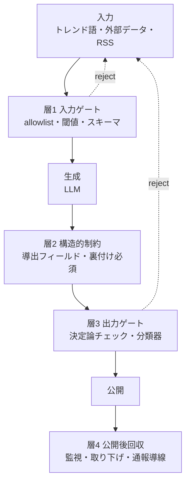
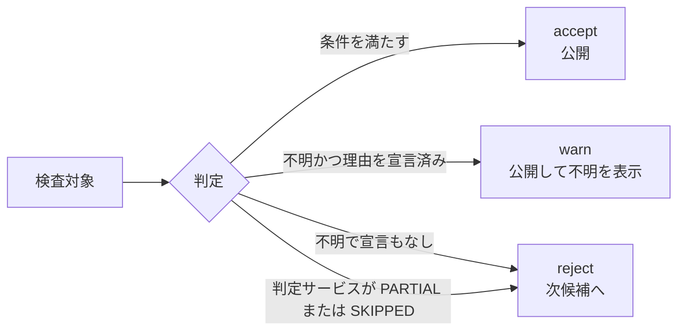
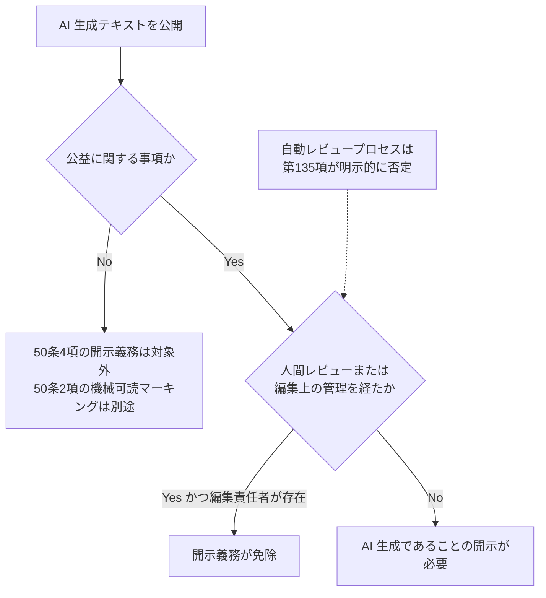

人間のレビューを挟まずにコンテンツを外部公開するパイプラインで、「何を題材にしてよいか」の判断を LLM に任せる設計は破綻します。この失敗を当事者の言葉で残した実装記録を起点に、無人公開の安全ゲートをどの層に置けば効くのかを一次ソースで確認しました。

結論を先に述べます。多段の決定論ゲートを積んでも、無人公開は技術的にも法的にも成立しません。それでもゲート設計には意味があります。意味があるのは「人間の実質的関与をどこに置き、機械に何を担わせるか」を分ける形に組み替えたときです。

この記事は、自動生成したコンテンツを外部公開するパイプラインを設計する実装者と、その可否を判断する運営者の両方に向けています。扱う範囲は「公開前の安全ゲートをどこに置くか」であり、生成品質そのものの改善は対象外です。

## 3 行でわかる結論

| 論点 | 結論 |
|---|---|
| ゲートを積めば無人公開できるか | 不成立。EU AI Act 第50条ガイドラインが自動レビューを明示的に否定 |
| 人間レビューを置けば安全か | 実例では機能せず。事故はほぼすべて入力データ起因 |
| どこにゲートを置くべきか | 入力側の allowlist と閾値。出力検査を厚くする投資は費用対効果が最も低い |

## 起点: プロンプトは方針であってガードではない

起点となった実装記録は、失敗を当事者の言葉で残しています。

> 最初はプロンプトで「重い語は避けて」と書くだけだった。
> これは効かない気がしていて、実際すり抜けた。
> プロンプトは方針であって、ガードではない
>
> — hashitoz, 2026-07-26（一次）

その対処として置かれたのが、ビルド時に走る 4 段の検査です。方針は fail-closed、つまり「判定できないものは通さない」でした。

この方向づけ自体は妥当です。ただし、ここから素直に延長した結論、すなわち「決定論的な多段 fail-closed ゲートを積めば無人公開してよい」は成立しません。決定的な事実が 3 つあります。

1. **欧州委員会が 2026-07-20 に公表した AI Act 第50条ガイドライン C(2026) 5054 final の第(135)項が、`automated review processes` を名指しで否定しました。** 自動レビューは開示義務の免除条件である「人間によるレビューまたは編集上の管理」を満たしません。第50条の適用開始は **2026-08-02** です。
2. **人間レビューを置いた事例でも防げていません。** LA Times の Quakebot は「下書き保存 → スタッフが目視 → 1 クリックで公開」という工程を持ちながら、2015 年 5 月に存在しない地震 3 件を公開しました。Tow Center の記述は "In other words, the human review process failed." です。
3. **記録に残る事故はほぼすべて「入力データが想定外だった」型です。** AP の Netflix 誤報も Quakebot も Heat Index も、生成された文章だけを見て誤りを検出する手段がありません。検査対象が出力である限り、入力起因の誤りは構造的にすり抜けます。

したがって問いは「ゲートで人間を置き換えられるか」ではありません。**「人間の実質的関与を最小限どこに置き、機械に何を担わせるか」**です。

:::message
用語の注意です。`fail-closed` / `fail-open` は業界慣用語であり、標準用語ではありません。RFC 4949・NIST SP 800-53 Rev.5・NIST SP 800-160 Vol.1 Rev.1 の全文検索でいずれも 0 ヒットでした。標準側の対応概念は **deny-by-default**（SP 800-41r1 / SC-7(5)）、**Protective Failure / Protective Defaults**（SP 800-160v1r1 E.22/E.23）、**fail-secure**（RFC 4949）の組み合わせです。RFC 4949 は "fail-safe" を「対立する 2 つの語義を持つ曖昧語」として、定義なしの使用を SHOULD NOT で戒めています。
:::

## 検査層の 4 分割

事故の発生源で層を切ると、ゲートを置く場所が決まります。



| 要素名 | 説明 |
|---|---|
| 層1 入力ゲート | 扱えないものを入れない層。allowlist・閾値・スキーマで絞り込み |
| 層2 構造的制約 | 捏造できる状態を表現させない層。導出フィールド化と裏付けの必須化 |
| 層3 出力ゲート | 生成物を検査して止める層。決定論チェックと分類器 |
| 層4 公開後回収 | 誤りが出る前提で戻す層。監視・高速取り下げ・通報導線 |
| reject | 公開の中止ではなく次候補への差し戻し |

各層の評価は次のとおりです。

| 層 | 何を守るか | 実在例 | 評価 |
|---|---|---|---|
| 層1 入力ゲート | 扱えないものを入れない | 日経=XBRL のみ / AP=時価総額 $75M 以上 / cve=CVSS>=7.0 / kowai=allowed_shapes | **最も有効**。事故がほぼすべて入力起因である以上、ここが本丸 |
| 層2 構造的制約 | 捏造できる状態を表現させない | 順位を導出結果にする / `confirmed`・`source` を必須にする | 検知ではなく設計で消す。CaMeL 論文の情報フロー制約と同系統 |
| 層3 出力ゲート | 出てしまったものを止める | denylist、`assertive` 正規表現 | **単独では脆弱**。文字レベル摂動と語彙シフトで崩壊 |
| 層4 公開後回収 | 誤りは起きる前提で早く戻す | ClueBot NG（FP 0.1% + 人手 revert）、CrowdStrike の canary + rollback | 無人運用の実際の成功例 |

**層3 だけを厚くする投資が最も費用対効果の低い選択です。** 起点記事の 4 段ゲートは層1 に置かれているため、設計としては正しい配置です。

以降の各節は、この 4 層モデルのどこを論じるかで並んでいます。

| 節 | 対応する層 |
|---|---|
| 実在するゲートは入力側で絞る型 | 層1 |
| 「4段」のうち機械実装は 3 段 | 層1 |
| 正規化への過信は危険 | 層1・層3 |
| fail-closed は 3 値で運用する | 層1・層3 の出口設計 |
| 「人間レビューあり」は保証を与えない | 層3・層4 |
| 判定サービスの公式フェイルオープン経路 | 層3 |
| SLA は 429 を守らない | 層3 の可用性 |
| 日本語で使える判定手段が少ない | 層3 |

## 実在するゲートは、ほぼすべて入力側で絞る型

「生成物を検査する」設計より「**扱えるものだけ入れる**」設計が支配的でした。

| 主体 | 入力側の絞り込み | 一次ソース |
|---|---|---|
| 日本経済新聞「決算サマリー」 | 入力を XBRL に限定。PDF のみで開示する企業は対象外 | 映像情報メディア学会誌 74(1), 2020 |
| AP 決算自動記事 | 対象を時価総額 $75M 以上に限定 | Automated Insights, 2015-01-29 |
| cve.autoarticles.net | CVSS >= 7.0 かつ source URL 必須。違反で `process.exit(1)` | 運用者 devlog（実装報告） |
| kowai.autoarticles.net | stage4 = 許可された「形」に合致した題材語だけ accept | 起点記事（一次） |

CVSS ゲートは外部から実測で検証できました。掲載されている 87 件の CVE の最小スコアがちょうど 7.0 で、7.0 未満は 0 件です。宣言と結果が一致している稀な例といえます。

対照的に、生成物そのものを検査するゲートは薄い実装にとどまります。起点記事の 4 段ゲートも、検査対象は入力語 `trend_word` であって生成された本文ではありません。

## 「4段」のうち機械実装は 3 段

この点は著者自身が明記しています。

> ポイントは、stage3だけはビルドで実装していないこと。
> カテゴリ分類は判断が要るので、機械段には向かない。
> 機械でやるのは stage1/2/4 の、完全一致・正規表現・形の一致だけ。

```
stage1 blocklist_exact  … 正規化して完全一致でブロック    ← 機械
stage2 regex_patterns   … 死/事故/災害/事件などに一致で reject ← 機械
stage3 category分類      … ここは LLM の判断              ← LLM（fail-closed の保証外）
stage4 allowed_shapes   … 許可された形に合致したものだけ accept ← 機械
```

判断が要る段を LLM に残し、機械判定できる段をビルドに埋める分業は筋が通ります。ただし「4段の fail-closed 検査」と読むと保証範囲を取り違えます。fail-closed の保証が掛かるのは 3 段です。stage3 相当のカテゴリ誤判定はビルドで止まらず、止まるのは stage4 の形に外れた場合だけです。

なお stage1 の blocklist の実体、stage4 の allowed_shapes の定義、リジェクト率はいずれも記事に記載がありません。リポジトリが非公開のため確認できませんでした。

## 正規化への過信は危険

起点記事の正規化関数は NFKC を掛けています。

```javascript
function normalize(w) {
  return w.trim().normalize("NFKC")
    .replace(/[A-Z]/g, c => c.toLowerCase())
    .replace(/^#+/, "");
}
```

全角半角・大文字小文字・先頭のハッシュタグを吸収する目的としては正しい実装です。しかし「NFKC を掛ければキーワード denylist が堅くなる」とは限りません。実測結果は次のとおりです。

| 入力 | 期待 | `NFKC(x) == y` | NFKC 後 |
|---|---|---|---|
| キリル小文字 а `U+0430` | `a` | **False** | `а`（そのまま） |
| ギリシャ小文字 ο `U+03BF` | `o` | **False** | `ο`（そのまま） |
| ZWJ 挿入 `a`+`U+200D`+`b` | `ab` | **False** | ZWJ 残存 |
| 全角 Ａ `U+FF21` | `A` | True | `A` |
| 合字 fi `U+FB01` | `fi` | True | `fi` |

NFKC が畳み込む対象は**互換分解が定義されている文字だけ**です。別スクリプトの同形異義字も default-ignorable 文字も残ります。UAX #15 自身が NFKC の無条件適用を戒めており、同形異義字対策には UTS #39 の skeleton（NFD + default-ignorable 除去 + confusables 写像）か、文字種を許可制にする allowlist が別途必要になります。

## fail-closed は 2 値ではなく 3 値で運用する

同じ運用者の別サイトに、この論点の実装記録があります。「必須フィールドが空」を一律にエラーにも許容にも倒さない設計です。

| 状況 | 判定 | 挙動 |
|---|---|---|
| 期間の概念がない記事（evergreen） | `ok` | 通す |
| 調べたが未公表（`deadlineNote` あり） | `warn` | 通すが「終了日未公表」と明示して記録 |
| 書き漏らし（`deadlineNote` なし） | `error` | ビルド停止 |

> 「調べたが未公表」は正当だが、読者には「終了日未公表」と見せる必要があるので、黙って通さず warn として記録に残す。ビルド自体は止めない。書き漏らしだけが error でビルドを止める。

この 3 値が公開ページの 3 状態にそのまま貫通している点は、サイト側の実測で確認できました。**「不明」を error に倒すのではなく、「不明であることを明示的に宣言したもの」だけを warn に降格させる**設計です。

3 値化には一次の裏付けもあります。NIST SP 800-167 は **graylist**（判定保留のうえ人に上げる）を正式に定義しており、accept / reject の 2 値強制が過剰ブロックを生む問題への標準側の答えになっています。

同じ運用者は「日付を推測で埋めるのは捏造」と書き、入力が取れないときは更新そのものを見送っています。**わからないことをわからないまま出す経路を確保する**という原則が、取得層からゲート層まで一貫しています。



| 要素名 | 説明 |
|---|---|
| accept | 条件を満たした題材。そのまま公開 |
| warn | 不明であることを宣言済みの題材。公開したうえで不明を読者に表示 |
| reject | 宣言のない不明、および判定不能。次候補へ差し戻し |
| PARTIAL / SKIPPED | 判定サービス側が一部フィルタを実行できなかった状態 |

肝は `warn` の条件です。「不明だから warn」ではなく「**不明であることを明示的に宣言してあるから warn**」です。宣言のない不明は reject に落ちます。これで「わからないことをわからないまま出す」経路を確保しつつ、書き漏らしを止められます。

## 「人間レビューあり」は保証を一切与えない

| 事例 | 主張 | 実態 |
|---|---|---|
| LA Times Quakebot（2015-05） | 下書き保存 → スタッフ目視 → 1 クリック公開 | 存在しない地震 3 件を公開。"the human review process failed" |
| AP（2015-07） | エラー率 7%→1% でレビューを撤去 | 撤去後に Netflix 誤報 |
| CNET（2023-01） | 全記事を専門編集者がレビュー・ファクトチェック済みと公言 | 77 本中 41 本に訂正 |
| Heat Index（2025-05） | King Features「AI 使用禁止の厳格なポリシーがある」 | 4 層すべてが相手側の検査を前提にして fail-open。推薦書籍 15 冊中 10 冊が架空 |
| Sports Illustrated（2023-11） | AdVon が人間執筆・編集と保証 | 検証は業者への確認のみ。架空著者 + AI 生成顔写真 |

Chicago Public Media 広報の言葉が、組織境界でゲートが消える構造を端的に示しています。

> Historically, we don't have editorial review from those mainly because it's coming from a newspaper publisher, so we falsely made the assumption there would be an editorial process for this.

Quakebot の失敗は構造的です。**人間レビュアが検査していた対象は「記事の書き方」であって「入力データの妥当性」ではありませんでした。** USGS が誤ったデータを出した時点で、その記事は「与えられたデータに対して正しく書かれた記事」になります。記事だけを見て誤りを検出する手段がありません。

したがって「レビューの有無」は問いとして意味を持ちません。意味を持つのは **「何を、どの単位で、どの層で検査しているか」**だけです。

## 判定サービス側に「公式のフェイルオープン経路」がある

無人ゲートの停止条件を設計するうえで、これが最大の落とし穴でした。

| サービス | 経路 | 公式の記述 | 既定 | 無効化 |
|---|---|---|---|---|
| Google Model Armor（Vertex AI 統合） | 到達不能時のスキップ | "All these instances can occasionally expose unscreened prompts or responses because the request continues without prompt and response sanitization." | 常時この挙動 | 公式に無効化フィールドの記載なし |
| AWS Bedrock Guardrails | ストリーミング非同期 | "response chunks may contain inappropriate content until guardrails scan completes" | `SYNCHRONOUS`（安全側） | 可。明示指定しなければ同期 |
| Azure AI Content Safety | Asynchronous filtering | "unsafe content might be briefly exposed before filtering is complete" | 既定は同期 | 可。オプトイン機能 |
| Azure AI Content Safety | `haltOnBlocklistHit` | blocklist ヒット時に `categoriesAnalysis` が返らない | `false` | fail-open ではないが「部分的に未検査」を生成 |

さらに、**判定不能を製品仕様として表現できるのは Google Model Armor だけ**でした。

| フィールド | 値 | 意味 |
|---|---|---|
| `filterMatchState` | `MATCH_FOUND` / `NO_MATCH_FOUND` | 有害判定の有無 |
| `invocationResult` | `SUCCESS` / `PARTIAL` / `FAILURE` | PARTIAL は一部フィルタの実行失敗 |
| `executionState`（フィルタ単位） | `EXECUTION_SUCCESS` / `EXECUTION_SKIPPED` | サーバエラー・権限・トークン上限超過によるスキップ |

`filterMatchState` だけを見て `NO_MATCH_FOUND` を「安全」と解釈すると、**未検査をサイレントに通します**。特にトークン上限超過が `EXECUTION_SKIPPED` を返す仕様は、長文ほど無検査になりやすいことを意味します。

## SLA は 429 を守らない

| サービス | SLO | Downtime の定義 |
|---|---|---|
| Azure AI Content Safety | 99.9% | `Error Code` = 5xx。無料 F0 は SLA 非対象 |
| AWS Bedrock | 99.9% | "An `Error` is any Request that returns a 500 error code." |
| Google Security Command Center | 99.9% | 全リクエストが 500 を返した場合のみ Downtime |
| Google Cloud Natural Language API | 99.9% | Error Rate 5% 超（500 のみ） |

SLO は横並びで 99.9% です。差は Downtime の定義にあります。**3 社とも 5xx のみを失敗と数え、429（レート制限）は SLA の対象外**です。無人バッチが最も詰まる箇所は 429 であるにもかかわらず、そこはベンダー保護の外にあります。リトライ・バックオフ・キュー制御は自前で設計する必要があります。

参考として、OpenAI Python SDK の既定は timeout 600 秒 / retry 2 回です。素で使うと障害時に最悪 30 分ハングします。

## 日本語で使える判定手段が少ない

| 手段 | 日本語 | 備考 |
|---|---|---|
| Azure AI Content Safety | ○（訓練済み 8 言語に含む） | blocklist の反映は最大 5 分。事故直後の即時ブロックは不可 |
| AWS Bedrock Guardrails 本体 | ○（Optimized） | word filters と contextual grounding は英仏西のみ。日本語 NG ワード辞書は利用不可 |
| Google Model Armor | ○（テスト済み 9 言語） | 障害時挙動を仕様化している唯一の製品 |
| GCP Natural Language `moderateText` | ○（フルサポート 9 言語） | 単価が他より 1 桁高い |
| OpenAI Moderation API | 多言語対応の公式記述を確認できず | 無償。部分結果の仕組みは単体エンドポイントに非搭載 |
| Llama Guard 3/4・ShieldGemma・Granite Guardian | × | model card に日本語の記載なし |
| Perspective API | 対象外 | 2026-12-31 サービス終了。Jigsaw 公式モデルカードが "not intended to be used for fully automated moderation" と明記 |

OSS の guard モデルで日本語を model card に明示している例は NVIDIA Nemotron Safety Guard 8B v3 のみでした。**英語圏の「Llama Guard を挟めばよい」という設計論は、日本語運用にそのまま持ち込めません。**

なお価格は意思決定要因になりません。8,000 字の記事 1 本あたり OpenAI $0 / Model Armor $0.0002 / Bedrock $0.0012 / Azure $0.003 / GCP NL $0.04 です。

## 信頼境界の置き方と、多段化が効く条件

MITRE ATLAS の mitigation `AML.M0033`（Validate AI Model）は、検証をモデルの外に置くよう求めています。

> Validation should be performed external to the AI agent.
>
> — MITRE ATLAS、GitHub 公式配布データ `mitre-atlas/atlas-data` の `dist/ATLAS.yaml` より

同時に `AML.M0029`（Human-in-the-Loop）は最終判断を人間に置くよう求め、その厚みを帰結の大きさに比例させよとしています。この 2 つを合わせると、設計は次の形になります。

- 判定コードを **LLM 呼び出しに依存しない決定論的コード**に置く（層1・層2）
- LLM-as-judge を**補助にとどめ、最終ゲートにしない**
- 決定論ゲート自体も信頼境界にはならないと理解する（反証 3 を参照）

多段化には条件があります。NIST SP 800-160v1r1 E.9（Defense In Depth）は 3 本柱の第 3 に「層の性質が多様であること」を置いています。

> The successive barriers should be diverse in nature.

つまり **同一モデル・同一プロンプト・同一の表層文字列マッチを並べても多段になりません**。起点記事の機械 3 段（完全一致 / 正規表現 / 形の一致）は、いずれも「正規化後の文字列を見る」という共通の弱点を持ちます。同形異義字や語彙シフトはこの 3 段を同時に抜けます。

なお「層が独立でないと多段の意味が薄れる」という命題を Swiss cheese model（James Reason）に帰属させる説明は誤りです。Reason の原典は「穴が瞬間的に整列したときにのみ悪い結果が生じる」までしか述べていません。独立性・多様性の要求は NIST SP 800-160 E.9 と SP 800-53 SC-29（common mode failure）に帰属させるほうが正確です。

## 法的な信頼境界は 2026-08-02 から効く

技術設計の前に、前提条件があります。



| 要素名 | 説明 |
|---|---|
| 公益に関する事項 | 第50条4項の開示義務が掛かる対象。解釈は広く、ライフスタイル記事も射程例 |
| 人間レビューまたは編集上の管理 | 開示義務の免除条件。実質的な関与を要求 |
| 第135項 | 自動レビュープロセスを免除条件から除外する条項 |
| 50条2項 | 機械可読マーキングの義務。4項の免除とは独立 |

第(135)項の原文は次のとおりです。

> Superficial, solely formal or procedural checks (e.g. spell-checking or grammatical correction), the mere existence of an editorial policy, automated review processes or cursory editorial approval without substantive engagement by the human reviewer or the editorial entity, cannot fulfil the conditions for human review or editorial control for the purposes of this exception.

さらに第(136)項が、人間の承認の**後段**に AI の実質的介入があると免除が失効すると定めています。人間承認はパイプラインの最終段に置く必要があります。

「個人ブログだから対象外」も成立しません。第(19)項が「定期的に経済的利益を得る活動は professional」と定義しており、Art.2(1)(c) により日本在住でも出力が EU で使われれば射程に入ります。罰則は Art.99(4)(g) です。

## 公開前の安全確保として何を選ぶか

| # | アプローチ | 代表例 | 効き方 | 主な弱点 |
|---|---|---|---|---|
| A | プロンプトで方針を書く | 起点記事の初期実装 | ほぼ無効 | 当事者が「実際すり抜けた」と報告 |
| B | 入力側 allowlist / 閾値 | 日経 XBRL / AP $75M / CVSS>=7.0 / allowed_shapes | **最も有効** | カバレッジ低下。扱える題材が減少 |
| C | 生成物の決定論チェック | denylist、正規表現 | 補助として有効 | FP 約 20%、文字摂動・語彙シフトで回避 |
| D | LLM guard モデル | Azure / Bedrock / Model Armor / Llama Guard | 補助として有効 | 日本語対応の穴、相関故障、障害時 fail-open |
| E | 人間の公開前レビュー | Quakebot / CNET / Heat Index | 実例では機能せず | 規約・法令が要求するため回避不能 |
| F | 構造的制約 | 導出フィールド化、裏付け必須 | 検知でなく設計で消去 | 適用領域が限定的 |
| G | 公開後の高速取り下げ | ClueBot NG / canary + rollback | **無人運用の実際の成功例** | 一度は世に出る |
| H | 開示ラベリング + 通報導線 | C2PA / EU AI Act 50条2項 / Apple の再設計 | 標準側の推奨路線 | 誤りそのものは残存 |

**単独で足りるものは 1 つもありません。** 実務的な優先順位は `B > F > H > G > C ≈ D` です。E は「技術的に有効だから」ではなく「規約と法令が要求するから」必須になります。

## 反証: この結論を弱めるエビデンス

反証専用の探索で見つかった、最も強い 5 件を挙げます。

### 反証 1: そもそも無人公開が規約上・法令上できない

- **Anthropic Usage Policy（Effective September 15, 2025）** が High-Risk Use Cases に「Media or professional journalistic content: ...automatically generate content and publish it for external consumption」を列挙し、"a qualified professional in that field must review the content or decision prior to dissemination" を要求しています。決定論ゲートは human review の代替として認められていません。
- **Zenn 利用規約 第4条(11)**（最終改定 2025-06-05）が「機械により自動生成された文章の投稿」を禁止事項に列挙しています。Zenn の AI 方針（2026.03.10）も「公開前に内容の正確性を検証したり、著者自身の経験や洞察、想いをコンテンツに込めること」を「人が主体となる」の定義としています。
- **RSF ほか 16 団体の Paris Charter on AI and Journalism（2023-11-10）** 原則 4 が「Responsibilities tied to the use of AI systems should be anticipated, outlined, and assigned to humans」と定めています。
- **Google Search の spam policy** が scaled content abuse を明示しています。

この 4 点により、「ゲートを積めば無人でよい」という主張は四方から否定されます。**ここがこの結論の最も弱い部分です。**

### 反証 2: 決定論的キーワードゲートの誤検知コストは実測で大きい

- **IAB Brand Safety and Suitability Guide（2020-12）**: キーワードフィルタの業界平均 false positive 率は約 20%、社会的事件時は flag 率が 10 倍、そして「98% of keywords never end up needing to be switched from monitored or blocked」です。
- **Reuters の news セクションの 54%** が brand suitable であるにもかかわらずブロックリストに抵触しました。素朴なキーワードによる fail-closed は、半分以上が誤検知になるオーダーです。
- 誤検知の多いゲートは無視されます。医療の drug safety alert は 49〜96% の割合で override されます（JAMIA 13(2), 2006）。アラートが 1 件増えるごとに受容率は 30% 落ちます（BMC Med Inform Decis Mak, 2017）。

起点記事の運用者自身も、誤検知（`還元` が `還元率` に誤ヒットする例）を実運用で修正した経緯と、「厳しすぎると運用者が検証そのものを外したくなる」という記述を残しています。ゲートには生存条件があります。

### 反証 3: 多段は独立していない（相関故障）

- **Findings of ACL 2026「Jailbreaking Large Language Models with Morality Attacks」Table 2**: WildGuard 87.1 / Llama-Guard-4 87.2 / Granite-Guardian 87.9 / Prompt-Guard-2 88.6 / ShieldGemma-9B 96.3 の平均 ASR です。ベンダーの異なる 5 つの guard モデルが同一攻撃系にそろって陥落しました。段を増やしても相関故障なら効果はゼロに近づきます。
- **CrowdStrike Channel File 291 の RCA（2024-08-06）**: 「The Content Validator contained a logic error」と記載されています。決定論的な validator 自身のバグが全世界を停止させました。是正策の 6 番目は「もっと厳しいゲート」ではなく「Template Instances should have staged deployment」、すなわち canary ring + rollback でした。

### 反証 4: 判定サービス障害での停止は、Web PKI が 10 年以上前に棄却した設計

Adam Langley（Google, Chrome セキュリティ）は 2012-02-05 に次のように述べています。

> If browsers were to insist on talking to the CA before accepting a certificate, all these cases would stop working. There's also the concern that the CA may experience downtime and it's bad engineering practice to build in single points of failure.

判定サービスを公開の critical path に置くと、そのサービスが SPOF になります。「判定サービスが落ちたら公開を止める」は、可用性の観点では既に一度否定された設計です。

### 反証 5: 支持根拠である NIST 自身が留保を付けている

暫定結論は SP 800-160v1r1 E.22 Protective Defaults を根拠にしていましたが、同じ Appendix E の隣接原則が反対方向の要求を出しています。

| 原則 | 内容 | 含意 |
|---|---|---|
| E.3 Commensurate Protection | "The strength and type of protection provided to a system element are commensurate with the most significant adverse effect that results from a failure of that element." | 個人ブログの損失規模に対し最大限の保護は不釣り合い |
| E.4 | 無条件の fail-closed を ungraduated response に分類 | 損失の深刻さが正当化する場合に限定 |
| E.23 Protective Failure | "Efforts to avoid or limit failures may themselves degrade system performance, which is a form of failure." | 過剰な防止策自体が failure の一形態 |

E.22 だけを引用する説明は、同文書の趣旨を切り取っています。

### 補足: graylist は現実に滞留する

3 値出口の `graylist` は理屈として正しい設計ですが、保留キューは処理されません。Wikipedia の Articles for Creation は、世界最大級のボランティア母数を持ちながら 3 ヶ月以上滞留する 4,566 件の保留を抱えています（2026-07-27 時点）。**個人運用のパイプラインで graylist が処理される見込みは、これより低いと考えるべきです。**

したがって `warn` は「後で人が見る」ではなく「**通すが、不明であることを読者に表示する**」として設計する必要があります。

### 反証が見つからなかった論点

1. 「LLM の題材判断だけを信頼境界にしてよい」という一次主張は、探索範囲で見つかりませんでした。
2. 「多段化は単段より弱い」という証拠は見つかりませんでした。
3. コンテンツ公開の文脈で fail-open を積極推奨する一次ソースは見つかりませんでした。

## 推奨

### 判断者（発注側・運営者）への推奨

1. **「無人で公開できますか」を要求仕様から外します。** 問いを「人間の実質的関与を、パイプラインのどの段に、どの粒度で置くか」に書き換えます。EU AI Act 第50条ガイドライン第(135)項により、自動レビューは編集上の管理として認められません。
2. **編集責任者を氏名・役割・連絡先で特定して公開します。** EU の Code of Practice on Transparency of AI-Generated Content（2026-06-10）Commitment 4 が求める形式であり、「辞書やポリシーを誰が更新するのか」という運用上の問いへの答えにもなります。個別記事のレビュー記録までは不要と明記されている点が実務的に重要です。
3. **ポリシーの見直し頻度を明文で決めます。** NIST AI RMF の GOVERN 1.5 は「periodic review」だけでなく「including determining the frequency of periodic review」を要求します。頻度の値そのものより、決めていない状態が問題になります。
4. **記事の種別で開示を出し分けません。** 「公益に関する事項」の解釈は広く、ライフスタイル記事すら射程例に挙がっています。一律に開示ラベルを付けるほうが、判定コストも法的リスクも低く収まります。
5. **第三者プラットフォームと自社ドメインで方針を分けます。** 起点記事の運用者は「自社ドメイン=無人 / Zenn 等の第三者媒体=手動公開」と明示的に線を引いています。判断軸は技術的安全性ではなく媒体側の規約リスクです。

### 実装者への推奨

着手順は 1 → 2 → 3 を先に固めます。1 と 2 が層1・層2 の投資であり、効きが最も大きいためです。5 以降は層3 を採用した場合の必須の後始末にあたります。

| # | やること | 根拠 |
|---|---|---|
| 1 | ゲートを層1（入力側）に置く。出力検査を厚くする前に、扱える入力の allowlist と閾値を定義する | 記録に残る事故がほぼすべて入力起因（AP / Quakebot / Heat Index） |
| 2 | 捏造できる状態を表現できなくする。順位や日付は書き込みフィールドではなく導出結果にし、断定表現には `confirmed` / `source` の同伴を必須にする | 層2。検知ではなく設計で消去 |
| 3 | 出口を 3 値にする。`accept` / `warn`（通すが不明を表示）/ `reject`（次候補へ）。不明であることを宣言していないものだけ reject に落とす | NIST SP 800-167 の graylist 定義 + 実装記録 |
| 4 | `warn` を「後で人が見る」ではなく「読者に表示する」で設計する | 保留キューの滞留（Wikipedia AfC 4,566 件） |
| 5 | 判定サービスの「未検査」を明示検出する。Model Armor なら `invocationResult != SUCCESS` と `executionState == EXECUTION_SKIPPED`、Bedrock なら `guardrailCoverage.textCharacters` の `guarded` と `total` の差 | `filterMatchState` だけではサイレント fail-open |
| 6 | マネージド統合の自動スキップを前提に置く。Model Armor の Vertex AI 統合は到達不能時にスキップし、無効化フィールドが公式に記載されていない。API を直接叩く選択肢を検討する | 判定サービスの公式フェイルオープン経路 |
| 7 | 429 のリトライを自前で設計する。SLA の Downtime 定義は 5xx のみで、429 は保護外。SDK 既定をそのまま使わない | SLA の定義 |
| 8 | NFKC を安全対策と呼ばない。同形異義字・ZWJ は残る。必要なら UTS #39 の skeleton か、文字種の allowlist を足す | 本調査の実測 |
| 9 | 段の「多様性」を確認する。表層文字列マッチだけを並べても多段にならない。決定論層と確率的層、入力層と出力層を混ぜる | NIST SP 800-160v1r1 E.9 第3の柱 |
| 10 | 誤検知率を測る。停止件数だけでなく「止めたもののうち本当に止めるべきだったものの割合」を記録する | IAB の FP 約 20% / alert override 49〜96% |
| 11 | 公開後の回収経路を必ず持つ。監視・高速取り下げ・通報導線を用意する | ClueBot NG は fail-closed ではなく「FP 0.1% + 事後 revert」で運用 |
| 12 | 日本語で動く判定手段を先に確認する。Llama Guard 系・ShieldGemma・Granite Guardian は日本語非対応。AWS の word filters も日本語では利用不可 | 判定手段の言語対応 |

## 起点記事の設計への評価

批判ではなく、どこが妥当でどこに注意が要るかの整理です。

| 論点 | 評価 |
|---|---|
| 「プロンプトは方針であってガードではない」 | **正しい**。当事者の実測による。本調査で反証は見つからず |
| 機械段を層1（入力語）に置いた | **正しい**。実在事例で最も有効な層 |
| stage3 を LLM に残した分業 | **正しい**。ATLAS AML.M0029 の「LLM-as-judge は補助」と整合。ただし「4段の fail-closed」と読むと保証範囲を取り違える |
| 「許可された形だけ通す」 | **正しい**。denylist より原則的に優位（Saltzer & Schroeder の permission ベース判定） |
| 「迷ったら不採用、次の候補へ」 | **正しい設計**。公開を止めず次候補へ回すためスループットを維持。fail-closed の可用性コストへの実務的な回答 |
| NFKC による正規化 | **限定的**。表記ゆれには有効だが同形異義字には無効 |
| 検査対象が入力語のみ | **注意**。「重い語を題材にしない」は担保されるが「重い内容を書かない」は守備範囲外 |
| Zenn への記事投稿は手動公開 | **正しい**。Zenn 利用規約 第4条(11) がある以上、ここは無人化の対象外 |

## 未解決の問い

1. 公開前ゲートと公開後回収のどちらが総合的に優れるかを直接比較した一次研究が見つかりませんでした。CrowdStrike の canary + rollback も ClueBot NG も個別事例の設計選択であり、比較実験ではありません。
2. graylist / 保留キューの処理率を実測した研究が見つかりませんでした。Wikipedia AfC や Meta Oversight Board の数字は滞留量の傍証にとどまります。
3. 「ゲートが厳しすぎて運用者が無効化した」publishing 領域の一次事例が見つかりませんでした。医療 CDS とセキュリティでは確立していますが、コンテンツ公開領域では起点記事の運用者の記述が最も近い例です。
4. 元記事の stage1 blocklist の実体・stage4 の allowed_shapes 定義・リジェクト率は不明です。リポジトリ非公開のため確認できません。
5. MITRE ATLAS AML.M0033 の原文を公式サイトで照合できていません。引用は GitHub 公式配布データ由来です。
6. ISO/IEC 42001 の条項番号は特定していません（有償規格、本文未入手）。
7. note.com の規約における自動投稿の扱いは未確認です（403）。Zenn とは事情が異なる可能性があります。
8. 障害時に fail-open / fail-closed のどちらへ倒したかを明示したベンダーのポストモーテムが見つかりませんでした。

## まとめ

無人公開パイプラインの安全設計は、ゲートの段数を増やす問題ではありません。事故の記録がほぼすべて入力起因である以上、効くのは入力側の allowlist と閾値であり、出力検査を厚くする投資は費用対効果が最も低い選択になります。そして EU AI Act 第50条ガイドラインが自動レビューを免除条件から除外した以上、設計の問いは「無人化できるか」ではなく「人間の実質的関与をどの段に置くか」に変わります。

この記事が少しでも参考になった、あるいは改善点などがあれば、ぜひリアクションやコメント、SNSでのシェアをいただけると励みになります！

## 参考リンク

- 中核ソース
  - [LLMが選んだ題材語を、ビルドの中で4段fail-closedに通す](https://zenn.dev/hashitoz/articles/2026-07-26-fleet-devlog-manga-deals-zenn)
  - [無人運用の記事バリデーション — 「終了日が無い」を書き漏らしと未公表に機械で仕分ける](https://blog.hashito.biz/2026/07/25/unattended-content-validation-deadline-missing-vs-unpublished/)
  - [kowai.autoarticles.net](https://kowai.autoarticles.net)
- 標準・原則
  - [NIST SP 800-160 Vol.1 Rev.1 Engineering Trustworthy Secure Systems](https://nvlpubs.nist.gov/nistpubs/SpecialPublications/NIST.SP.800-160v1r1.pdf)
  - [NIST SP 800-53 Rev.5](https://nvlpubs.nist.gov/nistpubs/SpecialPublications/NIST.SP.800-53r5.pdf)
  - [NIST SP 800-167 Guide to Application Whitelisting](https://nvlpubs.nist.gov/nistpubs/SpecialPublications/NIST.SP.800-167.pdf)
  - [NIST SP 800-41 Rev.1 Guidelines on Firewalls and Firewall Policy](https://nvlpubs.nist.gov/nistpubs/Legacy/SP/nistspecialpublication800-41r1.pdf)
  - [NIST AI RMF 1.0](https://nvlpubs.nist.gov/nistpubs/ai/NIST.AI.100-1.pdf)
  - [RFC 4949 Internet Security Glossary, Version 2](https://www.rfc-editor.org/rfc/rfc4949.txt)
  - [UAX #15 Unicode Normalization Forms](https://www.unicode.org/reports/tr15/)
  - [UTS #39 Unicode Security Mechanisms](https://www.unicode.org/reports/tr39/)
  - [Saltzer & Schroeder, The Protection of Information in Computer Systems](https://doi.org/10.1109/PROC.1975.9939)
- GitHub
  - [MITRE ATLAS 公式配布データ](https://github.com/mitre-atlas/atlas-data)
  - [Zenn 利用規約](https://github.com/zenn-dev/zenn-docs/blob/main/pages/terms.md)
- 法規制
  - [Regulation EU 2024/1689 AI Act Article 50](https://eur-lex.europa.eu/legal-content/EN/TXT/HTML/?uri=CELEX:32024R1689)
  - [Anthropic Usage Policy](https://www.anthropic.com/legal/aup)
  - [AIによるコンテンツ執筆に関するZennの方針について](https://info.zenn.dev/2026-03-10-ai-contents-guideline)
  - [Paris Charter on AI and Journalism](https://rsf.org/en/paris-charter-ai-and-journalism)
  - 欧州委員会 Guidelines on transparency obligations under Article 50 AI Act, C(2026) 5054 final, 2026-07-20
  - EU Code of Practice on Transparency of AI-Generated Content, 2026-06-10
- 判定手段の公式仕様
  - [Azure AI Content Safety](https://learn.microsoft.com/en-us/azure/ai-services/content-safety/)
  - [Azure Analyze Text REST API](https://learn.microsoft.com/en-us/rest/api/contentsafety/text-operations/analyze-text)
  - [Amazon Bedrock Guardrails](https://docs.aws.amazon.com/bedrock/latest/userguide/guardrails.html)
  - [Amazon Bedrock SLA](https://aws.amazon.com/bedrock/sla/)
  - [Google Model Armor](https://docs.cloud.google.com/security-command-center/docs/key-concepts-model-armor)
  - [OpenAI Moderation](https://platform.openai.com/docs/guides/moderation)
  - [Perspective API](https://www.perspectiveapi.com/)
- 事故事例・運用実績
  - [Andreas Graefe, Guide to Automated Journalism, Tow Center](https://www.cjr.org/tow_center_reports/guide_to_automated_journalism.php)
  - [CNET is testing an AI engine. Here's what we've learned, mistakes and all](https://www.cnet.com/tech/cnet-is-testing-an-ai-engine-heres-what-weve-learned-mistakes-and-all/)
  - [Chicago Sun-Times response to May 18 special section](https://chicago.suntimes.com/press-room/2025/05/20/chicago-sun-times-response-to-may-18-special-section)
  - [Lessons, apology from Sun-Times CEO on AI-generated book list](https://chicago.suntimes.com/opinion/2025/05/29/lessons-apology-from-sun-times-ceo-ai-generated-book-list)
  - [Editor's Note: Retraction of article containing fabricated quotations](https://arstechnica.com/staff/2026/02/editors-note-retraction-of-article-containing-fabricated-quotations/)
  - [CrowdStrike External Technical Root Cause Analysis Channel File 291](https://www.crowdstrike.com/wp-content/uploads/2024/08/Channel-File-291-Incident-Root-Cause-Analysis-08.06.2024.pdf)
  - [Adam Langley, Revocation checking and Chrome's CRL](https://www.imperialviolet.org/2012/02/05/crlsets.html)
  - [User:ClueBot NG](https://en.wikipedia.org/wiki/User:ClueBot_NG)
- 運用コスト・誤検知
  - [Overriding of Drug Safety Alerts in Computerized Physician Order Entry, JAMIA 13(2), 2006](https://doi.org/10.1197/jamia.M1809)
  - [Effects of workload, work complexity, and repeated alerts on alert fatigue, BMC Med Inform Decis Mak, 2017](https://doi.org/10.1186/s12911-017-0430-8)
  - [DORA, Streamlining change approval](https://dora.dev/capabilities/streamlining-change-approval/)
  - IAB Brand Safety and Suitability Guide, 2020-12（一次 URL を確認できず、書誌のみ記載）
  - Jailbreaking Large Language Models with Morality Attacks, Findings of ACL 2026（一次 URL を確認できず、書誌のみ記載）
- 代替アプローチ
  - [Defeating Prompt Injections by Design, CaMeL, arXiv:2503.18813](https://arxiv.org/abs/2503.18813)
  - [Design Patterns for Securing LLM Agents against Prompt Injections, arXiv:2506.08837](https://arxiv.org/abs/2506.08837)
  - [C2PA Technical Specification 2.2](https://spec.c2pa.org/specifications/specifications/2.2/specs/C2PA_Specification.html)
  - [OWASP Top 10 for LLM Applications 2025](https://owasp.org/www-project-top-10-for-large-language-model-applications/)
