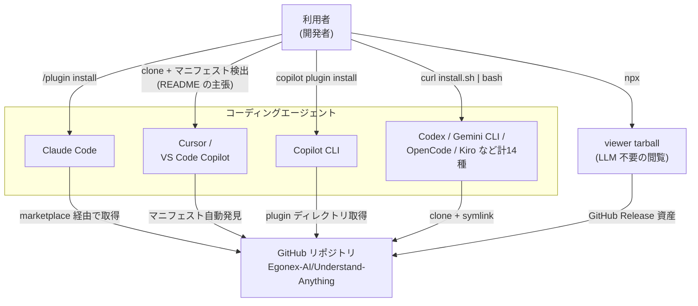
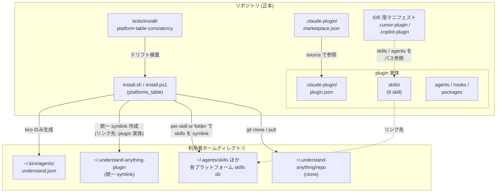
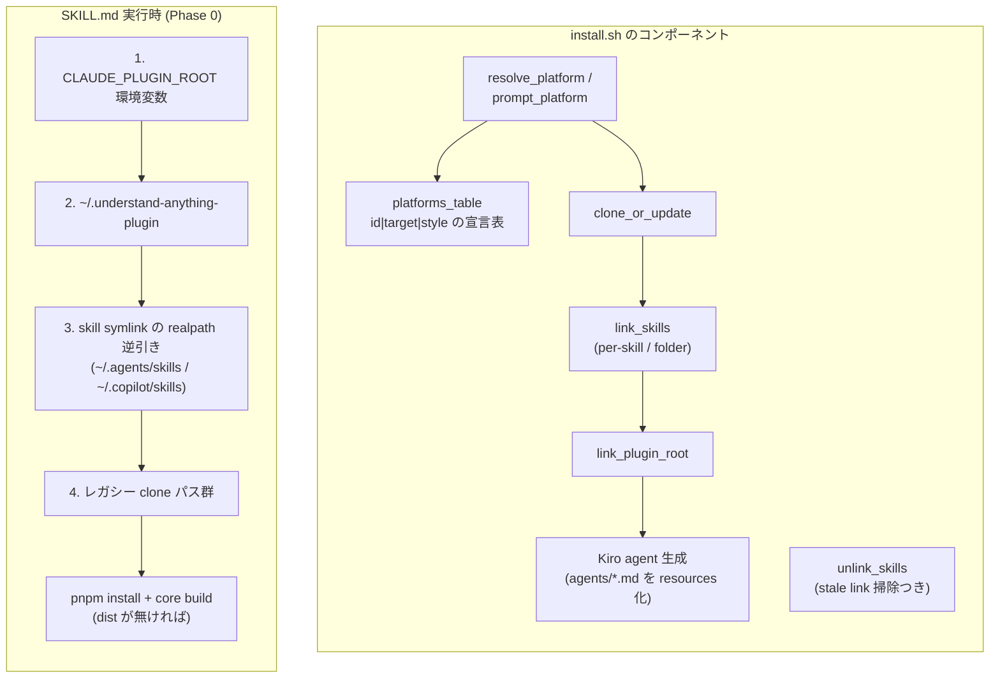
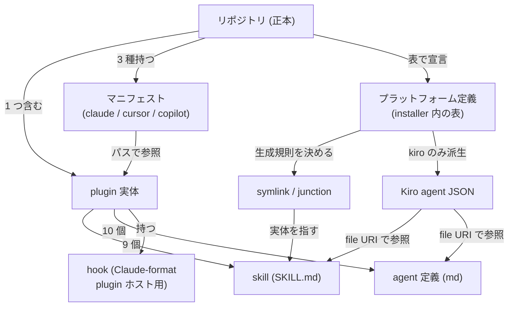
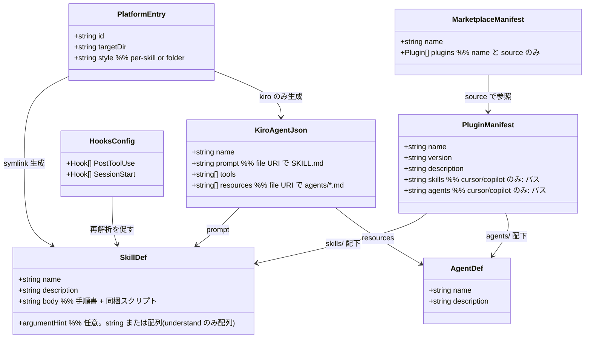

Claude Code 向けに作った plugin や skill を、Codex・Cursor・Copilot・Gemini CLI でも使えるようにしたい。そう考えたとき、プラットフォームごとにコピーを持つとすぐに破綻します。

コードベースを知識グラフ化する OSS「[Understand-Anything](https://github.com/Egonex-AI/Understand-Anything)」は、この問題を **1 つのリポジトリから 17 の対応プラットフォームへ配布する**構成で解いています。17 の内訳は、symlink インストーラー対応の 14 platform ID + Claude Code / Cursor / Copilot CLI です。届くものはチャネルにより異なり、native plugin チャネルでは plugin 全体 (skills + agents + hooks)、symlink チャネルでは skills と実行時のパッケージ参照が配布されます。

本記事では、そのリポジトリ構成・インストーラー実装・整合性テストを読み解き、自分の plugin を複数エージェントへ提供するときに流用できる設計として整理します。調査は plugin version 2.9.4 (main ブランチ commit `3294482`、2026-08-11 時点) のソースコードに基づきます。

なお、コーディングエージェント間で skill を共有する一般論は[前記事 (6 製品比較)](https://zenn.dev/suwash/articles/agentic-coding-clis_20260807) で扱いました。本記事は、実在 OSS が実際に採っている配布実装を 1 つ深掘りする「実装監査」編です。


*この記事の全体像。以下、順に解説します。*

## 概要

Understand-Anything の配布設計の中核は、「**plugin 実体は 1 箇所 (`understand-anything-plugin/`) に置き、プラットフォームごとの差分は『配布チャネル』と『参照方法』だけで吸収する**」ことです。

配布チャネルは 4 系統に整理できます。

| チャネル | 対象プラットフォーム | 仕組み |
| --- | --- | --- |
| ネイティブ plugin marketplace | Claude Code | `.claude-plugin/marketplace.json` + `plugin.json` を `/plugin install` で取得 |
| マニフェスト自動発見 (README の主張) | Cursor / VS Code Copilot | リポジトリ直下の `.cursor-plugin/plugin.json` / `.copilot-plugin/plugin.json` を IDE が自動検出、と README は説明 (公式仕様では未確認。利用方法の節で公式手順を注記) |
| CLI plugin install | Copilot CLI | `copilot plugin install <owner>/<repo>:<plugin-dir>` |
| symlink インストーラー | Codex / Gemini CLI を含む 14 種 | `install.sh` / `install.ps1` が clone + 各プラットフォームの skills ディレクトリへ symlink (**skills のみ**。agents / hooks は対象外) |

チャネルごとに届く範囲が違う点に注意してください。marketplace / CLI install の native plugin チャネルは plugin 全体を各自のインストール先へ取得します。symlink チャネルが各プラットフォームに登録するのは skills だけで、agents / hooks はホストに認識されません (Kiro だけは agent JSON を追加生成)。それでも実行時は skill (SKILL.md) 側が「plugin ルートの候補チェーン」を順に探索して実装パッケージへ到達するため、どのチャネル経由でも同じ手順書が動きます。

## 特徴

- **Single Source of Truth**: skills / agents / hooks / パッケージ実装のすべてが `understand-anything-plugin/` 配下に集約されています。プラットフォーム別のソースコピーは持たず、symlink チャネルはこの正本を直接参照します (Claude marketplace / Copilot CLI などの native plugin チャネルは、正本から取得したコピー / キャッシュを各自のインストール先に持ちます)。
- **Agent Skills 標準形式への準拠**: skill は `SKILL.md` 形式 (標準必須 frontmatter は `name` / `description`) で記述され、Codex / Gemini CLI / OpenCode 等が共有する `~/.agents/skills/` ディレクトリ規約にそのまま載ります。`argument-hint` は[標準項目](https://agentskills.io/specification)ではなくクライアント拡張です (9 skill 中、`understand` のみ YAML 配列・6 skill は文字列で記述されており、文字列を期待するクライアントとは `understand` の配列型だけが揺れます)。
- **symlink 配布による更新の一元化**: インストーラーは実体をコピーせず symlink (Windows は junction) を張るため、既存 skill の内容更新は `git pull` (= `install.sh --update`) だけで全プラットフォームに伝播します。ただし per-skill 方式では skill の追加・削除にリンクが追随しません。追加時は `install.sh <platform>` の再実行、削除時は残った dangling link の手動削除が必要です (folder 方式は追随します)。
- **プラットフォーム差分のデータ化**: 対応プラットフォームは `install.sh` 内の `platforms_table()` に「`id|skills配置先|リンク方式`」の 3 列テーブルとして宣言されています。新プラットフォーム対応は各インストーラー内では 1 行の追加ですが、bash / PowerShell / README の計 3 箇所を同期します (テストで強制。運用の節で後述)。
- **実行時の plugin ルート自動解決**: `SKILL.md` が `CLAUDE_PLUGIN_ROOT` 環境変数 → 統一 symlink (`~/.understand-anything-plugin`) → skill symlink の逆引き → レガシー clone パスの順で候補を探索し、環境差を吸収します。
- **整合性の自動テスト**: vitest のテストが `install.sh` ↔ `install.ps1` 間の「id の集合と順序・リンク方式・配置先」の完全一致と、README の Supported values 行の id 集合一致を検証します。
- **エージェント不要の閲覧経路**: 生成済みグラフは `npx` で取得する viewer tarball により、LLM も API キーも無しで閲覧できます (配布対象を「エージェント利用者」以外にも広げる出口)。

## 構造

配布機構の全体像を、C4 モデルの 3 段階で示します。

### システムコンテキスト図



| 要素 | 説明 |
| --- | --- |
| GitHub リポジトリ | plugin 実体・マニフェスト・インストーラーをすべて持つ単一の正本 |
| Claude Code | Claude-format plugin (plugin.json + skills + agents + hooks) をネイティブにロードする代表ホスト。marketplace 配布まで含めてフル活用。VS Code / Copilot CLI も Claude-format plugin のロード (hooks 含む) をサポート |
| Cursor / VS Code Copilot | repo 直下のマニフェストを自動発見、と README は説明 (公式手順は利用方法の節を参照) |
| Codex / Gemini CLI 等計 14 種 | skill ディレクトリ規約だけを持つプラットフォーム群。symlink で skills のみ接続 |
| viewer tarball | エージェントを一切必要としない閲覧専用の配布出口 |

### コンテナ図

リポジトリ内の構成要素と、インストール後の利用者ホームディレクトリの関係です。



| コンテナ | 役割 |
| --- | --- |
| `.claude-plugin/marketplace.json` | Claude Code marketplace のカタログ。`plugins[]` で plugin 実体ディレクトリを指す (本リポジトリの運用では `name` と `source` のみ) |
| `.cursor-plugin/` `.copilot-plugin/` | 自動発見用マニフェスト。`skills:` / `agents:` フィールドで plugin 実体内のパスを指す (`displayName` の有無を除き同内容) |
| `install.sh` / `install.ps1` | 14 プラットフォーム向け symlink インストーラー。プラットフォーム表・リンク処理・Kiro 特化処理を持つ |
| `understand-anything-plugin/` | skill 手順書・agent 定義・hooks・TypeScript 実装 (pnpm workspace) を含む plugin 実体 |
| `~/.understand-anything-plugin` | どのプラットフォームからでも同じパスで plugin 実体に届く「統一プラグインルート」symlink |
| 整合性テスト | bash ↔ PowerShell 間のプラットフォーム表の完全一致と、README Supported values 行の id 集合一致を CI で強制 |

### コンポーネント図

`install.sh` の内部構成と、skill 実行時の plugin ルート解決の 2 つに分けて示します。



| コンポーネント | 説明 |
| --- | --- |
| `platforms_table()` | 配置先とリンク方式をデータとして宣言する bash 側の表 (`install.ps1` の `$Platforms` と README に複製があり、テストで同期を強制) |
| `link_skills()` | per-skill 方式は skill ごとに 1 リンク、folder 方式は skills/ 全体を `understand-anything` 名で 1 リンク |
| `link_plugin_root()` | 統一 symlink を作成。既存パスがあれば上書きせず温存 |
| Kiro agent 生成 | Kiro には skills の per-skill symlink に加えて、`kiro-cli chat --agent understand` 用の追加エントリポイントとして `SKILL.md` を prompt、`agents/*.md` を resources として参照する agent JSON を動的生成 |
| plugin ルート解決チェーン | 候補ごとに `package.json` + `pnpm-workspace.yaml` の存在で正当性を検証してから採用 |

## データ

配布機構を構成するエンティティと、その情報モデルを整理します。

### 概念モデル



| エンティティ | 説明 |
| --- | --- |
| plugin 実体 | ソースリポジトリ内の論理的な正本は 1 つ。symlink チャネルは参照だけを増やし、native plugin チャネル (Claude marketplace / Copilot CLI) は正本から取得したコピー / キャッシュを持つ |
| マニフェスト | 「自動発見型」プラットフォームへの入口。version 等のメタデータを重複保持する (同期義務あり) |
| プラットフォーム定義 | 「symlink 型」プラットフォームへの入口。配置先ディレクトリとリンク方式の 2 属性で差分を表現 |
| symlink / junction | 配布の実体。per-skill (skill 単位) と folder (skills/ 全体) の 2 方式 |
| Kiro agent JSON | skills symlink と併設される Kiro CLI の agent 起動用「追加エントリポイント」。インストーラーが動的生成 |

### 情報モデル



| モデル | 正本の場所 | 備考 |
| --- | --- | --- |
| PlatformEntry | `install.sh` の `platforms_table()` と `install.ps1` の `$Platforms` | 2 重定義だがテストで同期を強制。順序も一致必須 (対話メニューの番号が意味を持つため) |
| PluginManifest | `.claude-plugin/plugin.json` (root + plugin 実体) / `.cursor-plugin/` / `.copilot-plugin/` | version は 6 ファイルで同期する運用ルール |
| SkillDef | `understand-anything-plugin/skills/<name>/SKILL.md` | 必須項目 (`name` / `description`) は Agent Skills 標準準拠。`argument-hint` はクライアント拡張 |
| AgentDef | `understand-anything-plugin/agents/*.md` | `model:` を省略し各プラットフォームの既定モデルに委ねる |
| HooksConfig | `understand-anything-plugin/hooks/hooks.json` | Claude-format plugin としてロードするホスト (Claude Code / Copilot CLI / VS Code) で発火。symlink による skill-only 配布では使われないが、無くても skill 単体で成立する設計 |

## 構築方法

自分のリポジトリで同じ配布機構を構築する手順を、Understand-Anything の実装を根拠に整理します。

### 1. plugin 実体をサブディレクトリに集約する

```text
my-repo/
├── .claude-plugin/
│   └── marketplace.json          # Claude marketplace カタログ
├── .cursor-plugin/plugin.json    # Cursor 自動発見用
├── .copilot-plugin/plugin.json   # VS Code Copilot 自動発見用
├── install.sh / install.ps1      # symlink インストーラー
├── tests/install/                # プラットフォーム表の整合性テスト
└── my-plugin/                    # plugin 実体 (Single Source of Truth)
    ├── .claude-plugin/plugin.json
    ├── skills/<name>/SKILL.md    # Agent Skills 標準形式
    ├── agents/*.md               # サブエージェント定義
    └── hooks/hooks.json          # Claude-format plugin ホスト向けの付加価値
```

### 2. Claude Code 向け: marketplace + plugin マニフェスト

`.claude-plugin/marketplace.json` の簡略テンプレートです (Understand-Anything の運用では `name` と `source` のみを使用)。

```json
{
  "name": "my-plugin",
  "owner": { "name": "me" },
  "plugins": [{ "name": "my-plugin", "source": "./my-plugin" }]
}
```

### 3. IDE 向け: 公式の認識経路に合わせたマニフェスト

IDE ごとに公式の認識経路が異なるため、分けて用意します。

- **Cursor**: `.cursor-plugin/plugin.json` を置きます。簡略テンプレートは次のとおりです (Understand-Anything の実ファイルはこれに `displayName` を加えた形)

```json
{
  "name": "my-plugin",
  "version": "1.0.0",
  "skills": "./my-plugin/skills/",
  "agents": "./my-plugin/agents/"
}
```

- **VS Code**: 公式の認識対象は root の `plugin.json` / `.plugin/plugin.json` / `.github/plugin/plugin.json` / `.claude-plugin/plugin.json` です。plugin サブディレクトリ内の `.claude-plugin/plugin.json` を正とし、利用者には `chat.pluginLocations` 登録または「Chat: Install Plugin From Source」を案内します。Understand-Anything が持つ `.copilot-plugin/plugin.json` は upstream に存在しますが、公式ドキュメントの認識経路には含まれていません

### 4. symlink 型 CLI 向け: プラットフォーム表駆動のインストーラー

```bash
# install.sh の核 — 差分は「配置先」と「リンク方式」の 2 属性だけ
platforms_table() {
  cat <<EOF
gemini|$HOME/.agents/skills|per-skill
codex|$HOME/.agents/skills|per-skill
antigravity|$HOME/.gemini/antigravity/skills|folder
vscode|$HOME/.copilot/skills|per-skill
kiro|$HOME/.kiro/skills|per-skill
EOF
}

# per-skill: skill ごとに symlink / folder: skills/ 全体を 1 リンク
ln -sfn "$repo/my-plugin/skills/$skill" "$target/$skill"

# 統一プラグインルート (実行時解決の第 2 候補)
ln -s "$repo/my-plugin" "$HOME/.my-plugin"
```

実装上のポイントは次のとおりです。

- clone 先は `~/.my-plugin/repo` のような隠しディレクトリに固定し、`--update` は `git pull --ff-only` だけにする
- Windows 版は symlink でなく **junction** を使う (管理者権限不要)。実ディレクトリを誤って消さないよう、reparse point であることを確認してから削除する
- agent 起動形式を併せ持つプラットフォーム (Kiro) には、skills の symlink に加えて、SKILL.md を prompt として参照する agent 設定 JSON もインストーラーが動的生成する

### 5. skill 側に plugin ルート解決チェーンを書く

```bash
# SKILL.md 内の手順として記述 (Understand-Anything Phase 0 方式)
for candidate in \
  "${CLAUDE_PLUGIN_ROOT}" \
  "$HOME/.my-plugin" \
  "$(realpath ~/.agents/skills/my-skill 2>/dev/null)/../.."; do
  if [ -n "$candidate" ] && [ -f "$candidate/package.json" ]; then
    PLUGIN_ROOT="$candidate"; break
  fi
done
```

### 6. 整合性テストを置く

`install.sh` / `install.ps1` / README を正規表現でパースし、vitest で検証します。検証の強度は箇所ごとに違います。bash ↔ PowerShell 間は「id の集合と順序」「リンク方式」「配置先 (パス区切りを正規化)」を厳密比較し、README の Supported values 行は id 集合の一致 (順序不問)、README の Compatibility 表は「実在する id しか参照しない」という部分集合検査に留めます。パーサーが空リストを返したらテスト自体を fail させ、書式変更によるすり抜けを防ぎます。

## 利用方法

利用者視点のインストール方法をプラットフォーム別に整理します (すべて README 記載の公式手順)。

### Claude Code (ネイティブ)

```bash
/plugin marketplace add Egonex-AI/Understand-Anything
/plugin install understand-anything
```

### symlink 型 CLI (Codex / Gemini CLI / OpenCode / Kiro など計 14 種)

```bash
# macOS / Linux — 対話でプラットフォーム選択、または引数で指定
curl -fsSL https://raw.githubusercontent.com/Egonex-AI/Understand-Anything/main/install.sh | bash -s codex

# Windows
iwr -useb https://raw.githubusercontent.com/Egonex-AI/Understand-Anything/main/install.ps1 | iex
```

### 自動発見型 (Cursor / VS Code Copilot)

README の説明では、リポジトリを clone して IDE で開くだけで `.cursor-plugin/` / `.copilot-plugin/` のマニフェストが自動検出されます (VS Code + Copilot は v1.108+ と記載)。ただし各プラットフォームの公式ドキュメントとは差分があるため、確実に使うなら公式手順に沿うのが安全です。

- Cursor: [公式 Plugins ドキュメント](https://cursor.com/docs/plugins)が示すローカル plugin の導入は「`~/.cursor/plugins/local/<plugin>` へコピーまたは symlink して再起動」で、clone した workspace を開くだけの検出は記載がありません
- VS Code: [公式 Agent plugins ドキュメント](https://code.visualstudio.com/docs/agent-customization/agent-plugins)が自動認識対象として挙げるのは root の `plugin.json` / `.claude-plugin/plugin.json` / `.plugin/plugin.json` であり、`.copilot-plugin/` は含まれていません。認識されない場合は `chat.pluginLocations` に **plugin サブディレクトリ** (`<clone先>/Understand-Anything/understand-anything-plugin`) を登録するか、Copilot CLI 経由または `install.sh vscode` を使います
- 全プロジェクト共通で使いたい場合は `install.sh vscode` で `~/.copilot/skills` に symlink します

### Copilot CLI

```bash
copilot plugin install Egonex-AI/Understand-Anything:understand-anything-plugin
```

### 呼び出しプレフィックスの差

| プラットフォーム | 呼び出し方 |
| --- | --- |
| Claude Code / 多数 | `/understand` (名前衝突時は `/understand-anything:understand` の名前空間付き形式) |
| Codex | `$understand` (`$` プレフィックス) |
| Kiro CLI | `kiro-cli chat --agent understand "..."` |
| プレフィックス不明時 | 自然言語で「Use the understand skill to analyze this project」 |

## 運用

### 更新

- symlink 配布のため、既存 skill の内容更新は clone の `git pull` 1 回で全プラットフォームへ同時反映されます
- ただし `--update` は `git pull --ff-only` のみでリンクを再生成しません。per-skill 方式のプラットフォーム (gemini / codex / opencode / pi 等) では、**skill 追加時**は `install.sh <platform>` の再実行で新リンクを作成します。**skill 削除時**は再実行してもリンクは残るため、dangling link は手動で削除します (folder 方式はディレクトリごと参照するため追加・削除とも追随)
- Claude Code (marketplace 経由) はキャッシュ (`~/.claude/plugins/cache/...`) を持つため、marketplace 側の更新フローに従います

```bash
# 既存 skill の内容更新 — 全プラットフォームへ symlink 経由で同時反映
./install.sh --update            # 実体は git -C ~/.understand-anything/repo pull --ff-only

# skill 追加を含むリリース後 — per-skill 方式のプラットフォームだけ再リンク
./install.sh codex
```

### アンインストール

- `./install.sh --uninstall <platform>` は skill / plugin-root のリンクを削除します (Kiro の場合は生成した `~/.kiro/agents/understand.json` も削除)。clone は他プラットフォームが使う可能性があるため残し、削除コマンドを案内するに留めます
- 注意 (共有資産の巻き添え): アンインストールは参照カウントを持ちません。①統一 symlink `~/.understand-anything-plugin` は指定プラットフォームに関係なく削除されます。②`gemini` / `codex` / `opencode` / `pi` は skills 配置先 `~/.agents/skills` を共有するため、どれか 1 つのアンインストールで他の 3 つが使う skill symlink も消えます。いずれも、残すプラットフォームを再インストールして復旧します

```bash
# 指定プラットフォームのリンク削除 (Kiro は生成した agent JSON も削除)
./install.sh --uninstall codex
```

### バージョン管理

リリース時に **6 ファイルの version を同期**する運用ルールがあります。

1. `understand-anything-plugin/package.json`
2. `understand-anything-plugin/.claude-plugin/plugin.json`
3. `understand-anything-plugin/packages/viewer/package.json`
4. `.claude-plugin/plugin.json` (root)
5. `.cursor-plugin/plugin.json`
6. `.copilot-plugin/plugin.json`

`marketplace.json` には version を書かない運用です ([Claude Code の marketplace 仕様](https://code.claude.com/docs/en/plugin-marketplaces)上は `version` 等も許容されているため、plugin.json 側を version の正本とするこのリポジトリの運用判断と読めます)。

### CI での整合性検査

`platform-table-consistency` テストが検査します。検証強度は 3 段階です。

| 比較対象 | 検証内容 |
| --- | --- |
| `install.sh` ↔ `install.ps1` | id の集合と**順序** (対話メニュー番号の一致のため)・リンク方式・配置先の完全一致 |
| README「Supported values」行 | installer の id 集合との一致 (順序は不問) |
| README「Platform Compatibility」表 | 実在する installer id しか参照しないことの部分集合検査 |

プラットフォーム追加時に CI で強制されるのは `install.sh` / `install.ps1` / README Supported values 行の 3 箇所の同時更新です。Compatibility 表の追記は検査対象外なので、レビューで担保します。

## ベストプラクティス

Understand-Anything の実装から抽出できる、複数エージェント対応の設計原則です。

### 配布の設計

- **実体は 1 つ、参照を増やす**: プラットフォーム別コピーを作らない。配布は symlink かマニフェストのパス参照で行い、更新点を 1 箇所に保つ
- **差分をデータとして宣言する**: プラットフォーム差は「配置先 × リンク方式」の表に還元する。コード分岐は Kiro のような構造的例外だけに限定する
- **最小公倍数で書き、付加価値は分離する**: skill 本文は全プラットフォーム共通で動く標準形式 (SKILL.md) に限定し、hooks や marketplace 等は「Claude-format plugin としてロードするホストでは効き、skill-only 配布でも壊れない」層に置く
- **エージェント無しの出口も用意する**: 成果物 (knowledge graph) は JSON としてコミット可能にし、viewer tarball で「plugin をインストールしない同僚」にも届ける

### 互換性の落とし穴回避

- **プラットフォーム固有キーワードを埋め込まない**: agent frontmatter の `model: inherit` は Claude 専用キーワードで、opencode がリテラルなモデル名と解釈して失敗した実績があります ([issue #167](https://github.com/Egonex-AI/Understand-Anything/issues/167))。省略して各プラットフォームの既定に委ねる
- **実行時解決に多段フォールバックを持たせる**: 環境変数 → 統一 symlink → 自身のパス逆引き → レガシーパスの順で探索し、候補は「それらしいファイルの存在」で検証してから採用する。パス文字列からの相対位置決め打ちは symlink 環境で壊れる
- **呼び出し方の差異をドキュメント化する**: `/` と `$` のプレフィックス差、restart の必要性など、機構で吸収できない差は README とインストーラー出力の両方で案内する

### 保守の仕組み

- **重複せざるを得ない表はテストで縛る**: bash / PowerShell / README のような言語をまたぐ重複は排除できないため、パーサー + 一致テストをドリフト検出器として置く。パーサーの空振り (0 件マッチ) も fail にする
- **作成・削除の安全性は OS 版で差がある**: Windows 版 (`install.ps1`) は junction / symlink 以外の実ファイル・実ディレクトリを検出すると拒否して保護します。一方 Unix 版の `link_skills()` は `ln -sfn` で既存パスを無条件に置き換えるため、同名の実ファイルや他用途の symlink を上書きし得ます。アンインストールも期待する名前の symlink をリンク先検証なしに削除するため、共有資産が単一プラットフォームのアンインストールで消えます。厳密にやるなら、作成・削除の前に既存パスの種類とリンク先を検証し、所有外のパスは拒否する設計にする

## トラブルシューティング

### 症状別の早見表

| 症状 | 原因 | 対処 |
| --- | --- | --- |
| skill が認識されない | CLI / IDE の再起動漏れ、または呼び出しプレフィックスの差 (Codex は `$`) | 再起動する。Codex は `$understand`、不明時は自然言語で skill 名を指定 |
| `Cannot find the understand-anything plugin root` | 統一 symlink の欠落・破損 (再インストールでは温存され直らない) | 壊れた `~/.understand-anything-plugin` を手動削除 → `install.sh <platform>` 再実行 |
| Claude Code でローカル変更が反映されない | plugin キャッシュが symlink を追えない + 既存セッションの prompt キャッシュ | キャッシュディレクトリへ実体コピー + 新規セッションで確認 |
| Windows で `Refusing to overwrite ...` | リンク先に実ファイル / 実ディレクトリが既存 (インストーラーは junction 以外を消さない) | 既存パスを手動退避して再実行 |
| clone を消したのにリンクが残る | per-skill リンクは clone 側の削除に追随しない | `install.sh --uninstall <platform>` の stale link スキャンで掃除 |
| プラットフォーム追加時に CI が落ちる | installer 2 スクリプト + README Supported values の同期漏れ | 3 箇所を同時更新 (installer 間は順序も一致させる) |

### 特に注意したい 2 つの挙動

- **統一 symlink は再インストールで直らない**: `link_plugin_root()` は既存パスを温存する実装のため、壊れた・誤った symlink は手動で削除してから再実行する必要があります
- **アンインストールの巻き添え**: `~/.agents/skills` を共有する 4 プラットフォーム (gemini / codex / opencode / pi) は、どれか 1 つのアンインストールで他の skill symlink も消えます。残すプラットフォームの再インストールで復旧します

## まとめ

Understand-Anything の配布機構は、「plugin 実体は 1 つ、差分はデータとテストで管理」という一貫した方針で 17 プラットフォームを支えています。自分の plugin を複数エージェントへ提供するときは、次の 4 点から着手するのが近道です。

1. plugin 実体をサブディレクトリに集約し、skill を Agent Skills 標準形式で書く
2. Claude Code 向け marketplace マニフェストを置き、IDE には各公式の認識経路 (Cursor は `.cursor-plugin`、VS Code は `.claude-plugin` + `chat.pluginLocations`) を用意する
3. プラットフォーム差分を「配置先 × リンク方式」の表に還元した symlink インストーラーを用意する
4. 重複するプラットフォーム表は整合性テストで縛り、skill 側には plugin ルートの多段解決を書く

この記事が少しでも参考になった、あるいは改善点などがあれば、ぜひリアクションやコメント、SNSでのシェアをいただけると励みになります！

## 参考リンク

### リポジトリ (一次情報。実装根拠は調査時点 commit `3294482` に固定)

- [GitHub: Egonex-AI/Understand-Anything](https://github.com/Egonex-AI/Understand-Anything) (最新)
- [install.sh — プラットフォーム表と symlink 配布の正本](https://github.com/Egonex-AI/Understand-Anything/blob/32944829e7a63a9fa9c55d811d7f98a9530c6a6a/install.sh)
- [install.ps1 — Windows 版 (junction + 実ファイル保護)](https://github.com/Egonex-AI/Understand-Anything/blob/32944829e7a63a9fa9c55d811d7f98a9530c6a6a/install.ps1)
- [skills/understand/SKILL.md — plugin ルート解決チェーン](https://github.com/Egonex-AI/Understand-Anything/blob/32944829e7a63a9fa9c55d811d7f98a9530c6a6a/understand-anything-plugin/skills/understand/SKILL.md)
- [tests/install/platform-table-consistency.test.mjs — 整合性テスト](https://github.com/Egonex-AI/Understand-Anything/blob/32944829e7a63a9fa9c55d811d7f98a9530c6a6a/tests/install/platform-table-consistency.test.mjs)
- [README — Multi-Platform Installation 節](https://github.com/Egonex-AI/Understand-Anything#-multi-platform-installation) (最新)
- [issue #167 — `model: inherit` の非互換](https://github.com/Egonex-AI/Understand-Anything/issues/167)

### 各プラットフォームの公式ドキュメント

- [Claude Code Plugins リファレンス](https://code.claude.com/docs/en/plugins-reference)
- [Claude Code Plugin marketplaces リファレンス](https://code.claude.com/docs/en/plugin-marketplaces)
- [Agent Skills 仕様 (SKILL.md frontmatter の標準項目)](https://agentskills.io/specification)
- [VS Code — Agent plugins ドキュメント](https://code.visualstudio.com/docs/agent-customization/agent-plugins)
- [GitHub Copilot CLI — plugin リファレンス](https://docs.github.com/en/copilot/reference/copilot-cli-reference/cli-plugin-reference)
