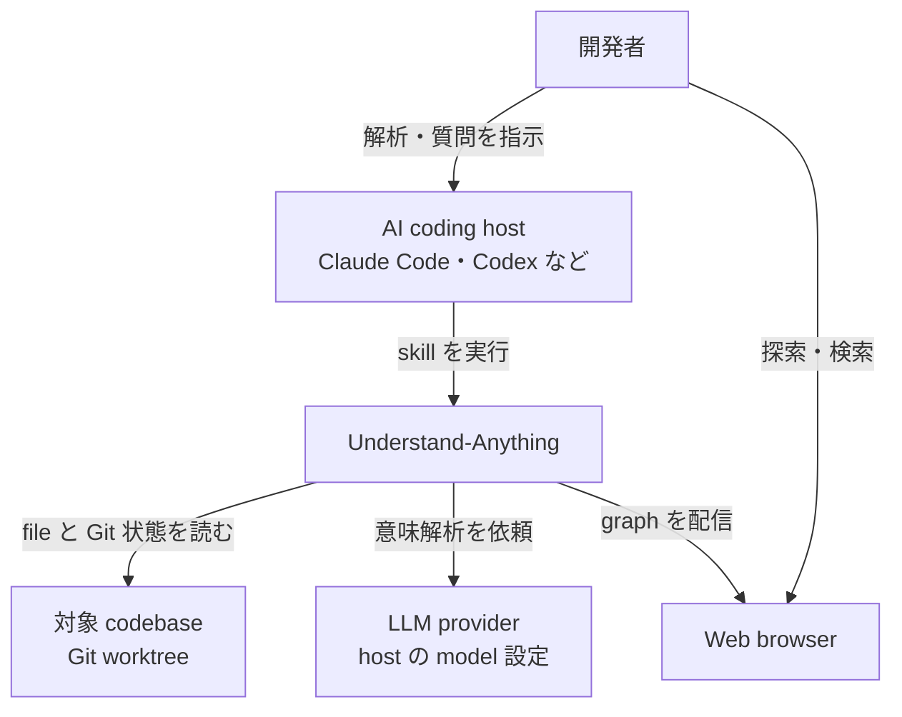
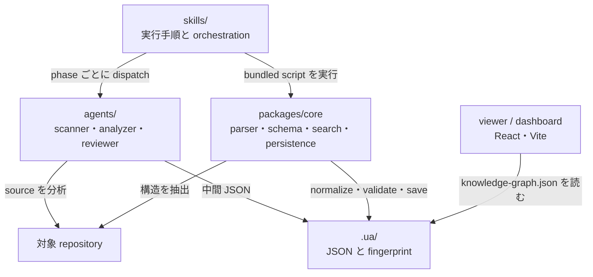
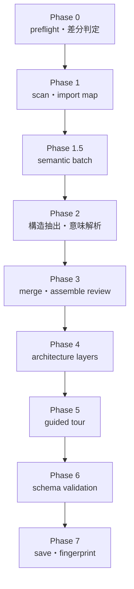
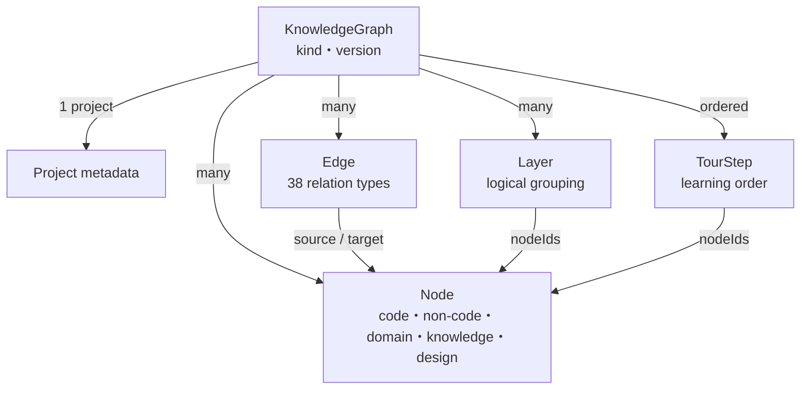
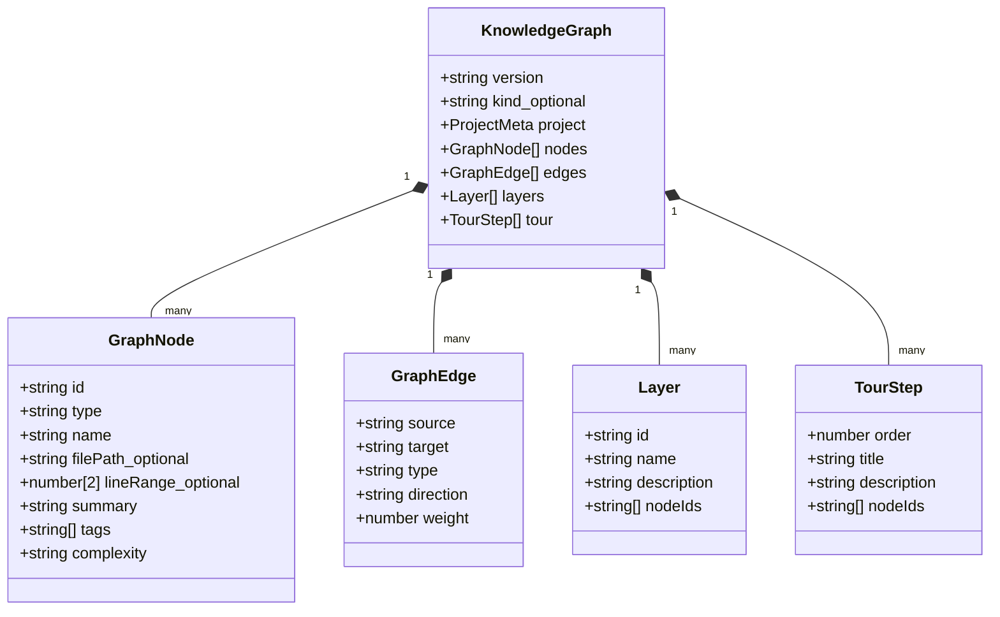

大きなコードベースへ参加した直後は、ファイル一覧を眺めても「どこから読めばよいか」「変更がどこへ波及するか」までは分かりません。OSS の [Understand-Anything](https://github.com/Egonex-AI/Understand-Anything) は、静的解析と LLM エージェントを組み合わせ、コードを検索・探索できる知識グラフへ変換します。

この記事では、Understand-Anything 2.9.4（commit [`3294482`](https://github.com/Egonex-AI/Understand-Anything/tree/32944829e7a63a9fa9c55d811d7f98a9530c6a6a)、2026-08-11）を対象に、解析パイプライン、グラフのデータモデル、差分更新、dashboard と chat の読み取り方を実装から整理します。複数の AI コーディング環境へ skill や plugin を届ける配布機構は扱わず、インストール後に OSS が何をしているかへ焦点を絞ります。


*この記事の全体像。以下、順に解説します。*

## 概要

Understand-Anything は、対象リポジトリを次の 3 層へ変換するツールです。

1. Tree-sitter と専用 parser による決定的な構造抽出
2. LLM エージェントによる要約、意味的な関係、アーキテクチャ層、学習順序の付与
3. `knowledge-graph.json` を読む dashboard、chat、diff、onboarding などの利用機能

中心にあるのは、AI にコード全体を丸ごと読ませる方式ではありません。まずファイル列挙、言語判定、import 解決、関数・class 抽出をスクリプトへ寄せます。その結果を依存関係の近い batch に分け、LLM には意味づけが必要な部分を担当させます。生成物は新規プロジェクトでは `.ua/`、既存の旧形式ディレクトリがあれば `.understand-anything/` に保存されます。

解析結果は単なる file dependency graph でも、ベクトル検索 index でもありません。file、function、class に加えて config、document、service、endpoint、domain、flow などを共通の node として保持し、import、call、data flow、deployment、business flow といった関係を edge で表現します。

## 特徴

- **決定的処理と LLM 処理の分離**: file enumeration、category 判定、import map、Tree-sitter による構造抽出、merge、正規化は script が担当します。要約や意味的 edge、layer、tour は agent が担当します。
- **コード以外も同じ graph に載せる**: Markdown、YAML、Dockerfile、SQL、GraphQL、Terraform などを `document`、`config`、`service`、`table`、`schema`、`resource` として扱います。
- **依存関係を使った semantic batching**: import graph を Louvain 法で community 分割し、関連ファイルを同じ batch にまとめます。失敗時は 12 files 単位の決定的 fallback を使います。
- **初回全体解析と差分更新**: graph に保存した commit hash と現在の Git 状態を比較し、変更 file だけを再解析できます。fingerprint により cosmetic change と structural change も分類します。
- **見る・聞く・影響を調べる出口**: interactive dashboard、graph を絞り込んで回答する chat、1-hop の影響を調べる diff、依存順の guided tour を同じ JSON から提供します。
- **codebase 以外への拡張**: `kind` は `codebase`、`knowledge`、`design` を取り得ます。knowledge base と Figma design を同じ node/edge 抽象へ載せるための型も実装されています。

### 静的解析だけのツールとの違い

Tree-sitter だけでも関数、class、import、call は抽出できます。しかし「この一群は認証 domain である」「新人はこの順番で読むとよい」といった意味は構文木だけでは決まりません。Understand-Anything は、構造の根拠を deterministic parser で作り、意味の説明を agent が補う hybrid design を採ります。

一方で、初回解析は file batch ごとに LLM を使うため、純粋な local static analyzer より時間と token を消費します。README も大規模 project の初回実行では token plan または local model を推奨しています。速い dependency query だけが必要なら、Tree-sitter や language server の index の方が軽量です。

## 構造

ここからは、利用者と外部 system、実行時 container、解析 pipeline の順に分解します。

### システムコンテキスト図



LLM provider への接続を Understand-Anything 固有の API key で直接実装しているわけではありません。解析 agent は plugin を実行する host の model 設定を利用します。そのため、privacy 要件がある環境では host 側を Ollama などの local model provider へ向ける構成を取れます。

### コンテナ図



| container | 主な責務 |
| --- | --- |
| `skills/understand/` | preflight、scan、batch、analyze、architecture、tour、review、save の orchestration |
| `agents/` | project narrative、file summary、layer、tour、graph review の LLM prompt |
| `packages/core/` | Tree-sitter plugin、non-code parser、graph schema、search、persistence、freshness、fingerprint |
| `.ua/` | graph、meta、config、fingerprints、scan result、作業用 intermediate |
| `packages/dashboard/` | React 19、xyflow、ELK/Dagre/force layout、Zustand による interactive UI |
| `packages/viewer/` | release に同梱される read-only server。graph 生成には関与しない |

### コンポーネント図

`/understand` は、preflight を除く scan から save までを 7 phase として進めます。実装上は ignore 確認と batching の中間 phase もあります。



各 phase の要点は次の通りです。

| phase | deterministic part | LLM part |
| --- | --- | --- |
| Scan | `git ls-files`、ignore、language/category、line count、import resolution | README と manifest から project 名・説明・framework を整理 |
| Batch | Louvain community、size 制約、cross-batch neighbor map | なし |
| Analyze | Tree-sitter / non-code parser で構造抽出 | summary、tag、complexity、semantic edge |
| Assemble | ID 正規化、重複排除、dangling edge 除去、`tested_by` 向き補正 | merge 結果の妥当性 review |
| Architecture | directory、fan-in/out、cross-category relation の集計 | logical layer の命名と割り当て |
| Tour | entry point、BFS、cluster の算出 | 5〜15 step の学習順序を設計 |
| Review / Save | schema、参照整合、fingerprint、meta 保存 | `--review` 指定時だけ full graph reviewer |

重要なのは、file analyzer へ source file だけでなく、事前解決済みの import data と隣接 batch の export symbol が渡る点です。これにより batch をまたぐ edge を作りやすくしつつ、agent が import resolution を推測し直すことを避けています。最大 5 agent が並列に batch を処理します。

## データ

永続化の中心は `.ua/knowledge-graph.json` です。別 DB server は不要で、dashboard と各 skill は同じ JSON を読みます。

### 概念モデル



node type は現行 TypeScript 型で 27 種です。内訳は code 5 種、non-code 8 種、domain 3 種、knowledge 5 種、design 6 種です。edge type は structural、behavioral、data flow、dependency、semantic、infrastructure/schema、domain、knowledge、design の 9 category、計 38 種です。

なお、`skills/understand/SKILL.md` 末尾の schema reference は code/non-code の 13 node type と 26 edge type だけを掲載しており、`packages/core/src/types.ts` の現行 union より古い状態です。graph を外部連携する場合は、説明文ではなく [core の型定義](https://github.com/Egonex-AI/Understand-Anything/blob/32944829e7a63a9fa9c55d811d7f98a9530c6a6a/understand-anything-plugin/packages/core/src/types.ts) を契約として読むのが安全です。

### 情報モデル



図中の `_optional` は TypeScript で `?` が付く任意 field を表します。`lineRange` は任意長の配列ではなく、開始行と終了行の 2 要素 tuple です。

標準的な `/understand` 出力を最小化すると、次の形になります。

```json
{
  "version": "1.0.0",
  "project": {
    "name": "sample-app",
    "languages": ["typescript"],
    "frameworks": ["React"],
    "description": "Sample application",
    "analyzedAt": "2026-08-14T00:00:00.000Z",
    "gitCommitHash": "0123456789abcdef"
  },
  "nodes": [
    {
      "id": "file:src/main.ts",
      "type": "file",
      "name": "main.ts",
      "filePath": "src/main.ts",
      "summary": "Application entry point",
      "tags": ["entry-point"],
      "complexity": "simple"
    }
  ],
  "edges": [],
  "layers": [],
  "tour": []
}
```

`GraphNode.id` には `file:<relative-path>`、`function:<relative-path>:<name>` のような type prefix を使います。保存時には absolute `filePath` を project-relative path へ変換し、project 外を指す absolute path は basename だけに落とします。local directory layout を dashboard 配信データへ漏らさないための処理です。

graph 本体以外の主要 file は次の通りです。

| file | 役割 |
| --- | --- |
| `knowledge-graph.json` | node、edge、layer、tour を含む最終 graph |
| `meta.json` | 最終解析時刻、commit hash、version、解析 file 数 |
| `config.json` | `autoUpdate` と `outputLanguage` |
| `fingerprints.json` | 次回差分更新で構造変化を判定する baseline |
| `intermediate/scan-result.json` | incremental run でも再利用する file inventory |

## 構築方法

### Claude Code で導入する

```text
/plugin marketplace add Egonex-AI/Understand-Anything
/plugin install understand-anything
/reload-plugins
```

### Codex などで導入する

macOS / Linux では platform ID を渡せます。install script 自体の設計ではなく、ここでは利用開始に必要な command だけを示します。

```bash
curl -fsSL https://raw.githubusercontent.com/Egonex-AI/Understand-Anything/main/install.sh | bash -s codex
```

Windows では PowerShell installer を使います。

```powershell
iwr -useb https://raw.githubusercontent.com/Egonex-AI/Understand-Anything/main/install.ps1 | iex
```

source から core や dashboard を build する fallback path では Node.js 22 以上と pnpm 10 以上が必要です。release viewer 単体の `engines.node` は 18 以上ですが、解析 pipeline の fresh build 要件とは分けて考えてください。

### 初回解析の前提を整える

project root で `/understand` を実行すると、最初に `.ua/.understandignore` が生成され、内容確認を求められます。大規模 repository では、generated file、vendor、fixture、巨大 data を先に除外する方が token と処理時間を抑えられます。

```gitignore
node_modules/
dist/
coverage/
*.min.js
```

`--exclude` で一時的な追加 pattern も渡せますが、新しい除外条件を既存 graph に反映するには `--full` が必要です。

## 利用方法

### codebase を解析する

```text
/understand --language ja
```

Codex では slash command ではなく `$understand` を使います。明示的な呼び出しを認識しない host では、自然言語で「understand skill を使ってこの project を解析して」と依頼します。

よく使う option は次の通りです。

| option | 効果 |
| --- | --- |
| `--full` | existing graph を無視して全体再構築 |
| `--review` | deterministic validation に加えて LLM graph reviewer を実行 |
| `--language ja` | summary、tag、tour、dashboard UI の言語を設定 |
| `--exclude "tests/*,docs/*"` | scan 対象から pattern を追加除外 |
| `--auto-update` | commit 後の自動差分更新を有効化 |
| path argument | monorepo の特定 subdirectory だけを解析 |

### dashboard で探索する

```text
/understand-dashboard
```

最初に release version と一致する self-contained viewer tarball を `npx` で起動し、取得できなければ local dashboard の build と Vite server へ fallback します。server は `127.0.0.1` に bind し、表示された `?token=` 付き URL から graph を読みます。

UI では name、tag、summary、`languageNotes` を対象に fuzzy search できます。core の `SearchEngine` は Fuse.js を使い、weight は name 0.4、tag 0.3、summary 0.2、language note 0.1、既定 limit は 50 です。ただし自然言語を embedding API へ送る検索ではなく、保存済み text に対する local fuzzy search です。

### graph を使って質問・影響分析する

```text
/understand-chat 決済処理はどの層を通りますか？
/understand-diff
/understand-explain src/payments/checkout.ts
/understand-onboard
/understand-domain
```

`understand-chat` は JSON 全体を prompt に投入しません。query keyword に合う node を先に探し、その node に接続する 1-hop edge と layer context を読んで回答します。`understand-diff` も changed node、その 1-hop neighbor、関係する layer を抽出し、影響範囲を説明します。したがって、直接 edge が存在しない数 hop 先の波及は自動的には含まれません。

## 運用

### 差分更新の判定を理解する

初回解析後の `/understand` は、graph の `gitCommitHash` と現在の `HEAD` を比較します。変更 file だけを batch へ入れ、existing graph から該当 node と edge を除いて、新しい解析結果と merge します。architecture layer は full node set を使って再評価されます。

auto-update の fingerprint classifier は、構造変化数に応じて処理を切り替えます。

| 条件 | action |
| --- | --- |
| 構造変化なし | `SKIP` |
| 10 files 以下の局所的な構造変化 | `PARTIAL_UPDATE` |
| top-level directory の変化、または 10 files 超 | `ARCHITECTURE_UPDATE` |
| 30 files 超、または project の 50% 超 | `FULL_UPDATE` |

`--auto-update` を有効にすると `config.json` へ opt-in が保存されます。Claude-format plugin host では Bash による commit、merge、cherry-pick、rebase の後、または次回 session start に stale graph を検出して更新 prompt を注入します。skill-only 配布先では hooks が読み込まれないため、自動更新を前提にせず手動で `$understand` を再実行します。

### freshness warning を無視しない

chat と dashboard は graph commit と `HEAD` だけでなく、staged、unstaged、untracked files も project pathspec で確認します。`.ua/` 自体は generated artifact として比較から除外されます。graph commit が古くても project scoped diff が空なら stale とみなしませんが、source change があれば回答が更新前の構造に基づくことを警告します。

### benchmark の範囲を分ける

repository には大規模 monorepo 用の deterministic benchmark が含まれます。この harness が測るのは scan、import map、batch planning、Tree-sitter structural extraction までです。LLM call、token、cost、最終 graph、dashboard render は測りません。`estimatedAgentInputBytes` を token estimate や end-to-end 性能として引用しないことが重要です。

## ベストプラクティス

1. **最初は subdirectory で試す**: 100 files を超えると skill も scope の縮小を提案します。monorepo 全体より、1 service で node/edge の品質と token 消費を確認します。
2. **ignore を品質設定として管理する**: generated code や snapshot を大量に含めると、処理量だけでなく layer と tour の焦点もぼやけます。`.understandignore` は単なる高速化設定ではありません。
3. **graph と source の freshness をセットで見る**: `knowledge-graph.json` だけを共有せず、`project.gitCommitHash` と対象 repository commit を合わせます。
4. **business logic は `/understand-domain` で分離する**: code graph の node type と domain/flow/step を混在させるより、domain graph の目的を明確にしてから merge・表示します。
5. **deterministic fact と LLM interpretation を区別する**: import と line range は parser の根拠、summary と layer は agent の解釈です。architecture decision の証拠に使うときは source code へ戻って確認します。
6. **`--review` は節目で使う**: 毎回の差分更新は inline validation、release 前や大規模 refactor 後は LLM reviewer と役割を分けると cost を抑えられます。
7. **共有時は情報境界を確認する**: `filePath` は保存時に sanitize されますが、summary や code-derived metadata 自体が社外秘を含む可能性は残ります。graph file を公開 artifact とみなして review します。

## トラブルシューティング

| 症状 | 確認点 | 対処 |
| --- | --- | --- |
| `understand` が見つからない | host ごとの command prefix、install 後の再起動 | Claude 系は `/understand`、Codex は `$understand`、または自然言語で skill を指定 |
| plugin root を解決できない | `CLAUDE_PLUGIN_ROOT`、`~/.understand-anything-plugin`、skill symlink | installer を再実行し、symlink の実体と `package.json` / `pnpm-workspace.yaml` を確認 |
| core build が失敗する | Node / pnpm version、lockfile | Node 22 以上、pnpm 10 以上を用意し、plugin root で install と core build を実行 |
| 初回解析が重い | file 数、generated assets、batch 数 | `.understandignore` を見直すか subdirectory path を渡す |
| graph が古いと表示される | `gitCommitHash`、working tree、untracked file | source change を commit するか、`/understand` で incremental update |
| dashboard が token gate を出す | URL の `?token=` 欠落 | server output の tokenized URL をそのまま開く |
| graph JSON の edge が欠ける | dangling node、cross-batch neighbor 上限、merge warning | `.ua/intermediate` の warning を確認し、必要なら `--review` または `--full` |
| auto-update が動かない | `config.json` と host の hook 対応 | `autoUpdate: true` を確認。skill-only host では手動更新へ切り替える |

運用 command と artifact 名にも注意が必要です。現行実装には `ua-ci run` や `.ua/scan.log` はありません。状態確認は `knowledge-graph.json`、`meta.json`、`fingerprints.json` と Git diff を使います。存在しない CLI を前提に CI を組むのではなく、まず公式の deterministic benchmark または host 上の skill 実行を自動化対象にします。

## まとめ

Understand-Anything の核は、LLM に repository を一括で説明させることではなく、決定的な構造解析で graph の骨格を作り、agent が意味、layer、学習順序を付与する分業にあります。生成された単一の `knowledge-graph.json` が dashboard、chat、diff、onboarding の共通基盤になります。

導入判断では、interactive な理解支援を得られる一方、初回 LLM 解析の時間・token、agent 解釈の検証、graph freshness の運用が必要だと捉えるのが現実的です。まず対象を subdirectory に絞り、ignore、graph 品質、差分更新を確認してから全体へ広げると安全です。

この記事が少しでも参考になった、あるいは改善点などがあれば、ぜひリアクションやコメント、SNSでのシェアをいただけると励みになります！

## 参考リンク

- [Understand-Anything GitHub repository](https://github.com/Egonex-AI/Understand-Anything)
- [README - 機能、quick start、command](https://github.com/Egonex-AI/Understand-Anything/blob/32944829e7a63a9fa9c55d811d7f98a9530c6a6a/README.md)
- [`skills/understand/SKILL.md` - 解析 pipeline](https://github.com/Egonex-AI/Understand-Anything/blob/32944829e7a63a9fa9c55d811d7f98a9530c6a6a/understand-anything-plugin/skills/understand/SKILL.md)
- [`packages/core/src/types.ts` - node / edge / graph 型](https://github.com/Egonex-AI/Understand-Anything/blob/32944829e7a63a9fa9c55d811d7f98a9530c6a6a/understand-anything-plugin/packages/core/src/types.ts)
- [`packages/core/src/schema.ts` - sanitize と validation](https://github.com/Egonex-AI/Understand-Anything/blob/32944829e7a63a9fa9c55d811d7f98a9530c6a6a/understand-anything-plugin/packages/core/src/schema.ts)
- [`packages/core/src/persistence/index.ts` - 保存と path sanitization](https://github.com/Egonex-AI/Understand-Anything/blob/32944829e7a63a9fa9c55d811d7f98a9530c6a6a/understand-anything-plugin/packages/core/src/persistence/index.ts)
- [`compute-batches.mjs` - Louvain batching](https://github.com/Egonex-AI/Understand-Anything/blob/32944829e7a63a9fa9c55d811d7f98a9530c6a6a/understand-anything-plugin/skills/understand/compute-batches.mjs)
- [`change-classifier.ts` - 差分更新の decision matrix](https://github.com/Egonex-AI/Understand-Anything/blob/32944829e7a63a9fa9c55d811d7f98a9530c6a6a/understand-anything-plugin/packages/core/src/change-classifier.ts)
- [`staleness.ts` - Git freshness 判定](https://github.com/Egonex-AI/Understand-Anything/blob/32944829e7a63a9fa9c55d811d7f98a9530c6a6a/understand-anything-plugin/packages/core/src/staleness.ts)
- [Large Monorepo Benchmark - 測定範囲と再現手順](https://github.com/Egonex-AI/Understand-Anything/blob/32944829e7a63a9fa9c55d811d7f98a9530c6a6a/docs/benchmarks/large-monorepo.md)
