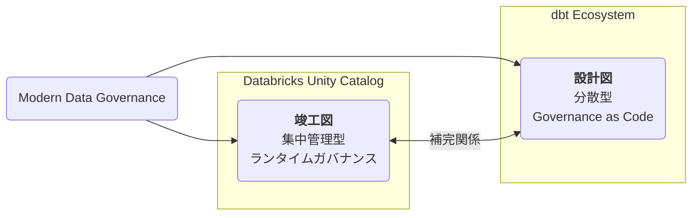
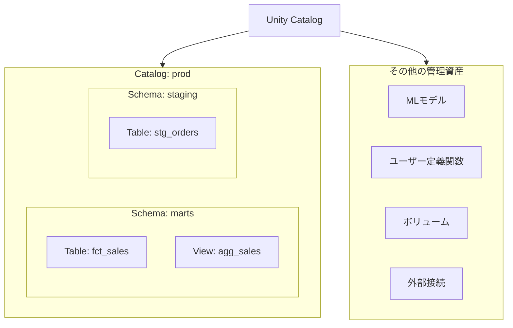
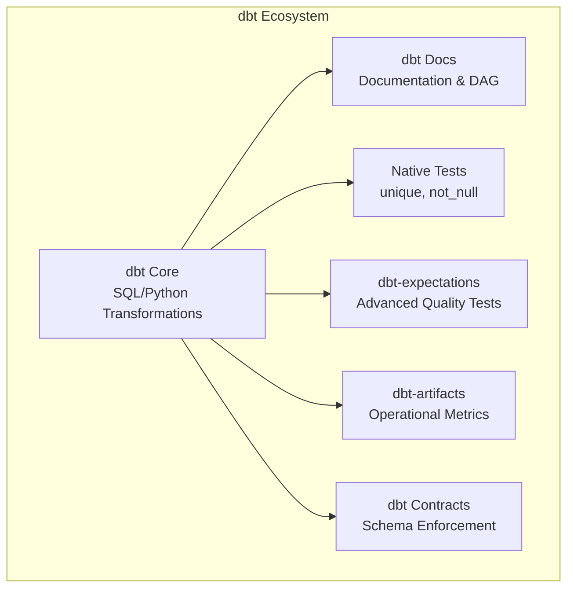
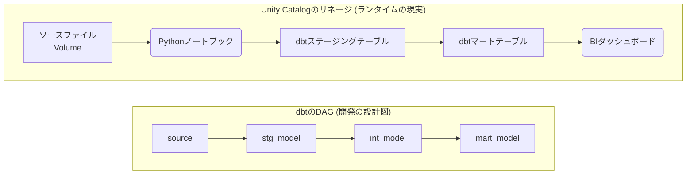
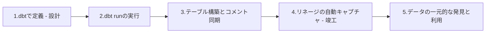

Databricksとdbtを導入したものの、「両者の豊富なガバナンス機能をどう使い分ければ良いのか？」と悩んでいませんか？

この記事では、Databricks Unity Catalogとdbtエコシステムが、データガバナンスにおいて**どのような役割分担を担うのか**を分析します。これらは競合する製品ではなく、現代のデータガバナンスを実現するための**補完的なパートナー**です。両者の関係性は、建築における「設計図」と「竣工図」に例えることができます。

  * **設計図**: 建築の**意図**を示す、計画段階の完成図
  * **竣工図**: 施工完了後の**事実**を表す、実際の状態の図面

<!-- end list -->

| 要素名 | 説明 |
| :--- | :--- |
| **Databricks Unity Catalog** | Databricksプラットフォーム上の全資産を管理する、実行時の**信頼できる情報源（竣工図）** |
| **dbt Ecosystem** | 開発ワークフローにガバナンスを組み込む、コードベースの**フレームワーク（設計図）** |
| **補完関係** | それぞれが異なる側面を担い、組み合わせることで堅牢なデータプラットフォームを構築 |

Unity Catalogは、Databricksプラットフォーム上の全資産を管理する**集中管理型のランタイムガバナンス**です。一方、dbtエコシステムは、開発ワークフローにガバナンスを組み込む**分散型の「Governance as Code」フレームワーク**です。

両者の強みを組み合わせることで、堅牢で信頼性の高いデータプラットフォームを構築できます。

### 1. Databricks Unity Catalog：集中管理型ガバナンスハブ（竣工図）

Unity Catalogは、Databricksレイクハウス全体のデータとAI資産を統括管理する、権威あるガバナンスレイヤーとして機能します。

#### 1.1. アーキテクチャと管理対象

Unity Catalogは、`catalog.schema.table`の3レベルの名前空間で、ワークスペースを横断してデータを統合管理します。その管理範囲はテーブルデータに限定されず、多様な資産を包括的に扱います。

| 要素名 | 説明 |
| :--- | :--- |
| **Unity Catalog** | 全てのデータ資産とAI資産を管理するトップレベルのコンテナ |
| **Catalog** | データを組織化するための最上位の名前空間（例：`prod`, `dev`） |
| **Schema** | カタログ内の論理的なグループ（データベースに相当） |
| **Table/View** | スキーマ内に存在する構造化データ資産 |
| **その他の管理資産** | テーブル以外の、MLモデルや非構造化データ、外部接続など、ガバナンス対象となる資産 |

  * **データ資産**
      * テーブル（マネージド、外部）
      * ビュー
      * ボリューム（非構造化データ）
  * **AI・ロジック資産**
      * 機械学習モデル
      * ユーザー定義関数（UDF）
  * **外部接続**
      * ストレージ認証情報
      * 外部ロケーション
      * フェデレーション接続

この広範な管理範囲がUnity Catalogの最大の強みです。dbtが生成した資産だけでなく、生のデータソースやAIモデルまで、プラットフォーム上のあらゆる資産を一元管理できます。

#### 1.2. 自動化されたデータリネージ

Unity Catalogは、Databricks上で実行されるすべてのワークロードのデータリネージを、カラムレベルまで自動的にキャプチャします。

  * **ランタイムベースの記録**
      * 実際に実行された処理の**事実**に基づき、データフローを記録します。
      * SQL、Python、R、Scalaなど、言語を問いません。
  * **包括的な対象**
      * テーブル間の依存関係だけでなく、処理に使用されたノートブック、ジョブ、ダッシュボードもリネージグラフに含まれます。
  * **高いアクセス性**
      * リネージグラフはUI、システムテーブル、REST API経由で探索できます。

dbtのリネージが「設計図」であるのに対し、Unity Catalogのリネージは**「竣工図」**に相当し、監査や影響分析において信頼性の高い情報源となります。

#### 1.3. 統一された管理機能

標準的なANSI SQL構文に基づき、セキュリティ、監査、データディスカバリの機能を中央集権的に提供します。

  * **アクセス制御**
      * `GRANT`/`REVOKE`ステートメントで、すべてのオブジェクトに対して詳細なアクセス制御を適用します。
      * 権限はプラットフォームレベルで強制されるため、アクセス手段（dbtジョブ、ノートブック、BIツールなど）を問いません。
  * **監査**
      * データアクセスに関する詳細なユーザーレベルの監査ログを自動でキャプチャし、コンプライアンス遵守を支援します。
  * **データディスカバリ**
      * 強力な検索機能、タグ付け、AIによるドキュメント自動生成機能などを提供し、データ利用者が目的の資産を発見しやすくします。

### 2. dbtエコシステム：Governance as Code（設計図）

dbtは、ドキュメント、テスト、データコントラクト（契約）といったガバナンス要素を、データ変換ロジックと共にコードとして管理するフレームワークです。エコシステムは、中核となる`dbt Core`と、その機能を拡張する様々なパッケージで構成されます。

| 要素名 | 説明 |
| :--- | :--- |
| **dbt Core** | データ変換ロジックを定義する中核機能 |
| **dbt Docs** | プロジェクトのドキュメントと依存関係グラフ（DAG）を生成 |
| **Native Tests** | `unique`や`not_null`など、基本的なデータ品質テスト |
| **dbt-expectations** | 高度で宣言的なデータ品質テストを提供する拡張パッケージ |
| **dbt-artifacts** | dbtの実行結果を分析し、運用メトリクスを可視化するパッケージ |
| **dbt Contracts** | モデルの出力スキーマを事前に定義し、強制する機能 |

#### 2.1. dbt Docs：開発者のためのドキュメント

`dbt docs generate`コマンドは、プロジェクトのメタデータから静的なWebサイトを生成します。

  * **主なコンテンツ**
      * モデル、カラム、ソースなどの説明文
      * モデル間の依存関係を示す有向非巡回グラフ（DAG）
      * データ品質テストの定義と実行結果
  * **特徴**
      * ドキュメントが変換ロジックと同じリポジトリで管理されるため、鮮度が保たれやすいです。
      * 変換の「なぜ」と「どのように」を理解するための、開発者にとっての信頼できる情報源として機能します。

#### 2.2. データ品質の拡張 (dbt-expectations)

`dbt-expectations`パッケージは、dbtネイティブのテスト機能を拡張し、より洗練されたデータ品質検証を実現します。

  * **豊富なテストライブラリ**
      * テーブルの行数や統計量、正規表現マッチング、値の分布など、多様な観点からデータを検証できます。
  * **宣言的な定義**
      * 品質要件を`schema.yml`ファイルに宣言的に記述することで、データ品質もバージョン管理の対象となります。
  * **結果の統合**
      * テスト結果はdbt Docsに統合され、データ資産と品質指標を紐づけて確認できます。

#### 2.3. 運用メトリクスの可視化 (dbt-artifacts)

dbtは実行時にプロジェクトの構造や実行結果をJSONファイル（アーティファクト）として出力します。`dbt-artifacts`パッケージはこれらのファイルを解析し、ウェアハウス内のテーブルにロードします。

  * **分析可能なメトリクス**
      * モデルの実行時間とパフォーマンス傾向
      * テストの成功・失敗率の時系列変化
      * モデルの鮮度と依存関係
  * **カスタマイズ性**
      * ロードしたデータをBIツールで可視化することで、dbtワークフローに特化した運用監視ダッシュボードを自由に構築できます。

#### 2.4. 事前ガードレール (dbt Contracts)

モデルコントラクトは、モデルが出力すべきデータの構造（スキーマ）を事前に定義し、強制する機能です。

  * **プロアクティブな品質保証**
      * カラム名、データ型、非NULL制約などを定義します。
      * データテストがモデル構築「後」に実行されるのに対し、コントラクトは構築「前」にチェックされます。
      * コントラクト違反が検知された場合、ビルドは失敗し、不正なデータが書き込まれるのを防ぎます。
  * **責務の明確化**
      * データ生産者と消費者間の公式な合意として機能し、スキーマ変更による下流への影響を未然に防ぎます。

### 3. 機能比較

Unity Catalogとdbtエコシステムは、それぞれ異なる目的とアプローチでデータガバナンスを実現します。

#### 3.1. 機能比較マトリクス

| 能力/情報タイプ | Databricks Unity Catalog | dbt Core | dbt + 拡張機能 |
| :--- | :--- | :--- | :--- |
| **ガバナンスの範囲** | プラットフォーム全体（データ＋AI資産） | dbtプロジェクト固有 | dbtプロジェクト固有 |
| **メタデータソース** | ランタイムでのキャプチャ | コードで定義（YAML） | コードで定義（YAML）および実行結果アーティファクト |
| **リネージの範囲** | ワークロード横断（ノートブック、ジョブ、ダッシュボード） | dbt DAG（モデル、ソース） | dbt DAG（モデル、ソース） |
| **リネージの粒度** | 自動カラムレベル | モデルレベル | モデルレベル |
| **データ品質** | 組み込みモニタリング | ネイティブテスト（`unique`等） | 高度なExpectations（期待値）とContracts（契約） |
| **アクセス制御** | GRANTによるランタイム強制 | コードで定義されたgrants設定 | コードで定義されたgrants設定 |
| **運用モニタリング** | 組み込みシステムテーブル | N/A | アーティファクトモデル上のカスタムダッシュボード |
| **データディスカバリ** | AI検索付き中央集権UI | 静的なプロジェクトウェブサイト | 静的なプロジェクトウェブサイト |

#### 3.2. データリネージ：ランタイムの現実 vs 開発の設計図

両者のリネージ機能は、捉える対象と目的が根本的に異なります。

| 要素名 | 説明 |
| :--- | :--- |
| **Unity Catalogのリネージ** | dbt内外を問わず、データにアクセスした全ての処理（ノートブック、BIツール等）を含む、**実際のデータフロー**を記録 |
| **dbtのDAG** | dbtプロジェクト内で定義されたモデル間の`ref()`関係に基づき、**意図された変換の依存関係**を表現 |

  * **分析**
      * Unity Catalogは「このテーブルは**実際に**どのように構築され、何に使われたか？」に答えます。
      * dbtのDAGは「このモデルはどのように構築される**べき**か？」に答えます。

#### 3.3. その他の比較

  * **ガバナンスの範囲**: Unity Catalogはプラットフォーム全体の「幅」を提供し、dbtは変換レイヤーに特化した「深さ」を提供します。
  * **データ品質**: Unity Catalogはデータの状態を「監視」し、dbtはパイプライン内のデータを「検証」します。
  * **運用モニタリング**: Unity Catalogはすぐに利用可能な「標準機能」を提供し、dbtは高い「カスタマイズ性」を提供します。

### 4. 統合アーキテクチャ

両システムを連携させることで、それぞれの強みを活かした強力なデータプラットフォームを構築できます。

#### 4.1. 連携の要 (dbt-databricksアダプタ)

`dbt-databricks`アダプタが二つのエコシステム間の架け橋となります。このアダプタにより、dbtはUnity Catalogの3レベル名前空間を完全にサポートし、dbtからUnity Catalog内のオブジェクトを操作できます。

#### 4.2. 統一ビューの実現

dbtで定義したドキュメントをUnity Catalogのコメントに同期させることで、開発者の知見とプラットフォームの信頼性を統合するワークフローを実現できます。

| ステップ | 説明 |
| :--- | :--- |
| **1. dbtで定義 (設計)** | 開発者が変換ロジックとドキュメントをコードとして定義 |
| **2. dbt runの実行** | dbtジョブを実行 |
| **3. テーブル構築とコメント同期** | dbt-databricksアダプタがUnity Catalogにテーブルを構築し、dbtのdescriptionをテーブルコメントとして同期 |
| **4. リネージの自動キャプチャ (竣工)** | Unity Catalogがdbtジョブの実行履歴をカラムレベルで自動的に記録 |
| **5. データの一元的な発見と利用** | ビジネスユーザーがUnity Catalog上で、データ、開発者が記述したドキュメント、自動生成されたリネージをまとめて閲覧・利用 |

#### 4.3. 制限事項と対策

連携には注意点も存在します。特に、dbtの`ephemeral`マテリアライゼーション（※中間的な変換ステップを物理テーブルとして保存せず、後続のモデルのCTEとして展開する設定）は、Unity Catalogのカラムレベルリネージの追跡を妨げます。

  * **対策**: 監査や影響分析が重要なデータパイプラインでは、`ephemeral`モデルの使用を避け、代わりに`view`マテリアライゼーションを使用して完全なリネージを確保します。
  * **トレードオフ**: これは「開発者の利便性」と「エンタープライズガバナンス」のトレードオフです。組織の優先順位に基づいたガイドラインの策定が重要です。

### 5. チームにおける役割分担

Unity Catalogとdbtを導入した際の、チーム内の役割ごとのツール利用例を以下に示します。

| ロール | 主な担当領域 | メインで利用するツール | 具体的な用途 | もう一方のツールとの関わり方 |
| :--- | :--- | :--- | :--- | :--- |
| **アナリティクスエンジニア** | データ変換ロジックの開発、テスト、文書化 | dbtエコシステム | ・SQL/Pythonでのデータモデル記述 ・`schema.yml`でのドキュメント、テスト、コントラクトの定義 ・dbt DocsでのDAGやロジックの確認  | ・モデルの出力先としてUnity Catalogを指定 ・記述したドキュメントがUnity Catalogに同期される ・Unity Catalogの横断的なリネージで他資産への影響を確認  |
| **データエンジニア** | データパイプライン全体の設計、構築、運用 | Unity Catalog & Databricksプラットフォーム | ・データ取り込みパイプラインの構築 ・Unity Catalogでのアクセス権設定 ・プラットフォーム全体のパフォーマンス監視 ・CI/CDパイプラインでのdbtジョブ管理  | ・dbtが利用するソーステーブルの準備 ・dbt-artifactsを使い、dbtジョブのパフォーマンスを監視・分析  |
| **データアナリスト / BIデベロッパー** | データの探索、可視化、ダッシュボード作成 | Unity Catalog & BIツール | ・Catalog Explorerでの信頼できるデータ資産の発見 ・カラムのコメントを読み、データの意味を理解 ・カラムレベルリネージでの指標の計算過程の確認 ・BIツールからUnity Catalogへの接続  | ・dbtによって品質保証・文書化されたデータを活用 ・詳細なロジック確認のためにdbt Docsを参照  |
| **データサイエンティスト / MLエンジニア** | 機械学習モデルの構築、訓練、デプロイ | Unity Catalog & MLflow | ・特徴量テーブルの発見と理解 ・ノートブックでの特徴量エンジニアリング ・訓練済みモデルのUnity Catalogへの登録 ・データからモデルまでのエンドツーエンドのリネージ追跡  | ・dbtで作成された特徴量テーブルをモデルの入力として利用  |
| **データスチュワード / ガバナンス担当者** | ガバナンスポリシーの策定、強制、監査 | Unity Catalog | ・データ資産アクセス権の一元管理 ・監査ログのレビューによるアクセス監視 ・機密データへのタグ付けやポリシー適用 ・リネージを活用した影響範囲分析  | ・dbtの「Governance as Code」アプローチを推奨 ・dbtから同期されたメタデータを確認し、カタログの充実度を評価  |

### まとめ

Unity Catalogとdbtエコシステムの関係は、まさに「竣工図」と「設計図」です。

  * **Unity Catalog（竣工図）：利用者の世界**
      * データアナリストやビジネスユーザーが利用する、完成されたデータプロダクトの世界です。プラットフォームの**事実**の記録であり、公式な信頼の源泉となります。
  * **dbtエコシステム（設計図）：開発者の世界**
      * データプロダクトがどのように作られたか、そのビジネスロジックや品質基準がコードとして定義されています。データプロダクトの**意図**の源泉です。

成功するデータ組織は、この両側面を連携させます。開発者が「設計図」としてdbtで高品質なデータモデルを構築し、その成果とドキュメントが「竣工図」であるUnity Catalogに自動的に反映される。このサイクルを確立することで、全ての関係者が自信を持ってデータを活用できる、成熟したデータカルチャーが実現するのです。

この記事が少しでも参考になった、あるいは改善点などがあれば、ぜひリアクションやコメント、SNSでのシェアをいただけると励みになります！

-----

### 引用リンク

  - **Unity Catalog**
      - [What is Unity Catalog? | Databricks on AWS](https://docs.databricks.com/aws/en/data-governance/unity-catalog/)
      - [What is Unity Catalog? - Azure Databricks - Microsoft Learn](https://learn.microsoft.com/en-us/azure/databricks/data-governance/unity-catalog/)
      - [Unified Governance for All Data and AI Assets - Databricks](https://www.databricks.com/resources/demos/videos/data-governance/unity-catalog-overview)
      - [View data lineage using Unity Catalog | Databricks on AWS](https://docs.databricks.com/aws/en/data-governance/unity-catalog/data-lineage)
      - [Data Lineage With Unity Catalog - Databricks](https://www.databricks.com/resources/demos/videos/lakehouse-platform/data-lineage-with-unity-catalog)
      - [Add comments to data and AI assets - Azure Databricks | Microsoft Learn](https://learn.microsoft.com/en-us/azure/databricks/comments/)
      - [Databricks Unity Catalog: Overview & Setup Guide (2025) - Atlan](https://atlan.com/databricks-unity-catalog/)
      - [Data Lineage for Databricks: Step-by-Step Setup Guide - Atlan](https://atlan.com/databricks-lineage/)
  - **dbt (全般・Docs)**
      - [What is dbt? | dbt Developer Hub - dbt Docs](https://docs.getdbt.com/docs/introduction)
      - [Documentation with dbt - The Data School](https://www.thedataschool.co.uk/edward-hayter/documentation-with-dbt/)
      - [dbt docs generate & serve: Command Usage and Examples - PopSQL](https://popsql.com/learn-dbt/dbt-docs)
      - [Understanding dbt. Documentation - Mykola-Bohdan Vynnytskyi - Medium](https://mbvyn.medium.com/understanding-dbt-documentation-b65b12d4c347)
      - [Materializations | dbt Developer Hub - dbt Docs](https://docs.getdbt.com/docs/build/materializations)
      - [DBT: what is the materialized ephemeral? | by Life-is-short--so--enjoy-it | Medium](https://medium.com/@life-is-short-so-enjoy-it/dbt-what-is-the-materialized-ephemeral-891f034b30aa)
  - **dbt-expectations**
      - [dbt-expectations: What it is and how to use it to find data quality issues | Metaplane](https://www.metaplane.dev/blog/dbt-expectations)
      - [How to use dbt-expectations to detect data quality issues - Datafold](https://www.datafold.com/blog/dbt-expectations)
      - [Testing Data Pipelines with dbt-expectations: A Beginner's Guide - Airbyte](https://airbyte.com/blog/testing-with-dbt-expectations)
  - **dbt-artifacts**
      - [About dbt artifacts | dbt Developer Hub - dbt Docs](https://docs.getdbt.com/reference/artifacts/dbt-artifacts)
      - [dbt Artifacts: a full guide - Elementary Data](https://www.elementary-data.com/post/dbt-artifacts-a-full-guide)
      - [What Are dbt Artifacts - phData](https://www.phdata.io/blog/what-are-dbt-artifacts/)
      - [dbt_artifacts - dbt - Package hub](https://hub.getdbt.com/brooklyn-data/dbt_artifacts/latest/)
  - **dbt Contracts**
      - [Model contracts | dbt Developer Hub - dbt Docs - dbt Labs](https://docs.getdbt.com/docs/mesh/govern/model-contracts)
      - [contract | dbt Developer Hub](https://docs.getdbt.com/reference/resource-configs/contract)
  - **dbtとDatabricksの連携**
      - [Databricks setup | dbt Developer Hub - dbt Docs](https://docs.getdbt.com/docs/core/connect-data-platform/databricks-setup)
      - [Best practices for dbt and Unity Catalog | dbt Developer Hub - dbt Docs](https://docs.getdbt.com/best-practices/dbt-unity-catalog-best-practices)
      - [Productionize your dbt Databricks project | dbt Developer Hub - dbt Docs](https://docs.getdbt.com/guides/productionize-your-dbt-databricks-project)
      - [Loss of UC column-level lineage due to use of 'temporary views' in 'ephemeral' materialization #979 - GitHub](https://github.com/databricks/dbt-databricks/issues/979)
      - [dbt + Databricks: How They Best Work Together - lakeFS](https://lakefs.io/blog/dbt-databricks-work-together/)